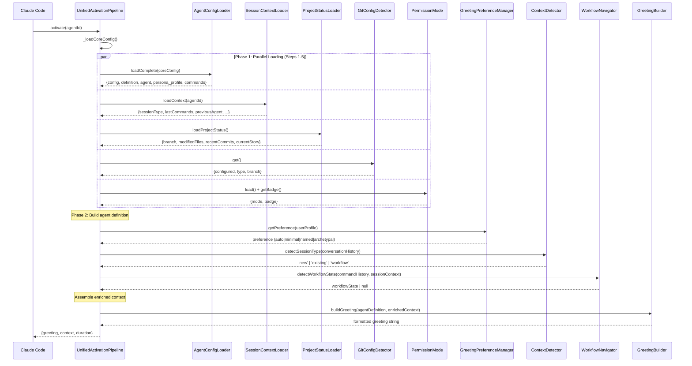
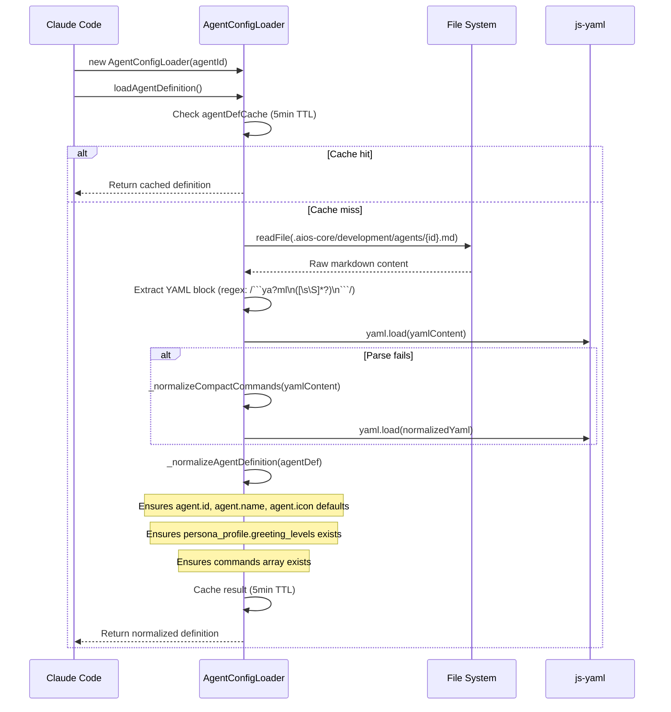
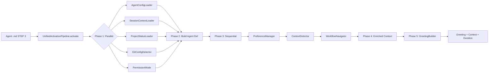
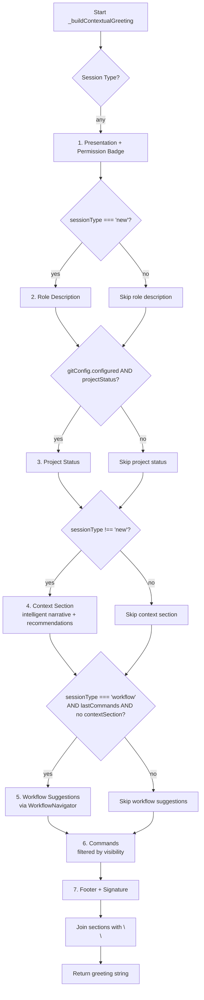
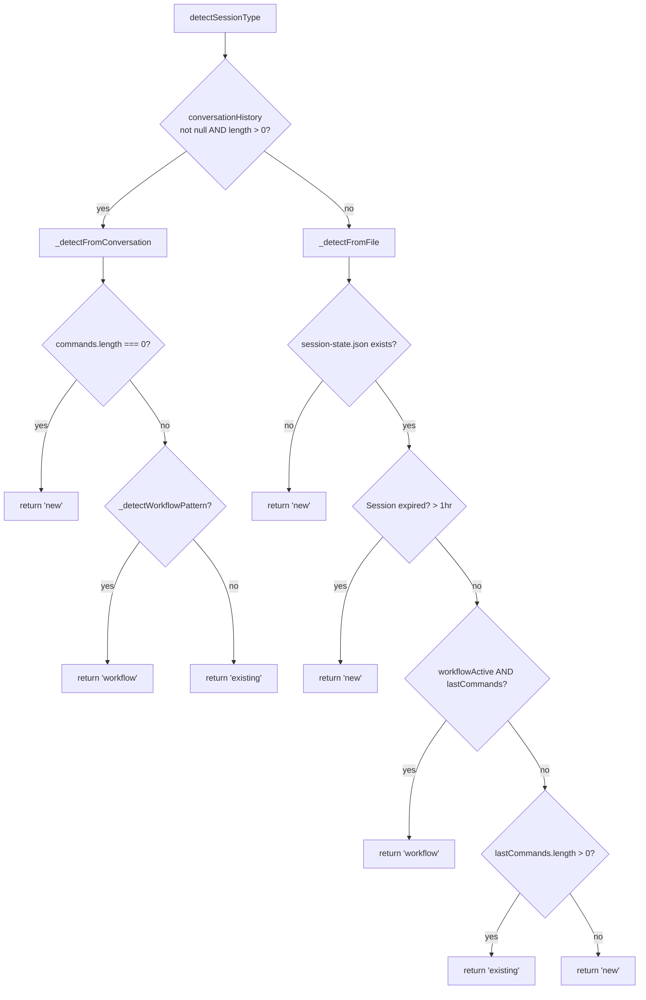
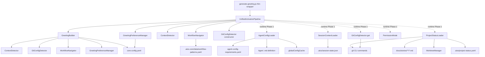

# Shared Activation Pipeline - Common Agent Activation Chain

> Traced from source code, not documentation.
> Source: `.aios-core/development/scripts/unified-activation-pipeline.js` (Story ACT-6)
> Previous source: `.aios-core/development/scripts/greeting-builder.js` (949 lines)

## Overview

Every AIOS agent goes through a **single unified activation pipeline** before presenting its greeting. As of Story ACT-6, the previous two-path architecture (Path A: direct GreetingBuilder invocation, Path B: generate-greeting.js CLI wrapper) has been consolidated into one entry point.

| Component | Role |
|-----------|------|
| **UnifiedActivationPipeline** | Single entry point for ALL 12 agents. Orchestrates parallel loading, sequential detection, and greeting build. |
| **generate-greeting.js** | Thin CLI wrapper that delegates to `ActivationRuntime.activate()`. Retained for backward compatibility. |
| **GreetingBuilder** | Core greeting assembly engine. Called by the pipeline with pre-loaded enriched context. |

All 12 agents use the same effective path:
```
Agent .md STEP 3 → ActivationRuntime.activate(agentId) → UnifiedActivationPipeline.activate(agentId) → GreetingBuilder.buildGreeting(agent, enrichedContext)
```

### Canonical Runtime Entry (Codex/Claude shared)

To avoid IDE-specific drift, activation now has a canonical wrapper:

```
ActivationRuntime.activate(agentId) -> UnifiedActivationPipeline.activate(agentId)
```

Current source:
- `.aios-core/development/scripts/activation-runtime.js`
- `.aios-core/development/scripts/unified-activation-pipeline.js`

### Unified Pipeline Architecture (Story ACT-6)



### Previous Architecture (Pre-ACT-6, deprecated)

Two paths existed that converged on the same `GreetingBuilder` class:

| Path | Used By | Entry Point | Status |
|------|---------|-------------|--------|
| **Path A: Direct** | 9 agents | Agent .md STEP 3 called `GreetingBuilder.buildGreeting()` directly | **Replaced** by UnifiedActivationPipeline |
| **Path B: CLI wrapper** | 3 agents (@devops, @data-engineer, @ux-design-expert) | `generate-greeting.js` orchestrated context loading | **Replaced** -- generate-greeting.js is now a thin wrapper |

---

## 1. Agent File Loading (STEP 1-2)

Before the activation pipeline begins, Claude Code loads and parses the agent definition file.

### 1.1 File Location

```
.aios-core/development/agents/{agent-id}.md
```

### 1.2 Parsing Flow (via `AgentConfigLoader.loadAgentDefinition()`)

**Source:** `agent-config-loader.js:308-366`



### 1.3 Key Fields Extracted

| Field | Path in YAML | Used For |
|-------|-------------|----------|
| `agent.id` | `agent.id` | Agent identification, config lookup |
| `agent.name` | `agent.name` | Greeting presentation |
| `agent.icon` | `agent.icon` | Greeting prefix |
| `persona_profile.greeting_levels` | `persona_profile.communication.greeting_levels` or `persona_profile.greeting_levels` | Fixed-level greetings |
| `persona_profile.communication.signature_closing` | `persona_profile.communication.signature_closing` | Footer signature |
| `persona.role` | `persona.role` | Role description (new sessions) |
| `commands` | `commands[]` | Command list with visibility metadata |
| `dependencies` | `dependencies.tasks[]`, `.templates[]`, etc. | Task execution references |

---

## 2. Activation Pipeline (STEP 3) -- Unified (Story ACT-6)

### 2.1 Unified Activation Path (ALL 12 agents)

**Source:** `unified-activation-pipeline.js`

All 12 agents use the same activation path. The `UnifiedActivationPipeline.activate(agentId)` method uses ACT-11 tiered loading:

1. **Tier 1 (Critical):** `AgentConfigLoader` (required)
2. **Tier 2 (High):** `PermissionMode` + `GitConfigDetector`
3. **Tier 3 (Best-effort):** `SessionContextLoader` + `ProjectStatusLoader` (+ memories when available)
4. **Sequential:** preference + context detection + workflow detection
5. **Greeting:** `GreetingBuilder.buildGreeting(agentDefinition, enrichedContext)`

**Timeout protection (current):**
- Tier budgets: critical `80ms`, high `120ms`, best-effort `180ms`
- Total pipeline default timeout: `500ms` (config/env overridable)



### 2.2 generate-greeting.js (Thin Wrapper)

**Source:** `generate-greeting.js` (refactored in Story ACT-6)

Previously a full CLI orchestrator for 3 agents, `generate-greeting.js` is now a thin wrapper:

```javascript
async function generateGreeting(agentId) {
  const runtime = new ActivationRuntime();
  const result = await runtime.activate(agentId);
  return result.greeting;
}
```

This maintains backward compatibility for any code that still calls `generateGreeting()` directly.

### 2.3 Enriched Context Object Shape

The enriched context passed to GreetingBuilder contains:

```javascript
{
  agent,              // Agent definition (id, name, icon, title, commands, persona)
  config,             // Agent-specific config sections
  session,            // Session context (sessionType, lastCommands, previousAgent, ...)
  projectStatus,      // Git status (branch, modifiedFiles, recentCommits, currentStory)
  gitConfig,          // Git config (configured, type, branch)
  permissions,        // Permission mode (mode, badge)
  preference,         // Greeting preference (auto|minimal|named|archetypal)
  sessionType,        // Detected session type (new|existing|workflow)
  workflowState,      // Workflow state (if in workflow session)
  userProfile,        // User profile (bob|advanced)
  conversationHistory, // Conversation history for context detection
  lastCommands,       // Recent agent commands
  previousAgent,      // Previously active agent
  sessionMessage,     // Session-specific message
  workflowActive,     // Active workflow info
  sessionStory,       // Current story being worked on
}
```

### 2.4 Previous Architecture (Pre-ACT-6, deprecated)

Before Story ACT-6, two separate paths existed:

| Path | Agents | Entry Point | Context Richness |
|------|--------|-------------|-----------------|
| Path A (Direct) | 9 agents | GreetingBuilder.buildGreeting() directly | Limited -- no AgentConfigLoader, no SessionContextLoader |
| Path B (CLI) | 3 agents (@devops, @data-engineer, @ux-design-expert) | generate-greeting.js | Rich -- full parallel loading |

This divergence meant Path A agents lacked session state, project status details, and agent-specific config that Path B agents received. The unified pipeline eliminates this gap.

---

## 3. Greeting Section Assembly

**Source:** `greeting-builder.js:91-141`

When `preference === 'auto'`, the greeting is assembled from ordered sections:



### 3.1 Section Details

| # | Section | Method | Condition | Data Source |
|---|---------|--------|-----------|-------------|
| 1 | Presentation | `buildPresentation()` | Always | `persona_profile.greeting_levels.archetypal` + PermissionMode badge |
| 2 | Role Description | `buildRoleDescription()` | `sessionType === 'new'` | `persona.role` |
| 3 | Project Status | `buildProjectStatus()` | `gitConfig.configured && projectStatus` | ProjectStatusLoader (branch, files, commits, story) |
| 4 | Context | `buildContextSection()` | `sessionType !== 'new'` | Intelligent narrative from previous agent, modified files, story |
| 5 | Workflow Suggestions | `buildWorkflowSuggestions()` | `sessionType === 'workflow' && lastCommands && !contextSection` | WorkflowNavigator + workflow-patterns.yaml |
| 6 | Commands | `buildCommands()` | Always | `filterCommandsByVisibility()` - max 12 commands |
| 7 | Footer | `buildFooter()` | Always | `persona_profile.communication.signature_closing` |

### 3.2 Command Visibility Filtering

**Source:** `greeting-builder.js:815-857`

| Session Type | Visibility Filter | Shows Commands With |
|-------------|-------------------|---------------------|
| `new` | `full` | `visibility: [full, ...]` |
| `existing` | `quick` | `visibility: [..., quick, ...]` |
| `workflow` | `key` | `visibility: [..., key, ...]` |

If no commands have visibility metadata, falls back to first 12 commands.

---

## 4. Context Detection (Session Type)

**Source:** `context-detector.js:22-101`



**Workflow patterns detected:**
- `story_development`: validate-story-draft, develop, review-qa
- `epic_creation`: create-epic, create-story, validate-story-draft
- `backlog_management`: backlog-review, backlog-prioritize, backlog-schedule

---

## 5. Git Config Detection

**Source:** `git-config-detector.js:19-294`

| Property | Command | Timeout | Cache TTL |
|----------|---------|---------|-----------|
| `configured` | `git rev-parse --is-inside-work-tree` | 1s | 5 min |
| `branch` | `git branch --show-current` | 1s | 5 min |
| `type` | `git config --get remote.origin.url` | 1s | 5 min |

**Returns:** `{ configured: boolean, type: 'github'|'gitlab'|'bitbucket'|'other'|null, branch: string|null }`

---

## 6. Project Status Loading

**Source:** `project-status-loader.js:20-524`

| Data Point | Git Command | Cache TTL |
|------------|-------------|-----------|
| `branch` | `git branch --show-current` | 60s |
| `modifiedFiles` | `git status --porcelain` (max 5) | 60s |
| `modifiedFilesTotalCount` | Count from porcelain output | 60s |
| `recentCommits` | `git log -2 --oneline --no-decorate` | 60s |
| `currentStory` | Scan `docs/stories/` for `Status: InProgress` | 60s |
| `currentEpic` | Extracted from story file metadata | 60s |
| `worktrees` | Via WorktreeManager | 60s |

**Cache file:** `.aios/project-status.yaml`

---

## 7. Greeting Preference

**Source:** `greeting-preference-manager.js:18-146`

Reads from `.aios-core/core-config.yaml` path `agentIdentity.greeting.preference`.

| Value | Behavior |
|-------|----------|
| `auto` (default) | Session-aware contextual greeting |
| `minimal` | Always use `greeting_levels.minimal` |
| `named` | Always use `greeting_levels.named` |
| `archetypal` | Always use `greeting_levels.archetypal` |

---

## 8. Permission Mode System (Story ACT-4)

**Source:** `permissions/index.js` + `permissions/permission-mode.js` + `permissions/operation-guard.js`

### 8.1 Overview

The Permission Mode system controls agent autonomy with three modes:

| Mode | Badge | Writes | Executes | Deletes | Default |
|------|-------|--------|----------|---------|---------|
| `explore` | `[Explore]` | Blocked | Blocked | Blocked | No |
| `ask` | `[Ask]` | Confirm | Confirm | Confirm | **Yes** |
| `auto` | `[Auto]` | Allowed | Allowed | Allowed | No |

All modes allow **read** operations unconditionally.

### 8.2 Badge Display

The badge is loaded during greeting assembly (Section 3, step 1) via `_safeGetPermissionBadge()`:

```javascript
const mode = new PermissionMode();
await mode.load();  // Reads .aios/config.yaml -> permissions.mode
return mode.getBadge();  // Returns "[icon Name]"
```

Badge appears next to the agent's archetypal greeting: `"Agent Name ready! [Ask]"`

### 8.3 OperationGuard Enforcement

The `OperationGuard` class classifies every tool call and checks against the current mode:

```
Tool Call → classifyOperation(tool, params) → canPerform(operation) → allow/prompt/deny
```

**Classification rules:**

| Tool | Classification |
|------|---------------|
| Read, Glob, Grep | `read` (always allowed) |
| Write, Edit | `write` |
| Task (read-only subagent) | `read` |
| Task (other) | `execute` |
| Bash (git status, git log, ls, etc.) | `read` |
| Bash (git commit, git push, npm install, etc.) | `write` |
| Bash (rm -rf, git reset --hard, DROP TABLE, etc.) | `delete` |
| MCP tools | `execute` |

### 8.4 `*yolo` Command

Available in all 12 agents. Cycles the mode: `ask` -> `auto` -> `explore` -> `ask`.

**Implementation:** Calls `PermissionMode.cycleMode()` which:
1. Reads current mode from `.aios/config.yaml`
2. Advances to next mode in `MODE_CYCLE` array
3. Writes new mode back to config
4. Returns updated mode info with badge

### 8.5 Integration Points

The `enforcePermission()` function provides a clean API for permission enforcement:

```javascript
const { enforcePermission } = require('./.aios-core/core/permissions');

const result = await enforcePermission('Write', { file_path: '/file.js' });
// result.action: 'allow' | 'prompt' | 'deny'
// result.message: User-facing explanation (for prompt/deny)
```

### 8.6 Config Initialization

The `environment-bootstrap` task initializes `.aios/config.yaml` with `permissions.mode: ask` as the default. If the config file is missing or the field is absent, the system defaults to `ask` mode.

---

## 9. Config Loading Per Agent

**Source:** `agent-config-loader.js:49-160` + `agent-config-requirements.yaml`

Each agent has specific config requirements defined in `.aios-core/data/agent-config-requirements.yaml`:

| Agent | Config Sections | Files Loaded | Performance Target |
|-------|----------------|--------------|-------------------|
| `aios-master` | dataLocation, registry | aios-kb.md (lazy) | <30ms |
| `dev` | devLoadAlwaysFiles, devStoryLocation, dataLocation | coding-standards.md, tech-stack.md, source-tree.md, technical-preferences.md | <50ms |
| `qa` | qaLocation, dataLocation, storyBacklog | technical-preferences.md, test-levels-framework.md, test-priorities-matrix.md | <50ms |
| `devops` | dataLocation, cicdLocation | technical-preferences.md | <50ms |
| `architect` | architecture, dataLocation, templatesLocation | technical-preferences.md | <75ms |
| `po` | devStoryLocation, prd, storyBacklog, templatesLocation | elicitation-methods.md | <75ms |
| `sm` | devStoryLocation, storyBacklog, dataLocation | mode-selection-best-practices.md, workflow-patterns.yaml, coding-standards.md | <75ms |
| `data-engineer` | dataLocation, etlLocation | technical-preferences.md | <75ms |
| `pm` | devStoryLocation, storyBacklog | coding-standards.md, tech-stack.md | <100ms |
| `analyst` | dataLocation, analyticsLocation | brainstorming-techniques.md, tech-stack.md, source-tree.md | <100ms |
| `ux-design-expert` | dataLocation, uxLocation | tech-stack.md, coding-standards.md | <100ms |
| `squad-creator` | dataLocation, squadsTemplateLocation | (none, lazy: agent_registry, squad_manifest) | <150ms |

> **Story ACT-8 changes:** Enriched pm (+2 files), ux-design-expert (+2 files), analyst (+2 files), sm (+1 file), squad-creator (explicit entry with lazy loading). All within performance targets.

---

## 10. Files Loaded During Activation (Complete List)

### Always loaded (every agent activation)

| File | Loader | Purpose |
|------|--------|---------|
| `.aios-core/development/agents/{agent-id}.md` | AgentConfigLoader | Agent definition |
| `.aios-core/core-config.yaml` | GreetingBuilder._loadConfig() | Core configuration |
| `.aios-core/data/agent-config-requirements.yaml` | AgentConfigLoader.loadRequirements() | Per-agent config needs |
| `.aios-core/data/workflow-patterns.yaml` | WorkflowNavigator._loadPatterns() | Workflow state detection |

### Loaded conditionally

| File | Condition | Loader |
|------|-----------|--------|
| `.aios/session-state.json` | Path B (CLI wrapper) or file-based session detection | ContextDetector / SessionContextLoader |
| `.aios/project-status.yaml` | Cache check (60s TTL) | ProjectStatusLoader |
| `docs/stories/**/*.md` | When scanning for InProgress story | ProjectStatusLoader.getCurrentStoryInfo() |
| Agent-specific data files | Per agent-config-requirements.yaml | AgentConfigLoader.loadFile() |

---

## 11. Error Handling & Fallbacks

The entire pipeline is protected with multiple fallback layers:

### 11.1 UnifiedActivationPipeline Fallbacks (Story ACT-6)

| Component | Fallback | Source |
|-----------|----------|--------|
| UnifiedActivationPipeline.activate() | `_generateFallbackGreeting(agentId)` on any unrecoverable error | unified-activation-pipeline.js |
| `_safeLoad()` (per-loader) | Returns `null` on failure; 150ms per-loader timeout | unified-activation-pipeline.js |
| Total pipeline | `_timeoutFallback()` at 200ms returns fallback greeting | unified-activation-pipeline.js |
| `_detectSessionType()` | Returns `'new'` on failure | unified-activation-pipeline.js |
| `_detectWorkflowState()` | Returns `null` on failure | unified-activation-pipeline.js |

### 11.2 GreetingBuilder Fallbacks (unchanged)

| Component | Fallback | Source |
|-----------|----------|--------|
| GreetingBuilder.buildGreeting() | `buildSimpleGreeting()` | greeting-builder.js:60 |
| _buildContextualGreeting() | 150ms timeout | greeting-builder.js:73-77 |
| ContextDetector.detectSessionType() | Returns `'new'` | greeting-builder.js:869 |
| GitConfigDetector.get() | `{ configured: false }` | greeting-builder.js:883 |
| ProjectStatusLoader | `null` | greeting-builder.js:897 |
| PermissionMode.getBadge() | `''` (empty string) | greeting-builder.js:913 |

### 11.3 generate-greeting.js Fallback (thin wrapper)

| Component | Fallback | Source |
|-----------|----------|--------|
| generateGreeting() | `generateFallbackGreeting()` if pipeline throws | generate-greeting.js |

---

## 12. Constructor Dependency Graph



---

## 13. `user_profile` Impact Matrix (Story ACT-2)

The `user_profile` setting (`bob` or `advanced`) affects behavior across the entire AIOS pipeline. This section documents every file that references `user_profile`/`userProfile` and the behavioral difference between modes.

### 13.1 Bob Mode Flow

```
Installation → user selects "bob" → core-config.yaml: user_profile: bob
                                   → user-config.yaml: user_profile: bob (L5 layer)
                                   ↓
Activation → loadUserProfile() → validateUserProfile() → resolveConfig(L5 priority)
           → GreetingPreferenceManager: forces "named" (or "minimal")
           → GreetingBuilder: redirect non-PM agents to @pm
           → filterCommandsByVisibility: returns [] for non-PM
```

### 13.2 Impact Matrix: Source Files

| # | File | Category | `bob` Behavior | `advanced` Behavior |
|---|------|----------|----------------|---------------------|
| 1 | `.aios-core/core-config.yaml` | Config | `user_profile: bob` | `user_profile: advanced` |
| 2 | `.aios-core/development/scripts/greeting-builder.js` | Greeting | Redirects non-PM agents to @pm; hides role/status sections; returns empty commands for non-PM | Full contextual greeting with all sections and commands |
| 3 | `.aios-core/development/scripts/generate-greeting.js` | Greeting | Uses GreetingBuilder, same bob restrictions | Uses GreetingBuilder, full features |
| 4 | `.aios-core/development/scripts/greeting-preference-manager.js` | Greeting | Forces preference to `minimal` or `named`; overrides `auto`/`archetypal` | All 4 preferences available (`auto`, `minimal`, `named`, `archetypal`) |
| 5 | `.aios-core/infrastructure/scripts/validate-user-profile.js` | Validation | Validates `bob` as legal value; normalizes case | Validates `advanced` as legal value; normalizes case |
| 6 | `.aios-core/core/config/config-resolver.js` | Config | `toggleUserProfile()` switches bob<->advanced; L5 user layer has priority | Same toggle; resolveConfig merges layers |
| 7 | `.aios-core/core/config/migrate-config.js` | Config | Categorizes `user_profile` as USER_FIELD during migration | Same categorization |
| 8 | `.aios-core/core/config/schemas/user-config.schema.json` | Schema | `enum: ["bob", "advanced"]` validation | Same validation |
| 9 | `.aios-core/core/config/templates/user-config.yaml` | Template | Default template value: `bob` | N/A (template default is bob) |
| 10 | `.aios-core/development/agents/pm.md` | Agent | PM becomes sole orchestrator; bob mode session detection; orchestrates other agents internally | PM operates as normal PM with standard workflow |
| 11 | `packages/installer/src/wizard/questions.js` | Install | Presents bob/advanced choice during setup | Same prompt |
| 12 | `packages/installer/src/wizard/index.js` | Install | Writes `user_profile: bob`; idempotent on re-install | Writes `user_profile: advanced` |
| 13 | `packages/installer/src/wizard/i18n.js` | Install | Translated "Assisted Mode" text (en/pt/es) | Translated "Advanced Mode" text |
| 14 | `packages/installer/src/config/templates/core-config-template.js` | Install | Generates config with `user_profile: bob` | Generates config with `user_profile: advanced` |
| 15 | `packages/installer/src/config/configure-environment.js` | Install | Passes `userProfile: 'bob'` to config generation | Passes `userProfile: 'advanced'` |
| 16 | `packages/aios-install/src/installer.js` | Install | Sets `config.user_profile = 'bob'` in YAML | Sets `config.user_profile = 'advanced'` |
| 17 | `.aios-core/development/tasks/environment-bootstrap.md` | Task | Documents bob selection flow | Documents advanced selection flow |
| 18 | `docs/aios-workflows/bob-orchestrator-workflow.md` | Docs | Full bob orchestrator workflow documentation | N/A (bob-specific doc) |

### 13.3 Impact Matrix: Agent Command Visibility

In `bob` mode, non-PM agents return **empty command lists** (redirect to @pm shown instead). PM agent shows all commands normally.

| Agent | `key` Commands Count | Bob Mode Result | Advanced Mode (`new` session) |
|-------|---------------------|-----------------|-------------------------------|
| `@pm` | 4 (`help`, `status`, `run`, `exit`) | All commands shown (PM is primary interface) | Full visibility commands |
| `@dev` | 4 (`help`, `apply-qa-fixes`, `run-tests`, `exit`) | Empty (redirect to @pm) | Full visibility commands |
| `@qa` | 0 (no visibility metadata) | Empty (redirect to @pm) | Fallback: first 12 commands |
| `@architect` | 3 (`help`, `create-doc`, `exit`) | Empty (redirect to @pm) | Full visibility commands |
| `@po` | 4 (`help`, `validate`, `gotcha`, `gotchas`) | Empty (redirect to @pm) | Full visibility commands |
| `@sm` | 2 (`help`, `draft`) | Empty (redirect to @pm) | Full visibility commands |
| `@analyst` | 2 (`help`, `exit`) | Empty (redirect to @pm) | Full visibility commands |
| `@data-engineer` | 0 (no visibility metadata) | Empty (redirect to @pm) | Fallback: first 12 commands |
| `@devops` | 0 (no visibility metadata) | Empty (redirect to @pm) | Fallback: first 12 commands |
| `@ux-design-expert` | 0 (no visibility metadata) | Empty (redirect to @pm) | Fallback: first 12 commands |
| `@squad-creator` | 7 (most have `key`) | Empty (redirect to @pm) | Full visibility commands |
| `@aios-master` | 0 (uses string visibility) | Empty (redirect to @pm) | Fallback: first 12 commands |

**Note:** Agents with 0 `key` commands (`qa`, `data-engineer`, `devops`, `ux-design-expert`, `aios-master`) lack `visibility` array metadata on their commands. In `advanced` mode `workflow` sessions, they fall back to showing first 12 commands. This is a known gap tracked for future improvement.

### 13.4 Validation Pipeline Integration

```
┌─────────────────────────────────────────────────────────────────┐
│              user_profile Validation in Pipeline                 │
├─────────────────────────────────────────────────────────────────┤
│                                                                  │
│  1. INSTALLATION (packages/installer)                           │
│     └─ wizard prompts for user_profile → writes to config       │
│                                                                  │
│  2. CONFIG RESOLUTION (core/config/config-resolver.js)          │
│     └─ resolveConfig() merges L1-L5 layers                     │
│     └─ L5 (user-config.yaml) has highest priority               │
│                                                                  │
│  3. ACTIVATION PIPELINE (unified-activation-pipeline.js) ACT-6   │
│     └─ UnifiedActivationPipeline.activate(agentId)              │
│     └─ loadUserProfile() calls resolveConfig()                  │
│     └─ validateUserProfile() runs on resolved value             │
│     └─ Invalid values → warn + fallback to 'advanced'           │
│     └─ Valid value → passed to preference manager + greeting    │
│                                                                  │
│  4. GREETING BUILD (greeting-builder.js + preference-manager)   │
│     └─ bob: preference forced to named/minimal                  │
│     └─ bob + non-PM: redirect message shown                     │
│     └─ bob + PM: full contextual greeting                       │
│     └─ advanced: normal greeting with all features              │
│                                                                  │
└─────────────────────────────────────────────────────────────────┘
```

---

*Traced from source on 2026-02-05 | Story AIOS-TRACE-001*
*Updated on 2026-02-06 | Story ACT-2 - user_profile impact matrix added*
*Updated on 2026-02-06 | Story ACT-6 - Unified Activation Pipeline (Path A/B merged)*
*Updated on 2026-02-06 | Story ACT-8 - Config governance: enriched pm, ux-design-expert, analyst, sm, squad-creator*
