# Sistema do Agente @aios-master

> **Versão:** 1.0.0
> **Criado:** 2026-02-04
> **Owner:** @aios-master (Orion)
> **Status:** Documentação Oficial

---

## Visão Geral

O **@aios-master** (Orion - The Orchestrator) e o meta-agente principal do framework AIOS-FULLSTACK. Ele atua como orquestrador universal, desenvolvedor de framework e especialista no metodo AIOS. Suas principais responsabilidades incluem:

- **Orquestracao Universal**: Executa qualquer task de qualquer agente diretamente
- **Desenvolvimento de Framework**: Cria e modifica agentes, tasks, workflows e templates
- **Gestao de Componentes**: Valida, deprecia e analisa componentes do sistema
- **Coordenacao Multi-Agente**: Gerencia workflows complexos entre multiplos agentes
- **Knowledge Base**: Acesso ao conhecimento completo do AIOS Method

### Quando Usar

- Criar ou modificar componentes do framework (agentes, tasks, workflows)
- Orquestrar workflows multi-agente complexos
- Executar qualquer task diretamente sem transformacao de persona
- Operacoes de meta-framework e coordenacao cross-agente
- Acessar o Knowledge Base do AIOS (*kb)

---

## Lista Completa de Arquivos

### Arquivos Core de Tasks do @aios-master

| Arquivo | Comando | Propósito |
|---------|---------|-----------|
| `.aios-core/development/tasks/create-agent.md` | `*create agent` | Cria nova definicao de agente usando sistema de templates |
| `.aios-core/development/tasks/create-task.md` | `*create task` | Cria novo arquivo de task com estrutura padronizada |
| `.aios-core/development/tasks/create-workflow.md` | `*create workflow` | Cria nova definicao de workflow multi-agente |
| `.aios-core/development/tasks/modify-agent.md` | `*modify agent` | Modifica agente existente com backup e rollback |
| `.aios-core/development/tasks/modify-task.md` | `*modify task` | Modifica task existente preservando compatibilidade |
| `.aios-core/development/tasks/modify-workflow.md` | `*modify workflow` | Modifica workflow existente mantendo integridade |
| `.aios-core/development/tasks/analyze-framework.md` | `*analyze-framework` | Analisa estrutura do framework, redundancias e performance |
| `.aios-core/development/tasks/deprecate-component.md` | `*deprecate-component` | Deprecia componente com timeline e migracao |
| `.aios-core/development/tasks/propose-modification.md` | `*propose-modification` | Cria proposta de modificacao para revisao colaborativa |
| `.aios-core/development/tasks/execute-checklist.md` | `*execute-checklist` | Executa checklist de validação |
| `.aios-core/development/tasks/create-doc.md` | `*create-doc` | Cria documento a partir de template YAML |
| `.aios-core/development/tasks/advanced-elicitation.md` | `*advanced-elicitation` | Executa elicitacao avancada com multiplos metodos |
| `.aios-core/development/tasks/kb-mode-interaction.md` | `*kb` | Habilita modo Knowledge Base interativo |
| `.aios-core/development/tasks/correct-course.md` | `*correct-course` | Analisa e corrige desvios de processo/qualidade |
| `.aios-core/development/tasks/update-manifest.md` | `*update-manifest` | Atualiza manifesto de equipe com novos agentes |
| `.aios-core/development/tasks/create-next-story.md` | `*create-next-story` | Cria proxima user story |
| `.aios-core/development/tasks/create-deep-research-prompt.md` | - | Gera prompts de pesquisa profunda |
| `.aios-core/development/tasks/improve-self.md` | - | Auto-melhoria do agente |
| `.aios-core/development/tasks/shard-doc.md` | `*shard-doc` | Quebra documento em partes menores |
| `.aios-core/development/tasks/document-project.md` | `*document-project` | Gera documentacao do projeto |
| `.aios-core/development/tasks/index-docs.md` | `*index-docs` | Indexa documentacao para busca |

### Arquivos de Definição do Agente

| Arquivo | Propósito |
|---------|-----------|
| `.aios-core/development/agents/aios-master.md` | Definição completa do agente (persona, comandos, dependencias) |
| `.claude/commands/AIOS/agents/aios-master.md` | Comando Claude Code para ativar @aios-master |

### Arquivos de Templates do @aios-master

| Arquivo | Propósito |
|---------|-----------|
| `.aios-core/development/templates/agent-template.yaml` | Template para criação de novos agentes |
| `.aios-core/development/templates/task-template.md` | Template para criação de novas tasks |
| `.aios-core/development/templates/workflow-template.yaml` | Template para criação de novos workflows |
| `.aios-core/development/templates/prd-tmpl.yaml` | Template para PRD |
| `.aios-core/development/templates/story-tmpl.yaml` | Template para stories |
| `.aios-core/development/templates/architecture-tmpl.yaml` | Template para arquitetura |
| `.aios-core/development/templates/brownfield-prd-tmpl.yaml` | Template PRD brownfield |
| `.aios-core/development/templates/brownfield-architecture-tmpl.yaml` | Template arquitetura brownfield |
| `.aios-core/development/templates/competitor-analysis-tmpl.yaml` | Template analise de concorrentes |
| `.aios-core/development/templates/market-research-tmpl.yaml` | Template pesquisa de mercado |
| `.aios-core/development/templates/project-brief-tmpl.yaml` | Template brief de projeto |
| `.aios-core/development/templates/front-end-architecture-tmpl.yaml` | Template arquitetura frontend |
| `.aios-core/development/templates/front-end-spec-tmpl.yaml` | Template spec frontend |
| `.aios-core/development/templates/fullstack-architecture-tmpl.yaml` | Template arquitetura fullstack |

### Arquivos de Dados e Utilidades

| Arquivo | Propósito |
|---------|-----------|
| `.aios-core/development/data/aios-kb.md` | Knowledge Base do AIOS Method |
| `.aios-core/development/data/brainstorming-techniques.md` | Tecnicas de brainstorming |
| `.aios-core/development/data/elicitation-methods.md` | Metodos de elicitacao |
| `.aios-core/development/data/technical-preferences.md` | Preferencias tecnicas |
| `.aios-core/development/utils/security-checker.js` | Validador de seguranca |
| `.aios-core/development/utils/yaml-validator.js` | Validador de YAML |
| `.aios-core/development/utils/workflow-management.md` | Gestao de workflows |

### Arquivos de Workflows do @aios-master

| Arquivo | Propósito |
|---------|-----------|
| `.aios-core/development/workflows/brownfield-fullstack.md` | Workflow fullstack brownfield |
| `.aios-core/development/workflows/brownfield-service.md` | Workflow servico brownfield |
| `.aios-core/development/workflows/brownfield-ui.md` | Workflow UI brownfield |
| `.aios-core/development/workflows/greenfield-fullstack.md` | Workflow fullstack greenfield |
| `.aios-core/development/workflows/greenfield-service.md` | Workflow servico greenfield |
| `.aios-core/development/workflows/greenfield-ui.md` | Workflow UI greenfield |

### Arquivos de Checklists do @aios-master

| Arquivo | Propósito |
|---------|-----------|
| `.aios-core/development/checklists/architect-checklist.md` | Checklist de arquitetura |
| `.aios-core/development/checklists/change-checklist.md` | Checklist de mudancas |
| `.aios-core/development/checklists/pm-checklist.md` | Checklist de PM |
| `.aios-core/development/checklists/po-master-checklist.md` | Checklist de PO |
| `.aios-core/development/checklists/story-dod-checklist.md` | Checklist DoD de stories |
| `.aios-core/development/checklists/story-draft-checklist.md` | Checklist draft de stories |

### Arquivos Relacionados de Outros Agentes

| Arquivo | Agente | Propósito |
|---------|--------|-----------|
| `.aios-core/development/tasks/brownfield-create-epic.md` | @pm | Criacao de epics (delegada) |
| `.aios-core/development/tasks/brownfield-create-story.md` | @pm | Criacao de stories (delegada) |
| `.aios-core/development/tasks/analyst-facilitate-brainstorming.md` | @analyst | Brainstorming (delegado) |
| `.aios-core/development/tasks/generate-ai-frontend-prompt.md` | @architect | Geracao de prompts AI (delegada) |
| `.aios-core/development/tasks/create-suite.md` | @qa | Criacao de suites de teste (delegada) |

---

## Flowchart: Sistema Completo


### Diagrama de Ciclo de Vida de Componentes

```mermaid
stateDiagram-v2
    [*] --> IDEA: *propose-modification

    IDEA --> DRAFT: Usuario aprova
    IDEA --> REJECTED: Usuario rejeita

    DRAFT --> CREATED: *create {type}
    DRAFT --> MODIFIED: *modify {type}

    CREATED --> ACTIVE: Validacao OK
    MODIFIED --> ACTIVE: Validacao OK

    ACTIVE --> ANALYZED: *analyze-framework
    ACTIVE --> DEPRECATED: *deprecate-component

    ANALYZED --> MODIFIED: Melhorias identificadas
    ANALYZED --> ACTIVE: Sem mudancas

    DEPRECATED --> REMOVED: Apos timeline

    REMOVED --> [*]
    REJECTED --> [*]

    note right of IDEA: 💡 Proposta de modificacao
    note right of DRAFT: 📝 Rascunho em progresso
    note right of CREATED: ✨ Componente criado
    note right of ACTIVE: ✅ Em uso no sistema
    note right of DEPRECATED: ⚠️ Marcado para remocao
    note right of REMOVED: 🗑️ Removido do sistema
```



---

## Mapeamento de Comandos para Tasks

### Comandos de Criacao

| Comando | Task File | Operacao |
|---------|-----------|----------|
| `*create agent {name}` | `create-agent.md` | Cria novo agente via elicitacao progressiva |
| `*create task {name}` | `create-task.md` | Cria nova task com estrutura padronizada |
| `*create workflow {name}` | `create-workflow.md` | Cria novo workflow multi-agente |
| `*create-doc {template}` | `create-doc.md` | Cria documento a partir de template YAML |
| `*create-next-story` | `create-next-story.md` | Cria proxima user story |

### Comandos de Modificacao

| Comando | Task File | Operacao |
|---------|-----------|----------|
| `*modify agent {name}` | `modify-agent.md` | Modifica agente com backup/rollback |
| `*modify task {name}` | `modify-task.md` | Modifica task preservando compatibilidade |
| `*modify workflow {name}` | `modify-workflow.md` | Modifica workflow mantendo integridade |
| `*update-manifest` | `update-manifest.md` | Atualiza manifesto de equipe |
| `*propose-modification` | `propose-modification.md` | Cria proposta de modificacao |

### Comandos de Analise e Validacao

| Comando | Task File | Operacao |
|---------|-----------|----------|
| `*analyze-framework` | `analyze-framework.md` | Analise completa do framework |
| `*deprecate-component` | `deprecate-component.md` | Deprecia componente com timeline |
| `*execute-checklist {name}` | `execute-checklist.md` | Executa checklist de validação |
| `*validate-component` | - | Valida seguranca e padroes |
| `*correct-course` | `correct-course.md` | Corrige desvios de processo |

### Comandos de Execucao

| Comando | Task File | Operacao |
|---------|-----------|----------|
| `*task {name}` | (dinamico) | Executa task especifica |
| `*workflow {name}` | (dinamico) | Inicia workflow multi-agente |
| `*plan [create\|status\|update]` | - | Planejamento de workflow |

### Comandos de Utilidade

| Comando | Task File | Operacao |
|---------|-----------|----------|
| `*help` | - | Mostra comandos disponiveis |
| `*kb` | `kb-mode-interaction.md` | Toggle modo Knowledge Base |
| `*status` | - | Mostra contexto e progresso atual |
| `*guide` | - | Mostra guia de uso do agente |
| `*yolo` | - | Toggle skip de confirmacoes |
| `*exit` | - | Sai do modo agente |
| `*advanced-elicitation` | `advanced-elicitation.md` | Elicitacao avancada |
| `*shard-doc` | `shard-doc.md` | Quebra documento em partes |
| `*doc-out` | - | Output documento completo |
| `*index-docs` | `index-docs.md` | Indexa documentacao |

---

## Integracoes entre Agentes

### Diagrama de Delegacao


### Quando Usar Agentes Especializados

| Cenario | Agente Recomendado | Razao |
|---------|-------------------|-------|
| Implementacao de story | @dev | Expertise em codigo |
| Code review | @qa | Foco em qualidade |
| Criacao de PRD | @pm | Expertise em produto |
| Criacao de stories | @sm ou @pm | Especializacao Agile |
| Decisoes de arquitetura | @architect | Expertise tecnica |
| Operacoes de database | @data-engineer | Expertise em dados |
| Design de UX/UI | @ux-design-expert | Expertise em design |
| Operacoes Git | @github-devops | Expertise em DevOps |
| Pesquisa e analise | @analyst | Expertise analitica |

---

## Configuracao

### Arquivos de Configuracao Relevantes

| Arquivo | Propósito |
|---------|-----------|
| `.aios-core/core-config.yaml` | Configuracao central do framework |
| `.aios-core/install-manifest.yaml` | Manifesto de instalacao |
| `.aios-core/config/agent-config-requirements.yaml` | Requisitos de configuracao de agentes |
| `.aios/project-registry.yaml` | Registry central de projetos |

### Configuracao de Seguranca

```yaml
security:
  authorization:
    - Check user permissions before component creation
    - Require confirmation for manifest modifications
    - Log all operations with user identification
  validation:
    - No eval() or dynamic code execution in templates
    - Sanitize all user inputs
    - Validate YAML syntax before saving
    - Check for path traversal attempts
  memory-access:
    - Scoped queries only for framework components
    - No access to sensitive project data
    - Rate limit memory operations
```

### Customizacao do Agente

```yaml
agent:
  customization: |
    - AUTHORIZATION: Check user role/permissions before sensitive operations
    - SECURITY: Validate all generated code for security vulnerabilities
    - MEMORY: Use memory layer to track created components and modifications
    - AUDIT: Log all meta-agent operations with timestamp and user info
```

---

## Best Practices

### 1. Criacao de Componentes

- **Sempre use templates**: Use `*create {type}` ao inves de criar manualmente
- **Siga a elicitacao**: Nao pule etapas do processo interativo
- **Valide antes de usar**: Execute `*validate-component` apos criação
- **Documente dependencias**: Liste todas as dependencias no componente

### 2. Modificacao de Componentes

- **Backup primeiro**: O sistema cria backup automaticamente, mas verifique
- **Use propose-modify**: Para mudancas significativas, use `*propose-modification`
- **Teste apos modificar**: Sempre teste o componente modificado
- **Atualize manifestos**: Lembre de executar `*update-manifest` se necessario

### 3. Orquestracao de Workflows

- **Use agentes especializados**: Delegue para o agente mais apropriado
- **Planeje antes de executar**: Use `*plan` para workflows complexos
- **Monitore progresso**: Use `*status` para acompanhar

### 4. Gestao de Knowledge Base

- **Ative KB quando necessario**: Use `*kb` para consultas sobre o framework
- **Nao carregue automaticamente**: KB so e carregado sob demanda
- **Explore topicos especificos**: Use navegacao guiada do KB mode

### 5. Seguranca

- **Valide inputs**: Sempre sanitize inputs do usuario
- **Verifique permissoes**: Cheque autorizacao antes de operacoes sensiveis
- **Audite operacoes**: Todas as acoes sao logadas automaticamente

---

## Troubleshooting

### Problema: Componente não encontrado

**Sintoma:** Erro "Component not found" ao tentar modificar/depreciar

**Solucao:**
1. Verifique o nome exato do componente
2. Use `*list-components` para ver componentes disponiveis
3. Cheque o tipo correto (agent, task, workflow, util)

### Problema: Template não encontrado

**Sintoma:** Erro ao executar `*create-doc`

**Solucao:**
1. Liste templates disponiveis: verifique `.aios-core/development/templates/`
2. Use nome correto do template sem extensao
3. Verifique se template existe e e valido YAML

### Problema: Workflow falha

**Sintoma:** Workflow interrompe com erro

**Solucao:**
1. Verifique logs com `*status`
2. Cheque dependencias do workflow
3. Valide agentes participantes
4. Use `*correct-course` para analise

### Problema: KB mode não carrega

**Sintoma:** Conhecimento não disponivel apos `*kb`

**Solucao:**
1. Verifique existencia de `.aios-core/development/data/aios-kb.md`
2. Certifique-se de que arquivo não esta corrompido
3. Reinicie o agente se necessario

### Problema: Backup/rollback falha

**Sintoma:** Erro ao criar backup ou reverter

**Solucao:**
1. Verifique permissoes de escrita no diretorio
2. Cheque espaco em disco
3. Tente rollback manual do arquivo `.backups/`

### Problema: Elicitacao interrompida

**Sintoma:** Processo de elicitacao para no meio

**Solucao:**
1. Sessions sao salvas automaticamente
2. Use `*status` para ver progresso
3. Continue de onde parou ou reinicie

---

## Referencias

### Arquivos Core

- [Agente aios-master](.aios-core/development/agents/aios-master.md)
- [Knowledge Base](.aios-core/development/data/aios-kb.md)
- [Guia do Usuario](.aios-core/user-guide.md)

### Standards e Documentação

- [AIOS Framework Master](.aios-core/docs/standards/AIOS-FRAMEWORK-MASTER.md)
- [AIOS Livro de Ouro](.aios-core/docs/standards/AIOS-LIVRO-DE-OURO.md)
- [Agent Personalization Standard](.aios-core/docs/standards/AGENT-PERSONALIZATION-STANDARD-V1.md)

### Diretorio de Tasks

- [Tasks Directory](.aios-core/development/tasks/)
- [Templates Directory](.aios-core/development/templates/)
- [Workflows Directory](.aios-core/development/workflows/)

---

## Resumo

| Aspecto | Detalhes |
|---------|----------|
| **Nome do Agente** | Orion (aios-master) |
| **Arquetipo** | Orchestrator |
| **Icone** | 👑 |
| **Total de Tasks Diretas** | 21 tasks |
| **Total de Templates** | 14 templates |
| **Total de Workflows** | 6 workflows |
| **Total de Checklists** | 6 checklists |
| **Agentes que Delega** | 4 (@pm, @analyst, @architect, @qa) |
| **Comandos de Criacao** | 5 (`*create *`) |
| **Comandos de Modificacao** | 5 (`*modify *`, `*update-*`, `*propose-*`) |
| **Comandos de Analise** | 4 (`*analyze-*`, `*deprecate-*`, `*validate-*`, `*correct-*`) |
| **Comandos de Execucao** | 3 (`*task`, `*workflow`, `*execute-checklist`) |
| **Comandos de Utilidade** | 10 (`*help`, `*kb`, `*status`, etc.) |
| **Modos de Execucao** | 3 (YOLO, Interactive, Pre-Flight) |

---

## Changelog

| Data | Autor | Descrição |
|------|-------|-----------|
| 2026-02-04 | @aios-master | Documento inicial criado com mapeamento completo |

---

*-- Orion, orquestrando o sistema*
