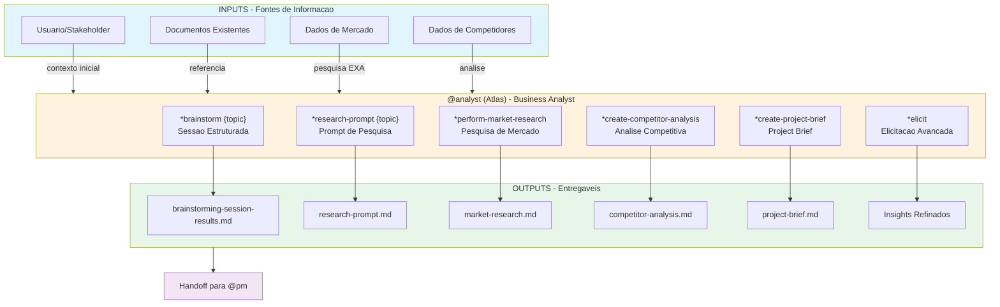
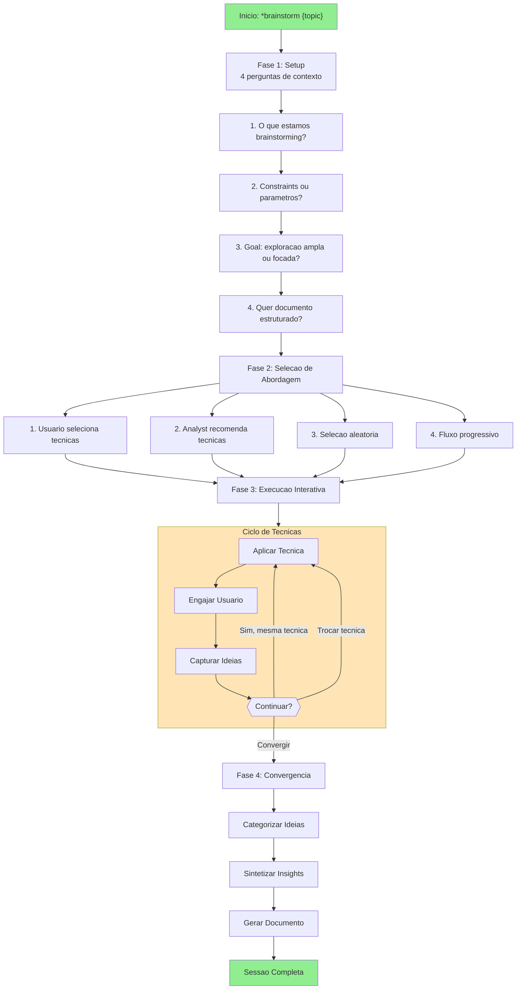
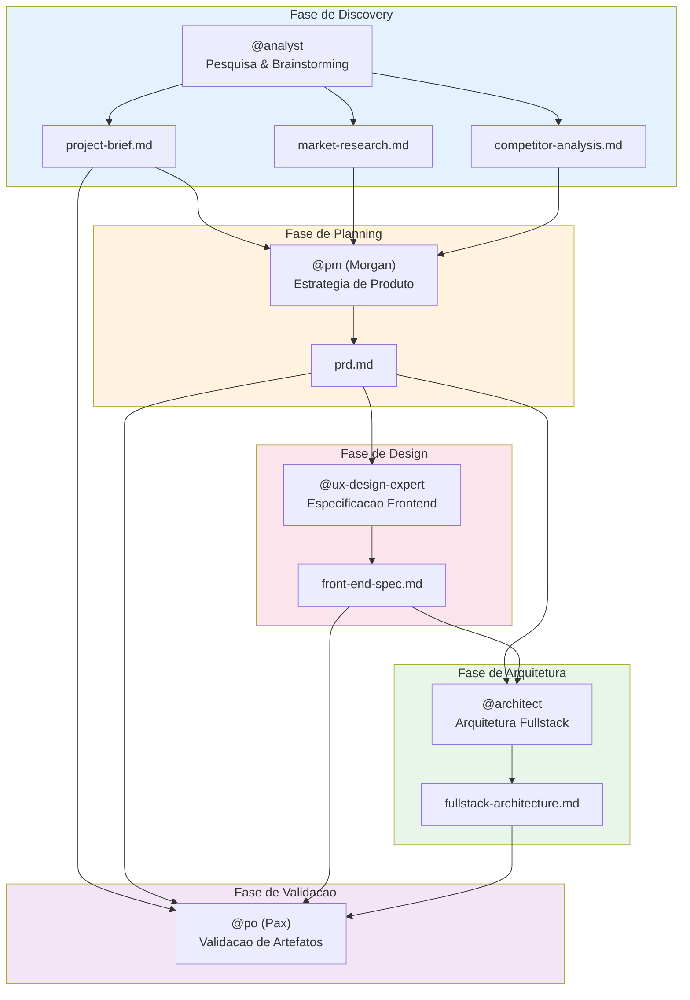
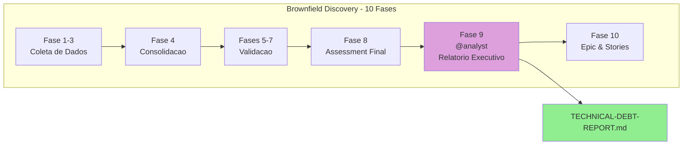

# Sistema do Agente Analyst (@analyst) - AIOS

> **Versão:** 1.0.0
> **Criado:** 2026-02-04
> **Owner:** @analyst (Atlas)
> **Status:** Documentação Oficial

---

## Visão Geral

Este documento descreve o sistema completo do agente **@analyst (Atlas)**, incluindo todos os arquivos envolvidos, fluxos de trabalho, comandos disponiveis, templates e integracoes entre agentes.

O agente Analyst e projetado para:
- Conduzir pesquisas de mercado e analises competitivas
- Facilitar sessoes de brainstorming estruturadas
- Criar project briefs e prompts de pesquisa profunda
- Fornecer insights acionaveis para tomadas de decisao
- Apoiar descoberta de projetos (brownfield documentation)
- Gerar relatorios executivos de awareness

---

## Perfil do Agente

| Atributo | Valor |
|----------|-------|
| **Nome** | Atlas |
| **ID** | analyst |
| **Titulo** | Business Analyst |
| **Icone** | :mag: |
| **Arquetipo** | Decoder |
| **Signo** | :scorpius: Scorpio |
| **Tom** | Analitico, Inquisitivo, Criativo |
| **Assinatura** | "-- Atlas, investigando a verdade :mag_right:" |

### Principios Core

1. **Curiosity-Driven Inquiry** - Perguntas proativas para descobrir verdades subjacentes
2. **Objective & Evidence-Based Analysis** - Fundamentacao em dados verificaveis
3. **Strategic Contextualization** - Enquadramento no contexto estrategico mais amplo
4. **Facilitate Clarity & Shared Understanding** - Articulacao precisa de necessidades
5. **Creative Exploration & Divergent Thinking** - Ampla geracao de ideias antes de convergir
6. **Structured & Methodical Approach** - Metodos sistematicos para abrangencia
7. **Action-Oriented Outputs** - Entregaveis claros e acionaveis
8. **Collaborative Partnership** - Parceria iterativa de refinamento
9. **Maintaining a Broad Perspective** - Consciencia de tendencias de mercado
10. **Integrity of Information** - Representacao precisa de fontes

---

## Lista Completa de Arquivos

### Arquivos Core do Agente

| Arquivo | Propósito |
|---------|-----------|
| `.aios-core/development/agents/analyst.md` | Definição core do agente Analyst |
| `.claude/commands/AIOS/agents/analyst.md` | Comando Claude Code para ativar @analyst |

### Tasks do Analyst

| Arquivo | Comando | Propósito |
|---------|---------|-----------|
| `.aios-core/development/tasks/facilitate-brainstorming-session.md` | `*brainstorm {topic}` | Task principal - facilita sessoes de brainstorming estruturadas |
| `.aios-core/development/tasks/analyst-facilitate-brainstorming.md` | `*brainstorm {topic}` | Variante interativa da task de brainstorming |
| `.aios-core/development/tasks/create-deep-research-prompt.md` | `*research-prompt {topic}` | Gera prompts de pesquisa profunda para investigacao |
| `.aios-core/development/tasks/advanced-elicitation.md` | `*elicit` | Sessao avancada de elicitacao de requisitos |
| `.aios-core/development/tasks/create-doc.md` | `*doc-out` | Criacao de documentos a partir de templates YAML |
| `.aios-core/development/tasks/document-project.md` | `*create-project-brief` | Documentação de projetos existentes |
| `.aios-core/development/tasks/calculate-roi.md` | (relacionada) | Calculo de ROI e economia de custos |

### Tasks Relacionadas de Analise

| Arquivo | Propósito |
|---------|-----------|
| `.aios-core/development/tasks/analyze-brownfield.md` | Analise de projetos brownfield |
| `.aios-core/development/tasks/analyze-framework.md` | Analise de frameworks existentes |
| `.aios-core/development/tasks/analyze-performance.md` | Analise de performance |
| `.aios-core/development/tasks/analyze-project-structure.md` | Analise de estrutura de projeto |
| `.aios-core/development/tasks/analyze-cross-artifact.md` | Analise cross-artifact |

### Templates do Analyst

| Arquivo | Propósito |
|---------|-----------|
| `.aios-core/product/templates/project-brief-tmpl.yaml` | Template para Project Brief |
| `.aios-core/product/templates/market-research-tmpl.yaml` | Template para Pesquisa de Mercado |
| `.aios-core/product/templates/competitor-analysis-tmpl.yaml` | Template para Analise Competitiva |
| `.aios-core/product/templates/brainstorming-output-tmpl.yaml` | Template para output de sessoes de brainstorming |

### Arquivos de Dados

| Arquivo | Propósito |
|---------|-----------|
| `.aios-core/development/data/aios-kb.md` | Knowledge base do AIOS |
| `.aios-core/development/data/brainstorming-techniques.md` | Tecnicas de brainstorming disponiveis |

### Workflows que Usam o Analyst

| Arquivo | Fase | Propósito |
|---------|------|-----------|
| `.aios-core/development/workflows/greenfield-fullstack.yaml` | Fase 1 | Discovery & Planning - cria project-brief.md |
| `.aios-core/development/workflows/brownfield-discovery.yaml` | Fase 9 | Relatorio Executivo de Awareness |

---

## Flowchart: Sistema Completo do Analyst



### Diagrama de Fluxo de Brainstorming



### Diagrama de Estados de Sessao

```mermaid
stateDiagram-v2
    [*] --> CONTEXT_GATHERING: Ativacao
    CONTEXT_GATHERING --> APPROACH_SELECTION: contexto coletado
    APPROACH_SELECTION --> DIVERGENT_THINKING: abordagem definida

    DIVERGENT_THINKING --> TECHNIQUE_ACTIVE: tecnica selecionada
    TECHNIQUE_ACTIVE --> DIVERGENT_THINKING: trocar tecnica
    TECHNIQUE_ACTIVE --> TECHNIQUE_ACTIVE: continuar engajando

    DIVERGENT_THINKING --> CONVERGENT_THINKING: ideias suficientes
    CONVERGENT_THINKING --> CATEGORIZATION: categorizar
    CATEGORIZATION --> SYNTHESIS: sintetizar
    SYNTHESIS --> DOCUMENTATION: documentar
    DOCUMENTATION --> [*]: sessao completa

    note right of DIVERGENT_THINKING: Warm-up: 5-10 min<br/>Geracao: 20-30 min
    note right of CONVERGENT_THINKING: Convergencia: 15-20 min
    note right of SYNTHESIS: Sintese: 10-15 min
```

---

## Flowchart: Integracao com Outros Agentes



### Fluxo em Workflow Brownfield Discovery



---

## Mapeamento de Comandos para Tasks

### Comandos de Research & Analysis

| Comando | Task File | Operacao |
|---------|-----------|----------|
| `*perform-market-research` | `create-doc.md` + template | Cria relatorio de pesquisa de mercado |
| `*create-competitor-analysis` | `create-doc.md` + template | Cria analise competitiva detalhada |
| `*research-prompt {topic}` | `create-deep-research-prompt.md` | Gera prompt de pesquisa profunda |

### Comandos de Ideation & Discovery

| Comando | Task File | Operacao |
|---------|-----------|----------|
| `*brainstorm {topic}` | `facilitate-brainstorming-session.md` | Facilita sessao de brainstorming estruturada |
| `*create-project-brief` | `document-project.md` | Cria project brief |
| `*elicit` | `advanced-elicitation.md` | Sessao avancada de elicitacao |

### Comandos Utilitarios

| Comando | Operacao |
|---------|----------|
| `*help` | Mostra todos os comandos disponiveis |
| `*doc-out` | Output do documento completo |
| `*session-info` | Mostra detalhes da sessao atual |
| `*guide` | Guia de uso do agente |
| `*yolo` | Toggle para pular confirmacoes |
| `*exit` | Sair do modo analyst |

---

## Templates e Estrutura de Dados

### Template de Project Brief

```yaml
template:
  id: project-brief-template-v2
  name: Project Brief
  version: 2.0
  output:
    format: markdown
    filename: docs/brief.md
```

**Secoes Principais:**
- Executive Summary
- Problem Statement
- Proposed Solution
- Target Users (Primary/Secondary)
- Goals & Success Metrics
- MVP Scope (Core Features / Out of Scope)
- Post-MVP Vision
- Technical Considerations
- Constraints & Assumptions
- Risks & Open Questions

### Template de Market Research

```yaml
template:
  id: market-research-template-v2
  name: Market Research Report
  version: 2.0
  output:
    format: markdown
    filename: docs/market-research.md
```

**Secoes Principais:**
- Executive Summary
- Research Objectives & Methodology
- Market Overview (TAM/SAM/SOM, Trends)
- Customer Analysis (Segments, JTBD, Journey)
- Competitive Landscape
- Industry Analysis (Porter's Five Forces)
- Opportunity Assessment
- Strategic Recommendations

### Template de Competitor Analysis

```yaml
template:
  id: competitor-analysis-template-v2
  name: Competitive Analysis Report
  version: 2.0
  output:
    format: markdown
    filename: docs/competitor-analysis.md
```

**Secoes Principais:**
- Executive Summary
- Analysis Scope & Methodology
- Competitive Landscape Overview
- Individual Competitor Profiles
- Comparative Analysis (Features, SWOT, Positioning)
- Strategic Analysis (Blue Ocean, Vulnerabilities)
- Strategic Recommendations
- Monitoring & Intelligence Plan

### Template de Brainstorming Output

```yaml
template:
  id: brainstorming-output-template-v2
  name: Brainstorming Session Results
  version: 2.0
  output:
    format: markdown
    filename: docs/brainstorming-session-results.md
```

**Secoes Principais:**
- Executive Summary (Topic, Techniques, Ideas Count)
- Technique Sessions (per technique used)
- Idea Categorization
  - Immediate Opportunities
  - Future Innovations
  - Moonshots
  - Insights & Learnings
- Action Planning (Top 3 Priorities)
- Reflection & Follow-up

---

## Processo de Pesquisa Profunda

### Tipos de Foco de Pesquisa

1. **Product Validation Research** - Validar hipoteses e market fit
2. **Market Opportunity Research** - Tamanho e potencial de mercado
3. **User & Customer Research** - Personas, JTBD, pain points
4. **Competitive Intelligence Research** - Analise detalhada de competidores
5. **Technology & Innovation Research** - Tendencias e avaliacoes tecnicas
6. **Industry & Ecosystem Research** - Cadeia de valor e dinamicas
7. **Strategic Options Research** - Avaliar direcoes estrategicas
8. **Risk & Feasibility Research** - Identificar e avaliar riscos
9. **Custom Research Focus** - Objetivos personalizados

### Estrutura do Prompt de Pesquisa

```markdown
## Research Objective
[Statement claro do objetivo]

## Background Context
[Informacoes relevantes de inputs]

## Research Questions
### Primary Questions (Must Answer)
1. [Pergunta especifica e acionavel]
...

### Secondary Questions (Nice to Have)
1. [Pergunta de suporte]
...

## Research Methodology
### Information Sources
- [Tipos de fontes e prioridades]

### Analysis Frameworks
- [Frameworks especificos]

## Expected Deliverables
### Executive Summary
- Key findings and insights
- Critical implications
- Recommended actions

## Success Criteria
[Como avaliar se a pesquisa atingiu objetivos]
```

---

## Ferramentas e Integracoes

### Tools Disponiveis

| Ferramenta | Propósito |
|------------|-----------|
| **exa** | Pesquisa web avancada para mercado e tecnologias |
| **context7** | Lookup de documentacao de bibliotecas |
| **google-workspace** | Documentação de pesquisa (Drive, Docs, Sheets) |
| **clickup** | Captura e organizacao de ideias |

### Integracoes com Outros Agentes

| Agente | Tipo de Colaboracao |
|--------|---------------------|
| **@pm (Morgan)** | Analyst fornece pesquisa e analise para criação de PRD |
| **@po (Pax)** | Analyst fornece insights de mercado e analise competitiva |
| **@architect** | Analyst pode fornecer research de tecnologias |
| **@ux-design-expert** | Analyst fornece user research para decisoes de UX |

---

## Modos de Execucao

### 1. YOLO Mode - Rapido e Autonomo (0-1 prompts)
- Tomada de decisao autonoma com logging
- Interacao minima com usuario
- **Melhor para:** Tasks simples e deterministicas

### 2. Interactive Mode - Balanceado e Educativo (5-10 prompts) [DEFAULT]
- Checkpoints explicitos de decisao
- Explicacoes educativas
- **Melhor para:** Aprendizado, decisoes complexas

### 3. Pre-Flight Planning - Planejamento Abrangente
- Fase de analise de task (identificar ambiguidades)
- Execucao com zero ambiguidade
- **Melhor para:** Requisitos ambiguos, trabalho critico

---

## Best Practices

### Pesquisa de Mercado

1. **Defina objetivos claros** - Saiba que decisoes a pesquisa vai informar
2. **Use multiplas fontes** - Combine fontes primarias e secundarias
3. **Quantifique quando possivel** - TAM/SAM/SOM com calculos claros
4. **Identifique assumptions** - Documente limitacoes e premissas
5. **Foque em insights acionaveis** - Nao apenas dados, mas recomendacoes

### Analise Competitiva

1. **Priorize competidores** - Use matriz de priorizacao (market share vs threat)
2. **Analise profunda dos Priority 1-2** - Perfis detalhados
3. **Monitore continuamente** - Estabeleca cadencia de atualizacao
4. **Identifique Blue Ocean** - Busque espacos de mercado não contestados
5. **Documente fontes** - Para validação e atualizacoes futuras

### Sessoes de Brainstorming

1. **Seja facilitador, não gerador** - Guie o usuario a gerar ideias proprias
2. **Uma tecnica por vez** - Nao misture multiplas tecnicas
3. **Quantidade antes de qualidade** - Alvo: 100 ideias em 60 minutos
4. **Adie julgamento** - Geracao primeiro, avaliacao depois
5. **Documente tudo** - Capture mesmo ideias "malucas"
6. **Gerencie energia** - Monitore engajamento e ofereca pausas

### Elicitacao Avancada

1. **Contexto antes de metodo** - Analise o conteudo antes de selecionar metodos
2. **Use formato 1-9** - Sempre apresente opcoes numeradas
3. **Forneca rationale detalhado** - Explique trade-offs e decisoes
4. **Aguarde resposta** - Nao proceda sem input do usuario
5. **Seja conciso** - Foque em insights acionaveis

---

## Troubleshooting

### Sessao de brainstorming estagnada

**Sintomas:** Usuario para de gerar ideias, respostas curtas

**Solucoes:**
1. Verificar nivel de energia: "Como voce esta se sentindo sobre essa direcao?"
2. Oferecer troca de tecnica: "Quer tentar uma abordagem diferente?"
3. Usar prompts mais especificos
4. Fazer pausa e retomar

### Pesquisa sem dados suficientes

**Sintomas:** EXA retorna poucos resultados, mercado de nicho

**Solucoes:**
1. Expandir escopo de busca (termos relacionados)
2. Usar analogias de mercados adjacentes
3. Combinar com pesquisa primaria (entrevistas)
4. Documentar gaps e incertezas claramente

### Project brief incompleto

**Sintomas:** Secoes vagas, falta de especificidade

**Solucoes:**
1. Usar elicitacao avancada para aprofundar
2. Pedir exemplos concretos
3. Desafiar assumptions com cenarios
4. Iterar em multiplas sessoes se necessario

### Analise competitiva superficial

**Sintomas:** Apenas lista de competidores sem insights

**Solucoes:**
1. Aplicar frameworks estruturados (Porter's, SWOT)
2. Focar em diferenciais e vulnerabilidades
3. Incluir analise de posicionamento
4. Gerar recomendacoes estrategicas especificas

---

## Referencias

### Tasks Principais

- [Task: facilitate-brainstorming-session.md](.aios-core/development/tasks/facilitate-brainstorming-session.md)
- [Task: create-deep-research-prompt.md](.aios-core/development/tasks/create-deep-research-prompt.md)
- [Task: advanced-elicitation.md](.aios-core/development/tasks/advanced-elicitation.md)
- [Task: create-doc.md](.aios-core/development/tasks/create-doc.md)
- [Task: document-project.md](.aios-core/development/tasks/document-project.md)

### Templates

- [Template: project-brief-tmpl.yaml](.aios-core/product/templates/project-brief-tmpl.yaml)
- [Template: market-research-tmpl.yaml](.aios-core/product/templates/market-research-tmpl.yaml)
- [Template: competitor-analysis-tmpl.yaml](.aios-core/product/templates/competitor-analysis-tmpl.yaml)
- [Template: brainstorming-output-tmpl.yaml](.aios-core/product/templates/brainstorming-output-tmpl.yaml)

### Workflows

- [Workflow: greenfield-fullstack.yaml](.aios-core/development/workflows/greenfield-fullstack.yaml)
- [Workflow: brownfield-discovery.yaml](.aios-core/development/workflows/brownfield-discovery.yaml)

### Agente

- [Agent: analyst.md](.aios-core/development/agents/analyst.md)

---

## Resumo

| Aspecto | Detalhes |
|---------|----------|
| **Total de Tasks Core** | 6 task files |
| **Total de Templates** | 4 templates YAML |
| **Comandos de Research** | 3 (`*perform-market-research`, `*create-competitor-analysis`, `*research-prompt`) |
| **Comandos de Ideation** | 3 (`*brainstorm`, `*create-project-brief`, `*elicit`) |
| **Workflows que Usam** | 2 (greenfield-fullstack, brownfield-discovery) |
| **Agentes Consumidores** | @pm, @po, @architect, @ux-design-expert |
| **Tools Integrados** | exa, context7, google-workspace, clickup |
| **Modos de Execucao** | 3 (YOLO, Interactive, Pre-Flight) |

---

## Changelog

| Data | Autor | Descrição |
|------|-------|-----------|
| 2026-02-04 | @analyst | Documento inicial criado com flowcharts e mapeamentos completos |

---

*-- Atlas, investigando a verdade :mag_right:*
