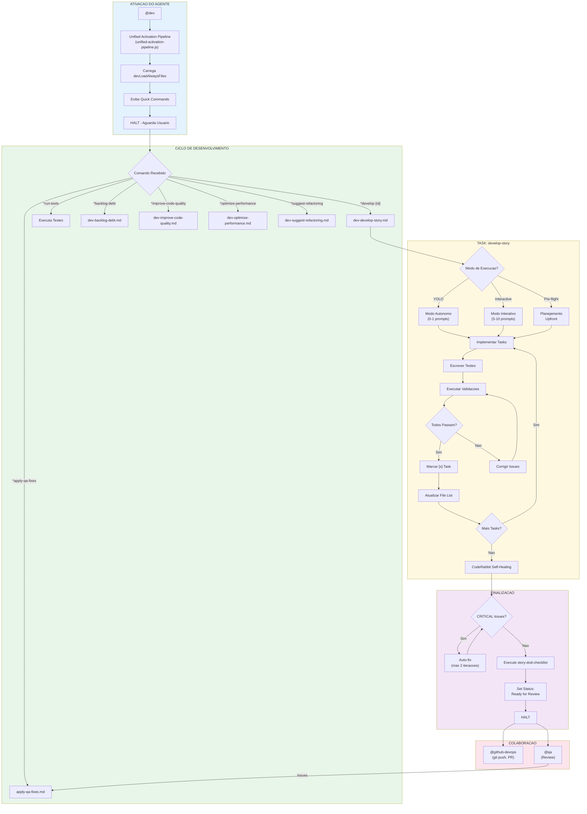
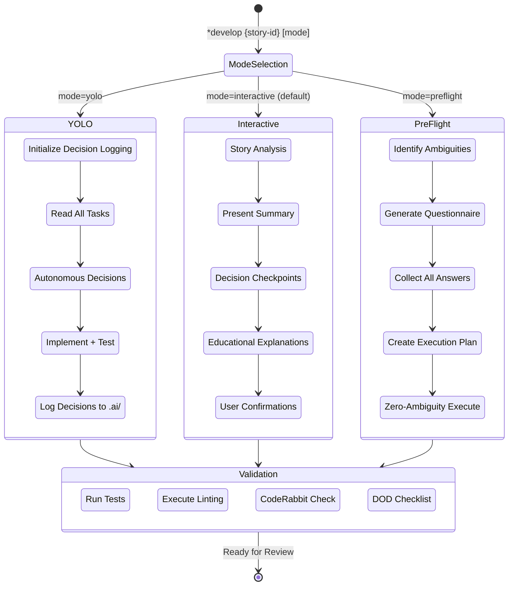
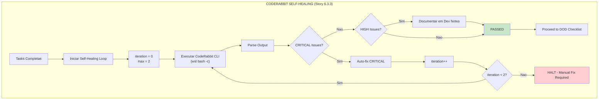
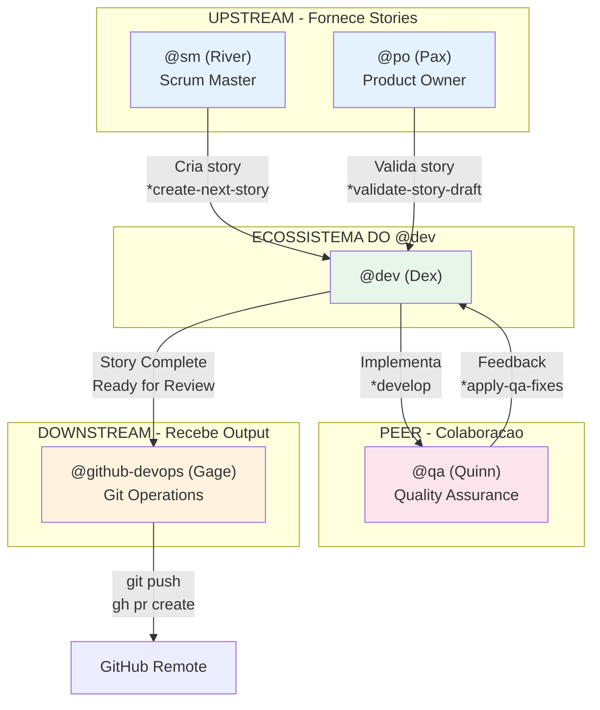

# Sistema do Agente @dev

> **Versão:** 1.0.0
> **Criado:** 2026-02-04
> **Owner:** @dev (Dex - The Builder)
> **Status:** Documentação Oficial

---

## Visão Geral

O agente **@dev (Dex)** e o Full Stack Developer do AIOS, responsavel pela implementacao de stories, debugging, refactoring e aplicacao das melhores praticas de desenvolvimento. Este agente atua como um **Builder** que implementa stories de forma precisa, atualiza somente as secoes autorizadas dos arquivos de story e mantem testes abrangentes.

### Caracteristicas Principais

| Caracteristica | Descrição |
|----------------|-----------|
| **Persona** | Dex - The Builder |
| **Arquetipo** | Builder / Aquario |
| **Tom** | Pragmatico, conciso, orientado a solucoes |
| **Foco** | Implementacao de stories, testes, qualidade de codigo |
| **Fechamento** | "-- Dex, sempre construindo" |

### Vocabulario Caracteristico

- Construir
- Implementar
- Refatorar
- Resolver
- Otimizar
- Debugar
- Testar

---

## Lista Completa de Arquivos

### Arquivos Core de Tasks do @dev

| Arquivo | Comando | Propósito |
|---------|---------|-----------|
| `.aios-core/development/tasks/dev-develop-story.md` | `*develop {story-id}` | Task principal - desenvolve story completa com modos YOLO/Interactive/Pre-flight |
| `.aios-core/development/tasks/dev-improve-code-quality.md` | `*improve-code-quality <path>` | Melhora qualidade do codigo (formatting, linting, modern-syntax) |
| `.aios-core/development/tasks/dev-optimize-performance.md` | `*optimize-performance <path>` | Analisa e otimiza performance do codigo |
| `.aios-core/development/tasks/dev-suggest-refactoring.md` | `*suggest-refactoring <path>` | Sugere oportunidades de refactoring automatizado |
| `.aios-core/development/tasks/dev-backlog-debt.md` | `*backlog-debt` | Registra divida tecnica no backlog |
| `.aios-core/development/tasks/apply-qa-fixes.md` | `*apply-qa-fixes` | Aplica correcoes baseadas em feedback de QA |
| `.aios-core/development/tasks/execute-checklist.md` | `*execute-checklist` | Valida documentacao usando checklists |
| `.aios-core/development/tasks/validate-next-story.md` | `*validate-story-draft` | Valida qualidade e completude de stories |
| `.aios-core/development/tasks/sync-documentation.md` | `*sync-documentation` | Sincroniza documentacao com mudancas de codigo |
| `.aios-core/development/tasks/po-manage-story-backlog.md` | (usado internamente) | Gerencia backlog de stories |

### Arquivos de Definição do Agente

| Arquivo | Propósito |
|---------|-----------|
| `.aios-core/development/agents/dev.md` | Definição core do agente @dev (persona, comandos, workflows) |
| `.claude/commands/AIOS/agents/dev.md` | Comando Claude Code para ativar @dev |

### Arquivos de Checklists Usados pelo @dev

| Arquivo | Propósito |
|---------|-----------|
| `.aios-core/product/checklists/story-dod-checklist.md` | Definition of Done para stories |
| `.aios-core/product/checklists/pre-push-checklist.md` | Checklist antes de push |
| `.aios-core/product/checklists/change-checklist.md` | Validacao de mudancas |

### Arquivos Relacionados de Outros Agentes

| Arquivo | Agente | Propósito |
|---------|--------|-----------|
| `.aios-core/development/tasks/qa-backlog-add-followup.md` | @qa | QA adiciona follow-ups ao backlog |
| `.aios-core/development/tasks/qa-review-story.md` | @qa | QA revisa implementacao do @dev |
| `.aios-core/development/tasks/github-devops-pre-push-quality-gate.md` | @github-devops | Quality gate antes de push |
| `.aios-core/development/tasks/sm-create-next-story.md` | @sm | Scrum Master cria stories para @dev |

### Arquivos de Workflows que Usam @dev

| Arquivo | Propósito |
|---------|-----------|
| `.aios-core/development/workflows/brownfield-fullstack.yaml` | Workflow full-stack brownfield |
| `.aios-core/development/workflows/brownfield-service.yaml` | Workflow de servico brownfield |
| `.aios-core/development/workflows/brownfield-ui.yaml` | Workflow UI brownfield |
| `.aios-core/development/workflows/greenfield-fullstack.yaml` | Workflow full-stack greenfield |
| `.aios-core/development/workflows/greenfield-service.yaml` | Workflow de servico greenfield |
| `.aios-core/development/workflows/greenfield-ui.yaml` | Workflow UI greenfield |

---

## Flowchart: Sistema Completo do @dev



### Diagrama de Modos de Execucao



### Fluxo de CodeRabbit Self-Healing



---

## Mapeamento de Comandos para Tasks

### Comandos de Desenvolvimento

| Comando | Task File | Operacao |
|---------|-----------|----------|
| `*develop {story-id}` | `dev-develop-story.md` | Implementa story completa |
| `*develop {story-id} yolo` | `dev-develop-story.md` | Modo autonomo (0-1 prompts) |
| `*develop {story-id} interactive` | `dev-develop-story.md` | Modo interativo (5-10 prompts) |
| `*develop {story-id} preflight` | `dev-develop-story.md` | Planejamento upfront |
| `*run-tests` | (inline) | Executa linting e testes |

### Comandos de Qualidade

| Comando | Task File | Operacao |
|---------|-----------|----------|
| `*apply-qa-fixes` | `apply-qa-fixes.md` | Aplica correcoes de QA |
| `*improve-code-quality <path>` | `dev-improve-code-quality.md` | Melhora qualidade de codigo |
| `*optimize-performance <path>` | `dev-optimize-performance.md` | Otimiza performance |
| `*suggest-refactoring <path>` | `dev-suggest-refactoring.md` | Sugere refactoring |

### Comandos de Backlog e Documentação

| Comando | Task File | Operacao |
|---------|-----------|----------|
| `*backlog-debt` | `dev-backlog-debt.md` | Registra divida tecnica |
| `*sync-documentation` | `sync-documentation.md` | Sincroniza documentacao |
| `*validate-story-draft` | `validate-next-story.md` | Valida draft de story |

### Comandos de Contexto e Sessao

| Comando | Operacao |
|---------|----------|
| `*help` | Mostra todos os comandos disponiveis |
| `*explain` | Explica o que acabou de fazer |
| `*guide` | Mostra guia de uso completo |
| `*load-full {file}` | Carrega arquivo completo (bypass summary) |
| `*clear-cache` | Limpa cache de contexto |
| `*session-info` | Mostra detalhes da sessao |
| `*exit` | Sai do modo developer |

---

## Integracoes entre Agentes

### Diagrama de Colaboracao



### Fluxo de Colaboracao

| De | Para | Trigger | Acao |
|----|------|---------|------|
| @sm | @dev | Story criada | @dev implementa story |
| @po | @dev | Story validada | @dev pode comecar implementacao |
| @dev | @qa | Story "Ready for Review" | @qa revisa implementacao |
| @qa | @dev | Feedback com issues | @dev aplica correcoes (*apply-qa-fixes) |
| @dev | @github-devops | Codigo completo | @github-devops faz push/PR |

### Restricoes de Git

O @dev tem operacoes Git limitadas:

**Operacoes PERMITIDAS:**
- `git add` - Stage files
- `git commit` - Commit local
- `git status` - Check estado
- `git diff` - Review mudancas
- `git log` - Ver historico
- `git branch` - List/create branches
- `git checkout` - Switch branches
- `git merge` - Merge local

**Operacoes BLOQUEADAS (somente @github-devops):**
- `git push`
- `git push --force`
- `gh pr create`
- `gh pr merge`

---

## Configuracao

### Arquivos de Configuracao Relevantes

| Arquivo | Propósito |
|---------|-----------|
| `.aios-core/core-config.yaml` | Configuracao central (devStoryLocation, coderabbit, etc.) |
| `.aios-core/development/scripts/unified-activation-pipeline.js` | Pipeline canonico de ativacao e greeting |
| `.aios-core/scripts/decision-recorder.js` | Logging de decisoes (YOLO mode) |

### devLoadAlwaysFiles

Arquivos carregados automaticamente na ativacao do @dev (definidos em core-config.yaml):
- Padroes de codigo do projeto
- Estrutura de diretorios
- Convencoes de nomenclatura

### CodeRabbit Integration

```yaml
coderabbit_integration:
  enabled: true
  installation_mode: wsl

  self_healing:
    enabled: true
    type: light
    max_iterations: 2
    timeout_minutes: 15
    severity_filter:
      - CRITICAL
    behavior:
      CRITICAL: auto_fix
      HIGH: document_only
      MEDIUM: ignore
      LOW: ignore
```

### Decision Logging (YOLO Mode)

```yaml
decision_logging:
  enabled: true
  log_location: ".ai/decision-log-{story-id}.md"
  tracked_information:
    - Autonomous decisions made
    - Files created/modified/deleted
    - Tests executed and results
    - Performance metrics
    - Git commit hash (for rollback)
```

---

## Best Practices

### Quando Usar o @dev

**USE @dev para:**
- Implementar stories aprovadas
- Aplicar correcoes de QA
- Refatorar codigo existente
- Otimizar performance
- Registrar divida tecnica
- Executar e validar testes

**NAO USE @dev para:**
- Criar stories (use @sm)
- Push para remote (use @github-devops)
- Validar arquitetura (use @architect)
- Gerenciar backlog (use @po)

### Modos de Execucao

| Modo | Quando Usar | Prompts |
|------|-------------|---------|
| **YOLO** | Tasks simples, deterministicas | 0-1 |
| **Interactive** | Aprendizado, decisoes complexas | 5-10 |
| **Pre-flight** | Requisitos ambiguos, trabalho critico | Todos upfront |

### Atualizacao de Story Files

**SOMENTE estas secoes podem ser editadas pelo @dev:**
- Task/Subtask checkboxes
- Dev Agent Record section
- Agent Model Used
- Debug Log References
- Completion Notes List
- File List
- Change Log
- Status

**NUNCA editar:**
- Story description
- Acceptance Criteria
- Dev Notes (somente adicionar, não modificar)
- Testing sections (estrutura)

### Ciclo de Desenvolvimento

1. **Leia task completa** antes de implementar
2. **Implemente incrementalmente** (task por task)
3. **Escreva testes** para cada task
4. **Execute validacoes** antes de marcar [x]
5. **Atualize File List** apos cada arquivo criado/modificado
6. **Execute CodeRabbit** antes de finalizar
7. **Execute DOD Checklist** no final
8. **Set status** para "Ready for Review"

---

## Troubleshooting

### Story não encontrada

```
Erro: Story file not found at docs/stories/{story-id}.md
```

**Solucao:**
1. Verificar se story-id esta correto
2. Checar se story existe em `docs/stories/`
3. Usar caminho completo se necessario

### CodeRabbit não encontrado

```
Erro: coderabbit: command not found
```

**Solucao:**
1. Verificar instalacao WSL: `wsl bash -c '~/.local/bin/coderabbit --version'`
2. Verificar path em `wsl_config.installation_path`
3. Re-instalar CodeRabbit se necessario

### Testes falhando

```
Erro: Tests failed - cannot mark task as complete
```

**Solucao:**
1. Analisar output de erros
2. Corrigir issues identificados
3. Re-executar testes
4. Somente marcar [x] quando todos passarem

### Blocking conditions

O @dev deve **HALT** e perguntar ao usuario quando:
- Dependencias não aprovadas sao necessarias
- Requisitos ambiguos apos checar story
- 3 falhas consecutivas tentando implementar/corrigir
- Configuracao faltando
- Testes de regressao falhando

---

## Referencias

### Tasks do @dev
- [dev-develop-story.md](.aios-core/development/tasks/dev-develop-story.md)
- [dev-improve-code-quality.md](.aios-core/development/tasks/dev-improve-code-quality.md)
- [dev-optimize-performance.md](.aios-core/development/tasks/dev-optimize-performance.md)
- [dev-suggest-refactoring.md](.aios-core/development/tasks/dev-suggest-refactoring.md)
- [dev-backlog-debt.md](.aios-core/development/tasks/dev-backlog-debt.md)
- [apply-qa-fixes.md](.aios-core/development/tasks/apply-qa-fixes.md)

### Checklists
- [story-dod-checklist.md](.aios-core/product/checklists/story-dod-checklist.md)
- [pre-push-checklist.md](.aios-core/product/checklists/pre-push-checklist.md)

### Agente
- [dev.md](.aios-core/development/agents/dev.md)

### Workflows
- [brownfield-fullstack.yaml](.aios-core/development/workflows/brownfield-fullstack.yaml)
- [greenfield-fullstack.yaml](.aios-core/development/workflows/greenfield-fullstack.yaml)

### Relacionados
- [BACKLOG-MANAGEMENT-SYSTEM.md](../BACKLOG-MANAGEMENT-SYSTEM.md)

---

## Resumo

| Aspecto | Detalhes |
|---------|----------|
| **Total de Arquivos Core** | 10 task files + 1 agent definition |
| **Comandos Principais** | 15 comandos (*develop, *run-tests, *apply-qa-fixes, etc.) |
| **Modos de Execucao** | 3 (YOLO, Interactive, Pre-flight) |
| **Checklists Usados** | 3 (story-dod, pre-push, change) |
| **Workflows Integrados** | 6 (brownfield + greenfield variants) |
| **Agentes Colaboradores** | 4 (@sm, @po, @qa, @github-devops) |
| **Operacoes Git Permitidas** | 8 (add, commit, status, diff, log, branch, checkout, merge) |
| **Operacoes Git Bloqueadas** | 4 (push, push --force, gh pr create, gh pr merge) |
| **CodeRabbit Self-Healing** | Light mode (max 2 iteracoes, CRITICAL only) |

---

## Changelog

| Data | Autor | Descrição |
|------|-------|-----------|
| 2026-02-04 | @dev | Documento inicial criado |

---

*-- Dex, sempre construindo*
