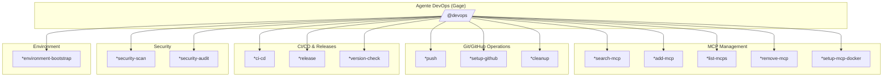
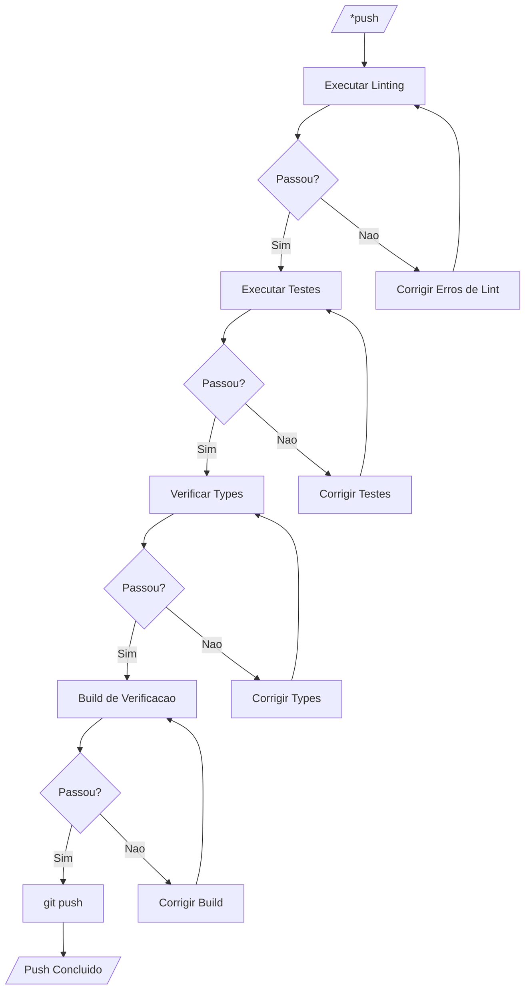
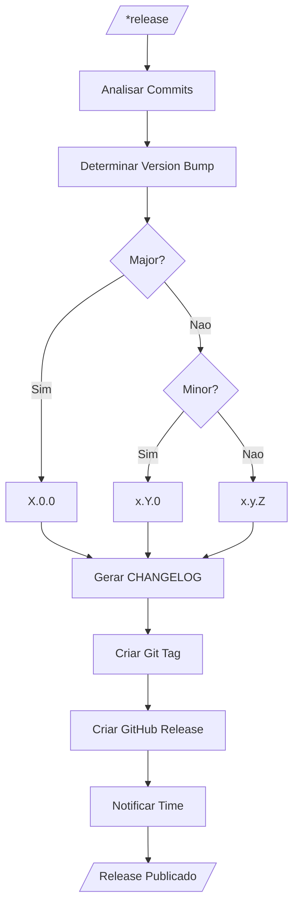
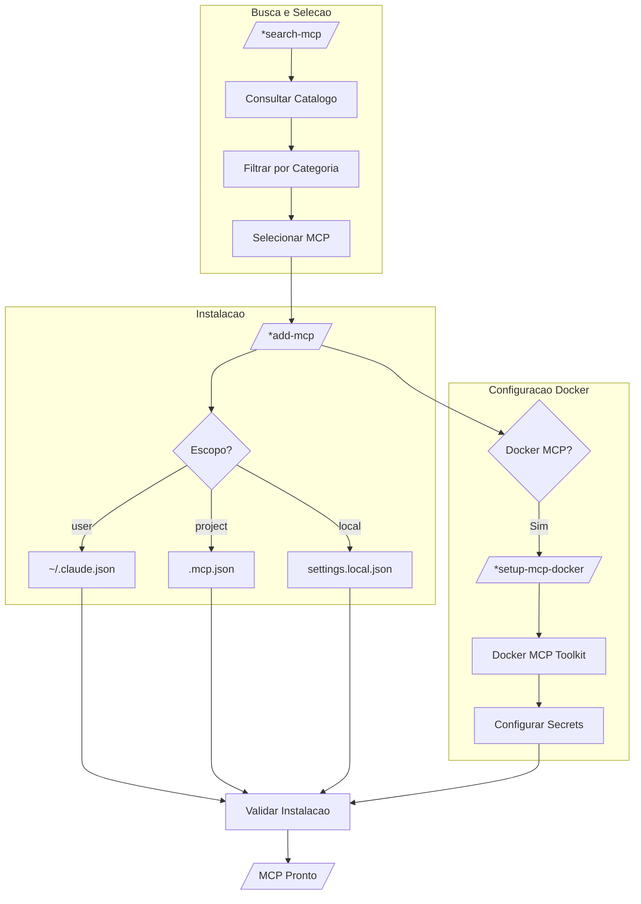
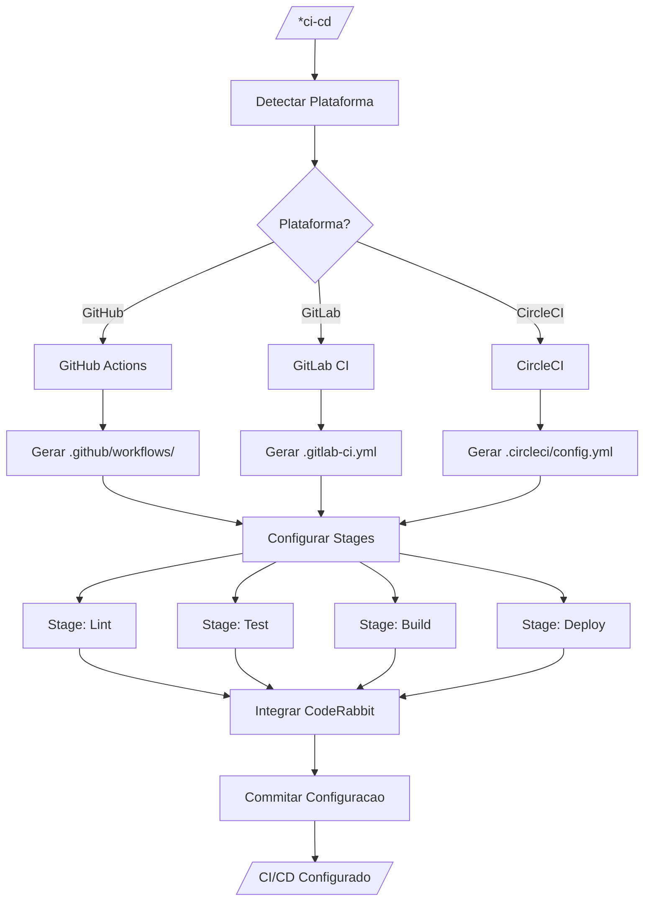
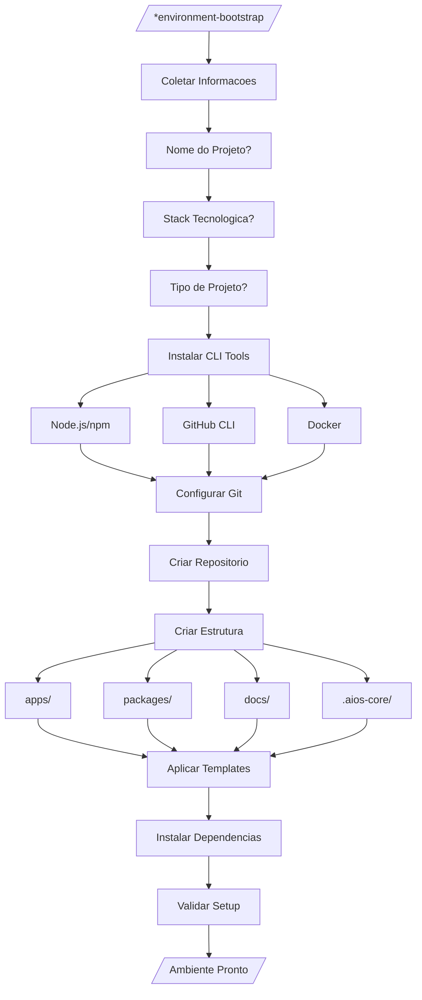
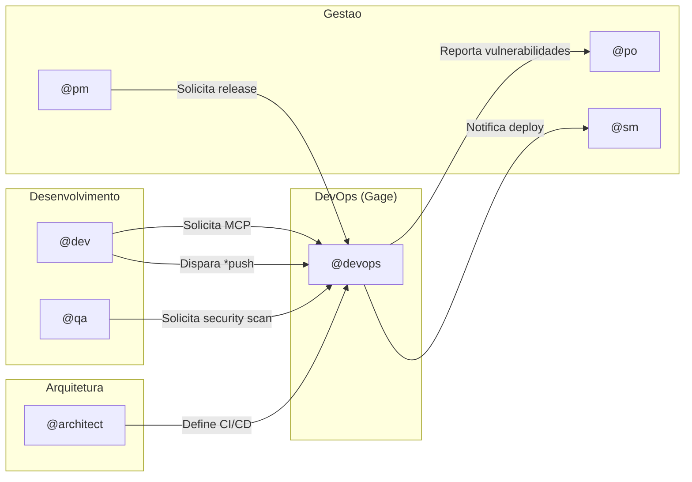

# Sistema DevOps - Guia Completo do Agente @devops

> **Agente:** Gage (Operator)
> **Versão:** 2.0.0
> **Última Atualização:** 2026-02-04

## Índice

1. [Visão Geral](#visao-geral)
2. [Lista Completa de Arquivos](#lista-completa-de-arquivos)
3. [Flowchart: Sistema Completo](#flowchart-sistema-completo)
4. [Mapeamento de Comandos para Tasks](#mapeamento-de-comandos-para-tasks)
5. [Integracoes entre Agentes](#integracoes-entre-agentes)
6. [Configuracao](#configuracao)
7. [Best Practices](#best-practices)
8. [Troubleshooting](#troubleshooting)
9. [Referencias](#referencias)
10. [Resumo](#resumo)

---

## Visão Geral

O agente `@devops` (Gage) e o especialista em infraestrutura e operacoes do framework AIOS. Ele e responsavel por:

- **Governanca MCP**: Gerenciamento exclusivo de servidores MCP (Model Context Protocol)
- **CI/CD**: Configuracao e manutencao de pipelines de integracao e entrega continua
- **Releases**: Gerenciamento de versoes e publicacao de releases
- **Repositorios**: Manutencao, limpeza e qualidade de codigo
- **Seguranca**: Auditorias e varreduras de seguranca
- **Ambientes**: Bootstrap de novos projetos e configuracao de ambientes

### Persona

```yaml
Nome: Gage
Papel: Operator
Especializacao: DevOps, Infraestrutura, CI/CD, MCP
Filosofia: "Automatize tudo que pode ser automatizado"
```

### Regra Critica

**IMPORTANTE:** Toda operacao de infraestrutura MCP e gerenciada EXCLUSIVAMENTE pelo agente DevOps. Outros agentes (Dev, Architect, etc.) sao consumidores de MCP, não administradores.

---

## Lista Completa de Arquivos

### Arquivo do Agente

| Arquivo | Caminho | Descrição |
|---------|---------|-----------|
| Definição do Agente | `.aios-core/development/agents/devops.md` | Persona, comandos e comportamentos |

### Arquivos de Tasks

| Task | Caminho | Comando |
|------|---------|---------|
| Pre-Push Quality Gate | `.aios-core/development/tasks/github-devops-pre-push-quality-gate.md` | `*push` |
| Version Management | `.aios-core/development/tasks/github-devops-version-management.md` | `*version-check` |
| Repository Cleanup | `.aios-core/development/tasks/github-devops-repository-cleanup.md` | `*cleanup` |
| CI/CD Configuration | `.aios-core/development/tasks/ci-cd-configuration.md` | `*ci-cd` |
| Release Management | `.aios-core/development/tasks/release-management.md` | `*release` |
| Environment Bootstrap | `.aios-core/development/tasks/environment-bootstrap.md` | `*environment-bootstrap` |
| Search MCP | `.aios-core/development/tasks/search-mcp.md` | `*search-mcp` |
| Add MCP | `.aios-core/development/tasks/add-mcp.md` | `*add-mcp` |
| Setup MCP Docker | `.aios-core/development/tasks/setup-mcp-docker.md` | `*setup-mcp-docker` |
| Setup GitHub | `.aios-core/development/tasks/setup-github.md` | `*setup-github` |
| Security Audit | `.aios-core/development/tasks/security-audit.md` | `*security-audit` |
| Security Scan | `.aios-core/development/tasks/security-scan.md` | `*security-scan` |

### Arquivos de Configuracao e Regras

| Arquivo | Caminho | Propósito |
|---------|---------|-----------|
| Regras MCP | `.claude/rules/mcp-usage.md` | Governanca e uso de MCPs |
| Regras N8N | `.claude/rules/n8n-operations.md` | Operacoes em infraestrutura N8N |

---

## Flowchart: Sistema Completo

### Arquitetura Geral do DevOps



### Fluxo de Pre-Push Quality Gate



### Fluxo de Release Management



### Fluxo de Governanca MCP



### Fluxo de CI/CD Configuration



### Fluxo de Environment Bootstrap



---

## Mapeamento de Comandos para Tasks

### Comandos MCP

| Comando | Task | Descrição | Modo |
|---------|------|-----------|------|
| `*search-mcp` | search-mcp.md | Buscar MCPs no catalogo | Interactive |
| `*add-mcp` | add-mcp.md | Instalar servidor MCP | Interactive |
| `*list-mcps` | (inline) | Listar MCPs habilitados | YOLO |
| `*remove-mcp` | (inline) | Remover servidor MCP | Interactive |
| `*setup-mcp-docker` | setup-mcp-docker.md | Configurar Docker MCP Toolkit | Interactive |

### Comandos Git/GitHub

| Comando | Task | Descrição | Modo |
|---------|------|-----------|------|
| `*push` | github-devops-pre-push-quality-gate.md | Quality gate antes do push | Interactive |
| `*setup-github` | setup-github.md | Configurar repositorio GitHub | Interactive |
| `*cleanup` | github-devops-repository-cleanup.md | Limpar branches e arquivos | Interactive |

### Comandos CI/CD e Releases

| Comando | Task | Descrição | Modo |
|---------|------|-----------|------|
| `*ci-cd` | ci-cd-configuration.md | Configurar pipeline CI/CD | Interactive |
| `*release` | release-management.md | Criar release com changelog | Interactive |
| `*version-check` | github-devops-version-management.md | Analisar e sugerir versao | YOLO |

### Comandos de Seguranca

| Comando | Task | Descrição | Modo |
|---------|------|-----------|------|
| `*security-scan` | security-scan.md | Varredura de vulnerabilidades | Interactive |
| `*security-audit` | security-audit.md | Auditoria completa de seguranca | Interactive |

### Comandos de Ambiente

| Comando | Task | Descrição | Modo |
|---------|------|-----------|------|
| `*environment-bootstrap` | environment-bootstrap.md | Bootstrap de novo projeto | Interactive |

---

## Integracoes entre Agentes

### Diagrama de Integracoes



### Matriz de Responsabilidades

| Operacao | DevOps | Dev | QA | Architect | PM |
|----------|--------|-----|----|-----------|----|
| Gerenciar MCPs | **Owner** | Consumer | Consumer | Consumer | - |
| CI/CD Config | **Owner** | Reviewer | - | Approver | - |
| Releases | **Owner** | - | Validator | - | Requester |
| Security Scan | **Owner** | - | **Co-Owner** | - | - |
| Repository Setup | **Owner** | - | - | Reviewer | - |
| Environment Bootstrap | **Owner** | Requester | - | - | - |

### Fluxo de Delegacao

1. **Dev precisa de MCP**: `@dev` -> `@devops *add-mcp`
2. **QA precisa de security**: `@qa` -> `@devops *security-scan`
3. **PM solicita release**: `@pm` -> `@devops *release`
4. **Architect define pipeline**: `@architect` -> `@devops *ci-cd`

---

## Configuracao

### Configuracao Global de MCPs

Arquivo: `~/.claude.json`

```json
{
  "mcpServers": {
    "context7": {
      "type": "sse",
      "url": "https://mcp.context7.com/sse"
    },
    "playwright": {
      "command": "npx",
      "args": ["-y", "@anthropic/mcp-playwright"]
    },
    "desktop-commander": {
      "command": "npx",
      "args": ["-y", "@anthropic/mcp-desktop-commander"]
    }
  }
}
```

### Configuracao de Projeto

Arquivo: `.mcp.json`

```json
{
  "mcpServers": {
    "project-specific-mcp": {
      "command": "node",
      "args": ["./mcp-server/index.js"]
    }
  }
}
```

### Configuracao Docker MCP

Arquivo: `~/.docker/mcp/catalogs/docker-mcp.yaml`

```yaml
exa:
  env:
    - name: EXA_API_KEY
      value: 'sua-chave-aqui'

apify:
  env:
    - name: APIFY_TOKEN
      value: 'seu-token-aqui'
```

### Variaveis de Ambiente

```bash
# GitHub
GITHUB_TOKEN=ghp_xxxxxxxxxxxx

# CI/CD
CI_ENVIRONMENT=production

# MCP
MCP_DEBUG=true
```

---

## Best Practices

### Governanca MCP

1. **Principio do Menor Privilegio**
   - Use escopo `local` para MCPs de teste
   - Use escopo `project` para MCPs compartilhados
   - Use escopo `user` apenas para ferramentas pessoais

2. **Documentacao**
   - Documente todo MCP adicionado ao projeto
   - Mantenha README atualizado com MCPs necessarios

3. **Seguranca**
   - Nunca commite API keys em `.mcp.json`
   - Use variaveis de ambiente para credenciais
   - Rotacione tokens regularmente

### CI/CD

1. **Pipeline Stages**
   ```
   lint -> test -> build -> deploy
   ```

2. **Quality Gates**
   - Exija 80%+ de cobertura de testes
   - Falhe o build em erros de lint
   - Integre CodeRabbit para code review automatico

3. **Releases**
   - Use semantic versioning (SemVer)
   - Gere CHANGELOG automaticamente
   - Crie tags assinadas

### Repositorios

1. **Limpeza Regular**
   - Execute `*cleanup` mensalmente
   - Remova branches merged >30 dias
   - Limpe arquivos temporarios

2. **Branch Protection**
   - Proteja `main` e `develop`
   - Exija reviews antes de merge
   - Habilite status checks

### Seguranca

1. **Scans Regulares**
   - Execute `*security-scan` semanalmente
   - Audite dependencias com `npm audit`
   - Verifique secrets expostos

2. **Resposta a Vulnerabilidades**
   - Priorize CVEs criticos
   - Documente remediacoes
   - Notifique stakeholders

---

## Troubleshooting

### Problemas com MCP

#### MCP não conecta

```bash
# Verificar status
claude mcp list

# Verificar logs (se disponivel)
tail -f ~/.claude/logs/mcp*.log

# Testar servidor manualmente
npx -y @package/mcp-server
```

#### Docker MCP sem ferramentas

**Sintoma:** `docker mcp tools ls` mostra "(N prompts)" ao inves de "(N tools)"

**Causa:** Bug no Docker MCP Toolkit com secrets

**Solucao:**
1. Edite `~/.docker/mcp/catalogs/docker-mcp.yaml`
2. Substitua template por valores hardcoded
3. Reinicie o container MCP

### Problemas com CI/CD

#### Pipeline falha sem motivo claro

```bash
# Verificar logs localmente
npm run lint
npm run test
npm run build

# Verificar configuracao
cat .github/workflows/ci.yml
```

#### CodeRabbit não comenta

1. Verifique se o app esta instalado no repositorio
2. Verifique permissoes do GitHub App
3. Verifique arquivo `.coderabbit.yaml`

### Problemas com Releases

#### Tag ja existe

```bash
# Verificar tags existentes
git tag -l

# Deletar tag local e remota (se necessario)
git tag -d v1.0.0
git push origin :refs/tags/v1.0.0
```

#### CHANGELOG não gerado

1. Verifique formato dos commits (Conventional Commits)
2. Verifique se ha commits desde ultima release
3. Execute manualmente: `npx conventional-changelog`

### Problemas com Security Scan

#### npm audit falha

```bash
# Forcar resolucao
npm audit fix --force

# Ignorar vulnerabilidade especifica (com cuidado)
npm audit --ignore-advisories=ADVISORY_ID
```

---

## Referencias

### Documentacao AIOS

- [Regras de Uso MCP](../../.claude/rules/mcp-usage.md)
- [Operacoes N8N](../../.claude/rules/n8n-operations.md)
- [Estrutura de Documentacao](../../.claude/rules/documentation-structure.md)

### Documentacao Externa

- [GitHub Actions](https://docs.github.com/en/actions)
- [Conventional Commits](https://www.conventionalcommits.org/)
- [Semantic Versioning](https://semver.org/)
- [Docker MCP Toolkit](https://docs.docker.com/mcp/)

### Tasks Relacionadas

| Task | Descrição |
|------|-----------|
| [Pre-Push Quality Gate](.aios-core/development/tasks/github-devops-pre-push-quality-gate.md) | Validacao antes do push |
| [Version Management](.aios-core/development/tasks/github-devops-version-management.md) | Gerenciamento de versoes |
| [CI/CD Configuration](.aios-core/development/tasks/ci-cd-configuration.md) | Configuracao de pipelines |
| [Release Management](.aios-core/development/tasks/release-management.md) | Gerenciamento de releases |
| [Environment Bootstrap](.aios-core/development/tasks/environment-bootstrap.md) | Bootstrap de ambientes |

---

## Resumo

| Aspecto | Detalhes |
|---------|----------|
| **Agente** | Gage (Operator) |
| **Ativacao** | `@devops` |
| **Total de Comandos** | 14 |
| **Total de Tasks** | 12 |
| **Areas de Atuacao** | MCP, CI/CD, Releases, Security, Repositories |
| **Regra Principal** | Governanca exclusiva de infraestrutura MCP |
| **Modo Padrao** | Interactive |
| **Versao** | 2.0.0 |

### Comandos Rapidos

```bash
# MCP
@devops *search-mcp "browser automation"
@devops *add-mcp playwright -s user

# Git/GitHub
@devops *push
@devops *cleanup

# CI/CD
@devops *ci-cd github-actions
@devops *release minor

# Security
@devops *security-scan
```

---

*Documento gerado pelo Sistema AIOS - 2026-02-04*
*Mantido por: @devops*
