# Sistema do Agente Product Manager (PM) - AIOS

> **Versão:** 1.0.0
> **Criado:** 2026-02-04
> **Owner:** @pm (Morgan)
> **Status:** Documentação Oficial

---

## Visão Geral

Este documento descreve o sistema completo do agente Product Manager (PM) do AIOS, incluindo todos os arquivos envolvidos, fluxos de trabalho, comandos disponiveis e integracoes entre agentes.

O agente PM e projetado para:
- Criar e gerenciar Product Requirements Documents (PRDs) para projetos greenfield e brownfield
- Definir e estruturar epics com planejamento de qualidade integrado
- Conduzir pesquisa estrategica e analise de mercado
- Corrigir desvios de curso durante o desenvolvimento
- Fragmentar documentos grandes em partes gerenciaveis
- Colaborar com outros agentes para garantir alinhamento estrategico

### Persona: Morgan - O Estrategista

| Atributo | Valor |
|----------|-------|
| **Nome** | Morgan |
| **ID** | pm |
| **Titulo** | Product Manager |
| **Icone** | :clipboard: |
| **Arquetipo** | Strategist |
| **Signo** | Capricornio |
| **Tom** | Estrategico |
| **Assinatura** | "-- Morgan, planejando o futuro :bar_chart:" |

---

## Lista Completa de Arquivos

### Arquivo de Definição do Agente

| Arquivo | Propósito |
|---------|-----------|
| `.aios-core/development/agents/pm.md` | Definição core do agente PM |
| `.claude/commands/AIOS/agents/pm.md` | Comando Claude Code para ativar @pm |

### Tasks do @pm

| Arquivo | Comando | Propósito |
|---------|---------|-----------|
| `.aios-core/development/tasks/create-doc.md` | `*create-prd` | Cria documentos a partir de templates YAML |
| `.aios-core/development/tasks/correct-course.md` | `*correct-course` | Analisa e corrige desvios de projeto |
| `.aios-core/development/tasks/create-deep-research-prompt.md` | `*research` | Gera prompts de pesquisa profunda |
| `.aios-core/development/tasks/brownfield-create-epic.md` | `*create-epic` | Cria epics para projetos brownfield |
| `.aios-core/development/tasks/brownfield-create-story.md` | `*create-story` | Cria stories para brownfield |
| `.aios-core/development/tasks/execute-checklist.md` | `*checklist` | Executa validação de checklists |
| `.aios-core/development/tasks/shard-doc.md` | `*shard-prd` | Fragmenta documentos grandes |

### Templates do @pm

| Arquivo | Propósito |
|---------|-----------|
| `.aios-core/product/templates/prd-tmpl.yaml` | Template PRD para projetos greenfield |
| `.aios-core/product/templates/brownfield-prd-tmpl.yaml` | Template PRD para projetos brownfield |

### Checklists do @pm

| Arquivo | Propósito |
|---------|-----------|
| `.aios-core/product/checklists/pm-checklist.md` | Checklist de validação de PRD |
| `.aios-core/product/checklists/change-checklist.md` | Checklist para navegacao de mudancas |

### Workflows que Utilizam o @pm

| Arquivo | Fase | Propósito |
|---------|------|-----------|
| `.aios-core/development/workflows/brownfield-discovery.yaml` | Fase 10 | Criacao de epics e stories pos-discovery |

---

## Flowchart: Sistema Completo do PM

```mermaid
flowchart TB
    subgraph INPUTS["📥 ENTRADAS"]
        BRIEF["📋 Project Brief"]
        RESEARCH["🔍 Pesquisa de Mercado"]
        BRAINSTORM["💡 Brainstorming"]
        EXISTING["🏗️ Projeto Existente<br/>(Brownfield)"]
    end

    subgraph PM_CORE["📋 @pm (Morgan) - CORE"]
        CREATE_PRD["*create-prd<br/>Criar PRD Greenfield"]
        CREATE_BF_PRD["*create-brownfield-prd<br/>Criar PRD Brownfield"]
        CREATE_EPIC["*create-epic<br/>Criar Epic"]
        CREATE_STORY["*create-story<br/>Criar Story"]
        RESEARCH_CMD["*research<br/>Pesquisa Profunda"]
        CORRECT["*correct-course<br/>Corrigir Desvios"]
        SHARD["*shard-prd<br/>Fragmentar Documento"]
    end

    subgraph TEMPLATES["📄 TEMPLATES"]
        PRD_TMPL["prd-tmpl.yaml"]
        BF_PRD_TMPL["brownfield-prd-tmpl.yaml"]
    end

    subgraph CHECKLISTS["✅ CHECKLISTS"]
        PM_CHECK["pm-checklist.md"]
        CHANGE_CHECK["change-checklist.md"]
    end

    subgraph OUTPUTS["📤 SAÍDAS"]
        PRD["docs/prd.md"]
        EPICS["docs/stories/epic-*.md"]
        STORIES["docs/stories/STORY-*.md"]
        RESEARCH_OUT["Research Prompt"]
        CHANGE_PROPOSAL["Sprint Change Proposal"]
    end

    BRIEF --> CREATE_PRD
    RESEARCH --> CREATE_PRD
    BRAINSTORM --> RESEARCH_CMD
    EXISTING --> CREATE_BF_PRD
    EXISTING --> CREATE_EPIC

    CREATE_PRD --> PRD_TMPL
    CREATE_BF_PRD --> BF_PRD_TMPL
    PRD_TMPL --> PRD
    BF_PRD_TMPL --> PRD
    PRD --> PM_CHECK
    PM_CHECK --> SHARD

    CREATE_EPIC --> EPICS
    CREATE_STORY --> STORIES
    RESEARCH_CMD --> RESEARCH_OUT
    CORRECT --> CHANGE_CHECK
    CHANGE_CHECK --> CHANGE_PROPOSAL
    SHARD --> PRD

    style PM_CORE fill:#e3f2fd
    style TEMPLATES fill:#fff8e1
    style CHECKLISTS fill:#f3e5f5
    style OUTPUTS fill:#e8f5e9
```



### Diagrama de Fluxo PRD Greenfield

```mermaid
flowchart TD
    START[Iniciar *create-prd] --> CHECK_BRIEF{Project Brief<br/>disponível?}

    CHECK_BRIEF -->|Sim| LOAD_BRIEF[Carregar Brief]
    CHECK_BRIEF -->|Não| RECOMMEND[Recomendar criar Brief<br/>ou coletar informações]

    LOAD_BRIEF --> GOALS[1. Goals and Context]
    RECOMMEND --> GOALS

    GOALS --> REQUIREMENTS[2. Requirements<br/>FR + NFR]
    REQUIREMENTS --> UI_GOALS{PRD tem<br/>requisitos UI/UX?}

    UI_GOALS -->|Sim| UI_SECTION[3. UI Design Goals]
    UI_GOALS -->|Não| TECH
    UI_SECTION --> TECH[4. Technical Assumptions]

    TECH --> EPIC_LIST[5. Epic List<br/>Aprovação de estrutura]
    EPIC_LIST --> EPIC_DETAILS[6. Epic Details<br/>Stories + ACs]

    EPIC_DETAILS --> CHECKLIST[7. Executar pm-checklist]
    CHECKLIST --> NEXT_STEPS[8. Next Steps<br/>Prompts para @architect e @ux-expert]

    NEXT_STEPS --> OUTPUT[📄 docs/prd.md]

    style START fill:#c8e6c9
    style OUTPUT fill:#c8e6c9
    style CHECKLIST fill:#fff9c4
```



### Diagrama de Fluxo PRD Brownfield

```mermaid
flowchart TD
    START[Iniciar *create-brownfield-prd] --> ASSESS{Avaliar Complexidade<br/>da Enhancement}

    ASSESS -->|Simples<br/>1-2 sessões| RECOMMEND_SIMPLE["Recomendar:<br/>*create-epic ou<br/>*create-story"]
    ASSESS -->|Significativo<br/>Múltiplas stories| CONTINUE[Continuar PRD Brownfield]

    CONTINUE --> CHECK_DOC{document-project<br/>foi executado?}

    CHECK_DOC -->|Sim| LOAD_DOC[Carregar análise existente]
    CHECK_DOC -->|Não| ANALYZE[Analisar projeto<br/>ou recomendar document-project]

    LOAD_DOC --> OVERVIEW[1. Existing Project Overview]
    ANALYZE --> OVERVIEW

    OVERVIEW --> SCOPE[2. Enhancement Scope Definition]
    SCOPE --> REQUIREMENTS[3. Requirements<br/>FR + NFR + CR]

    REQUIREMENTS --> UI{Enhancement<br/>inclui UI?}
    UI -->|Sim| UI_ENHANCE[4. UI Enhancement Goals]
    UI -->|Não| TECH
    UI_ENHANCE --> TECH[5. Technical Constraints]

    TECH --> EPIC_STRUCT[6. Epic Structure]
    EPIC_STRUCT --> STORIES[7. Stories com<br/>Integration Verification]

    STORIES --> OUTPUT[📄 docs/prd.md<br/>Brownfield]

    style START fill:#c8e6c9
    style OUTPUT fill:#c8e6c9
    style RECOMMEND_SIMPLE fill:#ffcdd2
```



---

## Diagrama de Ciclo de Vida do PRD

```mermaid
stateDiagram-v2
    [*] --> BRIEF: Project Brief criado

    BRIEF --> DRAFT: *create-prd iniciado
    DRAFT --> REVIEW: Seções completadas

    REVIEW --> APPROVED: pm-checklist PASS
    REVIEW --> REVISION: pm-checklist FAIL
    REVISION --> DRAFT: Correções aplicadas

    APPROVED --> SHARDED: *shard-prd executado
    SHARDED --> ARCHITECT: Handoff para @architect

    ARCHITECT --> ACTIVE: Desenvolvimento iniciado
    ACTIVE --> CHANGE: Desvio detectado
    CHANGE --> COURSE_CORRECT: *correct-course
    COURSE_CORRECT --> ACTIVE: Proposta aprovada

    ACTIVE --> COMPLETED: MVP entregue

    note right of DRAFT: 📝 Em elaboração
    note right of REVIEW: 🔍 Validando checklist
    note right of APPROVED: ✅ Pronto para arquitetura
    note right of SHARDED: 📚 Documentos fragmentados
    note right of ACTIVE: 🚧 Em desenvolvimento
    note right of COMPLETED: ✅ MVP entregue
```



---

## Mapeamento de Comandos para Tasks

### Comandos de Criacao de Documentos

| Comando | Task File | Template | Descrição |
|---------|-----------|----------|-----------|
| `*create-prd` | `create-doc.md` | `prd-tmpl.yaml` | Cria PRD para projeto greenfield |
| `*create-brownfield-prd` | `create-doc.md` | `brownfield-prd-tmpl.yaml` | Cria PRD para projeto brownfield |
| `*shard-prd` | `shard-doc.md` | N/A | Fragmenta PRD em arquivos menores |
| `*doc-out` | `create-doc.md` | N/A | Gera documento completo |

### Comandos de Planejamento Estrategico

| Comando | Task File | Descrição |
|---------|-----------|-----------|
| `*create-epic` | `brownfield-create-epic.md` | Cria epic para enhancement brownfield |
| `*create-story` | `brownfield-create-story.md` | Cria story isolada para brownfield |
| `*research {topic}` | `create-deep-research-prompt.md` | Gera prompt de pesquisa profunda |
| `*correct-course` | `correct-course.md` | Navega mudancas e desvios |

### Comandos Utilitarios

| Comando | Descrição |
|---------|-----------|
| `*help` | Mostra todos os comandos disponiveis |
| `*session-info` | Mostra detalhes da sessao atual |
| `*guide` | Guia de uso completo do agente |
| `*yolo` | Alterna modo de confirmacao |
| `*exit` | Sai do modo PM |

---

## Detalhes das Tasks

### Task: create-doc.md (PRD Creation)

**Propósito:** Criar documentos de requisitos de produto usando templates YAML interativos.

**Modos de Execucao:**
1. **YOLO Mode** - Autonomo, minima interacao (0-1 prompts)
2. **Interactive Mode** [PADRAO] - Checkpoints de decisao (5-10 prompts)
3. **Pre-Flight Planning** - Planejamento completo upfront

**Fluxo de Processamento:**

```mermaid
flowchart LR
    A[Parse YAML Template] --> B[Set Preferences]
    B --> C[Process Sections]
    C --> D{elicit: true?}
    D -->|Sim| E[Apresentar Opcoes 1-9<br/>AGUARDAR resposta]
    D -->|Não| F[Continuar]
    E --> F
    F --> G[Salvar Arquivo]
    G --> H{Mais secoes?}
    H -->|Sim| C
    H -->|Não| I[Documento Completo]
```



**Formato de Elicitacao Obrigatorio:**
- Opcao 1: Sempre "Proceed to next section"
- Opcoes 2-9: Metodos de elicitacao do `data/elicitation-methods`
- Termina com: "Select 1-9 or just type your question/feedback:"

---

### Task: brownfield-create-epic.md

**Propósito:** Criar epics focados para enhancements brownfield menores (1-3 stories).

**Quando Usar:**
- Enhancement completavel em 1-3 stories
- Sem mudancas arquiteturais significativas
- Segue padroes existentes do projeto
- Complexidade de integracao minima

**Estrutura do Epic:**

```markdown
## Epic: {{Enhancement Name}} - Brownfield Enhancement

### Epic Goal
{{1-2 sentencas descrevendo objetivo e valor}}

### Epic Description
**Existing System Context:**
- Current relevant functionality
- Technology stack
- Integration points

**Enhancement Details:**
- What's being added/changed
- How it integrates
- Success criteria

### Stories (com Quality Planning)
1. **Story 1: {{Title}}**
   - Description
   - **Predicted Agents**: @dev, @db-sage, etc.
   - **Quality Gates**: Pre-Commit, Pre-PR, Pre-Deployment

### Risk Mitigation
- Primary Risk
- Mitigation Strategy
- Rollback Plan
```

**Guia de Atribuicao de Agentes:**

| Tipo de Mudanca | Agentes Preditos |
|-----------------|------------------|
| Database Changes | @dev, @db-sage |
| API/Backend Changes | @dev, @architect |
| Frontend/UI Changes | @dev, @ux-expert |
| Deployment/Infrastructure | @dev, @github-devops |
| Security Features | @dev (foco OWASP) |

---

### Task: create-deep-research-prompt.md

**Propósito:** Gerar prompts de pesquisa estruturados para analise profunda.

**Tipos de Pesquisa Disponiveis:**

| # | Tipo | Descrição |
|---|------|-----------|
| 1 | Product Validation Research | Validar hipoteses e market fit |
| 2 | Market Opportunity Research | Analisar tamanho e potencial de mercado |
| 3 | User & Customer Research | Personas, jobs-to-be-done, pain points |
| 4 | Competitive Intelligence Research | Analise de concorrentes |
| 5 | Technology & Innovation Research | Tendencias tecnologicas |
| 6 | Industry & Ecosystem Research | Value chains e ecossistema |
| 7 | Strategic Options Research | Avaliar direcoes estrategicas |
| 8 | Risk & Feasibility Research | Identificar e avaliar riscos |
| 9 | Custom Research Focus | Pesquisa personalizada |

**Estrutura do Research Prompt:**

```markdown
## Research Objective
[Declaracao clara do objetivo]

## Background Context
[Contexto do brief, brainstorming, ou inputs]

## Research Questions
### Primary Questions (Must Answer)
1. [Pergunta especifica e acionavel]

### Secondary Questions (Nice to Have)
1. [Pergunta de suporte]

## Research Methodology
### Information Sources
### Analysis Frameworks
### Data Requirements

## Expected Deliverables
### Executive Summary
### Detailed Analysis
### Supporting Materials

## Success Criteria
[Como avaliar se a pesquisa atingiu objetivos]
```

---

### Task: correct-course.md

**Propósito:** Navegar mudancas significativas durante o desenvolvimento usando o `change-checklist.md`.

**Fluxo de Correcao de Curso:**


**Secoes do Change Checklist:**
1. Understand the Trigger & Context
2. Epic Impact Assessment
3. Artifact Conflict & Impact Analysis
4. Path Forward Evaluation
5. Sprint Change Proposal Components
6. Final Review & Handoff

---

## Integracoes entre Agentes

### Diagrama de Colaboracao

```mermaid
flowchart TB
    subgraph PM_BOX["📋 @pm (Morgan) - Product Manager"]
        PM_DESC["Cria PRDs, epics, pesquisa estrategica<br/>Corrige desvios de curso"]
        PM_CMDS["Comandos:<br/>*create-prd, *create-epic<br/>*research, *correct-course"]
    end

    subgraph PO_BOX["🎯 @po (Pax) - Product Owner"]
        PO_DESC["Gerencia backlog, valida stories<br/>Prioriza trabalho"]
        PO_CMDS["Comandos:<br/>*backlog-*, *sync-story<br/>*validate-story-draft"]
    end

    subgraph SM_BOX["🌊 @sm (River) - Scrum Master"]
        SM_DESC["Cria stories detalhadas<br/>Coordena sprints"]
        SM_CMDS["Comandos:<br/>*create-next-story<br/>Sprint planning"]
    end

    subgraph ARCHITECT_BOX["🏗️ @architect (Aria) - Architect"]
        ARCH_DESC["Design de arquitetura<br/>Decisoes tecnicas"]
        ARCH_CMDS["Comandos:<br/>*create-architecture<br/>*document-project"]
    end

    subgraph ANALYST_BOX["🔍 @analyst (Atlas) - Analyst"]
        ANALYST_DESC["Pesquisa de mercado<br/>Insights e dados"]
        ANALYST_CMDS["Comandos:<br/>*brainstorm<br/>*analyze"]
    end

    PM_BOX -->|"PRD aprovado<br/>Handoff para arquitetura"| ARCHITECT_BOX
    PM_BOX -->|"Epic criado<br/>Delega criação de stories"| SM_BOX
    PM_BOX -->|"Recebe insights"| ANALYST_BOX
    PM_BOX -->|"Fornece direcao<br/>estrategica"| PO_BOX

    PO_BOX -->|"Valida stories<br/>Prioriza backlog"| SM_BOX
    ANALYST_BOX -->|"Fornece pesquisa<br/>para PRD"| PM_BOX

    style PM_BOX fill:#e3f2fd
    style PO_BOX fill:#fff3e0
    style SM_BOX fill:#e8f5e9
    style ARCHITECT_BOX fill:#fce4ec
    style ANALYST_BOX fill:#f3e5f5
```



### Matriz de Handoffs

| De | Para | Gatilho | Artefato |
|----|------|---------|----------|
| @pm | @architect | PRD aprovado | `docs/prd.md` + Architect Prompt |
| @pm | @ux-expert | PRD com UI | `docs/prd.md` + UX Expert Prompt |
| @pm | @sm | Epic criado | Epic doc + Story Manager Handoff |
| @pm | @po | PRD para validação | PRD Draft |
| @analyst | @pm | Pesquisa completa | Research findings |
| @pm | @pm (self) | Desvio detectado | Sprint Change Proposal |

### Fluxo de Workflow Brownfield Discovery


---

## Estrutura dos Templates

### Template PRD Greenfield (prd-tmpl.yaml)

| Secao | ID | Elicit | Descrição |
|-------|----|----|-----------|
| Goals and Background | goals-context | Nao | Objetivos e contexto do projeto |
| Requirements | requirements | **Sim** | FR + NFR |
| UI Design Goals | ui-goals | **Sim** | Visão UX/UI (condicional) |
| Technical Assumptions | technical-assumptions | **Sim** | Decisoes tecnicas |
| Epic List | epic-list | **Sim** | Lista de epics para aprovacao |
| Epic Details | epic-details | **Sim** | Stories e ACs detalhados |
| Checklist Results | checklist-results | Nao | Resultados do pm-checklist |
| Next Steps | next-steps | Nao | Prompts para proximos agentes |

### Template PRD Brownfield (brownfield-prd-tmpl.yaml)

| Secao | ID | Elicit | Descrição |
|-------|----|----|-----------|
| Intro Analysis | intro-analysis | Nao | Analise do projeto existente |
| Requirements | requirements | **Sim** | FR + NFR + CR (Compatibility) |
| UI Enhancement Goals | ui-enhancement-goals | Nao | Integracao com UI existente |
| Technical Constraints | technical-constraints | Nao | Restricoes e integracao |
| Epic Structure | epic-structure | **Sim** | Estrutura do epic |
| Epic Details | epic-details | **Sim** | Stories com Integration Verification |

---

## Checklists Detalhados

### PM Checklist (pm-checklist.md)

**9 Categorias de Validacao:**

| # | Categoria | Foco |
|---|-----------|------|
| 1 | Problem Definition & Context | Problema, goals, user research |
| 2 | MVP Scope Definition | Core functionality, boundaries, validation |
| 3 | User Experience Requirements | Journeys, usability, UI |
| 4 | Functional Requirements | Features, quality, user stories |
| 5 | Non-Functional Requirements | Performance, security, reliability |
| 6 | Epic & Story Structure | Epics, breakdown, first epic |
| 7 | Technical Guidance | Architecture, decisions, implementation |
| 8 | Cross-Functional Requirements | Data, integration, operations |
| 9 | Clarity & Communication | Documentation, stakeholder alignment |

**Status de Categoria:**
- **PASS**: 90%+ completo
- **PARTIAL**: 60-89% completo
- **FAIL**: <60% completo

**Decisao Final:**
- **READY FOR ARCHITECT**: PRD completo e estruturado
- **NEEDS REFINEMENT**: Requer trabalho adicional

### Change Checklist (change-checklist.md)

**6 Secoes de Navegacao:**

| # | Secao | Propósito |
|---|-------|-----------|
| 1 | Understand Trigger & Context | Identificar issue e impacto inicial |
| 2 | Epic Impact Assessment | Analisar impacto em epics atuais e futuros |
| 3 | Artifact Conflict Analysis | Revisar PRD, Architecture, Frontend Spec |
| 4 | Path Forward Evaluation | Avaliar opcoes (ajuste, rollback, re-scope) |
| 5 | Sprint Change Proposal | Componentes da proposta |
| 6 | Final Review & Handoff | Aprovacao e proximos passos |

---

## Best Practices

### Criacao de PRD

1. **Sempre comece com Project Brief** - O brief fornece fundacao essencial
2. **Use modo Interactive** - Para PRDs complexos, a elicitacao e crucial
3. **Valide com checklist** - Execute pm-checklist antes de handoff
4. **Fragmente documentos grandes** - Use `*shard-prd` para manutenibilidade
5. **Documente decisoes** - Rationale para escolhas tecnicas e de escopo

### Criacao de Epics Brownfield

1. **Avalie escopo primeiro** - Se > 3 stories, considere PRD completo
2. **Analise projeto existente** - Entenda padroes antes de propor mudancas
3. **Planeje quality gates** - Inclua validação apropriada para cada story
4. **Identifique agents especializados** - Atribua experts conforme tipo de mudanca
5. **Inclua rollback plan** - Sempre tenha estrategia de reversao

### Correcao de Curso

1. **Nao pule para solucoes** - Entenda completamente o problema primeiro
2. **Avalie impacto em cascata** - Mudancas ripple through do projeto
3. **Documente trade-offs** - Seja honesto sobre custos e beneficios
4. **Obtenha aprovacao explicita** - Nunca assuma concordancia implicita
5. **Defina criterios de sucesso** - Como saberemos se a mudanca funcionou?

---

## Troubleshooting

### PRD não passa no checklist

**Causas Comuns:**
- Problema não claramente definido
- MVP muito grande ou muito pequeno
- Requisitos ambiguos

**Solucao:**
- Revise categorias com FAIL
- Refine requisitos especificos
- Valide escopo com stakeholders

### Epic muito complexo

**Causas Comuns:**
- Tentando fazer muito em um epic
- Mudancas arquiteturais necessarias

**Solucao:**
- Divida em multiplos epics
- Considere PRD brownfield completo
- Consulte @architect para decisoes tecnicas

### Mudanca detectada durante desenvolvimento

**Causas Comuns:**
- Requisito descoberto tarde
- Limitacao tecnica encontrada
- Pivot baseado em feedback

**Solucao:**
- Execute `*correct-course`
- Siga change-checklist
- Documente proposta e obtenha aprovacao

### Template não encontrado

**Causas Comuns:**
- Caminho incorreto
- Template renomeado

**Solucao:**
- Verifique `.aios-core/product/templates/`
- Liste templates disponiveis com create-doc
- Atualize referencia no agente se necessario

---

## Referencias

- [Agent Definition: pm.md](.aios-core/development/agents/pm.md)
- [Task: create-doc.md](.aios-core/development/tasks/create-doc.md)
- [Task: brownfield-create-epic.md](.aios-core/development/tasks/brownfield-create-epic.md)
- [Task: correct-course.md](.aios-core/development/tasks/correct-course.md)
- [Template: prd-tmpl.yaml](.aios-core/product/templates/prd-tmpl.yaml)
- [Template: brownfield-prd-tmpl.yaml](.aios-core/product/templates/brownfield-prd-tmpl.yaml)
- [Checklist: pm-checklist.md](.aios-core/product/checklists/pm-checklist.md)
- [Checklist: change-checklist.md](.aios-core/product/checklists/change-checklist.md)
- [Workflow: brownfield-discovery.yaml](.aios-core/development/workflows/brownfield-discovery.yaml)

---

## Resumo

| Aspecto | Detalhes |
|---------|----------|
| **Total de Tasks** | 7 task files |
| **Templates** | 2 (PRD greenfield + brownfield) |
| **Checklists** | 2 (PM validation + Change navigation) |
| **Workflows** | 1 (Brownfield Discovery - Fase 10) |
| **Comandos Principais** | 7 (`*create-prd`, `*create-epic`, `*research`, etc.) |
| **Agentes Colaboradores** | @po, @sm, @architect, @analyst, @ux-expert |
| **Handoff Principal** | PM -> Architect (PRD aprovado) |

---

## Changelog

| Data | Autor | Descrição |
|------|-------|-----------|
| 2026-02-04 | Technical Doc Specialist | Documento inicial criado |
| 2026-02-04 | Technical Doc Specialist | Adicionados diagramas Mermaid (6 flowcharts + 1 stateDiagram) |

---

*-- Morgan, planejando o futuro :bar_chart:*
