# Sistema de Criacao e Gerenciamento de Squads AIOS

> **Versão:** 1.0.0
> **Criado:** 2026-02-04
> **Owner:** @squad-creator (Craft)
> **Status:** Documentação Oficial

---

## Visão Geral

O **Squad Creator** (Craft) e o agente especializado do AIOS para criação, validação, publicacao e gerenciamento de squads. Squads sao pacotes modulares de agentes, tasks, workflows e recursos que podem ser reutilizados entre projetos.

Este sistema implementa a **arquitetura task-first** do AIOS, onde tasks sao o ponto de entrada principal para execucao, e agentes orquestram essas tasks.

### Propósitos do Sistema

- **Criar squads** seguindo padroes e estrutura do AIOS
- **Validar squads** contra JSON Schema e especificacoes de task
- **Listar squads** locais do projeto
- **Distribuir squads** em 3 niveis (Local, aios-squads, Synkra API)
- **Migrar squads** para formato v2 com orquestracao e skills
- **Analisar e estender** squads existentes

### Principios Fundamentais

1. **Task-First Architecture**: Tasks sao o ponto de entrada, agentes orquestram
2. **Validacao Obrigatoria**: Sempre validar antes de distribuir
3. **JSON Schema**: Manifests validados contra schema
4. **3 Niveis de Distribuicao**: Local, Publico (aios-squads), Marketplace (Synkra API)
5. **Integracao com aios-core**: Squads trabalham em sinergia com o framework

---

## Lista Completa de Arquivos

### Arquivos Core de Definição do Agente

| Arquivo | Propósito |
|---------|-----------|
| `.aios-core/development/agents/squad-creator.md` | Definição core do agente Squad Creator |
| `.claude/commands/AIOS/agents/squad-creator.md` | Comando Claude Code para ativar @squad-creator |

### Arquivos de Tasks do @squad-creator

| Arquivo | Comando | Propósito | Status |
|---------|---------|-----------|--------|
| `.aios-core/development/tasks/squad-creator-create.md` | `*create-squad` | Cria novo squad com estrutura completa | Ativo |
| `.aios-core/development/tasks/squad-creator-design.md` | `*design-squad` | Analisa documentacao e gera blueprint | Ativo |
| `.aios-core/development/tasks/squad-creator-validate.md` | `*validate-squad` | Valida squad contra schema e padroes | Ativo |
| `.aios-core/development/tasks/squad-creator-list.md` | `*list-squads` | Lista squads locais | Ativo |
| `.aios-core/development/tasks/squad-creator-analyze.md` | `*analyze-squad` | Analisa estrutura e sugere melhorias | Ativo |
| `.aios-core/development/tasks/squad-creator-extend.md` | `*extend-squad` | Estende squad com novos componentes | Ativo |
| `.aios-core/development/tasks/squad-creator-migrate.md` | `*migrate-to-v2` | Migra squad para formato v2 | Ativo |
| `.aios-core/development/tasks/squad-generate-skills.md` | `*generate-skills` | Gera skills de conhecimento do squad | Ativo |
| `.aios-core/development/tasks/squad-generate-workflow.md` | `*generate-workflow` | Gera workflow de orquestracao YAML | Ativo |
| `.aios-core/development/tasks/squad-creator-download.md` | `*download-squad` | Baixa squad do repositorio publico | Placeholder (Sprint 8) |
| `.aios-core/development/tasks/squad-creator-publish.md` | `*publish-squad` | Publica squad no aios-squads | Placeholder (Sprint 8) |
| `.aios-core/development/tasks/squad-creator-sync-synkra.md` | `*sync-squad-synkra` | Sincroniza squad com Synkra API | Placeholder (Sprint 8) |

### Arquivos de Tasks Relacionadas

| Arquivo | Comando | Propósito |
|---------|---------|-----------|
| `.aios-core/development/tasks/create-agent.md` | `*create-agent` | Cria definicao de agente individual |
| `.aios-core/development/tasks/create-task.md` | `*create-task` | Cria arquivo de task individual |
| `.aios-core/development/tasks/create-workflow.md` | `*create-workflow` | Cria workflow de orquestracao |

### Scripts de Suporte

| Arquivo | Classe/Funcao | Propósito |
|---------|---------------|-----------|
| `.aios-core/development/scripts/squad/squad-generator.js` | `SquadGenerator` | Gera estrutura de squad completa |
| `.aios-core/development/scripts/squad/squad-validator.js` | `SquadValidator` | Valida squad contra schema e padroes |
| `.aios-core/development/scripts/squad/squad-loader.js` | `SquadLoader` | Carrega e resolve squads |
| `.aios-core/development/scripts/squad/squad-designer.js` | `SquadDesigner` | Analisa docs e gera blueprints |
| `.aios-core/development/scripts/squad/squad-analyzer.js` | `SquadAnalyzer` | Analisa estrutura de squads |
| `.aios-core/development/scripts/squad/squad-extender.js` | `SquadExtender` | Estende squads existentes |
| `.aios-core/development/scripts/squad/squad-migrator.js` | `SquadMigrator` | Migra squads para v2 |
| `.aios-core/development/scripts/squad/squad-downloader.js` | `SquadDownloader` | Baixa squads do repositorio |
| `.aios-core/development/scripts/squad/squad-publisher.js` | `SquadPublisher` | Publica squads |

### Schemas JSON

| Arquivo | Propósito |
|---------|-----------|
| `.aios-core/schemas/squad-schema.json` | Schema de validação do squad.yaml |
| `.aios-core/schemas/squad-design-schema.json` | Schema de validação de blueprints |

### Arquivos de Output (Squads Gerados)

| Diretorio | Propósito |
|-----------|-----------|
| `./squads/{squad-name}/` | Diretorio raiz do squad |
| `./squads/{squad-name}/squad.yaml` | Manifest do squad (obrigatorio) |
| `./squads/{squad-name}/README.md` | Documentação do squad |
| `./squads/{squad-name}/agents/` | Definicoes de agentes |
| `./squads/{squad-name}/tasks/` | Definicoes de tasks |
| `./squads/{squad-name}/workflows/` | Workflows de orquestracao |
| `./squads/{squad-name}/config/` | Arquivos de configuracao |
| `./squads/.designs/` | Blueprints gerados pelo *design-squad |

---

## Flowchart: Sistema Completo de Gerenciamento de Squads

```mermaid
flowchart TB
    subgraph INPUTS["📥 ENTRADAS"]
        DOCS["📄 Documentação<br/>(PRD, specs)"]
        USER["👤 Usuario<br/>(comandos)"]
        EXISTING["📦 Squad Existente<br/>(validação/extensao)"]
    end

    DOCS -->|"*design-squad"| BLUEPRINT
    USER -->|"*create-squad"| CREATE
    EXISTING -->|"*validate-squad"| VALIDATE

    subgraph DESIGN["📐 DESIGN PHASE"]
        BLUEPRINT["📋 Blueprint<br/>.designs/{name}-design.yaml"]
        ANALYSIS["🔍 Domain Analysis<br/>• Entities<br/>• Workflows<br/>• Integrations"]
        RECOMMEND["💡 Recommendations<br/>• Agents<br/>• Tasks<br/>• Confidence scores"]
    end

    DOCS --> ANALYSIS
    ANALYSIS --> RECOMMEND
    RECOMMEND --> BLUEPRINT

    subgraph CREATE["🏗️ CREATION PHASE"]
        TEMPLATE["📑 Template Selection<br/>• basic<br/>• etl<br/>• agent-only"]
        VERSION["📊 Version Selection<br/>• v1 (legacy)<br/>• v2 (orchestration)"]
        GENERATE["⚙️ Generate Structure<br/>• squad.yaml<br/>• agents/<br/>• tasks/<br/>• workflows/"]
    end

    BLUEPRINT -->|"--from-design"| GENERATE
    TEMPLATE --> GENERATE
    VERSION --> GENERATE

    subgraph VALIDATE["✅ VALIDATION PHASE"]
        SCHEMA["📜 Schema Validation<br/>squad-schema.json"]
        STRUCTURE["📁 Structure Check<br/>• tasks/<br/>• agents/<br/>• Referenced files"]
        TASK_FMT["📋 Task Format<br/>TASK-FORMAT-V1"]
        AGENT_FMT["🤖 Agent Format<br/>YAML structure"]
    end

    GENERATE --> VALIDATE
    SCHEMA --> RESULT
    STRUCTURE --> RESULT
    TASK_FMT --> RESULT
    AGENT_FMT --> RESULT

    subgraph RESULT["📊 RESULTADO"]
        VALID["✅ VALID<br/>(ou com warnings)"]
        INVALID["❌ INVALID<br/>(erros encontrados)"]
    end

    subgraph DISTRIBUTE["🚀 DISTRIBUTION"]
        LOCAL["📂 Local<br/>./squads/"]
        PUBLIC["🌐 Public<br/>github.com/SynkraAI/aios-squads"]
        MARKET["💰 Marketplace<br/>api.synkra.dev/squads"]
    end

    VALID --> LOCAL
    VALID -->|"*publish-squad"| PUBLIC
    VALID -->|"*sync-squad-synkra"| MARKET

    style INPUTS fill:#e1f5fe
    style DESIGN fill:#fff3e0
    style CREATE fill:#e8f5e9
    style VALIDATE fill:#fce4ec
    style RESULT fill:#f3e5f5
    style DISTRIBUTE fill:#e0f7fa
    style VALID fill:#c8e6c9
    style INVALID fill:#ffcdd2
```



---

## Flowchart: Criacao de Squad com Templates v1 vs v2

```mermaid
flowchart TB
    START["*create-squad {name}"]

    START --> VERSION{"Template Version?"}

    VERSION -->|"v2 (default)"| V2_PATH
    VERSION -->|"v1 (--legacy)"| V1_PATH

    subgraph V2_PATH["🆕 V2 - Orchestration + Skills"]
        V2_YAML["squad.yaml v2<br/>• orchestration config<br/>• skills config<br/>• metadata"]
        V2_WF["workflows/main-workflow.yaml<br/>• phases definition<br/>• error handling<br/>• timeout config"]
        V2_AGENT["agents/ with skill_dispatch<br/>• auto_inject skills"]
    end

    subgraph V1_PATH["📦 V1 - Legacy Structure"]
        V1_YAML["squad.yaml v1<br/>• basic manifest<br/>• components list"]
        V1_EMPTY["Empty workflows/<br/>(no orchestration)"]
        V1_AGENT["agents/ basic<br/>(no skills)"]
    end

    V2_PATH --> COMMON
    V1_PATH --> COMMON

    subgraph COMMON["📁 Common Structure"]
        CONFIG["config/<br/>• coding-standards.md<br/>• tech-stack.md<br/>• source-tree.md"]
        TASKS["tasks/<br/>• example-task.md"]
        DIRS["Empty dirs:<br/>checklists/<br/>templates/<br/>tools/<br/>scripts/<br/>data/"]
    end

    COMMON --> VALIDATE["*validate-squad"]
    VALIDATE --> DONE["✅ Squad Ready"]

    style V2_PATH fill:#e8f5e9
    style V1_PATH fill:#fff3e0
    style COMMON fill:#e1f5fe
```



---

## Flowchart: Fluxo de Design com Blueprint

```mermaid
flowchart TB
    subgraph INPUT["📥 INPUT PHASE"]
        DOCS["Documentation Files<br/>• PRD<br/>• Specs<br/>• Requirements"]
        VERBAL["Verbal Description<br/>(interactive)"]
        DOMAIN["Domain Hint<br/>--domain flag"]
    end

    INPUT --> NORMALIZE["1️⃣ Input Normalization<br/>• Parse markdown/yaml/json<br/>• Extract text content<br/>• Merge sources"]

    NORMALIZE --> ANALYZE["2️⃣ Domain Analysis"]

    subgraph ANALYZE["🔍 ANALYSIS PIPELINE"]
        ENTITY["Entity Extraction<br/>• Nouns/proper nouns<br/>• Domain terms<br/>• Group concepts"]
        WORKFLOW["Workflow Detection<br/>• Action verbs<br/>• Sequential processes<br/>• I/O patterns"]
        INTEGRATION["Integration Mapping<br/>• External systems<br/>• APIs/Services"]
        STAKE["Stakeholder ID<br/>• User roles<br/>• Personas"]
    end

    ANALYZE --> RECOMMEND["3️⃣ Recommendation Engine"]

    subgraph RECOMMEND["💡 RECOMMENDATIONS"]
        AGENTS["Agent Generation<br/>• Role from workflows<br/>• Commands from steps<br/>• Confidence calc"]
        TASKS_R["Task Generation<br/>• TASK-FORMAT-V1<br/>• Entrada from inputs<br/>• Saida from outputs"]
        DEDUP["Deduplication<br/>• Merge >70% overlap"]
    end

    RECOMMEND --> REVIEW["4️⃣ Interactive Review"]

    subgraph REVIEW["👤 USER REFINEMENT"]
        CONFIRM["[A]ccept agents"]
        MODIFY["[M]odify agents"]
        REJECT["[R]eject agents"]
        ADD["[A]dd custom"]
    end

    REVIEW --> BLUEPRINT["📋 Blueprint Output<br/>.designs/{name}-design.yaml"]

    BLUEPRINT --> CREATE["*create-squad --from-design"]

    style INPUT fill:#e1f5fe
    style ANALYZE fill:#fff3e0
    style RECOMMEND fill:#e8f5e9
    style REVIEW fill:#fce4ec
```



---

## Flowchart: Pipeline de Validacao

```mermaid
flowchart TB
    START["*validate-squad {name}"]

    START --> RESOLVE["1️⃣ Resolve Squad Path<br/>./squads/{name}/ ou path completo"]

    RESOLVE --> MANIFEST["2️⃣ Manifest Validation"]

    subgraph MANIFEST["📜 MANIFEST CHECK"]
        FIND["Find manifest<br/>squad.yaml ou config.yaml"]
        PARSE["Parse YAML"]
        SCHEMA["Validate vs JSON Schema<br/>• name (kebab-case)<br/>• version (semver)<br/>• components"]
    end

    MANIFEST --> STRUCTURE["3️⃣ Structure Validation"]

    subgraph STRUCTURE["📁 STRUCTURE CHECK"]
        DIRS["Check directories<br/>• tasks/ (required)<br/>• agents/ (required)"]
        FILES["Check referenced files<br/>• components.tasks exist?<br/>• components.agents exist?"]
    end

    STRUCTURE --> TASKS_V["4️⃣ Task Validation"]

    subgraph TASKS_V["📋 TASK FORMAT CHECK"]
        T_FIELDS["Required Fields:<br/>• task<br/>• responsavel<br/>• responsavel_type<br/>• atomic_layer<br/>• Entrada<br/>• Saida<br/>• Checklist"]
        T_NAMING["Naming Convention<br/>kebab-case"]
    end

    TASKS_V --> AGENTS_V["5️⃣ Agent Validation"]

    subgraph AGENTS_V["🤖 AGENT CHECK"]
        A_FORMAT["Agent Format<br/>• YAML frontmatter<br/>• Markdown heading"]
        A_NAMING["Naming Convention<br/>kebab-case"]
    end

    AGENTS_V --> RESULT{"Result?"}

    RESULT -->|"Errors = 0"| VALID["✅ VALID"]
    RESULT -->|"Errors > 0"| INVALID["❌ INVALID"]
    RESULT -->|"Warnings > 0"| WARNINGS["⚠️ VALID (with warnings)"]

    style MANIFEST fill:#fff3e0
    style STRUCTURE fill:#e1f5fe
    style TASKS_V fill:#e8f5e9
    style AGENTS_V fill:#fce4ec
    style VALID fill:#c8e6c9
    style INVALID fill:#ffcdd2
    style WARNINGS fill:#fff9c4
```



---

## Mapeamento de Comandos para Tasks

### Comandos de Gerenciamento de Squads

| Comando | Task File | Operacao |
|---------|-----------|----------|
| `*create-squad` | `squad-creator-create.md` | CREATE squad com estrutura completa |
| `*create-squad --from-design` | `squad-creator-create.md` | CREATE squad a partir de blueprint |
| `*design-squad` | `squad-creator-design.md` | DESIGN squad via analise de docs |
| `*validate-squad` | `squad-creator-validate.md` | VALIDATE squad contra schema |
| `*list-squads` | `squad-creator-list.md` | LIST squads locais |
| `*analyze-squad` | `squad-creator-analyze.md` | ANALYZE estrutura e sugerir melhorias |
| `*extend-squad` | `squad-creator-extend.md` | EXTEND squad com novos componentes |

### Comandos de Orquestracao e Skills (v2)

| Comando | Task File | Operacao |
|---------|-----------|----------|
| `*generate-skills` | `squad-generate-skills.md` | GENERATE skills do conhecimento do squad |
| `*generate-workflow` | `squad-generate-workflow.md` | GENERATE workflow YAML de orquestracao |
| `*migrate-to-v2` | `squad-creator-migrate.md` | MIGRATE squad para formato v2 |

### Comandos de Distribuicao (Sprint 8 - Placeholders)

| Comando | Task File | Operacao |
|---------|-----------|----------|
| `*download-squad` | `squad-creator-download.md` | DOWNLOAD squad do aios-squads |
| `*publish-squad` | `squad-creator-publish.md` | PUBLISH squad para aios-squads |
| `*sync-squad-synkra` | `squad-creator-sync-synkra.md` | SYNC squad para Synkra API |

### Comandos de Componentes Individuais

| Comando | Task File | Operacao |
|---------|-----------|----------|
| `*create-agent` | `create-agent.md` | CREATE definicao de agente |
| `*create-task` | `create-task.md` | CREATE arquivo de task |
| `*create-workflow` | `create-workflow.md` | CREATE workflow de orquestracao |

---

## Estrutura de Squad Gerado

### v2 (Padrao - Com Orquestracao)

```text
./squads/{squad-name}/
├── squad.yaml                    # Manifest v2 (orchestration + skills)
├── README.md                     # Documentação
├── config/
│   ├── coding-standards.md      # Padroes de codigo
│   ├── tech-stack.md            # Stack tecnologico
│   └── source-tree.md           # Estrutura documentada
├── agents/
│   └── example-agent.md         # Agente com skill_dispatch
├── tasks/
│   └── example-task.md          # Task seguindo TASK-FORMAT-V1
├── workflows/
│   └── main-workflow.yaml       # Workflow com phases (v2)
├── checklists/
│   └── .gitkeep
├── templates/
│   └── .gitkeep
├── tools/
│   └── .gitkeep
├── scripts/
│   └── .gitkeep
└── data/
    └── .gitkeep
```

### v1 (Legacy)

```text
./squads/{squad-name}/
├── squad.yaml                    # Manifest v1 (basico)
├── README.md
├── config/
│   ├── coding-standards.md
│   ├── tech-stack.md
│   └── source-tree.md
├── agents/
│   └── example-agent.md
├── tasks/
│   └── example-agent-task.md
├── workflows/
│   └── .gitkeep                 # Vazio (sem orquestracao)
├── checklists/
│   └── .gitkeep
├── templates/
│   └── .gitkeep
├── tools/
│   └── .gitkeep
├── scripts/
│   └── .gitkeep
└── data/
    └── .gitkeep
```

---

## Diagrama de Colaboracao entre Agentes

```mermaid
flowchart LR
    subgraph SQUAD_CREATOR["🏗️ @squad-creator (Craft)"]
        SC_CREATE["*create-squad"]
        SC_VALIDATE["*validate-squad"]
        SC_LIST["*list-squads"]
        SC_DESIGN["*design-squad"]
        SC_MIGRATE["*migrate-to-v2"]
    end

    subgraph DEV["💻 @dev (Dex)"]
        DEV_IMPL["Implementa funcionalidade"]
        DEV_CODE["Escreve codigo de squad"]
    end

    subgraph QA["🔍 @qa (Quinn)"]
        QA_REVIEW["Review de codigo"]
        QA_TEST["Testa squad"]
    end

    subgraph DEVOPS["⚙️ @devops (Gage)"]
        DEVOPS_PUB["Publishing"]
        DEVOPS_DEPLOY["Deployment"]
    end

    SQUAD_CREATOR -->|"Estrutura criada"| DEV
    DEV -->|"Codigo pronto"| QA
    QA -->|"Aprovado"| DEVOPS
    SQUAD_CREATOR -->|"Validacao pre-publish"| DEVOPS

    SQUADS[("📦 ./squads/")]
    AIOS_SQUADS[("🌐 aios-squads")]
    SYNKRA[("💰 Synkra API")]

    SC_CREATE --> SQUADS
    SC_VALIDATE --> SQUADS
    SC_LIST --> SQUADS
    DEVOPS_PUB --> AIOS_SQUADS
    DEVOPS_PUB --> SYNKRA

    style SQUAD_CREATOR fill:#e3f2fd
    style DEV fill:#e8f5e9
    style QA fill:#fce4ec
    style DEVOPS fill:#fff3e0
```



---

## Templates Disponiveis

| Template | Descrição | Componentes |
|----------|-----------|-------------|
| `basic` | Estrutura minima | 1 agent, 1 task |
| `etl` | Processamento de dados | 2 agents (extractor, transformer), 3 tasks, scripts |
| `agent-only` | Apenas agentes | 2 agents (primary, helper), sem tasks |
| `custom` | Via blueprint | Definido pelo design |

## Versoes de Template

| Versao | Descrição | Features |
|--------|-----------|----------|
| `v2` | **Padrao** - Orquestracao completa | squad.yaml v2, workflow.yaml, skill_dispatch em agents |
| `v1` | Estrutura legacy | squad.yaml basico, sem orquestracao/skills |

---

## JSON Schema do squad.yaml

### Campos Obrigatorios

```yaml
name: string          # kebab-case, 2-50 caracteres
version: string       # semver (1.0.0)
```

### Campos Opcionais

```yaml
short-title: string   # max 100 chars
description: string   # max 500 chars
author: string
license: MIT | Apache-2.0 | ISC | GPL-3.0 | UNLICENSED
slashPrefix: string   # prefixo para comandos
tags: string[]        # keywords para descoberta

aios:
  minVersion: string  # versao minima do AIOS
  type: squad

components:
  tasks: string[]     # arquivos de tasks
  agents: string[]    # arquivos de agents
  workflows: string[]
  checklists: string[]
  templates: string[]
  tools: string[]
  scripts: string[]

config:
  extends: extend | override | none
  coding-standards: string
  tech-stack: string
  source-tree: string

dependencies:
  node: string[]
  python: string[]
  squads: string[]
```

---

## Codigos de Erro de Validacao

| Codigo | Severidade | Descrição |
|--------|------------|-----------|
| `MANIFEST_NOT_FOUND` | Error | squad.yaml ou config.yaml não encontrado |
| `YAML_PARSE_ERROR` | Error | Sintaxe YAML invalida |
| `SCHEMA_ERROR` | Error | Manifest não corresponde ao JSON Schema |
| `FILE_NOT_FOUND` | Error | Arquivo referenciado não existe |
| `DEPRECATED_MANIFEST` | Warning | Usando config.yaml ao inves de squad.yaml |
| `MISSING_DIRECTORY` | Warning | Diretorio esperado não encontrado |
| `NO_TASKS` | Warning | Nenhum arquivo de task em tasks/ |
| `TASK_MISSING_FIELD` | Warning | Task sem campo recomendado |
| `AGENT_INVALID_FORMAT` | Warning | Arquivo de agente pode não seguir formato |
| `INVALID_NAMING` | Warning | Nome do arquivo não e kebab-case |

---

## Niveis de Distribuicao

```mermaid
flowchart LR
    subgraph LOCAL["📂 Nivel 1: Local"]
        L_PATH["./squads/"]
        L_DESC["Privado, projeto-especifico"]
        L_CMD["*create-squad"]
    end

    subgraph PUBLIC["🌐 Nivel 2: Publico"]
        P_REPO["github.com/SynkraAI/aios-squads"]
        P_DESC["Squads da comunidade (gratuitos)"]
        P_CMD["*publish-squad"]
    end

    subgraph MARKET["💰 Nivel 3: Marketplace"]
        M_API["api.synkra.dev/squads"]
        M_DESC["Squads premium via Synkra API"]
        M_CMD["*sync-squad-synkra"]
    end

    LOCAL --> PUBLIC
    PUBLIC --> MARKET

    style LOCAL fill:#e8f5e9
    style PUBLIC fill:#e3f2fd
    style MARKET fill:#fff3e0
```



---

## Best Practices

### Criacao de Squads

1. **Sempre comece com design** - Use `*design-squad` para projetos complexos
2. **Siga task-first** - Tasks sao o ponto de entrada principal
3. **Use v2 por padrao** - Suporte a orquestracao e skills
4. **Valide antes de distribuir** - `*validate-squad` obrigatorio
5. **Documente bem** - README.md e comentarios em YAML

### Organizacao de Componentes

1. **Naming**: Sempre use kebab-case
2. **Tasks**: Inclua todos campos obrigatorios do TASK-FORMAT-V1
3. **Agents**: Use YAML frontmatter com `agent:` block
4. **Config**: Especifique modo de heranca (extend/override/none)

### Validacao

1. **Pre-commit**: Execute `*validate-squad` antes de commits
2. **CI/CD**: Integre validação no pipeline
3. **Strict mode**: Use `--strict` para tratar warnings como erros
4. **Correcao**: Enderece warnings para melhor qualidade

### Distribuicao

1. **Teste localmente** - Valide e use antes de publicar
2. **Documentação** - README completo e descricao clara
3. **Versionamento** - Use semver corretamente
4. **Licenca** - Especifique licenca apropriada

---

## Troubleshooting

### Squad não aparece em *list-squads

- Verificar se diretorio existe em `./squads/`
- Checar se `squad.yaml` ou `config.yaml` existe
- Validar YAML syntax do manifest

### Validacao falha com SCHEMA_ERROR

- Checar campo `name` (deve ser kebab-case)
- Checar campo `version` (deve ser semver: 1.0.0)
- Usar YAML linter para verificar sintaxe

### Validacao falha com FILE_NOT_FOUND

- Verificar arquivos listados em `components`
- Checar paths relativos (relativo ao diretorio do squad)
- Criar arquivos faltantes ou remover da lista

### Task reporta TASK_MISSING_FIELD

- Adicionar campos obrigatorios:
  - `task:`, `responsavel:`, `responsavel_type:`
  - `atomic_layer:`, `Entrada:`, `Saida:`, `Checklist:`
- Seguir formato TASK-FORMAT-SPECIFICATION-V1

### Blueprint falha em gerar

- Fornecer documentacao mais detalhada
- Usar `--verbose` para ver analise
- Usar `--domain` para dar contexto

### *create-squad --from-design falha

- Verificar se blueprint existe no path especificado
- Validar YAML syntax do blueprint
- Checar se todos campos requeridos estao presentes

---

## Referencias

- [Task: squad-creator-create.md](.aios-core/development/tasks/squad-creator-create.md)
- [Task: squad-creator-validate.md](.aios-core/development/tasks/squad-creator-validate.md)
- [Task: squad-creator-design.md](.aios-core/development/tasks/squad-creator-design.md)
- [Script: squad-generator.js](.aios-core/development/scripts/squad/squad-generator.js)
- [Script: squad-validator.js](.aios-core/development/scripts/squad/squad-validator.js)
- [Schema: squad-schema.json](.aios-core/schemas/squad-schema.json)
- [Agent: squad-creator.md](.aios-core/development/agents/squad-creator.md)
- [Command: squad-creator.md](.claude/commands/AIOS/agents/squad-creator.md)

---

## Resumo

| Aspecto | Detalhes |
|---------|----------|
| **Total de Tasks Core** | 12 task files |
| **Tasks Ativas** | 9 (create, design, validate, list, analyze, extend, migrate, generate-skills, generate-workflow) |
| **Tasks Placeholder** | 3 (download, publish, sync-synkra) |
| **Scripts de Suporte** | 9 scripts em squad/ |
| **Schemas** | 2 (squad-schema, squad-design-schema) |
| **Templates** | 3 (basic, etl, agent-only) |
| **Versoes Template** | 2 (v1 legacy, v2 orchestration) |
| **Niveis Distribuicao** | 3 (Local, aios-squads, Synkra API) |

---

## Changelog

| Data | Autor | Descrição |
|------|-------|-----------|
| 2026-02-04 | @squad-creator | Documento inicial criado com 7 diagramas Mermaid |

---

*-- Craft, sempre estruturando*
