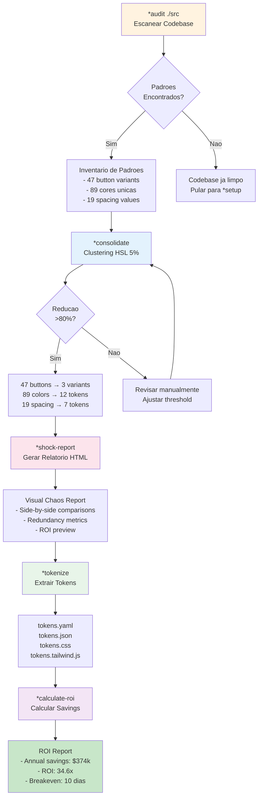
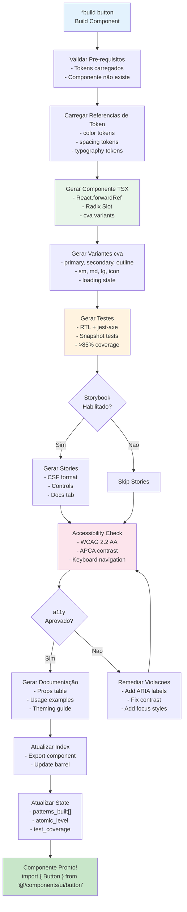
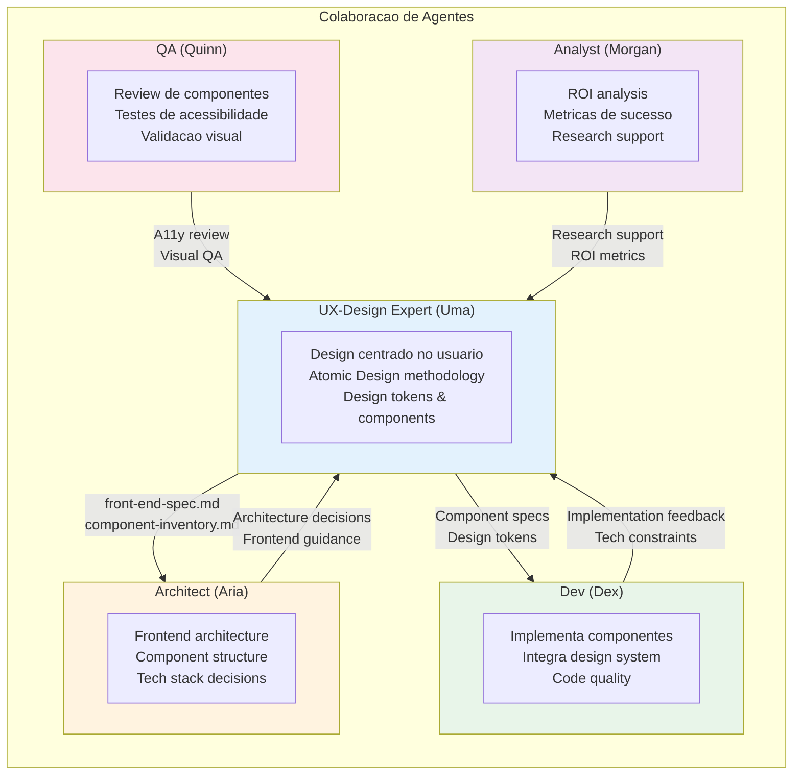
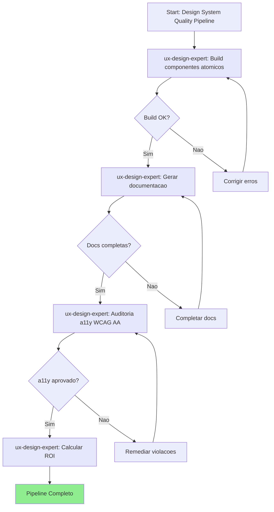
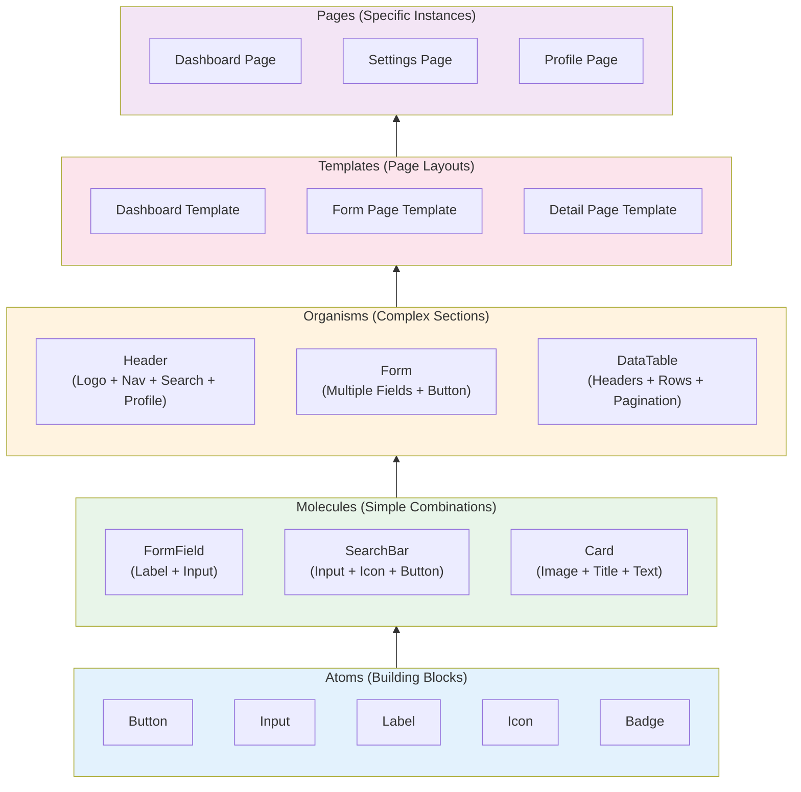

# Sistema UX-Design-Expert AIOS

> **Versão:** 1.0.0
> **Criado:** 2026-02-04
> **Owner:** @ux-design-expert (Uma)
> **Status:** Documentação Oficial

---

## Visão Geral

Este documento descreve o sistema completo do agente **UX-Design Expert (Uma)**, incluindo todos os arquivos envolvidos, fluxos de trabalho, comandos disponiveis, integracoes com outros agentes e workflows AIOS.

O UX-Design Expert e um agente hibrido que combina:
- **Sally's UX Principles** - Empatia, pesquisa de usuario, design centrado no usuario
- **Brad Frost's System Principles** - Atomic Design, design tokens, metricas e ROI

### Propósito

O agente e projetado para:
- Conduzir pesquisa de usuario e criar personas
- Criar wireframes e fluxos de interacao
- Auditar codebases existentes para identificar redundancias de UI
- Extrair e consolidar design tokens
- Construir componentes atomicos (atoms, molecules, organisms)
- Garantir acessibilidade (WCAG AA/AAA)
- Calcular ROI e savings de design systems

---

## Arquitetura de 5 Fases

O UX-Design Expert opera em 5 fases distintas, cada uma com comandos especificos:

```mermaid
flowchart TB
    subgraph PHASE1["Fase 1: UX Research"]
        R1["*research<br/>Pesquisa de Usuario"]
        R2["*wireframe<br/>Criar Wireframes"]
        R3["*generate-ui-prompt<br/>Prompts para v0/Lovable"]
        R4["*create-front-end-spec<br/>Especificacao Frontend"]
    end

    subgraph PHASE2["Fase 2: Design System Audit"]
        A1["*audit {path}<br/>Escanear Redundancias"]
        A2["*consolidate<br/>Clustering Inteligente"]
        A3["*shock-report<br/>Relatorio Visual HTML"]
    end

    subgraph PHASE3["Fase 3: Design Tokens"]
        T1["*tokenize<br/>Extrair Tokens"]
        T2["*setup<br/>Inicializar DS"]
        T3["*migrate<br/>Estrategia de Migracao"]
        T4["*upgrade-tailwind<br/>Upgrade Tailwind v4"]
        T5["*bootstrap-shadcn<br/>Instalar Shadcn/Radix"]
    end

    subgraph PHASE4["Fase 4: Component Building"]
        B1["*build {component}<br/>Construir Atom"]
        B2["*compose {molecule}<br/>Compor Molecule"]
        B3["*extend {component}<br/>Adicionar Variante"]
    end

    subgraph PHASE5["Fase 5: Quality & Documentation"]
        Q1["*document<br/>Pattern Library"]
        Q2["*a11y-check<br/>Auditoria WCAG"]
        Q3["*calculate-roi<br/>Calcular ROI"]
    end

    PHASE1 --> PHASE2
    PHASE2 --> PHASE3
    PHASE3 --> PHASE4
    PHASE4 --> PHASE5

    style PHASE1 fill:#e3f2fd
    style PHASE2 fill:#fff3e0
    style PHASE3 fill:#e8f5e9
    style PHASE4 fill:#fce4ec
    style PHASE5 fill:#f3e5f5
```



---

## Lista Completa de Arquivos

### Arquivo de Definição do Agente

| Arquivo | Propósito |
|---------|-----------|
| `.aios-core/development/agents/ux-design-expert.md` | Definição completa do agente (persona, comandos, workflows) |
| `.claude/commands/AIOS/agents/ux-design-expert.md` | Comando Claude Code para ativar @ux-design-expert |

### Tasks por Fase

#### Fase 1: UX Research & Design (4 tasks)

| Arquivo | Comando | Propósito |
|---------|---------|-----------|
| `.aios-core/development/tasks/ux-user-research.md` | `*research` | Conduzir pesquisa de usuario, criar personas e jornadas |
| `.aios-core/development/tasks/ux-create-wireframe.md` | `*wireframe` | Criar wireframes low/mid/high fidelity |
| `.aios-core/development/tasks/generate-ai-frontend-prompt.md` | `*generate-ui-prompt` | Gerar prompts para v0.dev, Lovable.ai |
| `.aios-core/development/tasks/create-doc.md` | `*create-front-end-spec` | Criar especificacao frontend detalhada |

#### Fase 2: Design System Audit (3 tasks)

| Arquivo | Comando | Propósito |
|---------|---------|-----------|
| `.aios-core/development/tasks/audit-codebase.md` | `*audit {path}` | Escanear codebase para redundancias UI |
| `.aios-core/development/tasks/consolidate-patterns.md` | `*consolidate` | Reduzir redundancia com clustering HSL |
| `.aios-core/development/tasks/generate-shock-report.md` | `*shock-report` | Gerar relatorio visual HTML |

#### Fase 3: Design Tokens & Setup (7 tasks)

| Arquivo | Comando | Propósito |
|---------|---------|-----------|
| `.aios-core/development/tasks/extract-tokens.md` | `*tokenize` | Extrair design tokens (YAML, JSON, CSS, DTCG) |
| `.aios-core/development/tasks/setup-design-system.md` | `*setup` | Inicializar estrutura do design system |
| `.aios-core/development/tasks/generate-migration-strategy.md` | `*migrate` | Gerar estrategia de migracao em 4 fases |
| `.aios-core/development/tasks/tailwind-upgrade.md` | `*upgrade-tailwind` | Upgrade para Tailwind CSS v4 |
| `.aios-core/development/tasks/audit-tailwind-config.md` | `*audit-tailwind-config` | Validar configuracao Tailwind |
| `.aios-core/development/tasks/export-design-tokens-dtcg.md` | `*export-dtcg` | Exportar tokens W3C DTCG |
| `.aios-core/development/tasks/bootstrap-shadcn-library.md` | `*bootstrap-shadcn` | Instalar Shadcn/Radix UI |

#### Fase 4: Atomic Component Building (3 tasks)

| Arquivo | Comando | Propósito |
|---------|---------|-----------|
| `.aios-core/development/tasks/build-component.md` | `*build {component}` | Construir componente atomico (React + TypeScript) |
| `.aios-core/development/tasks/compose-molecule.md` | `*compose {molecule}` | Compor molecule de atoms existentes |
| `.aios-core/development/tasks/extend-pattern.md` | `*extend {component}` | Adicionar variante a componente existente |

#### Fase 5: Quality & Documentation (3 tasks)

| Arquivo | Comando | Propósito |
|---------|---------|-----------|
| `.aios-core/development/tasks/generate-documentation.md` | `*document` | Gerar documentacao do pattern library |
| `.aios-core/development/tasks/calculate-roi.md` | `*calculate-roi` | Calcular ROI e cost savings |
| `.aios-core/development/checklists/accessibility-wcag-checklist.md` | `*a11y-check` | Auditoria de acessibilidade WCAG |

#### Tasks Universais (2 tasks)

| Arquivo | Comando | Propósito |
|---------|---------|-----------|
| `.aios-core/development/tasks/ux-ds-scan-artifact.md` | `*scan {path\|url}` | Analisar HTML/React para extrair padroes |
| `.aios-core/development/tasks/integrate-Squad.md` | `*integrate {squad}` | Conectar com expansion squad |

### Templates

| Arquivo | Propósito |
|---------|-----------|
| `.aios-core/development/templates/front-end-spec-tmpl.yaml` | Template de especificacao frontend |
| `.aios-core/development/templates/tokens-schema-tmpl.yaml` | Schema de design tokens |
| `.aios-core/development/templates/component-react-tmpl.tsx` | Template de componente React |
| `.aios-core/development/templates/state-persistence-tmpl.yaml` | Template de persistencia de estado |
| `.aios-core/development/templates/shock-report-tmpl.html` | Template de shock report HTML |
| `.aios-core/development/templates/migration-strategy-tmpl.md` | Template de estrategia de migracao |
| `.aios-core/development/templates/token-exports-css-tmpl.css` | Template de export CSS |
| `.aios-core/development/templates/token-exports-tailwind-tmpl.js` | Template de export Tailwind |
| `.aios-core/development/templates/ds-artifact-analysis.md` | Template de analise de artefato |

### Checklists

| Arquivo | Propósito |
|---------|-----------|
| `.aios-core/development/checklists/pattern-audit-checklist.md` | Checklist de auditoria de padroes |
| `.aios-core/development/checklists/component-quality-checklist.md` | Checklist de qualidade de componente |
| `.aios-core/development/checklists/accessibility-wcag-checklist.md` | Checklist WCAG AA/AAA |
| `.aios-core/development/checklists/migration-readiness-checklist.md` | Checklist de readiness para migracao |

### Data Files

| Arquivo | Propósito |
|---------|-----------|
| `.aios-core/development/data/technical-preferences.md` | Preferencias tecnicas padrao |
| `.aios-core/development/data/atomic-design-principles.md` | Principios Atomic Design |
| `.aios-core/development/data/design-token-best-practices.md` | Best practices de design tokens |
| `.aios-core/development/data/consolidation-algorithms.md` | Algoritmos de consolidacao |
| `.aios-core/development/data/roi-calculation-guide.md` | Guia de calculo de ROI |
| `.aios-core/development/data/integration-patterns.md` | Padroes de integracao |
| `.aios-core/development/data/wcag-compliance-guide.md` | Guia de conformidade WCAG |

### Workflows Relacionados

| Arquivo | Propósito |
|---------|-----------|
| `.aios-core/development/workflows/design-system-build-quality.yaml` | Pipeline pos-migracao (build, docs, a11y, ROI) |
| `.aios-core/development/workflows/brownfield-ui.yaml` | Workflow para UI brownfield |
| `.aios-core/development/workflows/brownfield-discovery.yaml` | Discovery para projetos existentes |
| `.aios-core/development/workflows/greenfield-ui.yaml` | Workflow para UI greenfield |

### Arquivos de Output

| Arquivo | Propósito |
|---------|-----------|
| `outputs/ux-research/{project}/` | Outputs de pesquisa UX |
| `outputs/wireframes/{project}/` | Wireframes e flows |
| `outputs/design-system/{project}/` | Design system outputs |
| `outputs/design-system/{project}/.state.yaml` | Estado do workflow |

---

## Flowchart: Workflow Completo (UX to Build)

```mermaid
flowchart TB
    subgraph START["Inicio"]
        ACTIVATE["@ux-design-expert"]
    end

    ACTIVATE --> CHECK{"Tipo de<br/>Projeto?"}

    CHECK -->|Greenfield| GF["Workflow Greenfield"]
    CHECK -->|Brownfield| BF["Workflow Brownfield"]
    CHECK -->|Complete| COMPLETE["Workflow Completo"]

    subgraph GF["GREENFIELD (Novo Projeto)"]
        GF1["*research<br/>Pesquisa de Usuario"]
        GF2["*wireframe<br/>Criar Wireframes"]
        GF3["*setup<br/>Inicializar DS"]
        GF4["*build button<br/>Construir Atoms"]
        GF5["*compose form-field<br/>Compor Molecules"]
        GF6["*document<br/>Documentar"]

        GF1 --> GF2 --> GF3 --> GF4 --> GF5 --> GF6
    end

    subgraph BF["BROWNFIELD (Projeto Existente)"]
        BF1["*audit ./src<br/>Escanear Codebase"]
        BF2["*consolidate<br/>Consolidar Padroes"]
        BF3["*tokenize<br/>Extrair Tokens"]
        BF4["*migrate<br/>Estrategia Migracao"]
        BF5["*build button<br/>Construir Componentes"]
        BF6["*document<br/>Documentar"]

        BF1 --> BF2 --> BF3 --> BF4 --> BF5 --> BF6
    end

    subgraph COMPLETE["COMPLETE (5 Fases)"]
        C1["Fase 1: UX Research<br/>*research, *wireframe"]
        C2["Fase 2: Audit<br/>*audit, *consolidate, *shock-report"]
        C3["Fase 3: Tokens<br/>*tokenize, *setup, *migrate"]
        C4["Fase 4: Build<br/>*build, *compose, *extend"]
        C5["Fase 5: Quality<br/>*document, *a11y-check, *calculate-roi"]

        C1 --> C2 --> C3 --> C4 --> C5
    end

    GF --> DONE["Design System Pronto!"]
    BF --> DONE
    COMPLETE --> DONE

    style START fill:#e1f5fe
    style GF fill:#e8f5e9
    style BF fill:#fff3e0
    style COMPLETE fill:#f3e5f5
    style DONE fill:#c8e6c9
```



---

## Flowchart: Workflow de Auditoria Brownfield



---

## Flowchart: Build de Componente Atomico



---

## Mapeamento de Comandos para Tasks

### Fase 1: UX Research & Design

| Comando | Task File | Entrada | Saida |
|---------|-----------|---------|-------|
| `*research` | `ux-user-research.md` | Objetivos, metodos | personas.md, user-journeys.md, insights.md |
| `*wireframe {fidelity}` | `ux-create-wireframe.md` | Screens, use case | wireframes/, flows.md, component-inventory.md |
| `*generate-ui-prompt` | `generate-ai-frontend-prompt.md` | front-end-spec.md | AI prompts for v0/Lovable |
| `*create-front-end-spec` | `create-doc.md` | PRD, wireframes | front-end-spec.md |

### Fase 2: Design System Audit

| Comando | Task File | Entrada | Saida |
|---------|-----------|---------|-------|
| `*audit {path}` | `audit-codebase.md` | Scan path | pattern-inventory.json, .state.yaml |
| `*consolidate` | `consolidate-patterns.md` | Audit results | consolidation-report.md, pattern-mapping.json |
| `*shock-report` | `generate-shock-report.md` | Consolidation | shock-report.html |

### Fase 3: Design Tokens & Setup

| Comando | Task File | Entrada | Saida |
|---------|-----------|---------|-------|
| `*tokenize` | `extract-tokens.md` | Consolidation | tokens.yaml, tokens.json, tokens.css |
| `*setup` | `setup-design-system.md` | Tokens | components/, lib/, docs/ |
| `*migrate` | `generate-migration-strategy.md` | Tokens | migration-strategy.md (4 phases) |
| `*upgrade-tailwind` | `tailwind-upgrade.md` | Config | tailwind.config.ts (v4) |
| `*audit-tailwind-config` | `audit-tailwind-config.md` | Config | audit-report.md |
| `*export-dtcg` | `export-design-tokens-dtcg.md` | tokens.yaml | tokens.dtcg.json (W3C) |
| `*bootstrap-shadcn` | `bootstrap-shadcn-library.md` | Project | Shadcn components |

### Fase 4: Atomic Component Building

| Comando | Task File | Entrada | Saida |
|---------|-----------|---------|-------|
| `*build {component}` | `build-component.md` | Name, variants | Component.tsx, tests, stories, docs |
| `*compose {molecule}` | `compose-molecule.md` | Atom deps | Molecule.tsx, tests |
| `*extend {component}` | `extend-pattern.md` | Component, variant | Updated component + tests |

### Fase 5: Quality & Documentation

| Comando | Task File | Entrada | Saida |
|---------|-----------|---------|-------|
| `*document` | `generate-documentation.md` | Components | Pattern library docs |
| `*a11y-check` | `accessibility-wcag-checklist.md` | Components | a11y-audit-report.md |
| `*calculate-roi` | `calculate-roi.md` | Consolidation | roi-analysis.md, executive-summary.md |

### Comandos Universais

| Comando | Task File | Entrada | Saida |
|---------|-----------|---------|-------|
| `*scan {path\|url}` | `ux-ds-scan-artifact.md` | Artifact | scan-summary.md, design-tokens.yaml |
| `*integrate {squad}` | `integrate-Squad.md` | Squad name | Integration config |
| `*help` | N/A | N/A | Lista de comandos por fase |
| `*status` | N/A | N/A | Estado atual do workflow |
| `*guide` | N/A | N/A | Guia completo do agente |
| `*exit` | N/A | N/A | Sair do modo UX-Design Expert |

---

## Integracoes entre Agentes

### Diagrama de Colaboracao



### Quando Usar Cada Agente

| Necessidade | Agente Recomendado |
|-------------|-------------------|
| Pesquisa de usuario, personas | @ux-design-expert |
| Wireframes e prototipos | @ux-design-expert |
| Auditoria de design system | @ux-design-expert |
| Construcao de componentes | @ux-design-expert ou @dev |
| Arquitetura frontend | @architect |
| Implementacao de codigo | @dev |
| Review de acessibilidade | @ux-design-expert ou @qa |
| Analise de ROI | @ux-design-expert ou @analyst |

### Handoffs Tipicos

| De | Para | Artefato | Propósito |
|----|------|----------|-----------|
| @ux-design-expert | @architect | front-end-spec.md | Especificacao para arquitetura |
| @architect | @ux-design-expert | architecture.md | Constrains tecnicas |
| @ux-design-expert | @dev | Component specs + tokens | Implementacao |
| @dev | @ux-design-expert | Feedback de implementacao | Ajustes de design |
| @qa | @ux-design-expert | A11y report | Remediacoes |

---

## Gestao de Estado

### Arquivo de Estado (.state.yaml)

```yaml
# Localizacao: outputs/ux-design/{project}/.state.yaml
metadata:
  version: "1.0.0"
  generated_by: "Uma (UX-Design Expert)"
  generated_at: "2026-02-04T12:00:00Z"

# UX Phase (Phase 1)
ux_research:
  complete: true
  personas: ["Developer Dave", "Designer Dana", "Manager Mike"]
  key_insights: ["Users need faster workflows", "Accessibility is priority"]
  research_date: "2026-02-04"

wireframes:
  created: ["dashboard", "settings", "profile"]
  fidelity_level: "mid"
  component_inventory: ["Button", "Input", "Card", "Modal"]

# Audit Phase (Phase 2)
audit:
  complete: true
  scan_path: "./src"
  patterns:
    buttons:
      unique: 47
      instances: 327
      redundancy_factor: 6.96
    colors:
      unique_hex: 82
      total_instances: 1247
      redundancy_factor: 14.01
    spacing:
      unique_values: 19

# Consolidation Phase
consolidation:
  complete: true
  patterns_consolidated:
    colors:
      before: 89
      after: 12
      reduction: "86.5%"
    buttons:
      before: 47
      after: 3
      reduction: "93.6%"
  overall_reduction: "81.8%"
  target_met: true

# Tokenization Phase (Phase 3)
tokens:
  extracted: true
  categories:
    colors: 12
    spacing: 7
    typography: 10
    radius: 4
    shadows: 3
  total: 36
  exports: ["yaml", "json", "css", "tailwind", "dtcg"]
  coverage: "96.3%"

# Build Phase (Phase 4)
components:
  built: ["Button", "Input", "Label", "Badge"]
  atomic_levels:
    atoms: ["Button", "Input", "Label", "Icon", "Badge"]
    molecules: ["FormField", "SearchBar", "Card"]
    organisms: ["Header", "Form", "Modal"]
  test_coverage: "92.4%"

# Quality Phase (Phase 5)
quality:
  accessibility:
    score: 98
    wcag_level: "AA"
    violations: 0
  documentation:
    complete: true
    components_documented: 15
  roi:
    annual_savings: "$374,400"
    roi_ratio: 34.6
    breakeven_months: 0.38

# Workflow tracking
workflow:
  current_phase: "quality"
  workflow_type: "brownfield"
  phases_completed: [1, 2, 3, 4, 5]
```

---

## Workflows Relacionados

### design-system-build-quality.yaml

Pipeline pos-migracao que encadeia:
1. **Build** - Compilar componentes atomicos
2. **Document** - Gerar documentacao pattern library
3. **A11y Check** - Auditoria WCAG AA
4. **ROI** - Calcular savings e metricas



### brownfield-ui.yaml

Workflow completo para projetos UI existentes:
1. **Analyze** - @architect analisa projeto
2. **PRD** - @pm cria PRD
3. **Spec** - @ux-design-expert cria front-end-spec
4. **Architecture** - @architect cria arquitetura
5. **Validate** - @po valida artefatos
6. **Development Cycle** - @sm, @dev, @qa

---

## Principios de Design (Atomic Design)

### Hierarquia de Componentes



---

## Best Practices

### 1. UX Research

- **Sempre** comece com pesquisa de usuario antes de design
- Conduza 5-10 entrevistas para insights qualitativos
- Crie personas baseadas em evidencias, não suposicoes
- Documente user journeys com pain points e oportunidades

### 2. Design System Audit

- Execute `*audit` antes de qualquer consolidacao
- Meta: >80% de reducao de redundancia
- Use clustering HSL 5% para cores (perceptual similarity)
- Documente overrides manuais quando necessario

### 3. Design Tokens

- tokens.yaml e source of truth - todos exports derivam dele
- Use naming semantico (primary, not blue-500)
- OKLCH para cores modernas com fallback hex
- Valide com DTCG CLI antes de finalizar

### 4. Component Building

- Componentes devem usar APENAS tokens (zero hardcoded values)
- Use `cva` para variants (class-variance-authority)
- Implemente loading state em todos os componentes interativos
- Testes com >85% coverage + jest-axe para acessibilidade

### 5. Acessibilidade

- WCAG AA e minimo, AAA e ideal
- Contraste: 4.5:1 para texto, 3:1 para UI
- Foco visivel em todos os elementos interativos
- Navegacao por teclado (Tab/Shift+Tab/Space/Enter)

### 6. ROI Calculation

- Use estimativas conservadoras (2 hrs/mes por padrao)
- Inclua todos os custos: implementacao, migracao, treinamento
- Calcule breakeven point antes de apresentar stakeholders
- ROI >2x e minimo para aprovacao

---

## Troubleshooting

### *audit não encontra padroes

**Causa:** Path incorreto ou arquivos não-UI
**Solucao:**
```bash
# Verificar path
*audit ./src/components

# Verificar extensoes
# Suporta: .jsx, .tsx, .vue, .html, .css, .scss
```

### *consolidate não atinge 80%

**Causa:** Padroes muito distintos ou threshold muito baixo
**Solucao:**
- Revisar padroes manualmente
- Ajustar HSL threshold (padrao 5%)
- Aceitar reducao menor com justificativa

### *tokenize gera tokens incompletos

**Causa:** Consolidacao incompleta
**Solucao:**
```bash
# Re-executar consolidacao
*consolidate

# Verificar coverage
# Target: >95%
```

### *build falha com token não encontrado

**Causa:** Token referenciado não existe em tokens.yaml
**Solucao:**
- Verificar nome do token
- Adicionar token faltante em tokens.yaml
- Re-executar `*tokenize` se necessario

### Testes de acessibilidade falham

**Causa:** Violacoes WCAG
**Solucao:**
- Revisar a11y-audit-report.md
- Corrigir violacoes mais criticas primeiro
- Re-executar `*a11y-check` apos correcoes

### State file corrompido

**Causa:** Execucao interrompida
**Solucao:**
```bash
# Backup existe em .state.yaml.bak
# Restaurar ou re-executar comandos desde ultimo estado valido
```

---

## Referencias

### Arquivos de Task

- [ux-user-research.md](../../.aios-core/development/tasks/ux-user-research.md)
- [ux-create-wireframe.md](../../.aios-core/development/tasks/ux-create-wireframe.md)
- [audit-codebase.md](../../.aios-core/development/tasks/audit-codebase.md)
- [consolidate-patterns.md](../../.aios-core/development/tasks/consolidate-patterns.md)
- [extract-tokens.md](../../.aios-core/development/tasks/extract-tokens.md)
- [build-component.md](../../.aios-core/development/tasks/build-component.md)
- [calculate-roi.md](../../.aios-core/development/tasks/calculate-roi.md)

### Arquivos de Workflow

- [design-system-build-quality.yaml](../../.aios-core/development/workflows/design-system-build-quality.yaml)
- [brownfield-ui.yaml](../../.aios-core/development/workflows/brownfield-ui.yaml)

### Definição do Agente

- [ux-design-expert.md](../../.aios-core/development/agents/ux-design-expert.md)

### Recursos Externos

- [Atomic Design by Brad Frost](https://atomicdesign.bradfrost.com/)
- [W3C Design Tokens Format (DTCG)](https://design-tokens.github.io/community-group/format/)
- [WCAG 2.2 Guidelines](https://www.w3.org/TR/WCAG22/)
- [Shadcn/UI](https://ui.shadcn.com/)
- [Tailwind CSS v4](https://tailwindcss.com/)

---

## Resumo

| Aspecto | Detalhes |
|---------|----------|
| **Total de Tasks** | 22 tasks (4 + 3 + 7 + 3 + 3 + 2) |
| **Total de Templates** | 9 templates |
| **Total de Checklists** | 4 checklists |
| **Total de Data Files** | 7 data files |
| **Total de Comandos** | 19 comandos + 4 universais |
| **Fases do Workflow** | 5 (Research, Audit, Tokens, Build, Quality) |
| **Workflows Relacionados** | 4 (design-system-build-quality, brownfield-ui, brownfield-discovery, greenfield-ui) |
| **Agentes Colaboradores** | 4 (@architect, @dev, @qa, @analyst) |
| **Metodologia Central** | Atomic Design (Brad Frost) |
| **Nivel de Acessibilidade** | WCAG AA minimo, AAA ideal |

---

## Changelog

| Data | Autor | Descrição |
|------|-------|-----------|
| 2026-02-04 | @ux-design-expert | Documento inicial criado |

---

*-- Uma, desenhando com empatia*
