# Workflow: Bob Orchestrator

**ID:** `bob-orchestrator`
**Versão:** 1.1
**Tipo:** Meta-Workflow (Orquestração Autônoma)
**Autor:** @architect (Aria)
**Data de Criação:** 2026-02-05
**Última Atualização:** 2026-02-05
**Epic de Referência:** Epic 12 - Bob Full Integration v1.6
**Tags:** bob, orchestrator, automation, meta-workflow, autonomous

---

## Visão Geral

O **Bob Orchestrator** é o meta-workflow central do AIOS que orquestra todo o ciclo de desenvolvimento de forma autônoma. Bob é ativado através do `@pm` com perfil `bob` e atua como um orquestrador que:

- Detecta o estado do projeto automaticamente
- Decide qual workflow executar (Greenfield, Brownfield, Enhancement)
- Spawna agentes em terminais separados para trabalho paralelo
- Gerencia o ciclo de desenvolvimento story por story
- Mantém estado persistente entre sessões
- Interrompe para aprovação humana em pontos de decisão

### Princípio Fundamental: CLI First

```
CLI First → Observability Second → UI Third
```

| Camada | Prioridade | Descrição |
|--------|------------|-----------|
| **CLI** | Máxima | Onde a inteligência vive. Toda execução, decisões e automação. |
| **Observability** | Secundária | Observar e monitorar o que acontece no CLI em tempo real. |
| **UI** | Terciária | Gestão pontual e visualizações quando necessário. |

### Casos de Uso Principais

| Cenário | Recomendado |
|---------|-------------|
| Projeto novo do zero | Sim (PATH D: Greenfield) |
| Projeto existente sem docs AIOS | Sim (PATH B: Brownfield Discovery) |
| Projeto AIOS com novas features | Sim (PATH C: Enhancement) |
| Primeira vez no AIOS | Sim (PATH A: Onboarding) |
| Hotfixes urgentes | Não - use @dev diretamente |
| Tasks pontuais | Não - use agentes individuais |

---

## Diagrama Geral do Workflow

### Mapa Completo do Bob

```mermaid
flowchart TB
    subgraph STARTUP["1. STARTUP"]
        A1[("@pm ativado")] --> A2["resolveConfig()<br/>L1→L2→L3→L4→L5"]
        A2 --> A3{"user_profile<br/>== 'bob'?"}
        A3 -->|Não| PM_TRAD["PM Tradicional<br/>STOP"]
        A3 -->|Sim| A4["CLEANUP automático<br/>(locks, sessions, snapshots)"]
        A4 --> A5["sessionStateExists()?"]
    end

    subgraph SESSION["2. SESSION CHECK"]
        A5 --> S1{"Existe<br/>.session-state.yaml?"}
        S1 -->|Sim + Crash| S2["CRASH RECOVERY"]
        S1 -->|Sim + Normal| S3["SESSION RESUME"]
        S1 -->|Não| S4["DECISION TREE"]
    end

    subgraph RESUME["2b. RESUME OPTIONS"]
        S2 --> R1["[1] CONTINUE<br/>[2] REVIEW<br/>[3] RESTART<br/>[4] DISCARD"]
        S3 --> R1
        R1 --> |CONTINUE| DEV_CYCLE
        R1 --> |REVIEW| R2["Mostra progresso"] --> R1
        R1 --> |RESTART| DEV_CYCLE
        R1 --> |DISCARD| S4
    end

    subgraph TREE["3. DECISION TREE"]
        S4 --> T1{"Tem config?"}
        T1 -->|Não| PA["PATH A:<br/>ONBOARDING"]
        T1 -->|Sim| T2{"Tem docs AIOS?"}
        T2 -->|Não| PB["PATH B:<br/>BROWNFIELD"]
        T2 -->|Sim| PC["PATH C:<br/>ENHANCEMENT"]
        T1 -->|Projeto vazio| PD["PATH D:<br/>GREENFIELD"]
    end

    subgraph PATHS["4. PATHS"]
        PA --> |"Setup completo"| S4
        PB --> |"Discovery completo"| PC
        PD --> |"Arquitetura pronta"| PC
        PC --> ENHANCEMENT
    end

    subgraph ENHANCEMENT["5. ENHANCEMENT WORKFLOW"]
        E1["Classificar pedido"] --> E2{"Precisa PRD?"}
        E2 -->|Sim| E3["spawn @pm<br/>create-prd"]
        E2 -->|Não| E4
        E3 --> E4["spawn @pm<br/>create-epic"]
        E4 --> E5["spawn @sm<br/>create-story-drafts"]
        E5 --> E6["Para cada story:<br/>@po validate"]
        E6 --> DEV_CYCLE
    end

    subgraph DEV_CYCLE["6. DEVELOPMENT CYCLE"]
        direction TB
        D1["PHASE 1: VALIDATION<br/>@po - 10min"] --> D2["PHASE 2: DEVELOPMENT<br/>executor - 2h"]
        D2 --> D3["PHASE 3: SELF-HEALING<br/>@dev - 30min"]
        D3 --> D4["PHASE 4: QUALITY GATE<br/>quality_gate - 30min"]
        D4 --> D5["PHASE 5: PUSH<br/>@devops - 10min"]
        D5 --> D6["PHASE 6: CHECKPOINT<br/>@po - HUMANO"]
    end

    subgraph CHECKPOINT["7. CHECKPOINT"]
        D6 --> C1{"Opção?"}
        C1 -->|GO| C2["Próxima story"] --> D1
        C1 -->|PAUSE| C3["Salvar estado<br/>FIM"]
        C1 -->|REVIEW| C4["Mostrar changes"] --> D6
        C1 -->|ABORT| C5["Epic interrompido<br/>FIM"]
        C2 --> |"Todas completas"| DONE
    end

    subgraph COMPLETION["8. CONCLUSÃO"]
        DONE(["🎉 Epic Complete!"])
        DONE --> S4
    end

    style A1 fill:#E8F5E9,stroke:#4CAF50,stroke-width:2px
    style DONE fill:#90EE90,stroke:#2E7D32,stroke-width:3px
    style PA fill:#FFE4B5,stroke:#F57C00
    style PB fill:#FFE4B5,stroke:#F57C00
    style PC fill:#ADD8E6,stroke:#1976D2
    style PD fill:#FFE4B5,stroke:#F57C00
    style DEV_CYCLE fill:#E8F5E9,stroke:#4CAF50
    style D6 fill:#FFCDD2,stroke:#D32F2F,stroke-width:2px
```

---

## Diagrama de Sequência: Fluxo Completo

```mermaid
sequenceDiagram
    autonumber
    participant U as Usuário
    participant BOB as Bob (@pm)
    participant AR as @architect
    participant SM as @sm
    participant PO as @po
    participant DEV as @dev / executor
    participant QG as Quality Gate
    participant DOP as @devops
    participant OBS as Observability

    rect rgb(255, 248, 220)
        Note over BOB: STARTUP
        U->>BOB: Ativar @pm (perfil bob)
        BOB->>BOB: resolveConfig() L1→L5
        BOB->>BOB: CLEANUP (locks, sessions)
        BOB->>BOB: sessionStateExists()?
    end

    alt Sessão anterior existe
        rect rgb(240, 230, 140)
            Note over BOB: SESSION RESUME
            BOB->>U: "Detectei sessão anterior..."
            U->>BOB: [1] CONTINUE | [2] REVIEW | [3] RESTART | [4] DISCARD
        end
    end

    rect rgb(173, 216, 230)
        Note over BOB: DECISION TREE
        BOB->>BOB: Analisar projeto (determinístico)
        alt PATH A: Onboarding
            BOB->>U: "Primeira vez? Vamos configurar..."
        else PATH B: Brownfield
            BOB->>AR: spawn 'analyze-structure'
            BOB->>U: "Encontrei débitos técnicos..."
        else PATH C: Enhancement
            BOB->>U: "O que quer fazer?"
        else PATH D: Greenfield
            BOB->>AR: spawn 'create-full-stack-architecture'
        end
    end

    rect rgb(221, 160, 221)
        Note over BOB,SM: ENHANCEMENT WORKFLOW
        BOB->>SM: spawn 'create-prd' (se necessário)
        SM-->>BOB: PRD criado
        BOB->>SM: spawn 'create-epic'
        SM-->>BOB: Epic com stories
        loop Para cada story
            BOB->>PO: spawn 'validate-story-draft'
            PO-->>BOB: Story validada
        end
    end

    rect rgb(152, 251, 152)
        Note over BOB,DOP: DEVELOPMENT CYCLE (por story)

        BOB->>OBS: setPipelineStage('validation')
        BOB->>PO: PHASE 1: Validar story
        PO-->>BOB: OK

        BOB->>OBS: setPipelineStage('development')
        BOB->>DEV: PHASE 2: spawn executor (terminal limpo)
        DEV->>DEV: Implementar + testes
        DEV-->>BOB: Código pronto

        alt CodeRabbit habilitado
            BOB->>OBS: setPipelineStage('self-healing')
            BOB->>DEV: PHASE 3: CodeRabbit scan
            DEV-->>BOB: Issues filtrados (CRITICAL/HIGH)
        end

        BOB->>OBS: setPipelineStage('quality-gate')
        BOB->>QG: PHASE 4: spawn quality_gate (≠ executor)
        QG->>QG: Review código + ACs
        alt Quality Gate OK
            QG-->>BOB: APPROVED
        else Quality Gate FAIL
            QG-->>DEV: Feedback para fixes
            DEV-->>QG: Re-submit
        end

        BOB->>OBS: setPipelineStage('push')
        BOB->>DOP: PHASE 5: spawn @devops 'push-story'
        DOP->>DOP: Pre-push checks + git push + PR
        DOP-->>BOB: PR criada

        BOB->>OBS: setPipelineStage('checkpoint')
        BOB->>U: PHASE 6: "✅ Story completa! [GO/PAUSE/REVIEW/ABORT]"
    end

    alt GO
        U->>BOB: GO
        Note over BOB: Próxima story → volta ao DEVELOPMENT CYCLE
    else PAUSE
        U->>BOB: PAUSE
        BOB->>BOB: recordPause() → .session-state.yaml
        BOB-->>U: "Até logo!"
    else ABORT
        U->>BOB: ABORT
        BOB-->>U: "Epic interrompido. Progresso salvo."
    end
```

---

## Steps Detalhados

### 1. STARTUP SEQUENCE

| Atributo | Valor |
|----------|-------|
| **Step ID** | `startup` |
| **Trigger** | Ativação de `@pm` |
| **Timeout** | 30s |
| **Módulo** | `config-resolver.js` |

#### Processo

```mermaid
flowchart LR
    A["@pm ativado"] --> B["resolveConfig()"]
    B --> C["L1: Framework<br/>.aios-core/framework-config.yaml"]
    C --> D["L2: Project<br/>.aios-core/project-config.yaml"]
    D --> E["Pro: Extension<br/>pro/pro-config.yaml"]
    E --> F["L3: App<br/>apps/*/aios-app.config.yaml"]
    F --> G["L4: Local<br/>.aios-core/local-config.yaml"]
    G --> H["L5: User<br/>~/.aios/user-config.yaml"]
    H --> I{"user_profile<br/>== 'bob'?"}
    I -->|Não| J["PM Tradicional"]
    I -->|Sim| K["BOB Mode"]
```

#### Config Hierarchy (PRO-4 + Epic 12.1/12.2)

| Layer | Local | Escopo | Git |
|-------|-------|--------|-----|
| **L1 Framework** | `.aios-core/framework-config.yaml` | Read-only, ships com npm | ✗ |
| **L2 Project** | `.aios-core/project-config.yaml` | Team-shared | ✓ |
| **Pro Extension** | `pro/pro-config.yaml` | Opcional | ✓ |
| **L3 App** | `apps/*/aios-app.config.yaml` | Monorepo | ✓ |
| **L4 Local** | `.aios-core/local-config.yaml` | Machine-specific | ✗ |
| **L5 User** | `~/.aios/user-config.yaml` | Cross-project, per-user | ✗ |

#### Config Resolvido

| Campo | Descrição | Default |
|-------|-----------|---------|
| `user_profile` | `bob` ou `advanced` | `bob` |
| `educational_mode` | Painel detalhado | `false` |
| `coderabbit_integration` | Self-healing ativo | `true` |
| `default_model` | Modelo padrão | `claude-opus-4-5-20250514` |
| `default_language` | Idioma | `pt` |

---

### 2. CLEANUP AUTOMÁTICO

| Atributo | Valor |
|----------|-------|
| **Step ID** | `cleanup` |
| **Módulo** | `session-state.js` |
| **Execução** | Automática no startup |

#### O que é limpo

| Item | Critério | Ação |
|------|----------|------|
| Lock files | TTL expirado ou PID morto | Remover |
| Sessions | > 30 dias sem update | Arquivar |
| Snapshots | > 90 dias | Remover (manter index) |

#### Output

```
Cleanup: 2 locks, 1 session, 0 snapshots removed
```

---

### 3. SESSION CHECK

| Atributo | Valor |
|----------|-------|
| **Step ID** | `session_check` |
| **Arquivo** | `.aios/.session-state.yaml` |
| **Módulo** | `session-state.js` |

#### Detecção de Crash

```mermaid
flowchart TB
    A["Ler .session-state.yaml"] --> B{"last_updated<br/>> 30min?"}
    B -->|Sim| C["CRASH detectado"]
    B -->|Não| D["PAUSE normal"]
    C --> E["Mostrar contexto<br/>+ opções de recovery"]
    D --> F["Mostrar progresso<br/>+ opções de resume"]
```

#### Opções de Resume

| Opção | Descrição | Ação |
|-------|-----------|------|
| **CONTINUE** | Retoma de onde parou | `loadSessionState()` → execute() |
| **REVIEW** | Mostra o que foi feito | `getProgressSummary()` → pergunta |
| **RESTART** | Reinicia story atual | reset story → execute() do início |
| **DISCARD** | Arquiva sessão | `discard()` → DECISION TREE |

---

### 4. DECISION TREE

| Atributo | Valor |
|----------|-------|
| **Step ID** | `decision_tree` |
| **Tipo** | Script determinístico (NÃO LLM) |
| **Módulo** | `bob-orchestrator.js` |

#### Árvore de Decisão

```mermaid
flowchart TB
    START["Analisar projeto"] --> Q1{"Tem config<br/>resolvido?"}
    Q1 -->|Não| PA["PATH A:<br/>ONBOARDING"]
    Q1 -->|Sim| Q2{"Tem docs AIOS?<br/>(architecture.md, stories/)"}
    Q2 -->|Não| PB["PATH B:<br/>BROWNFIELD DISCOVERY"]
    Q2 -->|Sim| PC["PATH C:<br/>ENHANCEMENT"]
    Q1 -->|Diretório vazio| PD["PATH D:<br/>GREENFIELD"]

    PA --> |"Setup completo"| START
    PB --> |"Discovery completo"| PC
    PD --> |"Arquitetura pronta"| PC

    style PA fill:#FFE4B5
    style PB fill:#FFE4B5
    style PC fill:#ADD8E6
    style PD fill:#FFE4B5
```

---

### 5. PATH A: ONBOARDING

| Atributo | Valor |
|----------|-------|
| **Condição** | Config não resolvido |
| **Duração** | 10-15 min |
| **Story Epic 12** | 12.1, 12.9 |
| **Interativo** | Sim |

#### Processo

1. Pergunta perfil do usuário
2. Cria arquivos de config
3. Setup GitHub (se necessário)
4. Volta ao DECISION TREE

#### Pergunta de Perfil (PRD §2.4)

```
🤖 Bem-vindo ao AIOS!

Quando uma IA gera código para você, qual opção te descreve melhor?

[1] 🟢 Modo Assistido (Recomendado)
    → "Não sei avaliar se o código está certo ou errado"

[2] 🔵 Modo Avançado
    → "Consigo identificar quando algo está errado e corrigir"

Escolha [1/2]:
```

#### Instalação via NPX (Story 12.9)

```bash
npx @synkra/aios-install
```

O instalador:
- Detecta OS (macOS, Windows/WSL, Linux)
- Verifica dependências (Node ≥18, Git, Docker, gh)
- Pergunta perfil
- Cria `~/.aios/user-config.yaml` (L5)
- Executa Environment Bootstrap
- < 5 minutos em conexão média

---

### 6. PATH B: BROWNFIELD DISCOVERY

| Atributo | Valor |
|----------|-------|
| **Condição** | Projeto existente SEM docs AIOS |
| **Duração** | 2-4 horas |
| **Story Epic 12** | 12.8 |
| **Módulo** | `terminal-spawner.js` |

#### Diagrama de Sequência

```mermaid
sequenceDiagram
    participant BOB as Bob
    participant AR as @architect
    participant DE as @data-engineer
    participant UX as @ux-design-expert
    participant DOP as @devops
    participant U as Usuário

    Note over BOB: FASE 1: Análise Paralela
    par Terminais em paralelo
        BOB->>AR: spawn 'analyze-structure'
        BOB->>DE: spawn 'analyze-db'
        BOB->>UX: spawn 'analyze-ui'
        BOB->>DOP: spawn 'analyze-infra'
    end

    AR-->>BOB: análise sistema
    DE-->>BOB: análise database
    UX-->>BOB: análise frontend
    DOP-->>BOB: análise infra

    Note over BOB: FASE 2: Consolidação
    BOB->>AR: consolidar análises
    AR-->>BOB: architecture.md + technical-debt-report.md

    Note over BOB: SURFACE: Múltiplas opções
    BOB->>U: "Encontrei N débitos.<br/>[1] Resolver débitos<br/>[2] Adicionar feature"
    U->>BOB: Escolha
    BOB->>BOB: → PATH C com contexto
```

#### ObservabilityPanel durante Brownfield

```
┌─────────────────────────────────────────────┐
│ 🤖 Bob — Brownfield Discovery     ⏱ 2m15s  │
│ Terminals: 4 active                         │
│ @architect ● | @data-engineer ● |           │
│ @ux-design ● | @devops ●                    │
└─────────────────────────────────────────────┘
```

---

### 7. PATH C: ENHANCEMENT WORKFLOW

| Atributo | Valor |
|----------|-------|
| **Condição** | Projeto AIOS com docs existentes |
| **Story Epic 12** | 12.3 |
| **Módulo** | `executor-assignment.js` |

#### Classificação do Pedido

| Tipo | Workflow | PRD Necessário |
|------|----------|----------------|
| `new_feature` | Enhancement completo | Sim (se grande) |
| `bug_fix` | Bug Fix Flow | Não |
| `refactoring` | Refactoring Flow | Não |
| `tech_debt` | Tech Debt Flow | Não |

#### Diagrama do Enhancement

```mermaid
flowchart TB
    subgraph CLASSIFY["Classificação"]
        A["Usuário descreve pedido"] --> B["Bob classifica"]
        B --> C{"Tipo?"}
        C -->|new_feature| D1["Enhancement Workflow"]
        C -->|bug_fix| D2["Bug Fix Flow"]
        C -->|refactoring| D3["Refactoring Flow"]
        C -->|tech_debt| D4["Tech Debt Flow"]
    end

    subgraph SURFACE["Surface Check"]
        D1 --> S1{"Custo > $5?"}
        S1 -->|Sim| S2["Bob: 'Isso vai consumir ~$X. Confirma?'"]
        S1 -->|Não| S3{"Risco HIGH?"}
        S3 -->|Sim| S4["Bob: 'Risco alto. GO/NO-GO?'"]
        S3 -->|Não| PRD
    end

    subgraph PRD_EPIC["PRD + Epic"]
        PRD["FASE 1: PRD"] --> EPIC["FASE 2: EPIC"]
        EPIC --> STORIES["FASE 3: STORY DRAFTS"]
        STORIES --> VALIDATE["PO Validation"]
        VALIDATE --> DEV["→ DEVELOPMENT CYCLE"]
    end
```

#### Dynamic Executor Assignment

Dentro do Epic, cada story recebe:

| Campo | Descrição | Exemplo |
|-------|-----------|---------|
| `executor` | Agente que implementa | `@dev`, `@data-engineer` |
| `quality_gate` | Agente que revisa (≠ executor) | `@architect`, `@dev` |
| `quality_gate_tools` | Ferramentas do QG | `[code_review, arch_review]` |

---

### 7b. PATH D: GREENFIELD WORKFLOW

| Atributo | Valor |
|----------|-------|
| **Condição** | Projeto novo (sem `package.json`, `.git`, `docs/`) |
| **Story Epic 12** | 12.13 |
| **Módulo** | `greenfield-handler.js` |
| **Workflow** | `greenfield-fullstack.yaml` |

#### Diagrama do Greenfield

```mermaid
flowchart TB
    subgraph DETECT["Detecção"]
        A["Bob detecta Greenfield"] --> B{"Nenhum package.json<br/>nem .git nem docs/?"}
        B -->|Sim| C["Acionar greenfield-fullstack.yaml"]
    end

    subgraph PHASE0["Phase 0: Environment Bootstrap"]
        C --> D["spawn @devops<br/>'environment-bootstrap.md'"]
        D --> E["Setup: git, npm, estrutura"]
    end

    subgraph PHASE1["Phase 1: Discovery & Planning"]
        E --> F["spawn @analyst<br/>'market-research'"]
        F --> G["spawn @pm<br/>'create-prd'"]
        G --> H["spawn @ux-design-expert<br/>'user-journeys'"]
        H --> I["spawn @architect<br/>'create-full-stack-architecture'"]
        I --> J["spawn @po<br/>'validate-architecture'"]
    end

    subgraph PHASE2["Phase 2: Document Sharding"]
        J --> K["spawn @po<br/>'shard-prd'"]
        K --> L["PRD → Epic → Stories"]
    end

    subgraph PHASE3["Phase 3: Development"]
        L --> M["→ DEVELOPMENT CYCLE<br/>(reutiliza WorkflowExecutor)"]
    end

    style PHASE0 fill:#FFE4B5
    style PHASE1 fill:#ADD8E6
    style PHASE2 fill:#DDA0DD
    style PHASE3 fill:#98FB98
```

#### Sequência de Agentes (Phase 1)

| Ordem | Agente | Task | Output |
|-------|--------|------|--------|
| 1 | @analyst | market-research | `docs/research/market-analysis.md` |
| 2 | @pm | create-prd | `docs/prd/PRD.md` |
| 3 | @ux-design-expert | user-journeys | `docs/ux/user-journeys.md` |
| 4 | @architect | create-full-stack-architecture | `docs/architecture/architecture.md` |
| 5 | @po | validate-architecture | Aprovação |

#### Surface Decisions

- GO/PAUSE entre cada phase
- Session state persiste fase atual para resume
- Se agente falha → Retry / Skip / Abort
- Workflow idempotente — re-executar atualiza, não duplica

---

### 8. DEVELOPMENT CYCLE

| Atributo | Valor |
|----------|-------|
| **Step ID** | `development_cycle` |
| **Story Epic 12** | 12.3 |
| **Módulo** | `workflow-executor.js` |
| **Repetição** | Uma vez por story |

#### Visão Geral das Fases

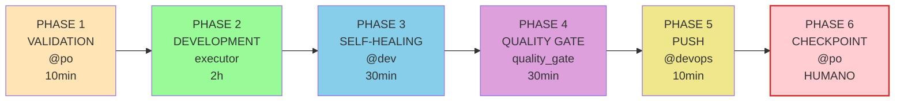

---

### 8.1 PHASE 1: VALIDATION

| Atributo | Valor |
|----------|-------|
| **Agente** | @po (Pax) |
| **Timeout** | 10 min |
| **Error Handler** | `reject_with_feedback` → volta ao SM |

#### Checklist de Validação

- [ ] Executor atribuído?
- [ ] Quality gate ≠ executor?
- [ ] Acceptance criteria claros?
- [ ] Epic context consistente?
- [ ] Files_to_modify identificados?

#### Epic Context Accumulator (Story 12.4)

O PO valida a story usando contexto acumulado com **sumarização progressiva**:

```mermaid
flowchart LR
    subgraph RECENT["N-3 to N-1 (Full Detail)"]
        R1["600 tokens max/story"]
        R2["Todos os campos"]
    end

    subgraph MEDIUM["N-6 to N-4 (50%)"]
        M1["id, title, executor"]
        M2["status, files_modified"]
    end

    subgraph OLD["1 to N-7 (10%)"]
        O1["id, executor, status"]
    end

    RECENT --> CONTEXT["Accumulated Context<br/>≤ 8000 tokens"]
    MEDIUM --> CONTEXT
    OLD --> CONTEXT
```

**Níveis de Compressão:**

| Nível | Campos | Aplica-se a | Tokens |
|-------|--------|-------------|--------|
| `full_detail` | id, title, executor, quality_gate, status, acceptance_criteria, files_modified, dev_notes | N-3 to N-1 | ≤600/story |
| `metadata_plus_files` | id, title, executor, status, files_modified | N-6 to N-4 | ~200/story |
| `metadata_only` | id, executor, status | 1 to N-7 | ~50/story |

**Exceções (override para `metadata_plus_files`):**
- Story tocou arquivos que Story N vai modificar (file overlap)
- Story do mesmo executor que Story N

**Cascata de Compressão (se exceder 8000 tokens):**
1. `metadata_only` nas stories mais antigas
2. Remover `files_modified` das médias
3. Truncar `dev_notes` das recentes
4. Remover `acceptance_criteria` das recentes

---

### 8.2 PHASE 2: DEVELOPMENT

| Atributo | Valor |
|----------|-------|
| **Agente** | `${story.executor}` (dinâmico) |
| **Timeout** | 2 horas |
| **Módulo** | `terminal-spawner.js` |
| **Error Handler** | `return_to_po` (max 3 tentativas) |

#### Surface Check Antes de Spawnar

```javascript
surfaceChecker.shouldSurface({
  action_type: 'spawn_agent',
  estimated_cost: calculado,
  risk_level: calculado
})
```

Se `should_surface: true` → Bob interrompe e mostra ao usuário.

#### Execução em Terminal Limpo

```mermaid
flowchart TB
    subgraph SPAWN["spawn executor"]
        A["Agente recebe:"] --> B["- Story completa com ACs"]
        B --> C["- Arquivos relevantes"]
        C --> D["- Epic context comprimido"]
    end

    subgraph EXEC["Execução"]
        D --> E["Implementar código"]
        E --> F["Rodar testes unitários"]
        F --> G["Gerar output"]
    end

    subgraph COLLECT["Coleta"]
        G --> H["Bob coleta via pollForOutput()"]
        H --> I["sessionState.recordPhaseChange()"]
    end
```

---

### 8.3 PHASE 3: SELF-HEALING

| Atributo | Valor |
|----------|-------|
| **Agente** | @dev |
| **Timeout** | 30 min |
| **Condição** | `coderabbit_integration.enabled == true` |
| **Max Iterations** | 3 |

#### Fluxo Self-Healing

```mermaid
flowchart TB
    A["CodeRabbit CLI scan"] --> B["Parse output"]
    B --> C["Filtrar: apenas CRITICAL e HIGH"]
    C --> D{"Issues<br/>encontrados?"}
    D -->|Não| E["✓ Código limpo!<br/>→ Phase 4"]
    D -->|Sim| F{"iteration < 3?"}
    F -->|Sim| G["attemptAutoFix()"]
    G --> H["iteration++"]
    H --> A
    F -->|Não| I["Log issues para QG avaliar"]
    I --> E

    style E fill:#90EE90
```

---

### 8.4 PHASE 4: QUALITY GATE

| Atributo | Valor |
|----------|-------|
| **Agente** | `${story.quality_gate}` (sempre ≠ executor) |
| **Timeout** | 30 min |
| **Error Handler** | `return_to_development` (max 3 tentativas) |

#### Regra de Assignment

| Executor | Quality Gate |
|----------|--------------|
| @dev | @architect |
| @data-engineer | @dev |
| @devops | @architect |

#### Checklist do Reviewer

- [ ] Código atende acceptance criteria?
- [ ] Segue patterns da arquitetura?
- [ ] Testes adequados?
- [ ] Sem regressões?

#### Resultado

| Decisão | Ação |
|---------|------|
| **APPROVED** | → Phase 5 |
| **REJECTED** | → volta Phase 2 com feedback |

Se 3 falhas → SURFACE: Bob pede ajuda humana.

---

### 8.5 PHASE 5: PUSH

| Atributo | Valor |
|----------|-------|
| **Agente** | @devops (Gage) |
| **Timeout** | 10 min |
| **Surface** | Obrigatório (C005: destructive_action) |

#### Processo

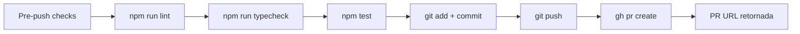

#### Surface Check Obrigatório

```
Bob: "Vou fazer push da Story 7.4 para main. Confirma?"
```

(ou automático se yolo mode / não-destrutivo)

---

### 8.6 PHASE 6: CHECKPOINT

| Atributo | Valor |
|----------|-------|
| **Agente** | @po |
| **Timeout** | 30 min |
| **Elicit** | **SEMPRE** (humano decide) |

#### *** AQUI O BOB SEMPRE PARA E PERGUNTA AO HUMANO ***

```
Bob: "✅ Story 7.4 completa! PR #42 criada.

  Progresso: 4/8 stories completas
  Próxima: Story 7.5 — Implementar refresh tokens
  Executor: @data-engineer | QG: @dev

  [GO]     → Continuar para próxima story
  [PAUSE]  → Salvar e continuar depois
  [REVIEW] → Quero ver o que foi feito
  [ABORT]  → Parar o épico"
```

#### Ações

| Opção | Ação |
|-------|------|
| **GO** | `recordPhaseChange()` → próxima story → Phase 1 |
| **PAUSE** | `recordPause()` → salva estado → "Até logo!" |
| **REVIEW** | mostra changes, files, PRs → pergunta de novo |
| **ABORT** | "Epic interrompido. Progresso salvo." → FIM |

---

## Surface Criteria (Quando Bob Interrompe)

A cada decisão significativa, ANTES de agir:

```javascript
surfaceChecker.shouldSurface(context)
```

### Ordem de Avaliação (primeira match ganha)

| Código | Critério | Ação |
|--------|----------|------|
| **C005** | Ação destrutiva? (delete, drop, force_push, rm_rf) | **SEMPRE confirma. NUNCA bypassável.** |
| **C002** | Risco HIGH? | "🔴 Risco alto. GO/NO-GO?" |
| **C004** | 2+ erros na mesma task? | "⏸ Encontrei problemas. Preciso de ajuda." |
| **C001** | Custo > $5? | "💰 Isso vai consumir ~$X. Confirma?" |
| **C006** | Escopo expandiu? | "📏 Escopo cresceu. Confirma expansão?" |
| **C003** | 2+ opções válidas sem info? | "🔀 Encontrei N opções. Qual?" |
| **C007** | Dependência externa? | "🔗 Preciso de [chave/acesso]. Pode fornecer?" |

---

## Observability

### CLI Panel (SEMPRE FUNCIONA — zero dependências)

#### Modo Minimal (educational_mode: false — DEFAULT)

```
┌─────────────────────────────────────────────┐
│ 🤖 Bob                          ⏱ 23m15s   │
│ [PRD ✓] → [Epic ✓] → [3/8] → [Dev ●] → QA │
│ @dev — implementing jwt-handler             │
│ Terminals: 2 (@dev, @data-engineer)         │
└─────────────────────────────────────────────┘
```
~8 linhas, refresh 1s

#### Modo Detailed (educational_mode: true)

```
┌─────────────────────────────────────────────┐
│ 🤖 Bob                          ⏱ 23m15s   │
│ [PRD ✓] → [Epic ✓] → [3/8] → [Dev ●] → QA │
│                                             │
│ Current: @dev (Dex)                         │
│ Task: implementing jwt-handler              │
│ Why: Story type 'code_general' → @dev       │
│                                             │
│ Tradeoffs considered:                       │
│  • jose vs jsonwebtoken (chose jose: ESM)   │
│  • Stateless vs DB sessions (chose JWT)     │
│                                             │
│ Terminals: 2                                │
│  @dev pid:12345 — jwt-handler (4m32s)       │
│  @data-engineer pid:12346 — schema (2m15s)  │
│                                             │
│ Next: Quality Gate → @architect             │
└─────────────────────────────────────────────┘
```
~20 linhas, refresh 1s

### Dashboard (OPCIONAL — consome bob-status.json + WebSocket)

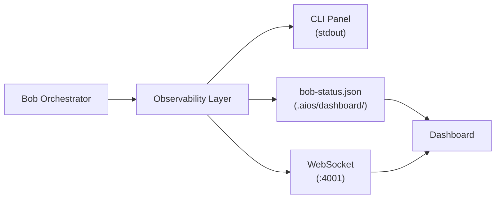

#### Dashboard Components

| Component | Descrição |
|-----------|-----------|
| `BobPipelinePanel` | Progress visual do pipeline |
| `BobAgentActivity` | Terminais ativos com status |
| `BobSurfaceAlert` | Alertas quando checkpoint pendente |
| Kanban badges | Badge 🤖 quando Bob orquestra |
| Status bar | "Bob: active \| @dev working \| Story 3/8" |

---

## Modo Educativo (Story 12.7)

| Atributo | Valor |
|----------|-------|
| **Config** | `educational_mode: false` em L5 (default OFF) |
| **Toggle Sessão** | Persiste em `session-state.yaml` (`overrides.educational_mode`) |
| **Toggle Permanente** | Persiste em `user-config.yaml` (L5) |

### Comparação de Modos

**Modo OFF (default):**
```
Bob: "✅ Autenticação JWT implementada. 4 arquivos criados."
```

**Modo ON:**
```
Bob: "Vou criar autenticação JWT. Isso envolve:
📚 Por que JWT? Stateless, escalável...
🔧 O que vou fazer: @data-engineer cria tabela, @dev implementa handler...
Quer que eu execute?"
```

### Toggle via Comando

```
"Bob, ativa modo educativo"
```

---

## Data Architecture

### Mapa de Persistência

| Dado | Formato | Local | Ciclo de Vida | Consumidores |
|------|---------|-------|---------------|--------------|
| User Config (L5) | YAML | `~/.aios/user-config.yaml` | Permanente (cross-project) | Bob, greeting-builder |
| Project Config (L2) | YAML | `.aios-core/project-config.yaml` | Permanente (per-project, git) | Bob, agents |
| Session State | YAML | `docs/stories/.session-state.yaml` | Ativo → Arquivar após 30 dias | Bob, Epic Context |
| Lock Files | YAML | `.aios/locks/*.lock` | TTL 300s + auto-cleanup | Bob |
| Epic Context | In-memory | N/A (computed on-demand) | Efêmero | PO |
| Bob Status | JSON | `.aios/dashboard/bob-status.json` | Atualizado a cada fase, stale após 5min | CLI Panel, Dashboard |
| Snapshots | JSON | `.aios/snapshots/*.json` | Remover após 90 dias | Bob |
| Timeline | JSON | `.aios/timeline/unified-timeline.json` | Permanente (append-only) | Dashboard |

### Lock File Schema (Story 12.3)

```yaml
# .aios/locks/<resource>.lock
pid: 12345                    # PID do processo que adquiriu o lock
owner: "bob-orchestrator"     # Identificador do módulo
created_at: "2026-02-05T..."  # ISO timestamp de aquisição
ttl_seconds: 300              # Auto-expire após 5 minutos (default)
resource: "session-state"     # Recurso sendo protegido
```

**Cleanup automático no startup:**
- Lock files com TTL expirado → remover
- Lock files de PIDs inexistentes → remover
- Retry strategy: se lock ativo, esperar 2s e re-checar (max 3 tentativas)

### Schema bob-status.json (Story 12.6)

```json
{
  "version": "1.0",
  "timestamp": "ISO8601",
  "orchestration": {
    "active": true,
    "mode": "bob",
    "epic_id": "epic-12",
    "current_story": "12.3"
  },
  "pipeline": {
    "stages": ["validation", "development", "self_healing", "quality_gate", "push", "checkpoint"],
    "current_stage": "development",
    "story_progress": "3/8",
    "completed_stages": ["validation"]
  },
  "current_agent": {
    "id": "dev",
    "name": "Dex",
    "task": "implementing jwt-handler",
    "reason": "Story type: code_general → executor: dev",
    "started_at": "ISO8601"
  },
  "active_terminals": [
    { "agent": "dev", "pid": 12345, "task": "jwt-handler", "elapsed": "4m32s" }
  ],
  "surface_decisions": [
    { "criteria": "C003", "action": "present_options", "timestamp": "ISO8601", "resolved": false }
  ],
  "elapsed": {
    "story_seconds": 272,
    "session_seconds": 1380
  },
  "errors": [],
  "educational": {
    "enabled": false,
    "tradeoffs": [],
    "reasoning": []
  }
}
```

### WebSocket Events (Story 12.6)

```typescript
type BobEvent =
  | { type: 'BobPhaseChange'; phase: string; story: string; executor: string }
  | { type: 'BobAgentSpawned'; agent: string; pid: number; task: string }
  | { type: 'BobAgentCompleted'; agent: string; pid: number; success: boolean; duration: number }
  | { type: 'BobSurfaceDecision'; criteria: string; action: string; context: object }
  | { type: 'BobError'; phase: string; message: string; recoverable: boolean }
```

### Fluxo de Dados CLI + Dashboard

```
                    ┌──────────────────┐
                    │  Config Resolver  │ ← L1→L2→Pro→L3→L4→L5 merge
                    │  (config-resolver │
                    │   .js - PRO-4)   │
                    └────────┬─────────┘
                             │ resolveConfig()
                             ▼
┌─────────────────────────────────────────────────┐
│              Bob Orchestrator (12.3)             │
│  reads: config, session-state, stories, locks   │
│  writes: session-state, locks, bob-status.json  │
└──────┬──────────────┬──────────────┬────────────┘
       │              │              │
       ▼              ▼              ▼
┌────────────┐ ┌────────────┐ ┌─────────────────────────────────┐
│Epic Context│ │Session     │ │  Observability Layer (12.6)      │
│Accumulator │ │State       │ │  WRITES TO:                     │
│(12.4)      │ │(11.5/12.5) │ │  ├── stdout (panel-renderer.js) │
│8000 tokens │ │crash/resume│ │  ├── bob-status.json (file)      │
└────────────┘ └────────────┘ │  └── WebSocket events (if up)    │
                              └──────────┬──────────────────────┘
                                         │
                    ┌────────────────────┼────────────────────┐
                    │                    │                    │
                    ▼                    ▼                    ▼
           ┌──────────────┐   ┌──────────────┐   ┌──────────────┐
           │  CLI Panel   │   │  Dashboard   │   │  Dashboard   │
           │  (terminal)  │   │  Polling     │   │  WebSocket   │
           │              │   │  /api/bob/   │   │  :4001       │
           │  ALWAYS      │   │  status      │   │  /stream     │
           │  WORKS       │   │              │   │              │
           └──────────────┘   └──────┬───────┘   └──────┬───────┘
                                     │                   │
                                     ▼                   ▼
                              ┌─────────────────────────────────┐
                              │  Dashboard Bob Panel (12.12)     │
                              │  bob-store.ts → BobPipelinePanel │
                              │  + BobAgentActivity              │
                              │  + BobSurfaceAlert               │
                              │  + Kanban card badges            │
                              └─────────────────────────────────┘
```

**Princípio CLI First aplicado:**
- CLI Panel (stdout) **SEMPRE funciona** — zero dependências externas
- Dashboard é **consumidor opcional** — enriquece mas nunca é requisito
- Bob escreve para ambos via mesma Observability Layer (single writer)
- Dashboard tem fallback: WebSocket → SSE → polling (3 camadas de resiliência)

---

## Terminal Spawning (Story 12.10)

### Cross-Platform Validation

| Plataforma | Terminal | Status |
|------------|----------|--------|
| macOS | Terminal.app, iTerm2 | ✅ |
| Windows | WSL + Windows Terminal | ✅ |
| Linux | gnome-terminal, xterm | ✅ |
| CI/CD | GitHub Actions (ubuntu-latest) | ✅ (fallback inline) |
| Docker | node:18-alpine | ✅ (fallback inline) |

### Fallback Strategy

Se terminal spawn falha:
1. Fallback para execução **inline** (child_process sem terminal visual)
2. Degradação graceful com aviso ao usuário
3. Output corretamente capturado e retornado ao Bob

### Ambientes que Precisam Fallback

| Ambiente | Motivo | Fallback |
|----------|--------|----------|
| VS Code Integrated Terminal | Não suporta spawn externo | Inline |
| SSH sessions | Sem display | Inline |
| Docker containers | Sem GUI | Inline |
| CI/CD pipelines | Headless | Inline |

---

## CI/CD Pipeline (Story 12.11)

### GitHub Actions Workflows

| Workflow | Trigger | Propósito |
|----------|---------|-----------|
| `bob-integration.yml` | PR para `.aios-core/core/` | Valida bob-orchestrator.js |
| `npm-publish.yml` | Tag `v*.*.*` | Publica @synkra/aios-install |
| `cross-platform.yml` | PR | Testa pm.sh em matrix |
| `release.yml` | Release | Gera release notes |

### Quality Gates (Required Status Checks)

- `lint` (ESLint)
- `typecheck` (TypeScript)
- `test` (Jest)
- `bob-integration` (Smoke test do Bob)
- `cross-platform / ubuntu-latest`
- `cross-platform / macos-latest`

---

## Critérios de Sucesso (PRD §14)

| Critério | Teste | Meta |
|----------|-------|------|
| **Onboarding Zero-Friction** | Usuário novo instala via NPX e inicia projeto | < 15min |
| **Ciclo de Dev Autônomo** | Epic de 5 stories executado | GO/PAUSE apenas entre stories |
| **Qualidade de Código** | Stories passam no quality gate na 1ª tentativa | ≥70% |
| **Proteção de Guardrails** | Usuário Modo Bob nunca vê | Merge conflict ou story inconsistente |

---

## Agentes Participantes

```mermaid
mindmap
  root((Bob<br/>Orchestrator))
    Orquestração
      pm["@pm (Morgan)<br/>Bob Mode"]
    Planning
      architect["@architect (Aria)<br/>Arquitetura"]
      sm["@sm (River)<br/>Stories"]
      po["@po (Pax)<br/>Validação"]
    Execução
      dev["@dev (Dex)<br/>Implementação"]
      data-engineer["@data-engineer (Dara)<br/>Database"]
    Quality
      qa["@qa (Quinn)<br/>Quality Gate"]
    Deploy
      devops["@devops (Gage)<br/>Push + PR"]
```

### Perfil dos Agentes

| Agente | ID | Arquétipo | Papel no Bob |
|--------|----|-----------|--------------|
| Morgan | `@pm` | Strategist | Bob Orchestrator (modo bob) |
| Aria | `@architect` | Visionary | Análise estrutural, arquitetura |
| River | `@sm` | Facilitator | Criação de stories |
| Pax | `@po` | Balancer | Validação, checkpoints |
| Dex | `@dev` | Builder | Implementação de código |
| Dara | `@data-engineer` | Sage | Database, migrations |
| Quinn | `@qa` | Guardian | Quality gates |
| Gage | `@devops` | Operator | Push, PR, CI/CD |

---

## Tasks Executadas

### Mapa de Tasks por Módulo

| Etapa | Módulo(s) Epic 11 | Story Epic 12 | O que acontece |
|-------|-------------------|---------------|----------------|
| Startup | config-resolver (PRO-4) | 12.1, 12.2 | Carrega config L1→L5, determina modo |
| Cleanup | session-state.js | 12.5 | Remove locks expirados, arquiva sessions |
| Resume | session-state.js | 12.5 | Detecta crash ou pause, oferece opções |
| Decision Tree | — | 12.3 | bob-orchestrator.js decide path |
| Brownfield | terminal-spawner.js | 12.8 | Spawna 4 agentes em paralelo |
| PRD/Epic | executor-assignment.js | 12.3 | Cada story recebe executor + QG |
| Story Validation | — | 12.4 | PO valida com epic context (≤8000 tokens) |
| Development | terminal-spawner.js | 12.3 | Executor roda em terminal limpo |
| Self-Healing | workflow-executor.js | 12.3 | CodeRabbit scan, filter CRITICAL/HIGH |
| Quality Gate | terminal-spawner.js | 12.3 | Reviewer ≠ executor, terminal separado |
| Push | terminal-spawner.js | 12.3 | @devops faz pre-checks + push + PR |
| Checkpoint | surface-checker.js | 12.3 | SEMPRE para. GO/PAUSE/REVIEW/ABORT |
| Observability CLI | observability-panel.js | 12.6 | panel-renderer.js → stdout ANSI |
| Dashboard Bridge | — | 12.6 | bob-status.json + WebSocket events |
| Dashboard UI | — | 12.12 | BobPipelinePanel + BobAgentActivity |

---

## Pré-requisitos

### Configuração do Projeto

- [ ] `.aios/config.yaml` com `user_profile: bob`
- [ ] `resolveConfig()` retornando config válido
- [ ] Agentes disponíveis (arquivos em `.aios-core/development/agents/`)

### Módulos Necessários (Epic 11)

| Módulo | Story | Propósito |
|--------|-------|-----------|
| `config-resolver.js` | PRO-4 | Config hierarchy L1→L5 |
| `session-state.js` | 11.5 | Persistência de sessão |
| `surface-checker.js` | 11.3 | Critérios de interrupção |
| `workflow-executor.js` | 11.4 | Execução de workflows |
| `terminal-spawner.js` | 11.2 | Spawn de agentes |
| `observability-panel.js` | 11.6 | CLI rendering |

### Ferramentas Integradas

| Ferramenta | Agente | Propósito |
|------------|--------|-----------|
| `git` | @devops | Push, PR |
| `coderabbit` | @dev, @qa | Self-healing, review |
| `context7` | @analyst | Docs de libs |
| `exa` | @analyst | Research |

---

## Entradas e Saídas

### Entradas do Workflow

| Entrada | Tipo | Fonte | Descrição |
|---------|------|-------|-----------|
| User request | string | Usuário | Descrição do que quer fazer |
| Config | object | resolveConfig() | Configurações do projeto |
| Session state | file | .session-state.yaml | Estado da sessão anterior |
| Epic context | file | docs/stories/ | Contexto do epic atual |

### Saídas do Workflow

| Saída | Tipo | Destino | Descrição |
|-------|------|---------|-----------|
| Story files | .md | docs/stories/ | Stories implementadas |
| Code | files | src/ | Código implementado |
| PRs | GitHub | remote | Pull requests criadas |
| Session state | .yaml | .aios/ | Estado para resume |
| bob-status.json | .json | .aios/dashboard/ | Estado para dashboard |

---

## Pontos de Decisão

### Decision Point 1: Qual PATH seguir?

```mermaid
flowchart TB
    Q1{"Config existe?"}
    Q1 -->|Não| PA["PATH A: Onboarding"]
    Q1 -->|Sim| Q2{"Docs AIOS existem?"}
    Q2 -->|Não| PB["PATH B: Brownfield"]
    Q2 -->|Sim| PC["PATH C: Enhancement"]
    Q1 -->|Vazio| PD["PATH D: Greenfield"]
```

### Decision Point 2: Precisa de PRD?

| Tipo | PRD Necessário |
|------|----------------|
| Feature grande | Sim |
| Bug fix | Não |
| Refactor | Não |
| Tech debt | Não |

### Decision Point 3: Checkpoint

| Opção | Próxima Ação |
|-------|--------------|
| GO | Próxima story |
| PAUSE | Salvar e sair |
| REVIEW | Mostrar e perguntar |
| ABORT | Encerrar epic |

---

## Troubleshooting

### Problema: Bob não ativa (PM tradicional)

**Sintoma:** `@pm` ativa sem modo Bob

**Causas:**
- `user_profile` não é `bob` no config
- Config não resolvido corretamente

**Solução:**
```yaml
# .aios/config.yaml
user_profile: bob
```

---

### Problema: Session resume falha

**Sintoma:** Não consegue retomar sessão anterior

**Causas:**
- `.session-state.yaml` corrompido
- PID de terminal morto

**Solução:**
```bash
# Remover session state
rm .aios/.session-state.yaml

# Reiniciar
@pm
```

---

### Problema: Terminal spawn falha

**Sintoma:** Agente não spawna em terminal separado

**Causas:**
- `terminal-spawner.js` não encontrado
- Timeout muito curto

**Solução:**
1. Verificar Epic 11.2 implementado
2. Aumentar timeout no config

---

### Problema: Quality Gate em loop

**Sintoma:** QG rejeita repetidamente

**Causas:**
- Issues não corrigidos
- Feedback não claro

**Solução:**
1. Revisar feedback do QG
2. Se 3 falhas → SURFACE ativado
3. Humano intervém

---

### Problema: Dashboard não atualiza

**Sintoma:** Dashboard mostra estado desatualizado

**Causas:**
- `bob-status.json` não escrito
- WebSocket não conectado

**Solução:**
1. Verificar `.aios/dashboard/bob-status.json` existe
2. Verificar WebSocket `:4001` ativo
3. **Lembrar:** CLI SEMPRE funciona (CLI First)

---

## Referências

### Arquivos do Workflow

| Arquivo | Localização |
|---------|-------------|
| Bob Orchestrator | `.aios-core/core/orchestration/bob-orchestrator.js` |
| Config Resolver | `.aios-core/core/orchestration/config-resolver.js` |
| Session State | `.aios-core/core/orchestration/session-state.js` |
| Surface Checker | `.aios-core/core/orchestration/surface-checker.js` |
| Workflow Executor | `.aios-core/core/orchestration/workflow-executor.js` |
| Terminal Spawner | `.aios-core/core/orchestration/terminal-spawner.js` |
| Observability Panel | `.aios-core/core/orchestration/observability-panel.js` |
| Panel Renderer | `.aios-core/core/orchestration/panel-renderer.js` |
| Executor Assignment | `.aios-core/core/orchestration/executor-assignment.js` |

### Agentes

| Agente | Localização |
|--------|-------------|
| @pm (Morgan) | `.aios-core/development/agents/pm.md` |
| @architect (Aria) | `.aios-core/development/agents/architect.md` |
| @sm (River) | `.aios-core/development/agents/sm.md` |
| @po (Pax) | `.aios-core/development/agents/po.md` |
| @dev (Dex) | `.aios-core/development/agents/dev.md` |
| @data-engineer (Dara) | `.aios-core/development/agents/data-engineer.md` |
| @qa (Quinn) | `.aios-core/development/agents/qa.md` |
| @devops (Gage) | `.aios-core/development/agents/devops.md` |

### Documentação Relacionada

- [Story Development Cycle](./story-development-cycle-workflow.md)
- [Brownfield Discovery](./brownfield-discovery-workflow.md)
- [Spec Pipeline](./spec-pipeline-workflow.md)
- [PRD AIOS v2 Bob](../prd/aios-v2-bob/)

### Stories Relacionadas (Epic 12)

| Story | Nome | Prioridade | Descrição |
|-------|------|------------|-----------|
| 12.1 | User Profile System | P1-HIGH | L5 User layer, toggle-profile |
| 12.2 | Core Config + Project Config | P1-HIGH | L1-L5 hierarchy, JSON Schema validation |
| 12.3 | Bob Orchestration Logic | P0-CRITICAL | Entry point, Decision Tree, integração Epic 11 |
| 12.4 | Epic Context Accumulator | P0-CRITICAL | Sumarização progressiva, token limits |
| 12.5 | Session State Integration | P1-HIGH | Crash detection, resume, data lifecycle cleanup |
| 12.6 | Observability Panel + Dashboard Bridge | P1-HIGH | panel-renderer.js, bob-status.json, WebSocket |
| 12.7 | Modo Educativo | P2-MEDIUM | Flag educational_mode, toggle |
| 12.8 | Brownfield Discovery | P2-MEDIUM | Detecção, análise paralela |
| 12.9 | NPX Installer | P2-MEDIUM | npx @synkra/aios-install |
| 12.10 | Terminal Spawning E2E | P0-CRITICAL | Cross-platform, fallback inline |
| 12.11 | CI/CD Pipeline | P1-HIGH | GitHub Actions, quality gates |
| 12.12 | Dashboard Bob Panel | P1-HIGH | bob-store.ts, componentes UI |
| 12.13 | Greenfield Workflow | P1-HIGH | Pipeline completo: idea → code |

### Execution Phases (Ordem Recomendada)

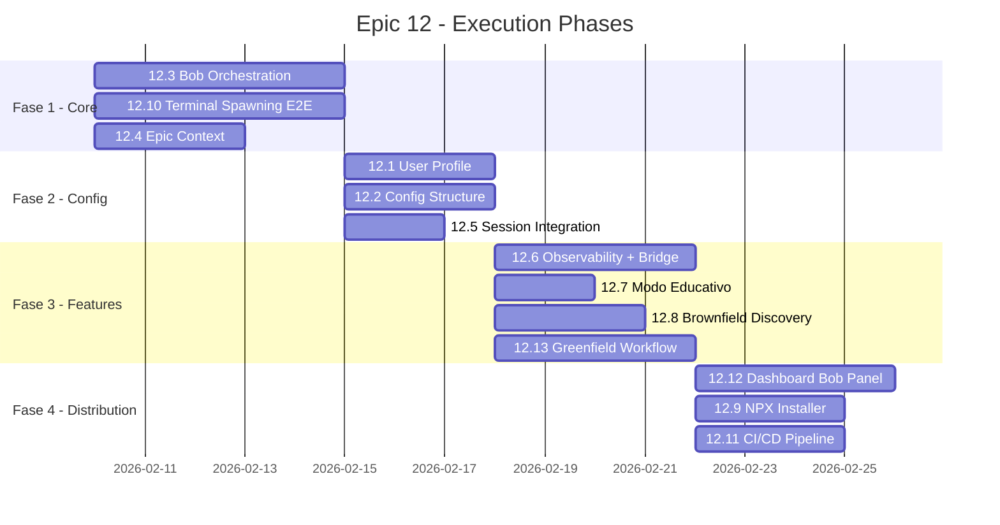

---

## Risk Assessment

| Risco | Probabilidade | Impacto | Mitigação |
|-------|---------------|---------|-----------|
| Terminal spawning falha em alguns OSs | High | High | Fallback para execução inline |
| Epic Context consome muitos tokens | Medium | Medium | Sumarização progressiva com hard cap 600 tokens/story |
| User Profile complica UX | Low | Medium | Default para "bob", fácil trocar |
| NPX installer falha em máquinas específicas | Medium | High | Community QA testing |
| Config hierarchy conflict | High | High | Estender config-resolver.js com L5 User layer |
| Lock files órfãos | Medium | Medium | Schema formal com TTL 300s + auto-cleanup |
| Dashboard desacoplado | Medium | High | Single source of truth: bob-status.json |
| WebSocket indisponível | High | Low | Fallback: file → polling → SSE (3 camadas) |
| Greenfield pipeline longo | Medium | Medium | Retry/Skip/Abort por agente + session resume |

---

## Changelog

| Versão | Data | Mudanças |
|--------|------|----------|
| 1.0 | 2026-02-05 | Versão inicial do workflow |
| 1.1 | 2026-02-05 | Completado com todas as 13 stories do Epic 12: Config Hierarchy L1-L5, Epic Context Accumulator, Greenfield Workflow, Modo Educativo, Data Architecture, Schemas (bob-status.json, lock files), Terminal Spawning E2E, CI/CD Pipeline, Critérios de Sucesso, Risk Assessment |

---

*Documentação gerada por @architect (Aria)*
*Workflow Version: 1.1*
*CLI First | Observability Second | UI Third*
*Baseado em: Epic 12 - Bob Full Integration v1.6*
