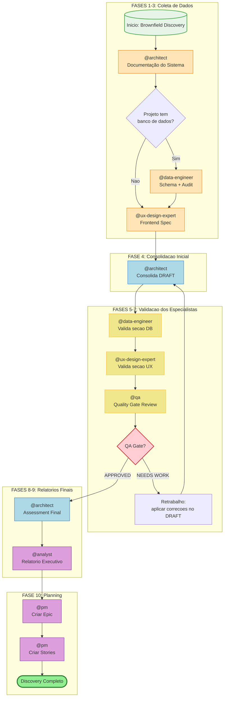
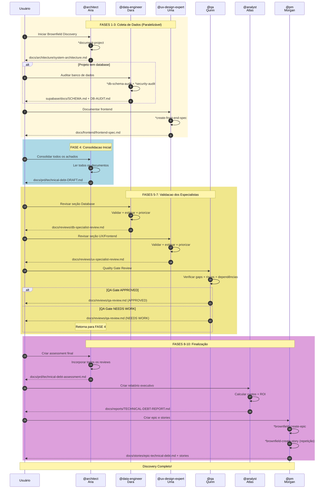
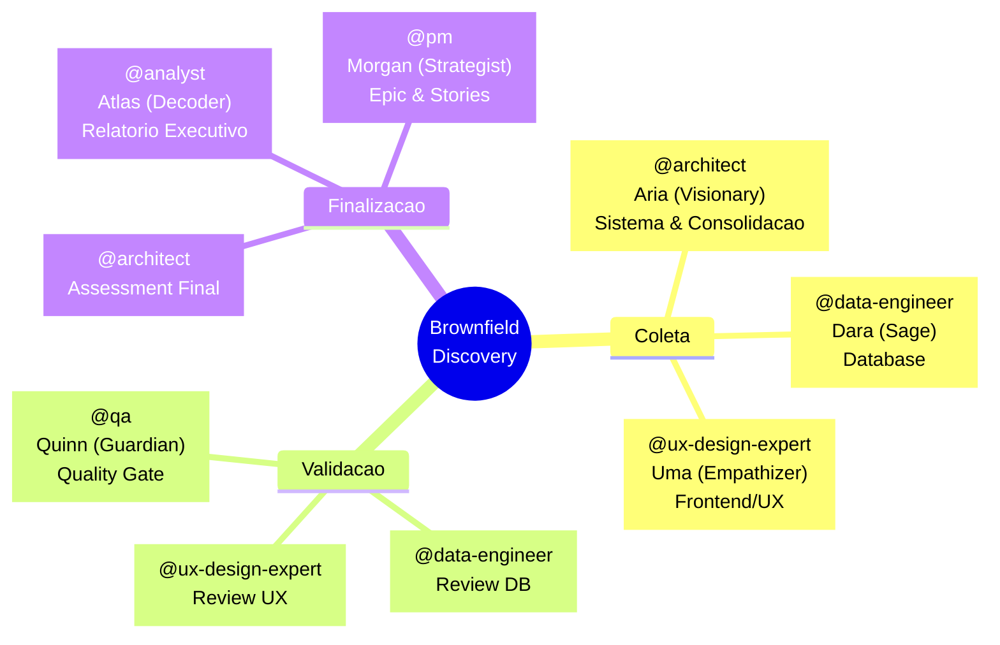
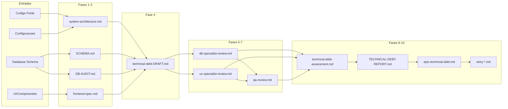
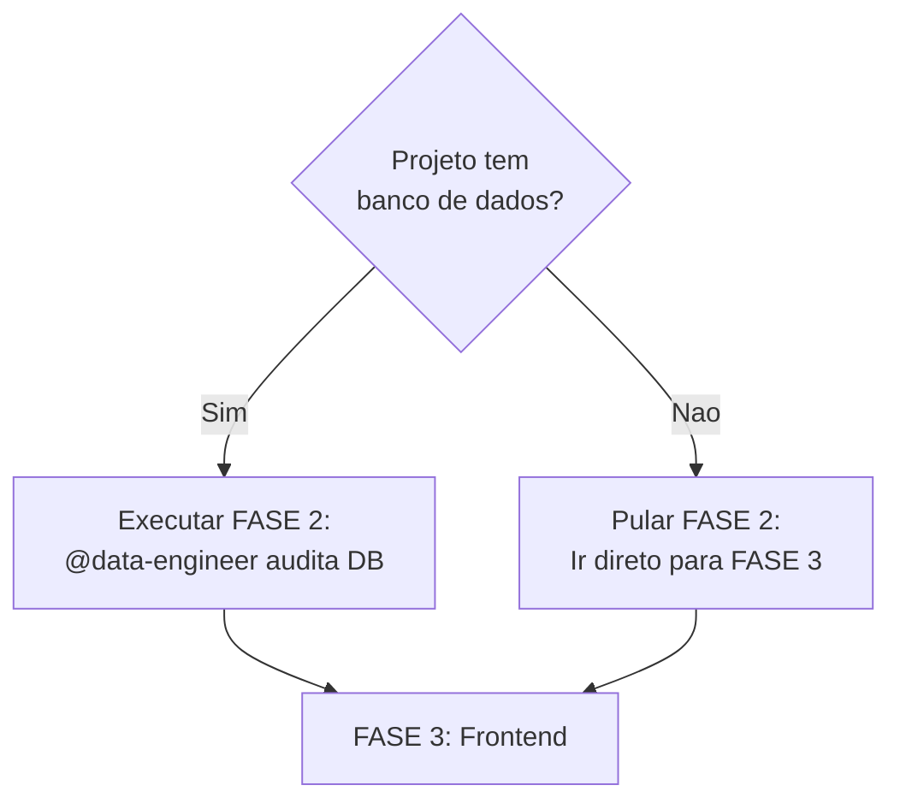
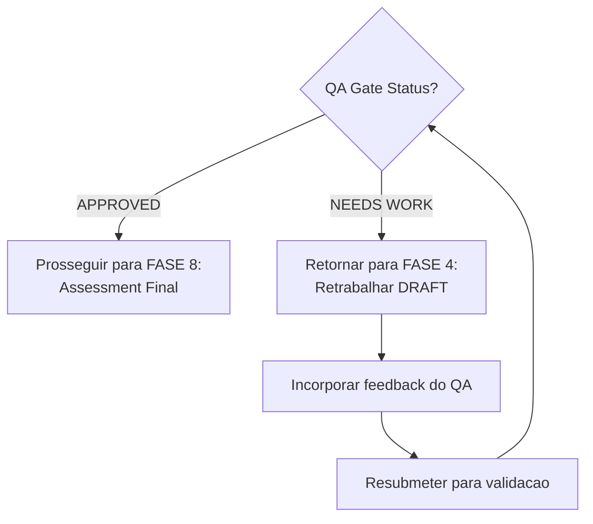
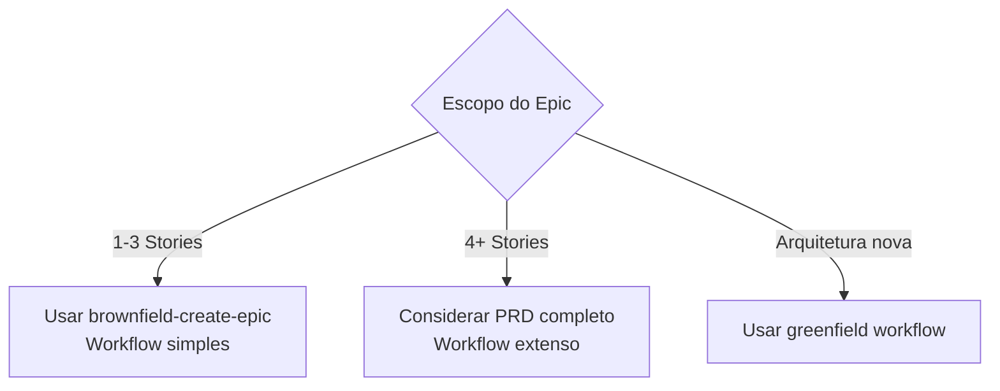

# Workflow: Brownfield Discovery

**ID:** `brownfield-discovery`
**Versão:** 2.0
**Tipo:** Brownfield (Projetos Existentes)
**Duração Estimada:** 4-8 horas
**Última Atualização:** 2026-02-04

---

## Visão Geral

O **Brownfield Discovery** é um workflow multi-agente completo para avaliação de débito técnico em projetos existentes. Projetado especificamente para projetos migrando de plataformas como Lovable, v0.dev, ou codebases legados, este workflow:

- Documenta o sistema de forma abrangente
- Identifica debitos tecnicos em todas as camadas (sistema, database, frontend)
- Valida achados com especialistas de domínio
- Gera relatórios executivos para stakeholders
- Cria epics e stories prontas para desenvolvimento

### Casos de Uso Principais

| Cenário | Recomendado |
|---------|-------------|
| Migração de projeto Lovable/v0.dev | Sim |
| Auditoria completa de codebase | Sim |
| Planejamento de modernização | Sim |
| Assessment pre-investimento | Sim |
| Onboarding em projeto legado | Sim |
| Due diligence técnica | Sim |
| Novo projeto (greenfield) | Não - use workflows `greenfield-*` |
| Enhancement isolado | Não - use `brownfield-create-story` |

---

## Diagrama do Workflow



---

## Diagrama de Sequência Detalhado



---

## Steps Detalhados

### FASE 1: Coleta - Sistema

| Atributo | Valor |
|----------|-------|
| **Step ID** | `system_documentation` |
| **Fase** | 1 |
| **Nome da Fase** | Coleta: Sistema |
| **Agente** | `@architect` (Aria) |
| **Ação** | `*document-project` |
| **Elicitação** | Sim |
| **Duração Estimada** | 30-60 min |
| **Output** | `docs/architecture/system-architecture.md` |

**O que o agente analisa:**
- Stack tecnológico (React, Vite, Tailwind, etc.)
- Estrutura de pastas e componentes
- Dependências e versões
- Padrões de código existentes
- Pontos de integração
- Configurações (env, build, deploy)

**Débitos identificados (nível sistema):**
- Dependências desatualizadas
- Código duplicado
- Falta de testes
- Configurações hardcoded
- Acoplamento excessivo

---

### FASE 2: Coleta - Database

| Atributo | Valor |
|----------|-------|
| **Step ID** | `database_documentation` |
| **Fase** | 2 |
| **Nome da Fase** | Coleta: Database |
| **Agente** | `@data-engineer` (Dara - Sage) |
| **Acao** | `*db-schema-audit` + `*security-audit` |
| **Condição** | `project_has_database` |
| **Elicitação** | Sim |
| **Duração Estimada** | 20-40 min |
| **Outputs** | `supabase/docs/SCHEMA.md`, `supabase/docs/DB-AUDIT.md` |

**O que o agente analisa:**
- Schema completo (tabelas, colunas, tipos)
- Relacionamentos e foreign keys
- Índices existentes e faltantes
- RLS policies (cobertura e qualidade)
- Views e functions
- Performance (queries lentas conhecidas)

**Débitos identificados (nível dados):**
- Tabelas sem RLS
- Índices faltantes
- Normalização inadequada
- Constraints ausentes
- Migrations não versionadas
- Dados órfãos

---

### FASE 3: Coleta - Frontend/UX

| Atributo | Valor |
|----------|-------|
| **Step ID** | `frontend_documentation` |
| **Fase** | 3 |
| **Nome da Fase** | Coleta: Frontend/UX |
| **Agente** | `@ux-design-expert` (Uma - Empathizer) |
| **Acao** | `*create-front-end-spec` |
| **Elicitação** | Sim |
| **Duração Estimada** | 30-45 min |
| **Output** | `docs/frontend/frontend-spec.md` |

**O que o agente analisa:**
- Componentes UI existentes
- Design system/tokens utilizados
- Padroes de layout
- Fluxos de usuário
- Responsividade
- Acessibilidade (a11y)
- Consistencia visual
- Performance percebida

**Débitos identificados (nível UX/UI):**
- Inconsistências visuais
- Componentes duplicados
- Falta de design system
- Problemas de acessibilidade
- Mobile não otimizado
- Estados de loading/error faltando
- Feedback de usuário ausente

---

### FASE 4: Consolidação Inicial

| Atributo | Valor |
|----------|-------|
| **Step ID** | `initial_consolidation` |
| **Fase** | 4 |
| **Nome da Fase** | Consolidação Inicial |
| **Agente** | `@architect` (Aria) |
| **Ação** | `consolidate_findings_draft` (workflow-action) |
| **Elicitação** | Sim |
| **Duração Estimada** | 30-45 min |
| **Output** | `docs/prd/technical-debt-DRAFT.md` |

**Requer como entrada:**
- `docs/architecture/system-architecture.md`
- `supabase/docs/SCHEMA.md` (se existir)
- `supabase/docs/DB-AUDIT.md` (se existir)
- `docs/frontend/frontend-spec.md`

**Estrutura do DRAFT gerado:**

```markdown
# Technical Debt Assessment - DRAFT
## Para Revisão dos Especialistas

### 1. Debitos de Sistema
[Lista do system-architecture.md]

### 2. Debitos de Database
[Lista do DB-AUDIT.md]
PENDENTE: Revisão do @data-engineer

### 3. Debitos de Frontend/UX
[Lista do frontend-spec.md]
PENDENTE: Revisão do @ux-design-expert

### 4. Matriz Preliminar
| ID | Débito | Área | Impacto | Esforço | Prioridade |
|----|--------|------|---------|---------|------------|

### 5. Perguntas para Especialistas
- @data-engineer: [perguntas sobre DB]
- @ux-design-expert: [perguntas sobre UX]
```

---

### FASE 5: Validação - Database

| Atributo | Valor |
|----------|-------|
| **Step ID** | `database_specialist_review` |
| **Fase** | 5 |
| **Nome da Fase** | Validação: Database |
| **Agente** | `@data-engineer` (Dara) |
| **Ação** | `review_and_validate` (workflow-action) |
| **Elicitação** | Sim |
| **Duração Estimada** | 20-30 min |
| **Output** | `docs/reviews/db-specialist-review.md` |

**Responsabilidades do Especialista:**

1. **VALIDAR débitos identificados**
   - Confirma se são realmente problemas
   - Ajusta severidade se necessário
   - Adiciona débitos não identificados

2. **ESTIMAR CUSTOS**
   - Horas para resolver cada débito
   - Complexidade (simples/médio/complexo)
   - Dependências técnicas

3. **PRIORIZAR (perspectiva DB)**
   - Risco de segurança
   - Impacto em performance
   - Dívida de manutenção

4. **RESPONDER PERGUNTAS**
   - Responde perguntas do @architect
   - Esclarece pontos técnicos

---

### FASE 6: Validação - UX/Frontend

| Atributo | Valor |
|----------|-------|
| **Step ID** | `ux_specialist_review` |
| **Fase** | 6 |
| **Nome da Fase** | Validação: UX/Frontend |
| **Agente** | `@ux-design-expert` (Uma) |
| **Ação** | `review_and_validate` (workflow-action) |
| **Elicitação** | Sim |
| **Duração Estimada** | 20-30 min |
| **Output** | `docs/reviews/ux-specialist-review.md` |

**Responsabilidades do Especialista:**

1. **VALIDAR débitos identificados**
   - Confirma se afetam UX
   - Ajusta severidade se necessário
   - Adiciona débitos não identificados

2. **ESTIMAR CUSTOS**
   - Horas para resolver cada débito
   - Impacto visual vs funcional
   - Necessidade de design review

3. **PRIORIZAR (perspectiva UX)**
   - Impacto na experiência do usuário
   - Problemas de acessibilidade
   - Consistência visual

4. **RESPONDER PERGUNTAS**
   - Responde perguntas do @architect
   - Sugere soluções de design

---

### FASE 7: Validação - QA Review

| Atributo | Valor |
|----------|-------|
| **Step ID** | `qa_general_review` |
| **Fase** | 7 |
| **Nome da Fase** | Validação: QA Review |
| **Agente** | `@qa` (Quinn - Guardian) |
| **Ação** | `review_assessment` (workflow-action) |
| **Elicitação** | Sim |
| **Duração Estimada** | 30-45 min |
| **Output** | `docs/reviews/qa-review.md` |

**Responsabilidades do QA:**

1. **IDENTIFICAR GAPS**
   - Débitos não cobertos
   - Áreas não analisadas
   - Riscos cruzados

2. **AVALIAR RISCOS**
   - Riscos de segurança
   - Riscos de regressão
   - Riscos de integração

3. **VALIDAR DEPENDÊNCIAS**
   - Ordem de resolução faz sentido?
   - Dependências entre débitos
   - Bloqueios potenciais

4. **SUGERIR TESTES**
   - Testes necessários pós-resolução
   - Critérios de aceite para débitos
   - Métricas de qualidade

5. **QUALITY GATE**
   - O assessment está completo?
   - Pode seguir para planning?
   - **Decisão:** `APPROVED` | `NEEDS WORK`

---

### FASE 8: Assessment Final

| Atributo | Valor |
|----------|-------|
| **Step ID** | `final_assessment` |
| **Fase** | 8 |
| **Nome da Fase** | Assessment Final |
| **Agente** | `@architect` (Aria) |
| **Ação** | `finalize_assessment` (workflow-action) |
| **Condição** | `qa_review_approved` |
| **Elicitação** | Sim |
| **Duração Estimada** | 30-45 min |
| **Output** | `docs/prd/technical-debt-assessment.md` |

**Consolidação Final inclui:**
1. Incorpora ajustes do @data-engineer
2. Incorpora ajustes do @ux-design-expert
3. Endereca gaps do @qa
4. Recalcula prioridades com inputs dos especialistas
5. Define ordem final de resolução

**Estrutura do documento final:**

```markdown
# Technical Debt Assessment - FINAL

## Executive Summary
- Total de débitos: X
- Críticos: Y | Altos: Z | Médios: W
- Esforco total estimado: XXX horas

## Inventário Completo de Débitos

### Sistema (validado por @architect)
| ID | Débito | Severidade | Horas | Prioridade |

### Database (validado por @data-engineer)
| ID | Débito | Severidade | Horas | Prioridade |

### Frontend/UX (validado por @ux-design-expert)
| ID | Débito | Severidade | Horas | Prioridade |

## Matriz de Priorização Final

## Plano de Resolução

## Riscos e Mitigações

## Critérios de Sucesso
```

---

### FASE 9: Relatório Executivo

| Atributo | Valor |
|----------|-------|
| **Step ID** | `executive_awareness_report` |
| **Fase** | 9 |
| **Nome da Fase** | Relatório Executivo |
| **Agente** | `@analyst` (Atlas - Decoder) |
| **Ação** | `create_awareness_report` (workflow-action) |
| **Elicitação** | Sim |
| **Duração Estimada** | 30-45 min |
| **Output** | `docs/reports/TECHNICAL-DEBT-REPORT.md` |

**Objetivo:** Documento para stakeholders entenderem o CUSTO e IMPACTO dos débitos técnicos identificados.

**Estrutura do relatório:**

```markdown
# Relatório de Débito Técnico
**Projeto:** [nome]
**Data:** [data]

## Executive Summary (1 página)
### Situação Atual
### Números Chave
| Métrica | Valor |
|---------|-------|
| Total de Débitos | X |
| Débitos Críticos | Y |
| Esforco Total | Z horas |
| Custo Estimado | R$ XX.XXX |

## Análise de Custos
### Custo de RESOLVER
### Custo de NÃO RESOLVER (Risco Acumulado)

## Impacto no Negócio
### Performance
### Segurança
### Experiência do Usuário
### Manutenibilidade

## Timeline Recomendado
### Fase 1: Quick Wins (1-2 semanas)
### Fase 2: Fundação (2-4 semanas)
### Fase 3: Otimização (4-6 semanas)

## ROI da Resolução

## Proximos Passos
```

---

### FASE 10: Planning (Epic + Stories)

| Atributo | Valor |
|----------|-------|
| **Step ID** | `epic_creation` + `story_creation` |
| **Fase** | 10 |
| **Nome da Fase** | Planning |
| **Agente** | `@pm` (Morgan - Strategist) |
| **Ações** | `*brownfield-create-epic`, `*brownfield-create-story` |
| **Elicitação** | Sim |
| **Duração Estimada** | 30-60 min |
| **Outputs** | `docs/stories/epic-technical-debt.md`, `docs/stories/story-*.md` |

**Epic inclui:**
- Objetivo do epic
- Escopo (quais debitos)
- Critérios de sucesso
- Timeline (do relatório)
- Budget aprovado
- Lista de stories

**Cada story inclui:**
- Tasks claras
- Critérios de aceite específicos
- Testes requeridos (do QA review)
- Estimativa validada pelos especialistas
- Definition of Done

---

## Agentes Participantes



### Perfil dos Agentes

| Agente | ID | Arquetipo | Especialidade Principal |
|--------|-----|-----------|------------------------|
| Aria | `@architect` | Visionary | Arquitetura de sistemas, design holistico |
| Dara | `@data-engineer` | Sage | PostgreSQL, Supabase, RLS, migrations |
| Uma | `@ux-design-expert` | Empathizer | Atomic Design, design tokens, acessibilidade |
| Quinn | `@qa` | Guardian | Quality gates, testes, rastreabilidade |
| Atlas | `@analyst` | Decoder | Pesquisa, analise, ROI |
| Morgan | `@pm` | Strategist | PRDs, epics, priorizacao |

---

## Tasks Executadas

### Tasks Automatizadas (task-reference)

| Task | Agente | Fase | Descricao |
|------|--------|------|-----------|
| `document-project` | @architect | 1 | Documentacao completa do sistema |
| `db-schema-audit` | @data-engineer | 2 | Auditoria de schema de banco |
| `security-audit` | @data-engineer | 2 | Auditoria de seguranca (RLS, PII) |
| `create-front-end-spec` | @ux-design-expert | 3 | Especificacao de frontend |
| `brownfield-create-epic` | @pm | 10 | Criacao de epic de debito tecnico |
| `brownfield-create-story` | @pm | 10 | Criacao de stories (repetivel) |

### Acoes Manuais (workflow-action)

| Acao | Agente | Fase | Descricao |
|------|--------|------|-----------|
| `consolidate_findings_draft` | @architect | 4 | Consolidar DRAFT inicial |
| `review_and_validate` | @data-engineer | 5 | Validar debitos de DB |
| `review_and_validate` | @ux-design-expert | 6 | Validar debitos de UX |
| `review_assessment` | @qa | 7 | Quality Gate review |
| `finalize_assessment` | @architect | 8 | Assessment final |
| `create_awareness_report` | @analyst | 9 | Relatorio executivo |

---

## Pre-requisitos

### Ambiente

- [ ] Acesso ao repositorio do projeto
- [ ] Supabase CLI configurado (se houver database)
- [ ] Credenciais de database disponíveis
- [ ] Permissoes de leitura em todos os arquivos

### Documentacao Previa

- [ ] Entendimento basico do proposito do projeto
- [ ] Conhecimento de stakeholders para o relatorio

### Ferramentas Utilizadas

| Ferramenta | Agente | Proposito |
|------------|--------|-----------|
| `git` | @architect | Analise de repositorio |
| `supabase-cli` | @data-engineer | Auditoria de database |
| `psql` | @data-engineer | Queries de auditoria |
| `coderabbit` | @qa | Review automatizado de codigo |
| `exa` | @analyst | Pesquisa de mercado/benchmark |

---

## Entradas e Saidas

### Mapa de Artefatos



### Estrutura Final de Artefatos

```
docs/
├── architecture/
│   └── system-architecture.md         [FASE 1]
├── frontend/
│   └── frontend-spec.md               [FASE 3]
├── reviews/
│   ├── db-specialist-review.md        [FASE 5]
│   ├── ux-specialist-review.md        [FASE 6]
│   └── qa-review.md                   [FASE 7]
├── prd/
│   ├── technical-debt-DRAFT.md        [FASE 4]
│   └── technical-debt-assessment.md   [FASE 8]
├── reports/
│   └── TECHNICAL-DEBT-REPORT.md       [FASE 9] ← Stakeholders
└── stories/
    ├── epic-technical-debt.md         [FASE 10]
    ├── story-1.1-*.md
    └── story-1.2-*.md

supabase/
└── docs/
    ├── SCHEMA.md                      [FASE 2]
    └── DB-AUDIT.md                    [FASE 2]
```

---

## Pontos de Decisao

### Decision Point 1: Projeto tem Database?



**Criterios:**
- Existe pasta `supabase/` ou similar?
- Ha arquivos de migration?
- Projeto usa Supabase, PostgreSQL, ou outro DB?

---

### Decision Point 2: QA Gate



**Criterios para APPROVED:**
- Todos os debitos validados por especialistas
- Nenhum gap critico identificado
- Dependencias fazem sentido
- Riscos estao mapeados

**Criterios para NEEDS WORK:**
- Gaps nao enderecados
- Debitos faltando validacao
- Riscos cruzados nao mitigados
- Dependencias inconsistentes

---

### Decision Point 3: Escopo Crescente



---

## Troubleshooting

### Problema: Fase 2 falha por falta de acesso ao DB

**Sintoma:** `psql: connection refused` ou credenciais invalidas

**Solucoes:**
1. Verificar `SUPABASE_DB_URL` no ambiente
2. Testar conexao manualmente: `psql "$SUPABASE_DB_URL" -c "SELECT 1"`
3. Confirmar permissoes de rede (VPN, firewall)
4. Se impossivel acessar, pular FASE 2 e documentar como debito

---

### Problema: Assessment muito grande

**Sintoma:** DRAFT com mais de 50 debitos identificados

**Solucoes:**
1. Priorizar debitos por severidade (CRITICAL > HIGH > MEDIUM)
2. Agrupar debitos similares em categorias
3. Considerar multiplos epics por area (DB, Frontend, Infra)
4. Focar nos top 10-15 debitos para o primeiro ciclo

---

### Problema: Especialistas discordam

**Sintoma:** @data-engineer e @ux-design-expert tem prioridades conflitantes

**Solucoes:**
1. @architect atua como mediador
2. Usar framework de priorizacao objetivo (RICE, ICE)
3. Considerar impacto cruzado (DB lento afeta UX)
4. Documentar trade-offs no assessment final

---

### Problema: QA Gate em loop infinito

**Sintoma:** NEEDS WORK repetido multiplas vezes

**Solucoes:**
1. Revisar criterios de aprovacao com @qa
2. Focar em enderacar gaps especificos (nao todos)
3. Considerar aprovar com condicoes documentadas
4. Escalar para stakeholder se bloqueado

---

### Problema: Relatorio executivo nao ressoa com stakeholders

**Sintoma:** Feedback de que o relatorio e muito tecnico

**Solucoes:**
1. Usar linguagem de negocio, nao tecnica
2. Focar em custos em R$ (nao horas)
3. Incluir analogias e comparacoes
4. Adicionar graficos visuais de impacto

---

## Referencias

### Arquivos do Workflow

| Arquivo | Localizacao |
|---------|-------------|
| Definicao do Workflow | `.aios-core/development/workflows/brownfield-discovery.yaml` |
| Task: brownfield-create-epic | `.aios-core/development/tasks/brownfield-create-epic.md` |
| Task: brownfield-create-story | `.aios-core/development/tasks/brownfield-create-story.md` |
| Task: db-schema-audit | `.aios-core/development/tasks/db-schema-audit.md` |
| Task: security-audit | `.aios-core/development/tasks/security-audit.md` |

### Agentes

| Agente | Localizacao |
|--------|-------------|
| @architect | `.aios-core/development/agents/architect.md` |
| @data-engineer | `.aios-core/development/agents/data-engineer.md` |
| @ux-design-expert | `.aios-core/development/agents/ux-design-expert.md` |
| @qa | `.aios-core/development/agents/qa.md` |
| @analyst | `.aios-core/development/agents/analyst.md` |
| @pm | `.aios-core/development/agents/pm.md` |

### Documentacao Relacionada

- [ADR-025: Estrutura de Documentacao](../../architecture/ADR-025-DOCUMENTATION-STRUCTURE.md)
- [Guia de Workflows AIOS](../AIOS-WORKFLOWS-GUIDE.md)
- [Padrao de Stories](../templates/STORY-TEMPLATE.md)

---

## Estimativas de Tempo

| Complexidade | Tempo Minimo | Tempo Tipico | Tempo Maximo |
|--------------|--------------|--------------|--------------|
| Projeto simples (sem DB) | 3 horas | 4 horas | 5 horas |
| Projeto medio | 4 horas | 5-6 horas | 7 horas |
| Projeto complexo | 6 horas | 7-8 horas | 10+ horas |

**Fatores que aumentam tempo:**
- Database grande com muitas tabelas
- Frontend com muitos componentes
- Multiplas integracoes externas
- QA Gate com retrabalho
- Stakeholders com muitas perguntas

---

## Proximos Passos Apos Discovery

1. **Apresentar** `TECHNICAL-DEBT-REPORT.md` para stakeholders
2. **Obter aprovacao** de budget
3. **Priorizar** stories no backlog
4. **Iniciar desenvolvimento**: `@dev` implementa `story-1.1`
5. **Monitorar progresso** via ClickUp/GitHub

---

*Documentacao gerada em: 2026-02-04*
*Workflow Version: 2.0*
*Mantido por: @devops*
