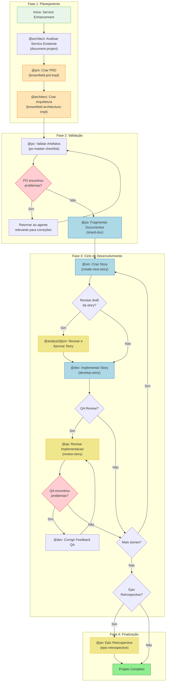
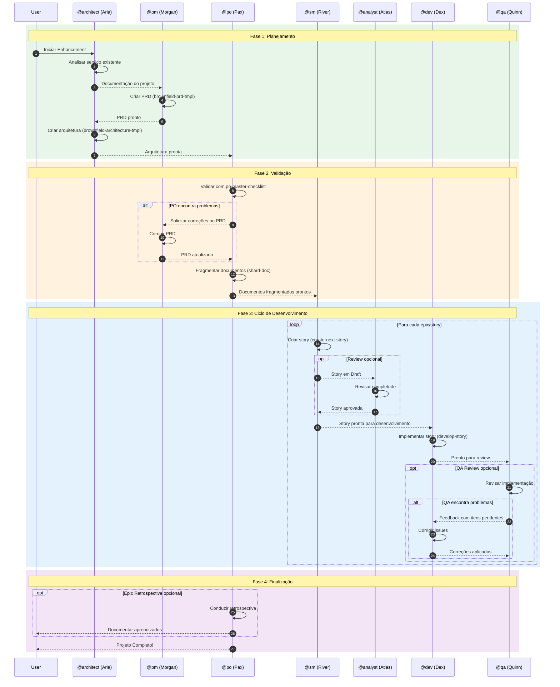
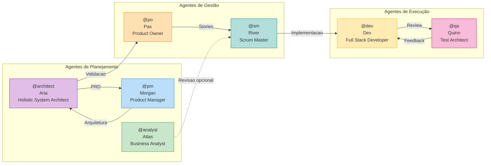
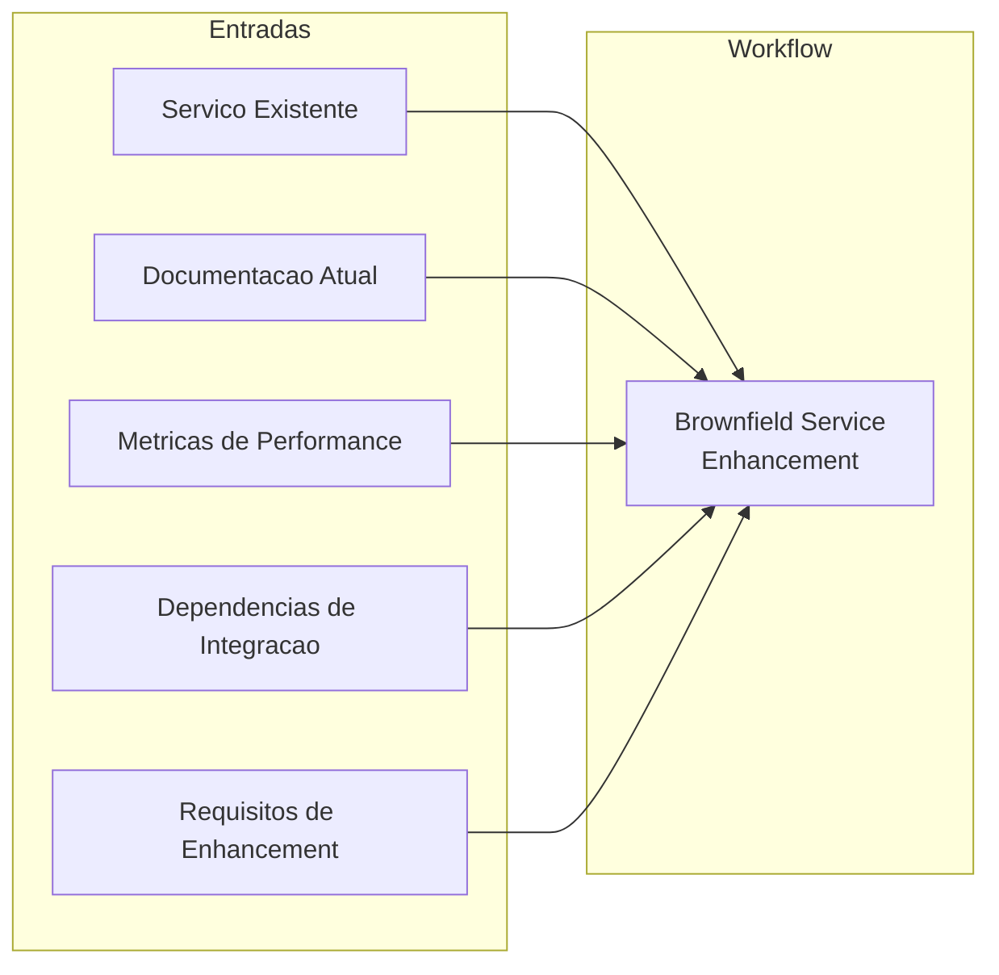
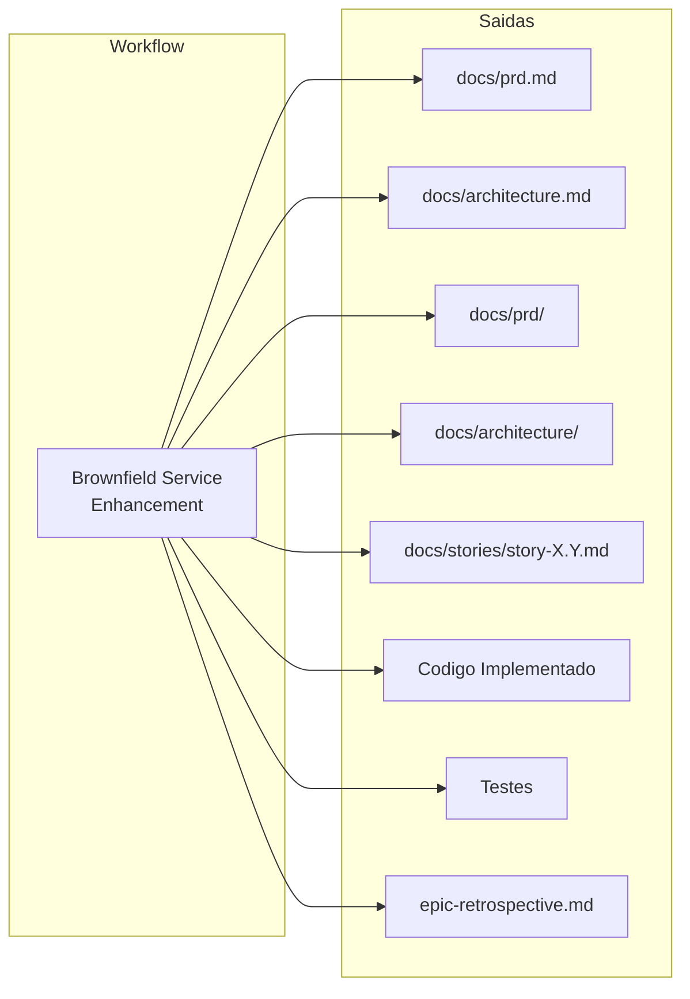
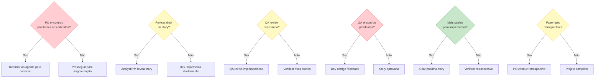

# Workflow: Brownfield Service/API Enhancement

**Identificador:** `brownfield-service`
**Tipo:** Brownfield (Sistemas Existentes)
**Versão:** 1.0
**Última Atualização:** 2026-02-04

---

## Visão Geral

O workflow **Brownfield Service/API Enhancement** é projetado para aprimorar serviços backend e APIs existentes com novos recursos, modernização ou melhorias de desempenho. Ele gerencia análise de sistemas existentes e integração segura, garantindo que mudanças sejam implementadas sem interromper funcionalidades críticas.

### Casos de Uso

| Tipo de Projeto | Descrição |
|-----------------|-----------|
| **Service Modernization** | Atualização de serviços legados para tecnologias modernas |
| **API Enhancement** | Adição de novos endpoints ou melhorias em APIs existentes |
| **Microservice Extraction** | Extração de módulos de um monolito para microsserviços |
| **Performance Optimization** | Otimização de performance em serviços existentes |
| **Integration Enhancement** | Melhoria de integrações entre sistemas |

### Quando Utilizar

- Aprimoramento de serviço requer stories coordenadas
- Versionamento de API ou breaking changes necessários
- Alterações em schema de banco de dados requeridas
- Melhorias de performance ou escalabilidade necessárias
- Múltiplos pontos de integração afetados

---

## Diagrama do Workflow



---

## Diagrama de Sequência



---

## Steps Detalhados

### Step 1: Análise do Serviço

| Atributo | Valor |
|----------|-------|
| **Agente** | @architect (Aria) |
| **Task** | `document-project` |
| **Input** | Serviço/API existente, métricas de performance, documentação atual |
| **Output** | Múltiplos documentos conforme template document-project |
| **Notas** | Revisar documentação existente, codebase, métricas de performance e identificar dependências de integração |

**Ativação:**
```
@architect
*document-project
```

---

### Step 2: Criação do PRD

| Atributo | Valor |
|----------|-------|
| **Agente** | @pm (Morgan) |
| **Task** | `create-doc` com `brownfield-prd-tmpl` |
| **Input** | Análise do serviço existente |
| **Output** | `docs/prd.md` |
| **Requer** | Análise do serviço existente concluída |
| **Notas** | Criar PRD abrangente focado em aprimoramento de serviço com análise do sistema existente |

**Ativação:**
```
@pm
*create-brownfield-prd
```

**IMPORTANTE:** Salvar o arquivo final `prd.md` na pasta `docs/` do projeto.

---

### Step 3: Criação da Arquitetura

| Atributo | Valor |
|----------|-------|
| **Agente** | @architect (Aria) |
| **Task** | `create-doc` com `brownfield-architecture-tmpl` |
| **Input** | PRD (`docs/prd.md`) |
| **Output** | `docs/architecture.md` |
| **Requer** | PRD aprovado |
| **Notas** | Criar arquitetura com estratégia de integração de serviço e planejamento de evolução de API |

**Ativação:**
```
@architect
*create-brownfield-architecture
```

**IMPORTANTE:** Salvar o arquivo final `architecture.md` na pasta `docs/` do projeto.

---

### Step 4: Validação dos Artefatos

| Atributo | Valor |
|----------|-------|
| **Agente** | @po (Pax) |
| **Task** | `execute-checklist` com `po-master-checklist` |
| **Input** | Todos os artefatos (PRD, Arquitetura) |
| **Output** | Relatório de validação |
| **Notas** | Validar todos os documentos para segurança de integração de serviço e compatibilidade de API. Pode requerer atualizações em qualquer documento. |

**Ativação:**
```
@po
*execute-checklist-po
```

---

### Step 5: Correção de Problemas (Condicional)

| Atributo | Valor |
|----------|-------|
| **Agente** | Varia conforme o documento com problema |
| **Task** | Correção específica do documento |
| **Input** | Feedback do PO |
| **Output** | Documentos atualizados |
| **Condição** | PO encontrou problemas no checklist |
| **Notas** | Se PO encontrar problemas, retornar ao agente relevante para corrigir e re-exportar documentos atualizados para a pasta `docs/` |

---

### Step 6: Fragmentação de Documentos

| Atributo | Valor |
|----------|-------|
| **Agente** | @po (Pax) |
| **Task** | `shard-doc` |
| **Input** | Todos os artefatos validados em `docs/` |
| **Output** | Pastas `docs/prd/` e `docs/architecture/` com conteúdo fragmentado |
| **Requer** | Todos os artefatos na pasta do projeto |
| **Notas** | Fragmentar documentos para desenvolvimento no IDE |

**Opções de Ativação:**

**Opção A - Via Agente PO:**
```
@po
shard docs/prd.md
```

**Opção B - Manual:**
Arrastar a task `shard-doc` + `docs/prd.md` para o chat.

---

### Step 7: Criação de Stories

| Atributo | Valor |
|----------|-------|
| **Agente** | @sm (River) |
| **Task** | `create-next-story` |
| **Input** | Documentos fragmentados |
| **Output** | `story.md` |
| **Requer** | Documentos fragmentados |
| **Repete** | Para cada epic |
| **Notas** | Story inicia com status "Draft" |

**Ativação (Nova sessão de chat):**
```
@sm
*draft
```

---

### Step 8: Revisão de Story Draft (Opcional)

| Atributo | Valor |
|----------|-------|
| **Agente** | @analyst (Atlas) ou @pm (Morgan) |
| **Task** | `review-draft-story` (em desenvolvimento) |
| **Input** | Story em Draft |
| **Output** | Story atualizada |
| **Requer** | Story criada |
| **Opcional** | Sim - quando usuario deseja revisao da story |
| **Condição** | Usuário solicita revisão |
| **Notas** | Revisar completude e alinhamento da story. Atualizar status: Draft -> Approved |

---

### Step 9: Implementação da Story

| Atributo | Valor |
|----------|-------|
| **Agente** | @dev (Dex) |
| **Task** | `develop-story` |
| **Input** | Story aprovada |
| **Output** | Arquivos de implementação |
| **Requer** | Story aprovada (não em Draft) |
| **Notas** | Implementar story aprovada, atualizar File List com todas as alterações, marcar story como "Review" quando completo |

**Ativação (Nova sessão de chat):**
```
@dev
*develop {story-id}
```

---

### Step 10: Revisão QA (Opcional)

| Atributo | Valor |
|----------|-------|
| **Agente** | @qa (Quinn) |
| **Task** | `review-story` |
| **Input** | Arquivos de implementacao |
| **Output** | Implementação atualizada + Checklist QA |
| **Opcional** | Sim |
| **Notas** | Revisao de dev senior com capacidade de refatoração. Corrige pequenos problemas diretamente. Deixa checklist para itens restantes. Atualiza status da story (Review -> Done ou permanece Review) |

**Ativação (Nova sessão de chat):**
```
@qa
*review {story-id}
```

---

### Step 11: Correção de Feedback QA (Condicional)

| Atributo | Valor |
|----------|-------|
| **Agente** | @dev (Dex) |
| **Task** | `apply-qa-fixes` |
| **Input** | Feedback do QA com itens pendentes |
| **Output** | Implementação corrigida |
| **Condicao** | QA deixou itens não marcados |
| **Notas** | Se QA deixou itens pendentes: Dev (nova sessao) corrige itens restantes e retorna ao QA para aprovação final |

**Ativação (Nova sessão de chat):**
```
@dev
*apply-qa-fixes
```

---

### Step 12: Repetir Ciclo de Desenvolvimento

| Atributo | Valor |
|----------|-------|
| **Acao** | Repetir steps 7-11 |
| **Notas** | Repetir ciclo de story (SM -> Dev -> QA) para todas as stories do epic. Continuar ate que todas as stories no PRD estejam completas. |

---

### Step 13: Retrospectiva do Epic (Opcional)

| Atributo | Valor |
|----------|-------|
| **Agente** | @po (Pax) |
| **Task** | `epic-retrospective` (em desenvolvimento) |
| **Input** | Epic completo |
| **Output** | `epic-retrospective.md` |
| **Condicao** | Epic completo |
| **Opcional** | Sim |
| **Notas** | Validar que o epic foi completado corretamente. Documentar aprendizados e melhorias. |

---

### Step 14: Fim do Workflow

| Atributo | Valor |
|----------|-------|
| **Acao** | Projeto completo |
| **Notas** | Todas as stories implementadas e revisadas! Fase de desenvolvimento do projeto completa. |

**Referencia:** `.aios-core/data/aios-kb.md#IDE Development Workflow`

---

## Agentes Participantes



### Tabela de Agentes

| Agente | Nome | Papel | Responsabilidades no Workflow |
|--------|------|-------|------------------------------|
| @architect | Aria | Holistic System Architect | Análise de serviço existente, criação de arquitetura |
| @pm | Morgan | Product Manager | Criação de PRD para brownfield |
| @po | Pax | Product Owner | Validação de artefatos, fragmentação de docs, retrospectiva |
| @sm | River | Scrum Master | Criação de stories |
| @analyst | Atlas | Business Analyst | Revisão opcional de story drafts |
| @dev | Dex | Full Stack Developer | Implementacao de stories, correção de feedback |
| @qa | Quinn | Test Architect | Revisão de implementação, quality gates |

---

## Tasks Executadas

### Tasks Principais

| Task | Template/Checklist | Agente | Fase |
|------|-------------------|--------|------|
| `document-project` | document-project template | @architect | Planejamento |
| `create-doc` | `brownfield-prd-tmpl.yaml` | @pm | Planejamento |
| `create-doc` | `brownfield-architecture-tmpl.yaml` | @architect | Planejamento |
| `execute-checklist` | `po-master-checklist.md` | @po | Validação |
| `shard-doc` | - | @po | Validação |
| `create-next-story` | `story-tmpl.yaml` | @sm | Desenvolvimento |
| `develop-story` | - | @dev | Desenvolvimento |
| `review-story` | - | @qa | Desenvolvimento |
| `apply-qa-fixes` | - | @dev | Desenvolvimento |

### Tasks Futuras (Em Desenvolvimento)

| Task | Agente | Status |
|------|--------|--------|
| `story-review` | @analyst/@pm | Em desenvolvimento |
| `epic-retrospective` | @po | Em desenvolvimento |

---

## Pré-requisitos

### Antes de Iniciar o Workflow

1. **Serviço/API Existente**
   - Acesso ao código-fonte do serviço
   - Documentação atual (se existente)
   - Métricas de performance disponíveis

2. **Ambiente Configurado**
   - Git configurado e funcional
   - Acesso aos templates AIOS
   - Ferramentas de desenvolvimento instaladas

3. **Contexto do Projeto**
   - Objetivos claros de enhancement
   - Restrições e constraints conhecidos
   - Stakeholders identificados

4. **Templates Disponíveis**
   - `.aios-core/development/templates/brownfield-prd-tmpl.yaml`
   - `.aios-core/development/templates/brownfield-architecture-tmpl.yaml`
   - `.aios-core/development/templates/story-tmpl.yaml`

5. **Checklists Disponíveis**
   - `.aios-core/development/checklists/po-master-checklist.md`
   - `.aios-core/development/checklists/story-draft-checklist.md`
   - `.aios-core/development/checklists/story-dod-checklist.md`

---

## Entradas e Saidas

### Entradas do Workflow



| Entrada | Descrição | Fonte |
|---------|-----------|-------|
| Serviço Existente | Código-fonte e infraestrutura atual | Repositório Git |
| Documentação Atual | Docs existentes do serviço | `docs/` do projeto |
| Métricas de Performance | Dados de performance e uso | Monitoring tools |
| Dependências de Integração | Sistemas conectados ao serviço | Arquitetura atual |
| Requisitos de Enhancement | O que precisa ser melhorado | Stakeholders |

### Saidas do Workflow



| Saída | Descrição | Localização |
|-------|-----------|-------------|
| PRD | Documento de requisitos do produto | `docs/prd.md` |
| Arquitetura | Documento de arquitetura | `docs/architecture.md` |
| PRD Fragmentado | PRD dividido em partes | `docs/prd/` |
| Arquitetura Fragmentada | Arquitetura dividida | `docs/architecture/` |
| Stories | User stories para desenvolvimento | `docs/stories/` |
| Código Implementado | Código fonte das features | Pastas do projeto |
| Testes | Testes unitários e integração | `tests/` ou similar |
| Retrospectiva | Aprendizados do epic | `epic-retrospective.md` |

---

## Pontos de Decisão



### Detalhamento dos Pontos de Decisão

| Ponto | Pergunta | Sim | Nao |
|-------|----------|-----|-----|
| **D1** | PO encontrou problemas nos artefatos? | Retornar ao agente relevante para correção | Prosseguir para fragmentação de documentos |
| **D2** | Usuário deseja revisar draft da story? | Analyst/PM revisa completude e alinhamento | Dev implementa story diretamente |
| **D3** | QA review necessário? | QA revisa implementação | Verificar se há mais stories |
| **D4** | QA encontrou problemas? | Dev corrige feedback e retorna ao QA | Story aprovada, verificar mais stories |
| **D5** | Mais stories para implementar? | Criar próxima story (voltar ao Step 7) | Verificar se quer fazer retrospective |
| **D6** | Fazer epic retrospective? | PO conduz retrospectiva e documenta | Projeto completo |

---

## Troubleshooting

### Problemas Comuns e Soluções

#### 1. Análise de Serviço Incompleta

**Sintoma:** Arquitetura não reflete todas as dependências existentes.

**Causa:** Falta de documentação ou acesso ao código.

**Solução:**
1. Verificar acesso ao repositório Git
2. Executar `*document-project` novamente
3. Consultar equipe atual sobre dependências não documentadas
4. Analisar logs de integração para descobrir conexões

---

#### 2. PRD Rejeitado pelo PO

**Sintoma:** Checklist do PO falha repetidamente.

**Causa:** PRD incompleto ou inconsistente com arquitetura.

**Solução:**
1. Revisar feedback específico do PO
2. Verificar alinhamento PRD <-> Arquitetura
3. Validar critérios de aceitação são testáveis
4. Confirmar que NFRs estão documentados

```
@pm
*correct-course
```

---

#### 3. Story em Draft nao Aprovada

**Sintoma:** Story permanece em Draft após revisão.

**Causa:** Falta de detalhes ou ambiguidade.

**Solução:**
1. Verificar se todos os critérios de aceitação estão claros
2. Confirmar que tasks são executáveis
3. Validar que dependências estão identificadas
4. Executar story-draft-checklist

```
@sm
*story-checklist
```

---

#### 4. Implementação Falha no QA

**Sintoma:** QA rejeita implementação repetidamente.

**Causa:** Código não atende aos critérios ou falta de testes.

**Solução:**
1. Revisar feedback detalhado do QA
2. Verificar cobertura de testes
3. Executar CodeRabbit antes de enviar ao QA
4. Garantir que File List esta completo

```
@dev
*run-tests
*apply-qa-fixes
```

---

#### 5. Ciclo de Feedback Infinito

**Sintoma:** Dev e QA ficam em loop de correções.

**Causa:** Requisitos ambíguos ou scope creep.

**Solução:**
1. Pausar e revisar story original
2. Clarificar critérios de aceitação com PO
3. Definir limite de iterações (max 3)
4. Escalar para PO se necessário

---

#### 6. Fragmentação de Documentos Falha

**Sintoma:** Comando `shard-doc` não gera pastas esperadas.

**Causa:** Documentos em formato incorreto ou caminho errado.

**Solução:**
1. Verificar que `prd.md` esta em `docs/`
2. Confirmar formato do documento
3. Executar via Opção A (agente PO)
4. Verificar logs de erro

---

### Matriz de Escalonamento

| Problema | Primeiro Contato | Escalar Para |
|----------|-----------------|--------------|
| PRD incompleto | @pm (Morgan) | @po (Pax) |
| Arquitetura inconsistente | @architect (Aria) | @pm (Morgan) |
| Story ambigua | @sm (River) | @po (Pax) |
| Implementacao com bugs | @dev (Dex) | @qa (Quinn) |
| Quality gate falha | @qa (Quinn) | @po (Pax) |
| Integracao quebrada | @architect (Aria) | @devops (Gage) |

---

## Prompts de Handoff

Os handoff prompts facilitam a transição entre agentes:

| Transição | Prompt |
|-----------|--------|
| Analyst -> PM | "Análise de serviço completa. Criar PRD abrangente com estratégia de integração de serviço." |
| PM -> Architect | "PRD pronto. Salvar como `docs/prd.md`, depois criar arquitetura do servico." |
| Architect -> PO | "Arquitetura completa. Salvar como `docs/architecture.md`. Por favor validar todos os artefatos para segurança de integração de serviço." |
| PO (problemas) | "PO encontrou problemas com [documento]. Por favor retornar ao [agente] para corrigir e re-salvar o documento atualizado." |
| PO (completo) | "Todos os artefatos de planejamento validados e salvos na pasta `docs/`. Mover para ambiente IDE para iniciar desenvolvimento." |

---

## Referências

### Arquivos de Configuração

| Arquivo | Descrição | Caminho |
|---------|-----------|---------|
| Workflow Definition | Definição YAML do workflow | `.aios-core/development/workflows/brownfield-service.yaml` |
| PRD Template | Template para brownfield PRD | `.aios-core/development/templates/brownfield-prd-tmpl.yaml` |
| Architecture Template | Template para arquitetura | `.aios-core/development/templates/brownfield-architecture-tmpl.yaml` |
| Story Template | Template para stories | `.aios-core/development/templates/story-tmpl.yaml` |
| PO Master Checklist | Checklist de validação | `.aios-core/development/checklists/po-master-checklist.md` |
| Story Draft Checklist | Checklist de story | `.aios-core/development/checklists/story-draft-checklist.md` |
| Story DoD Checklist | Definition of Done | `.aios-core/development/checklists/story-dod-checklist.md` |

### Agentes

| Agente | Arquivo | Caminho |
|--------|---------|---------|
| @architect | Aria | `.aios-core/development/agents/architect.md` |
| @pm | Morgan | `.aios-core/development/agents/pm.md` |
| @po | Pax | `.aios-core/development/agents/po.md` |
| @sm | River | `.aios-core/development/agents/sm.md` |
| @analyst | Atlas | `.aios-core/development/agents/analyst.md` |
| @dev | Dex | `.aios-core/development/agents/dev.md` |
| @qa | Quinn | `.aios-core/development/agents/qa.md` |

### Documentação Relacionada

- [AIOS Knowledge Base](../../../.aios-core/data/aios-kb.md) - Base de conhecimento do framework
- [Technical Preferences](../../../.aios-core/development/data/technical-preferences.md) - Preferências técnicas do projeto
- [IDE Development Workflow](../../../.aios-core/data/aios-kb.md#IDE-Development-Workflow) - Fluxo de desenvolvimento no IDE

---

## Histórico de Alterações

| Data | Versão | Alteração | Autor |
|------|--------|-----------|-------|
| 2026-02-04 | 1.0 | Documentação inicial criada | Technical Documentation Specialist |

---

*Documento gerado a partir do workflow `brownfield-service.yaml` - AIOS Framework v2.2*
