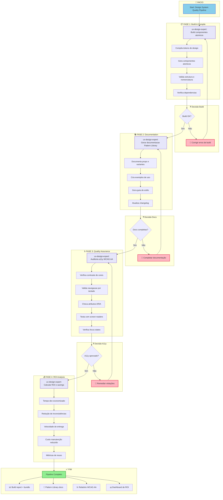
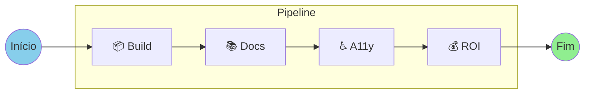
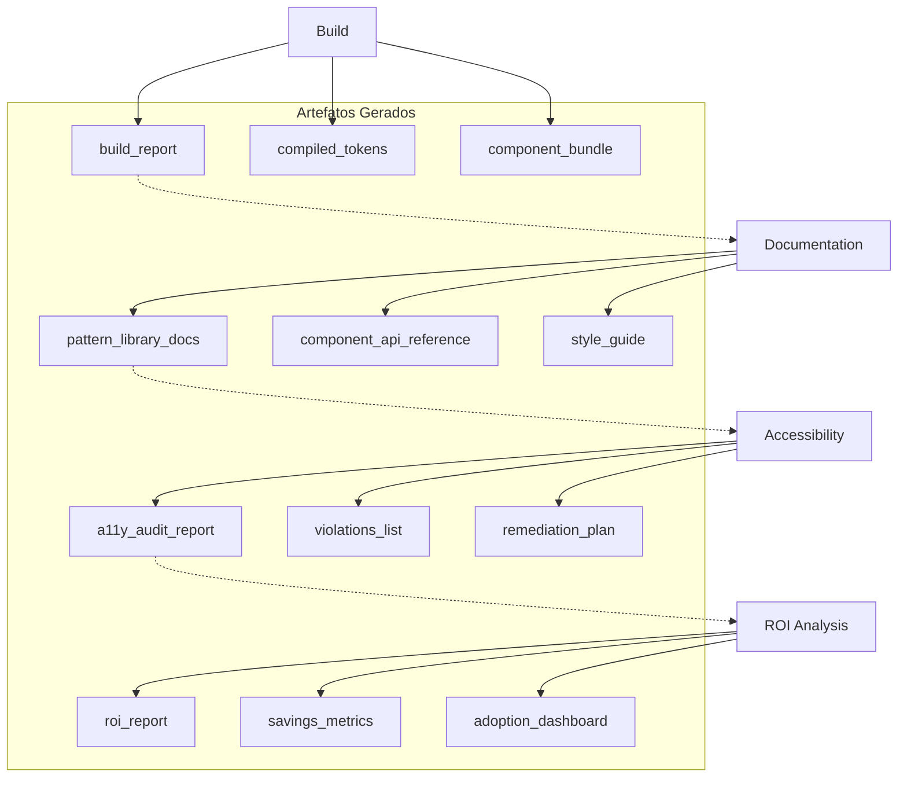
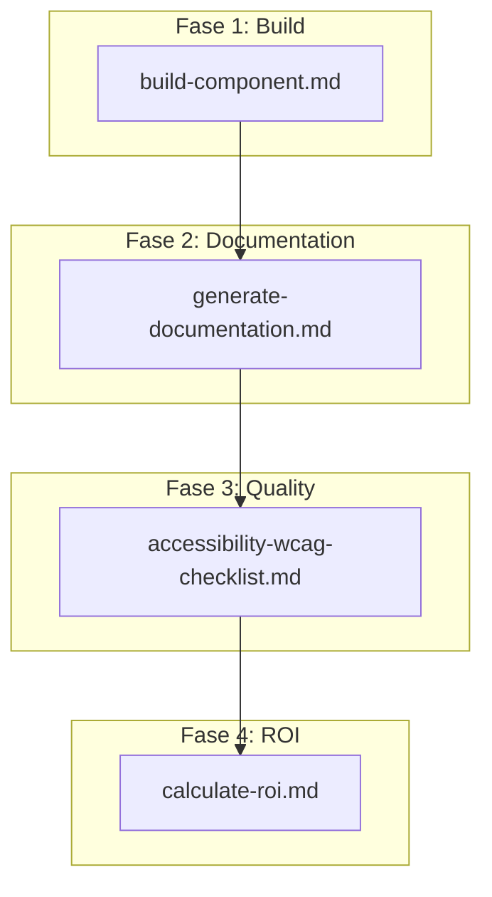
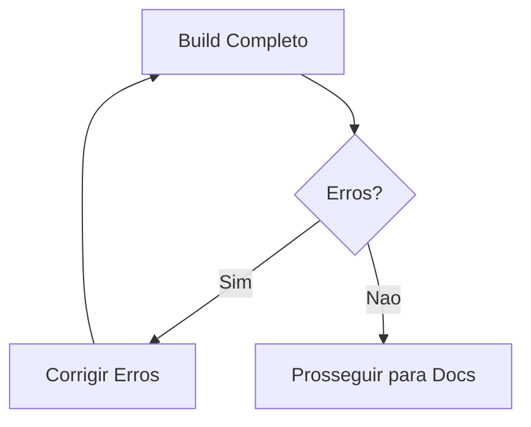
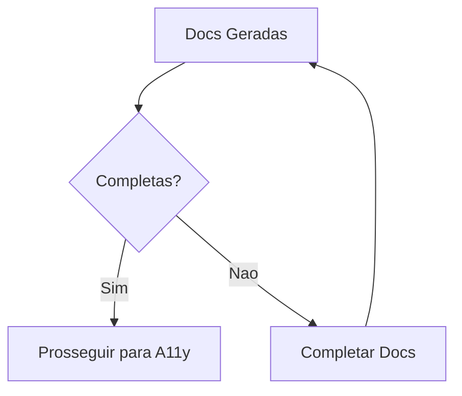
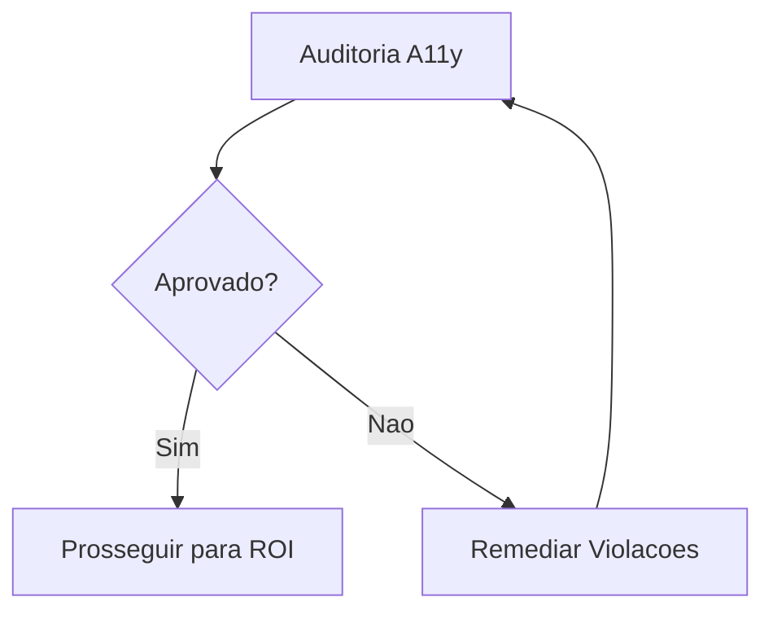

# Design System Build Quality Pipeline

**Workflow ID:** `design-system-build-quality`
**Versão:** 1.0.0
**Tipo:** Brownfield
**Status:** Production Ready

---

## Visão Geral

O **Design System Build Quality Pipeline** é um workflow pós-migração para Design Systems. Ele encadeia sequencialmente as etapas de build, documentação, auditoria de acessibilidade e cálculo de ROI para garantir qualidade e mensurar valor entregue.

### Propósito

Este pipeline garante que após a migração ou criação de um Design System:

1. **Componentes compilam corretamente** - Build de tokens e componentes atômicos
2. **Documentação está completa** - Pattern Library com exemplos e guias
3. **Acessibilidade é validada** - Conformidade WCAG 2.1 AA
4. **ROI é mensurado** - Métricas de economia e valor entregue

### Quando Usar

| Cenário | Recomendação |
|---------|--------------|
| Após migração de Design System | Fortemente recomendado |
| Release de nova versão do Pattern Library | Obrigatório |
| Auditoria periódica de qualidade | Recomendado (trimestral) |
| Validação pré-produção de componentes | Obrigatório |
| Geração de métricas para stakeholders | Conforme necessidade |

### Tipos de Projeto Suportados

- `design-system`
- `component-library`
- `pattern-library`
- `ui-migration`

---

## Diagrama do Workflow

### Fluxo Principal



### Visão Simplificada



#### Fluxo de Dependências



---

## Steps Detalhados

### Step 1: Build Atomic Components

| Atributo | Valor |
|----------|-------|
| **ID** | `build` |
| **Fase** | 1 - Build & Compile |
| **Agente** | `ux-design-expert` (Uma) |
| **Ação** | Build de componentes atômicos |
| **Dependências** | Nenhuma (step inicial) |

#### Descrição

Executa o build dos componentes do Design System, compilando tokens e gerando os componentes atômicos.

#### Atividades Executadas

1. **Compila tokens de design** - cores, tipografia, espaçamentos
2. **Gera componentes atômicos** - buttons, inputs, cards, etc.
3. **Valida estrutura de arquivos e nomenclatura**
4. **Verifica dependências e imports**

#### Criterios de Sucesso

- [ ] Build completo sem erros
- [ ] Todos os tokens compilados
- [ ] Componentes exportados corretamente

#### Outputs

| Artefato | Descrição |
|----------|-----------|
| `build_report` | Relatório do processo de build |
| `compiled_tokens` | Tokens de design compilados (CSS/JS) |
| `component_bundle` | Bundle de componentes prontos |

---

### Step 2: Generate Documentation

| Atributo | Valor |
|----------|-------|
| **ID** | `document` |
| **Fase** | 2 - Documentation |
| **Agente** | `ux-design-expert` (Uma) |
| **Ação** | Gerar documentação do Pattern Library |
| **Dependências** | `build` (Step 1) |

#### Descrição

Gera documentação completa do Pattern Library, incluindo API de componentes, exemplos e guias de estilo.

#### Atividades Executadas

1. **Documenta cada componente** com props e variantes
2. **Cria exemplos de uso** e code snippets
3. **Gera guia de estilo visual**
4. **Atualiza changelog de componentes**

#### Criterios de Sucesso

- [ ] Todos os componentes documentados
- [ ] Exemplos de código funcionais
- [ ] Guia de estilo atualizado

#### Outputs

| Artefato | Descrição |
|----------|-----------|
| `pattern_library_docs` | Documentação completa do Pattern Library |
| `component_api_reference` | Referência de API dos componentes |
| `style_guide` | Guia de estilo visual |

---

### Step 3: Accessibility Audit

| Atributo | Valor |
|----------|-------|
| **ID** | `a11y-check` |
| **Fase** | 3 - Quality Assurance |
| **Agente** | `ux-design-expert` (Uma) |
| **Ação** | Auditoria de acessibilidade (WCAG AA) |
| **Dependências** | `document` (Step 2) |

#### Descrição

Executa auditoria de acessibilidade conforme WCAG 2.1 AA, validando contraste, navegação e compatibilidade com tecnologias assistivas.

#### Atividades Executadas

1. **Verifica contraste de cores** - 4.5:1 texto, 3:1 UI
2. **Valida navegação por teclado**
3. **Checa atributos ARIA e roles**
4. **Testa com screen readers**
5. **Verifica focus states e indicadores visuais**

#### Criterios de Sucesso

- [ ] Contraste de cores aprovado
- [ ] Navegacao por teclado funcional
- [ ] ARIA labels corretos
- [ ] Zero violacoes criticas WCAG AA

#### Outputs

| Artefato | Descrição |
|----------|-----------|
| `a11y_audit_report` | Relatorio completo da auditoria |
| `violations_list` | Lista de violacoes encontradas |
| `remediation_plan` | Plano de remediacao para violacoes |

---

### Step 4: Calculate ROI

| Atributo | Valor |
|----------|-------|
| **ID** | `calculate-roi` |
| **Fase** | 4 - ROI Analysis |
| **Agente** | `ux-design-expert` (Uma) |
| **Acao** | Calculo de ROI e savings |
| **Dependencias** | `a11y-check` (Step 3) |

#### Descricao

Calcula o retorno sobre investimento do Design System, mensurando economia de tempo, reducao de inconsistencias e metricas de reuso.

#### Metricas Calculadas

1. **Tempo economizado** em desenvolvimento (horas/mes)
2. **Reducao de inconsistencias visuais** (%)
3. **Velocidade de entrega de features** (tempo medio)
4. **Custo de manutencao reduzido** ($)
5. **Taxa de reuso de componentes** (%)

#### Criterios de Sucesso

- [ ] Horas dev economizadas/mes calculadas
- [ ] % de reuso de componentes medido
- [ ] Tempo medio para nova feature calculado
- [ ] Reducao de bugs visuais quantificada

#### Outputs

| Artefato | Descrição |
|----------|-----------|
| `roi_report` | Relatorio de ROI completo |
| `savings_metrics` | Metricas de economia detalhadas |
| `adoption_dashboard` | Dashboard de adocao do Design System |

---

## Agentes Participantes

### ux-design-expert (Uma)

| Atributo | Valor |
|----------|-------|
| **Nome** | Uma |
| **Role** | UX/UI Designer & Design System Architect |
| **Icon** | 🎨 |
| **Arquetipo** | Empathizer |

#### Filosofia Hibrida

Uma combina duas abordagens complementares:

**Sally's UX Principles (Fase de Research):**
- User-centric: decisoes baseadas em necessidades reais
- Empathetic discovery: pesquisa profunda de usuarios
- Iterative simplicity: comecar simples, refinar com feedback
- Delight in details: micro-interacoes criam experiencias memoraveis

**Brad Frost's System Principles (Fases de Build & Scale):**
- Metric-driven: numeros sobre opinioes
- Visual shock therapy: mostrar o caos com dados reais
- Intelligent consolidation: clustering algoritmico de padroes
- ROI-focused: calcular economia, provar valor
- Zero hardcoded values: todo styling vem de tokens
- Atomic Design: Atoms → Molecules → Organisms → Templates → Pages
- WCAG AA minimum: acessibilidade built-in

#### Comandos Relevantes para Este Workflow

| Comando | Descricao | Fase |
|---------|-----------|------|
| `*build {component}` | Build de componente atomico | 4 |
| `*document` | Gerar documentacao Pattern Library | 5 |
| `*a11y-check` | Auditoria WCAG AA/AAA | 5 |
| `*calculate-roi` | Calcular ROI e economia | 5 |

---

## Tasks Executadas

### Mapeamento de Tasks por Step

| Step | Task File | Descricao |
|------|-----------|-----------|
| Build | `build-component.md` | Build de componentes atomicos |
| Documentation | `generate-documentation.md` | Geracao de Pattern Library |
| A11y Audit | `accessibility-wcag-checklist.md` | Checklist WCAG 2.1 AA |
| ROI | `calculate-roi.md` | Calculo de ROI e metricas |

### Diagrama de Dependencias de Tasks



---

## Pre-requisitos

### Requisitos Tecnicos

| Requisito | Descricao |
|-----------|-----------|
| Design System existente | Componentes ja migrados/criados |
| Estrutura de tokens | `tokens.yaml` ou equivalente configurado |
| Ambiente de build | Node.js 18+, npm/yarn/pnpm |
| Ferramentas de teste | Jest, Testing Library (recomendado) |

### Requisitos de Projeto

- [ ] Migracao de Design System concluida (ou v1 criada)
- [ ] Tokens de design extraidos e organizados
- [ ] Componentes atomicos definidos (atoms, molecules, organisms)
- [ ] Estrutura de pastas seguindo Atomic Design

### Requisitos de Time

- [ ] Conhecimento de Atomic Design methodology
- [ ] Familiaridade com WCAG 2.1 guidelines
- [ ] Acesso ao repositorio de Design System

---

## Entradas e Saidas

### Entradas do Pipeline

| Entrada | Tipo | Descricao |
|---------|------|-----------|
| Design tokens source | `tokens.yaml` | Definicoes de cores, tipografia, espacamentos |
| Component source files | `*.tsx`, `*.css` | Codigo fonte dos componentes |
| Existing documentation | `*.md` | Documentacao existente (se houver) |

### Saidas do Pipeline

#### Fase 1: Build & Compile

```
outputs/design-system/
├── build_report.json
├── compiled/
│   ├── tokens.css
│   ├── tokens.js
│   └── tokens.d.ts
└── bundle/
    ├── components.js
    └── components.d.ts
```

#### Fase 2: Documentation

```
outputs/design-system/
├── docs/
│   ├── pattern-library/
│   │   ├── index.html
│   │   ├── atoms/
│   │   ├── molecules/
│   │   └── organisms/
│   ├── api-reference/
│   │   └── components.md
│   └── style-guide/
│       └── index.html
└── changelog.md
```

#### Fase 3: Quality Assurance

```
outputs/design-system/
├── a11y/
│   ├── audit-report.html
│   ├── violations.json
│   └── remediation-plan.md
```

#### Fase 4: ROI Analysis

```
outputs/design-system/
├── metrics/
│   ├── roi-report.pdf
│   ├── savings-breakdown.json
│   └── adoption-dashboard.html
```

---

## Pontos de Decisao

### Decisao 1: Build OK?



**Criterios de Passagem:**
- Zero erros de compilacao
- Todos os tokens validos
- Exports funcionando

**Acoes em Caso de Falha:**
1. Revisar logs de build
2. Corrigir erros de sintaxe/import
3. Validar estrutura de tokens
4. Re-executar build

---

### Decisao 2: Documentacao Completa?



**Criterios de Passagem:**
- 100% dos componentes documentados
- Exemplos de codigo funcionais
- Guia de estilo atualizado

**Acoes em Caso de Falha:**
1. Identificar componentes sem documentacao
2. Adicionar props e exemplos faltantes
3. Atualizar changelog
4. Re-gerar documentacao

---

### Decisao 3: Acessibilidade Aprovada?



**Criterios de Passagem:**
- Zero violacoes criticas (Level A)
- Zero violacoes serias (Level AA)
- Navegacao por teclado 100% funcional

**Acoes em Caso de Falha:**
1. Revisar `violations_list`
2. Seguir `remediation_plan`
3. Corrigir problemas de contraste
4. Adicionar ARIA labels faltantes
5. Re-executar auditoria

---

## Modos de Execucao

O workflow suporta tres modos de execucao:

### Modo YOLO (Autonomo)

| Atributo | Valor |
|----------|-------|
| **Prompts** | 0-1 |
| **Interacao** | Minima |
| **Uso** | Pipelines CI/CD, execucao automatizada |

```bash
# Execucao autonoma
*workflow design-system-build-quality --mode yolo
```

### Modo Interactive (Padrao)

| Atributo | Valor |
|----------|-------|
| **Prompts** | 5-10 |
| **Interacao** | Checkpoints de decisao |
| **Uso** | Desenvolvimento normal, feedback educacional |

```bash
# Execucao interativa (padrao)
*workflow design-system-build-quality
```

### Modo Preflight (Planejamento)

| Atributo | Valor |
|----------|-------|
| **Prompts** | 10-15 |
| **Interacao** | Planejamento completo antes da execucao |
| **Uso** | Primeira execucao, analise de impacto |

```bash
# Execucao com planejamento completo
*workflow design-system-build-quality --mode preflight
```

---

## Troubleshooting

### Problema: Build Falha com Erros de Token

**Sintomas:**
- Erro "Token not found"
- Cores ou espacamentos nao compilam

**Solucao:**
```bash
# 1. Verificar estrutura de tokens
cat tokens.yaml

# 2. Validar sintaxe YAML
npm run lint:tokens

# 3. Verificar referencias cruzadas
grep -r "var(--" src/
```

---

### Problema: Documentacao Incompleta

**Sintomas:**
- Componentes sem exemplos
- Props nao documentadas

**Solucao:**
```bash
# 1. Listar componentes sem docs
*audit --check-docs

# 2. Gerar stubs de documentacao
*document --generate-stubs

# 3. Completar manualmente e re-executar
*document
```

---

### Problema: Violacoes de Acessibilidade

**Sintomas:**
- Falhas de contraste
- ARIA labels ausentes

**Solucao:**
```bash
# 1. Revisar relatorio detalhado
cat outputs/design-system/a11y/violations.json

# 2. Usar ferramenta de contraste
# Recomendado: WebAIM Contrast Checker

# 3. Adicionar ARIA labels
# Seguir remediation-plan.md

# 4. Re-executar auditoria
*a11y-check
```

---

### Problema: ROI Nao Calculado Corretamente

**Sintomas:**
- Metricas zeradas
- Dados historicos ausentes

**Solucao:**
```bash
# 1. Verificar dados de entrada
cat .state.yaml

# 2. Fornecer baseline manual
*calculate-roi --baseline "manual"

# 3. Usar estimativas de mercado
# Brad Frost sugere: 30-50% economia em desenvolvimento
```

---

## Handoff Prompts

### Apos Build Completo

```
Build de componentes concluido com sucesso.
Tokens compilados: {{token_count}}
Componentes gerados: {{component_count}}
Prosseguindo para documentacao...
```

### Apos Documentacao

```
Documentacao do Pattern Library gerada.
Componentes documentados: {{documented_count}}
Exemplos criados: {{example_count}}
Iniciando auditoria de acessibilidade...
```

### Apos Auditoria A11y

```
Auditoria de acessibilidade WCAG AA concluida.
Status: {{pass/fail}}
Violacoes criticas: {{critical_count}}
Violacoes menores: {{minor_count}}
{{if pass}}: Prosseguindo para calculo de ROI.
{{if fail}}: Revisar remediation_plan antes de continuar.
```

### Pipeline Completo

```
Pipeline de qualidade finalizado!

Resumo:
- Build: {{build_status}}
- Documentacao: {{docs_status}}
- Acessibilidade: {{a11y_status}}
- ROI calculado: {{roi_value}}

Artefatos disponiveis em outputs/design-system/
```

---

## Referencias

### Documentacao Interna

| Documento | Caminho |
|-----------|---------|
| Definicao do Workflow | `.aios-core/development/workflows/design-system-build-quality.yaml` |
| Agente UX-Design Expert | `.aios-core/development/agents/ux-design-expert.md` |
| Task: Build Component | `.aios-core/development/tasks/build-component.md` |
| Task: Generate Documentation | `.aios-core/development/tasks/generate-documentation.md` |
| Checklist: WCAG A11y | `.aios-core/development/checklists/accessibility-wcag-checklist.md` |
| Task: Calculate ROI | `.aios-core/development/tasks/calculate-roi.md` |

### Referencias Externas

| Recurso | Link |
|---------|------|
| Atomic Design (Brad Frost) | https://atomicdesign.bradfrost.com/ |
| WCAG 2.1 Guidelines | https://www.w3.org/WAI/WCAG21/quickref/ |
| Design Tokens W3C | https://design-tokens.github.io/community-group/format/ |
| WebAIM Contrast Checker | https://webaim.org/resources/contrastchecker/ |

### Workflows Relacionados

| Workflow | Descricao |
|----------|-----------|
| `brownfield-migration` | Migracao de Design System existente |
| `greenfield-design-system` | Criacao de Design System do zero |
| `component-library-setup` | Setup inicial de biblioteca de componentes |

---

## Historico de Versoes

| Versao | Data | Autor | Mudancas |
|--------|------|-------|----------|
| 1.0.0 | 2025-01-30 | Orion (AIOS Master) | Versao inicial do workflow |

---

## Metadata

```yaml
workflow_id: design-system-build-quality
version: 1.0.0
type: brownfield
author: Orion (AIOS Master)
created_date: 2025-01-30
documentation_created: 2026-02-04
tags:
  - design-system
  - quality-assurance
  - accessibility
  - documentation
  - roi
  - brownfield
```

---

*Documentacao gerada por Technical Documentation Specialist*
*AIOS-FULLSTACK Framework v2.2*
