# Workflow Greenfield Full-Stack

**Versão:** 1.0.0
**Tipo:** Greenfield
**Última Atualização:** 2026-02-04
**Arquivo Fonte:** `.aios-core/development/workflows/greenfield-fullstack.yaml`

---

## Visão Geral

O **Greenfield Full-Stack Workflow** e o fluxo de trabalho principal do AIOS para construcao de aplicacoes full-stack desde o conceito ate o desenvolvimento. Este workflow suporta tanto planejamento abrangente para projetos complexos quanto prototipagem rapida para projetos simples.

### Tipos de Projeto Suportados

| Tipo | Descricao |
|------|-----------|
| `web-app` | Aplicacoes web modernas |
| `saas` | Software as a Service |
| `enterprise-app` | Aplicacoes corporativas |
| `prototype` | Prototipos e POCs |
| `mvp` | Minimum Viable Products |

### Quando Usar Este Workflow

- Construcao de aplicacoes prontas para producao
- Projetos com multiplos membros na equipe
- Requisitos de funcionalidades complexas
- Necessidade de documentacao abrangente
- Expectativa de manutencao de longo prazo
- Aplicacoes corporativas ou voltadas para clientes

---

## Diagrama Geral do Workflow


---

## Fases do Workflow

### Legenda de Cores

| Cor | Significado |
|-----|-------------|
| Vermelho (#FF6B6B) | Bootstrap do ambiente |
| Laranja claro (#FFE4B5) | Planejamento e documentacao |
| Azul claro (#ADD8E6) | Desenvolvimento e fragmentacao |
| Roxo claro (#E6E6FA) | Geracao de UI com IA |
| Amarelo (#F0E68C) | Revisao e validacao |
| Verde (#90EE90) | Conclusao |

---

## FASE 0: Bootstrap do Ambiente

### Objetivo
Configurar o ambiente de desenvolvimento antes de iniciar o planejamento do projeto.

### Diagrama Detalhado


### Step Detalhado

| Step | Agente | Task | Entrada | Saida | Obrigatorio |
|------|--------|------|---------|-------|-------------|
| 1 | @devops (Gage) | `environment-bootstrap.md` | `project_name`, `project_path`, `github_org` | `.aios/config.yaml`, `.aios/environment-report.json`, `.gitignore`, `README.md`, `package.json` | Sim |

### Artefatos Criados

| Arquivo | Descricao |
|---------|-----------|
| `.aios/config.yaml` | Configuracao do projeto AIOS |
| `.aios/environment-report.json` | Relatorio completo do ambiente |
| `.gitignore` | Regras de ignore do Git |
| `README.md` | Documentacao inicial do projeto |
| `package.json` | Configuracao NPM |

### CLIs Verificadas/Instaladas

| Categoria | Ferramenta | Obrigatoria |
|-----------|------------|-------------|
| Essencial | git | Sim |
| Essencial | gh (GitHub CLI) | Sim |
| Essencial | node | Sim |
| Essencial | npm | Sim |
| Infraestrutura | supabase | Recomendada |
| Infraestrutura | railway | Opcional |
| Infraestrutura | docker | Recomendada |
| Qualidade | coderabbit | Recomendada |
| Opcional | pnpm | Opcional |
| Opcional | bun | Opcional |

### Condicoes de Pulo

- Pular apenas se o projeto ja tiver `.aios/environment-report.json`
- Re-executar ao trocar de maquina ou quando novos membros entrarem no projeto

---

## FASE 1: Descoberta e Planejamento

### Objetivo
Criar todos os artefatos de planejamento: project brief, PRD, especificacoes e arquitetura.

### Diagrama Detalhado


### Steps Detalhados

| Step | Agente | Task/Template | Entrada | Saida | Obrigatorio |
|------|--------|---------------|---------|-------|-------------|
| 1 | @analyst (Atlas) | `project-brief-tmpl.yaml` | Requisitos do usuario, pesquisa | `project-brief.md` | Sim |
| 2 | @pm (Morgan) | `prd-tmpl.yaml` | `project-brief.md` | `prd.md` | Sim |
| 3 | @ux-expert (Uma) | `front-end-spec-tmpl.yaml` | `prd.md` | `front-end-spec.md` | Sim |
| 4 | @ux-expert (Uma) | `generate-ai-frontend-prompt.md` | `front-end-spec.md` | Prompt para v0/Lovable | Opcional |
| 5 | @architect (Aria) | `fullstack-architecture-tmpl.yaml` | `prd.md`, `front-end-spec.md` | `fullstack-architecture.md` | Sim |
| 6 | @pm (Morgan) | Atualizacao | `fullstack-architecture.md` | `prd.md` atualizado | Condicional |
| 7 | @po (Pax) | `po-master-checklist.md` | Todos os artefatos | Validacao | Sim |

### Artefatos Criados

| Documento | Responsavel | Localizacao |
|-----------|-------------|-------------|
| Project Brief | @analyst | `docs/project-brief.md` |
| PRD | @pm | `docs/prd.md` |
| Front-End Spec | @ux-expert | `docs/front-end-spec.md` |
| Fullstack Architecture | @architect | `docs/fullstack-architecture.md` |

### Steps Opcionais

| Step | Agente | Descricao |
|------|--------|-----------|
| Brainstorming | @analyst | Sessao de ideacao estruturada |
| Pesquisa de Mercado | @analyst | Analise de mercado e competidores |
| Pesquisa de Usuario | @ux-expert | Entrevistas e analise de necessidades |
| Pesquisa Tecnica | @architect | Investigacao de tecnologias |

---

## FASE 2: Fragmentacao de Documentos

### Objetivo
Dividir o PRD e a arquitetura em partes prontas para desenvolvimento.

### Diagrama Detalhado


### Step Detalhado

| Step | Agente | Task | Entrada | Saida | Obrigatorio |
|------|--------|------|---------|-------|-------------|
| 1 | @po (Pax) | `shard-doc.md` | `docs/prd.md` | Pasta `docs/prd/` com arquivos fragmentados | Sim |

### Metodo de Fragmentacao

1. **Automatico (Recomendado)**: Usar `md-tree explode {input} {output}`
2. **Manual**: Dividir por secoes de nivel 2 (##)

### Artefatos Criados

| Arquivo | Descricao |
|---------|-----------|
| `docs/prd/index.md` | Indice com links para todas as secoes |
| `docs/prd/*.md` | Secoes individuais do PRD |
| `docs/architecture/source-tree.md` | Estrutura de diretorios do projeto |
| `docs/architecture/tech-stack.md` | Stack tecnologica |
| `docs/architecture/coding-standards.md` | Padroes de codigo |

---

## FASE 3: Ciclo de Desenvolvimento

### Objetivo
Implementacao iterativa de stories com revisao de QA.

### Diagrama Detalhado


### Steps Detalhados

| Step | Agente | Task | Entrada | Saida | Obrigatorio |
|------|--------|------|---------|-------|-------------|
| 1 | @sm (River) | `sm-create-next-story.md` | Docs fragmentados | `{epic}.{story}.story.md` | Sim |
| 2 | @analyst/@pm | Revisao | Story draft | Story aprovada | Opcional |
| 3 | @dev (Dex) | `dev-develop-story.md` | Story aprovada | Implementacao | Sim |
| 4 | @qa (Quinn) | `qa-review-story.md` | Implementacao | Feedback de QA | Opcional |
| 5 | @dev (Dex) | `apply-qa-fixes.md` | Feedback de QA | Correcoes aplicadas | Condicional |
| 6 | @po (Pax) | Retrospectiva | Epic completo | Retrospectiva | Opcional |

### Ciclo de Story


### Status de Story

| Status | Descricao | Proximo Passo |
|--------|-----------|---------------|
| Draft | Story criada pelo SM | Revisao ou desenvolvimento |
| Approved | Story revisada e aprovada | Desenvolvimento |
| In Progress | Em desenvolvimento | Revisao de QA |
| Review | Aguardando revisao | QA ou correcoes |
| Done | Completa e aprovada | Proxima story |

---

## Agentes Participantes

### Tabela de Agentes

| Agente | ID | Icone | Arquetipo | Responsabilidades |
|--------|----|----|-----------|-------------------|
| Gage | @devops | ⚡ | Operator | Bootstrap de ambiente, push Git, releases, CI/CD |
| Atlas | @analyst | 🔍 | Decoder | Pesquisa de mercado, brainstorming, project brief |
| Morgan | @pm | 📋 | Strategist | PRD, estrategia de produto, epics |
| Uma | @ux-expert | 🎨 | Empathizer | Specs de frontend, UX, design systems |
| Aria | @architect | 🏛️ | Visionary | Arquitetura full-stack, decisoes tecnicas |
| Pax | @po | 🎯 | Balancer | Validacao de artefatos, backlog, fragmentacao |
| River | @sm | 🌊 | Facilitator | Criacao de stories, sprint planning |
| Dex | @dev | 💻 | Builder | Implementacao de codigo, testes |
| Quinn | @qa | ✅ | Guardian | Revisao de qualidade, testes, gates |

### Diagrama de Interacao entre Agentes

```mermaid
graph LR
    subgraph Planejamento
        ANALYST[🔍 Atlas<br>@analyst]
        PM[📋 Morgan<br>@pm]
        UX[🎨 Uma<br>@ux-expert]
        ARCH[🏛️ Aria<br>@architect]
    end

    subgraph Governanca
        PO[🎯 Pax<br>@po]
        SM[🌊 River<br>@sm]
    end

    subgraph Execucao
        DEV[💻 Dex<br>@dev]
        QA[✅ Quinn<br>@qa]
        DEVOPS[⚡ Gage<br>@devops]
    end

    ANALYST -->|project-brief| PM
    PM -->|prd| UX
    UX -->|front-end-spec| ARCH
    ARCH -->|arquitetura| PO
    PO -->|stories| SM
    SM -->|story| DEV
    DEV -->|implementacao| QA
    QA -->|feedback| DEV
    DEV -->|pronto| DEVOPS

    PM -.->|atualiza PRD| ARCH
    PO -.->|valida| PM
    PO -.->|valida| ARCH
```



---

## Tasks Executadas

### Lista Completa de Tasks

| Fase | Task | Agente | Arquivo |
|------|------|--------|---------|
| 0 | Environment Bootstrap | @devops | `environment-bootstrap.md` |
| 1 | Create Document | @analyst, @pm, @ux-expert, @architect | `create-doc.md` |
| 1 | Facilitate Brainstorming | @analyst | `facilitate-brainstorming-session.md` |
| 1 | Deep Research Prompt | @analyst, @pm, @architect | `create-deep-research-prompt.md` |
| 1 | Generate AI Frontend Prompt | @ux-expert | `generate-ai-frontend-prompt.md` |
| 1 | Execute Checklist | @po | `execute-checklist.md` |
| 2 | Shard Document | @po | `shard-doc.md` |
| 3 | Create Next Story | @sm | `sm-create-next-story.md` |
| 3 | Develop Story | @dev | `dev-develop-story.md` |
| 3 | Review Story | @qa | `qa-review-story.md` |
| 3 | Apply QA Fixes | @dev | `apply-qa-fixes.md` |

### Templates Utilizados

| Template | Agente | Propósito |
|----------|--------|-----------|
| `project-brief-tmpl.yaml` | @analyst | Estrutura do project brief |
| `prd-tmpl.yaml` | @pm | Estrutura do PRD |
| `front-end-spec-tmpl.yaml` | @ux-expert | Especificacao de frontend |
| `fullstack-architecture-tmpl.yaml` | @architect | Arquitetura completa |
| `story-tmpl.yaml` | @sm | Template de user story |

### Checklists Utilizados

| Checklist | Agente | Proposito |
|-----------|--------|-----------|
| `po-master-checklist.md` | @po | Validacao de todos os artefatos |
| `story-draft-checklist.md` | @sm | Qualidade da story draft |
| `story-dod-checklist.md` | @dev | Definition of Done |

---

## Pre-requisitos

### Requisitos de Sistema

| Requisito | Minimo | Recomendado |
|-----------|--------|-------------|
| Windows | 10 1809+ | 11 |
| macOS | 12+ | 14+ |
| Linux | Ubuntu 20.04+ | Ubuntu 22.04+ |
| Node.js | 18.x | 20.x |
| Git | 2.x | 2.43+ |

### Ferramentas Obrigatorias

| Ferramenta | Comando de Verificacao | Instalacao |
|------------|------------------------|------------|
| Git | `git --version` | Nativo do sistema |
| GitHub CLI | `gh --version` | `winget install GitHub.cli` |
| Node.js | `node --version` | `winget install OpenJS.NodeJS.LTS` |
| npm | `npm --version` | Incluido com Node.js |

### Autenticacoes Necessarias

| Servico | Comando de Login | Verificacao |
|---------|------------------|-------------|
| GitHub | `gh auth login` | `gh auth status` |
| Supabase | `supabase login` | `supabase projects list` |
| Railway | `railway login` | `railway whoami` |

---

## Entradas e Saidas

### Fluxo de Dados


### Matriz de Entradas/Saidas por Fase

| Fase | Entrada | Saida |
|------|---------|-------|
| 0 | Nome do projeto, organizacao GitHub | Config AIOS, repo Git, estrutura de pastas |
| 1 | Requisitos, pesquisa | Brief, PRD, specs, arquitetura |
| 2 | PRD, arquitetura | Documentos fragmentados, indexes |
| 3 | Stories, docs fragmentados | Codigo, testes, aplicacao |

---

## Pontos de Decisao

### Tabela de Decisoes

| Fase | Ponto de Decisao | Opcoes | Criterio |
|------|------------------|--------|----------|
| 0 | Ambiente pronto? | Pular / Executar bootstrap | Existencia de `.aios/environment-report.json` |
| 1 | Gerar prompt v0? | Sim / Nao | Usuario quer geracao de UI com IA |
| 1 | Arquitetura sugere mudancas? | Atualizar PRD / Continuar | Recomendacao do arquiteto |
| 1 | PO encontrou problemas? | Corrigir / Aprovar | Resultado do checklist |
| 3 | Revisar story draft? | Revisar / Pular para dev | Complexidade da story |
| 3 | Revisao QA? | Sim / Nao | Criticidade da story |
| 3 | Mais stories? | Continuar / Finalizar | Backlog do epic |
| 3 | Retrospectiva? | Sim / Nao | Epic completo |

### Fluxograma de Decisoes


---

## Troubleshooting

### Problemas Comuns

#### Fase 0: Bootstrap do Ambiente

| Problema | Causa | Solucao |
|----------|-------|---------|
| `winget` nao reconhecido | Windows desatualizado | Atualizar Windows ou usar `choco`/`scoop` |
| `gh auth login` falha | Conexao ou proxy | Verificar internet, configurar proxy |
| Permissao negada no repositorio | Token sem escopo | Re-autenticar com `--scopes repo,workflow` |
| Docker nao inicia | Servico parado | Iniciar Docker Desktop |

#### Fase 1: Planejamento

| Problema | Causa | Solucao |
|----------|-------|---------|
| Template nao encontrado | Caminho incorreto | Verificar `.aios-core/development/templates/` |
| Conflito entre PRD e arquitetura | Requisitos divergentes | Reunir PM e Architect para alinhar |
| Checklist falha | Artefatos incompletos | Retornar ao agente responsavel |

#### Fase 2: Fragmentacao

| Problema | Causa | Solucao |
|----------|-------|---------|
| `md-tree` nao encontrado | Nao instalado | `npm install -g @kayvan/markdown-tree-parser` |
| Secoes nao detectadas | Formato incorreto | Verificar headings `##` no documento |
| Conteudo perdido | Code blocks com `##` | Usar metodo manual com parsing correto |

#### Fase 3: Desenvolvimento

| Problema | Causa | Solucao |
|----------|-------|---------|
| Story incompleta | SM pulou campos | Executar `story-draft-checklist` |
| Testes falhando | Codigo quebrado | @dev executar `*run-tests` |
| QA bloqueando | Issues CRITICAL | Resolver com @dev antes de prosseguir |
| Epic nao encontrado no ClickUp | Task nao criada | Criar Epic com tags corretas |

### Comandos de Diagnostico

```bash
# Verificar ambiente
cat .aios/environment-report.json

# Verificar CLIs
git --version && gh --version && node --version

# Verificar autenticacao
gh auth status
supabase projects list
railway whoami

# Verificar estrutura do projeto
ls -la .aios/
ls -la docs/
```

---

## Handoff Prompts

### Transicoes entre Fases

| De | Para | Prompt de Handoff |
|----|------|-------------------|
| Fase 0 | Fase 1 | "Bootstrap do ambiente completo! Repo Git criado, CLIs verificadas, estrutura do projeto pronta. Inicie um novo chat com @analyst para criar o project brief." |
| @analyst | @pm | "Project brief completo. Salve como `docs/project-brief.md` no seu projeto, depois crie o PRD." |
| @pm | @ux-expert | "PRD pronto. Salve como `docs/prd.md` no seu projeto, depois crie a especificacao de UI/UX." |
| @ux-expert | @architect | "Spec de UI/UX completa. Salve como `docs/front-end-spec.md` no seu projeto, depois crie a arquitetura fullstack." |
| @architect | @po | "Arquitetura completa. Salve como `docs/fullstack-architecture.md`. Voce sugere mudancas nas stories do PRD ou precisa de novas stories?" |
| Fase 1 | Fase 2 | "Todos os artefatos de planejamento validados. Agora fragmente documentos para desenvolvimento: @po → *shard-doc docs/prd.md" |
| Fase 2 | Fase 3 | "Documentos fragmentados! source-tree.md, tech-stack.md, coding-standards.md criados. Inicie desenvolvimento: @sm → *draft" |
| Conclusao | - | "Todas as stories implementadas e revisadas. Fase de desenvolvimento do projeto completa!" |

---

## Referencias

### Arquivos Relacionados

| Tipo | Arquivo | Descricao |
|------|---------|-----------|
| Workflow | `.aios-core/development/workflows/greenfield-fullstack.yaml` | Definicao do workflow |
| Task | `.aios-core/development/tasks/environment-bootstrap.md` | Bootstrap do ambiente |
| Task | `.aios-core/development/tasks/shard-doc.md` | Fragmentacao de documentos |
| Task | `.aios-core/development/tasks/sm-create-next-story.md` | Criacao de stories |
| Agente | `.aios-core/development/agents/*.md` | Definicoes de agentes |
| Template | `.aios-core/development/templates/*.yaml` | Templates de documentos |
| Checklist | `.aios-core/development/checklists/*.md` | Checklists de validacao |

### Documentacao Externa

| Recurso | URL |
|---------|-----|
| GitHub CLI | https://cli.github.com/manual/ |
| Supabase CLI | https://supabase.com/docs/guides/cli |
| Railway CLI | https://docs.railway.app/reference/cli-api |
| CodeRabbit | https://coderabbit.ai/docs |

---

## Historico de Versoes

| Versao | Data | Alteracoes |
|--------|------|------------|
| 1.0.0 | 2026-02-04 | Documentacao inicial completa |

---

**Mantido por:** AIOS Development Team
**Ultima Revisao:** 2026-02-04
