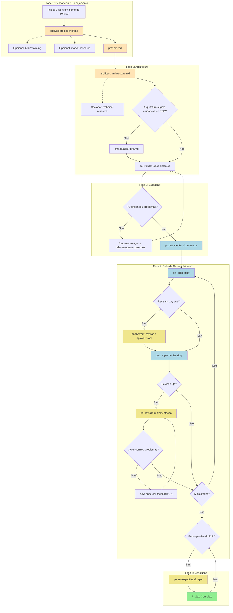
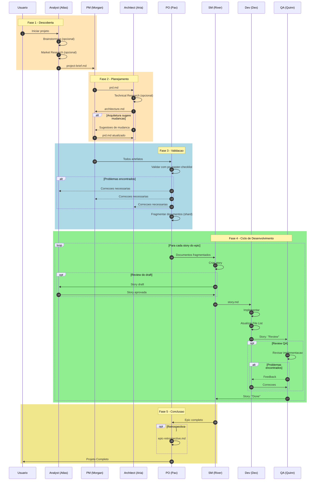
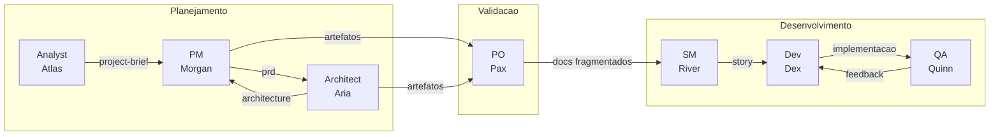
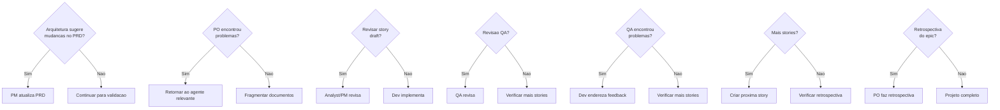

# Workflow: Greenfield Service/API Development

**Documento:** GREENFIELD-SERVICE-WORKFLOW.md
**Versão:** 1.0
**Criado:** 2026-02-04
**Fonte:** `.aios-core/development/workflows/greenfield-service.yaml`

---

## Visão Geral

O workflow **Greenfield Service/API Development** e um fluxo orquestrado de agentes para desenvolvimento de servicos backend, desde a concepcao ate a implementacao completa. Suporta tanto planejamento abrangente para servicos complexos quanto prototipagem rapida para APIs simples.

### Tipos de Projeto Suportados

| Tipo | Descricao |
|------|-----------|
| `rest-api` | API RESTful tradicional |
| `graphql-api` | API GraphQL |
| `microservice` | Microservico independente |
| `backend-service` | Servico backend generico |
| `api-prototype` | Prototipo rapido de API |
| `simple-service` | Servico simples com escopo reduzido |

### Quando Usar Este Workflow

- Construcao de APIs ou microservicos de producao
- Multiplos endpoints e logica de negocio complexa
- Necessidade de documentacao e testes abrangentes
- Multiplos membros da equipe envolvidos
- Expectativa de manutencao a longo prazo
- APIs empresariais ou voltadas para externos

---

## Diagrama do Workflow



---

## Diagrama de Sequencia



---

## Steps Detalhados

### Step 1: Criar Project Brief

| Campo | Valor |
|-------|-------|
| **Agente** | `@analyst` (Atlas) |
| **Task** | Criar project-brief.md |
| **Input** | Conceito/ideia do projeto, requisitos iniciais |
| **Output** | `docs/project-brief.md` |
| **Steps Opcionais** | `brainstorming_session`, `market_research_prompt` |

**Descricao:**
O analista conduz sessao de brainstorming (opcional), pesquisa de mercado (opcional) e cria o brief do projeto que estabelece o escopo, objetivos e contexto inicial.

**Nota:** Salvar output final em `docs/project-brief.md` do projeto.

---

### Step 2: Criar PRD

| Campo | Valor |
|-------|-------|
| **Agente** | `@pm` (Morgan) |
| **Task** | Criar prd.md |
| **Input** | `project-brief.md` |
| **Output** | `docs/prd.md` |
| **Template** | `prd-tmpl` |

**Descricao:**
O Product Manager cria o documento de requisitos do produto (PRD) focado em requisitos de API/servico a partir do brief do projeto.

**Nota:** Salvar output final em `docs/prd.md` do projeto.

---

### Step 3: Criar Arquitetura

| Campo | Valor |
|-------|-------|
| **Agente** | `@architect` (Aria) |
| **Task** | Criar architecture.md |
| **Input** | `prd.md` |
| **Output** | `docs/architecture.md` |
| **Template** | `architecture-tmpl` |
| **Steps Opcionais** | `technical_research_prompt` |

**Descricao:**
O Arquiteto cria a arquitetura do backend/servico. Pode sugerir mudancas nas stories do PRD ou novas stories.

**Nota:** Salvar output final em `docs/architecture.md` do projeto.

---

### Step 4: Atualizar PRD (Condicional)

| Campo | Valor |
|-------|-------|
| **Agente** | `@pm` (Morgan) |
| **Task** | Atualizar prd.md |
| **Condicao** | `architecture_suggests_prd_changes` |
| **Input** | `architecture.md` com sugestoes |
| **Output** | `docs/prd.md` (atualizado) |

**Descricao:**
Se o arquiteto sugerir mudancas nas stories, o PM atualiza o PRD e re-exporta o documento completo nao-reduzido.

---

### Step 5: Validar Artefatos

| Campo | Valor |
|-------|-------|
| **Agente** | `@po` (Pax) |
| **Task** | Validar todos artefatos |
| **Input** | Todos os documentos (`project-brief.md`, `prd.md`, `architecture.md`) |
| **Output** | Validacao aprovada ou lista de problemas |
| **Checklist** | `po-master-checklist` |

**Descricao:**
O Product Owner valida todos os documentos quanto a consistencia e completude. Pode exigir atualizacoes em qualquer documento.

---

### Step 6: Corrigir Problemas (Condicional)

| Campo | Valor |
|-------|-------|
| **Agente** | Variavel (depende do problema) |
| **Task** | Corrigir documentos sinalizados |
| **Condicao** | `po_checklist_issues` |
| **Input** | Lista de problemas do PO |
| **Output** | Documentos corrigidos |

**Descricao:**
Se o PO encontrar problemas, retornar ao agente relevante para correcao e re-exportar documentos atualizados para a pasta `docs/`.

---

### Step 7: Fragmentar Documentos

| Campo | Valor |
|-------|-------|
| **Agente** | `@po` (Pax) |
| **Task** | Fragmentar documentos |
| **Input** | Todos artefatos validados |
| **Output** | `docs/prd/`, `docs/architecture/` (fragmentados) |

**Descricao:**
Fragmentar documentos para desenvolvimento no IDE:
- **Opcao A:** Usar agente PO para fragmentar: `@po` e pedir para fragmentar `docs/prd.md`
- **Opcao B:** Manual: Arrastar task `shard-doc` + `docs/prd.md` para o chat

---

### Step 8: Criar Story (Loop)

| Campo | Valor |
|-------|-------|
| **Agente** | `@sm` (River) |
| **Task** | Criar story |
| **Input** | Documentos fragmentados |
| **Output** | `story.md` |
| **Repete** | Para cada epic |

**Descricao:**
Ciclo de criacao de stories:
1. SM Agent (Nova Sessao): `@sm` -> `*create`
2. Cria proxima story a partir dos documentos fragmentados
3. Story inicia em status "Draft"

---

### Step 9: Revisar Story Draft (Opcional)

| Campo | Valor |
|-------|-------|
| **Agente** | `@analyst` ou `@pm` |
| **Task** | Revisar story draft |
| **Condicao** | `user_wants_story_review` |
| **Input** | `story.md` em draft |
| **Output** | Story aprovada (Draft -> Approved) |

**Descricao:**
Revisao opcional para aprovar story draft:
- Revisar completude e alinhamento da story
- Atualizar status: Draft -> Approved

---

### Step 10: Implementar Story

| Campo | Valor |
|-------|-------|
| **Agente** | `@dev` (Dex) |
| **Task** | Implementar story |
| **Input** | `story.md` aprovada |
| **Output** | Arquivos de implementacao |

**Descricao:**
Dev Agent (Nova Sessao): `@dev`
- Implementa story aprovada
- Atualiza File List com todas as mudancas
- Marca story como "Review" quando completo

---

### Step 11: Revisar Implementacao (Opcional)

| Campo | Valor |
|-------|-------|
| **Agente** | `@qa` (Quinn) |
| **Task** | Revisar implementacao |
| **Condicao** | Opcional |
| **Input** | Arquivos de implementacao |
| **Output** | Implementacao aprovada ou feedback |

**Descricao:**
QA Agent (Nova Sessao): `@qa` -> `*review-story`
- Revisao senior dev com capacidade de refatoracao
- Corrige problemas pequenos diretamente
- Deixa checklist para itens restantes
- Atualiza status da story (Review -> Done ou permanece Review)

---

### Step 12: Enderezar Feedback QA (Condicional)

| Campo | Valor |
|-------|-------|
| **Agente** | `@dev` (Dex) |
| **Task** | Enderezar feedback QA |
| **Condicao** | `qa_left_unchecked_items` |
| **Input** | Checklist QA com itens pendentes |
| **Output** | Implementacao corrigida |

**Descricao:**
Se QA deixou itens nao marcados:
- Dev Agent (Nova Sessao): Enderezar itens restantes
- Retornar ao QA para aprovacao final

---

### Step 13: Continuar Ciclo

| Campo | Valor |
|-------|-------|
| **Acao** | Continuar para todas as stories |
| **Condicao** | Ate que todas as stories do PRD estejam completas |

**Descricao:**
Repetir ciclo de stories (SM -> Dev -> QA) para todas as stories do epic.

---

### Step 14: Retrospectiva do Epic (Opcional)

| Campo | Valor |
|-------|-------|
| **Agente** | `@po` (Pax) |
| **Task** | Retrospectiva do epic |
| **Condicao** | `epic_complete` |
| **Output** | `epic-retrospective.md` |

**Descricao:**
Apos conclusao do epic:
- Validar que o epic foi concluido corretamente
- Documentar aprendizados e melhorias

---

### Step 15: Projeto Completo

| Campo | Valor |
|-------|-------|
| **Acao** | Projeto completo |
| **Estado Final** | Todas stories implementadas e revisadas |

**Descricao:**
Todas as stories implementadas e revisadas! Fase de desenvolvimento do servico completa.

**Referencia:** `.aios-core/data/aios-kb.md#IDE Development Workflow`

---

## Agentes Participantes



### Tabela de Agentes

| ID | Nome | Titulo | Icone | Responsabilidade no Workflow |
|----|------|--------|-------|------------------------------|
| `analyst` | Atlas | Business Analyst | `analise` | Criar project brief, brainstorming, market research |
| `pm` | Morgan | Product Manager | `estrategia` | Criar e atualizar PRD |
| `architect` | Aria | Architect | `arquitetura` | Criar arquitetura do servico |
| `po` | Pax | Product Owner | `validacao` | Validar artefatos, fragmentar docs, retrospectiva |
| `sm` | River | Scrum Master | `facilitacao` | Criar stories do epic |
| `dev` | Dex | Full Stack Developer | `implementacao` | Implementar stories |
| `qa` | Quinn | Test Architect | `qualidade` | Revisar implementacao |

---

## Tasks Executadas

| Step | Task | Agente | Obrigatoria |
|------|------|--------|-------------|
| 1 | `create-project-brief` | analyst | Sim |
| 1a | `brainstorming_session` | analyst | Nao |
| 1b | `market_research_prompt` | analyst | Nao |
| 2 | `create-prd` | pm | Sim |
| 3 | `create-full-stack-architecture` | architect | Sim |
| 3a | `technical_research_prompt` | architect | Nao |
| 4 | `update-prd` | pm | Condicional |
| 5 | `execute-checklist (po-master-checklist)` | po | Sim |
| 6 | `fix-documents` | varios | Condicional |
| 7 | `shard-doc` | po | Sim |
| 8 | `create-next-story` | sm | Sim (loop) |
| 9 | `review-story-draft` | analyst/pm | Nao |
| 10 | `develop-story` | dev | Sim (loop) |
| 11 | `review-story` | qa | Nao |
| 12 | `apply-qa-fixes` | dev | Condicional |
| 14 | `epic-retrospective` | po | Nao |

---

## Pre-requisitos

### Ferramentas Necessarias

| Ferramenta | Proposito |
|------------|-----------|
| Node.js 18+ | Runtime de desenvolvimento |
| Git | Controle de versao |
| GitHub CLI (`gh`) | Integracao GitHub |
| Supabase CLI | Operacoes de banco de dados |

### Arquivos de Configuracao

| Arquivo | Descricao |
|---------|-----------|
| `.aios-core/core-config.yaml` | Configuracao do framework |
| `.env` | Variaveis de ambiente |
| `projects/{Name}/.project.yaml` | Configuracoes especificas do projeto |

### Templates Necessarios

| Template | Localizacao | Agente |
|----------|-------------|--------|
| `project-brief-tmpl.yaml` | `.aios-core/development/templates/` | analyst |
| `prd-tmpl.yaml` | `.aios-core/development/templates/` | pm |
| `architecture-tmpl.yaml` | `.aios-core/development/templates/` | architect |
| `story-tmpl.yaml` | `.aios-core/development/templates/` | sm |
| `qa-gate-tmpl.yaml` | `.aios-core/development/templates/` | qa |

### Checklists

| Checklist | Agente | Uso |
|-----------|--------|-----|
| `po-master-checklist.md` | po | Validacao de artefatos |
| `story-draft-checklist.md` | sm | Validacao de story |
| `story-dod-checklist.md` | dev | Definition of Done |

---

## Entradas e Saidas

### Entradas do Workflow

| Entrada | Descricao | Fornecido Por |
|---------|-----------|---------------|
| Conceito do projeto | Ideia inicial, objetivos, escopo | Usuario |
| Requisitos de negocio | Necessidades do cliente/stakeholder | Usuario |
| Restricoes tecnicas | Limitacoes conhecidas | Usuario |
| Preferencias de stack | Tecnologias preferidas | Usuario |

### Saidas do Workflow

| Saida | Localizacao | Criado Por |
|-------|-------------|------------|
| `project-brief.md` | `docs/project-brief.md` | analyst |
| `prd.md` | `docs/prd.md` | pm |
| `architecture.md` | `docs/architecture.md` | architect |
| PRD fragmentado | `docs/prd/` | po |
| Arquitetura fragmentada | `docs/architecture/` | po |
| Stories | `docs/stories/epic-X/` | sm |
| Codigo implementado | `apps/`, `packages/`, `infrastructure/` | dev |
| QA Gates | `docs/qa/gates/` | qa |
| Retrospectiva | `docs/epic-retrospective.md` | po |

---

## Pontos de Decisao



### Tabela de Decisoes

| Ponto | Condicao | Acao se Verdadeiro | Acao se Falso |
|-------|----------|-------------------|---------------|
| D1 | `architecture_suggests_prd_changes` | PM atualiza PRD | Continuar para PO |
| D2 | `po_checklist_issues` | Retornar para correcoes | Fragmentar docs |
| D3 | `user_wants_story_review` | Analyst/PM revisa draft | Dev implementa diretamente |
| D4 | Preferencia do usuario | QA revisa implementacao | Verificar mais stories |
| D5 | `qa_left_unchecked_items` | Dev endereza feedback | Story concluida |
| D6 | Stories restantes no epic | Criar proxima story | Verificar retrospectiva |
| D7 | `epic_complete` e preferencia | PO faz retrospectiva | Projeto completo |

---

## Handoff Prompts

Mensagens padronizadas para transicoes entre agentes:

| Transicao | Prompt |
|-----------|--------|
| Analyst -> PM | "Project brief is complete. Save it as docs/project-brief.md in your project, then create the PRD." |
| PM -> Architect | "PRD is ready. Save it as docs/prd.md in your project, then create the service architecture." |
| Architect (review) | "Architecture complete. Save it as docs/architecture.md. Do you suggest any changes to the PRD stories or need new stories added?" |
| Architect -> PM | "Please update the PRD with the suggested story changes, then re-export the complete prd.md to docs/." |
| Artefatos -> PO | "All documents ready in docs/ folder. Please validate all artifacts for consistency." |
| PO (issues) | "PO found issues with [document]. Please return to [agent] to fix and re-save the updated document." |
| Workflow complete | "All planning artifacts validated and saved in docs/ folder. Move to IDE environment to begin development." |

---

## Troubleshooting

### Problemas Comuns

#### 1. PRD Incompleto

**Sintoma:** Arquiteto nao consegue criar arquitetura adequada.

**Causa:** Project brief faltando informacoes cruciais.

**Solucao:**
1. Retornar ao analyst
2. Executar `*brainstorm` para descobrir requisitos faltantes
3. Atualizar project-brief.md
4. PM recriar PRD

---

#### 2. Arquitetura Incompativel

**Sintoma:** Stories nao mapeiam para arquitetura.

**Causa:** PRD e arquitetura desalinhados.

**Solucao:**
1. Arquiteto sugere mudancas no PRD
2. PM atualiza PRD
3. PO valida consistencia
4. Re-fragmentar documentos

---

#### 3. Story Bloqueada em Draft

**Sintoma:** Story nao progride para implementacao.

**Causa:** Story draft falhou na validacao.

**Solucao:**
1. SM revisar checklist `story-draft-checklist`
2. Corrigir itens faltantes
3. Re-validar com analyst/pm se necessario

---

#### 4. Implementacao Falha em QA

**Sintoma:** QA rejeita implementacao repetidamente.

**Causa:** Requisitos mal interpretados ou codigo de baixa qualidade.

**Solucao:**
1. Dev revisar acceptance criteria da story
2. Executar `*apply-qa-fixes` com feedback do QA
3. Rodar CodeRabbit para validacao automatica
4. Re-submeter para QA

---

#### 5. Ciclo de Desenvolvimento Infinito

**Sintoma:** Stories nao sao concluidas.

**Causa:** Escopo muito grande ou dependencias nao resolvidas.

**Solucao:**
1. PO revisar backlog e prioridades
2. SM fragmentar stories grandes
3. Identificar e resolver bloqueios
4. Considerar MVP mais restrito

---

### Logs e Diagnostico

| Tipo | Localizacao |
|------|-------------|
| Logs do agente | `.aios/logs/agent.log` |
| Status do projeto | `.aios/project-registry.yaml` |
| Decision logs | `.ai/decision-log-{story-id}.md` |
| QA reports | `docs/qa/gates/` |

### Comandos de Debug

```bash
# Verificar status do projeto
cat .aios/project-status.yaml

# Listar stories em progresso
ls docs/stories/epic-*/

# Verificar logs do agente
tail -f .aios/logs/agent.log

# Habilitar modo debug
export AIOS_DEBUG=true
```

---

## Referencias

### Arquivos do Workflow

| Arquivo | Descricao |
|---------|-----------|
| `.aios-core/development/workflows/greenfield-service.yaml` | Definicao do workflow |
| `.aios-core/data/aios-kb.md` | Knowledge base do AIOS |

### Agentes

| Arquivo | Agente |
|---------|--------|
| `.aios-core/development/agents/analyst.md` | Atlas (Analyst) |
| `.aios-core/development/agents/pm.md` | Morgan (PM) |
| `.aios-core/development/agents/architect.md` | Aria (Architect) |
| `.aios-core/development/agents/po.md` | Pax (PO) |
| `.aios-core/development/agents/sm.md` | River (SM) |
| `.aios-core/development/agents/dev.md` | Dex (Dev) |
| `.aios-core/development/agents/qa.md` | Quinn (QA) |

### Tasks Principais

| Arquivo | Task |
|---------|------|
| `.aios-core/development/tasks/create-doc.md` | Criacao de documentos |
| `.aios-core/development/tasks/shard-doc.md` | Fragmentacao de documentos |
| `.aios-core/development/tasks/sm-create-next-story.md` | Criacao de stories |
| `.aios-core/development/tasks/dev-develop-story.md` | Implementacao de stories |
| `.aios-core/development/tasks/qa-review-story.md` | Revisao de implementacao |
| `.aios-core/development/tasks/execute-checklist.md` | Execucao de checklists |

### Templates

| Arquivo | Template |
|---------|----------|
| `.aios-core/development/templates/project-brief-tmpl.yaml` | Project Brief |
| `.aios-core/development/templates/prd-tmpl.yaml` | PRD |
| `.aios-core/development/templates/architecture-tmpl.yaml` | Arquitetura |
| `.aios-core/development/templates/story-tmpl.yaml` | User Story |
| `.aios-core/development/templates/qa-gate-tmpl.yaml` | QA Gate |

### Checklists

| Arquivo | Checklist |
|---------|-----------|
| `.aios-core/development/checklists/po-master-checklist.md` | Validacao PO |
| `.aios-core/development/checklists/story-draft-checklist.md` | Validacao Story Draft |
| `.aios-core/development/checklists/story-dod-checklist.md` | Definition of Done |

---

## Historico de Alteracoes

| Data | Versao | Descricao |
|------|--------|-----------|
| 2026-02-04 | 1.0 | Criacao inicial do documento |

---

*Documentacao gerada automaticamente a partir de `.aios-core/development/workflows/greenfield-service.yaml`*
