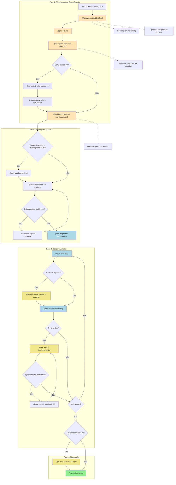
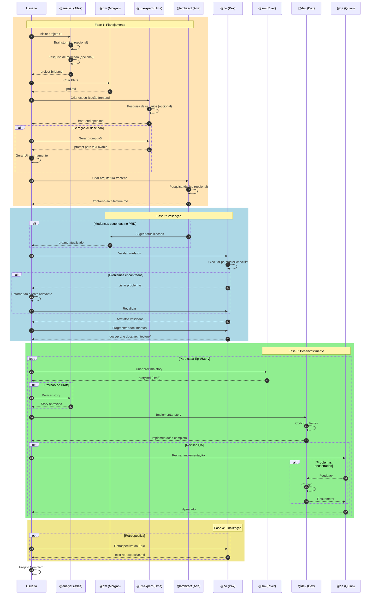
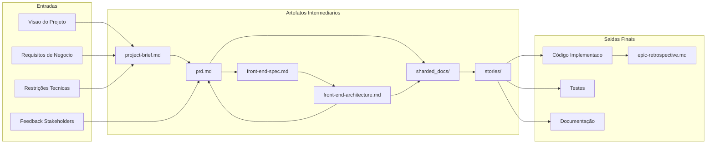
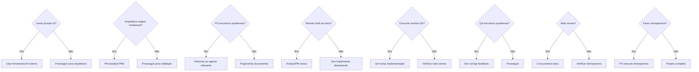
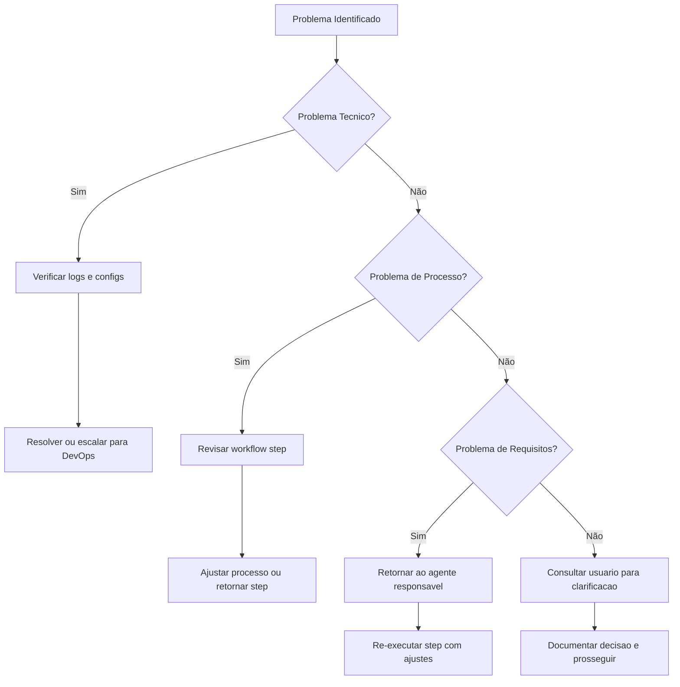

# Workflow Greenfield UI - Guia Completo

> **Workflow ID:** `greenfield-ui`
> **Tipo:** Greenfield
> **Versão:** 1.0
> **Última Atualização:** 2026-02-04

## Visão Geral

O workflow **Greenfield UI** e o fluxo orquestrado para desenvolvimento de aplicações frontend do zero (greenfield). Ele cobre todo o ciclo de vida desde a conceituação ate a implementação, suportando tanto planejamento abrangente para UIs complexas quanto prototipagem rápida para interfaces simples.

### Tipos de Projeto Suportados

| Tipo | Descrição |
|------|-----------|
| `spa` | Single Page Applications |
| `mobile-app` | Aplicativos móveis |
| `micro-frontend` | Micro-frontends |
| `static-site` | Sites estáticos |
| `ui-prototype` | Prototipos de UI |
| `simple-interface` | Interfaces simples |

### Quando Usar Este Workflow

- Construindo aplicações frontend de produção
- Múltiplas views/paginas com interações complexas
- Necessidade de design UI/UX abrangente e testes
- Múltiplos membros da equipe envolvidos
- Manutenção de longo prazo esperada
- Aplicacoes voltadas ao cliente

---

## Diagrama do Workflow

### Fluxo Principal



### Legenda de Cores

| Cor | Significado |
|-----|-------------|
| Laranja (`#FFE4B5`) | Criação de Documentos |
| Azul Claro (`#ADD8E6`) | Ciclo de Desenvolvimento |
| Lavanda (`#E6E6FA`) | Geração AI (Opcional) |
| Amarelo (`#F0E68C`) | Revisão/Validação (Opcional) |
| Verde (`#90EE90`) | Conclusão |

---

## Diagrama de Sequência



---

## Steps Detalhados

### Fase 1: Planejamento e Especificação

#### Step 1: Criação do Project Brief

| Atributo | Valor |
|----------|-------|
| **Agente** | `@analyst` (Atlas) |
| **Comando** | `*create-project-brief` |
| **Task** | `create-doc.md` + `project-brief-tmpl.yaml` |
| **Cria** | `project-brief.md` |
| **Steps Opcionais** | `brainstorming_session`, `market_research_prompt` |

**Descrição:** O Analyst facilita a ideacao inicial, conduz pesquisa de mercado opcional e cria o brief do projeto que serve como base para todo o desenvolvimento.

**Input:**
- Visao do usuario sobre o projeto
- Contexto de mercado
- Restrições conhecidas

**Output:**
- `docs/project-brief.md` - Brief completo do projeto

**Prompt de Handoff:**
> "Project brief is complete. Save it as docs/project-brief.md in your project, then create the PRD."

---

#### Step 2: Criação do PRD

| Atributo | Valor |
|----------|-------|
| **Agente** | `@pm` (Morgan) |
| **Comando** | `*create-prd` |
| **Task** | `create-doc.md` + `prd-tmpl.yaml` |
| **Requer** | `project-brief.md` |
| **Cria** | `prd.md` |

**Descrição:** O Product Manager transforma o brief em um Product Requirements Document (PRD) detalhado, focado em requisitos de UI/frontend.

**Input:**
- `project-brief.md`
- Feedback de stakeholders

**Output:**
- `docs/prd.md` - PRD completo com epics e stories

**Prompt de Handoff:**
> "PRD is ready. Save it as docs/prd.md in your project, then create the UI/UX specification."

---

#### Step 3: Especificação de Frontend

| Atributo | Valor |
|----------|-------|
| **Agente** | `@ux-expert` (Uma) |
| **Comando** | `*create-front-end-spec` |
| **Task** | `create-doc.md` + `front-end-spec-tmpl.yaml` |
| **Requer** | `prd.md` |
| **Cria** | `front-end-spec.md` |
| **Steps Opcionais** | `user_research_prompt` |

**Descrição:** O UX Expert cria a especificação detalhada de UI/UX, incluindo wireframes, fluxos de interacao e design system.

**Input:**
- `prd.md`
- Pesquisa de usuários (opcional)

**Output:**
- `docs/front-end-spec.md` - Especificação completa de frontend

---

#### Step 4: Geração de Prompt AI (Opcional)

| Atributo | Valor |
|----------|-------|
| **Agente** | `@ux-expert` (Uma) |
| **Comando** | `*generate-ui-prompt` |
| **Task** | `generate-ai-frontend-prompt.md` |
| **Requer** | `front-end-spec.md` |
| **Cria** | `v0_prompt` |
| **Condição** | `user_wants_ai_generation` |

**Descrição:** Gera prompts otimizados para ferramentas de geracao de UI como v0, Lovable, ou similares.

**Input:**
- `front-end-spec.md`
- Preferencias de estilo

**Output:**
- Prompt formatado para ferramenta AI
- Usuario gera UI externamente e baixa estrutura do projeto

---

#### Step 5: Arquitetura de Frontend

| Atributo | Valor |
|----------|-------|
| **Agente** | `@architect` (Aria) |
| **Comando** | `*create-front-end-architecture` |
| **Task** | `create-doc.md` + `front-end-architecture-tmpl.yaml` |
| **Requer** | `front-end-spec.md` |
| **Cria** | `front-end-architecture.md` |
| **Steps Opcionais** | `technical_research_prompt`, `review_generated_ui_structure` |

**Descrição:** O Architect cria a arquitetura técnica do frontend, incluindo decisões de stack, patterns e estrutura de componentes.

**Input:**
- `front-end-spec.md`
- Estrutura gerada por v0/Lovable (se aplicavel)

**Output:**
- `docs/front-end-architecture.md` - Arquitetura técnica completa

**Prompt de Handoff:**
> "Frontend architecture complete. Save it as docs/front-end-architecture.md. Do you suggest any changes to the PRD stories or need new stories added?"

---

### Fase 2: Validação e Ajustes

#### Step 6: Atualização do PRD (Condicional)

| Atributo | Valor |
|----------|-------|
| **Agente** | `@pm` (Morgan) |
| **Comando** | `*create-prd` (update) |
| **Requer** | `front-end-architecture.md` |
| **Atualiza** | `prd.md` |
| **Condição** | `architecture_suggests_prd_changes` |

**Descrição:** Se o Architect sugerir mudanças nas stories ou novos requisitos, o PM atualiza o PRD.

**Input:**
- Sugestoes do Architect
- PRD atual

**Output:**
- `docs/prd.md` atualizado

---

#### Step 7: Validação pelo PO

| Atributo | Valor |
|----------|-------|
| **Agente** | `@po` (Pax) |
| **Comando** | `*execute-checklist-po` |
| **Task** | `execute-checklist.md` + `po-master-checklist.md` |
| **Valida** | Todos os artefatos |

**Descrição:** O Product Owner valida a consistencia e completude de todos os documentos criados.

**Input:**
- `project-brief.md`
- `prd.md`
- `front-end-spec.md`
- `front-end-architecture.md`

**Output:**
- Validação PASS ou lista de problemas

**Prompt em caso de problemas:**
> "PO found issues with [document]. Please return to [agent] to fix and re-save the updated document."

---

#### Step 8: Fragmentação de Documentos

| Atributo | Valor |
|----------|-------|
| **Agente** | `@po` (Pax) |
| **Comando** | `*shard-doc` |
| **Task** | `shard-doc.md` |
| **Requer** | Todos os artefatos validados |
| **Cria** | `sharded_docs` |

**Descrição:** Fragmenta documentos grandes em partes menores para facilitar o desenvolvimento no IDE.

**Opções de Execução:**
- **Opção A:** Usar agente PO: `@po` depois pedir para fragmentar `docs/prd.md`
- **Opção B:** Manual: Arrastar task `shard-doc` + `docs/prd.md` para o chat

**Output:**
- `docs/prd/` - PRD fragmentado
- `docs/architecture/` - Arquitetura fragmentada

---

### Fase 3: Desenvolvimento

#### Step 9: Criação de Story

| Atributo | Valor |
|----------|-------|
| **Agente** | `@sm` (River) |
| **Comando** | `*draft` |
| **Task** | `create-next-story.md` |
| **Requer** | `sharded_docs` |
| **Cria** | `story.md` |
| **Repete** | Para cada epic |

**Descrição:** O Scrum Master cria stories detalhadas a partir dos documentos fragmentados.

**Ciclo de Criação:**
1. SM Agent (Nova Sessao): `@sm` → `*draft`
2. Cria próxima story dos docs fragmentados
3. Story inicia com status "Draft"

**Input:**
- Documentos fragmentados
- Contexto do sprint

**Output:**
- `docs/stories/epic-X/story-X.Y.md` - Story em Draft

---

#### Step 10: Revisão de Draft (Opcional)

| Atributo | Valor |
|----------|-------|
| **Agente** | `@analyst` ou `@pm` |
| **Comando** | `*review` (coming soon) |
| **Atualiza** | `story.md` |
| **Condição** | `user_wants_story_review` |
| **Opcional** | Sim |

**Descrição:** Revisão opcional do draft para garantir completude e alinhamento.

**Acoes:**
- Revisar completude da story
- Verificar alinhamento com PRD
- Atualizar status: Draft → Approved

---

#### Step 11: Implementação

| Atributo | Valor |
|----------|-------|
| **Agente** | `@dev` (Dex) |
| **Comando** | `*develop` |
| **Task** | `dev-develop-story.md` |
| **Requer** | `story.md` (aprovada) |
| **Cria** | Arquivos de implementação |

**Descrição:** O Developer implementa a story seguindo os requisitos e tasks definidos.

**Ciclo de Implementação:**
1. Dev Agent (Nova Sessao): `@dev`
2. Implementa story aprovada
3. Atualiza File List com todas as mudanças
4. Marca story como "Review" quando completa

**Input:**
- Story aprovada
- Arquitetura de referencia

**Output:**
- Código implementado
- Testes
- Story atualizada com File List

---

#### Step 12: Revisão QA (Opcional)

| Atributo | Valor |
|----------|-------|
| **Agente** | `@qa` (Quinn) |
| **Comando** | `*review` |
| **Task** | `review-story.md` |
| **Requer** | Arquivos implementados |
| **Atualiza** | Implementação |
| **Opcional** | Sim |

**Descrição:** Revisão de senior dev com capacidade de refatoração.

**Ciclo de QA:**
1. QA Agent (Nova Sessao): `@qa` → `*review {story}`
2. Corrige problemas pequenos diretamente
3. Deixa checklist para itens restantes
4. Atualiza status (Review → Done ou permanece Review)

**Output:**
- Código revisado/refatorado
- Checklist de itens pendentes (se houver)
- QA Gate decision (PASS/CONCERNS/FAIL)

---

#### Step 13: Correção de Feedback QA (Condicional)

| Atributo | Valor |
|----------|-------|
| **Agente** | `@dev` (Dex) |
| **Comando** | `*apply-qa-fixes` |
| **Task** | `apply-qa-fixes.md` |
| **Condição** | `qa_left_unchecked_items` |
| **Atualiza** | Arquivos de implementação |

**Descrição:** Se QA deixou itens nao marcados, Dev corrige e resubmete.

**Ciclo:**
1. Dev Agent (Nova Sessao): Endereca itens restantes
2. Retorna para QA para aprovacao final

---

#### Step 14: Ciclo de Desenvolvimento

| Atributo | Valor |
|----------|-------|
| **Acao** | Repetir ciclo SM → Dev → QA |
| **Condição** | Ate todas as stories do PRD estarem completas |

**Descrição:** Repete o ciclo de criacao de story, implementação e revisao para todas as stories.

---

### Fase 4: Finalização

#### Step 15: Retrospectiva do Epic (Opcional)

| Atributo | Valor |
|----------|-------|
| **Agente** | `@po` (Pax) |
| **Comando** | `*epic-retrospective` (coming soon) |
| **Condição** | `epic_complete` |
| **Cria** | `epic-retrospective.md` |
| **Opcional** | Sim |

**Descrição:** Apos conclusao do epic, valida se foi completado corretamente e documenta aprendizados.

**Output:**
- `docs/retrospectives/epic-X-retrospective.md`
- Melhorias documentadas

---

#### Step 16: Conclusão do Projeto

| Atributo | Valor |
|----------|-------|
| **Acao** | Projeto completo |

**Descrição:** Todas as stories implementadas e revisadas. Fase de desenvolvimento do projeto concluida.

**Referencia:** `.aios-core/data/aios-kb.md#IDE Development Workflow`

---

## Agentes Participantes

### Tabela de Agentes

| Agente | Nome | Papel | Principais Comandos |
|--------|------|-------|---------------------|
| `@analyst` | Atlas | Business Analyst | `*create-project-brief`, `*brainstorm`, `*research` |
| `@pm` | Morgan | Product Manager | `*create-prd`, `*shard-prd`, `*create-epic` |
| `@ux-expert` | Uma | UX/UI Designer | `*create-front-end-spec`, `*generate-ui-prompt`, `*wireframe` |
| `@architect` | Aria | System Architect | `*create-front-end-architecture`, `*document-project` |
| `@po` | Pax | Product Owner | `*execute-checklist-po`, `*shard-doc`, `*validate-story-draft` |
| `@sm` | River | Scrum Master | `*draft`, `*story-checklist` |
| `@dev` | Dex | Full Stack Developer | `*develop`, `*run-tests`, `*apply-qa-fixes` |
| `@qa` | Quinn | Test Architect | `*review`, `*gate`, `*test-design` |

### Diagrama de Colaboração entre Agentes

```mermaid
graph LR
    subgraph "Planejamento"
        AN[Atlas<br/>@analyst] --> PM[Morgan<br/>@pm]
        PM --> UX[Uma<br/>@ux-expert]
        UX --> AR[Aria<br/>@architect]
    end

    subgraph "Validação"
        AR --> PM
        AR --> PO[Pax<br/>@po]
        PM --> PO
    end

    subgraph "Desenvolvimento"
        PO --> SM[River<br/>@sm]
        SM --> DEV[Dex<br/>@dev]
        DEV --> QA[Quinn<br/>@qa]
        QA --> DEV
    end

    PO -.-> SM
    SM -.-> PO

    style AN fill:#FFE4B5
    style PM fill:#FFE4B5
    style UX fill:#FFE4B5
    style AR fill:#FFE4B5
    style PO fill:#F0E68C
    style SM fill:#ADD8E6
    style DEV fill:#ADD8E6
    style QA fill:#F0E68C
```

---

## Tasks Executadas

### Por Fase

#### Fase 1: Planejamento

| Task | Agente | Template | Descrição |
|------|--------|----------|-----------|
| `create-doc.md` | @analyst | `project-brief-tmpl.yaml` | Criar brief do projeto |
| `create-deep-research-prompt.md` | @analyst | - | Pesquisa de mercado |
| `facilitate-brainstorming-session.md` | @analyst | `brainstorming-output-tmpl.yaml` | Sessao de brainstorming |
| `create-doc.md` | @pm | `prd-tmpl.yaml` | Criar PRD |
| `create-doc.md` | @ux-expert | `front-end-spec-tmpl.yaml` | Especificação frontend |
| `generate-ai-frontend-prompt.md` | @ux-expert | - | Prompt para v0/Lovable |
| `create-doc.md` | @architect | `front-end-architecture-tmpl.yaml` | Arquitetura frontend |

#### Fase 2: Validação

| Task | Agente | Checklist | Descrição |
|------|--------|-----------|-----------|
| `execute-checklist.md` | @po | `po-master-checklist.md` | Validar artefatos |
| `shard-doc.md` | @po | - | Fragmentar documentos |

#### Fase 3: Desenvolvimento

| Task | Agente | Descrição |
|------|--------|-----------|
| `create-next-story.md` | @sm | Criar próxima story |
| `execute-checklist.md` | @sm | Checklist de story draft |
| `dev-develop-story.md` | @dev | Implementar story |
| `apply-qa-fixes.md` | @dev | Aplicar correções QA |
| `review-story.md` | @qa | Revisar implementação |
| `qa-gate.md` | @qa | Decisão de quality gate |

---

## Pré-requisitos

### Antes de Iniciar o Workflow

1. **Ambiente Configurado**
   - Node.js 18+ instalado
   - Git configurado
   - Gerenciador de pacotes (npm/yarn/pnpm)

2. **AIOS-Core Disponivel**
   - Templates em `.aios-core/development/templates/`
   - Tasks em `.aios-core/development/tasks/`
   - Checklists em `.aios-core/development/checklists/`

3. **Estrutura de Projeto**
   - Diretório `docs/` criado
   - Diretório `docs/stories/` criado

4. **Ferramentas de Pesquisa (Opcionais)**
   - EXA MCP configurado para pesquisa web
   - Context7 para documentação de bibliotecas

---

## Entradas e Saidas

### Diagrama de Fluxo de Dados



### Matriz de Entradas e Saidas por Step

| Step | Entrada | Saida | Localização |
|------|---------|-------|-------------|
| 1 | Visao do usuario | `project-brief.md` | `docs/project-brief.md` |
| 2 | `project-brief.md` | `prd.md` | `docs/prd.md` |
| 3 | `prd.md` | `front-end-spec.md` | `docs/front-end-spec.md` |
| 4 | `front-end-spec.md` | Prompt v0 | (externo) |
| 5 | `front-end-spec.md` | `front-end-architecture.md` | `docs/front-end-architecture.md` |
| 6 | Sugestoes arquitetura | `prd.md` atualizado | `docs/prd.md` |
| 7 | Todos artefatos | Validação | - |
| 8 | Artefatos validados | Docs fragmentados | `docs/prd/`, `docs/architecture/` |
| 9 | Docs fragmentados | `story.md` | `docs/stories/epic-X/` |
| 11 | `story.md` | Código + Testes | `src/`, `tests/` |
| 12 | Implementação | QA Gate | `docs/qa/gates/` |

---

## Pontos de Decisão

### Diagrama de Decisões



### Descrição dos Pontos de Decisão

| Ponto | Condição | Caminho Sim | Caminho Não |
|-------|----------|-------------|-------------|
| D1 | Usuario deseja geracao AI | UX gera prompt, usuario usa v0/Lovable | Prossegue para arquitetura |
| D2 | Arquitetura requer mudanças | PM atualiza PRD | Prossegue para validação PO |
| D3 | PO encontra inconsistencias | Retorna ao agente para correcao | Fragmenta documentos |
| D4 | Usuario quer revisar draft | Analyst/PM valida story | Dev implementa diretamente |
| D5 | Revisão QA desejada | QA executa revisao completa | Verifica próximas stories |
| D6 | QA identificou problemas | Dev corrige e resubmete | Prossegue para próxima story |
| D7 | Existem mais stories | Cria próxima story no ciclo | Verifica retrospectiva |
| D8 | Retrospectiva desejada | PO documenta aprendizados | Projeto finalizado |

---

## Troubleshooting

### Problemas Comuns e Soluções

#### Fase de Planejamento

| Problema | Causa Provável | Solução |
|----------|----------------|---------|
| Brief incompleto | Falta de informações do usuario | Executar `*brainstorm` ou `*elicit` antes |
| PRD muito generico | Brief insuficiente | Retornar ao Analyst para enriquecer brief |
| Spec sem detalhes de UX | Requisitos vagos no PRD | PM deve detalhar user journeys no PRD |

#### Fase de Validação

| Problema | Causa Provável | Solução |
|----------|----------------|---------|
| PO rejeita artefatos | Inconsistencia entre docs | Usar po-master-checklist para identificar gaps |
| Muitas iterações de correcao | Falta de alinhamento inicial | Garantir revisao cruzada antes do PO |
| Fragmentação falha | Documentos mal estruturados | Verificar formatacao markdown dos docs |

#### Fase de Desenvolvimento

| Problema | Causa Provável | Solução |
|----------|----------------|---------|
| Story muito grande | Epics mal definidos | PM deve quebrar epic em stories menores |
| Dev bloqueado | Story ambigua | SM deve refinar story com mais detalhes |
| QA rejeita repetidamente | Falta de testes | Dev deve incluir testes antes de marcar complete |
| Ciclo infinito Dev-QA | Requisitos em mudanca | Congelar scope da story antes de implementar |

#### Problemas Tecnicos

| Problema | Causa Provável | Solução |
|----------|----------------|---------|
| Templates nao encontrados | Path incorreto | Verificar `.aios-core/development/templates/` |
| Agente nao ativa | YAML malformado | Validar sintaxe do arquivo de agente |
| Checklists falham | Dependencias faltando | Verificar `dependencies` no agente |

### Fluxo de Escalação



---

## Referências

### Arquivos do Workflow

| Arquivo | Caminho |
|---------|---------|
| Definição do Workflow | `.aios-core/development/workflows/greenfield-ui.yaml` |
| Knowledge Base | `.aios-core/data/aios-kb.md` |

### Agentes

| Agente | Caminho |
|--------|---------|
| @analyst | `.aios-core/development/agents/analyst.md` |
| @pm | `.aios-core/development/agents/pm.md` |
| @ux-expert | `.aios-core/development/agents/ux-design-expert.md` |
| @architect | `.aios-core/development/agents/architect.md` |
| @po | `.aios-core/development/agents/po.md` |
| @sm | `.aios-core/development/agents/sm.md` |
| @dev | `.aios-core/development/agents/dev.md` |
| @qa | `.aios-core/development/agents/qa.md` |

### Templates Principais

| Template | Caminho |
|----------|---------|
| Project Brief | `.aios-core/development/templates/project-brief-tmpl.yaml` |
| PRD | `.aios-core/development/templates/prd-tmpl.yaml` |
| Frontend Spec | `.aios-core/development/templates/front-end-spec-tmpl.yaml` |
| Frontend Architecture | `.aios-core/development/templates/front-end-architecture-tmpl.yaml` |
| Story | `.aios-core/development/templates/story-tmpl.yaml` |

### Checklists

| Checklist | Caminho |
|-----------|---------|
| PO Master | `.aios-core/development/checklists/po-master-checklist.md` |
| Story Draft | `.aios-core/development/checklists/story-draft-checklist.md` |
| Story DoD | `.aios-core/development/checklists/story-dod-checklist.md` |

### Documentação Relacionada

- [AIOS Knowledge Base](.aios-core/data/aios-kb.md) - Base de conhecimento central
- [Brownfield Workflow](./BROWNFIELD-WORKFLOW.md) - Workflow para projetos existentes (se disponível)

---

## Histórico de Versões

| Versao | Data | Autor | Mudanças |
|--------|------|-------|----------|
| 1.0 | 2026-02-04 | Documentation Specialist | Versao inicial do guia |

---

*Documento gerado automaticamente a partir de `.aios-core/development/workflows/greenfield-ui.yaml`*
