# AIOS — Visual Overview & Flowcharts

> Guia visual de alto nivel explicando o que e o Synkra AIOS,
> a metodologia Task-First, os 4 tipos de executores,
> o workspace dinamico e como tudo se conecta.

**Versao:** 1.0.0
**Data:** 2026-02-12
**Autor:** @architect (Aria)
**Status:** Living Document

---

## Indice

1. [O que e o AIOS?](#1-o-que-e-o-aios)
2. [Task-First Philosophy](#2-task-first-philosophy)
3. [Os 4 Executores](#3-os-4-executores)
4. [Decision Tree — Qual Executor Usar?](#4-decision-tree--qual-executor-usar)
5. [Workspace Dinamico](#5-workspace-dinamico)
6. [Fluxo Completo — Da Ideia ao Deploy](#6-fluxo-completo--da-ideia-ao-deploy)
7. [Resumo Comparativo](#7-resumo-comparativo)

---

## 1. O que e o AIOS?

O **Synkra AIOS** (AI Operating System) e um framework que transforma como equipes
constroem software — combinando **agentes de IA especializados** com **humanos reais**
numa metodologia agil unica.

A inovacao central: **Tasks sao a unidade primaria, nao agentes.**
Agentes sao apenas um dos 4 tipos possiveis de executores de uma task.

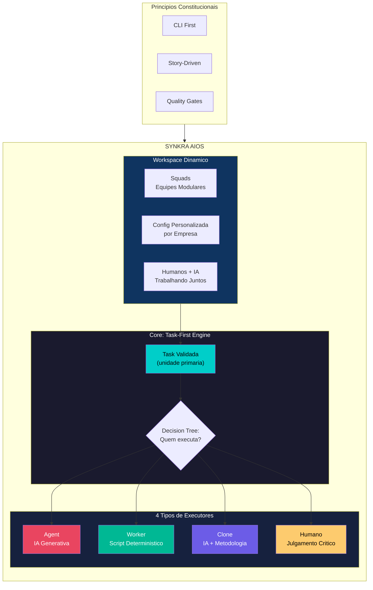

### O AIOS em uma frase

> **"Um sistema operacional para desenvolvimento onde tasks validadas sao executadas
> pelo executor ideal — seja IA, script, clone cognitivo ou humano — dentro de
> workspaces dinamicos personalizados por empresa."**

### Hierarquia de Prioridades

```
CLI First  >  Observability Second  >  UI Third
(Execucao)    (Monitoramento)          (Gestao pontual)
```

---

## 2. Task-First Philosophy

A metodologia **Task-First** do Pedro Valerio inverte o paradigma tradicional:

| Paradigma Tradicional | Task-First (AIOS) |
|-----------------------|-------------------|
| Agentes sao o centro | **Tasks** sao o centro |
| "Qual agente uso?" | "Qual task preciso executar?" |
| Agentes decidem o que fazer | Tasks definem O QUE, executores definem QUEM |
| Acoplado ao executor | Executor e **intercambiavel** |

### Principio Central

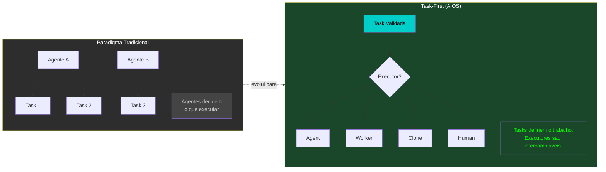

### Anatomia de uma Task

Uma task validada e **lei** — deve ser executada conforme definida,
independente de quem (ou o que) a executa:

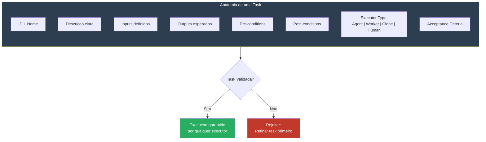

### Por que Task-First?

```
Uma task bem definida pode ser executada por:
  - Um agente de IA as 3h da manha    (Agent)
  - Um script rodando em CI/CD         (Worker)
  - Um clone do Brad Frost validando   (Clone)
  - Um humano revisando manualmente    (Human)

O resultado e o MESMO. O executor e intercambiavel.
```

---

## 3. Os 4 Executores

Cada executor tem caracteristicas unicas que o tornam ideal para certos tipos de tasks:

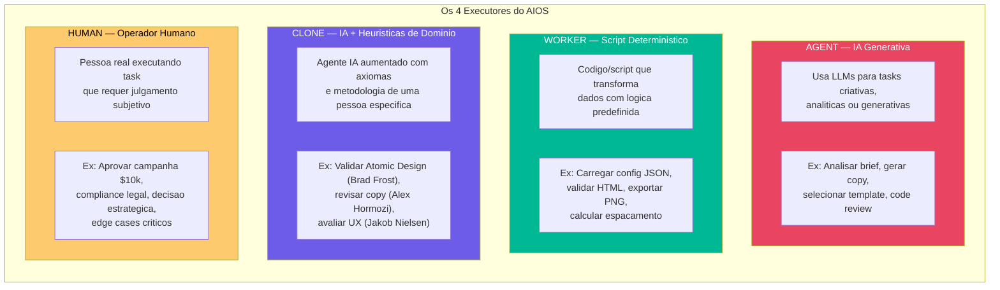

### Comparativo Rapido

| | Agent | Worker | Clone | Human |
|---|---|---|---|---|
| **Custo** | $$$$ | $ | $$$$ | $$$ |
| **Velocidade** | 3-10s | < 1s | 5-15s | min-horas |
| **Deterministico** | Nao | Sim | Parcial | Nao |
| **Criatividade** | Sim | Nao | Sim (guiada) | Sim |
| **Responsabilidade Legal** | Nao | Nao | Nao | Sim |
| **Melhor para** | Tasks criativas | Transformacoes | Validacao metodologica | Decisoes criticas |

---

## 4. Decision Tree — Qual Executor Usar?

Este e o flowchart principal que determina qual executor deve ser
atribuido a cada task no AIOS:

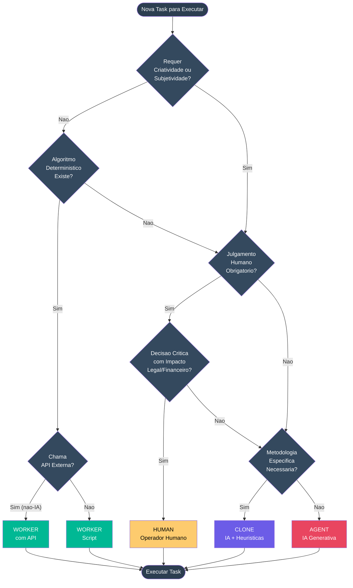

### Regras de Substituicao

Executores podem ser trocados ao longo do tempo conforme o sistema evolui:

```mermaid
flowchart LR
    subgraph SUBSTITUTION["Regras de Substituicao de Executores"]
        direction TB

        R1["Agent -> Worker<br/><i>Quando task se torna<br/>deterministica com dados</i>"]
        R2["Human -> Agent<br/><i>Quando automacao atinge<br/>precisao aceitavel</i>"]
        R3["Agent -> Clone<br/><i>Quando metodologia especifica<br/>aumenta qualidade</i>"]
        R4["Clone -> Agent<br/><i>Quando metodologia nao e<br/>critica para o resultado</i>"]
    end

    R1 -->|"Economia: 100%"| SAVE1["$$$ -> $"]
    R2 -->|"Economia: 99.8%"| SAVE2["$$$ -> $"]
    R3 -->|"Qualidade: +25%"| QUAL1["+Custo, +Qualidade"]
    R4 -->|"Economia: 67%"| SAVE3["$$$$ -> $$"]

    style R1 fill:#00b894,color:#fff
    style R2 fill:#e94560,color:#fff
    style R3 fill:#6c5ce7,color:#fff
    style R4 fill:#e94560,color:#fff
```

### Estrategias Hibridas

Na pratica, muitas tasks combinam executores para resultados otimos:

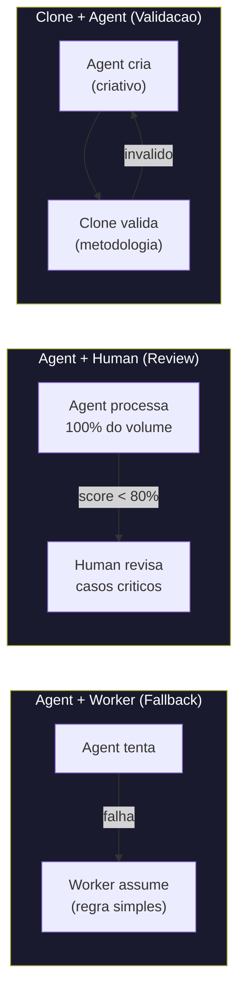

---

## 5. Workspace Dinamico

Cada empresa/equipe monta seu **workspace personalizado** com os componentes que precisa.
O AIOS e modular — voce combina squads, agentes e configuracoes como blocos de Lego.

### Arquitetura do Workspace

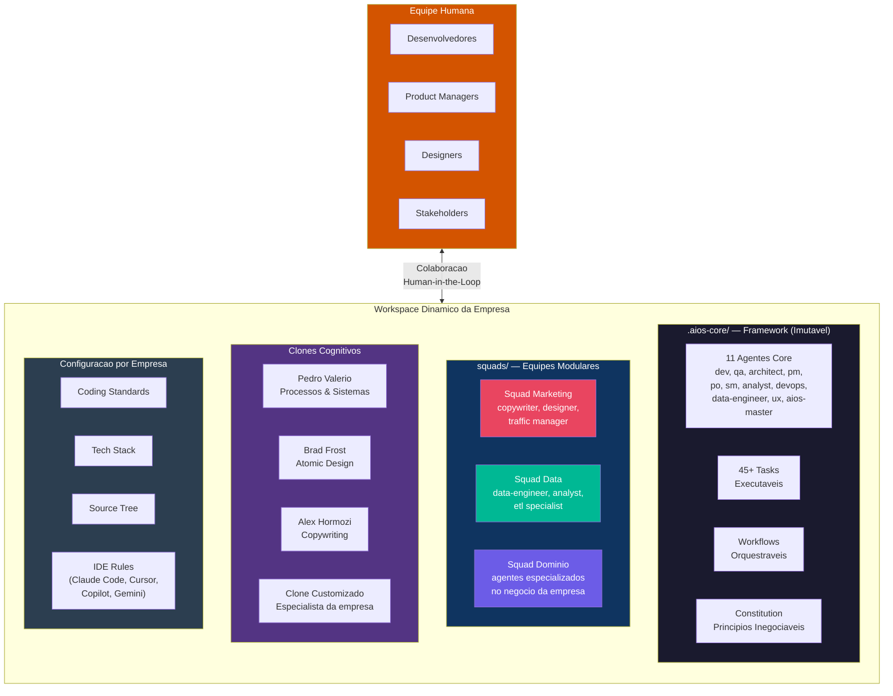

### Como uma Empresa Monta seu Workspace

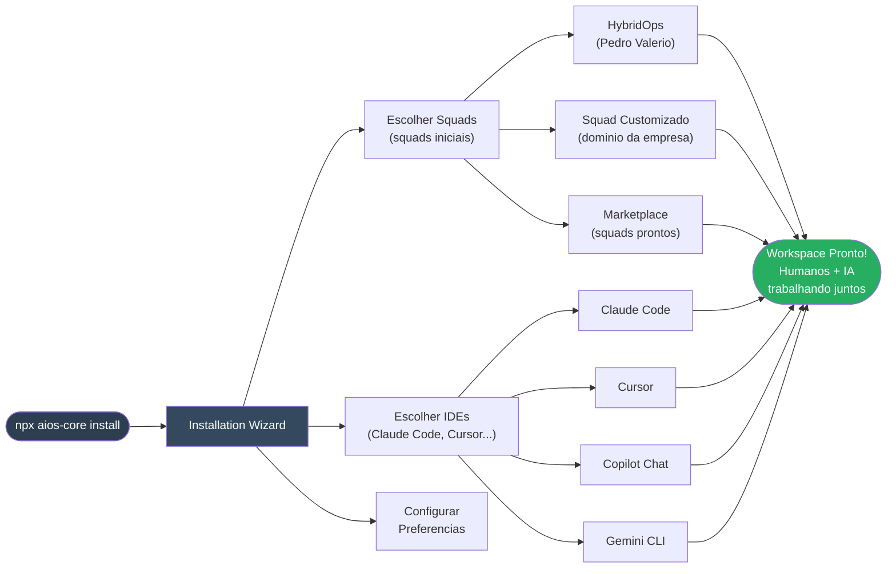

### Squads + Humanos: Colaboracao Real

O diferencial do AIOS e que squads **nao substituem** humanos — trabalham **junto**:

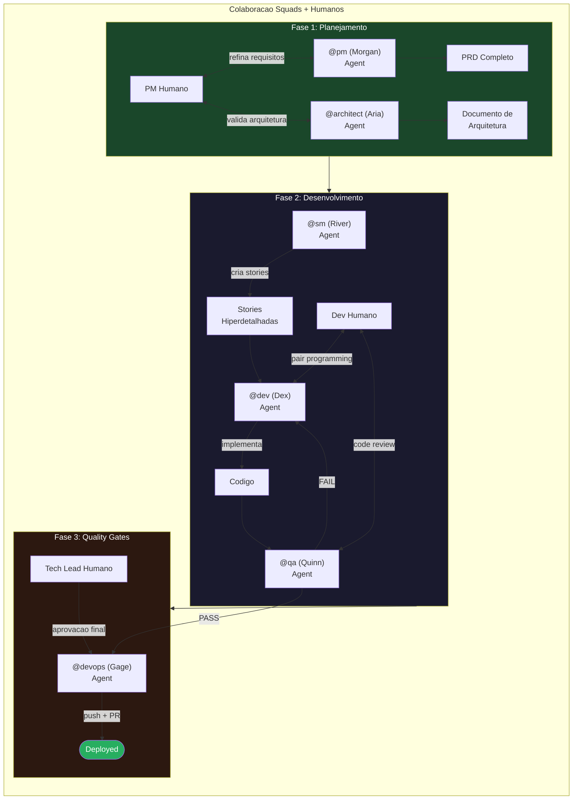

---

## 6. Fluxo Completo — Da Ideia ao Deploy

Este diagrama mostra o caminho completo de uma ideia ate o deploy,
passando por todos os agentes, gates e pontos de decisao:

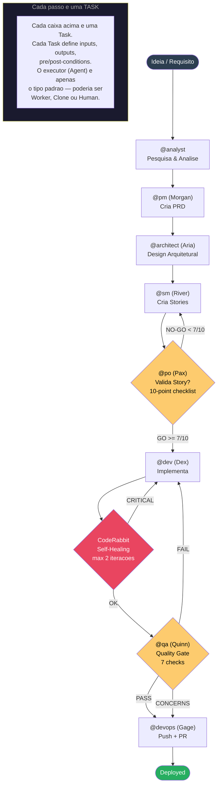

### Mapeamento Executor por Fase

| Fase | Task | Executor Padrao | Alternativa Possivel |
|------|------|-----------------|---------------------|
| Pesquisa | Analisar mercado | Agent (@analyst) | Human (pesquisador) |
| Planejamento | Criar PRD | Agent (@pm) | Human (PM real) |
| Arquitetura | Design do sistema | Agent (@architect) | Human (CTO) |
| Stories | Criar stories | Agent (@sm) | Human (SM real) |
| Validacao | Validar story | Agent (@po) | Human (PO real) |
| Implementacao | Codificar feature | Agent (@dev) | Human (dev real) |
| QA | Quality gate | Agent (@qa) | Human (QA real) |
| Deploy | Push + PR | Agent (@devops) | Human (DevOps real) |
| Linting | Verificar estilo | **Worker** (ESLint) | — |
| Type check | Verificar tipos | **Worker** (TypeScript) | — |
| Build | Compilar projeto | **Worker** (npm build) | — |
| Design review | Validar Atomic Design | **Clone** (Brad Frost) | Human (designer senior) |
| Copy review | Validar copywriting | **Clone** (Hormozi) | Human (copywriter) |
| Aprovacao legal | Compliance check | **Human** (obrigatorio) | — |
| Aprovacao financeira | Budget > $10k | **Human** (obrigatorio) | — |

---

## 7. Resumo Comparativo

### AIOS vs Abordagens Tradicionais

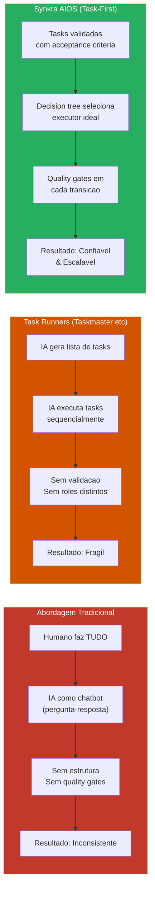

### Principios Constitucionais

O AIOS opera sob uma **Constitution formal** com principios inegociaveis:

| Artigo | Principio | Severidade | Significado |
|--------|-----------|------------|-------------|
| I | CLI First | NON-NEGOTIABLE | Tudo funciona via CLI antes de qualquer UI |
| II | Agent Authority | NON-NEGOTIABLE | Cada agente tem autoridades exclusivas |
| III | Story-Driven | MUST | Todo desenvolvimento comeca com uma story |
| IV | No Invention | MUST | Specs derivam de requisitos, nunca inventam |
| V | Quality First | MUST | Quality gates bloqueiam codigo ruim |
| VI | Absolute Imports | SHOULD | Imports absolutos sempre |

---

## Como Visualizar estes Diagramas

Os flowcharts usam **Mermaid** e podem ser renderizados em:

1. **GitHub** — Renderiza automaticamente em arquivos `.md`
2. **VS Code** — Extensao "Markdown Preview Mermaid Support"
3. **Mermaid Live Editor** — [mermaid.live](https://mermaid.live)
4. **Obsidian** — Suporte nativo a Mermaid

---

## Documentos Relacionados

| Documento | Conteudo |
|-----------|----------|
| [EXECUTOR-DECISION-TREE.md](../../.aios-core/docs/standards/EXECUTOR-DECISION-TREE.md) | Decision tree detalhado com exemplos e cost-benefit |
| [SYNAPSE-FLOWCHARTS.md](SYNAPSE/SYNAPSE-FLOWCHARTS.md) | 12 flowcharts do motor de contexto SYNAPSE |
| [Constitution](../../.aios-core/constitution.md) | Principios inegociaveis do framework |
| [User Guide](../../.aios-core/user-guide.md) | Guia completo de uso do AIOS |
| [Squads Guide](../guides/squads-guide.md) | Como criar e gerenciar squads |

---

*Synkra AIOS Visual Overview v1.0.0*
*Task-First | 4 Executores | Workspace Dinamico*
*— Aria, arquitetando o futuro*
