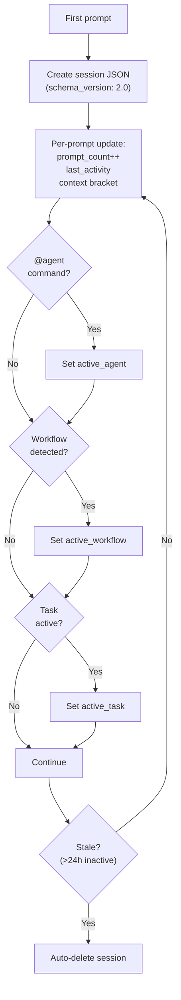
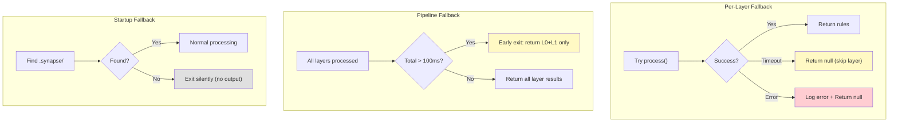

# DESIGN — SYNAPSE Engine

> Design Document tecnico para `synapse-engine.cjs`
> Motor unificado de contexto adaptativo do Synkra AIOS

**Versao:** 1.0.0
**Data:** 2026-02-10
**Status:** Draft para Implementacao
**Autor:** @architect

---

## 1. Interface Publica do synapse-engine.cjs

### 1.1 Ponto de Entrada (Hook)

```javascript
/**
 * SYNAPSE Engine — Synkra Adaptive Processing & State Engine
 *
 * Registered as UserPromptSubmit hook in .claude/settings.json
 * Reads JSON from stdin, outputs JSON to stdout
 *
 * Input:  { cwd, sessionId, prompt }
 * Output: { hookSpecificOutput: { additionalContext: "<synapse-rules>..." } }
 */

// Hook entry point — called by Claude Code on every user prompt
async function main() {
  const input = readStdin();      // { cwd, sessionId, prompt }
  const result = await process(input);
  writeStdout(result);            // { hookSpecificOutput: { additionalContext } }
}
```

### 1.2 Core API

```javascript
class SynapseEngine {
  /**
   * Process a user prompt and generate synapse-rules
   * @param {Object} input
   * @param {string} input.cwd - Working directory
   * @param {string} input.sessionId - Claude Code session ID
   * @param {string} input.prompt - User prompt text
   * @returns {Promise<string>} Formatted <synapse-rules> XML
   */
  async process(input)

  /**
   * Activate an agent (one-time, richer context)
   * @param {string} agentId - Agent identifier (dev, qa, architect, etc.)
   * @param {Object} options - Activation options
   * @returns {Promise<ActivationResult>} Greeting + enriched context
   */
  async activateAgent(agentId, options)
}
```

### 1.3 Layer Processors

```javascript
/**
 * Each layer is a processor that:
 * - Receives: { prompt, session, config, previousLayers }
 * - Returns: { rules: string[], metadata: object } | null (skip)
 * - Has: timeout budget, fallback strategy
 */

class LayerProcessor {
  /** @abstract */
  async process(context) {}

  /** Timeout in ms for this layer */
  get timeout() {}

  /** Fallback if processing fails */
  fallback(error) {}
}

// Concrete implementations:
class ConstitutionLayer extends LayerProcessor {}    // L0
class GlobalLayer extends LayerProcessor {}          // L1
class AgentScopedLayer extends LayerProcessor {}     // L2
class WorkflowLayer extends LayerProcessor {}        // L3
class TaskLayer extends LayerProcessor {}            // L4
class SquadLayer extends LayerProcessor {}           // L5
class KeywordLayer extends LayerProcessor {}         // L6
class StarCommandLayer extends LayerProcessor {}     // L7
```

### 1.4 Exported Types

```typescript
interface SynapseConfig {
  manifestPath: string;           // .synapse/manifest
  domainsDir: string;             // .synapse/
  sessionsDir: string;            // .synapse/sessions/
  maxContext: number;              // 200000 (token limit)
  staleSessionHours: number;      // 24
  devmode: boolean;               // from manifest
}

interface SessionState {
  uuid: string;
  started: string;                // ISO 8601
  cwd: string;
  label: string;
  title: string | null;
  prompt_count: number;
  last_activity: string;          // ISO 8601
  active_agent: string | null;    // e.g., "dev", "qa"
  active_workflow: string | null; // e.g., "story_development"
  active_squad: string | null;    // e.g., "etl-squad"
  active_task: string | null;     // e.g., "implement-user-auth"
  overrides: Record<string, boolean | null>;
}

interface ActivationResult {
  greeting: string;
  context: EnrichedContext;
  duration: number;               // ms
  quality: 'full' | 'partial' | 'fallback';
  metrics: LoaderMetrics;
}

type ContextBracket = 'FRESH' | 'MODERATE' | 'DEPLETED' | 'CRITICAL';

interface LayerResult {
  rules: string[];
  metadata: {
    layer: number;
    name: string;
    source: string;               // file path or "computed"
    tokens_estimate: number;
  };
}
```

---

## 2. 8-Layer Domain Hierarchy Schema

### 2.1 Layer Specification

| Layer | Nome | Tipo | Ativacao | Desativavel? | Timeout | Token Budget |
|-------|------|------|---------|-------------|---------|-------------|
| L0 | CONSTITUTION | Static | ALWAYS_ON | **Nunca** | 5ms | ~100 tokens |
| L1 | GLOBAL | Static + Dynamic | ALWAYS_ON | Via manifest | 10ms | ~200 tokens |
| L2 | AGENT-SCOPED | Dynamic | Agent ativo | Por session | 15ms | ~300 tokens |
| L3 | WORKFLOW | Dynamic | Workflow state | Por session | 15ms | ~200 tokens |
| L4 | TASK | Dynamic | Task ativa | Por session | 20ms | ~300 tokens |
| L5 | SQUAD | Dynamic | Squad ativo | Por session | 20ms | ~200 tokens |
| L6 | KEYWORD | Dynamic | Prompt keywords | Via EXCLUDE | 15ms | ~200 tokens |
| L7 | STAR-COMMAND | Explicit | `*command` no prompt | N/A | 5ms | ~200 tokens |

**Total budget maximo:** ~1700 tokens (FRESH) a ~2500 tokens (DEPLETED)

### 2.2 Layer Processing Pipeline

```mermaid
flowchart LR
    INPUT["stdin JSON"] --> INIT["Initialize"]
    INIT --> L0["L0: Constitution<br/>5ms | ~100tok"]
    L0 --> L1["L1: Global<br/>10ms | ~200tok"]
    L1 --> L2["L2: Agent<br/>15ms | ~300tok"]
    L2 --> L3["L3: Workflow<br/>15ms | ~200tok"]
    L3 --> L4["L4: Task<br/>20ms | ~300tok"]
    L4 --> L5["L5: Squad<br/>20ms | ~200tok"]
    L5 --> L6["L6: Keyword<br/>15ms | ~200tok"]
    L6 --> L7["L7: Star-Cmd<br/>5ms | ~200tok"]
    L7 --> BRACKET["Bracket Filter"]
    BRACKET --> FORMAT["Format XML"]
    FORMAT --> OUTPUT["stdout JSON"]

    style L0 fill:#ffcdd2
    style L7 fill:#fce4ec
    style OUTPUT fill:#c8e6c9
```



### 2.3 Bracket-Aware Token Budget

| Bracket | Context % | Injection Strategy | Max Tokens |
|---------|----------|-------------------|------------|
| FRESH | 60-100% | Lean — only L0, L1, active L2/L7 | ~800 |
| MODERATE | 40-60% | Standard — all active layers | ~1500 |
| DEPLETED | 25-40% | Reinforcement — full injection + memory hints | ~2000 |
| CRITICAL | <25% | Warning — DEPLETED + handoff prep | ~2500 |

**Logica de corte por bracket:**

```javascript
function filterByBracket(layers, bracket) {
  switch (bracket) {
    case 'FRESH':
      // Only L0, L1, active L2, L7 (if explicit command)
      return layers.filter(l =>
        l.layer <= 1 || l.layer === 2 || l.layer === 7
      );
    case 'MODERATE':
      // All active layers
      return layers;
    case 'DEPLETED':
      // All layers + memory reinforcement hints
      return [...layers, memoryHints()];
    case 'CRITICAL':
      // DEPLETED + explicit context warning
      return [...layers, memoryHints(), contextWarning()];
  }
}
```

---

## 3. `.synapse/` Directory Structure Specification

```
.synapse/
├── manifest                    # Central domain registry (KEY=VALUE)
├── global                      # Layer 1: Universal rules (ALWAYS_ON)
├── context                     # Layer 1: Context bracket rules
├── commands                    # Layer 7: Star-command definitions
├── constitution                # Layer 0: 6 articles (auto-generated from constitution.md)
├── agent-dev                   # Layer 2: @dev domain + authority boundaries
├── agent-qa                    # Layer 2: @qa domain + authority boundaries
├── agent-architect             # Layer 2: @architect domain + authority boundaries
├── agent-pm                    # Layer 2: @pm domain
├── agent-po                    # Layer 2: @po domain
├── agent-sm                    # Layer 2: @sm domain
├── agent-devops                # Layer 2: @devops domain (EXCLUSIVE authorities)
├── agent-analyst               # Layer 2: @analyst domain
├── agent-data-engineer         # Layer 2: @data-engineer domain
├── agent-ux                    # Layer 2: @ux-design-expert domain
├── agent-aios-master           # Layer 2: @aios-master domain
├── agent-squad-creator         # Layer 2: @squad-creator domain
├── workflow-story-dev          # Layer 3: Story development workflow rules
├── workflow-epic-create        # Layer 3: Epic creation workflow rules
├── workflow-arch-review        # Layer 3: Architecture review workflow rules
├── {custom-domain}             # Layer 6: User-defined keyword domains
├── sessions/                   # Unified session store
│   ├── {uuid}.json             # Per-session state
│   └── ...
└── cache/                      # Optional performance cache
    ├── squad-manifests.json    # Cached squad domain discovery
    └── keyword-index.json      # Pre-computed keyword → domain mapping
```

### Manifest Format

```ini
# ==========================================
# SYNAPSE Manifest — Domain Registry
# ==========================================

# Debug mode (append debug section to every response)
DEVMODE=false

# Layer 1: Global (ALWAYS_ON)
GLOBAL_STATE=active
GLOBAL_ALWAYS_ON=true

# Layer 1: Context brackets (ALWAYS_ON)
CONTEXT_STATE=active
CONTEXT_ALWAYS_ON=true

# Layer 7: Star-commands
COMMANDS_STATE=active

# Layer 0: Constitution (NON-NEGOTIABLE, cannot be overridden)
CONSTITUTION_STATE=active
CONSTITUTION_ALWAYS_ON=true
CONSTITUTION_NON_NEGOTIABLE=true

# Layer 2: Agent-scoped domains (auto-activated by active agent)
AGENT_DEV_STATE=active
AGENT_DEV_AGENT_TRIGGER=dev
AGENT_QA_STATE=active
AGENT_QA_AGENT_TRIGGER=qa
AGENT_ARCHITECT_STATE=active
AGENT_ARCHITECT_AGENT_TRIGGER=architect
AGENT_PM_STATE=active
AGENT_PM_AGENT_TRIGGER=pm
AGENT_PO_STATE=active
AGENT_PO_AGENT_TRIGGER=po
AGENT_SM_STATE=active
AGENT_SM_AGENT_TRIGGER=sm
AGENT_DEVOPS_STATE=active
AGENT_DEVOPS_AGENT_TRIGGER=devops
AGENT_ANALYST_STATE=active
AGENT_ANALYST_AGENT_TRIGGER=analyst
AGENT_DATA_ENGINEER_STATE=active
AGENT_DATA_ENGINEER_AGENT_TRIGGER=data-engineer
AGENT_UX_STATE=active
AGENT_UX_AGENT_TRIGGER=ux-design-expert
AGENT_AIOS_MASTER_STATE=active
AGENT_AIOS_MASTER_AGENT_TRIGGER=aios-master
AGENT_SQUAD_CREATOR_STATE=active
AGENT_SQUAD_CREATOR_AGENT_TRIGGER=squad-creator

# Layer 3: Workflow domains (state-driven)
WORKFLOW_STORY_DEV_STATE=active
WORKFLOW_STORY_DEV_WORKFLOW_TRIGGER=story_development
WORKFLOW_EPIC_CREATE_STATE=active
WORKFLOW_EPIC_CREATE_WORKFLOW_TRIGGER=epic_creation
WORKFLOW_ARCH_REVIEW_STATE=active
WORKFLOW_ARCH_REVIEW_WORKFLOW_TRIGGER=architecture_review

# Layer 6: Custom keyword domains (example)
# MYDOMAIN_STATE=active
# MYDOMAIN_RECALL=keyword1,keyword2,keyword3
# MYDOMAIN_EXCLUDE=skip,ignore

# Global exclusion (disables ALL domain matching when found in prompt)
# GLOBAL_EXCLUDE=skip,ignore
```

---

## 4. Unified Session Store Schema

### Session JSON (`sessions/{uuid}.json`)

```json
{
  "uuid": "abc123-def456-...",
  "schema_version": "2.0",
  "started": "2026-02-10T15:30:00.000Z",
  "last_activity": "2026-02-10T16:00:00.000Z",
  "cwd": "C:\\Users\\AllFluence-User\\Workspaces\\AIOS\\project",
  "label": "project",
  "title": "Implement user authentication",
  "prompt_count": 12,

  "active_agent": {
    "id": "dev",
    "activated_at": "2026-02-10T15:32:00.000Z",
    "activation_quality": "full"
  },

  "active_workflow": {
    "id": "story_development",
    "instance_id": "wf-abc123",
    "current_step": 2,
    "current_phase": "development",
    "started_at": "2026-02-10T15:30:00.000Z"
  },

  "active_squad": {
    "name": "etl-squad",
    "path": "squads/etl-squad",
    "domains_loaded": ["ETL_PIPELINE", "ETL_DATA"]
  },

  "active_task": {
    "id": "implement-user-auth",
    "story": "STORY-42",
    "executor_type": "Agente",
    "started_at": "2026-02-10T15:35:00.000Z"
  },

  "context": {
    "last_bracket": "FRESH",
    "last_tokens_used": 45000,
    "last_context_percent": 77.5
  },

  "overrides": {
    "DEVMODE": null,
    "GLOBAL_STATE": null,
    "CONTEXT_STATE": null,
    "COMMANDS_STATE": null,
    "AGENT_DEV_STATE": null
  },

  "history": {
    "star_commands_used": ["*dev", "*brief"],
    "domains_loaded_last": ["GLOBAL", "CONTEXT", "AGENT_DEV"],
    "agents_activated": ["dev"]
  }
}
```

### Session Lifecycle



---

## 5. Hook Registration

### settings.json

```json
{
  "hooks": {
    "UserPromptSubmit": [
      {
        "type": "command",
        "command": "node \"C:/Users/AllFluence-User/Workspaces/AIOS/SYNAPSE/.claude/hooks/synapse-engine.cjs\""
      }
    ]
  }
}
```

### CLAUDE.md Integration

```markdown
<!-- SYNAPSE-MANAGED: Do not remove this section -->
## SYNAPSE Integration

Follow all rules in <synapse-rules> blocks from system-reminders.
These are dynamically injected based on context and MUST be obeyed.
<!-- END SYNAPSE-MANAGED -->
```

---

## 6. Agent-Scoped Domain Auto-Activation Protocol

### Detection

```javascript
function detectActiveAgent(session) {
  // Priority:
  // 1. Explicit from session state (set by activation)
  // 2. Detected from prompt (@agent pattern)
  // 3. null (no agent active)

  if (session.active_agent?.id) {
    return session.active_agent.id;
  }

  const agentMatch = prompt.match(/@([a-z-]+)/);
  if (agentMatch) {
    return agentMatch[1];
  }

  return null;
}
```

### Domain Loading

```javascript
async function loadAgentDomain(agentId, manifest) {
  // 1. Find domain with matching AGENT_TRIGGER
  const domainKey = Object.keys(manifest)
    .find(k => manifest[k].agent_trigger === agentId);

  if (!domainKey) return null;

  // 2. Load domain file (.synapse/agent-{id})
  const rules = parseDomainFile(`.synapse/agent-${agentId}`);

  // 3. Authority boundaries are ALWAYS included
  const authRules = rules.filter(r => r.key.includes('AUTH'));

  return {
    rules: rules,
    authority: authRules,
    metadata: { layer: 2, source: `agent-${agentId}` }
  };
}
```

---

## 7. Squad Domain Discovery & Namespace Protocol

### Discovery Algorithm

```javascript
async function discoverSquadDomains(cwd) {
  const squadsDir = path.join(cwd, 'squads');

  // 1. Check cache first (TTL: 60s)
  const cached = loadCache('squad-manifests');
  if (cached && !isStale(cached, 60000)) {
    return cached.domains;
  }

  // 2. Scan squads directory
  const squads = await readdir(squadsDir);
  const results = [];

  for (const squadName of squads) {
    const synapsePath = path.join(squadsDir, squadName, '.synapse');

    // 3. Check if squad has .synapse/
    if (!existsSync(path.join(synapsePath, 'manifest'))) continue;

    // 4. Parse squad manifest
    const manifest = parseManifest(path.join(synapsePath, 'manifest'));

    // 5. Namespace all domains
    for (const [key, value] of Object.entries(manifest)) {
      const namespacedKey = `${squadName.toUpperCase()}_${key}`;
      results.push({ key: namespacedKey, value, squad: squadName });
    }
  }

  // 6. Cache results
  saveCache('squad-manifests', { domains: results, timestamp: Date.now() });

  return results;
}
```

### Merge Rules

```javascript
function mergeSquadDomains(globalManifest, squadDomains, extendsMode) {
  switch (extendsMode) {
    case 'extend':
      // Squad domains ADD to global (no overwrite)
      return { ...globalManifest, ...squadDomains };

    case 'override':
      // Squad domains REPLACE global for overlapping keys
      for (const [key, value] of Object.entries(squadDomains)) {
        globalManifest[key] = value;
      }
      return globalManifest;

    case 'none':
      // Squad domains are independent (separate namespace prevents collision)
      return { ...globalManifest, ...squadDomains };

    default:
      return { ...globalManifest, ...squadDomains };
  }
}
```

---

## 8. Workflow-to-Domain Mapping Table

| Workflow ID | Trigger | Phases → Domains |
|-------------|---------|------------------|
| `story_development` | `*develop`, `*develop-yolo` | validated→STORIES, in_development→DEV, qa_review→QA, push_ready→DEVOPS |
| `epic_creation` | `*create-epic` | planning→STORIES, breakdown→PROCESS, tech_review→ARCHITECTURE |
| `architecture_review` | `*arch-review` | impact_analysis→ARCHITECTURE, qa_review→QA, implementation→DEV |
| `git_workflow` | `*push`, `*pre-push` | staged→DEV, quality_gate→QA, push→DEVOPS |
| `database_development` | `*create-schema` | schema_design→DATA, migration→DEV, smoke_test→QA |
| `code_quality` | `*quality-improve` | assessment→QA, refactoring→DEV, verification→QA |
| `documentation` | `*document` | research→RESEARCH, creation→ARCHITECTURE, sync→STORIES |
| `ux_design` | `*design-ux` | wireframes→UX, implementation→DEV, validation→QA |
| `brainstorming` | `*brainstorm` | research→RESEARCH, facilitation→RESEARCH, documentation→ARCHITECTURE |
| `qa_loop` | `*review-qa`, `*gate` | review→QA, fixes→DEV (max 5 iterations) |
| `bob_orchestration` | `*bob-execute` | assign→PRODUCT, execute→*, quality→QA, push→DEVOPS |
| `cross_agent_handoff` | Agent switch | dev_complete→DEV, qa_issues→QA, fixes→DEV, push→DEVOPS |

### State File Reading

```javascript
async function detectWorkflowDomain(session) {
  if (!session.active_workflow) return null;

  const { id, current_phase } = session.active_workflow;
  const mapping = WORKFLOW_DOMAIN_MAP[id];

  if (!mapping) return null;

  const domain = mapping[current_phase];
  if (!domain) return null;

  return {
    rules: await loadDomainFile(`.synapse/workflow-${id}`),
    metadata: {
      layer: 3,
      workflow: id,
      phase: current_phase,
      domain: domain
    }
  };
}
```

---

## 9. Task Context Injection Format

### Task Detection

```javascript
async function detectActiveTask(session, cwd) {
  if (!session.active_task) return null;

  const { id, story, executor_type } = session.active_task;

  // Read task file if available
  const taskPath = findTaskFile(cwd, id);
  if (!taskPath) return { id, story, executor_type, rules: [] };

  // Extract relevant context
  const task = parseTaskFile(taskPath);

  return {
    id,
    story,
    executor_type,
    pre_conditions: task.checklist?.pre_conditions || [],
    post_conditions: task.checklist?.post_conditions || [],
    acceptance_criteria: task.checklist?.acceptance_criteria || [],
    file_list: task.template?.files || [],
    rules: formatTaskRules(task)
  };
}
```

### Injection Template

```
[TASK CONTEXT]
Active Task: {task.id}
Story: {task.story}
Executor: @{agent} ({executor_type})

Pre-conditions:
  {for each pre_condition: [x/] condition text}

Acceptance Criteria:
  {for each criterion: - [ ] criterion text}

File Scope:
  {for each file: - path (new|modify|delete)}
```

---

## 10. Constitution Enforcement Rules

### Layer 0 Domain File (`.synapse/constitution`)

```ini
# ==========================================
# SYNAPSE Layer 0: CONSTITUTION
# NON-NEGOTIABLE — Cannot be overridden
# Source: .aios-core/constitution.md
# ==========================================

CONSTITUTION_RULE_ART1_0=CLI First (NON-NEGOTIABLE): All functionality MUST work 100% via CLI before any UI
CONSTITUTION_RULE_ART1_1=Dashboards are observational only — never control or decide
CONSTITUTION_RULE_ART1_2=Priority hierarchy: CLI (Maximum) > Observability (Secondary) > UI (Tertiary)

CONSTITUTION_RULE_ART2_0=Agent Authority (NON-NEGOTIABLE): Each agent has exclusive authorities that cannot be assumed by others
CONSTITUTION_RULE_ART2_1=Only @devops can execute git push, create PRs, manage releases
CONSTITUTION_RULE_ART2_2=Agents MUST delegate when outside their scope — no authority assumption

CONSTITUTION_RULE_ART3_0=Story-Driven (MUST): No code without an associated story
CONSTITUTION_RULE_ART3_1=Acceptance criteria must be clear before implementation begins
CONSTITUTION_RULE_ART3_2=Progress tracked via story checkboxes and File List

CONSTITUTION_RULE_ART4_0=No Invention (MUST): Every spec statement must trace to requirements (FR-*, NFR-*, CON-*)
CONSTITUTION_RULE_ART4_1=Do NOT add features not in requirements or assume untested implementations

CONSTITUTION_RULE_ART5_0=Quality First (MUST): lint, typecheck, test, build MUST all pass
CONSTITUTION_RULE_ART5_1=CodeRabbit reports must have no CRITICAL issues before push

CONSTITUTION_RULE_ART6_0=Absolute Imports (SHOULD): Always use @/ alias imports — avoid relative ../../../
```

---

## 11. Performance Targets

### Per-Layer Budget

| Layer | Target | Hard Limit | Fallback |
|-------|--------|------------|----------|
| L0: Constitution | 2ms | 5ms | Static cache (never fails) |
| L1: Global | 5ms | 10ms | Cached rules (never fails) |
| L2: Agent-Scoped | 10ms | 15ms | Skip (no agent domain) |
| L3: Workflow | 10ms | 15ms | Skip (no workflow domain) |
| L4: Task | 15ms | 20ms | Skip (no task context) |
| L5: Squad | 15ms | 20ms | Skip (no squad domains) |
| L6: Keyword | 10ms | 15ms | Skip (no keyword matches) |
| L7: Star-Command | 2ms | 5ms | Skip (no star commands) |
| **Total Pipeline** | **<70ms** | **<100ms** | Fallback with L0+L1 only |

### Agent Activation Budget

| Phase | Target | Hard Limit |
|-------|--------|------------|
| Tier 1: AgentConfigLoader | 50ms | 80ms |
| Tier 2: Permission + Git (parallel) | 80ms | 120ms |
| Tier 3: Session + Project (parallel) | 120ms | 180ms |
| Memory Loader (optional) | 300ms | 500ms |
| Greeting Builder | 100ms | 150ms |
| **Total Activation** | **<350ms** | **<500ms** |

### Token Budget

| Bracket | Max Injection | Estimated % of Context |
|---------|-------------|----------------------|
| FRESH | 800 tokens | 0.4% of 200K |
| MODERATE | 1500 tokens | 0.75% |
| DEPLETED | 2000 tokens | 1.0% |
| CRITICAL | 2500 tokens | 1.25% |

---

## 12. Fallback Strategy at Every Layer



### Fallback Hierarchy

1. **Layer-level:** Timeout/error → skip layer, continue pipeline
2. **Pipeline-level:** Total >100ms → return L0+L1 only
3. **Startup-level:** No `.synapse/` → exit silently (zero output)
4. **Agent activation:** Pipeline timeout → fallback greeting with `*help` hint
5. **Session-level:** Corrupt session → recreate from scratch
6. **Manifest-level:** Parse error → use defaults (GLOBAL + CONTEXT active)

---

## 13. DEVMODE + Pipeline Metrics Unificados

### DEVMODE Output (appended to every Claude response when enabled)

```markdown
---
SYNAPSE DEVMODE

Bracket: [FRESH] (77.5% remaining, 45K/200K tokens)

Layers Loaded:
  [L0] CONSTITUTION: 12 rules (2ms)
  [L1] GLOBAL: 8 rules (3ms) + CONTEXT[FRESH]: 5 rules
  [L2] AGENT_DEV: 8 rules + 3 auth boundaries (5ms)
  [L7] *brief: 4 rules (1ms)

Layers Skipped:
  [L3] WORKFLOW: No active workflow
  [L4] TASK: No active task
  [L5] SQUAD: No active squad
  [L6] KEYWORD: No matches (prompt: "fix the login bug")

Keyword Matches:
  "fix" matched DEV domain (via agent, already loaded)
  "bug" matched DEV domain (via agent, already loaded)

Session:
  UUID: abc123...
  Agent: @dev (activated 28min ago)
  Prompts: 12 | Last bracket: FRESH

Pipeline Metrics:
  Total: 11ms | Layers: 4/8 | Rules: 37
  Token estimate: ~450 tokens (0.22% of context)

Available Domains (not loaded):
  QA (test, review, quality, gate)
  ARCHITECTURE (architecture, design, adr)
  PRODUCT (prd, epic, roadmap)
---
```

### Metrics Collection

```javascript
class PipelineMetrics {
  constructor() {
    this.layers = {};
    this.totalStart = null;
    this.totalEnd = null;
  }

  startLayer(name) {
    this.layers[name] = { start: performance.now(), status: 'running' };
  }

  endLayer(name, rulesCount) {
    const layer = this.layers[name];
    layer.end = performance.now();
    layer.duration = layer.end - layer.start;
    layer.status = 'ok';
    layer.rules = rulesCount;
  }

  skipLayer(name, reason) {
    this.layers[name] = { status: 'skipped', reason };
  }

  errorLayer(name, error) {
    const layer = this.layers[name];
    if (layer) {
      layer.end = performance.now();
      layer.duration = layer.end - layer.start;
    }
    this.layers[name] = { ...layer, status: 'error', error: error.message };
  }

  getSummary() {
    return {
      total_ms: this.totalEnd - this.totalStart,
      layers_loaded: Object.values(this.layers).filter(l => l.status === 'ok').length,
      layers_skipped: Object.values(this.layers).filter(l => l.status === 'skipped').length,
      layers_errored: Object.values(this.layers).filter(l => l.status === 'error').length,
      total_rules: Object.values(this.layers).reduce((sum, l) => sum + (l.rules || 0), 0),
      per_layer: this.layers
    };
  }
}
```

---

## 14. `<synapse-rules>` XML Format Specification

### Complete Format

```xml
<synapse-rules>

[CONTEXT BRACKET]
CONTEXT BRACKET: [{bracket}] ({percent}% remaining)
[{bracket}] CONTEXT RULES:
  1. {context_rule_0}
  2. {context_rule_1}
  ...

[CONSTITUTION] (NON-NEGOTIABLE)
  ART.I: CLI First — All functionality MUST work 100% via CLI before any UI
  ART.II: Agent Authority — Each agent has exclusive authorities
  ART.III: Story-Driven — No code without associated story
  ART.IV: No Invention — Specs trace to requirements only
  ART.V: Quality First — lint, typecheck, test, build MUST pass
  ART.VI: Absolute Imports — Use @/ alias, avoid relative paths

[ACTIVE AGENT: @{agent_id}]
  DOMAIN: {AGENT_DOMAIN}
  AUTHORITY BOUNDARIES:
    - {auth_rule_0}
    - {auth_rule_1}
  RULES:
    0. {rule_0}
    1. {rule_1}
    ...

[ACTIVE WORKFLOW: {workflow_id}]
  PHASE: {current_phase}
  RULES:
    0. {workflow_rule_0}
    ...

[TASK CONTEXT]
  Active Task: {task_id}
  Story: {story_id}
  Executor: @{agent} ({executor_type})
  Pre-conditions: ...
  Acceptance Criteria: ...

[SQUAD: {squad_name}]
  DOMAINS: {squad_domain_1}, {squad_domain_2}
  RULES:
    0. {squad_rule_0}
    ...

[STAR-COMMANDS]
============================================================
[*{command}] COMMAND:
  0. {command_rule_0}
  1. {command_rule_1}
  ...
============================================================

[DEVMODE STATUS]
  {DEVMODE=true: instructions to append debug section}
  {DEVMODE=false: no debug output}

[LOADED DOMAINS SUMMARY]
  LOADED DOMAINS:
    [{DOMAIN}] {activation_reason} ({N} rules)
    ...

  AVAILABLE (not loaded):
    {DOMAIN} ({recall_keywords})
    ...

</synapse-rules>
```

### Section Ordering Rules

1. CONTEXT BRACKET — always first (informs injection strategy)
2. CONSTITUTION — always second (NON-NEGOTIABLE)
3. AGENT — before workflow (agent identity drives workflow behavior)
4. WORKFLOW — before task (workflow provides phase context)
5. TASK — after workflow (task is within workflow phase)
6. SQUAD — after task (squad domains are supplementary)
7. KEYWORD-matched domains — after squad
8. STAR-COMMANDS — near end (explicit user override)
9. DEVMODE STATUS — always explicit
10. SUMMARY — always last (overview)

---

## 15. Star-Command `*synapse` Reference

### Available Commands

| Command | Purpose | Layer |
|---------|---------|-------|
| `*synapse` | Help — show all available commands and status | L7 |
| `*synapse debug` | Toggle DEVMODE for current session | L7 |
| `*synapse status` | Show loaded domains, active agent, workflow, bracket | L7 |
| `*synapse domains` | List all available domains with keywords | L7 |
| `*synapse session` | Show current session info and overrides | L7 |
| `*synapse reload` | Force reload manifest and clear caches | L7 |
| `*brief` | Bullet points only, max 5 items | L7 |
| `*dev` | Code over explanation, minimal changes | L7 |
| `*review` | Security, performance, edge cases focus | L7 |
| `*plan` | Explore, identify deps, plan before code | L7 |
| `*discuss` | Multiple approaches, pros/cons | L7 |
| `*debug` | Gather context, hypothesis, root cause | L7 |
| `*explain` | High-level first, examples, incremental | L7 |

### `*synapse` Help Output

```
SYNAPSE — Synkra Adaptive Processing & State Engine

Commands:
  *synapse          Show this help
  *synapse debug    Toggle DEVMODE (currently: {on|off})
  *synapse status   Show engine status
  *synapse domains  List all domains
  *synapse session  Show session info
  *synapse reload   Force reload

Mode Commands:
  *brief    Bullet points only
  *dev      Code-focused mode
  *review   Review mode (security, performance)
  *plan     Planning mode
  *discuss  Discussion mode
  *debug    Debugging mode
  *explain  Explanation mode

Current Status:
  Bracket: [{bracket}] ({percent}%)
  Agent: @{agent} | Workflow: {workflow} | Squad: {squad}
  Domains: {N} loaded / {M} available
  Session: {uuid} ({prompt_count} prompts)
```

---

## 16. Migration Notes

### Feature Parity Checklist (carl-hook.py → synapse-engine.cjs)

| Feature | carl-hook.py | synapse-engine.cjs | Status |
|---------|-------------|-------------------|--------|
| stdin/stdout JSON | ✅ | Required | Pending |
| Manifest parsing | ✅ | Required | Pending |
| Session management | ✅ | Required (enhanced) | Pending |
| Context bracket calculation | ✅ | Required | Pending |
| Star-command detection | ✅ | Required | Pending |
| Keyword matching | ✅ | Required | Pending |
| Exclusion system | ✅ | Required | Pending |
| Domain rule parsing | ✅ | Required | Pending |
| XML output formatting | ✅ | Required (enhanced) | Pending |
| DEVMODE | ✅ | Required (enhanced) | Pending |
| Auto-title generation | ✅ | Required | Pending |
| Stale session cleanup | ✅ | Required | Pending |
| Directory walking (.carl/ discovery) | ✅ | Required (.synapse/) | Pending |
| Session JSONL token reading | ✅ | Required | Pending |

### New Features (not in carl-hook.py)

| Feature | Priority | Complexity |
|---------|----------|-----------|
| L0: Constitution enforcement | High | Low |
| L2: Agent-scoped domains | High | Medium |
| L3: Workflow domain activation | Medium | Medium |
| L4: Task context injection | Medium | Medium |
| L5: Squad domain discovery | Medium | High |
| Enhanced session store | High | Medium |
| Pipeline metrics | Low | Low |
| Squad manifest caching | Low | Low |

---

*DESIGN Document v1.0.0 — SYNAPSE Engine*
*Synkra Adaptive Processing & State Engine*
*CLI First | Task-First | Constitution*
