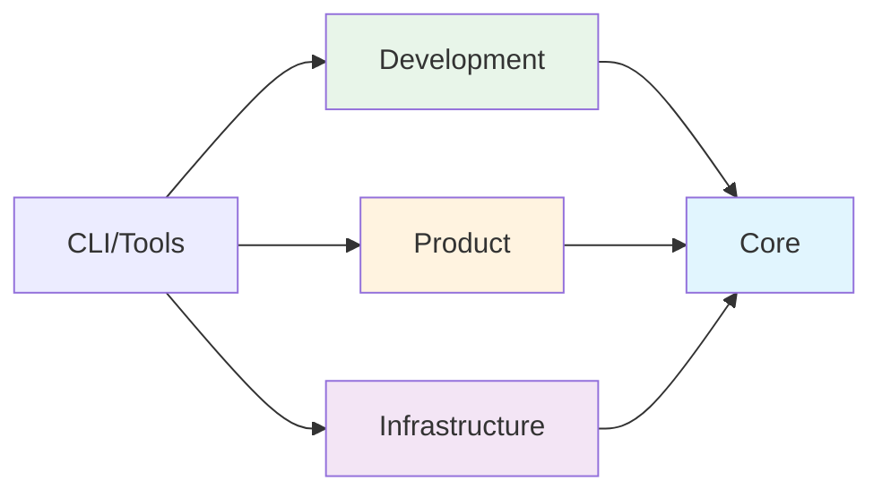

<!-- Traducción: ES | Original: /docs/en/architecture/module-system.md | Sincronización: 2026-01-26 -->

# Arquitectura del Sistema de Módulos AIOS

> 🌐 [EN](../../architecture/module-system.md) | [PT](../../pt/architecture/module-system.md) | **ES**

---

> Guía completa de la arquitectura modular v4.2 para Synkra AIOS.

**Versión:** 2.1.0
**Última Actualización:** 2025-12-01

---

## Visión General

### ¿Por qué Arquitectura Modular?

La arquitectura modular v4.2 aborda varios desafíos de la estructura plana v2.0:

| Desafío             | Problema v2.0                          | Solución v4.2                            |
| ------------------- | -------------------------------------- | ---------------------------------------- |
| **Descubribilidad** | 200+ archivos en directorios mezclados | Organizado por responsabilidad           |
| **Mantenimiento**   | Propiedad poco clara                   | Los límites de módulos definen propiedad |
| **Dependencias**    | Implícitas, circulares                 | Explícitas, unidireccionales             |
| **Escalabilidad**   | Todos los archivos cargados siempre    | Carga lazy por módulo                    |
| **Testing**         | Solo tests de sistema completo         | Aislamiento a nivel de módulo            |

### Principios de Diseño

1. **Responsabilidad Única** - Cada módulo tiene un propósito claro
2. **Dependencias Explícitas** - Los módulos declaran lo que necesitan
3. **Acoplamiento Débil** - Los cambios en un módulo no se propagan en cascada
4. **Alta Cohesión** - La funcionalidad relacionada permanece junta
5. **Carga Lazy** - Cargar solo lo necesario

---

## Estructura de Módulos

Synkra AIOS organiza el directorio `.aios-core/` en cuatro módulos principales:

```
.aios-core/
 ├── core/              # Fundamentos del framework
 ├── development/       # Artefactos de desarrollo
 ├── product/           # Plantillas orientadas al usuario
 └── infrastructure/    # Configuración del sistema
```

### Diagrama de Módulos

```mermaid
graph TB
    subgraph "Framework AIOS v4"
        CLI[CLI / Herramientas]

        subgraph "Módulo Product"
            Templates[Plantillas]
            Checklists[Checklists]
            Data[PM Data]
        end

        subgraph "Módulo Development"
            Agents[Agentes]
            Tasks[Tareas]
            Workflows[Workflows]
            Scripts[Dev Scripts]
        end

        subgraph "Módulo Core"
            Registry[Service Registry]
            Config[Sistema Config]
            Elicit[Elicitation]
            Session[Gestión Sesión]
            QG[Quality Gates]
            MCP[Sistema MCP]
        end

        subgraph "Módulo Infrastructure"
            InfraScripts[Scripts Infraestructura]
            Tools[Configs Herramientas]
            PM[PM Adapters]
        end
    end

    CLI --> Agents
    CLI --> Registry
    Agents --> Tasks
    Agents --> Templates
    Tasks --> Workflows
    Development --> Core
    Product --> Core
    Infrastructure --> Core

    style Core fill:#e1f5fe
    style Development fill:#e8f5e9
    style Product fill:#fff3e0
    style Infrastructure fill:#f3e5f5
```



---

## Módulo Core

**Ruta:** `.aios-core/core/`
**Propósito:** Fundamentos del framework - configuración, sesión, elicitation y componentes esenciales de runtime.

### Contenidos

| Directorio       | Contenidos                                       | Descripción                            |
| ---------------- | ------------------------------------------------ | -------------------------------------- |
| `config/`        | `config-cache.js`, `config-loader.js`            | Gestión de configuración con caché TTL |
| `data/`          | `aios-kb.md`, `workflow-patterns.yaml`           | Base de conocimiento del framework     |
| `docs/`          | Documentación interna                            | Guías de componentes, troubleshooting  |
| `elicitation/`   | `elicitation-engine.js`, `session-manager.js`    | Sistema de prompting interactivo       |
| `session/`       | `context-detector.js`, `context-loader.js`       | Gestión de contexto de sesión          |
| `utils/`         | `output-formatter.js`, `yaml-validator.js`       | Utilidades comunes                     |
| `registry/`      | `service-registry.json`, `registry-loader.js`    | Sistema de service discovery           |
| `quality-gates/` | `quality-gate-manager.js`, layer configs         | Sistema de quality gate de 3 capas     |
| `mcp/`           | `global-config-manager.js`, `os-detector.js`     | Configuración global MCP               |
| `manifest/`      | `manifest-generator.js`, `manifest-validator.js` | Sistema de manifiesto de proyecto      |
| `migration/`     | `migration-config.yaml`, `module-mapping.yaml`   | Configuración de migración             |

### APIs Clave

```javascript
// Configuración
const { loadAgentConfig, globalConfigCache } = require('./.aios-core/core');

// Sesión
const { ContextDetector, SessionContextLoader } = require('./.aios-core/core');

// Elicitation
const { ElicitationEngine, ElicitationSessionManager } = require('./.aios-core/core');

// Registry
const { getRegistry, loadRegistry } = require('./.aios-core/core/registry/registry-loader');

// Quality Gates
const QualityGateManager = require('./.aios-core/core/quality-gates/quality-gate-manager');
```

### Dependencias

- **Externas:** `js-yaml`, `fs-extra`
- **Internas:** Ninguna (módulo de fundación)

---

## Módulo Development

**Ruta:** `.aios-core/development/`
**Propósito:** Assets relacionados con agentes - definiciones de agentes, tareas, workflows y scripts de desarrollo.

### Contenidos

| Directorio     | Contenidos                  | Descripción                             |
| -------------- | --------------------------- | --------------------------------------- |
| `agents/`      | 11 definiciones de agentes  | `dev.md`, `qa.md`, `architect.md`, etc. |
| `agent-teams/` | 5 configuraciones de equipo | Grupos de agentes predefinidos          |
| `tasks/`       | 115+ definiciones de tareas | Workflows de tareas ejecutables         |
| `workflows/`   | 7 definiciones de workflows | Workflows de desarrollo multi-paso      |
| `scripts/`     | 24 scripts                  | Utilidades de soporte para agentes      |

### Agentes

| Agente          | ID                 | Responsabilidad            |
| --------------- | ------------------ | -------------------------- |
| AIOS Master     | `aios-master`      | Orquestación del framework |
| Developer       | `dev`              | Implementación de código   |
| QA              | `qa`               | Aseguramiento de calidad   |
| Architect       | `architect`        | Arquitectura técnica       |
| Product Owner   | `po`               | Backlog de producto        |
| Product Manager | `pm`               | Estrategia de producto     |
| Scrum Master    | `sm`               | Facilitación de procesos   |
| Analyst         | `analyst`          | Análisis de negocio        |
| Data Engineer   | `data-engineer`    | Ingeniería de datos        |
| DevOps          | `devops`           | CI/CD y operaciones        |
| UX Expert       | `ux-design-expert` | Experiencia de usuario     |

### Equipos de Agentes

| Equipo             | Agentes                               | Caso de Uso                   |
| ------------------ | ------------------------------------- | ----------------------------- |
| `team-all`         | Los 11 agentes                        | Equipo de desarrollo completo |
| `team-fullstack`   | dev, qa, architect, devops            | Proyectos full-stack          |
| `team-ide-minimal` | dev, qa                               | Setup IDE mínimo              |
| `team-no-ui`       | dev, architect, devops, data-engineer | Proyectos Backend/API         |
| `team-qa-focused`  | qa, dev, architect                    | Trabajo enfocado en calidad   |

### Dependencias

- **Internas:** `core/` (configuración, sesión, elicitation)

---

## Módulo Product

**Ruta:** `.aios-core/product/`
**Propósito:** Assets PM/PO - plantillas, checklists y datos de referencia para generación de documentos.

### Contenidos

| Directorio    | Contenidos          | Descripción                              |
| ------------- | ------------------- | ---------------------------------------- |
| `templates/`  | 52+ plantillas      | PRDs, stories, arquitecturas, reglas IDE |
| `checklists/` | 11 checklists       | Checklists de validación de calidad      |
| `data/`       | 6 archivos de datos | Base de conocimiento PM y referencia     |

### Plantillas Clave

| Plantilla                | Propósito                                |
| ------------------------ | ---------------------------------------- |
| `story-tmpl.yaml`        | Template de story v2.0                   |
| `prd-tmpl.yaml`          | Documento de Requisitos de Producto      |
| `architecture-tmpl.yaml` | Documentación de arquitectura            |
| `qa-gate-tmpl.yaml`      | Template de quality gate                 |
| `ide-rules/`             | 9 archivos de reglas específicas por IDE |

### Checklists

- `architect-checklist.md` - Revisión de arquitectura
- `pm-checklist.md` - Validación PM
- `po-master-checklist.md` - Validación maestra PO
- `story-dod-checklist.md` - Definition of Done de Story
- `pre-push-checklist.md` - Validación pre-push
- `release-checklist.md` - Validación de release

### Dependencias

- **Internas:** `core/` (motor de plantillas, validadores)
- **Externas:** Ninguna (assets estáticos)

---

## Módulo Infrastructure

**Ruta:** `.aios-core/infrastructure/`
**Propósito:** Configuración del sistema - scripts, herramientas e integraciones externas.

### Contenidos

| Directorio      | Contenidos                      | Descripción                               |
| --------------- | ------------------------------- | ----------------------------------------- |
| `scripts/`      | 55+ scripts                     | Utilidades de infraestructura             |
| `tools/`        | Configuraciones de herramientas | CLI, MCP, configs de herramientas locales |
| `integrations/` | PM adapters                     | Adapters ClickUp, Jira, GitHub            |
| `tests/`        | Tests de módulo                 | Validación de infraestructura             |

### Scripts Clave

| Script                    | Propósito                   |
| ------------------------- | --------------------------- |
| `git-wrapper.js`          | Wrapper de operaciones Git  |
| `backup-manager.js`       | Sistema de backup/restore   |
| `template-engine.js`      | Procesamiento de plantillas |
| `security-checker.js`     | Validación de seguridad     |
| `performance-analyzer.js` | Análisis de rendimiento     |

### Configuraciones de Herramientas

```
tools/
 ├── cli/           # Configs herramientas CLI (gh, railway, supabase)
 ├── mcp/           # Configs servidores MCP
 └── local/         # Configs herramientas locales
```

### Dependencias

- **Internas:** `core/` (configuración, utilidades)
- **Externas:** Varias APIs de herramientas

---

## Límites de Módulos

### Reglas de Dependencia



**Reglas:**

1. `core/` no tiene dependencias internas
2. `development/`, `product/`, `infrastructure/` dependen solo de `core/`
3. No se permiten dependencias circulares
4. CLI/tools puede acceder a cualquier módulo

### Comunicación Inter-Módulos

Los módulos se comunican a través de:

1. **Service Registry** - Descubrir workers y servicios disponibles
2. **Sistema de Configuración** - Compartir ajustes y preferencias
3. **Sistema de Eventos** - Publish/subscribe para acoplamiento débil
4. **Sistema de Archivos** - Directorios de datos compartidos

### Checklist de Límites de Módulos

Al agregar nueva funcionalidad:

- [ ] ¿Pertenece a un módulo existente?
- [ ] ¿Introduce nuevas dependencias?
- [ ] ¿Mantiene el flujo de dependencias unidireccional?
- [ ] ¿Es cohesivo con el propósito del módulo?
- [ ] ¿Puede testearse en aislamiento?

---

## Organización de Archivos

### Convenciones de Nomenclatura

| Tipo       | Convención                  | Ejemplo                 |
| ---------- | --------------------------- | ----------------------- |
| Scripts    | `kebab-case.js`             | `config-loader.js`      |
| Agentes    | `agent-id.md`               | `dev.md`, `qa.md`       |
| Tareas     | `agent-prefix-task-name.md` | `dev-develop-story.md`  |
| Plantillas | `name-tmpl.yaml`            | `story-tmpl.yaml`       |
| Checklists | `name-checklist.md`         | `pre-push-checklist.md` |

### Agregando Nuevos Archivos

| Tipo de Archivo      | Ubicación                 | Módulo         |
| -------------------- | ------------------------- | -------------- |
| Definición de agente | `development/agents/`     | Development    |
| Definición de tarea  | `development/tasks/`      | Development    |
| Workflow             | `development/workflows/`  | Development    |
| Plantilla            | `product/templates/`      | Product        |
| Checklist            | `product/checklists/`     | Product        |
| Script utilitario    | `infrastructure/scripts/` | Infrastructure |
| Config loader        | `core/config/`            | Core           |
| Registry             | `core/registry/`          | Core           |

---

## Migración desde v2.0

Para proyectos actualizando desde la estructura plana v2.0:

```bash
# Dry run para previsualizar cambios
aios migrate --dry-run

# Ejecutar migración
aios migrate --from=2.0 --to=2.1

# Validar migración
aios migrate --validate
```

Ver [Guía de Migración](../../migration/migration-guide.md) para instrucciones detalladas.

---

## Documentación Relacionada

- [Guía de Service Discovery](../guides/service-discovery.md)
- [Guía de Quality Gates](../guides/quality-gates.md)
- [Guía de Setup Global MCP](../guides/mcp-global-setup.md)
- [Guía de Migración](../../migration/migration-guide.md)
- [ADR-002: Mapa de Migración](../../architecture/adr/ADR-002-migration-map.md)

---

_Arquitectura del Sistema de Módulos Synkra AIOS v4_
