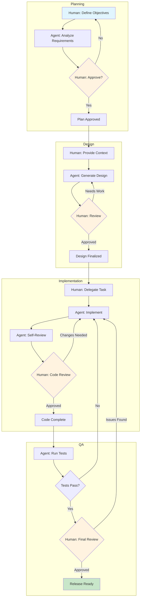
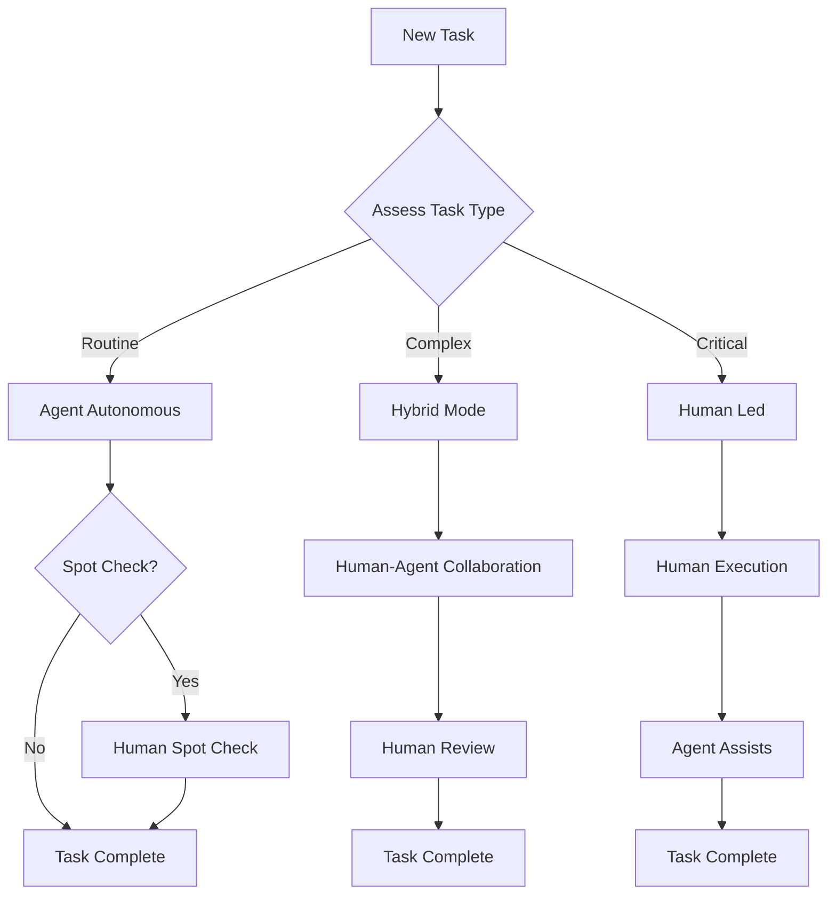
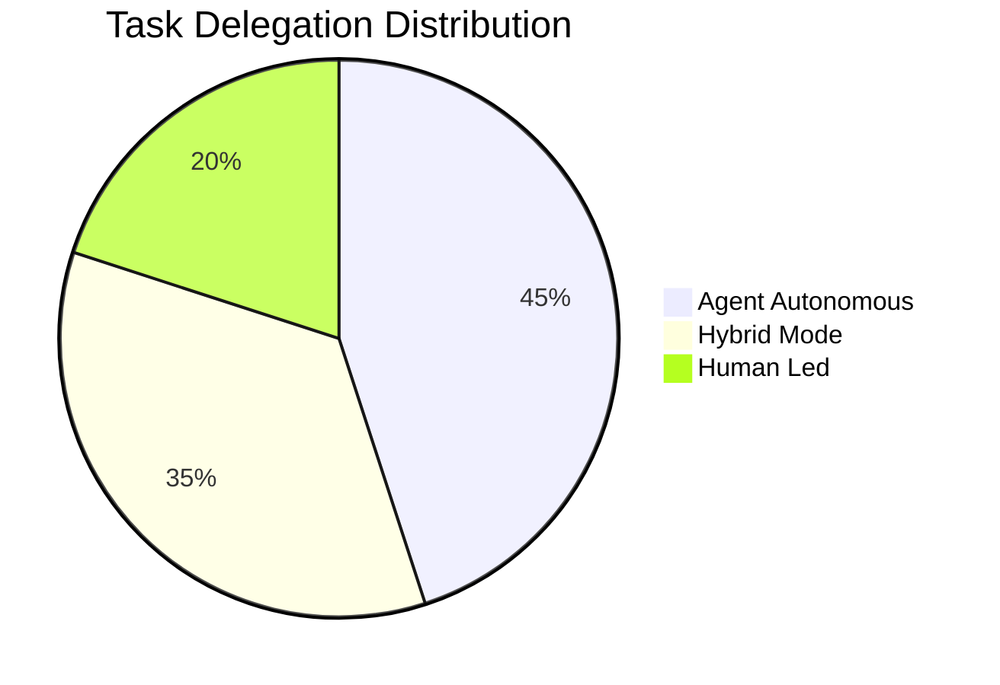

# Diagrama de Workflow HybridOps

**Versión:** 1.0.0
**Última Actualización:** 2026-01-28
**Estado:** Activo

---

## Descripción General

HybridOps (Operaciones Híbridas) es una metodología para orquestar la colaboración humano-agente en workflows de desarrollo de software. Combina las fortalezas de los agents de IA con la supervisión humana para lograr resultados óptimos.

### Principios Clave

| Principio                  | Descripción                                                                     |
| -------------------------- | ------------------------------------------------------------------------------- |
| **Ejecución Híbrida**      | Las tareas pueden ser ejecutadas por humanos, agents o ambos en colaboración   |
| **Delegación Progresiva**  | Comenzar con supervisión humana, delegar gradualmente a agents a medida que se construye confianza |
| **Checkpoints de Calidad** | Revisión humana en puntos críticos de decisión                                  |
| **Handoff Contextual**     | Transferencia de contexto fluida entre humano y agent                           |

---

## Etapas del Workflow

### Etapa 1: Planificación

```
Human                    Agent
  │                        │
  │   Define objectives    │
  │───────────────────────>│
  │                        │
  │   Analyze requirements │
  │<───────────────────────│
  │                        │
  │   Review & approve     │
  │───────────────────────>│
  │                        │
```

**Responsabilidades:**

- Humano: Definir objetivos de negocio y restricciones
- Agent: Analizar requisitos técnicos y proponer soluciones
- Humano: Revisar análisis y aprobar dirección

### Etapa 2: Diseño

```
Human                    Agent
  │                        │
  │   Provide context      │
  │───────────────────────>│
  │                        │
  │   Generate designs     │
  │<───────────────────────│
  │                        │
  │   Iterate on feedback  │
  │<──────────────────────>│
  │                        │
```

**Responsabilidades:**

- Humano: Proporcionar experiencia de dominio y contexto
- Agent: Generar opciones de diseño y documentación
- Ambos: Iterar en el diseño hasta la aprobación

### Etapa 3: Implementación

```
Human                    Agent
  │                        │
  │   Delegate task        │
  │───────────────────────>│
  │                        │
  │   Execute task         │
  │<───────────────────────│
  │                        │
  │   Review code          │
  │───────────────────────>│
  │                        │
  │   Apply feedback       │
  │<───────────────────────│
  │                        │
```

**Responsabilidades:**

- Humano: Definir alcance de la tarea y criterios de aceptación
- Agent: Implementar solución y escribir tests
- Humano: Revisar implementación y proporcionar retroalimentación

### Etapa 4: Aseguramiento de Calidad

```
Human                    Agent
  │                        │
  │   Define test criteria │
  │───────────────────────>│
  │                        │
  │   Execute tests        │
  │<───────────────────────│
  │                        │
  │   Analyze results      │
  │<──────────────────────>│
  │                        │
  │   Approve release      │
  │───────────────────────>│
  │                        │
```

**Responsabilidades:**

- Humano: Definir criterios de calidad y casos extremos
- Agent: Ejecutar tests automatizados y generar reportes
- Humano: Aprobación final para release

---

## Diagrama Mermaid

### Workflow Completo



### Flujo de Decisión de Delegación



### Clasificación de Tipos de Tarea



---

## Puntos de Integración

### Con Agents de AIOS

| Integración    | Descripción                                        |
| -------------- | -------------------------------------------------- |
| **@dev**       | Implementador principal para tareas de codificación |
| **@qa**        | Ejecución de tests y verificación de calidad       |
| **@architect** | Revisión de diseño y guía técnica                  |
| **@pm**        | Seguimiento de progreso y comunicación con stakeholders |

### Con Quality Gates

HybridOps se integra con los quality gates de 3 capas de AIOS:

| Capa                            | Rol en HybridOps                       |
| ------------------------------- | -------------------------------------- |
| Capa 1 (Pre-commit)             | Agent ejecuta, humano monitorea        |
| Capa 2 (PR Automation)          | Agent + revisión humana                |
| Capa 3 (Revisión Final)         | Aprobación humana requerida            |

### Con Story Workflow

```
┌─────────────────────────────────────────────────────────────────┐
│                    HybridOps + Story Workflow                    │
│                                                                  │
│  Story Created     ──────────>  Planning Stage                   │
│       │                              │                           │
│       ▼                              ▼                           │
│  Requirements      <──────────  Agent Analysis                   │
│       │                              │                           │
│       ▼                              ▼                           │
│  Human Approval    ──────────>  Implementation                   │
│       │                              │                           │
│       ▼                              ▼                           │
│  QA Review         <──────────  Agent Testing                    │
│       │                              │                           │
│       ▼                              ▼                           │
│  Story Complete    <──────────  Human Sign-off                   │
│                                                                  │
└─────────────────────────────────────────────────────────────────┘
```

---

## Mejores Prácticas

### Para Humanos

1. **Comunicación Clara** - Proporcionar objetivos y restricciones explícitos
2. **Retroalimentación Oportuna** - Revisar el output del agent rápidamente para mantener el impulso
3. **Construcción de Confianza** - Comenzar con supervisión, reducir a medida que crece la confianza
4. **Compartir Contexto** - Compartir conocimiento de dominio relevante de forma proactiva

### Para Agents

1. **Actualizaciones de Progreso** - Reportar estado en checkpoints definidos
2. **Señalar Incertidumbre** - Señalar explícitamente áreas que necesitan input humano
3. **Presentación de Opciones** - Presentar alternativas para decisión humana
4. **Documentación** - Mantener un rastro de auditoría claro de las decisiones

### Para Ambos

1. **Límites Definidos** - Propiedad de tareas clara y puntos de handoff
2. **Artefactos Compartidos** - Usar documentación y seguimiento común
3. **Refinamiento Iterativo** - Abrazar los ciclos de retroalimentación
4. **Ciclo de Aprendizaje** - Capturar lecciones para mejoras futuras

---

## Documentos Relacionados

- [hybrid-ops-pv.yaml](./hybrid-ops-pv.yaml) - Definición del workflow
- [Arquitectura de Alto Nivel de AIOS](../../architecture/high-level-architecture.md)
- [Arquitectura CI/CD](../../architecture/ci-cd.md)

---

_Diagrama de Workflow HybridOps v1.0 - Metodología Pedro Valerio_
