<!--
  Traducción: ES
  Original: /docs/en/guides/quality-gates.md
  Última sincronización: 2026-01-26
-->

# Guía del Sistema de Quality Gates de AIOS

> 🌐 [EN](../../guides/quality-gates.md) | [PT](../../pt/guides/quality-gates.md) | **ES**

---

> Guía completa del sistema de quality gates de 3 capas para Synkra AIOS.

**Versión:** 2.1.0
**Última Actualización:** 2025-12-01

---

## Resumen

El Sistema de Quality Gates de AIOS proporciona aseguramiento de calidad automatizado a través de tres capas progresivas de validación. Cada capa detecta diferentes tipos de problemas en la etapa apropiada del desarrollo.

### La Arquitectura de 3 Capas

```mermaid
graph LR
    subgraph "Quality Gates"
        L1[Capa 1: Pre-commit]
        L2[Capa 2: Automatización PR]
        L3[Capa 3: Revisión Humana]
    end

    Code --> L1
    L1 -->|Pasa| L2
    L2 -->|Pasa| L3
    L3 -->|Aprobado| Merge

    L1 -->|Falla| Fix1[Corregir y Reintentar]
    L2 -->|Falla| Fix2[Corregir y Reintentar]
    L3 -->|Rechazado| Fix3[Atender Feedback]

    style L1 fill:#e3f2fd
    style L2 fill:#e8f5e9
    style L3 fill:#fff3e0
```



| Capa       | Tipo            | Velocidad | Propósito                                       |
| ---------- | --------------- | --------- | ----------------------------------------------- |
| **Capa 1** | Automatizada    | ~30s      | Detectar errores de sintaxis, linting, tipos    |
| **Capa 2** | Asistida por IA | ~5m       | Detectar errores de lógica, seguridad, patrones |
| **Capa 3** | Humana          | Variable  | Revisión estratégica, aprobación final          |

---

## Capa 1: Verificaciones Pre-commit

### Propósito

Verificaciones rápidas y locales que se ejecutan antes de que el código sea comprometido. Detecta problemas obvios inmediatamente.

### Verificaciones Incluidas

| Verificación  | Herramienta | Timeout | Descripción                          |
| ------------- | ----------- | ------- | ------------------------------------ |
| **Lint**      | ESLint      | 60s     | Estilo de código y mejores prácticas |
| **Test**      | Jest        | 5m      | Pruebas unitarias con cobertura      |
| **TypeCheck** | TypeScript  | 2m      | Validación de tipos estáticos        |

### Configuración

```yaml
# .aios-core/core/quality-gates/quality-gate-config.yaml
layer1:
  enabled: true
  failFast: true # Detener en la primera falla
  checks:
    lint:
      enabled: true
      command: 'npm run lint'
      failOn: 'error' # error | warning
      timeout: 60000 # 1 minuto
    test:
      enabled: true
      command: 'npm test'
      timeout: 300000 # 5 minutos
      coverage:
        enabled: true
        minimum: 80
    typecheck:
      enabled: true
      command: 'npm run typecheck'
      timeout: 120000 # 2 minutos
```

### Ejecutando Capa 1

```bash
# Ejecutar todas las verificaciones de Capa 1
aios qa run --layer=1

# Ejecutar verificación específica
aios qa run --layer=1 --check=lint
aios qa run --layer=1 --check=test
aios qa run --layer=1 --check=typecheck

# Ejecutar con salida detallada
aios qa run --layer=1 --verbose
```

### Salida Esperada

```
Capa 1: Verificaciones Pre-commit
=================================

[1/3] Verificación de Lint
  Ejecutando: npm run lint
  ✓ Pasó (12.3s)
  Sin advertencias ni errores

[2/3] Verificación de Test
  Ejecutando: npm test
  ✓ Pasó (45.2s)
  Cobertura: 87.3% (mínimo: 80%)

[3/3] TypeCheck
  Ejecutando: npm run typecheck
  ✓ Pasó (28.1s)
  0 errores

CAPA 1 APROBADA (85.6s)
```

---

## Capa 2: Automatización de PR

### Propósito

Revisión de código asistida por IA que se ejecuta en pull requests. Detecta problemas más profundos como errores de lógica, vulnerabilidades de seguridad y problemas arquitectónicos.

### Herramientas Integradas

| Herramienta     | Propósito                   | Severidad Bloqueante |
| --------------- | --------------------------- | -------------------- |
| **CodeRabbit**  | Revisión de código con IA   | CRÍTICO              |
| **Quinn (@qa)** | Revisión de QA automatizada | CRÍTICO              |

### Configuración

```yaml
# .aios-core/core/quality-gates/quality-gate-config.yaml
layer2:
  enabled: true
  coderabbit:
    enabled: true
    command: 'coderabbit --prompt-only -t uncommitted'
    timeout: 900000 # 15 minutos
    blockOn:
      - CRITICAL
    warnOn:
      - HIGH
    documentOn:
      - MEDIUM
    ignoreOn:
      - LOW
  quinn:
    enabled: true
    autoReview: true
    agentPath: '.claude/commands/AIOS/agents/qa.md'
    severity:
      block: ['CRITICAL']
      warn: ['HIGH', 'MEDIUM']
```

### Ejecutando Capa 2

```bash
# Ejecutar todas las verificaciones de Capa 2
aios qa run --layer=2

# Ejecutar solo CodeRabbit
aios qa run --layer=2 --tool=coderabbit

# Ejecutar revisión de Quinn (@qa)
aios qa run --layer=2 --tool=quinn
```

### Niveles de Severidad

| Severidad   | Acción                | Descripción                                                                |
| ----------- | --------------------- | -------------------------------------------------------------------------- |
| **CRÍTICO** | Bloquear              | Vulnerabilidad de seguridad, riesgo de pérdida de datos, cambio disruptivo |
| **ALTO**    | Advertir + Documentar | Problema de rendimiento, validación faltante, anti-patrón                  |
| **MEDIO**   | Documentar            | Code smell, sugerencia de mejora, riesgo menor                             |
| **BAJO**    | Ignorar               | Preferencia de estilo, optimización menor                                  |

### Integración con CodeRabbit

CodeRabbit realiza revisión de código impulsada por IA con estos enfoques:

- Vulnerabilidades de seguridad
- Problemas de rendimiento
- Calidad y mantenibilidad del código
- Violaciones de mejores prácticas
- Completitud de documentación

```bash
# Ejecución manual de CodeRabbit
coderabbit --prompt-only -t uncommitted

# Con rutas específicas
coderabbit --files "src/**/*.js" --prompt-only
```

### Integración con Quinn (@qa)

El agente de QA realiza revisión automatizada enfocada en:

- Adecuación de cobertura de pruebas
- Manejo de casos límite
- Completitud de manejo de errores
- Validación de criterios de aceptación

```javascript
// Invocación programática de Quinn
const QualityGateManager = require('./.aios-core/core/quality-gates/quality-gate-manager');
const manager = new QualityGateManager();
const result = await manager.runQuinnReview(pullRequestId);
```

---

## Capa 3: Revisión Humana

### Propósito

Revisión humana estratégica para aprobación final. Asegura que los requisitos de negocio se cumplan y las decisiones arquitectónicas sean sólidas.

### Configuración

```yaml
# .aios-core/core/quality-gates/quality-gate-config.yaml
layer3:
  enabled: true
  requireSignoff: true
  assignmentStrategy: 'auto' # auto | manual | round-robin
  defaultReviewer: '@architect'
  checklist:
    enabled: true
    template: 'strategic-review-checklist'
    minItems: 5
  signoff:
    required: true
    expiry: 86400000 # 24 horas en ms
```

### Estrategias de Asignación

| Estrategia      | Descripción                                           |
| --------------- | ----------------------------------------------------- |
| **auto**        | Asignar basado en propiedad de archivos y experiencia |
| **manual**      | Asignar revisor manualmente                           |
| **round-robin** | Rotar entre miembros del equipo                       |

### Lista de Verificación de Revisión

La lista de verificación de revisión estratégica asegura que los revisores cubran áreas clave:

```markdown
## Lista de Verificación de Revisión Estratégica

### Arquitectura

- [ ] Los cambios se alinean con la arquitectura del sistema
- [ ] No se introdujeron dependencias no autorizadas
- [ ] Se mantiene compatibilidad hacia atrás

### Seguridad

- [ ] No se exponen datos sensibles
- [ ] Validación de entrada presente
- [ ] Autenticación/autorización correcta

### Calidad

- [ ] El código es mantenible y legible
- [ ] Las pruebas son exhaustivas
- [ ] Documentación actualizada

### Negocio

- [ ] Criterios de aceptación cumplidos
- [ ] Experiencia de usuario considerada
- [ ] Rendimiento aceptable
```

### Proceso de Aprobación

```bash
# Solicitar revisión humana
aios qa request-review --pr=123

# Aprobar la revisión
aios qa signoff --pr=123 --reviewer="@architect"

# Verificar estado de aprobación
aios qa signoff-status --pr=123
```

---

## Comandos CLI

### `aios qa run`

Ejecutar verificaciones de quality gate.

```bash
# Ejecutar todas las capas secuencialmente
aios qa run

# Ejecutar capa específica
aios qa run --layer=1
aios qa run --layer=2
aios qa run --layer=3

# Ejecutar con opciones
aios qa run --verbose          # Salida detallada
aios qa run --fail-fast        # Detener en primera falla
aios qa run --continue-on-fail # Continuar a pesar de fallas
```

### `aios qa status`

Verificar estado actual de quality gate.

```bash
# Obtener estado general
aios qa status

# Obtener estado para capa específica
aios qa status --layer=1

# Obtener estado para PR
aios qa status --pr=123
```

**Salida:**

```
Estado de Quality Gate
======================

Capa 1: Pre-commit
  Lint:      ✓ Pasó
  Test:      ✓ Pasó (87.3% cobertura)
  TypeCheck: ✓ Pasó

Capa 2: Automatización PR
  CodeRabbit: ✓ Pasó (0 críticos, 2 medios)
  Quinn:      ✓ Pasó

Capa 3: Revisión Humana
  Estado:    Pendiente
  Asignado:  @architect
  Expira:    2025-12-02 12:00:00

General: PENDIENTE DE REVISIÓN
```

### `aios qa report`

Generar reporte de quality gate.

```bash
# Generar reporte
aios qa report

# Exportar a archivo
aios qa report --output=qa-report.json
aios qa report --format=markdown --output=qa-report.md
```

### `aios qa configure`

Configurar ajustes de quality gate.

```bash
# Configuración interactiva
aios qa configure

# Establecer opciones específicas
aios qa configure --layer1.coverage.minimum=90
aios qa configure --layer2.coderabbit.enabled=false
aios qa configure --layer3.requireSignoff=true
```

---

## Integración CI/CD

### GitHub Actions

```yaml
# .github/workflows/quality-gate.yml
name: Quality Gate

on:
  pull_request:
    branches: [main, develop]

jobs:
  layer1:
    name: Capa 1 - Pre-commit
    runs-on: ubuntu-latest
    steps:
      - uses: actions/checkout@v4
      - uses: actions/setup-node@v4
        with:
          node-version: '18'
      - run: npm ci
      - run: aios qa run --layer=1

  layer2:
    name: Capa 2 - Automatización PR
    needs: layer1
    runs-on: ubuntu-latest
    steps:
      - uses: actions/checkout@v4
      - uses: actions/setup-node@v4
        with:
          node-version: '18'
      - run: npm ci
      - run: aios qa run --layer=2
        env:
          CODERABBIT_API_KEY: ${{ secrets.CODERABBIT_API_KEY }}

  layer3:
    name: Capa 3 - Revisión Humana
    needs: layer2
    runs-on: ubuntu-latest
    steps:
      - uses: actions/checkout@v4
      - run: aios qa request-review --pr=${{ github.event.pull_request.number }}
```

### GitLab CI

```yaml
# .gitlab-ci.yml
stages:
  - layer1
  - layer2
  - layer3

layer1:
  stage: layer1
  script:
    - npm ci
    - aios qa run --layer=1

layer2:
  stage: layer2
  script:
    - npm ci
    - aios qa run --layer=2
  needs:
    - layer1

layer3:
  stage: layer3
  script:
    - aios qa request-review
  needs:
    - layer2
  when: manual
```

### Hook Pre-commit

```bash
# .husky/pre-commit
#!/bin/sh
. "$(dirname "$0")/_/husky.sh"

aios qa run --layer=1 --fail-fast
```

---

## Referencia de Configuración

### Ejemplo de Configuración Completa

```yaml
# quality-gate-config.yaml
version: '1.0'

# Capa 1: Verificaciones pre-commit
layer1:
  enabled: true
  failFast: true
  checks:
    lint:
      enabled: true
      command: 'npm run lint'
      failOn: 'error'
      timeout: 60000
    test:
      enabled: true
      command: 'npm test'
      timeout: 300000
      coverage:
        enabled: true
        minimum: 80
    typecheck:
      enabled: true
      command: 'npm run typecheck'
      timeout: 120000

# Capa 2: Automatización PR
layer2:
  enabled: true
  coderabbit:
    enabled: true
    command: 'coderabbit --prompt-only -t uncommitted'
    timeout: 900000
    blockOn: [CRITICAL]
    warnOn: [HIGH]
    documentOn: [MEDIUM]
    ignoreOn: [LOW]
  quinn:
    enabled: true
    autoReview: true
    agentPath: '.claude/commands/AIOS/agents/qa.md'
    severity:
      block: [CRITICAL]
      warn: [HIGH, MEDIUM]

# Capa 3: Revisión Humana
layer3:
  enabled: true
  requireSignoff: true
  assignmentStrategy: 'auto'
  defaultReviewer: '@architect'
  checklist:
    enabled: true
    template: 'strategic-review-checklist'
    minItems: 5
  signoff:
    required: true
    expiry: 86400000

# Reportes
reports:
  location: '.aios/qa-reports'
  format: 'json'
  retention: 30
  includeMetrics: true

# Persistencia de estado
status:
  location: '.aios/qa-status.json'
  updateOnChange: true

# Salida detallada
verbose:
  enabled: false
  showCommands: true
  showOutput: true
  showTimings: true
```

---

## Solución de Problemas

### Fallas de Capa 1

| Problema             | Solución                                                          |
| -------------------- | ----------------------------------------------------------------- |
| Errores de lint      | Ejecutar `npm run lint -- --fix` para auto-corregir               |
| Fallas de pruebas    | Verificar salida de pruebas, actualizar pruebas o corregir código |
| Errores de TypeCheck | Revisar anotaciones de tipo, corregir incompatibilidades de tipos |
| Timeout              | Aumentar timeout en configuración u optimizar pruebas             |

### Fallas de Capa 2

| Problema              | Solución                                           |
| --------------------- | -------------------------------------------------- |
| CodeRabbit crítico    | Atender problemas de seguridad/cambios disruptivos |
| Timeout de CodeRabbit | Verificar red, intentar ejecución manual           |
| Quinn bloqueó         | Revisar feedback de @qa, actualizar código         |

### Problemas de Capa 3

| Problema                         | Solución                                    |
| -------------------------------- | ------------------------------------------- |
| Sin revisor asignado             | Establecer defaultReviewer en configuración |
| Aprobación expirada              | Solicitar nueva revisión                    |
| Lista de verificación incompleta | Completar todos los elementos requeridos    |

---

## Documentación Relacionada

- [Arquitectura del Sistema de Módulos](../architecture/module-system.md)
- [Guía de Descubrimiento de Servicios](./service-discovery.md)

---

_Guía del Sistema de Quality Gates de Synkra AIOS v4_
