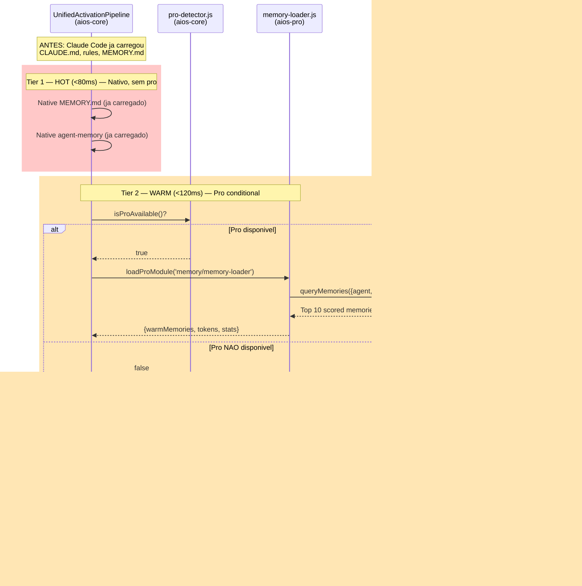

# Memory Intelligence System - Architecture Vision

**Versao:** 2.1 (Target State — Core/Pro Split)
**Ultima Atualizacao:** 2026-02-09
**Autor:** @architect (Aria)
**Epic:** [MIS — Memory Intelligence System](../stories/epics/epic-memory-intelligence-system/EPIC-MIS-INDEX.md)
**Baseado Em:** [MIS-1 Investigation](../stories/epics/epic-memory-intelligence-system/story-mis-1-investigation.md)
**Documento Atual:** [MEMORY-SYSTEM.md](MEMORY-SYSTEM.md) (estado atual v1.0)
**Tags:** memory, intelligence, session-digest, progressive-retrieval, self-learning, attention-routing, core-pro-split

> **NOTA:** Este documento descreve o **estado futuro** do sistema de memoria apos todas as 7 stories do Epic MIS serem implementadas. Para o estado atual, consulte [MEMORY-SYSTEM.md](MEMORY-SYSTEM.md).

> **ARQUITETURA:** O MIS segue o modelo **Open Core** do AIOS. Toda a inteligencia de memoria reside no repositorio privado `aios-pro` (submodule `pro/`). O `aios-core` (open source) fornece apenas extension points e funciona 100% sem memoria inteligente — exatamente como hoje.

---

## Indice

1. [Visao Geral](#visao-geral)
2. [Core/Pro Separation Strategy](#corepro-separation-strategy)
3. [Design Principles](#design-principles)
4. [Arquitetura em 4 Camadas](#arquitetura-em-4-camadas)
5. [Camada 1: Capture Layer](#camada-1-capture-layer)
6. [Camada 2: Storage Layer](#camada-2-storage-layer)
7. [Camada 3: Retrieval Layer](#camada-3-retrieval-layer)
8. [Camada 4: Evolution Layer](#camada-4-evolution-layer)
9. [Session Digest Flow (PreCompact)](#session-digest-flow-precompact)
10. [Agent Memory API](#agent-memory-api)
11. [Pipeline Integration](#pipeline-integration)
12. [Memory File Format](#memory-file-format)
13. [Attention Scoring & Tiers](#attention-scoring--tiers)
14. [Cognitive Sectors](#cognitive-sectors)
15. [Self-Learning & Auto-Evolution](#self-learning--auto-evolution)
16. [Mapa de Storage Persistente](#mapa-de-storage-persistente)
17. [Mapa de Arquivos do Sistema](#mapa-de-arquivos-do-sistema)
18. [Diferencas: Estado Atual vs MIS](#diferencas-estado-atual-vs-mis)
19. [Story Roadmap](#story-roadmap)
20. [Referencias de Pesquisa](#referencias-de-pesquisa)

---

## Visao Geral

### O Problema (Estado Atual)

O sistema de memoria atual opera em **duas camadas desconectadas** (Claude Code nativo + AIOS Framework) com gaps criticos:

- **Sem session-digest** — conhecimento contextual evapora ao fechar sessao
- **Sem retrieval inteligente** — agentes carregam tudo-ou-nada (200 linhas de MEMORY.md)
- **Sem self-learning** — heuristicas, correcoes e axiomas perdidos entre sessoes
- **2,397 linhas de codigo orfao** — modulos que se referenciam mutuamente sem consumidores
- **~14K linhas de dados orfaos** — arquivos que ninguem le
- **8 broken paths** — referencias a diretorios/arquivos que nao existem

### A Solucao: Memory Intelligence System (MIS)

O MIS unifica as duas camadas em um sistema inteligente de 4 camadas, seguindo o modelo **Open Core**:

| Camada | Funcao | Repositorio | Story |
|--------|--------|-------------|-------|
| **Cleanup** | Remover dead code, preparar base | **aios-core** | MIS-2 |
| **Capture** | Captura conhecimento de sessao via hooks | **aios-pro** | MIS-3 |
| **Storage** | Armazena em Markdown com frontmatter YAML | **aios-pro** | MIS-3, MIS-4 |
| **Retrieval** | Recupera por relevancia com progressive disclosure | **aios-pro** + extension points em **aios-core** | MIS-4, MIS-6 |
| **Evolution** | Aprende e evolui regras automaticamente | **aios-pro** | MIS-5, MIS-7 |

### Principios Chave (vs Estado Atual)

| Aspecto | Estado Atual | Com MIS (aios-pro ativo) | Sem MIS (aios-core only) |
|---------|-------------|--------------------------|--------------------------|
| Session end | Nada acontece | PreCompact digest captura aprendizados | Nada acontece (como hoje) |
| Memory load | MEMORY.md (200 linhas, tudo-ou-nada) | Progressive disclosure (HOT/WARM/COLD) | MEMORY.md (como hoje) |
| Agent scope | Memorias globais sem filtragem | Memorias privadas + compartilhadas por agente | Globais (como hoje) |
| Learning | Manual (Claude decide salvar) | Automatico (correcoes, patterns, gotchas) | Manual (como hoje) |
| Token usage | ~10K tokens fixos por sessao | 60-95% reducao via attention routing | ~10K tokens (como hoje) |

---

## Core/Pro Separation Strategy

### Principio Fundamental

> **aios-core funciona 100% sem o MIS** — exatamente como funciona hoje. Quando `aios-pro` esta presente (submodule `pro/`), o MIS se conecta automaticamente via extension points. Zero configuracao manual.

### Modelo Open Core


### Pattern de Integracao: pro-detector

O aios-core ja possui o modulo `bin/utils/pro-detector.js` (Story PRO-5):

```javascript
const { isProAvailable, loadProModule } = require('../../bin/utils/pro-detector');

// No UnifiedActivationPipeline (Tier 2):
if (isProAvailable()) {
  const memoryLoader = loadProModule('memory/memory-loader');
  if (memoryLoader) {
    const memories = await memoryLoader.loadForAgent(agentId, { budget: 2000 });
    enrichedContext.memories = memories;
  }
}
// Se pro/ nao existe → memoryLoader = null → nenhuma memoria carregada → funciona como hoje
```

### Feature Gating

Features de memoria ja registradas em `pro/feature-registry.yaml`:

| Feature ID | Descricao | Story MIS |
|-----------|-----------|-----------|
| `pro.memory.persistence` | Persistent memory across sessions | MIS-3 |
| `pro.memory.extended` | Extended context window for AI agents | MIS-4, MIS-6 |
| `pro.memory.search` | Semantic search across memory stores | MIS-4 |
| `pro.memory.sync` | Cross-device memory synchronization | Futuro |

Features adicionais a registrar:

| Feature ID (novo) | Descricao | Story MIS |
|-------------------|-----------|-----------|
| `pro.memory.session_digest` | PreCompact session digest capture | MIS-3 |
| `pro.memory.self_learning` | Self-learning from corrections | MIS-5 |
| `pro.memory.auto_evolution` | CLAUDE.md & rules auto-evolution | MIS-7 |

### O Que Vai em Cada Repositorio

#### aios-core (open source) — Extension Points Only

| Arquivo | Tipo | Descricao |
|---------|------|-----------|
| `bin/utils/pro-detector.js` | Existente | `isProAvailable()`, `loadProModule()` |
| `.aios-core/development/scripts/unified-activation-pipeline.js` | Modificacao | Adiciona `if (isProAvailable())` no Tier 2 para memory loading |
| `.aios-core/development/scripts/greeting-builder.js` | Modificacao | Adiciona memory stats no greeting se pro disponivel |
| `.aios-core/core/memory/gotchas-memory.js` | Mantido | Path fix (MIS-2), funciona standalone |
| `.aios-core/core/session/context-loader.js` | Mantido | Path fix (MIS-2), funciona standalone |
| `.claude/settings.json` | Modificacao | Hook stubs que chamam scripts em `pro/` (graceful fail se ausente) |

#### aios-pro (privado) — Toda a Inteligencia

| Arquivo | Camada MIS | Story |
|---------|-----------|-------|
| `pro/memory/session-digest.js` | Capture | MIS-3 |
| `pro/memory/gotcha-capture.js` | Capture | MIS-3 |
| `pro/memory/memory-index.js` | Storage | MIS-4 |
| `pro/memory/memory-retriever.js` | Retrieval | MIS-4 |
| `pro/memory/self-learner.js` | Evolution | MIS-5 |
| `pro/memory/memory-loader.js` | Pipeline | MIS-6 |
| `pro/memory/agent-memory-api.js` | Commands | MIS-6 |
| `pro/memory/rule-proposer.js` | Evolution | MIS-7 |
| `pro/pro-config.yaml` | Config | MIS-3 (enable memory flags) |
| `pro/feature-registry.yaml` | Config | MIS-3 (add new feature IDs) |

### Hook Configuration Strategy

Os hooks do Claude Code sao configurados em `.claude/settings.json` (aios-core). O script apontado reside em `pro/`:

```json
{
  "hooks": {
    "PreCompact": [
      {
        "type": "command",
        "command": "node pro/memory/session-digest.js --mode=precompact",
        "timeout": 10000
      }
    ]
  }
}
```

**Graceful degradation:** Se `pro/` nao existe, o Node.js falha silenciosamente (`Cannot find module`), o hook nao executa, e o Claude Code continua normalmente. Isso e o comportamento padrao de hooks — falhas nao bloqueiam a sessao.

**Alternativa mais robusta (recomendada):** Um wrapper no core que verifica pro antes de chamar:

```json
{
  "hooks": {
    "PreCompact": [
      {
        "type": "command",
        "command": "node .aios-core/hooks/pro-hook-runner.js PreCompact",
        "timeout": 10000
      }
    ]
  }
}
```

```javascript
// .aios-core/hooks/pro-hook-runner.js (no core, ~20 linhas)
const { isProAvailable, loadProModule } = require('../bin/utils/pro-detector');
const hookEvent = process.argv[2]; // PreCompact, Stop, etc.

if (!isProAvailable()) process.exit(0); // silently exit

const hookHandler = loadProModule(`memory/hooks/${hookEvent.toLowerCase()}`);
if (hookHandler && typeof hookHandler.run === 'function') {
  hookHandler.run(process.env).catch(() => process.exit(1));
} else {
  process.exit(0);
}
```

---

## Design Principles

7 principios derivados da investigacao de 10 repositorios open-source (MIS-1):

### 1. File-First (basic-memory pattern)

Memorias sao arquivos Markdown com frontmatter YAML. Git-friendly, human-readable, CLI-first. Se o index corromper, rebuild a partir dos arquivos.

### 2. Progressive Disclosure (claude-mem pattern)

Retrieval em 3 camadas para minimizar tokens:
- **Index:** Titulos + IDs (~50 tokens)
- **Context:** Chunks relevantes (~200 tokens)
- **Detail:** Memoria completa (~1000+ tokens)

### 3. Tiered Storage (openclaw pattern)

Memorias classificadas por durabilidade:
- **Session:** Efemera, morre ao final da sessao
- **Daily:** Consolidacao do dia, auto-flush
- **Durable:** Conhecimento permanente, nunca expira

### 4. Attention Routing (claude-cognitive pattern)

Cada memoria tem um attention score que determina tier de loading:
- **HOT (>0.7):** Sempre no contexto (~500 tokens max)
- **WARM (0.3-0.7):** Carregado sob demanda
- **COLD (<0.3):** Apenas via busca explicita

### 5. Cognitive Sectors (OpenMemory pattern)

Memorias classificadas por tipo cognitivo:
- **Episodic:** "O que aconteceu" (sessoes, eventos)
- **Semantic:** "O que eu sei" (fatos, conceitos)
- **Procedural:** "Como fazer" (patterns, workflows)
- **Reflective:** "O que eu aprendi" (meta-cognicao)

### 6. Self-Learning (claude-reflect pattern)

Correcoes do usuario sao capturadas, padroes extraidos, regras propostas com confidence score. Evolucao sempre via aprovacao do usuario.

### 7. Agent-Scoped (cognee pattern)

Cada agente tem memoria privada + acesso a memorias compartilhadas. Sem cross-contaminacao.

### 8. Open Core (AIOS PRO pattern)

Toda a inteligencia de memoria e uma feature premium. O core funciona identicamente sem ela. A integracao e automatica via extension points + `isProAvailable()`.

---

## Arquitetura em 4 Camadas

### Diagrama Completo com Core/Pro Boundary


### Fluxo Sem Pro (aios-core standalone)


### Relacionamento entre Modulos


---

## Camada 1: Capture Layer

> **Repositorio:** `aios-pro` (pro/memory/)
> **Extension point no core:** `.aios-core/hooks/pro-hook-runner.js`

### Visao Geral

A Capture Layer intercepta eventos de sessao via hooks do Claude Code e extrai conhecimento estruturado. Os scripts de captura residem em `pro/memory/` e sao invocados pelo `pro-hook-runner.js` do core.

### Hook Events Utilizados

| Hook Event | Quando Dispara | Script Pro | Fallback Core |
|-----------|---------------|-----------|---------------|
| `PreCompact` | Contexto proximo do limite | `pro/memory/session-digest.js` | Nada (exit 0) |
| `Stop` | Sessao encerra | `pro/memory/session-digest.js --final` | Nada (exit 0) |
| `PostToolUseFailure` | Tool falhou | `pro/memory/gotcha-capture.js` | `gotchas-memory.js` (core, basico) |
| `TaskCompleted` | Task finalizada | `pro/memory/session-digest.js --task` | Nada (exit 0) |

### Configuracao de Hooks

```json
// .claude/settings.json (aios-core — committed)
{
  "hooks": {
    "PreCompact": [
      {
        "type": "command",
        "command": "node .aios-core/hooks/pro-hook-runner.js PreCompact",
        "timeout": 10000
      }
    ],
    "Stop": [
      {
        "type": "command",
        "command": "node .aios-core/hooks/pro-hook-runner.js Stop",
        "timeout": 5000
      }
    ],
    "PostToolUseFailure": [
      {
        "type": "command",
        "command": "node .aios-core/hooks/pro-hook-runner.js PostToolUseFailure",
        "timeout": 3000
      }
    ]
  }
}
```

O `pro-hook-runner.js` (~20 linhas, no core) verifica `isProAvailable()` e delega para o script pro correspondente. Se pro nao existe, exit silencioso.

### Extractors e Classifiers (pro/memory/)


---

## Camada 2: Storage Layer

> **Repositorio:** `aios-pro` (pro/memory/) gerencia o storage
> **Storage location:** `.aios/memories/` (gitignored, criado pelo pro)

### Principio: Files as Memory

Cada memoria e um arquivo Markdown com frontmatter YAML. Arquivos sao a fonte da verdade. O index JSON e derivado e pode ser reconstruido a qualquer momento.

### Estrutura de Diretorios

```
.aios/memories/                          # Criado e gerenciado por pro/memory/
  shared/                                # Cross-agent memories
    durable/                             # Permanent knowledge
      2026-02-09-absolute-imports.md
    daily/                               # Day-level consolidation
      2026-02-09/
        session-001-digest.md
    session/                             # Ephemeral (cleaned on next start)
      current-session.md
  dev/                                   # @dev private memories
    durable/
    daily/
  qa/                                    # @qa private memories
    durable/
    daily/
  architect/                             # @architect private memories
    durable/
    daily/
  index.json                             # Search index (rebuilt from files)

# Claude Code nativo (nao gerenciado pelo MIS):
.claude/memory/MEMORY.md                 # Always loaded, 200 lines
.claude/agent-memory/{agent}/MEMORY.md   # Per-agent memory
```

### Dual Storage Strategy


**Sem pro:** MEMORY.md nativo funciona como hoje — Claude decide o que salvar manualmente.
**Com pro:** MIS sincroniza HOT memories para MEMORY.md, garantindo que estejam no system prompt.

---

## Camada 3: Retrieval Layer

> **Repositorio:** `aios-pro` (pro/memory/memory-retriever.js, memory-loader.js)
> **Extension point no core:** `unified-activation-pipeline.js` (Tier 2 conditional load)

### Progressive Disclosure (3 Niveis)


### Token Savings

| Cenario | Tokens | Reducao |
|---------|--------|---------|
| Sem pro (core only, MEMORY.md bruto) | ~10,000 | 0% |
| Com pro + Progressive Disclosure | ~2,000 | 80% |
| Com pro + Attention Routing | ~1,000 | 90% |
| Com pro + Agent Scoping | ~500 | 95% |

---

## Camada 4: Evolution Layer

> **Repositorio:** `aios-pro` (pro/memory/self-learner.js, rule-proposer.js)
> **Nenhum extension point no core** — esta camada e 100% pro

### Fluxo de Auto-Evolucao


### Regra Inviolavel

> **NUNCA auto-modificar arquivos de configuracao do usuario.** Sempre propor → apresentar → aguardar aprovacao explicita. Rejeicao abaixa confidence e registra motivo.

---

## Session Digest Flow (PreCompact)

### Fluxo com Core/Pro Boundary


### Capacidades Tecnicas do PreCompact

| Capacidade | Status | Nota |
|-----------|--------|------|
| Acesso ao transcript completo | Disponivel | Antes da compressao |
| Execucao de scripts shell | Disponivel | Fire-and-forget com async |
| Escrita de arquivos | Disponivel | session-digest.js escreve memories |
| Timeout configuravel | 10 segundos | Suficiente para digest |
| Modo async | Disponivel (Jan 2026) | Nao bloqueia compactacao |

---

## Agent Memory API

> **Repositorio:** `aios-pro` (pro/memory/agent-memory-api.js)
> **Sem pro:** Comandos `*recall`, `*remember` nao existem (agente opera como hoje)

### Comandos Disponiveis (com pro)

```bash
# Buscar memorias
*recall {query}                    # Busca em todas as memorias acessiveis
*recall --agent dev                # Apenas memorias do @dev
*recall --type procedural          # Apenas conhecimento procedural
*recall --tier durable             # Apenas memorias permanentes
*recall --recent 7d                # Ultimos 7 dias

# Salvar memorias manualmente
*remember "Always run tests before push"   # Salva como durable + procedural

# Gerenciar memorias
*forget {id}                       # Deleta memoria especifica
*memories                          # Lista memorias recentes (HOT + WARM)
*memories --stats                  # Estatisticas de uso
```

### Mapeamento Agente → Memorias Acessiveis

Cada agente acessa:
1. Suas proprias memorias privadas (`.aios/memories/{agent}/`)
2. Memorias compartilhadas (`.aios/memories/shared/`)
3. **Nunca** memorias privadas de outros agentes

---

## Pipeline Integration

> **Extension point no core:** `unified-activation-pipeline.js` (1 check `isProAvailable`)
> **Modulo pro:** `pro/memory/memory-loader.js`

### Tiered Memory Loading



### Budget de Tokens

| Tier | Com Pro | Sem Pro (core only) |
|------|---------|-------------------|
| HOT (Tier 1) | ~500 tokens | ~500 tokens (MEMORY.md nativo) |
| WARM (Tier 2) | ~2,000 tokens | 0 (skip) |
| COLD (Tier 3) | ~200 tokens | 0 (skip) |
| **Total** | **~2,700** | **~500** (como hoje) |

---

## Memory File Format

### Especificacao (arquivos em .aios/memories/)

```markdown
---
id: mem-2026-02-09-001
type: procedural               # episodic | semantic | procedural | reflective
tier: durable                  # session | daily | durable
agent: shared                  # shared | dev | qa | architect | ...
tags: [imports, typescript, pattern, coding-standard]
confidence: 0.95
created: 2026-02-09T14:30:00Z
last_accessed: 2026-02-09T16:00:00Z
access_count: 3
source: user-correction         # user-correction | session-digest | auto-gotcha |
                                # manual | heuristic | task-outcome
attention_score: 0.85           # HOT (>0.7) | WARM (0.3-0.7) | COLD (<0.3)
related_memories: [mem-2026-02-08-003]
evidence_count: 5
---

# Always Use Absolute Imports in AIOS

## Pattern
Use `@/` prefix for all imports. Never use relative imports (`../`).

## Evidence
- User correction in session abc123 (2026-02-09)
- Confirmed by CLAUDE.md rule (Absolute Imports, Artigo VI)
- Applied in 47 files across codebase

## Context
Non-negotiable coding standard. Constitution Article VI.
```

---

## Attention Scoring & Tiers

### Formula

```
attention_score = base_relevance * recency_factor * access_modifier * confidence

Decay rates por tier:
  session:  0.5   (metade por dia)
  daily:    0.1   (moderado)
  durable:  0.01  (muito lento)
```

### Tier Assignment

| Attention Score | Tier | Pipeline | Comportamento |
|----------------|------|----------|--------------|
| > 0.7 | HOT | Tier 1 | Sync para MEMORY.md (sempre no prompt) |
| 0.3 - 0.7 | WARM | Tier 2 | Injetado na ativacao (se dentro do budget) |
| < 0.3 | COLD | Tier 3 | Apenas via `*recall` explicito |
| < 0.1 (90+ dias) | ARCHIVE | — | Movido para `.old/` |

---

## Cognitive Sectors

### 4 Setores + Preferencia por Agente

| Agente | Setores Prioritarios | Razao |
|--------|---------------------|-------|
| `@dev` | Procedural, Semantic | COMO fazer e QUAIS convencoes |
| `@qa` | Reflective, Episodic | O QUE APRENDEMOS e O QUE ACONTECEU |
| `@architect` | Semantic, Reflective | O QUE SABEMOS e O QUE APRENDEMOS |
| `@pm` | Episodic, Semantic | O QUE ACONTECEU e FATOS do projeto |
| `@devops` | Procedural, Episodic | COMO OPERAR e O QUE ACONTECEU |

### Decay por Setor

| Setor | TTL Base | Razao |
|-------|---------|-------|
| Episodic | 7 dias * access_modifier | Sessoes antigas perdem relevancia |
| Semantic | 365 dias | Fatos permanecem validos |
| Procedural | 30 dias * last_used_modifier | Workflows nao usados decaem |
| Reflective | Infinito | Aprendizados sao permanentes |

---

## Self-Learning & Auto-Evolution

> **100% em aios-pro** — nenhum componente de self-learning no core

### Exemplos de Evolucao

**Correcao → Regra:**
```
Sessao 1: Usuario corrige "use npm not yarn" → confidence 0.3
Sessao 4: Mesmo pattern 5x → confidence 0.95
→ PROPOSTA: Adicionar a CLAUDE.md: "Package Manager: npm"
→ Usuario aprova → Regra aplicada
```

**Gotcha → Warning:**
```
Sessao 7: Erro "EACCES permission denied" 3x → auto-gotcha
→ Gotcha persiste por 5+ sessoes → promoted to Warning
→ PROPOSTA: Adicionar a rules/: "Warning: .aios/ permissions"
→ Usuario aprova → Warning vira regra
```

---

## Mapa de Storage Persistente

```
.aios/                                        # Runtime state (gitignored)
├── memories/                                 # [PRO] Criado/gerenciado por pro/memory/
│   ├── shared/                               #   Cross-agent memories
│   │   ├── durable/                          #     Permanent knowledge (.md files)
│   │   ├── daily/{YYYY-MM-DD}/              #     Daily digests
│   │   └── session/                          #     Ephemeral (cleaned on restart)
│   ├── dev/                                  #   @dev private memories
│   ├── qa/                                   #   @qa private memories
│   ├── architect/                            #   @architect private memories
│   ├── pm/, devops/, ...                     #   Other agents
│   ├── index.json                            #   Search index (rebuilt from .md)
│   └── stats.json                            #   Usage analytics
├── gotchas.json                              # [CORE] gotchas-memory.js (standalone)
├── gotchas.md                                # [CORE] Human-readable gotchas
├── error-tracking.json                       # [CORE] Error tracking (MIS-2 cria)
├── session-state.json                        # [CORE] Inter-agent handoff
├── project-status.yaml                       # [CORE] Project status cache
└── codebase-map.json                         # [CORE] Codebase structure

~/.claude/projects/.../
├── memory/MEMORY.md                          # [NATIVO] Always loaded (200 lines)
└── {session-id}.jsonl                        # [NATIVO] Full transcript

.claude/agent-memory/                         # [NATIVO] Per-agent memory
├── aios-architect/MEMORY.md
├── aios-dev/MEMORY.md
└── .../MEMORY.md
```

**Sem pro:** Apenas `[CORE]` e `[NATIVO]` existem. `[PRO]` (.aios/memories/) nunca e criado.

---

## Mapa de Arquivos do Sistema

### aios-core (Open Source) — Extension Points

| Arquivo | Tipo | Story | Descricao |
|---------|------|-------|-----------|
| `bin/utils/pro-detector.js` | Existente (PRO-5) | — | `isProAvailable()`, `loadProModule()` |
| `.aios-core/hooks/pro-hook-runner.js` | **Novo** | MIS-3 | Wrapper: verifica pro, delega hook (~20 linhas) |
| `.aios-core/development/scripts/unified-activation-pipeline.js` | **Modificacao** | MIS-6 | Adiciona `if (isProAvailable())` no Tier 2 |
| `.aios-core/development/scripts/greeting-builder.js` | **Modificacao** | MIS-6 | Memory stats no greeting se pro disponivel |
| `.aios-core/core/memory/gotchas-memory.js` | **Path fix** | MIS-2 | Corrige `.aios/error-tracking.json` |
| `.aios-core/core/session/context-loader.js` | **Path fix** | MIS-2 | Corrige `.aios/session-state.json` |
| `.claude/settings.json` | **Modificacao** | MIS-3 | Hook stubs via pro-hook-runner.js |

### aios-pro (Privado) — Toda a Inteligencia

| Arquivo | Camada | Story | Descricao |
|---------|--------|-------|-----------|
| `pro/memory/hooks/precompact.js` | Capture | MIS-3 | Session digest no PreCompact |
| `pro/memory/hooks/stop.js` | Capture | MIS-3 | Final flush no Stop |
| `pro/memory/hooks/tooltfailure.js` | Capture | MIS-3 | Enhanced gotcha capture |
| `pro/memory/memory-index.js` | Storage | MIS-4 | Index manager (build, search, update) |
| `pro/memory/memory-retriever.js` | Retrieval | MIS-4 | Progressive disclosure retriever |
| `pro/memory/self-learner.js` | Evolution | MIS-5 | Correction tracker + heuristic extractor |
| `pro/memory/memory-loader.js` | Pipeline | MIS-6 | Pipeline integration (Tier 2/3 loading) |
| `pro/memory/agent-memory-api.js` | Commands | MIS-6 | `*recall`, `*remember`, `*forget` |
| `pro/memory/rule-proposer.js` | Evolution | MIS-7 | CLAUDE.md + rules auto-evolution |
| `pro/pro-config.yaml` | Config | MIS-3 | Enable memory flags |
| `pro/feature-registry.yaml` | Config | MIS-3 | Add MIS feature IDs |

### Arquivos Removidos (MIS-2, aios-core)

| Arquivo | Linhas | Razao |
|---------|--------|-------|
| `.aios-core/core/memory/timeline-manager.js` | 746 | 0 consumers (orphan) |
| `.aios-core/core/memory/file-evolution-tracker.js` | 1,003 | 0 consumers (orphan) |
| `.aios-core/core/memory/context-snapshot.js` | 648 | 0 consumers (orphan) |
| `.aios-core/elicitation/session-manager.js` | — | Dead code |
| `.aios/compound-analysis/` | ~14K | 0 readers (orphan data) |

---

## Diferencas: Estado Atual vs MIS

| Aspecto | aios-core hoje | aios-core + aios-pro (MIS) | aios-core sem pro |
|---------|---------------|---------------------------|------------------|
| **Camadas** | 2 desconectadas | 4 integradas via pro | 2 desconectadas (como hoje) |
| **Session end** | Nada | PreCompact digest + Stop flush | Nada (como hoje) |
| **Memory load** | MEMORY.md tudo-ou-nada | Progressive HOT/WARM/COLD | MEMORY.md (como hoje) |
| **Agent scope** | Global unico | Private + Shared por agente | Global (como hoje) |
| **Search** | Nenhuma | FTS index + metadata | Nenhuma (como hoje) |
| **Learning** | Manual | Automatico | Manual (como hoje) |
| **Dead code** | 2,397 linhas | Removido | Removido (MIS-2) |
| **Token usage** | ~10K fixo | ~2,700 (~73% reducao) | ~10K (como hoje) |
| **Hooks** | Gemini-only | Claude Code native | Hook stubs (no-op) |

---

## Story Roadmap


| Story | Titulo | Repositorio | Depende De | Horas |
|-------|--------|-------------|------------|-------|
| MIS-1 | Investigation & Architecture Design | docs (aios-core) | — | 12h (Done) |
| MIS-2 | Dead Code Cleanup & Path Repair | **aios-core** | MIS-1 | 4h |
| MIS-3 | Session Digest (PreCompact Hook) | **aios-core** (hook runner) + **aios-pro** (digest) | MIS-1 | 14h |
| MIS-4 | Progressive Memory Retrieval | **aios-pro** | MIS-3 | 16h |
| MIS-5 | Self-Learning Engine | **aios-pro** | MIS-3, MIS-4 | 14h |
| MIS-6 | Pipeline Integration & Agent Memory API | **aios-core** (ext points) + **aios-pro** (loader) | MIS-4 | 10h |
| MIS-7 | CLAUDE.md & Rules Auto-Evolution | **aios-pro** | MIS-5 | 8h |
| **Total** | | | | **~78h** |

---

## Referencias de Pesquisa

### Top 3 Repositorios de Inspiracao

| Repo | Fit Score | Pattern Incorporado |
|------|-----------|-------------------|
| **basic-memory** | 9/10 | File-first storage (Markdown + frontmatter, git-friendly) |
| **claude-cognitive** | 9/10 | HOT/WARM/COLD attention tiers, multi-instance memory pool |
| **openclaw** | 9/10 | Three-tier model, PreCompact session digest |

### Documentacao Relacionada

| Recurso | Caminho |
|---------|---------|
| Estado Atual (v1.0) | [MEMORY-SYSTEM.md](MEMORY-SYSTEM.md) |
| Epic MIS Index | [EPIC-MIS-INDEX.md](../stories/epics/epic-memory-intelligence-system/EPIC-MIS-INDEX.md) |
| MIS-1 Investigation | [story-mis-1-investigation.md](../stories/epics/epic-memory-intelligence-system/story-mis-1-investigation.md) |
| MIS-2 Dead Code Cleanup | [story-mis-2-dead-code-cleanup.md](../stories/epics/epic-memory-intelligence-system/story-mis-2-dead-code-cleanup.md) |
| Epic PRO Architecture | [EPIC-PRO-INDEX.md](../stories/epics/epic-pro-aios-pro-architecture/EPIC-PRO-INDEX.md) |
| ADR-PRO-001 Repository Strategy | [adr-pro-001-repository-strategy.md](../architecture/adr/adr-pro-001-repository-strategy.md) |
| ADR-PRO-003 Feature Gating | [adr-pro-003-feature-gating-licensing.md](../architecture/adr/adr-pro-003-feature-gating-licensing.md) |
| Pro Detector | [bin/utils/pro-detector.js](../../bin/utils/pro-detector.js) |
| Feature Registry | [pro/feature-registry.yaml](../../pro/feature-registry.yaml) |

---

*AIOS Memory Intelligence System — Architecture Vision v4.0.4 (Core/Pro Split)*
*Target state apos Epic MIS completo (7 stories, ~78 horas)*
*aios-core: extension points + dead code cleanup*
*aios-pro: toda a inteligencia de memoria (Capture, Storage, Retrieval, Evolution)*
*@architect (Aria) — arquitetando o futuro*
