# Memory System - Complete Architecture Guide

**Versao:** 1.0
**Ultima Atualizacao:** 2026-02-09
**Autor:** @architect (Aria)
**Tags:** memory, session, persistence, context, gotchas, timeline, hooks

---

## Indice

1. [Visao Geral](#visao-geral)
2. [Diagrama de Arquitetura Completo](#diagrama-de-arquitetura-completo)
3. [Camada 1: Claude Code Nativo](#camada-1-claude-code-nativo)
4. [Camada 2: AIOS Framework](#camada-2-aios-framework)
5. [Fluxo de Ativacao de Agente (Memory Load)](#fluxo-de-ativacao-de-agente-memory-load)
6. [Fluxo de Persistencia (Memory Save)](#fluxo-de-persistencia-memory-save)
7. [Fluxo de Session Lifecycle](#fluxo-de-session-lifecycle)
8. [Gotchas Memory - Auto-Capture Flow](#gotchas-memory---auto-capture-flow)
9. [Context Snapshot & Recovery](#context-snapshot--recovery)
10. [Timeline Manager - Unified Facade](#timeline-manager---unified-facade)
11. [Hooks System - Cross-CLI Abstraction](#hooks-system---cross-cli-abstraction)
12. [Mapa Completo de Arquivos](#mapa-completo-de-arquivos)
13. [Mapa de Storage Persistente](#mapa-de-storage-persistente)
14. [Gaps e Limitacoes Conhecidas](#gaps-e-limitacoes-conhecidas)
15. [Referencias](#referencias)

---

## Visao Geral

O sistema de memoria do AIOS opera em **duas camadas independentes** que coexistem mas **nao se comunicam entre si**:

| Camada | Gerenciado Por | Escopo |
|--------|---------------|--------|
| **Camada 1: Claude Code Nativo** | Claude Code CLI | Auto Memory, CLAUDE.md, Session Transcripts |
| **Camada 2: AIOS Framework** | Scripts JS em `.aios-core/` | Gotchas, Session State, Context Snapshots, Timeline |

### Principios Chave

- **Nao existe session-digest automatico** — Quando uma sessao do Claude Code fecha, nenhuma sumarizacao acontece
- **Nao existe memory-flush automatico** — O MEMORY.md so e atualizado durante a sessao, pelo Claude
- **Hooks de sessao existem para Gemini** mas nao estao wired no Claude Code
- **Cada camada persiste de forma independente** — `.claude/` vs `.aios/`

---

## Diagrama de Arquitetura Completo

### Visao em Duas Camadas


### Relacionamento entre Scripts


---

## Camada 1: Claude Code Nativo

### Hierarquia de Carregamento (toda sessao nova)


### Auto Memory — Fluxo de Leitura e Escrita

```mermaid
flowchart TD
    subgraph READ_FLOW["Leitura (Automatica — Toda Sessao)"]
        R1([Sessao Inicia]) --> R2["Claude Code le MEMORY.md"]
        R2 --> R3{"Mais de 200 linhas?"}
        R3 -->|"Sim"| R4["Trunca no limite<br/>Linhas 201+ ignoradas"]
        R3 -->|"Nao"| R5["Carrega completo"]
        R4 --> R6["Injeta no system prompt"]
        R5 --> R6
    end

    subgraph WRITE_FLOW["Escrita (Durante Sessao — Decisao do Claude)"]
        W1["Claude encontra padrão,<br/>erro ou insight"] --> W2{"Claude decide<br/>salvar na memoria?"}
        W2 -->|"Sim"| W3["Usa Write/Edit tool<br/>para atualizar MEMORY.md"]
        W2 -->|"Nao"| W4["Conhecimento perdido<br/>ao fim da sessao"]
        W3 --> W5["Opcionalmente cria<br/>arquivo topico em<br/>memory/compound-analysis/"]
    end

    subgraph NO_FLUSH["FIM DA SESSAO"]
        E1([Sessao Fecha]) --> E2["Transcricao salva<br/>como .jsonl"]
        E2 --> E3["NADA mais acontece"]
        E3 --> E4["Sem session-digest"]
        E4 --> E5["Sem memory-flush"]
        E5 --> E6["Sem sumarizacao"]
    end

    style READ_FLOW fill:#E8F5E9,stroke:#2E7D32
    style WRITE_FLOW fill:#FFF9C4,stroke:#F9A825
    style NO_FLUSH fill:#FFCDD2,stroke:#C62828
```



### Agent Memory — Por Agente


---

## Camada 2: AIOS Framework

### Visao dos 4 Modulos de Memoria


### Visao dos 3 Modulos de Sessao


---

## Fluxo de Ativacao de Agente (Memory Load)

### Pipeline Completo com Tiered Loading


---

## Fluxo de Persistencia (Memory Save)

### Quando e Onde Cada Tipo de Memoria e Salva


### Fluxo Detalhado: context-loader Save


---

## Fluxo de Session Lifecycle

### Ciclo Completo de uma Sessao


### Crash Detection & Recovery


---

## Gotchas Memory - Auto-Capture Flow


### Formato de Storage — gotchas.json


---

## Context Snapshot & Recovery

```mermaid
flowchart TD
    subgraph CAPTURE["Capture — context-snapshot.js"]
        C1(["snapshot.capture(context)"]) --> C2["Gera ID unico (crypto)"]
        C2 --> C3["Captura estado git:<br/>branch, commit, dirty files"]
        C3 --> C4["Registra:<br/>storyId, agent, subtask,<br/>working directory"]
        C4 --> C5["Salva .aios/snapshots/{id}.json"]
        C5 --> C6{"autoCleanup?"}
        C6 -->|"Sim"| C7["Remove snapshots:<br/>- > 50 existentes<br/>- > 7 dias de idade"]
    end

    subgraph RESTORE["Restore — Recuperacao"]
        R1(["snapshot.restore(id)"]) --> R2["Le .aios/snapshots/{id}.json"]
        R2 --> R3["Retorna contexto completo"]
        R3 --> R4["Agente pode retomar<br/>de onde parou"]
    end

    subgraph LIST["List — Consulta"]
        L1(["snapshot.list()"]) --> L2["Lista todos em .aios/snapshots/"]
        L2 --> L3["Ordena por timestamp"]
        L3 --> L4["Retorna array de metadata"]
    end

    style CAPTURE fill:#E3F2FD,stroke:#1565C0
    style RESTORE fill:#E8F5E9,stroke:#2E7D32
    style LIST fill:#FFF9C4,stroke:#F9A825
```



---

## Timeline Manager - Unified Facade


---

## Hooks System - Cross-CLI Abstraction

### EVENT_MAPPING — Mapeamento de Eventos entre CLIs


### Status dos Hooks por CLI

| Hook | Arquivo | Gemini | Claude Code | Status |
|------|---------|--------|-------------|--------|
| `session-start` | `hooks/gemini/session-start.js` | `SessionStart` | `null` (sem evento) | **Gemini only** |
| `session-end` | `hooks/gemini/session-end.js` | `SessionEnd` | `Stop` (mapeado mas nao wired) | **Gemini only** |
| `before-agent` | `hooks/gemini/before-agent.js` | `BeforeAgent` | `PreToolUse` | Ambos |
| `before-tool` | `hooks/gemini/before-tool.js` | `BeforeTool` | `PreToolUse` | Ambos |
| `after-tool` | `hooks/gemini/after-tool.js` | `AfterTool` | `PostToolUse` | Ambos |

### Gap Critico: session-start no Claude Code


---

## Mapa Completo de Arquivos

### Scripts do Sistema de Memoria

| Arquivo | Modulo | Story/Epic | Funcao |
|---------|--------|------------|--------|
| `.aios-core/core/memory/gotchas-memory.js` | Memory | Epic 9, Story 9.4 | Auto-capture de erros repetidos, gotchas manuais, injecao em tasks |
| `.aios-core/core/memory/context-snapshot.js` | Memory | Story 12.6 | Captura e restaura contexto de desenvolvimento |
| `.aios-core/core/memory/file-evolution-tracker.js` | Memory | Gap impl | Rastreia evolucao de arquivos, detecta drift |
| `.aios-core/core/memory/timeline-manager.js` | Memory | Gap impl | Facade unificada para timeline cross-session |
| `.aios-core/core/session/context-loader.js` | Session | Story 2.2, 6.1.2.5 | Continuidade inter-agente, handoff de contexto |
| `.aios-core/core/session/context-detector.js` | Session | Story 2.2 | Deteccao hibrida de tipo de sessao (new/existing/workflow) |
| `.aios-core/core/orchestration/session-state.js` | Orchestration | Story 11.5 | Estado persistente de epic/story, crash recovery |
| `.aios-core/core/orchestration/context-manager.js` | Orchestration | Legacy | Estado de workflow entre fases (migrado para session-state) |
| `.aios-core/core/elicitation/session-manager.js` | Elicitation | — | Sessions de elicitacao save/load |

### Scripts de Ativacao (consomem memoria)

| Arquivo | Funcao |
|---------|--------|
| `.aios-core/development/scripts/unified-activation-pipeline.js` | Orchestrador principal — carrega sessao no Tier 3 |
| `.aios-core/development/scripts/greeting-builder.js` | Monta greeting com contexto de sessao/memoria |

### Hooks (persistencia de sessao)

| Arquivo | CLI | Funcao |
|---------|-----|--------|
| `.aios-core/hooks/gemini/session-start.js` | Gemini | Carrega contexto AIOS no inicio da sessao |
| `.aios-core/hooks/gemini/session-end.js` | Gemini | Persiste sumario da sessao em `.aios/sessions/` |
| `.aios-core/hooks/gemini/before-agent.js` | Gemini | Pre-processamento antes de agente |
| `.aios-core/hooks/gemini/before-tool.js` | Ambos | Pre-processamento antes de tool |
| `.aios-core/hooks/gemini/after-tool.js` | Ambos | Pos-processamento apos tool |
| `.aios-core/hooks/unified/hook-interface.js` | Ambos | Classe base UnifiedHook + EVENT_MAPPING |
| `.aios-core/hooks/unified/hook-registry.js` | Ambos | Registro central de hooks |
| `.aios-core/hooks/unified/index.js` | Ambos | Entry point do sistema unificado |

### Arquivos Claude Code (memoria nativa)

| Arquivo | Funcao |
|---------|--------|
| `~/.claude/CLAUDE.md` | Instrucoes globais (carregado sempre) |
| `Workspaces/.claude/CLAUDE.md` | Instrucoes workspace (carregado sempre) |
| `aios-core/.claude/CLAUDE.md` | Instrucoes projeto (carregado sempre) |
| `aios-core/.claude/rules/*.md` | 5 arquivos de regras (carregados sempre) |
| `~/.claude/projects/.../memory/MEMORY.md` | Auto memory (primeiras 200 linhas, carregado sempre) |
| `~/.claude/projects/.../memory/compound-analysis/*.md` | 9 arquivos de analise sintetizada (referenciados do MEMORY.md) |
| `.claude/agent-memory/{agent}/MEMORY.md` | Memoria por agente de squad (6 agentes) |
| `~/.claude/settings.json` | Config: language, thinking, plugins |

---

## Mapa de Storage Persistente

```
.aios/                                        # Runtime state (gitignored)
├── session-state.json                        # [context-loader] Sessao inter-agente (TTL: 1h)
├── gotchas.json                              # [gotchas-memory] Gotchas estruturadas
├── gotchas.md                                # [gotchas-memory] Gotchas legivel
├── error-tracking.json                       # [gotchas-memory] Tracking para auto-capture
├── snapshots/                                # [context-snapshot] Max 50, 7 dias
│   └── {id}.json                             #   Snapshot individual
├── timeline/                                 # [timeline-manager]
│   └── unified-timeline.json                 #   Timeline unificada (max 5000, 90 dias)
├── file-evolution/                           # [file-evolution-tracker]
│   └── evolution-index.json                  #   Indice de evolucao (max 1000, 30 dias)
├── sessions/                                 # [hooks/gemini/session-end] Gemini only
│   └── {sessionId}.json                      #   Sumario de sessao
├── workflow-state/                           # [context-manager] LEGACY → migrado para session-state
├── cache/                                    # Cache de sumarios
├── project-status.yaml                       # Status do projeto
└── codebase-map.json                         # Mapa do codebase

docs/stories/
└── .session-state.yaml                       # [session-state] Epic-level persistente (sem TTL)

~/.claude/projects/.../
├── memory/
│   ├── MEMORY.md                             # [Claude Code] Auto memory (200 linhas no prompt)
│   └── compound-analysis/                    # [Externo] 9 arquivos sintetizados
│       ├── 00-manifest.json
│       ├── 01-learnings.md
│       ├── 02-frameworks.md
│       ├── 03-workflows.md
│       ├── 04-dos-and-donts.md
│       ├── 05-agent-patterns.md
│       ├── 06-heuristics.md
│       ├── 07-warnings.md
│       ├── 08-user-behavior.md
│       ├── 09-discrepancies.md
│       └── COMPOUND-SUMMARY.md
├── sessions-index.json                       # [Claude Code] Indice de sessoes
└── {session-id}.jsonl                        # [Claude Code] Transcricao completa

.claude/agent-memory/                         # [Claude Code Agents] Memoria por agente
├── aios-architect/MEMORY.md
├── aios-dev/MEMORY.md
├── oalanicolas/MEMORY.md
├── pedro-valerio/MEMORY.md
├── sop-extractor/MEMORY.md
└── squad/MEMORY.md
```

---

## Gaps e Limitacoes Conhecidas

### Gap 1: Sem Session-Digest no Claude Code

```
IMPACTO: HIGH
```

Quando uma sessao fecha, o conhecimento contextual e **perdido** exceto:
- O que o Claude escreveu no MEMORY.md **durante** a sessao
- A transcricao bruta em `.jsonl` (nao sumarizada)

**Mitigacao possivel:** Wiring do `session-end.js` via evento `Stop` do Claude Code + configuracao em `.claude/settings.json`.

### Gap 2: Sem Memory-Flush Automatico

```
IMPACTO: HIGH
```

Os modulos AIOS (gotchas, snapshots, timeline) **nao fazem flush** automatico ao final da sessao. Dados em memoria podem se perder se o processo terminar abruptamente.

### Gap 3: Hooks Gemini Nao Portados

```
IMPACTO: MEDIUM
```

`session-start.js` mapeia para `null` no Claude Code (sem evento nativo). `session-end.js` mapeia para `Stop` mas **nao esta configurado**.

### Gap 4: Duas Camadas Desconectadas

```
IMPACTO: MEDIUM
```

Claude auto-memory (`MEMORY.md`) e AIOS memory (`.aios/`) nunca se sincronizam. Gotchas capturadas pelo AIOS nao aparecem no MEMORY.md e vice-versa.

### Gap 5: compound-analysis Estatico

```
IMPACTO: LOW
```

Os 9 arquivos em `memory/compound-analysis/` foram gerados por ferramenta externa e nao sao atualizados automaticamente.

---

## Referencias

| Recurso | Caminho |
|---------|---------|
| Activation Pipeline Guide | `docs/guides/agents/traces/00-shared-activation-pipeline.md` |
| Gotchas Memory Script | `.aios-core/core/memory/gotchas-memory.js` |
| Context Snapshot Script | `.aios-core/core/memory/context-snapshot.js` |
| File Evolution Tracker | `.aios-core/core/memory/file-evolution-tracker.js` |
| Timeline Manager | `.aios-core/core/memory/timeline-manager.js` |
| Session Context Loader | `.aios-core/core/session/context-loader.js` |
| Context Detector | `.aios-core/core/session/context-detector.js` |
| Session State | `.aios-core/core/orchestration/session-state.js` |
| Unified Hook Interface | `.aios-core/hooks/unified/hook-interface.js` |
| Hook Registry | `.aios-core/hooks/unified/hook-registry.js` |
| Gemini Session Start | `.aios-core/hooks/gemini/session-start.js` |
| Gemini Session End | `.aios-core/hooks/gemini/session-end.js` |
| Core Config | `.aios-core/core-config.yaml` |
| Claude Settings | `~/.claude/settings.json` |
| Story Development Cycle | `docs/guides/workflows/STORY-DEVELOPMENT-CYCLE-WORKFLOW.md` |

---

*AIOS Memory System Architecture Guide v1.0*
*Traced from source code, not documentation.*
*@architect (Aria) — arquitetando o futuro*
