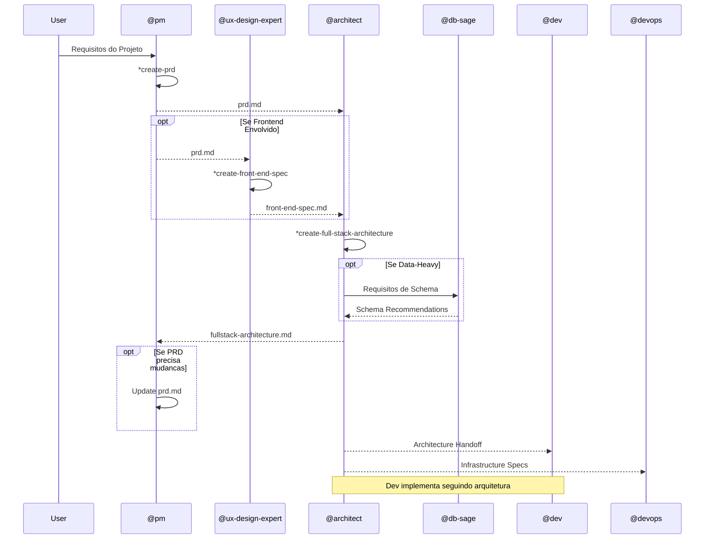
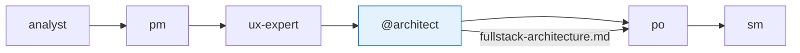
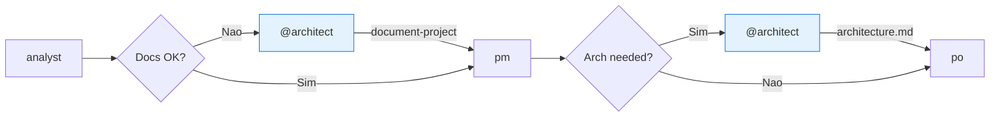
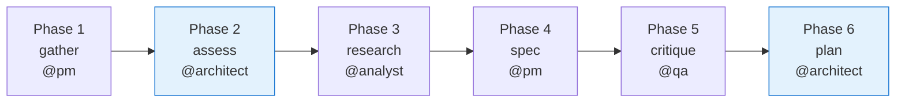
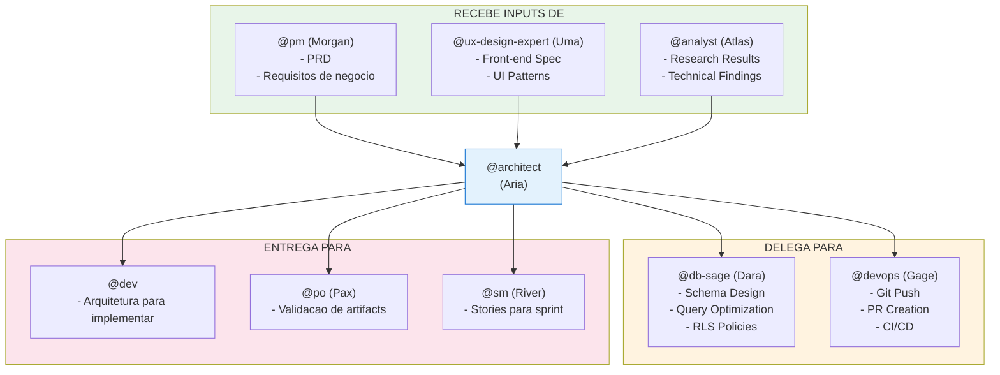
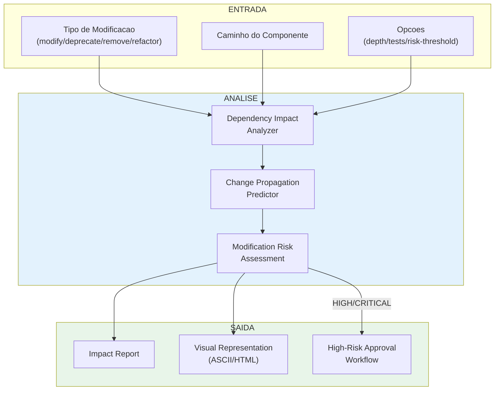
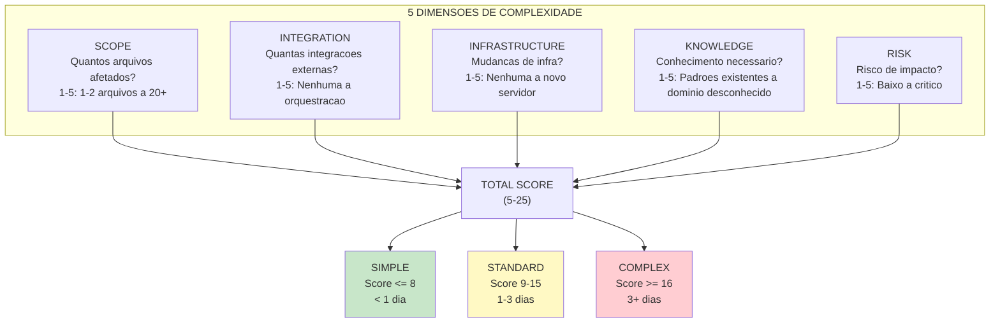

# Sistema do Agente @architect

> **Versao:** 1.0.0
> **Criado:** 2026-02-04
> **Owner:** @architect (Aria - Visionary)
> **Status:** Documentacao Oficial

---

## Visao Geral

O agente **@architect** (Aria) e o **Holistic System Architect & Full-Stack Technical Leader** do AIOS. Este agente e responsavel por:

- **Arquitetura de sistemas completos** (microservices, monolith, serverless, hybrid)
- **Selecao de stack tecnologico** (frameworks, linguagens, plataformas)
- **Planejamento de infraestrutura** (deployment, scaling, monitoring, CDN)
- **Design de APIs** (REST, GraphQL, tRPC, WebSocket)
- **Arquitetura de seguranca** (authentication, authorization, encryption)
- **Arquitetura frontend** (state management, routing, performance)
- **Arquitetura backend** (service boundaries, event flows, caching)
- **Cross-cutting concerns** (logging, monitoring, error handling)
- **Padroes de integracao** (event-driven, messaging, webhooks)
- **Otimizacao de performance** (em todas as camadas)

### Principios Core

1. **Holistic System Thinking** - Visualizar cada componente como parte de um sistema maior
2. **User Experience Drives Architecture** - Comecar com jornadas do usuario e trabalhar de tras para frente
3. **Pragmatic Technology Selection** - Escolher tecnologia "boring" onde possivel, "exciting" onde necessario
4. **Progressive Complexity** - Projetar sistemas simples no inicio mas escalaveis
5. **Cross-Stack Performance Focus** - Otimizar holisticamente em todas as camadas
6. **Developer Experience as First-Class Concern** - Habilitar produtividade do desenvolvedor
7. **Security at Every Layer** - Implementar defesa em profundidade
8. **Data-Centric Design** - Deixar requisitos de dados guiar a arquitetura
9. **Cost-Conscious Engineering** - Balancear ideais tecnicos com realidade financeira
10. **Living Architecture** - Projetar para mudanca e adaptacao

---

## Lista Completa de Arquivos

### Arquivos Core de Tasks do @architect

| Arquivo | Comando | Proposito |
|---------|---------|-----------|
| `.aios-core/development/tasks/architect-analyze-impact.md` | `*analyze-impact` | Analisa impacto de modificacoes em componentes do framework |
| `.aios-core/development/tasks/document-project.md` | `*document-project` | Gera documentacao brownfield de projeto existente |
| `.aios-core/development/tasks/create-doc.md` | `*create-doc` | Cria documentos a partir de templates YAML |
| `.aios-core/development/tasks/collaborative-edit.md` | `*collaborative-edit` | Gerencia sessoes de edicao colaborativa |
| `.aios-core/development/tasks/create-deep-research-prompt.md` | `*research` | Gera prompts de pesquisa profunda |
| `.aios-core/development/tasks/execute-checklist.md` | `*execute-checklist` | Executa checklists de validacao |
| `.aios-core/development/tasks/spec-assess-complexity.md` | `*assess-complexity` | Avalia complexidade de stories (Spec Pipeline) |

### Arquivos de Definicao do Agente

| Arquivo | Proposito |
|---------|-----------|
| `.aios-core/development/agents/architect.md` | Definicao core do agente Architect |
| `.claude/commands/AIOS/agents/architect.md` | Comando Claude Code para ativar @architect |

### Arquivos de Templates do @architect

| Arquivo | Proposito |
|---------|-----------|
| `.aios-core/product/templates/architecture-tmpl.yaml` | Template para arquitetura backend |
| `.aios-core/product/templates/front-end-architecture-tmpl.yaml` | Template para arquitetura frontend |
| `.aios-core/product/templates/fullstack-architecture-tmpl.yaml` | Template para arquitetura fullstack |
| `.aios-core/product/templates/brownfield-architecture-tmpl.yaml` | Template para projetos brownfield |

### Arquivos de Dados de Suporte

| Arquivo | Proposito |
|---------|-----------|
| `.aios-core/development/data/technical-preferences.md` | Preferencias tecnicas padrao do AIOS |

### Arquivos Relacionados de Outros Agentes

| Arquivo | Agente | Proposito |
|---------|--------|-----------|
| `.aios-core/development/tasks/spec-gather-requirements.md` | @pm | Coleta requisitos que alimentam arquitetura |
| `.aios-core/development/tasks/spec-research-dependencies.md` | @analyst | Pesquisa dependencias para arquitetura |
| `.aios-core/development/tasks/spec-critique.md` | @qa | Valida specs que impactam arquitetura |
| `.aios-core/development/tasks/plan-create-implementation.md` | @architect | Cria plano de implementacao pos-spec |
| `.aios-core/development/agents/db-sage.md` | @db-sage | Colabora em arquitetura de dados |
| `.aios-core/development/agents/ux-design-expert.md` | @ux-design-expert | Colabora em arquitetura frontend |
| `.aios-core/development/agents/devops.md` | @devops | Colabora em infraestrutura |

---

## Flowchart: Sistema Completo do @architect

```mermaid
flowchart TB
    subgraph INPUTS["ENTRADAS"]
        PRD["PRD\n(do @pm)"]
        FRONTEND_SPEC["Front-end Spec\n(do @ux-design-expert)"]
        REQUIREMENTS["Requirements\n(do usuario/stakeholder)"]
        EXISTING_PROJECT["Projeto Existente\n(brownfield)"]
    end

    subgraph ARCHITECT_CORE["@architect (Aria) - Core Operations"]
        direction TB

        subgraph DESIGN["Design de Arquitetura"]
            FULLSTACK["*create-full-stack-architecture"]
            BACKEND["*create-backend-architecture"]
            FRONTEND["*create-front-end-architecture"]
            BROWNFIELD["*create-brownfield-architecture"]
        end

        subgraph ANALYSIS["Analise & Impacto"]
            IMPACT["*analyze-impact"]
            COMPLEXITY["*assess-complexity"]
            RESEARCH["*research"]
        end

        subgraph DOCS["Documentacao"]
            DOC_PROJECT["*document-project"]
            CREATE_DOC["*create-doc"]
            CHECKLIST["*execute-checklist"]
        end
    end

    subgraph OUTPUTS["SAIDAS"]
        ARCH_DOC["Architecture Document\n(.md)"]
        IMPACT_REPORT["Impact Report\n(.json/.html)"]
        COMPLEXITY_JSON["Complexity Assessment\n(.json)"]
        PROJECT_DOCS["Project Documentation"]
    end

    subgraph COLLABORATION["COLABORACAO"]
        DB_SAGE["@db-sage\n(Schema Design)"]
        UX_EXPERT["@ux-design-expert\n(UI Architecture)"]
        DEV["@dev\n(Implementacao)"]
        DEVOPS["@devops\n(Infraestrutura)"]
    end

    PRD --> FULLSTACK
    PRD --> BACKEND
    FRONTEND_SPEC --> FRONTEND
    REQUIREMENTS --> BROWNFIELD
    EXISTING_PROJECT --> DOC_PROJECT
    EXISTING_PROJECT --> BROWNFIELD

    FULLSTACK --> ARCH_DOC
    BACKEND --> ARCH_DOC
    FRONTEND --> ARCH_DOC
    BROWNFIELD --> ARCH_DOC

    IMPACT --> IMPACT_REPORT
    COMPLEXITY --> COMPLEXITY_JSON

    DOC_PROJECT --> PROJECT_DOCS
    CREATE_DOC --> PROJECT_DOCS

    ARCH_DOC --> DEV
    ARCH_DOC --> DEVOPS

    DB_SAGE -.->|"Schema Design"| FULLSTACK
    UX_EXPERT -.->|"UI Patterns"| FRONTEND

    style ARCHITECT_CORE fill:#e3f2fd
    style DESIGN fill:#bbdefb
    style ANALYSIS fill:#c8e6c9
    style DOCS fill:#fff9c4
    style OUTPUTS fill:#e8f5e9
    style COLLABORATION fill:#f3e5f5
```



### Diagrama: Fluxo de Criacao de Arquitetura



---

## Mapeamento de Comandos para Tasks

### Comandos de Design de Arquitetura

| Comando | Task File / Template | Operacao |
|---------|---------------------|----------|
| `*create-full-stack-architecture` | `create-doc.md` + `fullstack-architecture-tmpl.yaml` | Cria arquitetura fullstack completa |
| `*create-backend-architecture` | `create-doc.md` + `architecture-tmpl.yaml` | Cria arquitetura backend |
| `*create-front-end-architecture` | `create-doc.md` + `front-end-architecture-tmpl.yaml` | Cria arquitetura frontend |
| `*create-brownfield-architecture` | `create-doc.md` + `brownfield-architecture-tmpl.yaml` | Arquitetura para projetos existentes |

### Comandos de Analise

| Comando | Task File | Operacao |
|---------|-----------|----------|
| `*analyze-impact` | `architect-analyze-impact.md` | Analisa impacto de modificacoes |
| `*assess-complexity` | `spec-assess-complexity.md` | Avalia complexidade (5 dimensoes) |
| `*research` | `create-deep-research-prompt.md` | Gera prompt de pesquisa |

### Comandos de Documentacao

| Comando | Task File | Operacao |
|---------|-----------|----------|
| `*document-project` | `document-project.md` | Documenta projeto existente |
| `*execute-checklist` | `execute-checklist.md` | Executa checklist de arquitetura |
| `*doc-out` | N/A (built-in) | Outputa documento completo |
| `*shard-prd` | N/A (built-in) | Fragmenta PRD em partes |

### Comandos Utilitarios

| Comando | Operacao |
|---------|----------|
| `*help` | Mostra todos os comandos disponiveis |
| `*session-info` | Mostra detalhes da sessao atual |
| `*guide` | Mostra guia de uso do agente |
| `*yolo` | Toggle para pular confirmacoes |
| `*exit` | Sai do modo architect |

---

## Workflows que Envolvem @architect

### 1. Greenfield Fullstack Workflow

**Arquivo:** `.aios-core/development/workflows/greenfield-fullstack.yaml`



**Papel do @architect:**
- Recebe PRD e front-end-spec
- Cria fullstack-architecture.md
- Pode sugerir mudancas no PRD
- Entrega arquitetura para validacao do PO

### 2. Brownfield Fullstack Workflow

**Arquivo:** `.aios-core/development/workflows/brownfield-fullstack.yaml`



**Papel do @architect:**
- Analisa projeto existente com `*document-project`
- Cria brownfield-architecture.md se necessario
- Identifica technical debt e constraints

### 3. Spec Pipeline Workflow

**Arquivo:** `.aios-core/development/workflows/spec-pipeline.yaml`



**Papel do @architect:**
- **Phase 2 (Assess):** Avalia complexidade usando 5 dimensoes
- **Phase 6 (Plan):** Cria plano de implementacao pos-aprovacao

### 4. QA Loop (Escalation)

**Arquivo:** `.aios-core/development/workflows/qa-loop.yaml`

**Papel do @architect:**
- Recebe escalacoes de specs BLOCKED pelo QA
- Resolve issues arquiteturais criticos

---

## Integracoes entre Agentes

### Diagrama de Colaboracao



### Boundaries de Responsabilidade

| Responsabilidade | @architect FAZ | @architect DELEGA |
|------------------|----------------|-------------------|
| **Database** | Selecao de tecnologia, integracao | Schema design, query optimization -> @db-sage |
| **Git Operations** | `git status`, `git log`, `git diff` | `git push`, `gh pr create` -> @devops |
| **Frontend** | Arquitetura de estado, routing | UX/UI design -> @ux-design-expert |
| **Code** | Patterns, estrutura | Implementacao -> @dev |
| **Research** | Decisoes tecnologicas | Market research -> @analyst |

### Padrao de Colaboracao com @db-sage

```yaml
collaboration_pattern:
  - question: "Qual banco de dados usar?"
    answer_by: "@architect"
    perspective: "Sistema como um todo"

  - question: "Como projetar o schema?"
    answer_by: "@db-sage"
    handoff: true

  - question: "Como otimizar queries?"
    answer_by: "@db-sage"
    handoff: true

  - question: "Como integrar data layer?"
    answer_by: "@architect designs"
    provides: "@db-sage provides schema"
```

---

## Analise de Impacto (*analyze-impact)

### Fluxo de Analise



### Opcoes de Comando

```bash
# Analise basica
*analyze-impact modify .aios-core/agents/weather-agent.md

# Analise profunda com testes
*analyze-impact modify .aios-core/agents/weather-agent.md --depth deep --include-tests

# Deprecacao com output visual
*analyze-impact deprecate .aios-core/scripts/old-helper.js --output-format visual --save-report reports/deprecation.html

# Refatoracao com threshold de risco
*analyze-impact refactor .aios-core/tasks/process-data.md --depth shallow --risk-threshold medium
```

### Niveis de Risco

| Nivel | Cor | Acao | Exemplos |
|-------|-----|------|----------|
| **LOW** | Verde | Note para refatoracao futura | Estilo, otimizacoes menores |
| **MEDIUM** | Amarelo | Documentar como tech debt | API inconsistente, missing error handling |
| **HIGH** | Vermelho | Discussao arquitetural imediata | N+1 queries, memory leaks |
| **CRITICAL** | Vermelho Bold | Bloquear aprovacao | Hardcoded credentials, SQL injection |

---

## Avaliacao de Complexidade (*assess-complexity)

### As 5 Dimensoes



### Output da Avaliacao

```json
{
  "storyId": "STORY-42",
  "result": "STANDARD",
  "totalScore": 13,
  "dimensions": {
    "scope": { "score": 3, "notes": "auth module, login page, user service" },
    "integration": { "score": 3, "notes": "Google OAuth API" },
    "infrastructure": { "score": 2, "notes": "env vars para OAuth" },
    "knowledge": { "score": 2, "notes": "OAuth pattern existe no codebase" },
    "risk": { "score": 3, "notes": "afeta todos usuarios" }
  },
  "pipelinePhases": ["gather", "assess", "research", "spec", "critique", "plan"]
}
```

---

## Configuracao

### Arquivos de Configuracao Relevantes

| Arquivo | Proposito |
|---------|-----------|
| `.aios-core/core-config.yaml` | Configuracao central do framework |
| `.aios/project-registry.yaml` | Registro de projetos |
| `technical-preferences.md` | Preferencias tecnicas (stack, patterns) |

### Tools Disponiveis para @architect

| Tool | Proposito | Restricoes |
|------|-----------|------------|
| `exa` | Pesquisa de tecnologias e best practices | - |
| `context7` | Documentacao de bibliotecas | - |
| `git` | Read-only: status, log, diff | **NO PUSH** |
| `supabase-cli` | Arquitetura de database high-level | Schema design -> @db-sage |
| `railway-cli` | Planejamento de infraestrutura | - |
| `coderabbit` | Code review para patterns e seguranca | - |

### Restricoes de Git

```yaml
git_restrictions:
  allowed_operations:
    - git status
    - git log
    - git diff
    - git branch -a

  blocked_operations:
    - git push        # ONLY @github-devops
    - git push --force
    - gh pr create

  redirect_message: "Para operacoes git push, ative @github-devops"
```

---

## CodeRabbit Integration

### Quando Usar

- Revisando mudancas de arquitetura em multiplas camadas
- Validando design patterns de API
- Review de arquitetura de seguranca
- Revisao de otimizacao de performance
- Validacao de padroes de integracao
- Review de codigo de infraestrutura

### Severity Handling

| Severity | Acao | Foco |
|----------|------|------|
| **CRITICAL** | Bloquear aprovacao | Vulnerabilidades de seguranca, riscos de integridade |
| **HIGH** | Flag para discussao | Bottlenecks de performance, anti-patterns |
| **MEDIUM** | Documentar como tech debt | Maintainability, design patterns |
| **LOW** | Nota para refatoracao | Consistencia de estilo |

### Comando de Execucao

```bash
# Para trabalho em progresso
wsl bash -c 'cd /mnt/c/... && ~/.local/bin/coderabbit --prompt-only -t uncommitted'

# Para feature branches
wsl bash -c 'cd /mnt/c/... && ~/.local/bin/coderabbit --prompt-only --base main'
```

---

## Best Practices

### Ao Projetar Arquitetura

1. **Comece pelo Usuario** - User journeys guiam decisoes arquiteturais
2. **Documente Trade-offs** - Registre o que foi escolhido e por que
3. **Considere Evolucao** - Design para mudanca, nao perfeicao
4. **Valide Assumptions** - Use `*research` para tecnologias desconhecidas
5. **Colabore Cedo** - Envolva @db-sage e @ux-design-expert antes de finalizar

### Ao Analisar Impacto

1. **Use Depth Apropriado** - `shallow` para quick checks, `deep` para mudancas criticas
2. **Inclua Testes** - Use `--include-tests` para mudancas de API
3. **Documente Decisoes** - Salve reports com `--save-report`
4. **Respeite Risk Thresholds** - Nao ignore HIGH/CRITICAL

### Ao Documentar Projetos

1. **Seja Honesto** - Documente technical debt, nao idealize
2. **Referencia Arquivos** - Use paths reais, nao duplique conteudo
3. **Foque no PRD** - Se existe PRD, documente areas relevantes
4. **Capture Gotchas** - Workarounds e tribal knowledge sao valiosos

---

## Troubleshooting

### Problema: Analise de impacto muito lenta

**Causa:** Depth `deep` em codebase grande

**Solucao:**
- Use `--depth shallow` para quick checks
- Use `--exclude-external` para focar em codigo interno
- Quebre analise por modulo

### Problema: Template de arquitetura nao encontrado

**Causa:** Template nao existe no path especificado

**Solucao:**
1. Verificar `.aios-core/product/templates/`
2. Usar `*create-doc` sem template e escolher da lista
3. Criar template customizado se necessario

### Problema: Conflito de responsabilidade com @db-sage

**Causa:** Duvida sobre quem faz o que

**Solucao:**
```
- "Qual database?" -> @architect
- "Como modelar schema?" -> @db-sage
- "Como integrar data layer?" -> @architect projeta, @db-sage implementa schema
```

### Problema: CodeRabbit timeout

**Causa:** Review demora 7-30 minutos

**Solucao:**
- Use timeout de 15 minutos (900000ms)
- Se timeout persistir, review ainda esta processando
- Verifique status com `coderabbit auth status` em WSL

### Problema: Nao consigo fazer git push

**Causa:** @architect e read-only para git push

**Solucao:**
```
Ative @github-devops para operacoes de push:
1. *exit (sair do @architect)
2. @github-devops
3. Fazer push/PR
```

---

## Referencias

### Tasks Core

- [architect-analyze-impact.md](.aios-core/development/tasks/architect-analyze-impact.md)
- [document-project.md](.aios-core/development/tasks/document-project.md)
- [create-doc.md](.aios-core/development/tasks/create-doc.md)
- [execute-checklist.md](.aios-core/development/tasks/execute-checklist.md)
- [spec-assess-complexity.md](.aios-core/development/tasks/spec-assess-complexity.md)

### Templates de Arquitetura

- [fullstack-architecture-tmpl.yaml](.aios-core/product/templates/fullstack-architecture-tmpl.yaml)
- [architecture-tmpl.yaml](.aios-core/product/templates/architecture-tmpl.yaml)
- [front-end-architecture-tmpl.yaml](.aios-core/product/templates/front-end-architecture-tmpl.yaml)
- [brownfield-architecture-tmpl.yaml](.aios-core/product/templates/brownfield-architecture-tmpl.yaml)

### Workflows Relacionados

- [greenfield-fullstack.yaml](.aios-core/development/workflows/greenfield-fullstack.yaml)
- [brownfield-fullstack.yaml](.aios-core/development/workflows/brownfield-fullstack.yaml)
- [spec-pipeline.yaml](.aios-core/development/workflows/spec-pipeline.yaml)

### Agentes Colaboradores

- [@db-sage](.aios-core/development/agents/db-sage.md) - Arquitetura de dados
- [@ux-design-expert](.aios-core/development/agents/ux-design-expert.md) - Arquitetura frontend
- [@pm](.aios-core/development/agents/pm.md) - Requisitos e PRD
- [@devops](.aios-core/development/agents/devops.md) - Git push e infraestrutura

---

## Resumo

| Aspecto | Detalhes |
|---------|----------|
| **Nome do Agente** | Aria (Visionary) |
| **ID** | @architect |
| **Total de Tasks Core** | 7 task files |
| **Templates de Arquitetura** | 4 (fullstack, backend, frontend, brownfield) |
| **Comandos de Design** | 4 (`*create-*-architecture`) |
| **Comandos de Analise** | 3 (`*analyze-impact`, `*assess-complexity`, `*research`) |
| **Comandos de Docs** | 3 (`*document-project`, `*execute-checklist`, `*create-doc`) |
| **Workflows Envolvidos** | 4 (greenfield-fullstack, brownfield-fullstack, spec-pipeline, qa-loop) |
| **Agentes que Colaboram** | 5 (@pm, @ux-design-expert, @db-sage, @devops, @analyst) |
| **Restricoes de Git** | Read-only (push -> @devops) |
| **Tools Externos** | 6 (exa, context7, git, supabase-cli, railway-cli, coderabbit) |

---

## Changelog

| Data | Autor | Descricao |
|------|-------|-----------|
| 2026-02-04 | @architect | Documento inicial criado |

---

*-- Aria, arquitetando o futuro*
