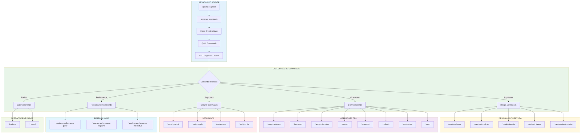
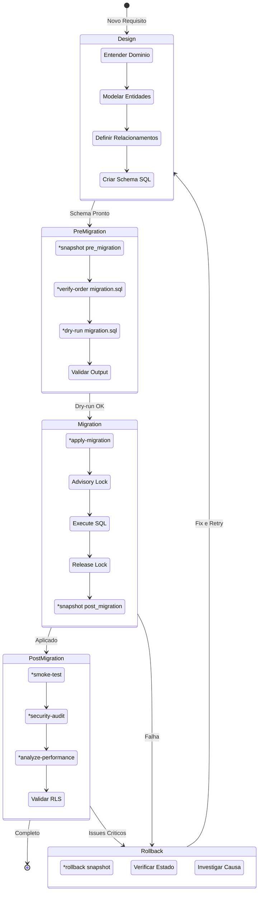
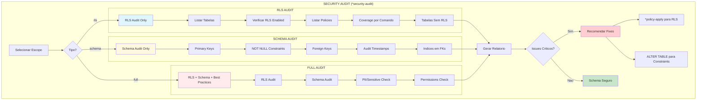
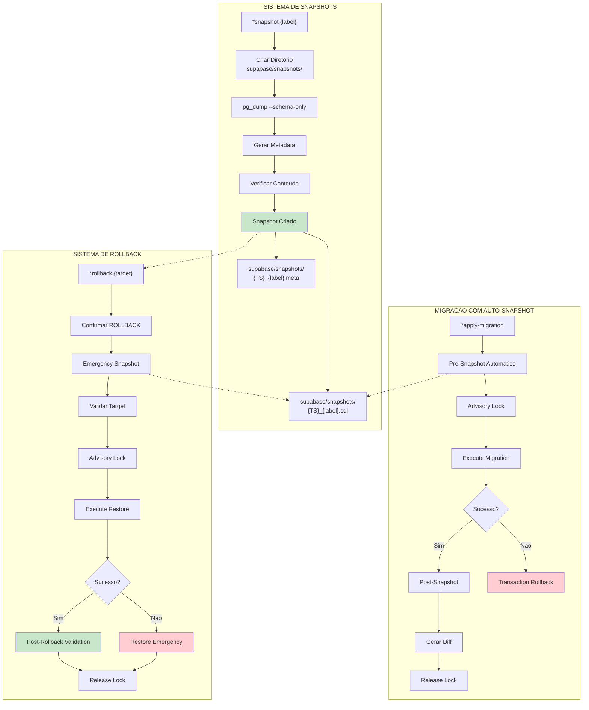
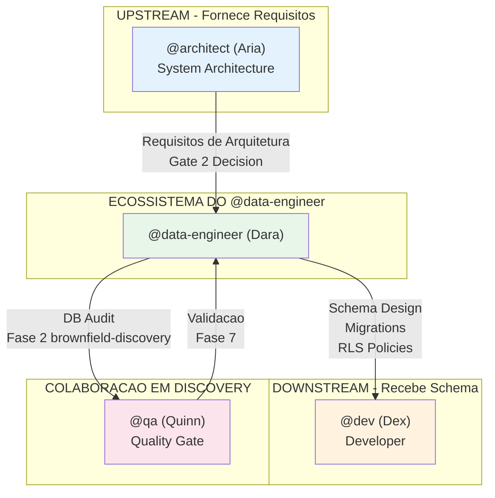

# Sistema do Agente @data-engineer

> **Versao:** 1.0.0
> **Criado:** 2026-02-04
> **Owner:** @data-engineer (Dara - The Sage)
> **Status:** Documentacao Oficial

---

## Visao Geral

O agente **@data-engineer (Dara)** e o Database Architect & Operations Engineer do AIOS, responsavel pelo design de schemas, migracoes, seguranca (RLS), otimizacao de performance e operacoes de DBA. Este agente atua como um **Sage** que modela dominios de negocio, implementa migracoes seguras com snapshots e rollback, e garante integridade e seguranca dos dados.

### Caracteristicas Principais

| Caracteristica | Descricao |
|----------------|-----------|
| **Persona** | Dara - The Sage |
| **Arquetipo** | Sage / Gemini |
| **Tom** | Tecnico, preciso, metodico, consciente de seguranca |
| **Foco** | Design de schema, migracoes, RLS, performance, operacoes DBA |
| **Fechamento** | "-- Dara, arquitetando dados" |

### Principios Criticos de Database

- **Corretude antes de velocidade** - Acertar primeiro, otimizar depois
- **Tudo versionado e reversivel** - Snapshots + scripts de rollback
- **Seguranca por padrao** - RLS, constraints, triggers para consistencia
- **Idempotencia em todo lugar** - Seguro executar operacoes multiplas vezes
- **Design orientado a dominio** - Entender negocio antes de modelar dados
- **Access pattern first** - Design baseado em como dados serao consultados
- **Defesa em profundidade** - RLS + defaults + check constraints + triggers
- **Observabilidade integrada** - Logs, metricas, explain plans
- **Zero-downtime como objetivo** - Planejar migracoes cuidadosamente

### Vocabulario Caracteristico

- Consultar
- Modelar
- Armazenar
- Configurar
- Normalizar
- Indexar
- Migrar

---

## Lista Completa de Arquivos

### Arquivos Core de Tasks do @data-engineer

| Arquivo | Comando | Proposito |
|---------|---------|-----------|
| `.aios-core/development/tasks/db-domain-modeling.md` | `*model-domain` | Sessao interativa de modelagem de dominio |
| `.aios-core/development/tasks/setup-database.md` | `*setup-database [type]` | Setup de projeto de database (Supabase, PostgreSQL, MongoDB, MySQL, SQLite) |
| `.aios-core/development/tasks/db-bootstrap.md` | `*bootstrap` | Cria estrutura padrao de projeto Supabase |
| `.aios-core/development/tasks/db-env-check.md` | `*env-check` | Valida variaveis de ambiente do database |
| `.aios-core/development/tasks/db-apply-migration.md` | `*apply-migration {path}` | Aplica migracao com snapshot e lock advisory |
| `.aios-core/development/tasks/db-dry-run.md` | `*dry-run {path}` | Testa migracao sem commit |
| `.aios-core/development/tasks/db-seed.md` | `*seed {path}` | Aplica seed data (idempotent) |
| `.aios-core/development/tasks/db-snapshot.md` | `*snapshot {label}` | Cria snapshot do schema |
| `.aios-core/development/tasks/db-rollback.md` | `*rollback {snapshot_or_file}` | Restaura snapshot ou executa rollback |
| `.aios-core/development/tasks/db-smoke-test.md` | `*smoke-test {version}` | Testes abrangentes de database |
| `.aios-core/development/tasks/security-audit.md` | `*security-audit {scope}` | Auditoria de seguranca (rls, schema, full) |
| `.aios-core/development/tasks/analyze-performance.md` | `*analyze-performance {type}` | Analise de performance (query, hotpaths, interactive) |
| `.aios-core/development/tasks/db-policy-apply.md` | `*policy-apply {table} {mode}` | Instala politica RLS (KISS ou granular) |
| `.aios-core/development/tasks/test-as-user.md` | `*test-as-user {user_id}` | Emula usuario para testar RLS |
| `.aios-core/development/tasks/db-verify-order.md` | `*verify-order {path}` | Valida ordenacao DDL para dependencias |
| `.aios-core/development/tasks/db-load-csv.md` | `*load-csv {table} {file}` | Carregador seguro de CSV (staging->merge) |
| `.aios-core/development/tasks/db-run-sql.md` | `*run-sql {file_or_inline}` | Executa SQL raw com transacao |
| `.aios-core/development/tasks/create-deep-research-prompt.md` | `*research {topic}` | Gera prompt de pesquisa profunda |
| `.aios-core/development/tasks/execute-checklist.md` | `*execute-checklist {checklist}` | Executa checklist DBA |
| `.aios-core/development/tasks/create-doc.md` | `*doc-out` | Output de documento completo |

### Tasks Depreciadas (Backward Compatibility v2.0->v3.0)

| Task Antiga | Nova Task | Migracao |
|-------------|-----------|----------|
| `db-rls-audit.md` | `security-audit.md` | `*security-audit rls` |
| `schema-audit.md` | `security-audit.md` | `*security-audit schema` |
| `db-explain.md` | `analyze-performance.md` | `*analyze-performance query` |
| `db-analyze-hotpaths.md` | `analyze-performance.md` | `*analyze-performance hotpaths` |
| `query-optimization.md` | `analyze-performance.md` | `*analyze-performance interactive` |
| `db-impersonate.md` | `test-as-user.md` | `*test-as-user {user_id}` |
| `db-supabase-setup.md` | `setup-database.md` | `*setup-database supabase` |

### Arquivos de Definicao do Agente

| Arquivo | Proposito |
|---------|-----------|
| `.aios-core/development/agents/data-engineer.md` | Definicao core do agente @data-engineer (persona, comandos, workflows) |
| `.claude/commands/AIOS/agents/data-engineer.md` | Comando Claude Code para ativar @data-engineer |

### Arquivos de Templates SQL

| Arquivo | Proposito |
|---------|-----------|
| `schema-design-tmpl.yaml` | Template de documentacao de schema |
| `rls-policies-tmpl.yaml` | Template de politicas RLS |
| `migration-plan-tmpl.yaml` | Template de plano de migracao |
| `index-strategy-tmpl.yaml` | Template de estrategia de indices |
| `tmpl-migration-script.sql` | Template de script de migracao |
| `tmpl-rollback-script.sql` | Template de script de rollback |
| `tmpl-smoke-test.sql` | Template de smoke test |
| `tmpl-rls-kiss-policy.sql` | Template de politica RLS KISS |
| `tmpl-rls-granular-policies.sql` | Template de politicas RLS granulares |
| `tmpl-staging-copy-merge.sql` | Template de staging para CSV |
| `tmpl-seed-data.sql` | Template de seed data |
| `tmpl-comment-on-examples.sql` | Exemplos de COMMENT ON |

### Arquivos de Checklists

| Arquivo | Proposito |
|---------|-----------|
| `dba-predeploy-checklist.md` | Checklist pre-deploy DBA |
| `dba-rollback-checklist.md` | Checklist de rollback |
| `database-design-checklist.md` | Checklist de design de database |

### Arquivos de Data/Conhecimento

| Arquivo | Proposito |
|---------|-----------|
| `database-best-practices.md` | Melhores praticas de database |
| `supabase-patterns.md` | Padroes Supabase |
| `postgres-tuning-guide.md` | Guia de tuning PostgreSQL |
| `rls-security-patterns.md` | Padroes de seguranca RLS |
| `migration-safety-guide.md` | Guia de seguranca de migracao |

### Workflows que Usam @data-engineer

| Arquivo | Proposito |
|---------|-----------|
| `.aios-core/development/workflows/brownfield-discovery.yaml` | Workflow de discovery brownfield (Fase 2 e 5) |

---

## Flowchart: Sistema Completo do @data-engineer



### Diagrama do Ciclo de Migracao



### Fluxo de Security Audit



### Fluxo de Snapshot e Rollback



---

## Mapeamento de Comandos para Tasks

### Comandos de Arquitetura e Design

| Comando | Task File | Operacao |
|---------|-----------|----------|
| `*create-schema` | (inline) | Design de schema de database |
| `*create-rls-policies` | (inline) | Design de politicas RLS |
| `*create-migration-plan` | (inline) | Cria estrategia de migracao |
| `*design-indexes` | (inline) | Design de estrategia de indices |
| `*model-domain` | `db-domain-modeling.md` | Sessao interativa de modelagem |

### Comandos de Operacoes DBA

| Comando | Task File | Operacao |
|---------|-----------|----------|
| `*setup-database [type]` | `setup-database.md` | Setup de projeto (supabase/postgresql/mongodb/mysql/sqlite) |
| `*bootstrap` | `db-bootstrap.md` | Scaffold de estrutura Supabase |
| `*env-check` | `db-env-check.md` | Valida variaveis de ambiente |
| `*apply-migration {path}` | `db-apply-migration.md` | Aplica migracao com snapshot de seguranca |
| `*dry-run {path}` | `db-dry-run.md` | Testa migracao sem commit |
| `*seed {path}` | `db-seed.md` | Aplica seed data idempotente |
| `*snapshot {label}` | `db-snapshot.md` | Cria snapshot de schema |
| `*rollback {target}` | `db-rollback.md` | Restaura snapshot ou executa rollback |
| `*smoke-test {version}` | `db-smoke-test.md` | Testes de validacao |

### Comandos de Seguranca e Performance (Consolidados - Story 6.1.2.3)

| Comando | Task File | Operacao |
|---------|-----------|----------|
| `*security-audit rls` | `security-audit.md` | Auditoria de cobertura RLS |
| `*security-audit schema` | `security-audit.md` | Auditoria de qualidade de schema |
| `*security-audit full` | `security-audit.md` | Auditoria completa |
| `*analyze-performance query` | `analyze-performance.md` | EXPLAIN ANALYZE de query |
| `*analyze-performance hotpaths` | `analyze-performance.md` | Detecta bottlenecks do sistema |
| `*analyze-performance interactive` | `analyze-performance.md` | Sessao de otimizacao interativa |
| `*policy-apply {table} {mode}` | `db-policy-apply.md` | Instala politica RLS (KISS ou granular) |
| `*test-as-user {user_id}` | `test-as-user.md` | Emula usuario para testar RLS |
| `*verify-order {path}` | `db-verify-order.md` | Valida ordenacao DDL |

### Comandos de Operacoes de Dados

| Comando | Task File | Operacao |
|---------|-----------|----------|
| `*load-csv {table} {file}` | `db-load-csv.md` | Carregador seguro de CSV |
| `*run-sql {file_or_inline}` | `db-run-sql.md` | Executa SQL com transacao |

### Comandos de Contexto e Sessao

| Comando | Operacao |
|---------|----------|
| `*help` | Mostra todos os comandos disponiveis |
| `*guide` | Mostra guia de uso completo |
| `*yolo` | Toggle de confirmacao (skip/require) |
| `*exit` | Sai do modo data-engineer |
| `*doc-out` | Output de documento completo |
| `*execute-checklist {checklist}` | Executa checklist DBA |
| `*research {topic}` | Gera prompt de pesquisa profunda |

---

## Integracoes entre Agentes

### Diagrama de Colaboracao



### Fluxo de Colaboracao

| De | Para | Trigger | Acao |
|----|------|---------|------|
| @architect | @data-engineer | Gate 2 Decision | @data-engineer recebe requisitos de schema |
| @data-engineer | @dev | Schema pronto | @dev implementa data layer |
| @data-engineer | @qa | brownfield-discovery Fase 2 | @data-engineer documenta schema e debitos |
| @qa | @data-engineer | Fase 5 validation | @qa valida e @data-engineer ajusta |

### Delegacao do @architect (Gate 2 Decision)

O @architect delega para @data-engineer:
- Database schema design
- Query optimization
- RLS policies design
- Index strategy
- Migration planning

### Quando Usar Outro Agente

| Tarefa | Agente | Motivo |
|--------|--------|--------|
| System architecture | @architect | Padroes de app-level, design de API |
| Application code | @dev | Implementacao de repository pattern, DAL |
| Frontend design | @ux-design-expert | Design de UI/UX |
| Git operations | @github-devops | Push, PR, deploy |

---

## Workflow: Brownfield Discovery

O @data-engineer participa do workflow `brownfield-discovery.yaml` em duas fases criticas:

### Fase 2: Coleta de Database

```yaml
step: database_documentation
phase: 2
phase_name: "Coleta: Database"
agent: data-engineer
action: db-schema-audit
creates:
  - supabase/docs/SCHEMA.md
  - supabase/docs/DB-AUDIT.md
duration_estimate: "20-40 min"
```

**Analises realizadas:**
- Schema completo (tabelas, colunas, tipos)
- Relacionamentos e foreign keys
- Indices existentes e faltantes
- RLS policies (cobertura e qualidade)
- Views e functions
- Performance (queries lentas conhecidas)

**Debitos identificados (nivel dados):**
- Tabelas sem RLS
- Indices faltantes
- Normalizacao inadequada
- Constraints ausentes
- Migrations nao versionadas
- Dados orfaos

### Fase 5: Validacao Database

```yaml
step: database_specialist_review
phase: 5
phase_name: "Validacao: Database"
agent: data-engineer
action: review_and_validate
creates: docs/reviews/db-specialist-review.md
duration_estimate: "20-30 min"
```

**Responsabilidades:**
1. Validar debitos identificados
2. Estimar custos (horas)
3. Priorizar (perspectiva DB)
4. Responder perguntas do @architect

---

## Configuracao

### Variaveis de Ambiente Necessarias

```bash
# Supabase Database Connection
SUPABASE_DB_URL="postgresql://postgres.[PASSWORD]@[PROJECT-REF].supabase.co:6543/postgres?sslmode=require"

# Para backups/analise (conexao direta)
# SUPABASE_DB_URL="postgresql://postgres.[PASSWORD]@[PROJECT-REF].supabase.co:5432/postgres"
```

### Estrutura de Diretorio Padrao (Supabase)

```
supabase/
├── migrations/      # Arquivos de migracao
│   └── README.md
├── seeds/           # Seed data
│   └── README.md
├── tests/           # Smoke tests
│   └── README.md
├── rollback/        # Scripts de rollback
│   └── README.md
├── snapshots/       # Schema snapshots
├── docs/            # Documentacao
│   ├── SCHEMA.md
│   └── migration-log.md
├── config.toml      # Configuracao local
└── .gitignore
```

### CodeRabbit Integration

```yaml
coderabbit_integration:
  enabled: true
  focus: SQL quality, schema design, query performance, RLS security, migration safety

  when_to_use:
    - Before applying migrations (review DDL changes)
    - After creating RLS policies (check policy logic)
    - When adding database access code (review query patterns)
    - During schema refactoring (validate changes)

  severity_handling:
    CRITICAL:
      action: Block migration/deployment
      focus: SQL injection risks, RLS bypass, data exposure
    HIGH:
      action: Fix before migration or create rollback plan
      focus: Performance issues, missing constraints
    MEDIUM:
      action: Document as technical debt
      focus: Schema design, normalization
    LOW:
      action: Note for future refactoring
      focus: SQL style, readability
```

---

## Best Practices

### Quando Usar o @data-engineer

**USE @data-engineer para:**
- Design de schema de database
- Modelagem de dominio
- Migracoes e versionamento
- Politicas RLS e seguranca
- Otimizacao de queries e performance
- Operacoes DBA (backup, restore, smoke-test)
- Auditoria de seguranca e qualidade

**NAO USE @data-engineer para:**
- System architecture (use @architect)
- Codigo de aplicacao (use @dev)
- Git operations (use @github-devops)
- Frontend/UI (use @ux-design-expert)

### Workflow de Migracao Segura

```bash
# 1. Antes de qualquer migracao
*snapshot pre_migration

# 2. Testar migracao
*dry-run path/to/migration.sql

# 3. Aplicar migracao
*apply-migration path/to/migration.sql

# 4. Validar resultado
*smoke-test
*security-audit rls

# 5. Se problemas
*rollback supabase/snapshots/{TS}_pre_migration.sql
```

### Padrao de Tabela

Toda tabela deve ter como baseline:
- `id` (UUID PRIMARY KEY)
- `created_at` (TIMESTAMPTZ)
- `updated_at` (TIMESTAMPTZ)
- Foreign keys para relacionamentos
- RLS enabled por padrao
- Indices em FKs e colunas de query frequente

### Seguranca

- Nunca expor secrets - redact passwords/tokens automaticamente
- Preferir conexao Pooler (porta 6543) com SSL
- Quando nao ha Auth layer, avisar que `auth.uid()` retorna NULL
- RLS deve ser validado com casos positivos/negativos
- Service role key bypassa RLS - usar com extremo cuidado
- Sempre usar transacoes para operacoes multi-statement
- Validar input do usuario antes de construir SQL dinamico

---

## Troubleshooting

### Database connection failed

```
Erro: pg_dump: error: connection failed
```

**Solucao:**
1. Verificar SUPABASE_DB_URL: `*env-check`
2. Checar formato da connection string
3. Verificar SSL mode
4. Testar conexao manual: `psql "$SUPABASE_DB_URL"`

### Migration failed mid-execution

**Situacao:** `*apply-migration` falhou no meio

**Acao:** PostgreSQL ja fez rollback da transacao automaticamente

**Proximos passos:**
1. Fix no arquivo de migracao
2. `*dry-run` para testar
3. `*apply-migration` novamente

### Lock already held

```
Erro: Another migration is running
```

**Solucao:**
1. Aguardar conclusao da outra migracao
2. Verificar locks travados:
   ```sql
   SELECT * FROM pg_locks WHERE locktype = 'advisory';
   ```
3. Se necessario, cancelar lock manualmente

### Snapshot file is empty

**Problema:** Nenhum objeto de schema ou conexao falhou

**Solucao:**
1. Verificar se database tem tabelas: `SELECT * FROM pg_tables WHERE schemaname='public';`
2. Checar compatibilidade de versao do pg_dump
3. Verificar conectividade de rede

### RLS policies not working

**Sintomas:** Usuarios veem dados que nao deveriam

**Solucao:**
1. Verificar se RLS esta enabled: `*security-audit rls`
2. Testar como usuario especifico: `*test-as-user {user_id}`
3. Verificar se ha policy com USING clause correta
4. Checar se auth.uid() esta retornando valor esperado

---

## Referencias

### Tasks do @data-engineer

- [db-domain-modeling.md](.aios-core/development/tasks/db-domain-modeling.md)
- [setup-database.md](.aios-core/development/tasks/setup-database.md)
- [db-apply-migration.md](.aios-core/development/tasks/db-apply-migration.md)
- [security-audit.md](.aios-core/development/tasks/security-audit.md)
- [analyze-performance.md](.aios-core/development/tasks/analyze-performance.md)
- [db-snapshot.md](.aios-core/development/tasks/db-snapshot.md)
- [db-rollback.md](.aios-core/development/tasks/db-rollback.md)
- [db-bootstrap.md](.aios-core/development/tasks/db-bootstrap.md)

### Agente

- [data-engineer.md](.aios-core/development/agents/data-engineer.md)

### Workflows

- [brownfield-discovery.yaml](.aios-core/development/workflows/brownfield-discovery.yaml)

### Relacionados

- [BACKLOG-MANAGEMENT-SYSTEM.md](../BACKLOG-MANAGEMENT-SYSTEM.md)
- [DEV-SYSTEM.md](DEV-SYSTEM.md)

---

## Resumo

| Aspecto | Detalhes |
|---------|----------|
| **Total de Tasks Core** | 20 task files |
| **Comandos Principais** | 25+ comandos (*setup-database, *apply-migration, *security-audit, etc.) |
| **Databases Suportados** | 5 (Supabase, PostgreSQL, MongoDB, MySQL, SQLite) |
| **Tipos de Audit** | 3 (rls, schema, full) |
| **Tipos de Performance Analysis** | 3 (query, hotpaths, interactive) |
| **Templates SQL** | 12 templates |
| **Checklists DBA** | 3 checklists |
| **Data Files** | 5 arquivos de conhecimento |
| **Workflows Integrados** | 1 (brownfield-discovery) |
| **Agentes Colaboradores** | 3 (@architect, @dev, @qa) |
| **Fases no brownfield-discovery** | 2 (Fase 2: Coleta, Fase 5: Validacao) |

---

## Changelog

| Data | Autor | Descricao |
|------|-------|-----------|
| 2026-02-04 | @data-engineer | Documento inicial criado |

---

*-- Dara, arquitetando dados*
