# Sistema do Agente @sm

> **Versao:** 1.0.0
> **Criado:** 2026-02-04
> **Owner:** @sm (River - Facilitator)
> **Status:** Documentacao Oficial

---

## Visao Geral

O agente **@sm (River)** e o Scrum Master tecnico do AIOS, especializado em preparacao de stories e facilitacao de processos ageis. Seu papel principal e criar stories detalhadas e acionaveis que agentes desenvolvedores possam implementar com minima necessidade de pesquisa adicional.

**Responsabilidades Principais:**
- Criacao e refinamento de user stories
- Gerenciamento de epics e breakdown de requisitos
- Facilitacao de sprint planning
- Orientacao sobre processos ageis
- Preparacao de handoffs para desenvolvedores
- Gerenciamento de branches locais durante desenvolvimento

**Arquetipo:** Facilitator (Pisces)
**Tom de Comunicacao:** Empatico, colaborativo, fluido
**Vocabulario-Chave:** adaptar, pivotar, ajustar, simplificar, conectar, fluir, remover

---

## Lista Completa de Arquivos

### Arquivos Core de Tasks do @sm

| Arquivo | Comando | Proposito |
|---------|---------|-----------|
| `.aios-core/development/tasks/sm-create-next-story.md` | `*draft` | Task principal para criar proxima story do backlog |
| `.aios-core/development/tasks/create-next-story.md` | `*draft` | Versao completa da task de criacao de story |
| `.aios-core/development/tasks/execute-checklist.md` | `*story-checklist` | Executa checklist de validacao de story draft |
| `.aios-core/development/tasks/correct-course.md` | `*correct-course` | Analisa e corrige desvios de processo |
| `.aios-core/development/tasks/collaborative-edit.md` | - | Edicao colaborativa de documentos |
| `.aios-core/development/tasks/init-project-status.md` | - | Inicializacao de status do projeto |

### Arquivos de Definicao do Agente

| Arquivo | Proposito |
|---------|-----------|
| `.aios-core/development/agents/sm.md` | Definicao core do agente SM |
| `.claude/commands/AIOS/agents/sm.md` | Comando Claude Code para ativar @sm |
| `.cursor/rules/sm.md` | Regras para Cursor IDE |
| `.cursor/rules/sm.mdc` | Regras compiladas para Cursor |

### Arquivos de Checklists Utilizados

| Arquivo | Proposito |
|---------|-----------|
| `.aios-core/product/checklists/story-draft-checklist.md` | Valida qualidade e completude de story drafts |
| `.aios-core/product/checklists/story-dod-checklist.md` | Definition of Done para stories |
| `.aios-core/product/checklists/change-checklist.md` | Navegacao de mudancas e correcao de curso |
| `.aios-core/product/checklists/po-master-checklist.md` | Checklist mestre usado em validacao |

### Arquivos Relacionados de Outros Agentes

| Arquivo | Agente | Proposito |
|---------|--------|-----------|
| `.aios-core/development/agents/po.md` | @po | Coordena com @sm em backlog e sprint planning |
| `.aios-core/development/agents/dev.md` | @dev | Recebe stories do @sm para implementacao |
| `.aios-core/development/agents/pm.md` | @pm | Cria epics que @sm quebra em stories |
| `.aios-core/development/agents/devops.md` | @github-devops | Recebe stories completas para push/PR |
| `.aios-core/development/agents/qa.md` | @qa | Coordena em risk profiling |

### Arquivos de Workflows que Utilizam @sm

| Arquivo | Proposito |
|---------|-----------|
| `.aios-core/development/workflows/story-development-cycle.yaml` | Ciclo completo de desenvolvimento de stories |
| `.aios-core/development/workflows/greenfield-fullstack.yaml` | Workflow greenfield full-stack |
| `.aios-core/development/workflows/greenfield-service.yaml` | Workflow greenfield service |
| `.aios-core/development/workflows/greenfield-ui.yaml` | Workflow greenfield UI |
| `.aios-core/development/workflows/brownfield-fullstack.yaml` | Workflow brownfield full-stack |
| `.aios-core/development/workflows/brownfield-service.yaml` | Workflow brownfield service |
| `.aios-core/development/workflows/brownfield-ui.yaml` | Workflow brownfield UI |

### Arquivos de Configuracao

| Arquivo | Proposito |
|---------|-----------|
| `.aios-core/core-config.yaml` | Configuracao central (devStoryLocation, etc.) |
| `.aios-core/development/scripts/greeting-builder.js` | Script de saudacao inteligente |
| `.aios-core/development/scripts/agent-assignment-resolver.js` | Resolucao de assignment de agentes |

---

## Flowchart: Sistema Completo do @sm

```mermaid
flowchart TB
    subgraph INPUTS["📥 INPUTS"]
        PRD["📄 PRD/Epic<br/>(from @pm)"]
        BACKLOG["📋 Backlog Priorizado<br/>(from @po)"]
        ARCH["🏗️ Arquitetura<br/>(docs/architecture/)"]
    end

    subgraph SM_AGENT["🌊 @sm (River) - Scrum Master"]
        direction TB

        subgraph COMMANDS["Comandos Disponiveis"]
            DRAFT["*draft<br/>Criar proxima story"]
            CHECKLIST["*story-checklist<br/>Validar story draft"]
            CORRECT["*correct-course<br/>Corrigir desvios"]
            GUIDE["*guide<br/>Guia de uso"]
            HELP["*help<br/>Listar comandos"]
        end

        subgraph PROCESS["Processo de Criacao"]
            LOAD_CONFIG["1. Carregar core-config.yaml"]
            IDENTIFY_STORY["2. Identificar proxima story"]
            GATHER_REQS["3. Coletar requisitos"]
            GATHER_ARCH["4. Contexto de arquitetura"]
            VERIFY_STRUCTURE["5. Verificar alinhamento"]
            POPULATE["6. Popular template"]
            VALIDATE["7. Executar checklist"]
        end
    end

    PRD --> IDENTIFY_STORY
    BACKLOG --> IDENTIFY_STORY
    ARCH --> GATHER_ARCH

    DRAFT --> LOAD_CONFIG
    LOAD_CONFIG --> IDENTIFY_STORY
    IDENTIFY_STORY --> GATHER_REQS
    GATHER_REQS --> GATHER_ARCH
    GATHER_ARCH --> VERIFY_STRUCTURE
    VERIFY_STRUCTURE --> POPULATE
    POPULATE --> VALIDATE

    VALIDATE --> STORY_FILE["📄 docs/stories/epic-X/<br/>STORY-X.Y.md"]
    VALIDATE --> CLICKUP["🔗 ClickUp Task<br/>(sync automatico)"]

    subgraph OUTPUTS["📤 OUTPUTS"]
        STORY_FILE
        CLICKUP
        HANDOFF["🎯 Handoff para @dev"]
    end

    STORY_FILE --> HANDOFF
    CLICKUP --> HANDOFF

    subgraph COLLABORATION["👥 COLABORACAO"]
        DEV_AGENT["@dev (Dex)<br/>Recebe stories"]
        PO_AGENT["@po (Pax)<br/>Valida stories"]
        DEVOPS_AGENT["@github-devops (Gage)<br/>Push/PR apos conclusao"]
    end

    HANDOFF --> DEV_AGENT
    STORY_FILE --> PO_AGENT
    DEV_AGENT -->|"Story completa"| DEVOPS_AGENT

    style SM_AGENT fill:#e3f2fd
    style INPUTS fill:#fff3e0
    style OUTPUTS fill:#e8f5e9
    style COLLABORATION fill:#fce4ec
    style COMMANDS fill:#bbdefb
    style PROCESS fill:#c5cae9
```



### Diagrama do Ciclo de Desenvolvimento de Stories


### Diagrama de Gerenciamento de Branches


---

## Mapeamento de Comandos para Tasks

| Comando | Task File | Operacao |
|---------|-----------|----------|
| `*draft` | `sm-create-next-story.md` / `create-next-story.md` | Cria proxima story do backlog |
| `*story-checklist` | `execute-checklist.md` | Executa `story-draft-checklist.md` |
| `*correct-course` | `correct-course.md` | Analisa e corrige desvios de processo |
| `*help` | (built-in) | Mostra comandos disponiveis |
| `*guide` | (built-in) | Mostra guia de uso do agente |
| `*session-info` | (built-in) | Mostra detalhes da sessao atual |
| `*exit` | (built-in) | Sai do modo Scrum Master |

---

## Integracoes entre Agentes

### Fluxo de Integracao

```mermaid
flowchart TB
    subgraph UPSTREAM["⬆️ UPSTREAM - Fornece para @sm"]
        PM_UP["@pm (Morgan)<br/>Cria estrutura de epics"]
        PO_UP["@po (Pax)<br/>Prioriza backlog"]
        ANALYST_UP["@analyst (Sage)<br/>Pesquisa e insights"]
    end

    SM_CENTRAL["🌊 @sm (River)<br/>Scrum Master"]

    subgraph DOWNSTREAM["⬇️ DOWNSTREAM - Recebe de @sm"]
        DEV_DOWN["@dev (Dex)<br/>Implementa stories"]
        PO_DOWN["@po (Pax)<br/>Valida stories"]
        QA_DOWN["@qa (Quinn)<br/>Risk profiling"]
    end

    subgraph LATERAL["↔️ LATERAL - Coordena com @sm"]
        DEVOPS_LAT["@github-devops (Gage)<br/>Push/PR workflow"]
    end

    PM_UP -->|"Epic structure"| SM_CENTRAL
    PO_UP -->|"Backlog priorizado"| SM_CENTRAL
    ANALYST_UP -->|"Insights tecnicos"| SM_CENTRAL

    SM_CENTRAL -->|"Stories prontas"| DEV_DOWN
    SM_CENTRAL -->|"Stories para validacao"| PO_DOWN
    SM_CENTRAL -->|"Request risk profiling"| QA_DOWN

    SM_CENTRAL <-->|"Sprint workflow"| DEVOPS_LAT

    style SM_CENTRAL fill:#87CEEB
    style UPSTREAM fill:#fff3e0
    style DOWNSTREAM fill:#e8f5e9
    style LATERAL fill:#fce4ec
```



### Matriz de Colaboracao

| Agente | Relacionamento | Acao |
|--------|----------------|------|
| **@pm (Morgan)** | Recebe de | Epic structure, PRD shardado |
| **@po (Pax)** | Coordena com | Backlog prioritization, sprint planning |
| **@dev (Dex)** | Entrega para | Stories prontas para implementacao |
| **@qa (Quinn)** | Solicita | Risk profiling para stories |
| **@github-devops (Gage)** | Delega para | Push branches, criar PRs |
| **@analyst (Sage)** | Consulta | Pesquisa e insights tecnicos |

### Delegacao para @github-devops

O @sm gerencia APENAS operacoes locais de Git. Para operacoes remotas, **sempre** delegar para @github-devops:

**Operacoes Permitidas para @sm:**
- `git checkout -b feature/X.Y-story-name` - Criar branch local
- `git branch` - Listar branches
- `git branch -d branch-name` - Deletar branch local
- `git checkout branch-name` - Trocar de branch
- `git merge branch-name` - Merge local

**Operacoes Bloqueadas (usar @github-devops):**
- `git push` - Enviar para remoto
- `git push origin --delete` - Deletar branch remoto
- `gh pr create` - Criar Pull Request

---

## Configuracao

### core-config.yaml (Chaves Relevantes)

```yaml
# Localizacao de stories
devStoryLocation: docs/stories

# PRD Shardado ou Monolitico
prdSharded: true
prdShardedLocation: docs/prd/epics

# Arquitetura
architectureVersion: v4
architectureSharded: true
architectureShardedLocation: docs/architecture

# QA
qaLocation: docs/qa

# CodeRabbit Integration
coderabbit_integration:
  enabled: true  # Controla se @sm popula secao CodeRabbit nas stories
```

### Dependencies do Agente

```yaml
dependencies:
  tasks:
    - create-next-story.md
    - execute-checklist.md
    - correct-course.md
  templates:
    - story-tmpl.yaml
  checklists:
    - story-draft-checklist.md
  tools:
    - git               # Local branch operations only
    - clickup           # Track sprint progress
    - context7          # Research technical requirements
```

---

## Best Practices

### Criacao de Stories

1. **Sempre comece do PRD/Epic** - Nao invente requisitos
2. **Inclua referencias com citacoes** - `[Source: architecture/tech-stack.md#database]`
3. **Popule Dev Notes completamente** - Contexto tecnico extraido da arquitetura
4. **Execute checklist apos criacao** - `*story-checklist` valida qualidade
5. **Nao assuma informacoes** - Se nao encontrar, declare "No specific guidance found"

### Gerenciamento de Branches

1. **Use naming convention** - `feature/X.Y-story-name` (X.Y = epic.story)
2. **Crie branch ao iniciar story** - Isola desenvolvimento
3. **Nao tente push** - Sempre delegar para @github-devops
4. **Resolva conflitos localmente** - Antes de pedir push

### Colaboracao com Outros Agentes

1. **Respeite limites** - Nao implemente codigo, nao crie PRs
2. **Documente handoffs** - Deixe claro o que @dev precisa fazer
3. **Coordene com @po** - Backlog prioritization antes de criar stories
4. **Notifique @github-devops** - Quando story estiver pronta para push

### Validacao de Stories

1. **Execute checklist** - `*story-checklist` apos criacao
2. **Revise todos os 6 criterios** - Goal, Technical, References, Self-Containment, Testing, CodeRabbit
3. **Corrija antes de handoff** - Stories incompletas bloqueiam @dev
4. **Documente desvios** - Se houver conflitos entre epic e arquitetura

---

## Troubleshooting

### Story nao encontrada no ClickUp

**Sintoma:** Epic verificacao falha em Step 5.1

**Solucao:**
1. Verificar se Epic existe no ClickUp Backlog list
2. Confirmar tags: `epic`, `epic-{epicNum}`
3. Status deve ser "Planning" ou "In Progress"
4. Criar Epic manualmente se necessario:
   ```
   Name: 'Epic {epicNum}: {Epic Title}'
   List: Backlog
   Tags: ['epic', 'epic-{epicNum}']
   Status: Planning
   ```

### core-config.yaml nao encontrado

**Sintoma:** Task halts com mensagem de arquivo nao encontrado

**Solucao:**
1. Copiar de `GITHUB aios-core/core-config.yaml`
2. Ou executar AIOS installer: `npm run aios:install`
3. Configurar `devStoryLocation`, `prdSharded`, etc.

### Checklist retorna FAIL em multiplas categorias

**Sintoma:** Story draft com varios problemas de validacao

**Solucao:**
1. Revisar arquivos de arquitetura referenciados
2. Verificar se PRD/Epic esta completo
3. Usar file fallback strategy para arquivos alternativos
4. Adicionar notas em Dev Notes sobre gaps

### Branch local nao sincronizado

**Sintoma:** Merge conflicts ao tentar integrar

**Solucao:**
1. Fazer `git fetch origin` para atualizar referencias
2. Merge branch base localmente: `git merge main`
3. Resolver conflitos antes de pedir push para @github-devops

### CodeRabbit section nao aparece na story

**Sintoma:** Story criada sem secao de integracao CodeRabbit

**Causa:** `coderabbit_integration.enabled: false` em core-config.yaml

**Solucao:**
1. Verificar `core-config.yaml`
2. Se intencional, story tera notice de skip
3. Para habilitar, set `coderabbit_integration.enabled: true`

---

## Referencias

### Arquivos do Agente
- [Agent: sm.md](.aios-core/development/agents/sm.md)
- [Task: create-next-story.md](.aios-core/development/tasks/create-next-story.md)
- [Task: execute-checklist.md](.aios-core/development/tasks/execute-checklist.md)
- [Task: correct-course.md](.aios-core/development/tasks/correct-course.md)

### Checklists
- [Checklist: story-draft-checklist.md](.aios-core/product/checklists/story-draft-checklist.md)
- [Checklist: story-dod-checklist.md](.aios-core/product/checklists/story-dod-checklist.md)
- [Checklist: change-checklist.md](.aios-core/product/checklists/change-checklist.md)

### Workflows
- [Workflow: story-development-cycle.yaml](.aios-core/development/workflows/story-development-cycle.yaml)
- [Workflow: greenfield-fullstack.yaml](.aios-core/development/workflows/greenfield-fullstack.yaml)
- [Workflow: brownfield-fullstack.yaml](.aios-core/development/workflows/brownfield-fullstack.yaml)

### Configuracao
- [Core Config](../.aios-core/core-config.yaml)

### Documentacao Relacionada
- [Backlog Management System](../BACKLOG-MANAGEMENT-SYSTEM.md)

---

## Resumo

| Aspecto | Detalhes |
|---------|----------|
| **Agente** | @sm (River) - Scrum Master |
| **Arquetipo** | Facilitator (Pisces) |
| **Total de Task Files** | 6 tasks core |
| **Comandos Disponiveis** | 7 (`*draft`, `*story-checklist`, `*correct-course`, `*help`, `*guide`, `*session-info`, `*exit`) |
| **Checklists Utilizados** | 4 checklists |
| **Workflows que Usam @sm** | 7 workflows |
| **Ferramentas** | git (local), clickup, context7 |
| **Colabora com** | @pm, @po, @dev, @qa, @github-devops, @analyst |
| **Delega para** | @github-devops (operacoes remotas) |
| **Responsabilidade Principal** | Criacao de stories detalhadas e acionaveis |

---

## Changelog

| Data | Autor | Descricao |
|------|-------|-----------|
| 2026-02-04 | @dev | Documento inicial criado |

---

*-- River, removendo obstaculos*
