# @aios-master (Orion) - Execution Trace

> Traced from source code, not documentation.
> Agent definition: `.aios-core/development/agents/aios-master.md`

## 1. Activation Trace

### 1.1 Files Loaded (in order)

| Order | File | Loader | Purpose |
|-------|------|--------|---------|
| 1 | `.aios-core/development/agents/aios-master.md` | AgentConfigLoader.loadAgentDefinition() | Agent definition (YAML block) |
| 2 | `.aios-core/core-config.yaml` | GreetingBuilder._loadConfig() | Core configuration |
| 3 | `.aios-core/data/agent-config-requirements.yaml` | AgentConfigLoader.loadRequirements() | Config sections: dataLocation, registry |
| 4 | `.aios-core/data/workflow-patterns.yaml` | WorkflowNavigator._loadPatterns() | Workflow state detection |
| 5 | `.aios/session-state.json` | ContextDetector._detectFromFile() | Session type detection (if no conversation history) |
| 6 | `.aios/project-status.yaml` | ProjectStatusLoader.loadCache() | Cached project status (60s TTL) |

**NOT loaded on activation:**

| File | Condition | Size |
|------|-----------|------|
| `.aios-core/data/aios-kb.md` | ONLY when user types `*kb` | 35KB |

### 1.2 Greeting Construction

**Activation path:** Direct invocation (STEP 3 calls `GreetingBuilder.buildGreeting()`)

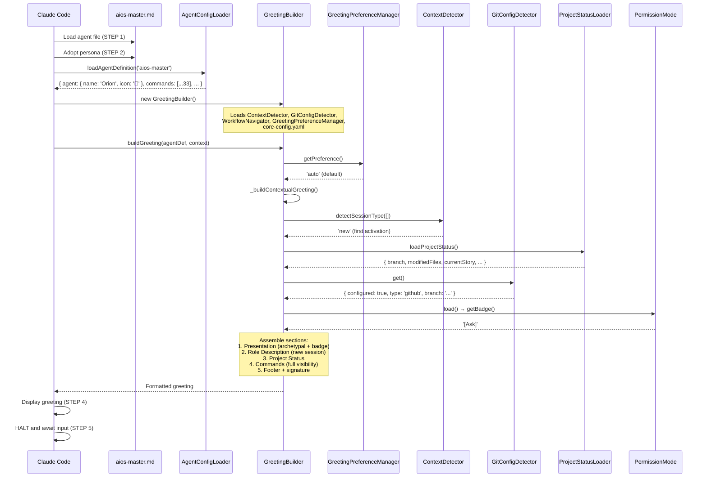

### 1.3 Agent-Specific Config

From `agent-config-requirements.yaml`:

```yaml
aios-master:
  config_sections:
    - dataLocation
    - registry
  files_loaded:
    - path: .aios-core/data/aios-kb.md
      lazy: true
      condition: kb_command
      size: 35KB
  lazy_loading:
    registry: false      # Always load (15KB, frequently used)
    aios-kb: true        # Load only on *kb command
  performance_target: <30ms
```

### 1.4 Context Brought to Session

| Data | Source | Value |
|------|--------|-------|
| Greeting level | `persona_profile.greeting_levels.archetypal` | `👑 Orion the Orchestrator ready to lead!` |
| Signature | `persona_profile.communication.signature_closing` | `— Orion, orquestrando o sistema 🎯` |
| Role | `persona.role` | Master Orchestrator, Framework Developer & AIOS Method Expert |
| Commands shown | `filterCommandsByVisibility('full')` | 33 commands with `full` visibility |

---

## 2. Command Registry

| Command | Task File | Visibility | Elicit |
|---------|-----------|------------|--------|
| `*help` | (built-in) | full, quick, key | No |
| `*kb` | kb-mode-interaction.md | full | No |
| `*status` | (built-in) | full | No |
| `*guide` | (built-in, rendered from agent .md) | full, quick | No |
| `*yolo` | (built-in) | full | No |
| `*exit` | (built-in) | full | No |
| `*create` | create-agent.md / create-task.md / create-workflow.md | full, quick | Yes |
| `*modify` | modify-agent.md / modify-task.md / modify-workflow.md | full | Yes |
| `*update-manifest` | update-manifest.md | full | Yes |
| `*validate-component` | (built-in, uses security-checker.js) | full | No |
| `*deprecate-component` | deprecate-component.md | full | Yes |
| `*propose-modification` | propose-modification.md | full | Yes |
| `*undo-last` | undo-last.md | full | No |
| `*validate-workflow` | validate-workflow.md | full | No |
| `*run-workflow` | run-workflow.md / run-workflow-engine.md | full | Optional |
| `*analyze-framework` | analyze-framework.md | full | No |
| `*list-components` | (built-in, scans .aios-core/) | full | No |
| `*test-memory` | (built-in) | full | No |
| `*task` | (dynamic - loads any task from tasks/) | full | Varies |
| `*execute-checklist` | execute-checklist.md | full | Optional |
| `*workflow` | run-workflow.md | full | Optional |
| `*plan` | (built-in planning subsystem) | full | Yes |
| `*create-doc` | create-doc.md + template | full | Yes |
| `*doc-out` | (built-in) | full | No |
| `*shard-doc` | shard-doc.md | full | Yes |
| `*document-project` | document-project.md | full, quick | Yes |
| `*add-tech-doc` | add-tech-doc.md (MISSING) | full | Yes |
| `*create-next-story` | create-next-story.md | full, quick | Yes |
| `*advanced-elicitation` | advanced-elicitation.md | full | Yes |
| `*chat-mode` | (built-in) | full | No |
| `*agent` | (built-in, reads agent .md files) | full | No |
| `*correct-course` | correct-course.md | full | No |
| `*index-docs` | index-docs.md | full | No |

---

## 3. Per-Command Execution Traces

### `*kb`

**Task file:** `.aios-core/development/tasks/kb-mode-interaction.md`

**Dependencies loaded:**
| File | Type | Status |
|------|------|--------|
| `kb-mode-interaction.md` | Task | EXISTS |
| `.aios-core/data/aios-kb.md` | Data | EXISTS (lazy, 35KB) |

**Execution flow:**

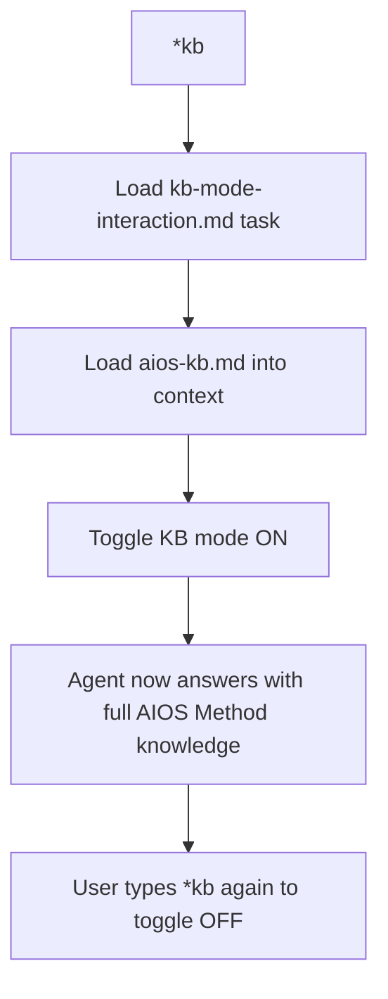

**CRITICAL:** aios-kb.md is NEVER loaded unless user explicitly types `*kb`.

---

### `*create`

**Task files:** `.aios-core/development/tasks/create-agent.md`, `create-task.md`, `create-workflow.md`
**Templates:** `agent-template.yaml`, `task-template.md`, `workflow-template.yaml`

**Dependencies loaded:**
| File | Type | Status |
|------|------|--------|
| `create-agent.md` | Task | EXISTS |
| `create-task.md` | Task | EXISTS |
| `create-workflow.md` | Task | EXISTS |
| `agent-template.yaml` | Template | EXISTS (in .aios-core/product/templates/) |
| `task-template.md` | Template | EXISTS (in .aios-core/product/templates/) |
| `workflow-template.yaml` | Template | EXISTS (in .aios-core/product/templates/) |
| `security-checker.js` | Util | EXISTS (in .aios-core/infrastructure/scripts/) |
| `yaml-validator.js` | Util | EXISTS (in .aios-core/infrastructure/scripts/) |

**Execution flow:**

```mermaid
flowchart TD
    A["*create {type} {name}"] --> B{Component type?}
    B -->|agent| C[Load create-agent.md]
    B -->|task| D[Load create-task.md]
    B -->|workflow| E[Load create-workflow.md]
    B -->|template| F[Load template creation logic]
    B -->|checklist| G[Load checklist creation logic]
    C --> H[Load agent-template.yaml]
    D --> I[Load task-template.md]
    E --> J[Load workflow-template.yaml]
    H --> K[Elicit: agent configuration via numbered options]
    I --> K
    J --> K
    F --> K
    G --> K
    K --> L[Validate with security-checker.js]
    L --> M[Validate YAML with yaml-validator.js]
    M --> N{Validation pass?}
    N -->|yes| O[Write component to .aios-core/development/{type}/]
    N -->|no| P[Report validation errors]
    O --> Q[Update manifest if applicable]
```

**Expected output:** New AIOS component file written to appropriate directory.

---

### `*modify`

**Task files:** `.aios-core/development/tasks/modify-agent.md`, `modify-task.md`, `modify-workflow.md`

**Dependencies loaded:**
| File | Type | Status |
|------|------|--------|
| `modify-agent.md` | Task | EXISTS |
| `modify-task.md` | Task | EXISTS |
| `modify-workflow.md` | Task | EXISTS |
| `security-checker.js` | Util | EXISTS |
| `yaml-validator.js` | Util | EXISTS |

**Execution flow:**

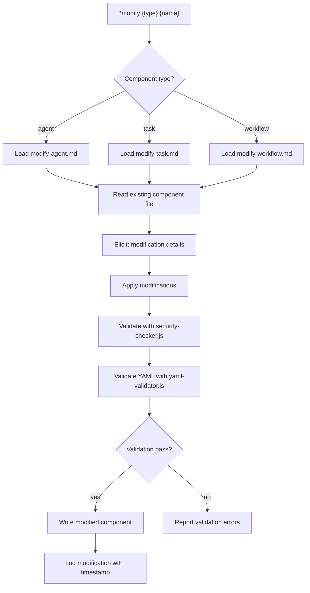

---

### `*update-manifest`

**Task file:** `.aios-core/development/tasks/update-manifest.md`

**Dependencies loaded:**
| File | Type | Status |
|------|------|--------|
| `update-manifest.md` | Task | EXISTS |

**Execution flow:**

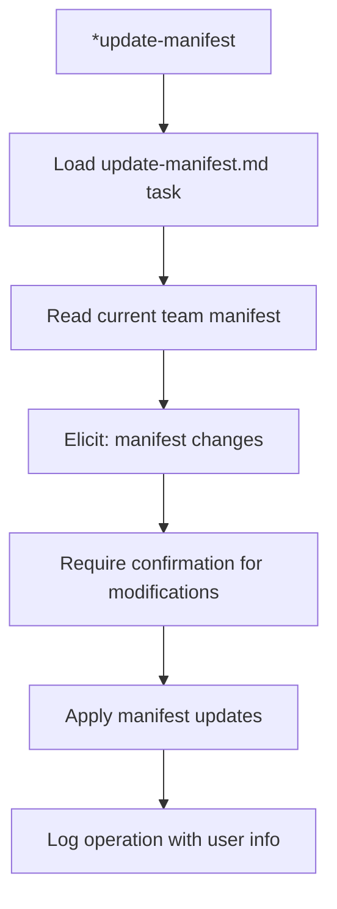

---

### `*validate-component`

**Built-in command using:** `security-checker.js`, `yaml-validator.js`

**Dependencies loaded:**
| File | Type | Status |
|------|------|--------|
| `security-checker.js` | Util | EXISTS (in .aios-core/infrastructure/scripts/) |
| `yaml-validator.js` | Util | EXISTS (in .aios-core/infrastructure/scripts/) |

**Execution flow:**

```mermaid
flowchart TD
    A["*validate-component {path}"] --> B[Load component file]
    B --> C[Run security-checker.js]
    C --> D{Contains eval()?}
    D -->|yes| E[FAIL: security violation]
    D -->|no| F[Check for path traversal]
    F --> G[Sanitize inputs]
    G --> H[Run yaml-validator.js]
    H --> I{YAML valid?}
    I -->|yes| J[Report: component valid]
    I -->|no| K[Report: validation errors with details]
```

---

### `*deprecate-component`

**Task file:** `.aios-core/development/tasks/deprecate-component.md`

**Dependencies loaded:**
| File | Type | Status |
|------|------|--------|
| `deprecate-component.md` | Task | EXISTS |

**Execution flow:**

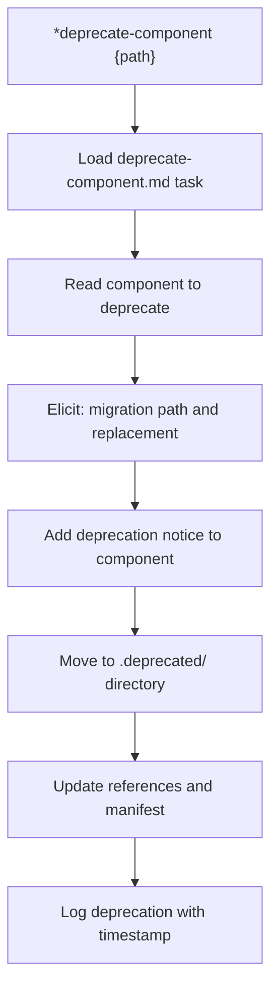

---

### `*propose-modification`

**Task file:** `.aios-core/development/tasks/propose-modification.md`

**Dependencies loaded:**
| File | Type | Status |
|------|------|--------|
| `propose-modification.md` | Task | EXISTS |

**Execution flow:**

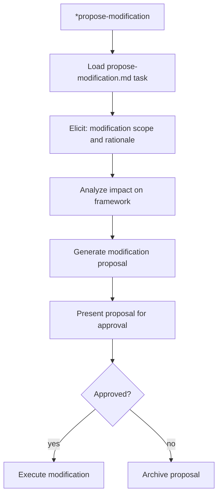

---

### `*undo-last`

**Task file:** `.aios-core/development/tasks/undo-last.md`

**Dependencies loaded:**
| File | Type | Status |
|------|------|--------|
| `undo-last.md` | Task | EXISTS |

**Execution flow:**

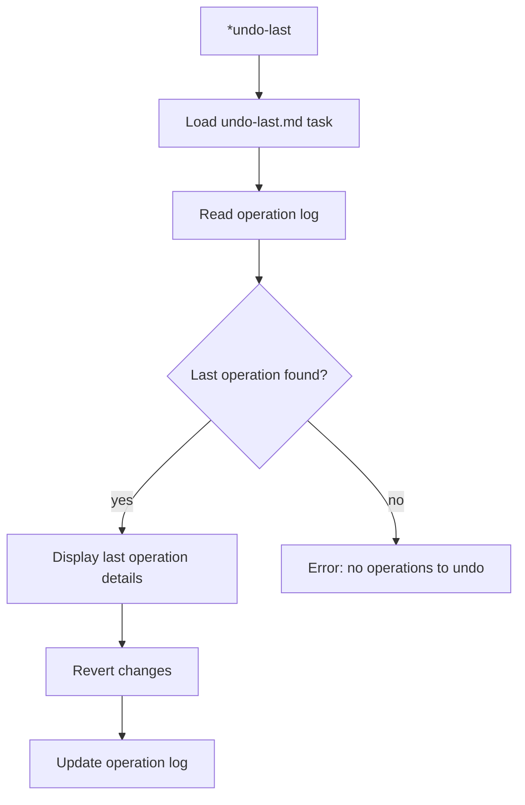

---

### `*validate-workflow`

**Task file:** `.aios-core/development/tasks/validate-workflow.md`

**Dependencies loaded:**
| File | Type | Status |
|------|------|--------|
| `validate-workflow.md` | Task | EXISTS |
| `yaml-validator.js` | Util | EXISTS |
| `.aios-core/development/workflows/{name}.yaml` | Workflow | Dynamically loaded |

**Execution flow:**

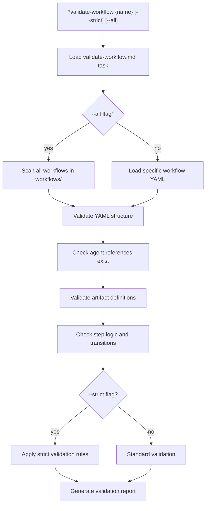

---

### `*run-workflow`

**Task files:** `.aios-core/development/tasks/run-workflow.md`, `run-workflow-engine.md`
**Template:** `.aios-core/development/templates/subagent-step-prompt.md`

**Dependencies loaded:**
| File | Type | Status |
|------|------|--------|
| `run-workflow.md` | Task | EXISTS |
| `run-workflow-engine.md` | Task | EXISTS |
| `subagent-step-prompt.md` | Template | EXISTS (in .aios-core/development/templates/) |
| `workflow-management.md` | Util | EXISTS (in .aios-core/scripts/) |
| `.aios-core/development/workflows/{name}.yaml` | Workflow | Dynamically loaded |

**Execution flow:**

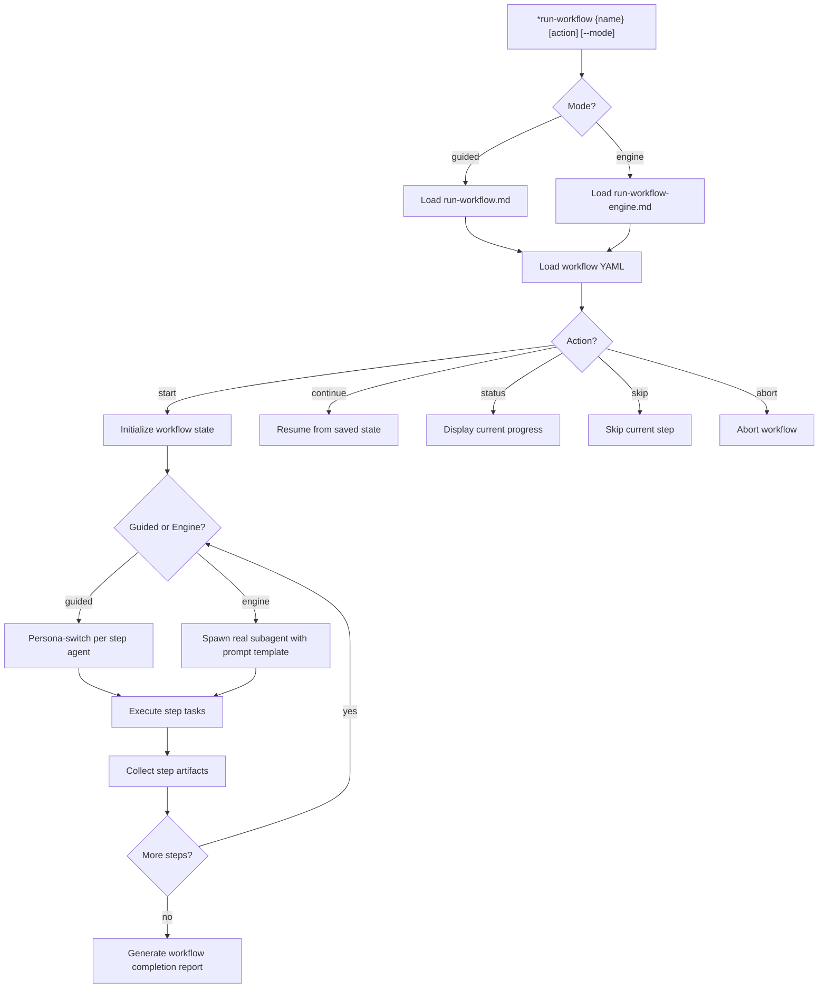

---

### `*analyze-framework`

**Task file:** `.aios-core/development/tasks/analyze-framework.md`

**Dependencies loaded:**
| File | Type | Status |
|------|------|--------|
| `analyze-framework.md` | Task | EXISTS |

**Execution flow:**

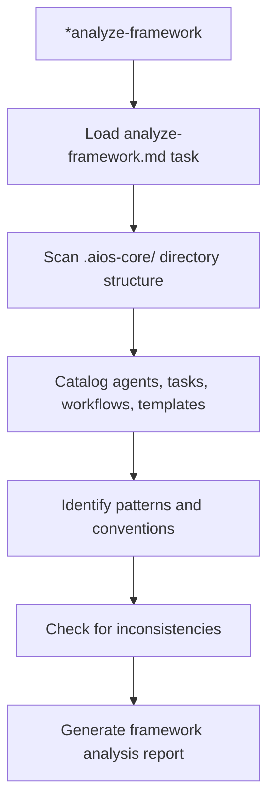

---

### `*execute-checklist`

**Task file:** `.aios-core/development/tasks/execute-checklist.md`

**Dependencies loaded:**
| File | Type | Status |
|------|------|--------|
| `execute-checklist.md` | Task | EXISTS |
| `.aios-core/product/checklists/{checklist}.md` | Checklist | Dynamically loaded |

**Execution flow:**

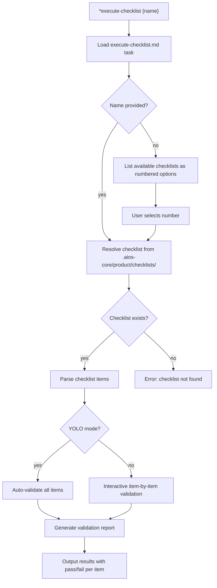

**Available checklists (6):**
1. `architect-checklist.md`
2. `change-checklist.md`
3. `pm-checklist.md`
4. `po-master-checklist.md`
5. `story-dod-checklist.md`
6. `story-draft-checklist.md`

---

### `*create-doc`

**Task file:** `.aios-core/development/tasks/create-doc.md`
**Templates:** All 15 templates from `.aios-core/product/templates/`

**Dependencies loaded:**
| File | Type | Status |
|------|------|--------|
| `create-doc.md` | Task | EXISTS |
| `architecture-tmpl.yaml` | Template | EXISTS |
| `brownfield-architecture-tmpl.yaml` | Template | EXISTS |
| `brownfield-prd-tmpl.yaml` | Template | EXISTS |
| `competitor-analysis-tmpl.yaml` | Template | EXISTS |
| `front-end-architecture-tmpl.yaml` | Template | EXISTS |
| `front-end-spec-tmpl.yaml` | Template | EXISTS |
| `fullstack-architecture-tmpl.yaml` | Template | EXISTS |
| `market-research-tmpl.yaml` | Template | EXISTS |
| `prd-tmpl.yaml` | Template | EXISTS |
| `project-brief-tmpl.yaml` | Template | EXISTS |
| `story-tmpl.yaml` | Template | EXISTS |
| `.aios-core/product/data/elicitation-methods.md` | Data | EXISTS |

**Execution flow:**

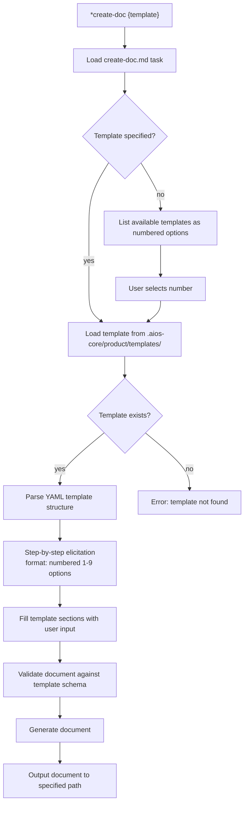

---

### `*shard-doc`

**Task file:** `.aios-core/development/tasks/shard-doc.md`

**Dependencies loaded:**
| File | Type | Status |
|------|------|--------|
| `shard-doc.md` | Task | EXISTS |

**Execution flow:**

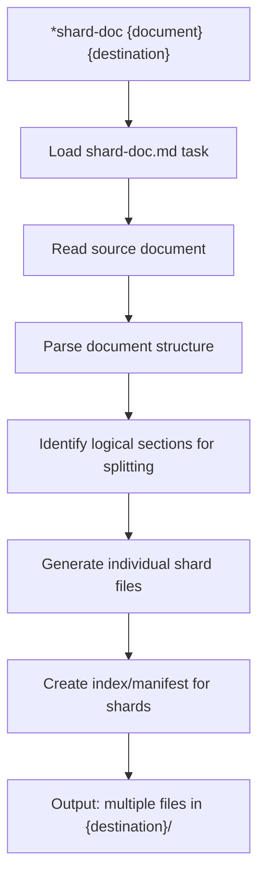

---

### `*document-project`

**Task file:** `.aios-core/development/tasks/document-project.md`

**Dependencies loaded:**
| File | Type | Status |
|------|------|--------|
| `document-project.md` | Task | EXISTS |

**Execution flow:**

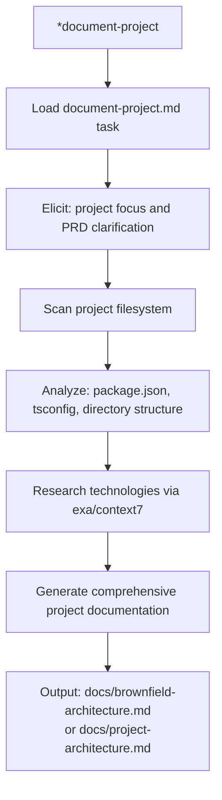

---

### `*add-tech-doc`

**Task file:** `.aios-core/development/tasks/add-tech-doc.md` (MISSING)

**Note:** This task file is referenced in dependencies but does not exist on disk. The command `*add-tech-doc {file-path} [preset-name]` is non-functional.

---

### `*create-next-story`

**Task file:** `.aios-core/development/tasks/create-next-story.md`

**Dependencies loaded:**
| File | Type | Status |
|------|------|--------|
| `create-next-story.md` | Task | EXISTS |
| `story-tmpl.yaml` | Template | EXISTS |
| `.aios-core/product/data/elicitation-methods.md` | Data | EXISTS |

**Execution flow:**

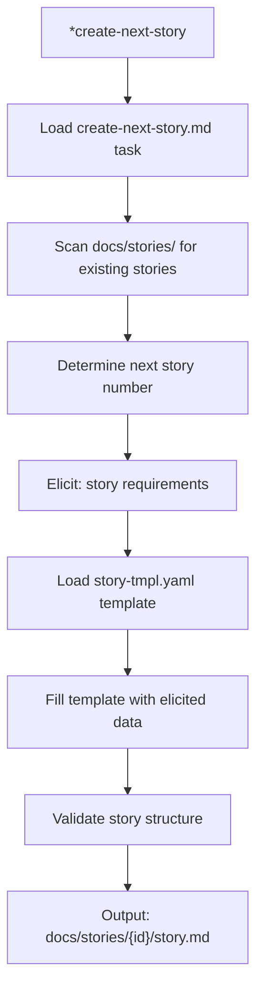

---

### `*advanced-elicitation`

**Task file:** `.aios-core/development/tasks/advanced-elicitation.md`

**Dependencies loaded:**
| File | Type | Status |
|------|------|--------|
| `advanced-elicitation.md` | Task | EXISTS |
| `.aios-core/product/data/elicitation-methods.md` | Data | EXISTS |

**Execution flow:**

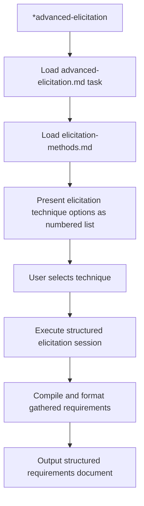

---

### `*correct-course`

**Task file:** `.aios-core/development/tasks/correct-course.md`

**Dependencies loaded:**
| File | Type | Status |
|------|------|--------|
| `correct-course.md` | Task | EXISTS |

**Execution flow:**

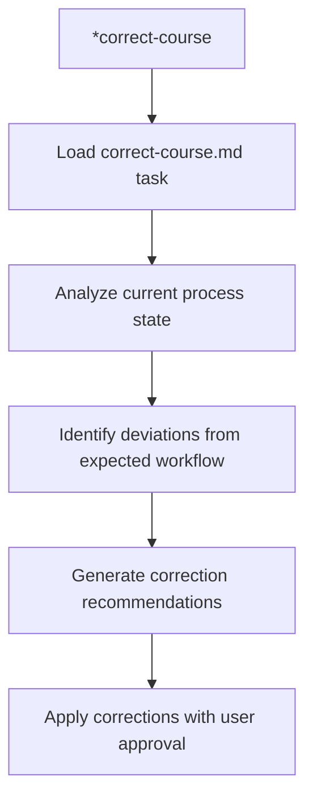

---

### `*index-docs`

**Task file:** `.aios-core/development/tasks/index-docs.md`

**Dependencies loaded:**
| File | Type | Status |
|------|------|--------|
| `index-docs.md` | Task | EXISTS |

**Execution flow:**

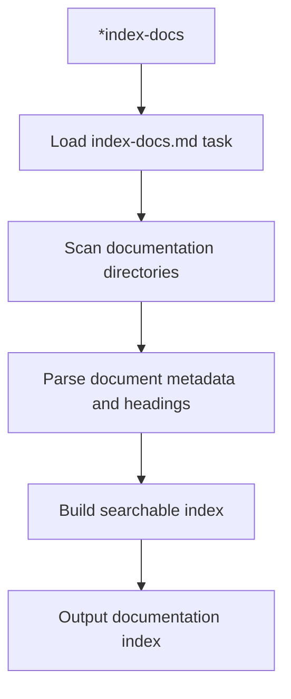

---

### `*help`, `*status`, `*guide`, `*chat-mode`, `*doc-out`, `*yolo`, `*exit`, `*agent`, `*list-components`, `*test-memory`

These are built-in commands handled by the agent framework, not external task files.

| Command | Behavior |
|---------|----------|
| `*help` | Renders full command list from `commands[]` in agent definition (33 commands) |
| `*status` | Shows current context: active story, branch, modified files, session info |
| `*guide` | Renders the `## AIOS Master Guide` section from agent .md |
| `*chat-mode` | Starts conversational assistance mode (freeform interaction) |
| `*doc-out` | Outputs complete document content |
| `*yolo` | Toggles confirmation skipping mode |
| `*exit` | Exits aios-master mode, returns to base Claude Code |
| `*agent {name}` | Reads and displays info about a specialized agent (use `@` to transform into it) |
| `*list-components` | Scans .aios-core/ and lists all framework components (agents, tasks, workflows, templates, checklists) |
| `*test-memory` | Tests memory layer connection and reports status |

---

## 4. Complete Dependency Graph

```mermaid
graph TD
    subgraph "Agent Definition"
        AD[aios-master.md]
    end

    subgraph "Activation Pipeline"
        GB[greeting-builder.js]
        ACL[agent-config-loader.js]
        CD[context-detector.js]
        GCD[git-config-detector.js]
        PSL[project-status-loader.js]
        GPM[greeting-preference-manager.js]
        WN[workflow-navigator.js]
        PM[permissions/index.js]
    end

    subgraph "Config Files"
        CC[core-config.yaml]
        ACR[agent-config-requirements.yaml]
        WP[workflow-patterns.yaml]
    end

    subgraph "Data Files"
        KB[aios-kb.md - LAZY]
        BT[brainstorming-techniques.md]
        EM[elicitation-methods.md]
        TP[technical-preferences.md]
    end

    subgraph "Task Files (25 exist, 1 MISSING)"
        T1[advanced-elicitation.md]
        T2[analyze-framework.md]
        T3[correct-course.md]
        T4[create-agent.md]
        T5[create-deep-research-prompt.md]
        T6[create-doc.md]
        T7[create-next-story.md]
        T8[create-task.md]
        T9[create-workflow.md]
        T10[deprecate-component.md]
        T11[document-project.md]
        T12[execute-checklist.md]
        T13[improve-self.md]
        T14[index-docs.md]
        T15[kb-mode-interaction.md]
        T16[modify-agent.md]
        T17[modify-task.md]
        T18[modify-workflow.md]
        T19[propose-modification.md]
        T20[shard-doc.md]
        T21[undo-last.md]
        T22[update-manifest.md]
        T23[validate-workflow.md]
        T24[run-workflow.md]
        T25[run-workflow-engine.md]
        T26[add-tech-doc.md - MISSING]
    end

    subgraph "Templates (15 ALL EXIST)"
        TM1[agent-template.yaml]
        TM2[architecture-tmpl.yaml]
        TM3[brownfield-architecture-tmpl.yaml]
        TM4[brownfield-prd-tmpl.yaml]
        TM5[competitor-analysis-tmpl.yaml]
        TM6[front-end-architecture-tmpl.yaml]
        TM7[front-end-spec-tmpl.yaml]
        TM8[fullstack-architecture-tmpl.yaml]
        TM9[market-research-tmpl.yaml]
        TM10[prd-tmpl.yaml]
        TM11[project-brief-tmpl.yaml]
        TM12[story-tmpl.yaml]
        TM13[task-template.md]
        TM14[workflow-template.yaml]
        TM15[subagent-step-prompt.md]
    end

    subgraph "Utils (3 ALL EXIST)"
        U1[security-checker.js]
        U2[workflow-management.md]
        U3[yaml-validator.js]
    end

    subgraph "Workflows (9 ALL EXIST)"
        W1[brownfield-discovery.yaml]
        W2[brownfield-fullstack.yaml]
        W3[brownfield-service.yaml]
        W4[brownfield-ui.yaml]
        W5[design-system-build-quality.yaml]
        W6[greenfield-fullstack.yaml]
        W7[greenfield-service.yaml]
        W8[greenfield-ui.yaml]
        W9[story-development-cycle.yaml]
    end

    subgraph "Checklists (6 ALL EXIST)"
        CL1[architect-checklist.md]
        CL2[change-checklist.md]
        CL3[pm-checklist.md]
        CL4[po-master-checklist.md]
        CL5[story-dod-checklist.md]
        CL6[story-draft-checklist.md]
    end

    AD --> GB
    AD --> ACL
    GB --> CD
    GB --> GCD
    GB --> PSL
    GB --> GPM
    GB --> WN
    GB --> PM
    ACL --> ACR
    ACL --> CC
    WN --> WP

    AD -.->|commands| T1
    AD -.->|commands| T2
    AD -.->|commands| T3
    AD -.->|commands| T4
    AD -.->|commands| T5
    AD -.->|commands| T6
    AD -.->|commands| T7
    AD -.->|commands| T8
    AD -.->|commands| T9
    AD -.->|commands| T10
    AD -.->|commands| T11
    AD -.->|commands| T12
    AD -.->|commands| T13
    AD -.->|commands| T14
    AD -.->|commands| T15
    AD -.->|commands| T16
    AD -.->|commands| T17
    AD -.->|commands| T18
    AD -.->|commands| T19
    AD -.->|commands| T20
    AD -.->|commands| T21
    AD -.->|commands| T22
    AD -.->|commands| T23
    AD -.->|commands| T24
    AD -.->|commands| T25
    AD -.->|MISSING| T26

    T6 -.->|template| TM2
    T6 -.->|template| TM3
    T6 -.->|template| TM4
    T6 -.->|template| TM5
    T6 -.->|template| TM6
    T6 -.->|template| TM7
    T6 -.->|template| TM8
    T6 -.->|template| TM9
    T6 -.->|template| TM10
    T6 -.->|template| TM11
    T6 -.->|template| TM12
    T4 -.->|template| TM1
    T8 -.->|template| TM13
    T9 -.->|template| TM14
    T24 -.->|template| TM15
    T25 -.->|template| TM15

    T12 -.->|checklist| CL1
    T12 -.->|checklist| CL2
    T12 -.->|checklist| CL3
    T12 -.->|checklist| CL4
    T12 -.->|checklist| CL5
    T12 -.->|checklist| CL6

    T24 -.->|workflow| W1
    T24 -.->|workflow| W2
    T24 -.->|workflow| W3
    T24 -.->|workflow| W4
    T24 -.->|workflow| W5
    T24 -.->|workflow| W6
    T24 -.->|workflow| W7
    T24 -.->|workflow| W8
    T24 -.->|workflow| W9

    T4 -.->|util| U1
    T4 -.->|util| U3
    T16 -.->|util| U1
    T16 -.->|util| U3
    T24 -.->|util| U2

    T15 -.->|data| KB
    T1 -.->|data| EM
    T6 -.->|data| EM
```

---

## 5. Cross-Agent Interactions

| Interaction | Direction | Trigger |
|-------------|-----------|---------|
| @aios-master -> @pm | Delegate | Epic/story creation (brownfield-create-epic, brownfield-create-story) |
| @aios-master -> @analyst | Delegate | Brainstorming sessions (*brainstorm) |
| @aios-master -> @qa | Delegate | Test suite creation (*create-suite) |
| @aios-master -> @architect | Delegate | AI prompt generation (*generate-ai-prompt) |
| @aios-master -> @dev | Handoff | Story implementation after story creation |
| @aios-master -> @devops | Delegate | Git push operations, PR creation |
| @aios-master -> any agent | Execute | Can execute any task from any agent directly |
| Any agent -> @aios-master | Escalate | Cross-agent coordination, framework operations |

### Delegation Rules (from agent definition)

**Delegates to @pm when:**
- Epic creation is needed (brownfield-create-epic)
- Story creation within an epic (brownfield-create-story)
- PRD management and backlog prioritization

**Delegates to @analyst when:**
- Brainstorming sessions are requested
- Research and analysis tasks

**Delegates to @qa when:**
- Test suite creation (*create-suite)
- Quality gate execution

**Delegates to @architect when:**
- AI prompt generation (*generate-ai-prompt)
- Architecture decision records

**Delegates to @devops when:**
- Git push operations to remote repository
- Pull request creation and management
- CI/CD pipeline configuration

**Retains (does NOT delegate):**
- Framework component creation/modification (*create, *modify)
- Workflow orchestration (*run-workflow, *validate-workflow)
- KB mode management (*kb)
- Manifest updates (*update-manifest)
- Component validation (*validate-component)
- Component deprecation (*deprecate-component)
- Course correction (*correct-course)
- Framework analysis (*analyze-framework)

### Specialization Guidance (from agent definition)

| Task Type | Recommended Agent |
|-----------|-------------------|
| Story implementation | @dev |
| Code review | @qa |
| PRD creation | @pm |
| Story creation | @sm (or @pm for epics) |
| Architecture | @architect |
| Database | @data-engineer |
| UX/UI | @ux-design-expert |
| Research | @analyst |
| Git operations | @devops |

---

## 6. Missing Dependencies

| File | Type | Referenced By | Impact |
|------|------|---------------|--------|
| `add-tech-doc.md` | Task | `*add-tech-doc` command | Command non-functional |

### Dependency Health Summary

| Category | Total | Existing | Missing | Health |
|----------|-------|----------|---------|--------|
| Tasks | 26 | 25 | 1 | 96% |
| Templates | 15 | 15 | 0 | 100% |
| Data | 4 | 4 | 0 | 100% |
| Utils | 3 | 3 | 0 | 100% |
| Workflows | 9 | 9 | 0 | 100% |
| Checklists | 6 | 6 | 0 | 100% |
| **TOTAL** | **63** | **62** | **1** | **98%** |

### Notes on File Locations

Some dependencies resolve to non-standard paths:

| Dependency | Expected Path | Actual Path |
|------------|---------------|-------------|
| `security-checker.js` | `.aios-core/development/utils/` | `.aios-core/infrastructure/scripts/security-checker.js` |
| `yaml-validator.js` | `.aios-core/development/utils/` | `.aios-core/infrastructure/scripts/yaml-validator.js` |
| `workflow-management.md` | `.aios-core/development/utils/` | `.aios-core/scripts/workflow-management.md` |
| `subagent-step-prompt.md` | `.aios-core/product/templates/` | `.aios-core/development/templates/subagent-step-prompt.md` |
| `elicitation-methods.md` | `.aios-core/data/` | `.aios-core/product/data/elicitation-methods.md` |
| `brainstorming-techniques.md` | `.aios-core/data/` | `.aios-core/product/data/brainstorming-techniques.md` |

---

*Traced from source on 2026-02-05 | Story AIOS-TRACE-001*
