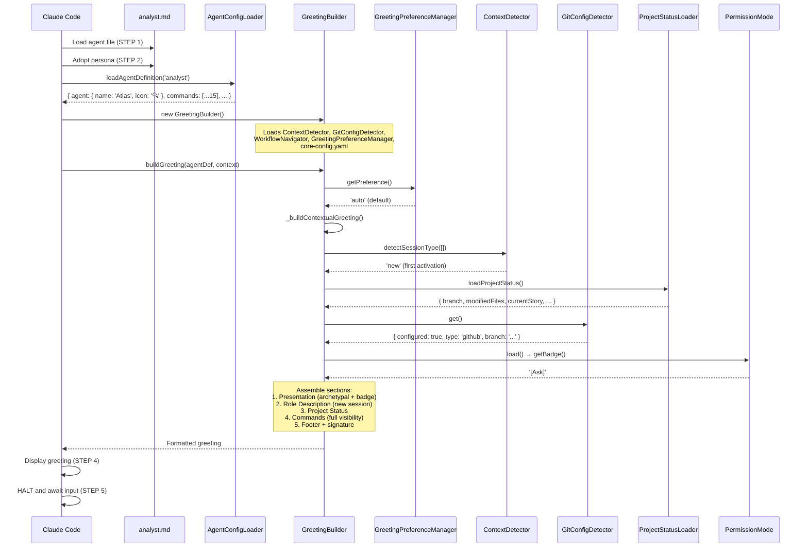
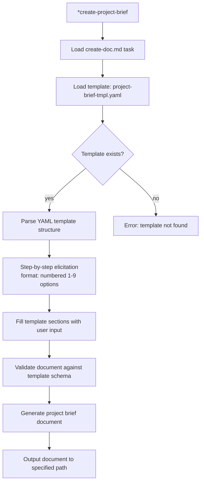
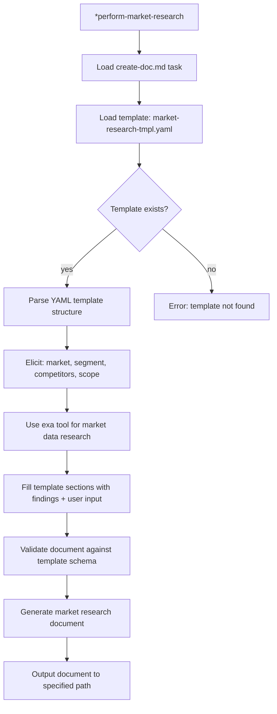
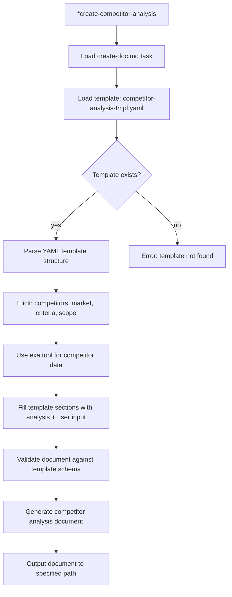
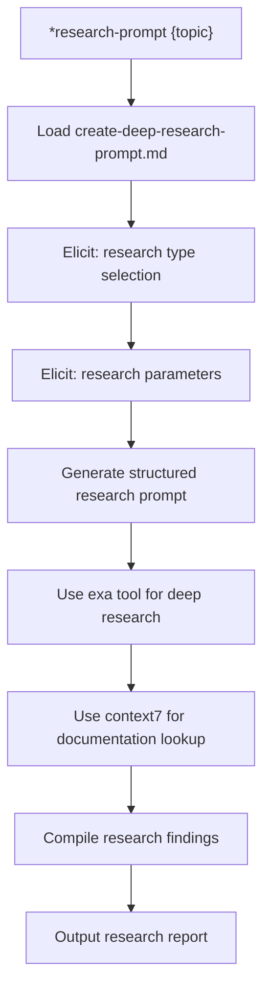
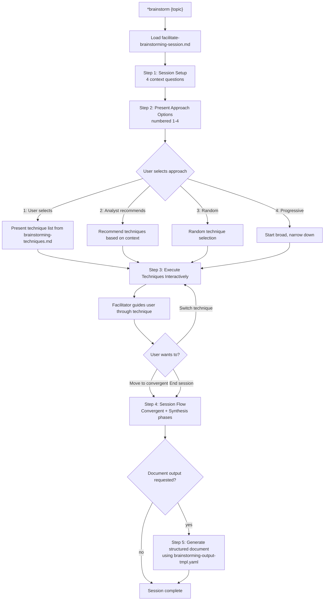
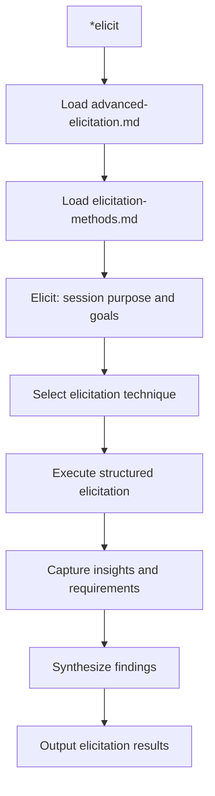
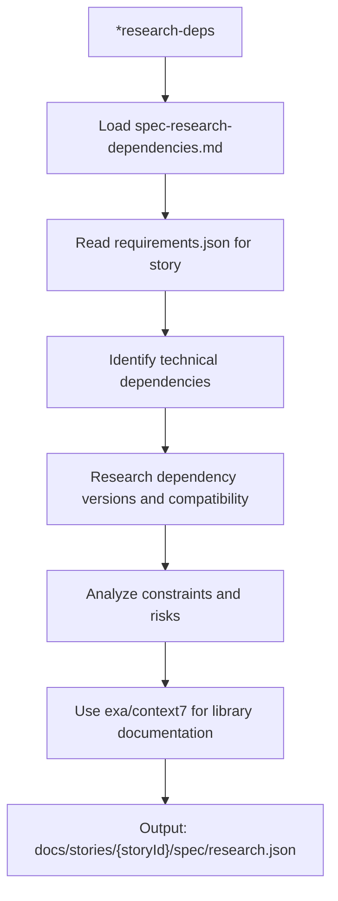
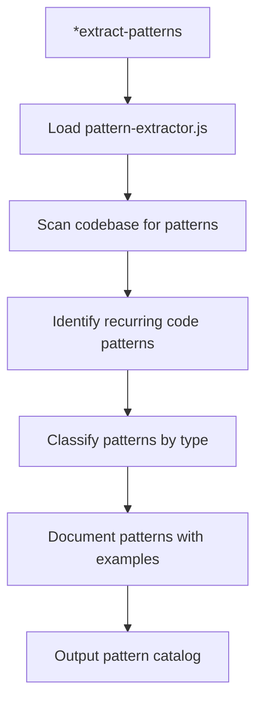

# @analyst (Atlas) - Execution Trace

> Traced from source code, not documentation.
> Agent definition: `.aios-core/development/agents/analyst.md`

## 1. Activation Trace

### 1.1 Files Loaded (in order)

| Order | File | Loader | Purpose |
|-------|------|--------|---------|
| 1 | `.aios-core/development/agents/analyst.md` | AgentConfigLoader.loadAgentDefinition() | Agent definition (YAML block) |
| 2 | `.aios-core/core-config.yaml` | GreetingBuilder._loadConfig() | Core configuration |
| 3 | `.aios-core/data/agent-config-requirements.yaml` | AgentConfigLoader.loadRequirements() | Config sections: dataLocation, analyticsLocation |
| 4 | `.aios-core/data/workflow-patterns.yaml` | WorkflowNavigator._loadPatterns() | Workflow state detection |
| 5 | `.aios-core/product/data/brainstorming-techniques.md` | AgentConfigLoader.loadFile() | Brainstorming techniques (always loaded, 2KB) |
| 6 | `.aios/session-state.json` | ContextDetector._detectFromFile() | Session type detection (if no conversation history) |
| 7 | `.aios/project-status.yaml` | ProjectStatusLoader.loadCache() | Cached project status (60s TTL) |

### 1.2 Greeting Construction

**Activation path:** Direct invocation (STEP 3 calls `GreetingBuilder.buildGreeting()`)



### 1.3 Agent-Specific Config

From `agent-config-requirements.yaml`:

```yaml
analyst:
  config_sections:
    - dataLocation
    - analyticsLocation
  files_loaded:
    - path: .aios-core/product/data/brainstorming-techniques.md
      lazy: false
      size: 2KB
    - path: docs/framework/tech-stack.md          # Added in Story ACT-8
      lazy: false
      size: 30KB
    - path: docs/framework/source-tree.md         # Added in Story ACT-8
      lazy: false
      size: 20KB
  lazy_loading: {}
  performance_target: <100ms
```

**Note:** As of Story ACT-8, Analyst loads `tech-stack.md` and `source-tree.md` during activation to have technical context when conducting research and impact analysis.

### 1.4 Context Brought to Session

| Data | Source | Value |
|------|--------|-------|
| Greeting level | `persona_profile.greeting_levels.archetypal` | `🔍 Atlas the Decoder ready to investigate!` |
| Signature | `persona_profile.communication.signature_closing` | `— Atlas, investigando a verdade 🔎` |
| Role | `persona.role` | Insightful Analyst & Strategic Ideation Partner |
| Commands shown | `filterCommandsByVisibility('full')` | 15 commands with `full` visibility |

---

## 2. Command Registry

| Command | Task File | Visibility | Elicit |
|---------|-----------|------------|--------|
| `*help` | (built-in) | full, quick, key | No |
| `*create-project-brief` | create-doc.md + project-brief-tmpl.yaml | full, quick | Yes |
| `*perform-market-research` | create-doc.md + market-research-tmpl.yaml | full, quick | Yes |
| `*create-competitor-analysis` | create-doc.md + competitor-analysis-tmpl.yaml | full, quick | Yes |
| `*research-prompt` | create-deep-research-prompt.md | full | Yes |
| `*brainstorm` | facilitate-brainstorming-session.md + brainstorming-techniques.md | full, quick, key | Yes |
| `*elicit` | advanced-elicitation.md | full | Yes |
| `*research-deps` | spec-research-dependencies.md | full | Yes |
| `*extract-patterns` | pattern-extractor.js | full | No |
| `*doc-out` | (built-in) | full | No |
| `*session-info` | (built-in) | full | No |
| `*guide` | (built-in, rendered from agent .md) | full, quick | No |
| `*yolo` | (built-in) | full | No |
| `*exit` | (built-in) | full | No |

---

## 3. Per-Command Execution Traces

### `*create-project-brief`

**Task file:** `.aios-core/development/tasks/create-doc.md`
**Template:** `.aios-core/product/templates/project-brief-tmpl.yaml` (EXISTS)

**Dependencies loaded:**
| File | Type | Status |
|------|------|--------|
| `create-doc.md` | Task | EXISTS |
| `project-brief-tmpl.yaml` | Template | EXISTS |
| `.aios-core/product/data/elicitation-methods.md` | Data | Referenced by create-doc |
| `.aios-core/product/templates/` | Templates dir | Scanned dynamically |

**Execution flow:**



**Expected output:** Complete project brief document

---

### `*perform-market-research`

**Task file:** `.aios-core/development/tasks/create-doc.md`
**Template:** `.aios-core/product/templates/market-research-tmpl.yaml` (EXISTS)

**Dependencies loaded:**
| File | Type | Status |
|------|------|--------|
| `create-doc.md` | Task | EXISTS |
| `market-research-tmpl.yaml` | Template | EXISTS |
| `.aios-core/product/data/elicitation-methods.md` | Data | Referenced by create-doc |

**Execution flow:**



**Tools used:** exa (market research), context7 (industry documentation)

**Expected output:** Structured market research analysis document

---

### `*create-competitor-analysis`

**Task file:** `.aios-core/development/tasks/create-doc.md`
**Template:** `.aios-core/product/templates/competitor-analysis-tmpl.yaml` (EXISTS)

**Dependencies loaded:**
| File | Type | Status |
|------|------|--------|
| `create-doc.md` | Task | EXISTS |
| `competitor-analysis-tmpl.yaml` | Template | EXISTS |
| `.aios-core/product/data/elicitation-methods.md` | Data | Referenced by create-doc |

**Execution flow:**



**Tools used:** exa (competitor research), context7 (technology documentation)

**Expected output:** Structured competitive analysis document

---

### `*research-prompt`

**Task file:** `.aios-core/development/tasks/create-deep-research-prompt.md`

**Dependencies loaded:**
| File | Type | Status |
|------|------|--------|
| `create-deep-research-prompt.md` | Task | EXISTS |

**Execution flow:**



**Tools used:** exa (deep research), context7 (documentation)

---

### `*brainstorm`

**Task file:** `.aios-core/development/tasks/facilitate-brainstorming-session.md`
**Template:** `.aios-core/product/templates/brainstorming-output-tmpl.yaml` (EXISTS)
**Data file:** `.aios-core/product/data/brainstorming-techniques.md` (EXISTS)

**Dependencies loaded:**
| File | Type | Status |
|------|------|--------|
| `facilitate-brainstorming-session.md` | Task | EXISTS |
| `brainstorming-output-tmpl.yaml` | Template | EXISTS |
| `brainstorming-techniques.md` | Data | EXISTS (pre-loaded at activation) |

**Execution flow:**



**Expected output:** Brainstorming session results document (docs/brainstorming-session-results.md)

---

### `*elicit`

**Task file:** `.aios-core/development/tasks/advanced-elicitation.md`

**Dependencies loaded:**
| File | Type | Status |
|------|------|--------|
| `advanced-elicitation.md` | Task | EXISTS |
| `.aios-core/product/data/elicitation-methods.md` | Data | EXISTS |

**Execution flow:**



---

### `*research-deps`

**Task file:** `.aios-core/development/tasks/spec-research-dependencies.md`

**Dependencies loaded:**
| File | Type | Status |
|------|------|--------|
| `spec-research-dependencies.md` | Task | EXISTS |
| `docs/stories/{storyId}/spec/requirements.json` | Input | Required |

**Execution flow:**



**Tools used:** exa (dependency research), context7 (library documentation)

---

### `*extract-patterns`

**Script:** `.aios-core/infrastructure/scripts/pattern-extractor.js` (EXISTS)

**Dependencies loaded:**
| File | Type | Status |
|------|------|--------|
| `pattern-extractor.js` | Script | EXISTS |

**Execution flow:**



---

### `*help`, `*guide`, `*session-info`, `*doc-out`, `*yolo`, `*exit`

These are built-in commands handled by the agent framework, not external task files.

| Command | Behavior |
|---------|----------|
| `*help` | Renders full command list from `commands[]` in agent definition |
| `*guide` | Renders the `## 🔍 Analyst Guide` section from agent .md |
| `*session-info` | Shows session context (agent history, commands, project status) |
| `*doc-out` | Outputs complete document content |
| `*yolo` | Toggles confirmation skipping mode |
| `*exit` | Exits analyst mode, returns to base Claude Code |

---

## 4. Complete Dependency Graph

```mermaid
graph TD
    subgraph "Agent Definition"
        AD[analyst.md]
    end

    subgraph "Activation Pipeline"
        GB[greeting-builder.js]
        ACL[agent-config-loader.js]
        CD[context-detector.js]
        GCD[git-config-detector.js]
        PSL[project-status-loader.js]
        GPM[greeting-preference-manager.js]
        WN[workflow-navigator.js]
        PM[permissions/index.js]
    end

    subgraph "Config Files"
        CC[core-config.yaml]
        ACR[agent-config-requirements.yaml]
        WP[workflow-patterns.yaml]
        BT[brainstorming-techniques.md]
    end

    subgraph "Task Files"
        T1[facilitate-brainstorming-session.md]
        T2[create-deep-research-prompt.md]
        T3[create-doc.md]
        T4[advanced-elicitation.md]
        T5[document-project.md]
        T6[spec-research-dependencies.md]
    end

    subgraph "Templates (ALL EXIST)"
        TM1[project-brief-tmpl.yaml]
        TM2[market-research-tmpl.yaml]
        TM3[competitor-analysis-tmpl.yaml]
        TM4[brainstorming-output-tmpl.yaml]
    end

    subgraph "Data Files"
        D1[brainstorming-techniques.md]
        D2[elicitation-methods.md]
        D3[aios-kb.md]
    end

    subgraph "Scripts"
        S1[pattern-extractor.js]
    end

    AD --> GB
    AD --> ACL
    GB --> CD
    GB --> GCD
    GB --> PSL
    GB --> GPM
    GB --> WN
    GB --> PM
    ACL --> ACR
    ACL --> CC
    ACL --> BT
    WN --> WP
    GPM --> CC

    AD -.->|commands| T1
    AD -.->|commands| T2
    AD -.->|commands| T3
    AD -.->|commands| T4
    AD -.->|commands| T5
    AD -.->|commands| T6

    T1 -.->|data| D1
    T1 -.->|template| TM4
    T3 -.->|template| TM1
    T3 -.->|template| TM2
    T3 -.->|template| TM3
    T3 -.->|data| D2
    T4 -.->|data| D2
    AD -.->|script| S1
    AD -.->|data| D3
```



---

## 5. Cross-Agent Interactions

| Interaction | Direction | Trigger |
|-------------|-----------|---------|
| @pm -> @analyst | Delegates | Market research, competitive analysis, feasibility studies |
| @architect -> @analyst | Delegates | Technical research, dependency analysis |
| @po -> @analyst | Delegates | Market insights, user research, competitive intelligence |
| @analyst -> @pm | Handoff | Research findings for PRD creation |
| @analyst -> @po | Handoff | Market insights for story prioritization |
| @analyst -> @devops | Delegate | Git push operations, PR creation |

### Delegation Rules (from agent definition)

**Receives from @pm when:**
- Market research required for PRD creation
- Competitive landscape analysis needed
- Feasibility studies for new features
- Industry trend analysis for strategic planning

**Receives from @architect when:**
- Technical dependency research needed
- Library/framework evaluation required
- Technology comparison analysis

**Receives from @po when:**
- Market insights needed for epic/story prioritization
- User research for feature validation
- Competitive analysis for backlog grooming

**Hands off to @pm:**
- Completed research reports for PRD integration
- Market analysis findings for product strategy

**Delegates to @devops when:**
- Git push operations to remote repository
- Pull request creation and management

**Git restrictions:**
- ALLOWED: `git status`, `git log`, `git diff`, `git branch -a`
- BLOCKED: `git push`, `git push --force`, `gh pr create`

---

## 6. MCP Tools

| Tool | Purpose | Usage |
|------|---------|-------|
| exa | Advanced web research, market data, competitor intelligence | `*research-prompt`, `*perform-market-research`, `*create-competitor-analysis` |
| context7 | Library documentation lookup, technology evaluation | `*research-prompt`, `*research-deps` |
| browser | Web testing, page interaction, visual verification | Ad-hoc web research and validation |

---

## 7. Missing Dependencies

| File | Type | Referenced By | Impact |
|------|------|---------------|--------|
| (none) | - | - | All task files, templates, data files, and scripts exist |

**Note:** All 6 task files, all 4 templates, both data files, and the pattern-extractor script are present on disk. The analyst agent has no missing dependencies.

---

*Traced from source on 2026-02-05 | Story AIOS-TRACE-001*
