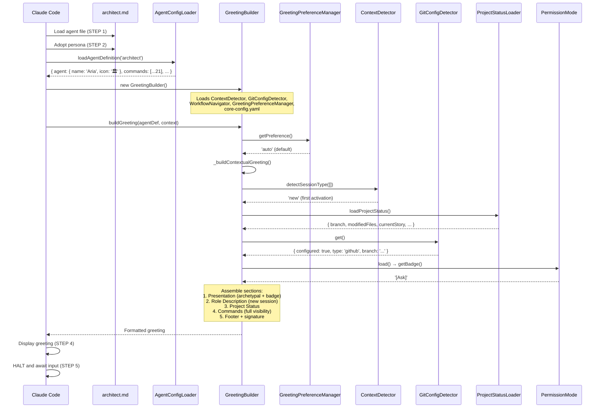
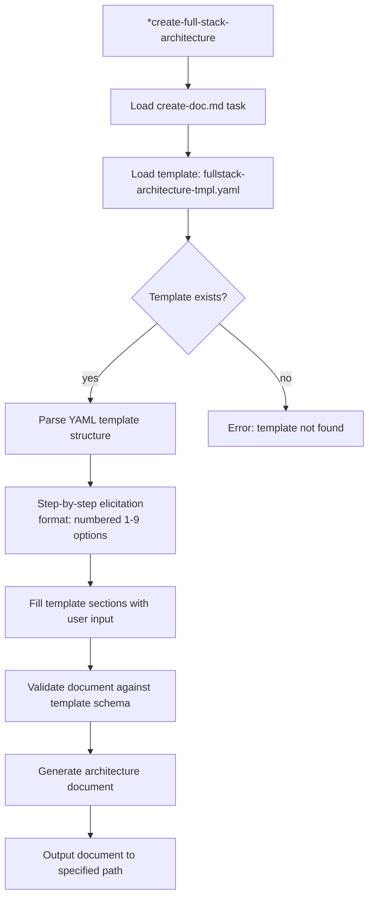
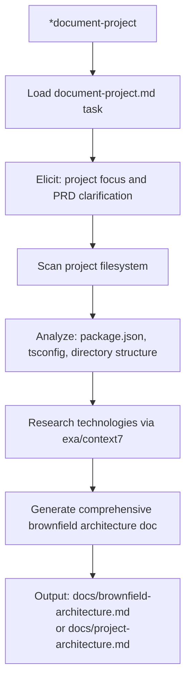
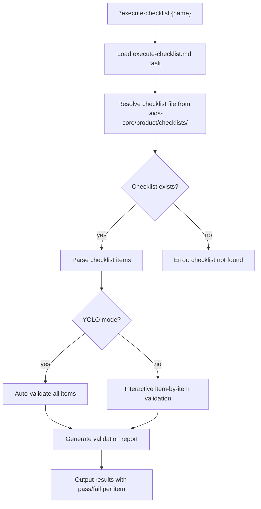
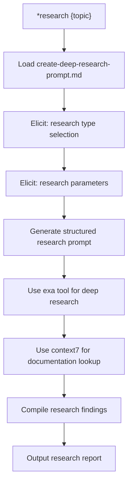
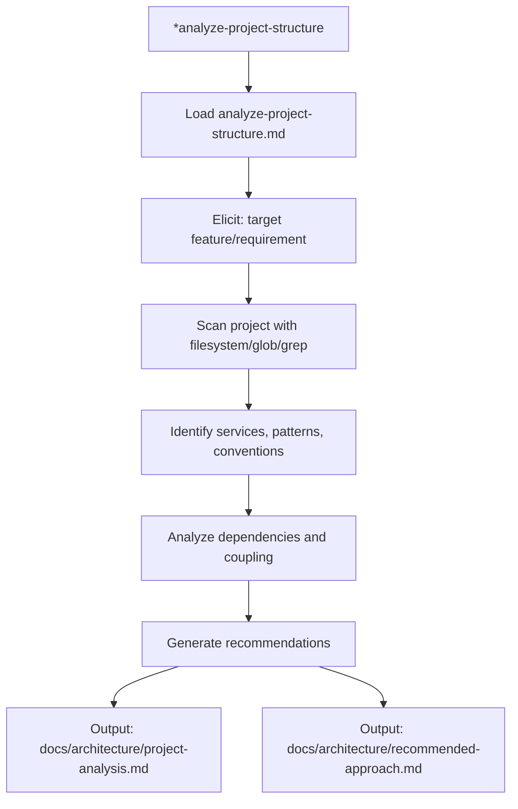
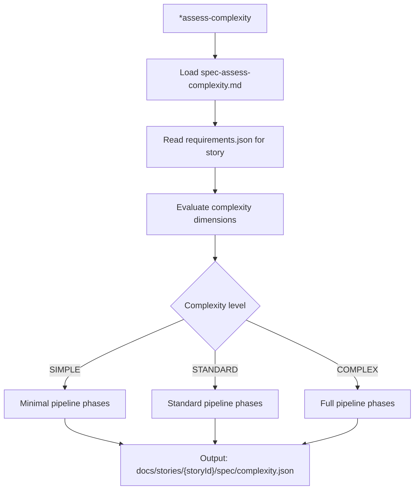
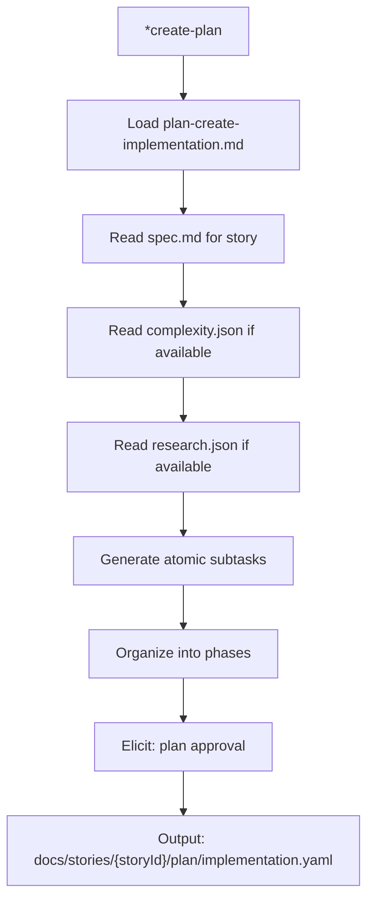
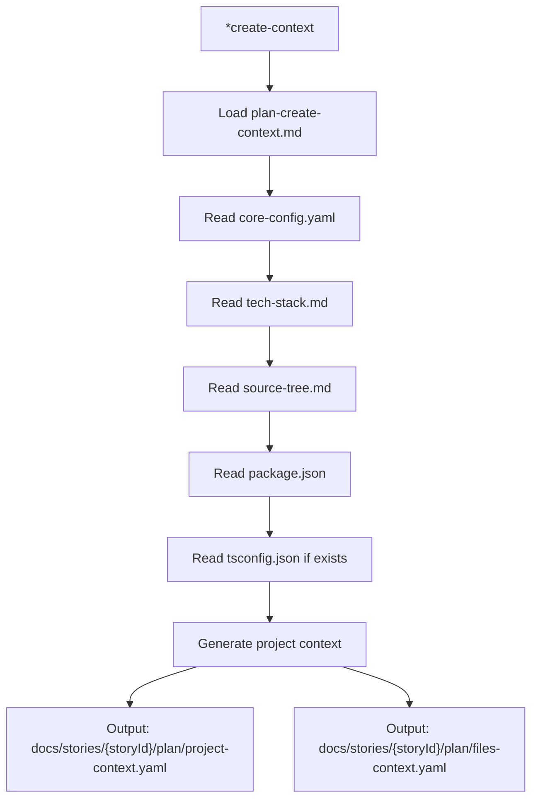

# @architect (Aria) - Execution Trace

> Traced from source code, not documentation.
> Agent definition: `.aios-core/development/agents/architect.md`

## 1. Activation Trace

### 1.1 Files Loaded (in order)

| Order | File | Loader | Purpose |
|-------|------|--------|---------|
| 1 | `.aios-core/development/agents/architect.md` | AgentConfigLoader.loadAgentDefinition() | Agent definition (YAML block) |
| 2 | `.aios-core/core-config.yaml` | GreetingBuilder._loadConfig() | Core configuration |
| 3 | `.aios-core/data/agent-config-requirements.yaml` | AgentConfigLoader.loadRequirements() | Config sections: architecture, dataLocation, templatesLocation |
| 4 | `.aios-core/data/workflow-patterns.yaml` | WorkflowNavigator._loadPatterns() | Workflow state detection |
| 5 | `.aios-core/data/technical-preferences.md` | AgentConfigLoader.loadFile() | Technical preferences (always loaded, 15KB) |
| 6 | `.aios/session-state.json` | ContextDetector._detectFromFile() | Session type detection (if no conversation history) |
| 7 | `.aios/project-status.yaml` | ProjectStatusLoader.loadCache() | Cached project status (60s TTL) |

### 1.2 Greeting Construction

**Activation path:** Direct invocation (STEP 3 calls `GreetingBuilder.buildGreeting()`)



### 1.3 Agent-Specific Config

From `agent-config-requirements.yaml`:

```yaml
architect:
  config_sections:
    - architecture
    - dataLocation
    - templatesLocation
  files_loaded:
    - path: .aios-core/data/technical-preferences.md
      lazy: false
      size: 15KB
  lazy_loading:
    architecture_templates: true  # Load when creating architecture
  performance_target: <75ms
```

### 1.4 Context Brought to Session

| Data | Source | Value |
|------|--------|-------|
| Greeting level | `persona_profile.greeting_levels.archetypal` | `🏛️ Aria the Visionary ready to envision!` |
| Signature | `persona_profile.communication.signature_closing` | `— Aria, arquitetando o futuro 🏗️` |
| Role | `persona.role` | Holistic System Architect & Full-Stack Technical Leader |
| Commands shown | `filterCommandsByVisibility('full')` | 21 commands with `full` visibility |

---

## 2. Command Registry

| Command | Task File | Visibility | Elicit |
|---------|-----------|------------|--------|
| `*help` | (built-in) | full, quick, key | No |
| `*create-full-stack-architecture` | create-doc.md + fullstack-architecture-tmpl.yaml | full, quick, key | Yes |
| `*create-backend-architecture` | create-doc.md + architecture-tmpl.yaml | full, quick | Yes |
| `*create-front-end-architecture` | create-doc.md + front-end-architecture-tmpl.yaml | full, quick | Yes |
| `*create-brownfield-architecture` | create-doc.md + brownfield-architecture-tmpl.yaml | full | Yes |
| `*document-project` | document-project.md | full, quick | Yes |
| `*execute-checklist` | execute-checklist.md | full | Optional |
| `*research` | create-deep-research-prompt.md | full, quick | Yes |
| `*analyze-project-structure` | analyze-project-structure.md | full, quick, key | Yes |
| `*validate-tech-preset` | validate-tech-preset.md | full | No |
| `*validate-tech-preset-all` | validate-tech-preset.md (all mode) | full | No |
| `*assess-complexity` | spec-assess-complexity.md | full | No |
| `*create-plan` | plan-create-implementation.md | full | Yes |
| `*create-context` | plan-create-context.md | full | No |
| `*map-codebase` | codebase-mapper.js | full | No |
| `*doc-out` | (built-in) | full | No |
| `*shard-prd` | (built-in) | full | No |
| `*session-info` | (built-in) | full | No |
| `*guide` | (built-in, rendered from agent .md) | full, quick | No |
| `*yolo` | (built-in) | full | No |
| `*exit` | (built-in) | full | No |

---

## 3. Per-Command Execution Traces

### `*create-full-stack-architecture`

**Task file:** `.aios-core/development/tasks/create-doc.md`
**Template:** `.aios-core/development/templates/fullstack-architecture-tmpl.yaml` (MISSING)

**Dependencies loaded:**
| File | Type | Status |
|------|------|--------|
| `create-doc.md` | Task | EXISTS |
| `fullstack-architecture-tmpl.yaml` | Template | MISSING |
| `.aios-core/data/elicitation-methods` | Data | Referenced by create-doc |
| `.aios-core/product/templates/` | Templates dir | Scanned dynamically |

**Execution flow:**



**Expected output:** Complete fullstack architecture document (PRD-style)

---

### `*create-backend-architecture`

**Task file:** `.aios-core/development/tasks/create-doc.md`
**Template:** `.aios-core/development/templates/architecture-tmpl.yaml` (MISSING)

Same flow as `*create-full-stack-architecture` with backend-specific template.

---

### `*create-front-end-architecture`

**Task file:** `.aios-core/development/tasks/create-doc.md`
**Template:** `.aios-core/development/templates/front-end-architecture-tmpl.yaml` (MISSING)

Same flow as `*create-full-stack-architecture` with frontend-specific template.

---

### `*create-brownfield-architecture`

**Task file:** `.aios-core/development/tasks/create-doc.md`
**Template:** `.aios-core/development/templates/brownfield-architecture-tmpl.yaml` (MISSING)

Same flow as `*create-full-stack-architecture` with brownfield-specific template.

---

### `*document-project`

**Task file:** `.aios-core/development/tasks/document-project.md`

**Dependencies loaded:**
| File | Type | Status |
|------|------|--------|
| `document-project.md` | Task | EXISTS |

**Execution flow:**



**Tools used:** exa (research), github-cli (repo access), context7 (library docs)

---

### `*execute-checklist`

**Task file:** `.aios-core/development/tasks/execute-checklist.md`

**Dependencies loaded:**
| File | Type | Status |
|------|------|--------|
| `execute-checklist.md` | Task | EXISTS |
| `.aios-core/product/checklists/{checklist}.md` | Checklist | Dynamically loaded |
| `.aios-core/scripts/execute-task.js` | Script | Referenced |

**Execution flow:**



---

### `*research`

**Task file:** `.aios-core/development/tasks/create-deep-research-prompt.md`

**Dependencies loaded:**
| File | Type | Status |
|------|------|--------|
| `create-deep-research-prompt.md` | Task | EXISTS |

**Execution flow:**



**Tools used:** exa (deep research), context7 (documentation)

---

### `*analyze-project-structure`

**Task file:** `.aios-core/development/tasks/analyze-project-structure.md`

**Dependencies loaded:**
| File | Type | Status |
|------|------|--------|
| `analyze-project-structure.md` | Task | EXISTS |

**Execution flow:**



**Expected output:** Project analysis + recommended approach documents

---

### `*validate-tech-preset`

**Task file:** `.aios-core/development/tasks/validate-tech-preset.md`

**Dependencies loaded:**
| File | Type | Status |
|------|------|--------|
| `validate-tech-preset.md` | Task | EXISTS |
| `.aios-core/data/tech-presets/{name}.md` | Data | Validated |
| `.aios-core/data/tech-presets/_template.md` | Template | Reference |

**Execution flow:**

```mermaid
flowchart TD
    A["*validate-tech-preset {name}"] --> B[Load validate-tech-preset.md]
    B --> C[Load preset from .aios-core/data/tech-presets/{name}.md]
    C --> D[Validate against template structure]
    D --> E[Check required metadata fields]
    E --> F{All valid?}
    F -->|yes| G[Report: preset valid]
    F -->|no| H{--fix flag?}
    H -->|yes| I[Generate fix story in docs/stories/]
    H -->|no| J[Report: validation errors]
```

---

### `*assess-complexity`

**Task file:** `.aios-core/development/tasks/spec-assess-complexity.md`

**Dependencies loaded:**
| File | Type | Status |
|------|------|--------|
| `spec-assess-complexity.md` | Task | EXISTS |
| `docs/stories/{storyId}/spec/requirements.json` | Input | Required |

**Execution flow:**



---

### `*create-plan`

**Task file:** `.aios-core/development/tasks/plan-create-implementation.md`

**Dependencies loaded:**
| File | Type | Status |
|------|------|--------|
| `plan-create-implementation.md` | Task | EXISTS |
| `docs/stories/{storyId}/spec/spec.md` | Input | Required |
| `docs/stories/{storyId}/spec/complexity.json` | Input | Optional |
| `docs/stories/{storyId}/spec/research.json` | Input | Optional |

**Execution flow:**



---

### `*create-context`

**Task file:** `.aios-core/development/tasks/plan-create-context.md`

**Dependencies loaded:**
| File | Type | Status |
|------|------|--------|
| `plan-create-context.md` | Task | EXISTS |
| `.aios-core/core-config.yaml` | Config | Required |
| `docs/framework/tech-stack.md` | Data | Required |
| `docs/framework/source-tree.md` | Data | Required |
| `package.json` | Data | Required |
| `tsconfig.json` | Data | Optional |

**Execution flow:**



---

### `*map-codebase`

**Script:** `.aios-core/development/scripts/codebase-mapper.js` (MISSING)

**Note:** This script is referenced in dependencies but does not exist on disk.

---

### `*help`, `*guide`, `*session-info`, `*doc-out`, `*shard-prd`, `*yolo`, `*exit`

These are built-in commands handled by the agent framework, not external task files.

| Command | Behavior |
|---------|----------|
| `*help` | Renders full command list from `commands[]` in agent definition |
| `*guide` | Renders the `## 🏛️ Architect Guide` section from agent .md |
| `*session-info` | Shows session context (agent history, commands, project status) |
| `*doc-out` | Outputs complete document content |
| `*shard-prd` | Breaks architecture into smaller parts |
| `*yolo` | Toggles confirmation skipping mode |
| `*exit` | Exits architect mode, returns to base Claude Code |

---

## 4. Complete Dependency Graph

```mermaid
graph TD
    subgraph "Agent Definition"
        AD[architect.md]
    end

    subgraph "Activation Pipeline"
        GB[greeting-builder.js]
        ACL[agent-config-loader.js]
        CD[context-detector.js]
        GCD[git-config-detector.js]
        PSL[project-status-loader.js]
        GPM[greeting-preference-manager.js]
        WN[workflow-navigator.js]
        PM[permissions/index.js]
    end

    subgraph "Config Files"
        CC[core-config.yaml]
        ACR[agent-config-requirements.yaml]
        WP[workflow-patterns.yaml]
        TP[technical-preferences.md]
    end

    subgraph "Task Files"
        T1[analyze-project-structure.md]
        T2[architect-analyze-impact.md]
        T3[collaborative-edit.md]
        T4[create-deep-research-prompt.md]
        T5[create-doc.md]
        T6[document-project.md]
        T7[execute-checklist.md]
        T8[validate-tech-preset.md]
        T9[spec-assess-complexity.md]
        T10[plan-create-implementation.md]
        T11[plan-create-context.md]
    end

    subgraph "Templates (MISSING)"
        TM1[architecture-tmpl.yaml]
        TM2[front-end-architecture-tmpl.yaml]
        TM3[fullstack-architecture-tmpl.yaml]
        TM4[brownfield-architecture-tmpl.yaml]
    end

    subgraph "Checklists (MISSING)"
        CL1[architect-checklist.md]
    end

    subgraph "Scripts (MISSING)"
        S1[codebase-mapper.js]
    end

    AD --> GB
    AD --> ACL
    GB --> CD
    GB --> GCD
    GB --> PSL
    GB --> GPM
    GB --> WN
    GB --> PM
    ACL --> ACR
    ACL --> CC
    ACL --> TP
    WN --> WP
    GPM --> CC

    AD -.->|commands| T1
    AD -.->|commands| T2
    AD -.->|commands| T3
    AD -.->|commands| T4
    AD -.->|commands| T5
    AD -.->|commands| T6
    AD -.->|commands| T7
    AD -.->|commands| T8
    AD -.->|commands| T9
    AD -.->|commands| T10
    AD -.->|commands| T11

    T5 -.->|template| TM1
    T5 -.->|template| TM2
    T5 -.->|template| TM3
    T5 -.->|template| TM4
    T7 -.->|checklist| CL1
    AD -.->|script| S1
```



---

## 5. Cross-Agent Interactions

| Interaction | Direction | Trigger |
|-------------|-----------|---------|
| @architect -> @data-engineer | Delegate | Database schema design, query optimization |
| @architect -> @ux-design-expert | Collaborate | Frontend architecture, user flows |
| @pm -> @architect | Receives | Requirements and strategic direction |
| @architect -> @devops | Delegate | Git push operations, PR creation |
| @architect -> @dev | Handoff | Architecture documents for implementation |
| @qa -> @architect | Validate | Architecture checklists (execute-checklist) |

### Delegation Rules (from agent definition)

**Delegates to @data-engineer when:**
- Database schema design (tables, relationships, indexes)
- Query optimization and performance tuning
- ETL pipeline design
- Data modeling (normalization, denormalization)

**Retains:**
- Database technology selection from system perspective
- Integration of data layer with application architecture
- Data access patterns and API design

**Delegates to @devops when:**
- Git push operations to remote repository
- Pull request creation and management
- CI/CD pipeline configuration

**Git restrictions:**
- ALLOWED: `git status`, `git log`, `git diff`, `git branch -a`
- BLOCKED: `git push`, `git push --force`, `gh pr create`

---

## 6. Missing Dependencies

| File | Type | Referenced By | Impact |
|------|------|---------------|--------|
| `architecture-tmpl.yaml` | Template | `*create-backend-architecture` | Command non-functional |
| `front-end-architecture-tmpl.yaml` | Template | `*create-front-end-architecture` | Command non-functional |
| `fullstack-architecture-tmpl.yaml` | Template | `*create-full-stack-architecture` | Command non-functional |
| `brownfield-architecture-tmpl.yaml` | Template | `*create-brownfield-architecture` | Command non-functional |
| `architect-checklist.md` | Checklist | `*execute-checklist` | Defaults to other checklists |
| `codebase-mapper.js` | Script | `*map-codebase` | Command non-functional |

---

*Traced from source on 2026-02-05 | Story AIOS-TRACE-001*
