# @data-engineer (Dara) - Execution Trace

> Traced from source code, not documentation.
> Agent definition: `.aios-core/development/agents/data-engineer.md`

## 1. Activation Trace

### 1.1 Files Loaded (in order)

| Order | File | Loader | Purpose |
|-------|------|--------|---------|
| 1 | `.aios-core/development/agents/data-engineer.md` | AgentConfigLoader.loadAgentDefinition() | Agent definition (YAML block) |
| 2 | `.aios-core/core-config.yaml` | generate-greeting.js (CLI wrapper) | Core configuration |
| 3 | `.aios-core/data/agent-config-requirements.yaml` | AgentConfigLoader.loadRequirements() | Config sections: dataLocation, etlLocation |
| 4 | `.aios-core/data/workflow-patterns.yaml` | WorkflowNavigator._loadPatterns() | Workflow state detection |
| 5 | `.aios-core/data/technical-preferences.md` | AgentConfigLoader.loadFile() | Technical preferences (always loaded, 15KB) |
| 6 | `.aios/session-state.json` | SessionContextLoader.loadContext() | Session type detection (CLI wrapper pre-loads) |
| 7 | `.aios/project-status.yaml` | ProjectStatusLoader.loadCache() | Cached project status (60s TTL) |

### 1.2 Greeting Construction

**Activation path:** CLI wrapper (`generate-greeting.js` calls `GreetingBuilder.buildGreeting()`)

> NOTE: Unlike agents that use direct invocation (STEP 3 calling GreetingBuilder directly),
> @data-engineer uses the CLI wrapper path via `generate-greeting.js`. This script orchestrates
> parallel loading of agent config, session context, and project status before delegating
> to GreetingBuilder. See `.aios-core/development/scripts/generate-greeting.js`.

```mermaid
sequenceDiagram
    participant CC as Claude Code
    participant AMd as data-engineer.md
    participant GG as generate-greeting.js
    participant ACL as AgentConfigLoader
    participant SCL as SessionContextLoader
    participant PSL as ProjectStatusLoader
    participant GB as GreetingBuilder
    participant GPM as GreetingPreferenceManager
    participant CD as ContextDetector
    participant GCD as GitConfigDetector
    participant PM as PermissionMode

    CC->>AMd: Load agent file (STEP 1)
    CC->>AMd: Adopt persona (STEP 2)

    Note over CC,GG: STEP 3: CLI wrapper path<br/>(not direct GreetingBuilder invocation)

    CC->>GG: node generate-greeting.js data-engineer
    GG->>GG: Load core-config.yaml
    GG->>ACL: new AgentConfigLoader('data-engineer')

    par Parallel Loading (Promise.all)
        GG->>ACL: loadComplete(coreConfig)
        ACL-->>GG: { agent: { name: 'Dara', icon: '📊' }, commands: [...31], ... }
        GG->>SCL: loadContext('data-engineer')
        SCL-->>GG: { sessionType: 'new', lastCommands: [], ... }
        GG->>PSL: loadProjectStatus()
        PSL-->>GG: { branch, modifiedFiles, currentStory, ... }
    end

    GG->>GG: Build unified context object
    GG->>GB: new GreetingBuilder()
    Note over GB: Loads ContextDetector, GitConfigDetector,<br/>WorkflowNavigator, GreetingPreferenceManager

    GG->>GB: buildGreeting(agentWithPersona, context)
    GB->>GPM: getPreference()
    GPM-->>GB: 'auto' (default)

    GB->>GB: _buildContextualGreeting()
    GB->>CD: detectSessionType([])
    CD-->>GB: 'new' (first activation)
    GB->>GCD: get()
    GCD-->>GB: { configured: true, type: 'github', branch: '...' }
    GB->>PM: load() → getBadge()
    PM-->>GB: '[Ask]'

    Note over GB: Assemble sections:<br/>1. Presentation (archetypal + badge)<br/>2. Role Description (new session)<br/>3. Project Status<br/>4. Commands (full visibility)<br/>5. Footer + signature

    GB-->>GG: Formatted greeting
    GG-->>CC: Return greeting string
    CC->>CC: Display greeting (STEP 4)
    CC->>CC: HALT and await input (STEP 5)
```



### 1.3 Agent-Specific Config

From `agent-config-requirements.yaml`:

```yaml
data-engineer:
  config_sections:
    - dataLocation
    - etlLocation
  files_loaded:
    - path: .aios-core/data/technical-preferences.md
      lazy: false
      size: 15KB
  lazy_loading: {}
  performance_target: <75ms
```

### 1.4 Context Brought to Session

| Data | Source | Value |
|------|--------|-------|
| Greeting level | `persona_profile.greeting_levels.archetypal` | `📊 Dara the Sage ready to architect!` |
| Signature | `persona_profile.communication.signature_closing` | `— Dara, arquitetando dados 🗄️` |
| Role | `persona.role` | Master Database Architect & Reliability Engineer |
| Commands shown | `filterCommandsByVisibility('full')` | 31 commands with `full` visibility |

---

## 2. Command Registry

| Command | Task File | Visibility | Elicit |
|---------|-----------|------------|--------|
| `*help` | (built-in) | full, quick, key | No |
| `*guide` | (built-in, rendered from agent .md) | full, quick | No |
| `*yolo` | (built-in) | full | No |
| `*exit` | (built-in) | full | No |
| `*doc-out` | (built-in) | full | No |
| `*execute-checklist {checklist}` | execute-checklist.md | full | Optional |
| `*create-schema` | create-doc.md + schema-design-tmpl.yaml | full, quick, key | Yes |
| `*create-rls-policies` | create-doc.md + rls-policies-tmpl.yaml | full, quick | Yes |
| `*create-migration-plan` | create-doc.md + migration-plan-tmpl.yaml | full | Yes |
| `*design-indexes` | create-doc.md + index-strategy-tmpl.yaml | full | Yes |
| `*model-domain` | db-domain-modeling.md | full, quick, key | Yes |
| `*env-check` | db-env-check.md | full, quick | No |
| `*bootstrap` | db-bootstrap.md | full, quick | Yes |
| `*apply-migration {path}` | db-apply-migration.md | full, quick | Yes |
| `*dry-run {path}` | db-dry-run.md | full | No |
| `*seed {path}` | db-seed.md | full | No |
| `*snapshot {label}` | db-snapshot.md | full, quick | No |
| `*rollback {snapshot_or_file}` | db-rollback.md | full | Yes |
| `*smoke-test {version}` | db-smoke-test.md | full | No |
| `*security-audit {scope}` | security-audit.md | full, quick | Yes |
| `*analyze-performance {type} [query]` | analyze-performance.md | full, quick | Yes |
| `*policy-apply {table} {mode}` | db-policy-apply.md | full | Yes |
| `*test-as-user {user_id}` | test-as-user.md | full | Yes |
| `*verify-order {path}` | db-verify-order.md | full | No |
| `*load-csv {table} {file}` | db-load-csv.md | full | Yes |
| `*run-sql {file_or_inline}` | db-run-sql.md | full | Yes |
| `*setup-database [type]` | setup-database.md | full, quick | Yes |
| `*research {topic}` | create-deep-research-prompt.md | full, quick | Yes |

**Story 6.1.2.3 Consolidation Notes:**

| Deprecated Command/Task | Consolidated Into | Invocation |
|--------------------------|-------------------|------------|
| `db-rls-audit.md` | `security-audit.md` | `*security-audit rls` |
| `db-schema-audit.md` | `security-audit.md` | `*security-audit schema` |
| `db-explain.md` | `analyze-performance.md` | `*analyze-performance query` |
| `db-analyze-hotpaths.md` | `analyze-performance.md` | `*analyze-performance hotpaths` |
| `db-impersonate.md` | `test-as-user.md` | `*test-as-user {user_id}` |
| `supabase-setup.md` | `setup-database.md` | `*setup-database [type]` |

---

## 3. Per-Command Execution Traces

### `*create-schema`

**Task file:** `.aios-core/development/tasks/create-doc.md`
**Template:** `.aios-core/development/templates/schema-design-tmpl.yaml` (MISSING)

**Dependencies loaded:**
| File | Type | Status |
|------|------|--------|
| `create-doc.md` | Task | EXISTS |
| `schema-design-tmpl.yaml` | Template | MISSING |
| `.aios-core/data/technical-preferences.md` | Data | Loaded at activation |

**Execution flow:**


**Expected output:** Complete database schema design document (tables, columns, constraints, indexes, relationships)

---

### `*create-rls-policies`

**Task file:** `.aios-core/development/tasks/create-doc.md`
**Template:** `.aios-core/development/templates/rls-policies-tmpl.yaml` (MISSING)

Same flow as `*create-schema` with RLS-specific template for policy design.

---

### `*create-migration-plan`

**Task file:** `.aios-core/development/tasks/create-doc.md`
**Template:** `.aios-core/development/templates/migration-plan-tmpl.yaml` (MISSING)

Same flow as `*create-schema` with migration-plan-specific template.

---

### `*design-indexes`

**Task file:** `.aios-core/development/tasks/create-doc.md`
**Template:** `.aios-core/development/templates/index-strategy-tmpl.yaml` (MISSING)

Same flow as `*create-schema` with indexing-strategy-specific template.

---

### `*model-domain`

**Task file:** `.aios-core/development/tasks/db-domain-modeling.md`

**Dependencies loaded:**
| File | Type | Status |
|------|------|--------|
| `db-domain-modeling.md` | Task | EXISTS |

**Execution flow:**


**Expected output:** Domain model document with entity definitions, relationships, ER diagram, and access patterns

---

### `*env-check`

**Task file:** `.aios-core/development/tasks/db-env-check.md`

**Dependencies loaded:**
| File | Type | Status |
|------|------|--------|
| `db-env-check.md` | Task | EXISTS |

**Execution flow:**


**Tools used:** supabase-cli, psql (connection test)

---

### `*bootstrap`

**Task file:** `.aios-core/development/tasks/db-bootstrap.md`

**Dependencies loaded:**
| File | Type | Status |
|------|------|--------|
| `db-bootstrap.md` | Task | EXISTS |

**Execution flow:**


**Expected output:** Scaffolded `supabase/` directory with initial migration and seed templates

---

### `*apply-migration {path}`

**Task file:** `.aios-core/development/tasks/db-apply-migration.md`

**Dependencies loaded:**
| File | Type | Status |
|------|------|--------|
| `db-apply-migration.md` | Task | EXISTS |
| `tmpl-migration-script.sql` | Template | MISSING |
| `dba-predeploy-checklist.md` | Checklist | MISSING |

**Execution flow:**


**Tools used:** supabase-cli, psql, pg_dump (snapshot)

---

### `*dry-run {path}`

**Task file:** `.aios-core/development/tasks/db-dry-run.md`

**Dependencies loaded:**
| File | Type | Status |
|------|------|--------|
| `db-dry-run.md` | Task | EXISTS |

**Execution flow:**


**Tools used:** psql (with transaction rollback)

---

### `*seed {path}`

**Task file:** `.aios-core/development/tasks/db-seed.md`

**Dependencies loaded:**
| File | Type | Status |
|------|------|--------|
| `db-seed.md` | Task | EXISTS |
| `tmpl-seed-data.sql` | Template | MISSING |

**Execution flow:**


---

### `*snapshot {label}`

**Task file:** `.aios-core/development/tasks/db-snapshot.md`

**Dependencies loaded:**
| File | Type | Status |
|------|------|--------|
| `db-snapshot.md` | Task | EXISTS |

**Execution flow:**


**Tools used:** pg_dump

---

### `*rollback {snapshot_or_file}`

**Task file:** `.aios-core/development/tasks/db-rollback.md`

**Dependencies loaded:**
| File | Type | Status |
|------|------|--------|
| `db-rollback.md` | Task | EXISTS |
| `dba-rollback-checklist.md` | Checklist | MISSING |
| `tmpl-rollback-script.sql` | Template | MISSING |

**Execution flow:**


**Tools used:** psql, pg_dump (pre-rollback snapshot)

---

### `*smoke-test {version}`

**Task file:** `.aios-core/development/tasks/db-smoke-test.md`

**Dependencies loaded:**
| File | Type | Status |
|------|------|--------|
| `db-smoke-test.md` | Task | EXISTS |
| `tmpl-smoke-test.sql` | Template | MISSING |

**Execution flow:**


**Tools used:** psql, supabase-cli

---

### `*security-audit {scope}`

**Task file:** `.aios-core/development/tasks/security-audit.md`

**Dependencies loaded:**
| File | Type | Status |
|------|------|--------|
| `security-audit.md` | Task | EXISTS |
| `rls-security-patterns.md` | Data | MISSING |
| `database-best-practices.md` | Data | MISSING |

**Execution flow:**


**Story 6.1.2.3:** Consolidated from `db-rls-audit.md` + `db-schema-audit.md`

**CodeRabbit integration:** Runs `wsl bash -c 'cd ${PROJECT_ROOT} && ~/.local/bin/coderabbit --prompt-only -t uncommitted'` on SQL files for automated security review

**Tools used:** psql, supabase-cli, coderabbit

---

### `*analyze-performance {type} [query]`

**Task file:** `.aios-core/development/tasks/analyze-performance.md`

**Dependencies loaded:**
| File | Type | Status |
|------|------|--------|
| `analyze-performance.md` | Task | EXISTS |
| `postgres-tuning-guide.md` | Data | MISSING |

**Execution flow:**


**Story 6.1.2.3:** Consolidated from `db-explain.md` + `db-analyze-hotpaths.md` + `query-optimization.md`

**Tools used:** psql, postgres-explain-analyzer, coderabbit

---

### `*policy-apply {table} {mode}`

**Task file:** `.aios-core/development/tasks/db-policy-apply.md`

**Dependencies loaded:**
| File | Type | Status |
|------|------|--------|
| `db-policy-apply.md` | Task | EXISTS |
| `tmpl-rls-kiss-policy.sql` | Template | MISSING |
| `tmpl-rls-granular-policies.sql` | Template | MISSING |
| `rls-security-patterns.md` | Data | MISSING |

**Execution flow:**


---

### `*test-as-user {user_id}`

**Task file:** `.aios-core/development/tasks/test-as-user.md`

**Dependencies loaded:**
| File | Type | Status |
|------|------|--------|
| `test-as-user.md` | Task | EXISTS |

**Execution flow:**


**Story 6.1.2.3:** Renamed from `db-impersonate.md`

**Tools used:** psql (SET LOCAL role)

---

### `*verify-order {path}`

**Task file:** `.aios-core/development/tasks/db-verify-order.md`

**Dependencies loaded:**
| File | Type | Status |
|------|------|--------|
| `db-verify-order.md` | Task | EXISTS |

**Execution flow:**


---

### `*load-csv {table} {file}`

**Task file:** `.aios-core/development/tasks/db-load-csv.md`

**Dependencies loaded:**
| File | Type | Status |
|------|------|--------|
| `db-load-csv.md` | Task | EXISTS |
| `tmpl-staging-copy-merge.sql` | Template | MISSING |

**Execution flow:**


**Tools used:** psql (COPY command)

---

### `*run-sql {file_or_inline}`

**Task file:** `.aios-core/development/tasks/db-run-sql.md`

**Dependencies loaded:**
| File | Type | Status |
|------|------|--------|
| `db-run-sql.md` | Task | EXISTS |

**Execution flow:**


**Security note:** Validates no secrets are in inline SQL. Redacts output automatically.

**Tools used:** psql

---

### `*setup-database [type]`

**Task file:** `.aios-core/development/tasks/setup-database.md`

**Dependencies loaded:**
| File | Type | Status |
|------|------|--------|
| `setup-database.md` | Task | EXISTS |
| `supabase-patterns.md` | Data | MISSING |

**Execution flow:**


**Story 6.1.2.3:** Renamed from `supabase-setup.md`, now database-agnostic

**Tools used:** supabase-cli, psql

---

### `*execute-checklist {checklist}`

**Task file:** `.aios-core/development/tasks/execute-checklist.md`

**Dependencies loaded:**
| File | Type | Status |
|------|------|--------|
| `execute-checklist.md` | Task | EXISTS |
| `dba-predeploy-checklist.md` | Checklist | MISSING |
| `dba-rollback-checklist.md` | Checklist | MISSING |
| `database-design-checklist.md` | Checklist | MISSING |

**Execution flow:**


---

### `*research {topic}`

**Task file:** `.aios-core/development/tasks/create-deep-research-prompt.md`

**Dependencies loaded:**
| File | Type | Status |
|------|------|--------|
| `create-deep-research-prompt.md` | Task | EXISTS |

**Execution flow:**

```mermaid
flowchart TD
    A["*research {topic}"] --> B[Load create-deep-research-prompt.md]
    B --> C[Elicit: research type selection]
    C --> D[Elicit: research parameters]
    D --> E[Generate structured research prompt]
    E --> F[Use exa tool for deep research]
    F --> G[Use context7 for documentation lookup]
    G --> H[Compile research findings]
    H --> I[Output research report]
```

**Tools used:** exa (deep research), context7 (documentation)

---

### `*help`, `*guide`, `*doc-out`, `*yolo`, `*exit`

These are built-in commands handled by the agent framework, not external task files.

| Command | Behavior |
|---------|----------|
| `*help` | Renders full command list from `commands[]` in agent definition |
| `*guide` | Renders the `## 📊 Data Engineer Guide` section from agent .md |
| `*doc-out` | Outputs complete document content |
| `*yolo` | Toggles confirmation skipping mode |
| `*exit` | Exits data-engineer mode, returns to base Claude Code |

---

## 4. Complete Dependency Graph

```mermaid
graph TD
    subgraph "Agent Definition"
        AD[data-engineer.md]
    end

    subgraph "Activation Pipeline (CLI Wrapper)"
        GG[generate-greeting.js]
        GB[greeting-builder.js]
        ACL[agent-config-loader.js]
        SCL[session-context-loader.js]
        PSL[project-status-loader.js]
        GPM[greeting-preference-manager.js]
        CD[context-detector.js]
        GCD[git-config-detector.js]
        WN[workflow-navigator.js]
        PM[permissions/index.js]
    end

    subgraph "Config Files"
        CC[core-config.yaml]
        ACR[agent-config-requirements.yaml]
        WP[workflow-patterns.yaml]
        TP[technical-preferences.md]
    end

    subgraph "Task Files"
        T1[create-doc.md]
        T2[db-domain-modeling.md]
        T3[setup-database.md]
        T4[db-env-check.md]
        T5[db-bootstrap.md]
        T6[db-apply-migration.md]
        T7[db-dry-run.md]
        T8[db-seed.md]
        T9[db-snapshot.md]
        T10[db-rollback.md]
        T11[db-smoke-test.md]
        T12[security-audit.md]
        T13[analyze-performance.md]
        T14[db-policy-apply.md]
        T15[test-as-user.md]
        T16[db-verify-order.md]
        T17[db-load-csv.md]
        T18[db-run-sql.md]
        T19[execute-checklist.md]
        T20[create-deep-research-prompt.md]
    end

    subgraph "Templates (MISSING)"
        TM1[schema-design-tmpl.yaml]
        TM2[rls-policies-tmpl.yaml]
        TM3[migration-plan-tmpl.yaml]
        TM4[index-strategy-tmpl.yaml]
        TM5[tmpl-migration-script.sql]
        TM6[tmpl-rollback-script.sql]
        TM7[tmpl-smoke-test.sql]
        TM8[tmpl-rls-kiss-policy.sql]
        TM9[tmpl-rls-granular-policies.sql]
        TM10[tmpl-staging-copy-merge.sql]
        TM11[tmpl-seed-data.sql]
        TM12[tmpl-comment-on-examples.sql]
    end

    subgraph "Checklists (MISSING)"
        CL1[dba-predeploy-checklist.md]
        CL2[dba-rollback-checklist.md]
        CL3[database-design-checklist.md]
    end

    subgraph "Data Files (MISSING)"
        DF1[database-best-practices.md]
        DF2[supabase-patterns.md]
        DF3[postgres-tuning-guide.md]
        DF4[rls-security-patterns.md]
        DF5[migration-safety-guide.md]
    end

    subgraph "Deprecated Tasks (Story 6.1.2.3)"
        DT1[db-rls-audit.md]
        DT2[db-schema-audit.md]
        DT3[db-explain.md]
        DT4[db-analyze-hotpaths.md]
        DT5[db-impersonate.md]
        DT6[db-supabase-setup.md]
    end

    subgraph "External Tools"
        ET1[supabase-cli]
        ET2[psql]
        ET3[pg_dump]
        ET4[postgres-explain-analyzer]
        ET5[coderabbit]
    end

    AD --> GG
    GG --> ACL
    GG --> SCL
    GG --> PSL
    GG --> GB
    GB --> CD
    GB --> GCD
    GB --> GPM
    GB --> WN
    GB --> PM
    ACL --> ACR
    ACL --> CC
    ACL --> TP
    WN --> WP
    GPM --> CC

    AD -.->|commands| T1
    AD -.->|commands| T2
    AD -.->|commands| T3
    AD -.->|commands| T4
    AD -.->|commands| T5
    AD -.->|commands| T6
    AD -.->|commands| T7
    AD -.->|commands| T8
    AD -.->|commands| T9
    AD -.->|commands| T10
    AD -.->|commands| T11
    AD -.->|commands| T12
    AD -.->|commands| T13
    AD -.->|commands| T14
    AD -.->|commands| T15
    AD -.->|commands| T16
    AD -.->|commands| T17
    AD -.->|commands| T18
    AD -.->|commands| T19
    AD -.->|commands| T20

    T1 -.->|template| TM1
    T1 -.->|template| TM2
    T1 -.->|template| TM3
    T1 -.->|template| TM4
    T6 -.->|template| TM5
    T10 -.->|template| TM6
    T11 -.->|template| TM7
    T14 -.->|template| TM8
    T14 -.->|template| TM9
    T17 -.->|template| TM10
    T8 -.->|template| TM11

    T19 -.->|checklist| CL1
    T19 -.->|checklist| CL2
    T19 -.->|checklist| CL3

    T12 -.->|data| DF1
    T12 -.->|data| DF4
    T13 -.->|data| DF3
    T3 -.->|data| DF2
    T6 -.->|data| DF5

    DT1 -.->|consolidated into| T12
    DT2 -.->|consolidated into| T12
    DT3 -.->|consolidated into| T13
    DT4 -.->|consolidated into| T13
    DT5 -.->|renamed to| T15
    DT6 -.->|renamed to| T3

    T6 -.->|tool| ET1
    T6 -.->|tool| ET2
    T6 -.->|tool| ET3
    T12 -.->|tool| ET5
    T13 -.->|tool| ET4
    T13 -.->|tool| ET5
```

---

## 5. Cross-Agent Interactions

| Interaction | Direction | Trigger |
|-------------|-----------|---------|
| @architect -> @data-engineer | Receives | Database schema design, query optimization, RLS policies |
| @data-engineer -> @dev | Handoff | Migrations, schema definitions, database access patterns |
| @dev -> @data-engineer | Feedback | Data layer issues, query performance problems |
| @data-engineer -> @devops | Delegate | Git push operations, PR creation for migration files |
| @qa -> @data-engineer | Validate | Database checklists (execute-checklist) |
| @pm -> @data-engineer | Receives | Data requirements from stories |

### Delegation Rules (from agent definition)

**Receives from @architect (Gate 2 Decision):**
- Database schema design (tables, relationships, indexes)
- Query optimization and performance tuning
- RLS policy design and implementation
- ETL pipeline design

**Hands off to @dev:**
- Completed migration files for application integration
- Schema documentation for repository/DAL implementation
- Database access patterns and connection configuration

**Delegates to @devops when:**
- Git push operations to remote repository
- Pull request creation for migration files
- CI/CD pipeline updates for database operations

**Git restrictions:**
- ALLOWED: `git status`, `git log`, `git diff`, `git branch -a`
- BLOCKED: `git push`, `git push --force`, `gh pr create`

### Boundary with @architect

- **@architect** owns: Application-level data architecture, API design, technology selection
- **@data-engineer** owns: Database implementation, schema DDL, RLS policies, migrations, query optimization, DBA operations

---

## 6. CodeRabbit Integration

| Aspect | Detail |
|--------|--------|
| Enabled | `true` |
| Focus | SQL quality, schema design, query performance, RLS security, migration safety |
| Execution | WSL: `wsl bash -c 'cd ${PROJECT_ROOT} && ~/.local/bin/coderabbit --prompt-only -t uncommitted'` |
| Timeout | 15 minutes (900000ms) |
| Severity Levels | CRITICAL (block), HIGH (fix/rollback plan), MEDIUM (document), LOW (note) |

**Triggered by commands:**
- `*security-audit` - Reviews RLS policies and schema for security issues
- `*analyze-performance` - Reviews query patterns for performance issues
- `*apply-migration` - Pre-migration review of DDL changes

**File patterns reviewed:**
- `supabase/migrations/**/*.sql`
- `supabase/seed.sql`
- `api/src/db/**/*.js`
- `api/src/models/**/*.js`
- `**/*-repository.js`
- `**/*-dao.js`
- `**/*.sql`

---

## 7. Missing Dependencies

| File | Type | Referenced By | Impact |
|------|------|---------------|--------|
| `schema-design-tmpl.yaml` | Template | `*create-schema` | Command non-functional |
| `rls-policies-tmpl.yaml` | Template | `*create-rls-policies` | Command non-functional |
| `migration-plan-tmpl.yaml` | Template | `*create-migration-plan` | Command non-functional |
| `index-strategy-tmpl.yaml` | Template | `*design-indexes` | Command non-functional |
| `tmpl-migration-script.sql` | Template | `*apply-migration` | Falls back to inline generation |
| `tmpl-rollback-script.sql` | Template | `*rollback` | Falls back to inline generation |
| `tmpl-smoke-test.sql` | Template | `*smoke-test` | Falls back to inline generation |
| `tmpl-rls-kiss-policy.sql` | Template | `*policy-apply KISS` | Falls back to inline generation |
| `tmpl-rls-granular-policies.sql` | Template | `*policy-apply granular` | Falls back to inline generation |
| `tmpl-staging-copy-merge.sql` | Template | `*load-csv` | Falls back to inline generation |
| `tmpl-seed-data.sql` | Template | `*seed` | Falls back to inline generation |
| `tmpl-comment-on-examples.sql` | Template | Documentation reference | Non-critical |
| `dba-predeploy-checklist.md` | Checklist | `*execute-checklist`, `*apply-migration` | Defaults to other checklists |
| `dba-rollback-checklist.md` | Checklist | `*execute-checklist`, `*rollback` | Defaults to other checklists |
| `database-design-checklist.md` | Checklist | `*execute-checklist` | Defaults to other checklists |
| `database-best-practices.md` | Data | `*security-audit` | Reduced audit context |
| `supabase-patterns.md` | Data | `*setup-database` | Reduced setup guidance |
| `postgres-tuning-guide.md` | Data | `*analyze-performance` | Reduced optimization context |
| `rls-security-patterns.md` | Data | `*security-audit`, `*policy-apply` | Reduced security patterns |
| `migration-safety-guide.md` | Data | `*apply-migration` | Reduced safety guidance |

---

*Traced from source on 2026-02-05 | Story AIOS-TRACE-001*
