# @dev (Dex) - Execution Trace

> Traced from source code, not documentation.
> Agent definition: `.aios-core/development/agents/dev.md`

## 1. Activation Trace

### 1.1 Files Loaded (in order)

| Order | File | Loader | Purpose |
|-------|------|--------|---------|
| 1 | `.aios-core/development/agents/dev.md` | AgentConfigLoader.loadAgentDefinition() | Agent definition (YAML block) |
| 2 | `.aios-core/core-config.yaml` | GreetingBuilder._loadConfig() | Core configuration + devLoadAlwaysFiles list |
| 3 | `.aios-core/data/agent-config-requirements.yaml` | AgentConfigLoader.loadRequirements() | Config sections: devLoadAlwaysFiles, devStoryLocation, dataLocation |
| 4 | `.aios-core/data/workflow-patterns.yaml` | WorkflowNavigator._loadPatterns() | Workflow state detection |
| 5 | `docs/framework/coding-standards.md` | AgentConfigLoader.loadFile() | Coding standards (always loaded, 25KB) |
| 6 | `docs/framework/tech-stack.md` | AgentConfigLoader.loadFile() | Tech stack reference (always loaded, 30KB) |
| 7 | `docs/framework/source-tree.md` | AgentConfigLoader.loadFile() | Source tree map (always loaded, 20KB) |
| 8 | `.aios-core/data/technical-preferences.md` | AgentConfigLoader.loadFile() | Technical preferences (always loaded, 15KB) |
| 9 | `.aios/session-state.json` | ContextDetector._detectFromFile() | Session type detection (if no conversation history) |
| 10 | `.aios/project-status.yaml` | ProjectStatusLoader.loadCache() | Cached project status (60s TTL) |

### 1.2 Greeting Construction

**Activation path:** Direct invocation (STEP 3 calls `GreetingBuilder.buildGreeting()`)

```mermaid
sequenceDiagram
    participant CC as Claude Code
    participant DMd as dev.md
    participant ACL as AgentConfigLoader
    participant GB as GreetingBuilder
    participant GPM as GreetingPreferenceManager
    participant CD as ContextDetector
    participant GCD as GitConfigDetector
    participant PSL as ProjectStatusLoader
    participant PM as PermissionMode

    CC->>DMd: Load agent file (STEP 1)
    CC->>DMd: Adopt persona (STEP 2)
    CC->>ACL: loadAgentDefinition('dev')
    ACL-->>CC: { agent: { name: 'Dex', icon: '💻' }, commands: [...36], ... }

    CC->>GB: new GreetingBuilder()
    Note over GB: Loads ContextDetector, GitConfigDetector,<br/>WorkflowNavigator, GreetingPreferenceManager,<br/>core-config.yaml

    CC->>GB: buildGreeting(agentDef, context)
    GB->>GPM: getPreference()
    GPM-->>GB: 'auto' (default)

    GB->>GB: _buildContextualGreeting()
    GB->>CD: detectSessionType([])
    CD-->>GB: 'new' (first activation)
    GB->>PSL: loadProjectStatus()
    PSL-->>GB: { branch, modifiedFiles, currentStory, ... }
    GB->>GCD: get()
    GCD-->>GB: { configured: true, type: 'github', branch: '...' }
    GB->>PM: load() → getBadge()
    PM-->>GB: '[Ask]'

    Note over GB: Load devLoadAlwaysFiles:<br/>coding-standards.md, tech-stack.md,<br/>source-tree.md, technical-preferences.md

    Note over GB: Assemble sections:<br/>1. Presentation (archetypal + badge)<br/>2. Role Description (new session)<br/>3. Project Status<br/>4. Commands (full visibility)<br/>5. Footer + signature

    GB-->>CC: Formatted greeting
    CC->>CC: Display greeting (STEP 4)
    CC->>CC: HALT and await input (STEP 5)
```



### 1.3 Agent-Specific Config

From `agent-config-requirements.yaml`:

```yaml
dev:
  config_sections:
    - devLoadAlwaysFiles
    - devStoryLocation
    - dataLocation
  files_loaded:
    - path: docs/framework/coding-standards.md
      lazy: false
      size: 25KB
    - path: docs/framework/tech-stack.md
      lazy: false
      size: 30KB
    - path: docs/framework/source-tree.md
      lazy: false
      size: 20KB
    - path: .aios-core/data/technical-preferences.md
      lazy: false
      size: 15KB
  lazy_loading:
    framework_docs: false        # Always load
    project_decisions: true      # Load when yolo mode or story development
  performance_target: <50ms
```

### 1.4 Context Brought to Session

| Data | Source | Value |
|------|--------|-------|
| Greeting level | `persona_profile.greeting_levels.archetypal` | `💻 Dex the Builder ready to innovate!` |
| Signature | `persona_profile.communication.signature_closing` | `— Dex, sempre construindo 🔨` |
| Role | `persona.role` | Expert Senior Software Engineer & Implementation Specialist |
| Commands shown | `filterCommandsByVisibility('full')` | 36 commands with `full` visibility |

---

## 2. Command Registry

| Command | Task File | Visibility | Elicit | Category |
|---------|-----------|------------|--------|----------|
| `*help` | (built-in) | full, quick, key | No | Story Development |
| `*develop` | dev-develop-story.md | full, quick | Yes | Story Development |
| `*develop-yolo` | dev-develop-story.md (yolo mode) | full, quick | No | Story Development |
| `*develop-interactive` | dev-develop-story.md (interactive mode) | full | Yes | Story Development |
| `*develop-preflight` | dev-develop-story.md (preflight mode) | full | Yes | Story Development |
| `*execute-subtask` | plan-execute-subtask.md | full, quick | No | Subtask Execution (ADE) |
| `*verify-subtask` | verify-subtask.md | full, quick | No | Subtask Execution (ADE) |
| `*track-attempt` | (script: recovery-tracker.js) | full, quick | No | Recovery System |
| `*rollback` | (script: rollback-manager.js) | full, quick | Optional | Recovery System |
| `*build-resume` | build-resume.md | full, quick | No | Build Recovery |
| `*build-status` | build-status.md | full, quick | No | Build Recovery |
| `*build-log` | (script: build-state-manager.js) | full | No | Build Recovery |
| `*build-cleanup` | (script: build-state-manager.js) | full | No | Build Recovery |
| `*build-autonomous` | build-autonomous.md | full, quick | No | Autonomous Build |
| `*build` | (script: build-orchestrator.js) | full, quick | No | Build Orchestrator |
| `*gotcha` | gotcha.md | full, quick | Yes | Gotchas Memory |
| `*gotchas` | gotchas.md | full, quick | No | Gotchas Memory |
| `*gotcha-context` | (script: gotchas-memory.js) | full | No | Gotchas Memory |
| `*worktree-create` | create-worktree.md | full, quick | No | Worktree Isolation |
| `*worktree-list` | list-worktrees.md | full, quick | No | Worktree Isolation |
| `*worktree-cleanup` | remove-worktree.md | full | No | Worktree Isolation |
| `*worktree-merge` | (script: worktree-manager.js) | full | No | Worktree Isolation |
| `*create-service` | create-service.md | full, quick | Yes | Service Generation |
| `*waves` | waves.md | full, quick | No | Workflow Intelligence |
| `*apply-qa-fixes` | apply-qa-fixes.md | quick, key | No | Quality & Debt |
| `*fix-qa-issues` | qa-fix-issues.md | full, quick | No | Quality & Debt |
| `*run-tests` | (built-in) | quick, key | No | Quality & Debt |
| `*backlog-debt` | po-manage-story-backlog.md | full | Yes | Quality & Debt |
| `*load-full` | (built-in) | full | No | Context & Performance |
| `*clear-cache` | (built-in) | full | No | Context & Performance |
| `*session-info` | (built-in) | full | No | Context & Performance |
| `*explain` | (built-in) | full | No | Learning & Utilities |
| `*guide` | (built-in, rendered from agent .md) | full | No | Learning & Utilities |
| `*exit` | (built-in) | full, quick, key | No | Learning & Utilities |

---

## 3. Per-Command Execution Traces

### `*develop` (Story Development - Primary Workflow)

**Task file:** `.aios-core/development/tasks/dev-develop-story.md`

**Dependencies loaded:**
| File | Type | Status |
|------|------|--------|
| `dev-develop-story.md` | Task | EXISTS |
| `story-dod-checklist.md` | Checklist | MISSING |
| `self-critique-checklist.md` | Checklist | EXISTS |
| `docs/stories/{story-id}.md` | Story | Dynamic |

**Execution flow:**


**Expected output:** Completed story with all tasks implemented, tested, and validated.

---

### `*execute-subtask` (ADE Coder Agent - 13-Step Workflow)

**Task file:** `.aios-core/development/tasks/plan-execute-subtask.md`

**Dependencies loaded:**
| File | Type | Status |
|------|------|--------|
| `plan-execute-subtask.md` | Task | EXISTS |
| `self-critique-checklist.md` | Checklist | EXISTS |
| `recovery-tracker.js` | Script | MISSING |
| `stuck-detector.js` | Script | MISSING |

**Execution flow:**


---

### `*build-autonomous` (Epic 8 - Autonomous Build Loop)

**Task file:** `.aios-core/development/tasks/build-autonomous.md`

**Dependencies loaded:**
| File | Type | Status |
|------|------|--------|
| `build-autonomous.md` | Task | EXISTS |
| `autonomous-build-loop.js` | Script | MISSING |
| `build-state-manager.js` | Script | MISSING |

**Execution flow:**


---

### `*build` (Epic 8 - Build Orchestrator)

**Task file:** (script: `build-orchestrator.js`)

**Dependencies loaded:**
| File | Type | Status |
|------|------|--------|
| `build-orchestrator.js` | Script | MISSING |
| `worktree-manager.js` | Script | MISSING |
| `autonomous-build-loop.js` | Script | MISSING |
| `build-state-manager.js` | Script | MISSING |

**Execution flow:**


---

### `*gotcha` / `*gotchas` (Gotchas Memory System)

**Task files:** `.aios-core/development/tasks/gotcha.md`, `.aios-core/development/tasks/gotchas.md`

**Dependencies loaded:**
| File | Type | Status |
|------|------|--------|
| `gotcha.md` | Task | EXISTS |
| `gotchas.md` | Task | EXISTS |
| `gotchas-memory.js` | Script | MISSING |

**Execution flow:**


---

### `*worktree-create` / `*worktree-list` / `*worktree-cleanup` / `*worktree-merge`

**Task files:** `.aios-core/development/tasks/create-worktree.md`, `list-worktrees.md`, `remove-worktree.md`

**Dependencies loaded:**
| File | Type | Status |
|------|------|--------|
| `create-worktree.md` | Task | EXISTS |
| `list-worktrees.md` | Task | EXISTS |
| `remove-worktree.md` | Task | EXISTS |
| `worktree-manager.js` | Script | MISSING |

**Execution flow:**


---

### `*fix-qa-issues` (Epic 6 - QA Fix Loop)

**Task file:** `.aios-core/development/tasks/qa-fix-issues.md`

**Dependencies loaded:**
| File | Type | Status |
|------|------|--------|
| `qa-fix-issues.md` | Task | EXISTS |
| `QA_FIX_REQUEST.md` | Input | Dynamic (from @qa) |

**Execution flow:**


---

### `*waves` (WIS-4 - Workflow Intelligence)

**Task file:** `.aios-core/development/tasks/waves.md`

**Dependencies loaded:**
| File | Type | Status |
|------|------|--------|
| `waves.md` | Task | EXISTS |

**Execution flow:**


---

### `*create-service` (WIS-11 - Service Generation)

**Task file:** `.aios-core/development/tasks/create-service.md`

**Dependencies loaded:**
| File | Type | Status |
|------|------|--------|
| `create-service.md` | Task | EXISTS |
| Handlebars templates | Templates | Dynamic |

**Execution flow:**


---

### `*apply-qa-fixes`, `*run-tests`, `*backlog-debt`

| Command | Task File | Behavior |
|---------|-----------|----------|
| `*apply-qa-fixes` | apply-qa-fixes.md | Apply QA feedback from @qa review |
| `*run-tests` | (built-in) | Execute `npm run lint` + `npm test` |
| `*backlog-debt` | po-manage-story-backlog.md | Elicit debt details, register in backlog |

---

### `*help`, `*guide`, `*session-info`, `*load-full`, `*clear-cache`, `*explain`, `*exit`

These are built-in commands handled by the agent framework, not external task files.

| Command | Behavior |
|---------|----------|
| `*help` | Renders full command list from `commands[]` in agent definition |
| `*guide` | Renders the `## Developer Guide` section from agent .md |
| `*session-info` | Shows session context (agent history, commands, project status) |
| `*load-full` | Loads a complete file from devLoadAlwaysFiles (bypasses cache/summary) |
| `*clear-cache` | Clears dev context cache to force fresh file load |
| `*explain` | Explains last action in teaching detail |
| `*exit` | Exits developer mode, returns to base Claude Code |

---

## 4. Complete Dependency Graph


---

## 5. Cross-Agent Interactions

| Interaction | Direction | Trigger |
|-------------|-----------|---------|
| @sm -> @dev | Receives | Story assignment for implementation |
| @dev -> @qa | Handoff | Story "Ready for Review" triggers QA review |
| @qa -> @dev | Receives | QA feedback via `*apply-qa-fixes` or `QA_FIX_REQUEST.md` |
| @dev -> @github-devops | Delegate | Git push, PR creation, remote operations |
| @pm -> @dev | Receives | Requirements and strategic direction via stories |

### Delegation Rules (from agent definition)

**Collaborates with @qa when:**
- Code review feedback received via `*apply-qa-fixes`
- QA fix requests arrive via `QA_FIX_REQUEST.md`
- Quality validation during story completion

**Collaborates with @sm when:**
- Receiving story assignments
- Reporting story completion

**Delegates to @github-devops when:**
- Git push operations to remote repository
- Pull request creation and management
- Any remote git operations

**Retains:**
- All local development operations
- Local git operations (add, commit, status, diff, log, branch, checkout, merge)
- Code implementation, testing, and validation
- Story file updates (authorized sections only)

**Git restrictions:**
- ALLOWED: `git add`, `git commit`, `git status`, `git diff`, `git log`, `git branch`, `git checkout`, `git merge`
- BLOCKED: `git push`, `git push --force`, `gh pr create`, `gh pr merge`

### CodeRabbit Self-Healing Integration

| Phase | Behavior |
|-------|----------|
| Trigger | `story_completion` (before "Ready for Review") |
| Mode | Light - CRITICAL issues only |
| Max Iterations | 2 |
| Timeout | 15 minutes per iteration |
| CRITICAL severity | `auto_fix` (immediately) |
| HIGH severity | `document_only` (in story Dev Notes) |
| MEDIUM/LOW severity | `ignore` |


---

## 6. Missing Dependencies

| File | Type | Referenced By | Impact |
|------|------|---------------|--------|
| `story-dod-checklist.md` | Checklist | `*develop` completion process | Story completion validation incomplete |
| `recovery-tracker.js` | Script | `*track-attempt`, `*execute-subtask` | Recovery tracking non-functional |
| `stuck-detector.js` | Script | `*execute-subtask` (ADE) | Stuck detection non-functional |
| `approach-manager.js` | Script | Recovery System (Epic 5) | Approach management non-functional |
| `rollback-manager.js` | Script | `*rollback` | Rollback operations non-functional |
| `build-state-manager.js` | Script | `*build-resume`, `*build-log`, `*build-cleanup` | Build state persistence non-functional |
| `autonomous-build-loop.js` | Script | `*build-autonomous` | Autonomous build loop non-functional |
| `build-orchestrator.js` | Script | `*build` | Full build pipeline non-functional |
| `gotchas-memory.js` | Script | `*gotcha`, `*gotchas`, `*gotcha-context` | Gotchas memory system non-functional |
| `worktree-manager.js` | Script | `*worktree-merge`, `*worktree-create` | Worktree management non-functional |

### Dependency Verification Summary

| Category | Total | Existing | Missing | Health |
|----------|-------|----------|---------|--------|
| Checklists | 2 | 1 (50%) | 1 (50%) | Partial |
| Tasks | 22 | 22 (100%) | 0 (0%) | Complete |
| Scripts | 10 | 1 (10%) | 9 (90%) | Critical |
| Tools | 7 | 7 (100%) | 0 (0%) | Complete |

---

*Traced from source on 2026-02-05 | Story AIOS-TRACE-001*
