# @devops (Gage) - Execution Trace

> Traced from source code, not documentation.
> Agent definition: `.aios-core/development/agents/devops.md`

## 1. Activation Trace

### 1.1 Files Loaded (in order)

| Order | File | Loader | Purpose |
|-------|------|--------|---------|
| 1 | `.aios-core/development/agents/devops.md` | AgentConfigLoader.loadAgentDefinition() | Agent definition (YAML block) |
| 2 | `.aios-core/core-config.yaml` | GreetingBuilder._loadConfig() | Core configuration |
| 3 | `.aios-core/data/agent-config-requirements.yaml` | AgentConfigLoader.loadRequirements() | Config sections: dataLocation, cicdLocation |
| 4 | `.aios-core/data/workflow-patterns.yaml` | WorkflowNavigator._loadPatterns() | Workflow state detection |
| 5 | `.aios-core/data/technical-preferences.md` | AgentConfigLoader.loadFile() | Technical preferences (always loaded, 15KB) |
| 6 | `.aios/session-state.json` | ContextDetector._detectFromFile() | Session type detection (if no conversation history) |
| 7 | `.aios/project-status.yaml` | ProjectStatusLoader.loadCache() | Cached project status (60s TTL) |

### 1.2 Greeting Construction

**Activation path:** CLI wrapper (`generate-greeting.js` calls `GreetingBuilder.buildGreeting()`)

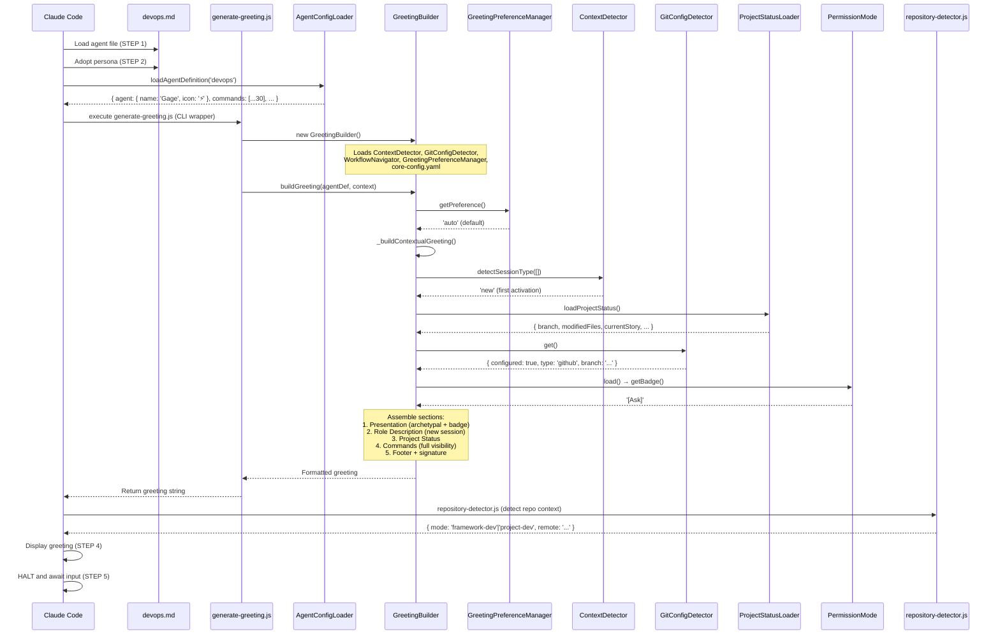

### 1.3 Agent-Specific Config

From `agent-config-requirements.yaml`:

```yaml
devops:
  config_sections:
    - dataLocation
    - cicdLocation
  files_loaded:
    - path: .aios-core/data/technical-preferences.md
      lazy: false
      size: 15KB
  lazy_loading: {}
  performance_target: <50ms
```

### 1.4 Context Brought to Session

| Data | Source | Value |
|------|--------|-------|
| Greeting level | `persona_profile.greeting_levels.archetypal` | `⚡ Gage the Operator ready to deploy!` |
| Signature | `persona_profile.communication.signature_closing` | `— Gage, deployando com confianca 🚀` |
| Role | `persona.role` | GitHub Repository Guardian & Release Manager |
| Commands shown | `filterCommandsByVisibility('full')` | 30 commands with `full` visibility |

---

## 2. Command Registry

| Command | Task File | Category | Elicit |
|---------|-----------|----------|--------|
| `*help` | (built-in) | Core | No |
| `*detect-repo` | (built-in, uses repository-detector.js) | Core | No |
| `*version-check` | github-devops-version-management.md | Quality & Push | No |
| `*pre-push` | github-devops-pre-push-quality-gate.md | Quality & Push | No |
| `*push` | (built-in, orchestrates quality gates + git push) | Quality & Push | Yes |
| `*create-pr` | github-devops-github-pr-automation.md | GitHub | Yes |
| `*configure-ci` | ci-cd-configuration.md | GitHub | Yes |
| `*release` | release-management.md | GitHub | Yes |
| `*cleanup` | github-devops-repository-cleanup.md | Repository | Yes |
| `*init-project-status` | init-project-status.md | Repository | No |
| `*environment-bootstrap` | environment-bootstrap.md | Environment | Yes |
| `*setup-github` | setup-github.md | Environment | Yes |
| `*search-mcp` | search-mcp.md | MCP Management | No |
| `*add-mcp` | add-mcp.md | MCP Management | Yes |
| `*list-mcps` | list-mcps.md | MCP Management | No |
| `*remove-mcp` | remove-mcp.md | MCP Management | Yes |
| `*setup-mcp-docker` | setup-mcp-docker.md | MCP Management | Yes |
| `*check-docs` | check-docs-links.md | Documentation | No |
| `*create-worktree` | create-worktree.md | Worktree | Yes |
| `*list-worktrees` | list-worktrees.md | Worktree | No |
| `*remove-worktree` | remove-worktree.md | Worktree | Yes |
| `*cleanup-worktrees` | cleanup-worktrees.md | Worktree | Yes |
| `*merge-worktree` | merge-worktree.md | Worktree | Yes |
| `*inventory-assets` | (uses asset-inventory.js) | Migration | No |
| `*analyze-paths` | (uses path-analyzer.js) | Migration | No |
| `*migrate-agent` | (uses migrate-agent.js) | Migration | Yes |
| `*migrate-batch` | (uses migrate-agent.js in batch mode) | Migration | Yes |
| `*session-info` | (built-in) | Utilities | No |
| `*guide` | (built-in, rendered from agent .md) | Utilities | No |
| `*exit` | (built-in) | Utilities | No |

---

## 3. Per-Command Execution Traces

### `*pre-push`

**Task file:** `.aios-core/development/tasks/github-devops-pre-push-quality-gate.md`

**Dependencies loaded:**
| File | Type | Status |
|------|------|--------|
| `github-devops-pre-push-quality-gate.md` | Task | EXISTS |
| `pre-push-checklist.md` | Checklist | EXISTS (at `.aios-core/product/checklists/`) |

**Execution flow:**

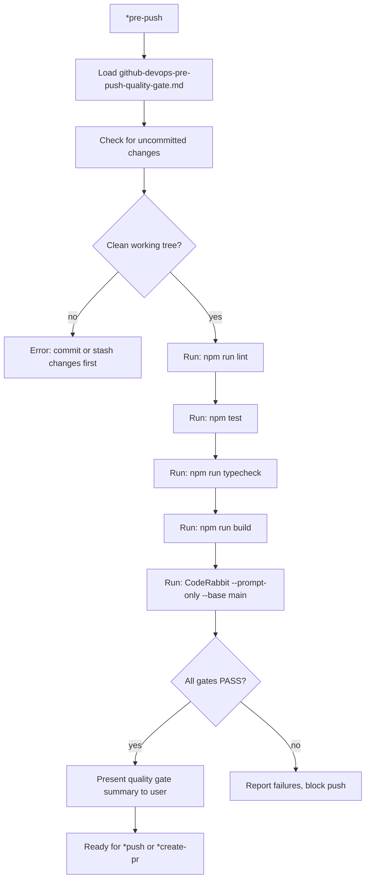

**Tools used:** git (status check), coderabbit (code review), npm (lint/test/typecheck/build)

---

### `*push`

**Task file:** Built-in (orchestrates quality gates + git push)

**Dependencies loaded:**
| File | Type | Status |
|------|------|--------|
| `github-devops-pre-push-quality-gate.md` | Task | EXISTS |
| `repository-detector.js` | Script | EXISTS (at `.aios-core/infrastructure/scripts/`) |

**Execution flow:**

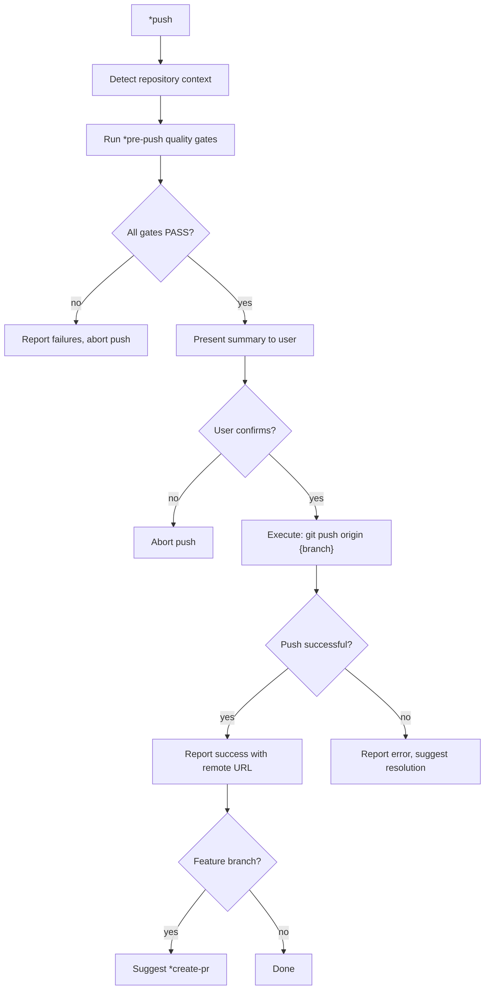

**EXCLUSIVE AUTHORITY:** This is the ONLY agent authorized to execute `git push`.

---

### `*create-pr`

**Task file:** `.aios-core/development/tasks/github-devops-github-pr-automation.md`

**Dependencies loaded:**
| File | Type | Status |
|------|------|--------|
| `github-devops-github-pr-automation.md` | Task | EXISTS |
| `github-pr-template.md` | Template | EXISTS (at `.aios-core/product/templates/`) |

**Execution flow:**

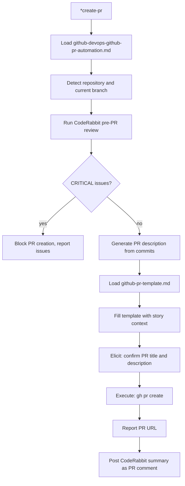

**Tools used:** github-cli (PR creation), coderabbit (pre-PR review), git (commit analysis)

---

### `*version-check`

**Task file:** `.aios-core/development/tasks/github-devops-version-management.md`

**Dependencies loaded:**
| File | Type | Status |
|------|------|--------|
| `github-devops-version-management.md` | Task | EXISTS |

**Execution flow:**

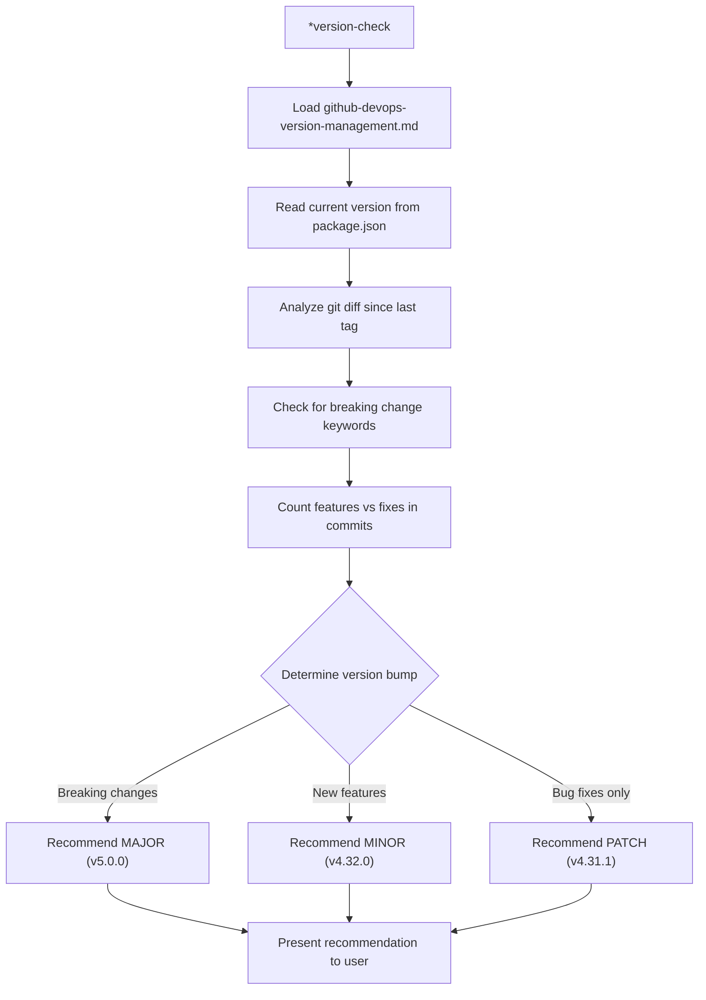

---

### `*release`

**Task file:** `.aios-core/development/tasks/release-management.md`

**Dependencies loaded:**
| File | Type | Status |
|------|------|--------|
| `release-management.md` | Task | EXISTS |
| `changelog-template.md` | Template | EXISTS (at `.aios-core/product/templates/`) |
| `release-checklist.md` | Checklist | EXISTS (at `.aios-core/product/checklists/`) |

**Execution flow:**

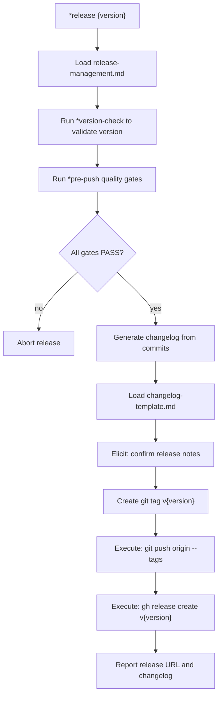

**Tools used:** git (tagging), github-cli (release creation)

---

### `*configure-ci`

**Task file:** `.aios-core/development/tasks/ci-cd-configuration.md`

**Dependencies loaded:**
| File | Type | Status |
|------|------|--------|
| `ci-cd-configuration.md` | Task | EXISTS |
| `github-actions-ci.yml` | Template | EXISTS (at `.aios-core/product/templates/`) |
| `github-actions-cd.yml` | Template | EXISTS (at `.aios-core/product/templates/`) |

**Execution flow:**

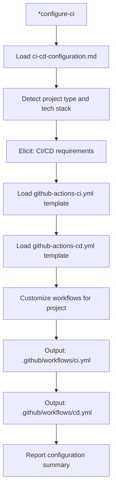

---

### `*cleanup`

**Task file:** `.aios-core/development/tasks/github-devops-repository-cleanup.md`

**Dependencies loaded:**
| File | Type | Status |
|------|------|--------|
| `github-devops-repository-cleanup.md` | Task | EXISTS |
| `branch-manager.js` | Script | EXISTS (at `.aios-core/infrastructure/scripts/`) |

**Execution flow:**

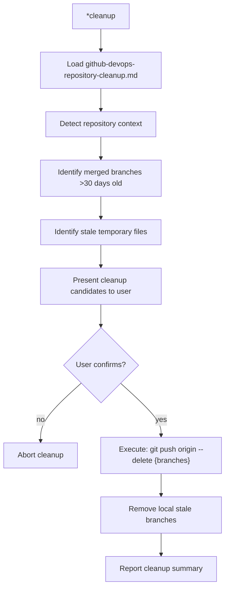

---

### `*environment-bootstrap`

**Task file:** `.aios-core/development/tasks/environment-bootstrap.md`

**Dependencies loaded:**
| File | Type | Status |
|------|------|--------|
| `environment-bootstrap.md` | Task | EXISTS |

**Execution flow:**

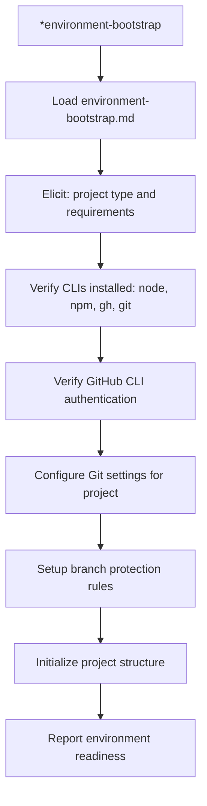

---

### `*setup-github`

**Task file:** `.aios-core/development/tasks/setup-github.md`

**Dependencies loaded:**
| File | Type | Status |
|------|------|--------|
| `setup-github.md` | Task | EXISTS |
| `github-actions-ci.yml` | Template | EXISTS (at `.aios-core/product/templates/`) |
| `github-actions-cd.yml` | Template | EXISTS (at `.aios-core/product/templates/`) |

**Execution flow:**

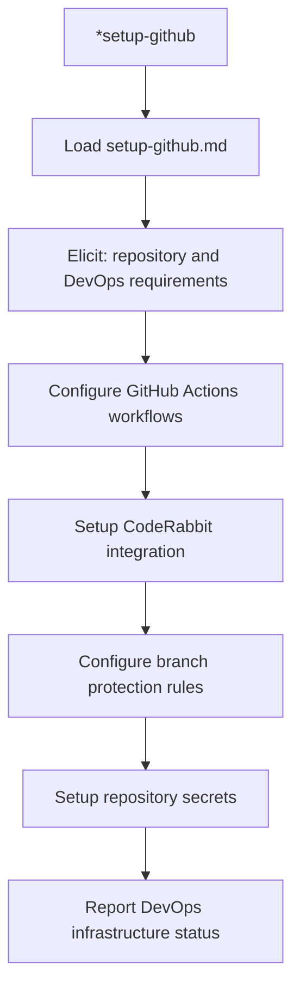

---

### `*search-mcp`, `*add-mcp`, `*list-mcps`, `*remove-mcp`, `*setup-mcp-docker`

**Task files:** `search-mcp.md`, `add-mcp.md`, `list-mcps.md`, `remove-mcp.md`, `setup-mcp-docker.md`

**All tasks:** EXISTS

**Execution flow (representative -- `*add-mcp`):**

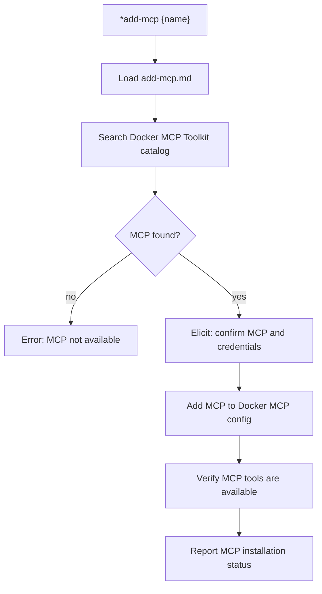

**Tools used:** docker-gateway (Docker MCP Toolkit management)

---

### `*check-docs`

**Task file:** `.aios-core/development/tasks/check-docs-links.md`

**Dependencies loaded:**
| File | Type | Status |
|------|------|--------|
| `check-docs-links.md` | Task | EXISTS |

**Execution flow:**

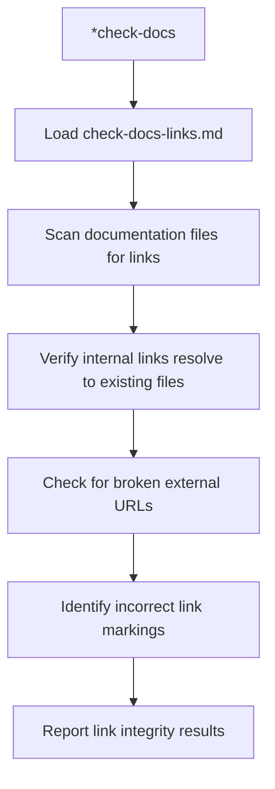

---

### `*create-worktree`, `*list-worktrees`, `*remove-worktree`, `*cleanup-worktrees`, `*merge-worktree`

**Task files:** `create-worktree.md`, `list-worktrees.md`, `remove-worktree.md`, `cleanup-worktrees.md`, `merge-worktree.md`

**All tasks:** EXISTS

**Workflow file:** `.aios-core/development/workflows/auto-worktree.yaml` (EXISTS)

**Execution flow (representative -- `*create-worktree`):**

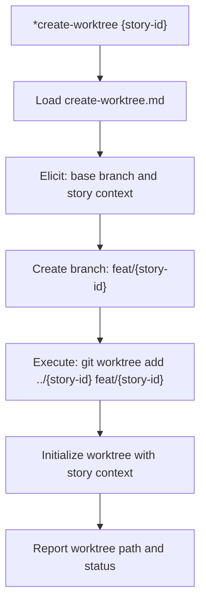

**Execution flow (`*merge-worktree`):**

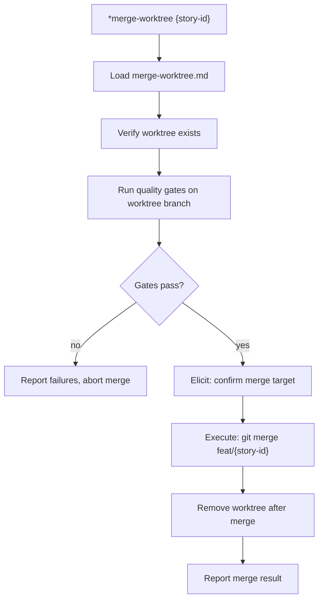

---

### `*inventory-assets`, `*analyze-paths`, `*migrate-agent`, `*migrate-batch`

**Scripts:** `.aios-core/infrastructure/scripts/asset-inventory.js`, `path-analyzer.js`, `migrate-agent.js`

**All scripts:** EXISTS

**Execution flow (representative -- `*migrate-agent`):**

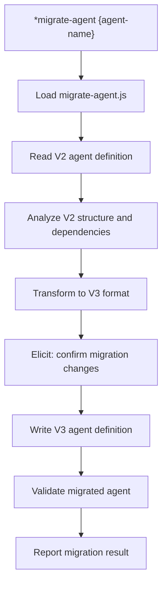

---

### `*init-project-status`

**Task file:** `.aios-core/development/tasks/init-project-status.md`

**Dependencies loaded:**
| File | Type | Status |
|------|------|--------|
| `init-project-status.md` | Task | EXISTS |

**Execution flow:**

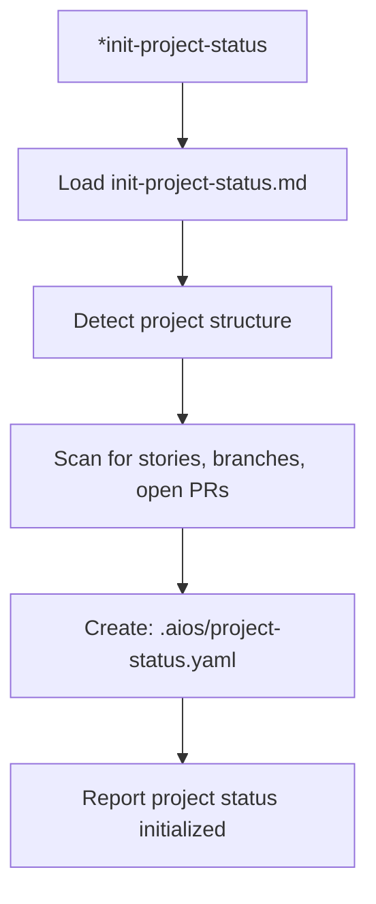

---

### `*help`, `*guide`, `*session-info`, `*detect-repo`, `*exit`

These are built-in commands handled by the agent framework, not external task files.

| Command | Behavior |
|---------|----------|
| `*help` | Renders full command list from `commands[]` in agent definition |
| `*guide` | Renders the `## ⚡ DevOps Guide` section from agent .md |
| `*session-info` | Shows session context (agent history, commands, project status) |
| `*detect-repo` | Calls `repository-detector.js` to identify repo URL and installation mode |
| `*exit` | Exits devops mode, returns to base Claude Code |

---

## 4. Complete Dependency Graph

```mermaid
graph TD
    subgraph "Agent Definition"
        AD[devops.md]
    end

    subgraph "Activation Pipeline"
        GG[generate-greeting.js]
        GB[greeting-builder.js]
        ACL[agent-config-loader.js]
        CD[context-detector.js]
        GCD[git-config-detector.js]
        PSL[project-status-loader.js]
        GPM[greeting-preference-manager.js]
        WN[workflow-navigator.js]
        PM[permissions/index.js]
    end

    subgraph "Config Files"
        CC[core-config.yaml]
        ACR[agent-config-requirements.yaml]
        WP[workflow-patterns.yaml]
        TP[technical-preferences.md]
    end

    subgraph "Task Files (19/19 EXIST)"
        T1[environment-bootstrap.md]
        T2[setup-github.md]
        T3[github-devops-version-management.md]
        T4[github-devops-pre-push-quality-gate.md]
        T5[github-devops-github-pr-automation.md]
        T6[ci-cd-configuration.md]
        T7[github-devops-repository-cleanup.md]
        T8[release-management.md]
        T9[search-mcp.md]
        T10[add-mcp.md]
        T11[list-mcps.md]
        T12[remove-mcp.md]
        T13[setup-mcp-docker.md]
        T14[check-docs-links.md]
        T15[create-worktree.md]
        T16[list-worktrees.md]
        T17[remove-worktree.md]
        T18[cleanup-worktrees.md]
        T19[merge-worktree.md]
    end

    subgraph "Workflow (1/1 EXISTS)"
        W1[auto-worktree.yaml]
    end

    subgraph "Templates (0/4 at declared path)"
        TM1["github-pr-template.md<br/>(EXISTS at product/templates/)"]
        TM2["github-actions-ci.yml<br/>(EXISTS at product/templates/)"]
        TM3["github-actions-cd.yml<br/>(EXISTS at product/templates/)"]
        TM4["changelog-template.md<br/>(EXISTS at product/templates/)"]
    end

    subgraph "Checklists (0/2 at declared path)"
        CL1["pre-push-checklist.md<br/>(EXISTS at product/checklists/)"]
        CL2["release-checklist.md<br/>(EXISTS at product/checklists/)"]
    end

    subgraph "Infrastructure Scripts (3/3 EXIST)"
        S1[asset-inventory.js]
        S2[path-analyzer.js]
        S3[migrate-agent.js]
    end

    subgraph "Utils (3/5 EXIST)"
        U1[branch-manager.js]
        U2[repository-detector.js]
        U3[git-wrapper.js]
    end

    subgraph "Utils MISSING"
        UM1[gitignore-manager]
        UM2[version-tracker]
    end

    subgraph "Tools"
        TOOL1[coderabbit]
        TOOL2[github-cli]
        TOOL3["git (EXCLUSIVE push)"]
        TOOL4[docker-gateway]
    end

    AD --> GG
    GG --> GB
    AD --> ACL
    GB --> CD
    GB --> GCD
    GB --> PSL
    GB --> GPM
    GB --> WN
    GB --> PM
    ACL --> ACR
    ACL --> CC
    ACL --> TP
    WN --> WP
    GPM --> CC

    AD -.->|commands| T1
    AD -.->|commands| T2
    AD -.->|commands| T3
    AD -.->|commands| T4
    AD -.->|commands| T5
    AD -.->|commands| T6
    AD -.->|commands| T7
    AD -.->|commands| T8
    AD -.->|commands| T9
    AD -.->|commands| T10
    AD -.->|commands| T11
    AD -.->|commands| T12
    AD -.->|commands| T13
    AD -.->|commands| T14
    AD -.->|commands| T15
    AD -.->|commands| T16
    AD -.->|commands| T17
    AD -.->|commands| T18
    AD -.->|commands| T19

    AD -.->|workflow| W1

    T5 -.->|template| TM1
    T6 -.->|template| TM2
    T6 -.->|template| TM3
    T8 -.->|template| TM4
    T4 -.->|checklist| CL1
    T8 -.->|checklist| CL2

    AD -.->|script| S1
    AD -.->|script| S2
    AD -.->|script| S3

    AD -.->|util| U1
    AD -.->|util| U2
    AD -.->|util| U3
    AD -.->|util| UM1
    AD -.->|util| UM2

    AD -.->|tool| TOOL1
    AD -.->|tool| TOOL2
    AD -.->|tool| TOOL3
    AD -.->|tool| TOOL4
```

---

## 5. Cross-Agent Interactions

| Interaction | Direction | Trigger |
|-------------|-----------|---------|
| @dev -> @devops | Delegate | Git push and PR creation after story completion |
| @sm -> @devops | Delegate | Push operations during sprint workflow |
| @architect -> @devops | Delegate | Repository operations, PR creation |
| @devops -> @dev | Redirect | Code development tasks (not in scope) |
| @devops -> @sm | Redirect | Story management tasks (not in scope) |
| @devops -> @architect | Redirect | Architecture design tasks (not in scope) |

### Delegation Rules (from agent definition)

**Receives delegation from @dev (Dex) when:**
- Story implementation is complete and needs pushing
- Pull request creation is required
- Release tagging is needed after merge

**Receives delegation from @sm (River) when:**
- Sprint push workflow is triggered
- Coordinated multi-story push is needed

**Receives delegation from @architect (Aria) when:**
- Architecture documents need pushing to remote
- CI/CD pipeline configuration is required
- Repository structure changes need deployment

**EXCLUSIVE git push authority:**
- ALLOWED (only @devops): `git push`, `git push --force`, `git push origin --delete`, `gh pr create`, `gh pr merge`, `gh release create`
- ALL OTHER AGENTS BLOCKED: Must delegate push operations to @devops

**Quality gates are mandatory before any push:**
- CodeRabbit review (0 CRITICAL issues)
- `npm run lint` (must PASS)
- `npm test` (must PASS)
- `npm run typecheck` (must PASS)
- `npm run build` (must PASS)
- Story status = "Done" or "Ready for Review"
- No uncommitted changes
- No merge conflicts

**Enforcement mechanism:**
- Git pre-push hook at `.git/hooks/pre-push`
- Checks `$AIOS_ACTIVE_AGENT` environment variable
- Blocks push if agent != "github-devops"

---

## 6. Missing Dependencies

| File | Type | Declared Location | Actual Location | Impact |
|------|------|-------------------|-----------------|--------|
| `github-pr-template.md` | Template | `.aios-core/development/templates/` | `.aios-core/product/templates/` | Path mismatch -- file exists but at different path |
| `github-actions-ci.yml` | Template | `.aios-core/development/templates/` | `.aios-core/product/templates/` | Path mismatch -- file exists but at different path |
| `github-actions-cd.yml` | Template | `.aios-core/development/templates/` | `.aios-core/product/templates/` | Path mismatch -- file exists but at different path |
| `changelog-template.md` | Template | `.aios-core/development/templates/` | `.aios-core/product/templates/` | Path mismatch -- file exists but at different path |
| `pre-push-checklist.md` | Checklist | `.aios-core/development/checklists/` | `.aios-core/product/checklists/` | Path mismatch -- file exists but at different path |
| `release-checklist.md` | Checklist | `.aios-core/development/checklists/` | `.aios-core/product/checklists/` | Path mismatch -- file exists but at different path |
| `gitignore-manager` | Util | `.aios-core/development/utils/` | (not found anywhere) | MISSING -- command may fall back to manual gitignore handling |
| `version-tracker` | Util | `.aios-core/development/utils/` | (not found anywhere) | MISSING -- version tracking relies on git tags and package.json |

**Note on path resolution:** The `dependencies.templates` and `dependencies.checklists` in the agent YAML resolve via `IDE-FILE-RESOLUTION` to `.aios-core/development/{type}/{name}`. However, all 4 templates and 2 checklists actually reside in `.aios-core/product/{type}/`. The 3 infrastructure scripts (`asset-inventory.js`, `path-analyzer.js`, `migrate-agent.js`) and 3 utils (`branch-manager.js`, `repository-detector.js`, `git-wrapper.js`) exist at `.aios-core/infrastructure/scripts/`, not at the declared path.

---

*Traced from source on 2026-02-05 | Story AIOS-TRACE-001*
