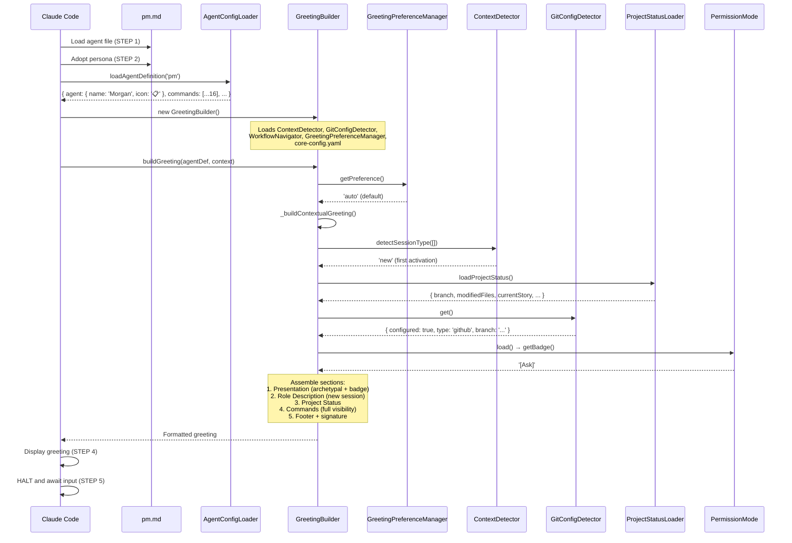
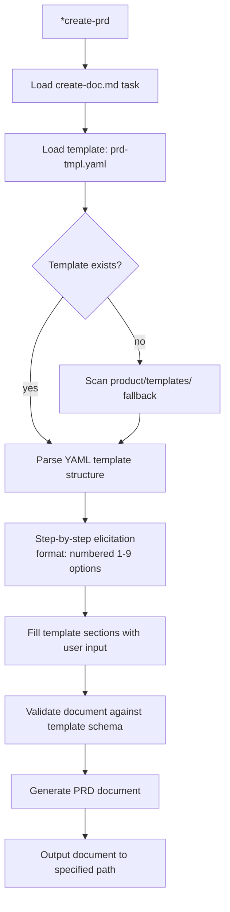
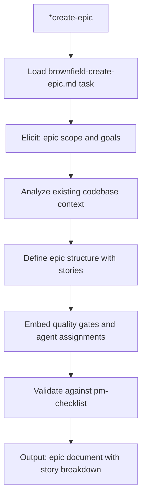
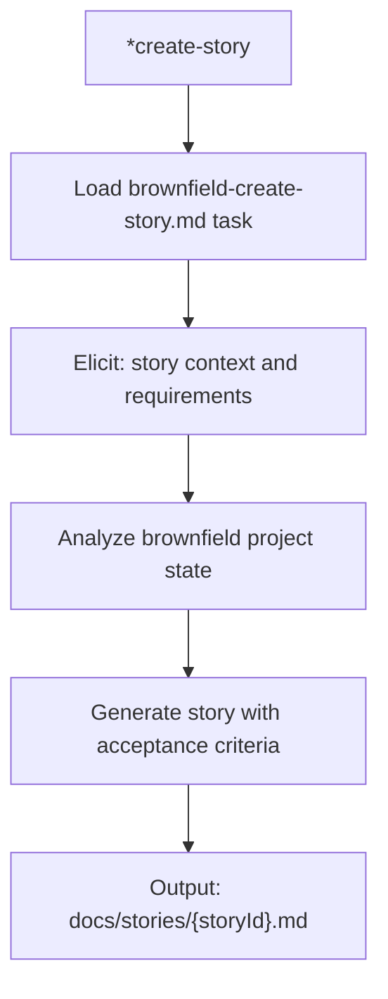
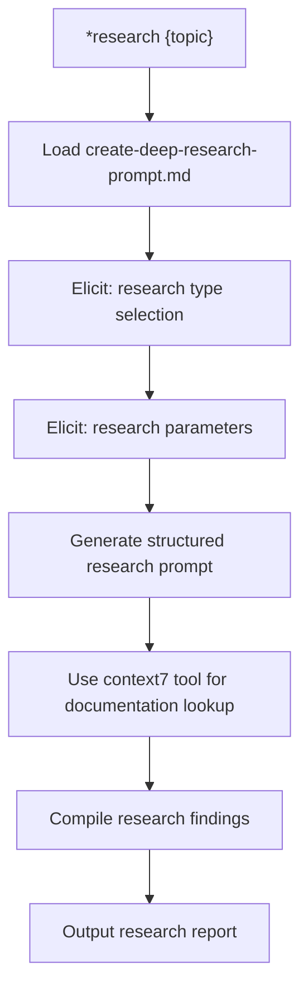
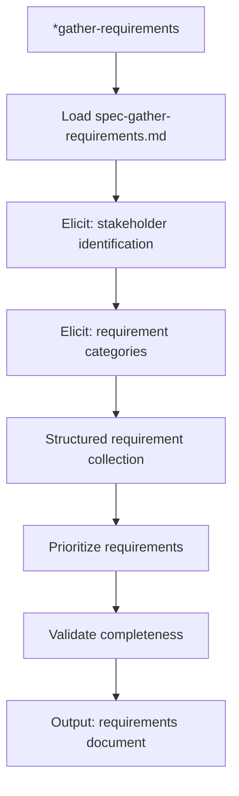
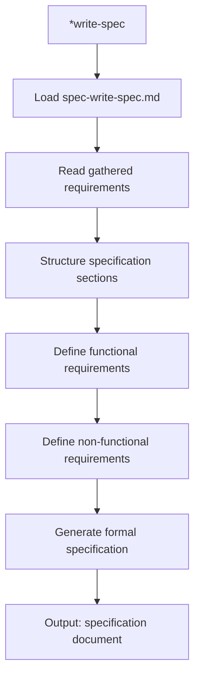
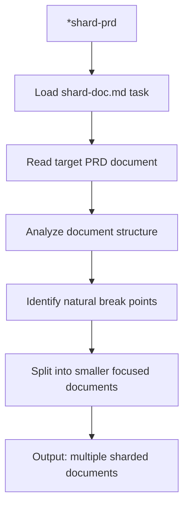

# @pm (Morgan) - Execution Trace

> Traced from source code, not documentation.
> Agent definition: `.aios-core/development/agents/pm.md`

## 1. Activation Trace

### 1.1 Files Loaded (in order)

| Order | File | Loader | Purpose |
|-------|------|--------|---------|
| 1 | `.aios-core/development/agents/pm.md` | AgentConfigLoader.loadAgentDefinition() | Agent definition (YAML block) |
| 2 | `.aios-core/core-config.yaml` | GreetingBuilder._loadConfig() | Core configuration |
| 3 | `.aios-core/data/agent-config-requirements.yaml` | AgentConfigLoader.loadRequirements() | Config sections: devStoryLocation, storyBacklog |
| 4 | `.aios-core/data/workflow-patterns.yaml` | WorkflowNavigator._loadPatterns() | Workflow state detection |
| 5 | `.aios/session-state.json` | ContextDetector._detectFromFile() | Session type detection (if no conversation history) |
| 6 | `.aios/project-status.yaml` | ProjectStatusLoader.loadCache() | Cached project status (60s TTL) |

**Note:** As of Story ACT-8, PM loads `coding-standards.md` (25KB) and `tech-stack.md` (30KB) at activation for technical context. Both files are high-priority cached, so subsequent activations hit cache. Performance target remains <100ms.

### 1.2 Greeting Construction

**Activation path:** Direct invocation (STEP 3 calls `GreetingBuilder.buildGreeting()`)



### 1.3 Agent-Specific Config

From `agent-config-requirements.yaml`:

```yaml
pm:
  config_sections:
    - devStoryLocation
    - storyBacklog
  files_loaded:
    - path: docs/framework/coding-standards.md    # Added in Story ACT-8
      lazy: false
      size: 25KB
    - path: docs/framework/tech-stack.md          # Added in Story ACT-8
      lazy: false
      size: 30KB
  lazy_loading: {}
  performance_target: <100ms
```

**Note:** As of Story ACT-8, PM now loads `coding-standards.md` and `tech-stack.md` during activation so it has technical context when managing stories that involve development standards or technology decisions.

### 1.4 Context Brought to Session

| Data | Source | Value |
|------|--------|-------|
| Greeting level | `persona_profile.greeting_levels.archetypal` | `📋 Morgan the Strategist ready to strategize!` |
| Signature | `persona_profile.communication.signature_closing` | `— Morgan, planejando o futuro 📊` |
| Role | `persona.role` | Investigative Product Strategist & Market-Savvy PM |
| Commands shown | `filterCommandsByVisibility('full')` | 16 commands with `full` visibility |

---

## 2. Command Registry

| Command | Task File | Visibility | Elicit |
|---------|-----------|------------|--------|
| `*help` | (built-in) | full, quick, key | No |
| `*create-prd` | create-doc.md + prd-tmpl.yaml | full, quick, key | Yes |
| `*create-brownfield-prd` | create-doc.md + brownfield-prd-tmpl.yaml | full, quick | Yes |
| `*create-epic` | brownfield-create-epic.md | full, quick, key | Yes |
| `*create-story` | brownfield-create-story.md | full, quick | Yes |
| `*doc-out` | (built-in) | full | No |
| `*shard-prd` | shard-doc.md | full | No |
| `*research` | create-deep-research-prompt.md | full, quick | Yes |
| `*gather-requirements` | spec-gather-requirements.md | full, quick | Yes |
| `*write-spec` | spec-write-spec.md | full, quick | Yes |
| `*session-info` | (built-in) | full | No |
| `*guide` | (built-in, rendered from agent .md) | full, quick | No |
| `*yolo` | (built-in) | full | No |
| `*exit` | (built-in) | full | No |

**Additional task dependencies (not directly mapped to commands):**

| Task File | Used By | Status |
|-----------|---------|--------|
| `correct-course.md` | Delegated to @aios-master | EXISTS |
| `execute-checklist.md` | Checklist execution | EXISTS |

---

## 3. Per-Command Execution Traces

### `*create-prd`

**Task file:** `.aios-core/development/tasks/create-doc.md`
**Template:** `.aios-core/development/templates/prd-tmpl.yaml` (MISSING in development/templates/)

**Dependencies loaded:**
| File | Type | Status |
|------|------|--------|
| `create-doc.md` | Task | EXISTS |
| `prd-tmpl.yaml` | Template | MISSING in development/templates/ |
| `.aios-core/product/templates/prd-tmpl.yaml` | Template | EXISTS (fallback) |
| `.aios-core/data/elicitation-methods` | Data | Referenced by create-doc |

**Execution flow:**



**Expected output:** Complete Product Requirements Document

---

### `*create-brownfield-prd`

**Task file:** `.aios-core/development/tasks/create-doc.md`
**Template:** `.aios-core/development/templates/brownfield-prd-tmpl.yaml` (MISSING in development/templates/)

**Dependencies loaded:**
| File | Type | Status |
|------|------|--------|
| `create-doc.md` | Task | EXISTS |
| `brownfield-prd-tmpl.yaml` | Template | MISSING in development/templates/ |
| `.aios-core/product/templates/brownfield-prd-tmpl.yaml` | Template | EXISTS (fallback) |

Same flow as `*create-prd` with brownfield-specific template that includes existing project context analysis.

---

### `*create-epic`

**Task file:** `.aios-core/development/tasks/brownfield-create-epic.md`

**Dependencies loaded:**
| File | Type | Status |
|------|------|--------|
| `brownfield-create-epic.md` | Task | EXISTS |
| `.aios-core/product/templates/prd-tmpl.yaml` | Template | EXISTS (epic structure) |
| `.aios-core/product/checklists/pm-checklist.md` | Checklist | EXISTS |

**Execution flow:**



**Expected output:** Epic document with story breakdown, quality gates, and agent assignments

---

### `*create-story`

**Task file:** `.aios-core/development/tasks/brownfield-create-story.md`

**Dependencies loaded:**
| File | Type | Status |
|------|------|--------|
| `brownfield-create-story.md` | Task | EXISTS |
| `.aios-core/product/templates/story-tmpl.yaml` | Template | EXISTS (in product/templates/) |

**Execution flow:**



**Expected output:** User story document with acceptance criteria

---

### `*research`

**Task file:** `.aios-core/development/tasks/create-deep-research-prompt.md`

**Dependencies loaded:**
| File | Type | Status |
|------|------|--------|
| `create-deep-research-prompt.md` | Task | EXISTS |

**Execution flow:**



**Tools used:** github-cli (repo access), context7 (library docs)

---

### `*gather-requirements`

**Task file:** `.aios-core/development/tasks/spec-gather-requirements.md`

**Dependencies loaded:**
| File | Type | Status |
|------|------|--------|
| `spec-gather-requirements.md` | Task | EXISTS |

**Execution flow:**



**Expected output:** Structured requirements document ready for spec writing

---

### `*write-spec`

**Task file:** `.aios-core/development/tasks/spec-write-spec.md`

**Dependencies loaded:**
| File | Type | Status |
|------|------|--------|
| `spec-write-spec.md` | Task | EXISTS |

**Execution flow:**



**Expected output:** Formal specification document from gathered requirements

---

### `*shard-prd`

**Task file:** `.aios-core/development/tasks/shard-doc.md`

**Dependencies loaded:**
| File | Type | Status |
|------|------|--------|
| `shard-doc.md` | Task | EXISTS |

**Execution flow:**



**Expected output:** PRD broken into smaller, focused document parts

---

### `*help`, `*guide`, `*session-info`, `*doc-out`, `*yolo`, `*exit`

These are built-in commands handled by the agent framework, not external task files.

| Command | Behavior |
|---------|----------|
| `*help` | Renders full command list from `commands[]` in agent definition |
| `*guide` | Renders the `## Product Manager Guide` section from agent .md |
| `*session-info` | Shows session context (agent history, commands, project status) |
| `*doc-out` | Outputs complete document content |
| `*yolo` | Toggles confirmation skipping mode |
| `*exit` | Exits PM mode, returns to base Claude Code |

---

## 4. Complete Dependency Graph

```mermaid
graph TD
    subgraph "Agent Definition"
        AD[pm.md]
    end

    subgraph "Activation Pipeline"
        GB[greeting-builder.js]
        ACL[agent-config-loader.js]
        CD[context-detector.js]
        GCD[git-config-detector.js]
        PSL[project-status-loader.js]
        GPM[greeting-preference-manager.js]
        WN[workflow-navigator.js]
        PM[permissions/index.js]
    end

    subgraph "Config Files"
        CC[core-config.yaml]
        ACR[agent-config-requirements.yaml]
        WP[workflow-patterns.yaml]
    end

    subgraph "Task Files"
        T1[create-doc.md]
        T2[correct-course.md]
        T3[create-deep-research-prompt.md]
        T4[brownfield-create-epic.md]
        T5[brownfield-create-story.md]
        T6[execute-checklist.md]
        T7[shard-doc.md]
        T8[spec-gather-requirements.md]
        T9[spec-write-spec.md]
    end

    subgraph "Templates (MISSING in development/templates/)"
        TM1[prd-tmpl.yaml]
        TM2[brownfield-prd-tmpl.yaml]
    end

    subgraph "Templates (EXISTS in product/templates/)"
        TP1[prd-tmpl.yaml]
        TP2[brownfield-prd-tmpl.yaml]
        TP3[story-tmpl.yaml]
    end

    subgraph "Checklists (MISSING in development/checklists/)"
        CL1[pm-checklist.md]
        CL2[change-checklist.md]
    end

    subgraph "Checklists (EXISTS in product/checklists/)"
        CP1[pm-checklist.md]
        CP2[change-checklist.md]
    end

    subgraph "Orchestration (TerminalSpawner)"
        TS[terminal-spawner.js]
        EA[executor-assignment.js]
        PS[pm.sh]
    end

    AD --> GB
    AD --> ACL
    GB --> CD
    GB --> GCD
    GB --> PSL
    GB --> GPM
    GB --> WN
    GB --> PM
    ACL --> ACR
    ACL --> CC
    WN --> WP
    GPM --> CC

    AD -.->|commands| T1
    AD -.->|commands| T2
    AD -.->|commands| T3
    AD -.->|commands| T4
    AD -.->|commands| T5
    AD -.->|commands| T6
    AD -.->|commands| T7
    AD -.->|commands| T8
    AD -.->|commands| T9

    T1 -.->|template| TM1
    T1 -.->|template| TM2
    TM1 -.->|fallback| TP1
    TM2 -.->|fallback| TP2
    T5 -.->|template| TP3
    T6 -.->|checklist| CL1
    T6 -.->|checklist| CL2
    CL1 -.->|fallback| CP1
    CL2 -.->|fallback| CP2

    AD -.->|orchestration| TS
    AD -.->|orchestration| EA
    AD -.->|orchestration| PS
```



---

## 5. Cross-Agent Interactions

| Interaction | Direction | Trigger |
|-------------|-----------|---------|
| @pm -> @po | Provides | PRDs and strategic direction |
| @pm -> @sm | Delegate | Story creation via `*draft` |
| @pm -> @analyst | Delegate | Deep research via `*research` |
| @pm -> @architect | Collaborate | Technical architecture decisions |
| @pm -> @aios-master | Escalate | Course corrections via `*correct-course` |
| @pm -> @devops | Delegate | Git push operations, PR creation |
| @analyst -> @pm | Receives | Project brief for PRD creation |
| @aios-master -> @pm | Receives | Framework modification requests |

### Delegation Rules (from agent definition)

**CRITICAL CONSTRAINT: NEVER_EMULATE_AGENTS**

PM must NEVER emulate other agents within its context window. When a task requires another agent, PM uses TerminalSpawner to spawn them in SEPARATE terminals, preventing context pollution.

**Spawning Workflow:**
1. **Analyze** - Determine required agent and task from user request
2. **Assign** - Use ExecutorAssignment to get the correct agent for the work type
3. **Prepare** - Create context file with story, relevant files, and instructions
4. **Spawn** - Call `TerminalSpawner.spawnAgent(agent, task, context)`
5. **Wait** - Poll for agent completion (respects timeout)
6. **Return** - Present agent output to user

**Integration modules:**
| Module | Path | Status |
|--------|------|--------|
| TerminalSpawner | `.aios-core/core/orchestration/terminal-spawner.js` | EXISTS |
| ExecutorAssignment | `.aios-core/core/orchestration/executor-assignment.js` | EXISTS |
| PM Script | `.aios-core/scripts/pm.sh` | EXISTS |

**Delegates to @sm when:**
- Story creation from epics
- Sprint planning and story breakdown

**Delegates to @analyst when:**
- Deep market research
- Competitive analysis
- Data-driven insights

**Delegates to @architect when:**
- Technical architecture decisions
- Technology selection

**Escalates to @aios-master when:**
- Course corrections detected
- Framework modifications needed

**Retains:**
- PRD creation and management
- Epic structure and breakdown
- Product strategy and vision
- Feature prioritization (MoSCoW, RICE)
- Stakeholder communication
- Requirements gathering and spec writing

**Git restrictions:**
- ALLOWED: `git status`, `git log`, `git diff`, `git branch -a`
- BLOCKED: `git push`, `git push --force`, `gh pr create`

---

## 6. Missing Dependencies

| File | Type | Referenced By | Impact |
|------|------|---------------|--------|
| `prd-tmpl.yaml` | Template | `*create-prd` (in development/templates/) | Falls back to product/templates/ (EXISTS there) |
| `brownfield-prd-tmpl.yaml` | Template | `*create-brownfield-prd` (in development/templates/) | Falls back to product/templates/ (EXISTS there) |
| `pm-checklist.md` | Checklist | `execute-checklist.md` (in development/checklists/) | Falls back to product/checklists/ (EXISTS there) |
| `change-checklist.md` | Checklist | `execute-checklist.md` (in development/checklists/) | Falls back to product/checklists/ (EXISTS there) |

**Note:** All 9 task files referenced in dependencies exist in `.aios-core/development/tasks/`. The 2 templates and 2 checklists are missing from `development/` but exist in `product/` as fallback locations.

---

*Traced from source on 2026-02-05 | Story AIOS-TRACE-001*
