# @po (Pax) - Execution Trace

> Traced from source code, not documentation.
> Agent definition: `.aios-core/development/agents/po.md`

## 1. Activation Trace

### 1.1 Files Loaded (in order)

| Order | File | Loader | Purpose |
|-------|------|--------|---------|
| 1 | `.aios-core/development/agents/po.md` | AgentConfigLoader.loadAgentDefinition() | Agent definition (YAML block) |
| 2 | `.aios-core/core-config.yaml` | GreetingBuilder._loadConfig() | Core configuration |
| 3 | `.aios-core/data/agent-config-requirements.yaml` | AgentConfigLoader.loadRequirements() | Config sections: devStoryLocation, prd, storyBacklog, templatesLocation |
| 4 | `.aios-core/data/workflow-patterns.yaml` | WorkflowNavigator._loadPatterns() | Workflow state detection |
| 5 | `.aios-core/product/data/elicitation-methods.md` | AgentConfigLoader.loadFile() | Elicitation methods (always loaded, 5KB) |
| 6 | `.aios/session-state.json` | ContextDetector._detectFromFile() | Session type detection (if no conversation history) |
| 7 | `.aios/project-status.yaml` | ProjectStatusLoader.loadCache() | Cached project status (60s TTL) |

### 1.2 Greeting Construction

**Activation path:** Direct invocation (STEP 3 calls `GreetingBuilder.buildGreeting()`)

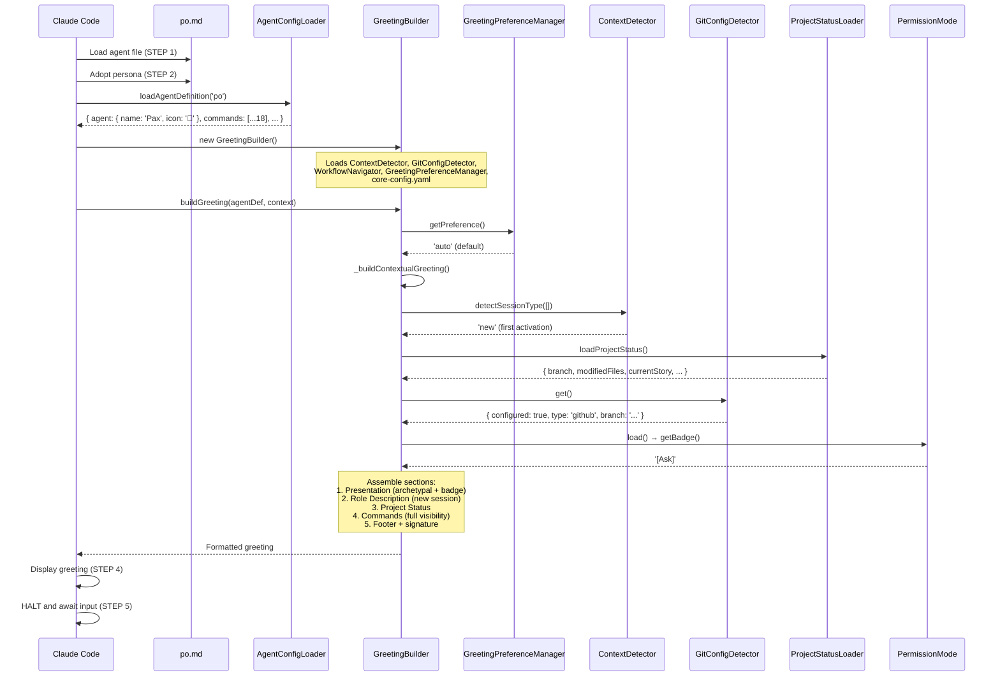

### 1.3 Agent-Specific Config

From `agent-config-requirements.yaml`:

```yaml
po:
  config_sections:
    - devStoryLocation
    - prd
    - storyBacklog
    - templatesLocation
  files_loaded:
    - path: .aios-core/product/data/elicitation-methods.md
      lazy: false
      size: 5KB
  lazy_loading:
    story_templates: true      # Load when creating stories
    prd_templates: true        # Load when creating PRDs
  performance_target: <75ms
```

### 1.4 Context Brought to Session

| Data | Source | Value |
|------|--------|-------|
| Greeting level | `persona_profile.greeting_levels.archetypal` | `🎯 Pax the Balancer ready to balance!` |
| Signature | `persona_profile.communication.signature_closing` | `— Pax, equilibrando prioridades 🎯` |
| Role | `persona.role` | Technical Product Owner & Process Steward |
| Commands shown | `filterCommandsByVisibility('full')` | 18 commands with `full` visibility |

---

## 2. Command Registry

| Command | Task File | Visibility | Elicit |
|---------|-----------|------------|--------|
| `*help` | (built-in) | full, quick, key | No |
| `*backlog-add` | po-backlog-add.md | full, quick | Yes |
| `*backlog-review` | po-manage-story-backlog.md | full, quick | Optional |
| `*backlog-summary` | po-manage-story-backlog.md | quick, key | No |
| `*backlog-prioritize` | po-manage-story-backlog.md | full | Yes |
| `*backlog-schedule` | po-manage-story-backlog.md | full | Yes |
| `*stories-index` | po-stories-index.md | full, quick | No |
| `*validate-story-draft` | validate-next-story.md | full, quick, key | Yes |
| `*sync-story` | po-sync-story.md | full | Yes |
| `*pull-story` | po-pull-story.md | full | Yes |
| `*execute-checklist-po` | execute-checklist.md + po-master-checklist.md | quick | Optional |
| `*shard-doc` | shard-doc.md | full | Yes |
| `*doc-out` | (built-in) | full | No |
| `*session-info` | (built-in) | full | No |
| `*guide` | (built-in, rendered from agent .md) | full, quick | No |
| `*yolo` | (built-in) | full | No |
| `*exit` | (built-in) | full | No |

**NOTE:** `create-epic` and `create-story` have been REMOVED from @po. Epic creation is delegated to @pm, story creation is delegated to @sm.

---

## 3. Per-Command Execution Traces

### `*backlog-add`

**Task file:** `.aios-core/development/tasks/po-backlog-add.md`

**Dependencies loaded:**
| File | Type | Status |
|------|------|--------|
| `po-backlog-add.md` | Task | EXISTS |
| `.aios-core/product/data/elicitation-methods.md` | Data | EXISTS (pre-loaded) |
| `docs/stories/backlog.yaml` | Data | Dynamically loaded |

**Execution flow:**

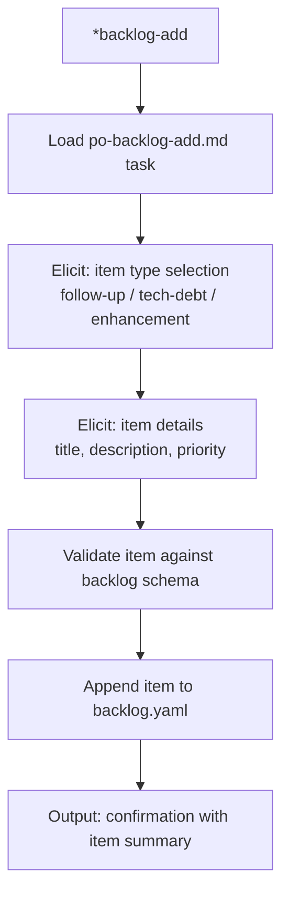

**Expected output:** New backlog item added with unique ID, priority, and type classification.

---

### `*backlog-review`

**Task file:** `.aios-core/development/tasks/po-manage-story-backlog.md`

**Dependencies loaded:**
| File | Type | Status |
|------|------|--------|
| `po-manage-story-backlog.md` | Task | EXISTS |
| `docs/stories/backlog.yaml` | Data | Dynamically loaded |
| `docs/stories/active/` | Directory | Scanned for active stories |

**Execution flow:**

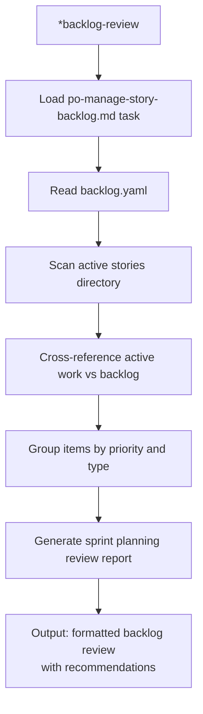

**Expected output:** Sprint planning review with prioritized items and scheduling recommendations.

---

### `*backlog-summary`

**Task file:** `.aios-core/development/tasks/po-manage-story-backlog.md`

**Dependencies loaded:**
| File | Type | Status |
|------|------|--------|
| `po-manage-story-backlog.md` | Task | EXISTS |
| `docs/stories/backlog.yaml` | Data | Dynamically loaded |

**Execution flow:**

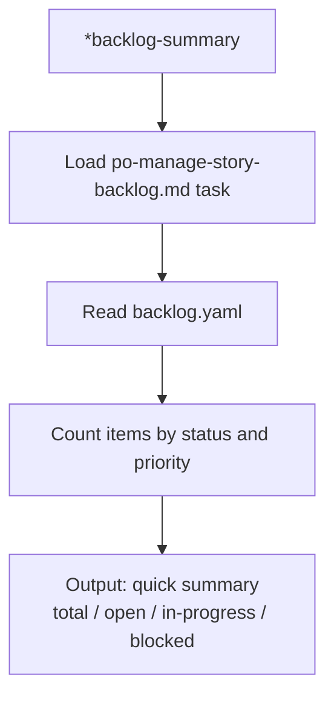

**Expected output:** Quick status counts and health indicators for the backlog.

---

### `*backlog-prioritize`

**Task file:** `.aios-core/development/tasks/po-manage-story-backlog.md`

**Dependencies loaded:**
| File | Type | Status |
|------|------|--------|
| `po-manage-story-backlog.md` | Task | EXISTS |
| `docs/stories/backlog.yaml` | Data | Dynamically loaded |

**Execution flow:**

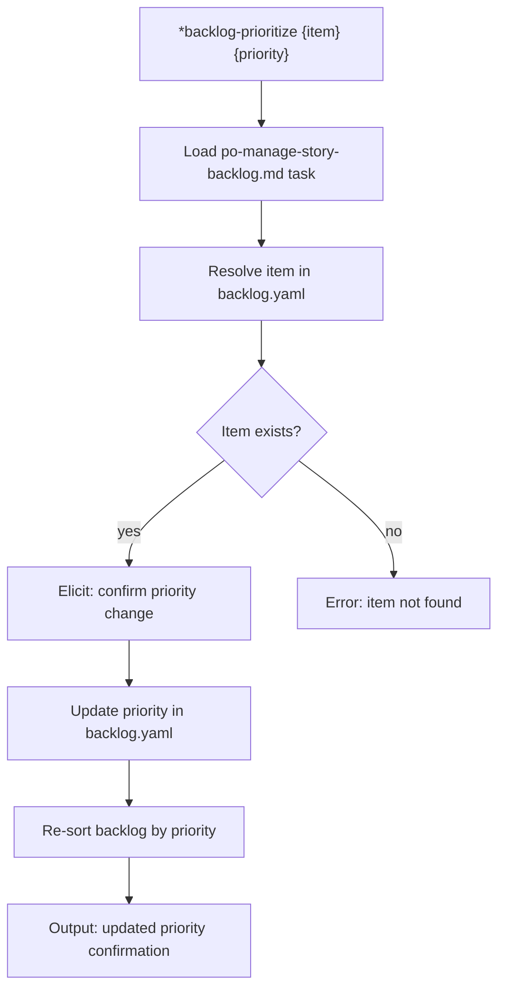

---

### `*backlog-schedule`

**Task file:** `.aios-core/development/tasks/po-manage-story-backlog.md`

**Dependencies loaded:**
| File | Type | Status |
|------|------|--------|
| `po-manage-story-backlog.md` | Task | EXISTS |
| `docs/stories/backlog.yaml` | Data | Dynamically loaded |

**Execution flow:**

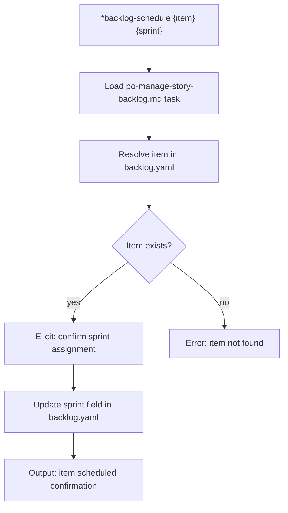

---

### `*stories-index`

**Task file:** `.aios-core/development/tasks/po-stories-index.md`

**Dependencies loaded:**
| File | Type | Status |
|------|------|--------|
| `po-stories-index.md` | Task | EXISTS |
| `docs/stories/` | Directory | Scanned recursively |

**Execution flow:**

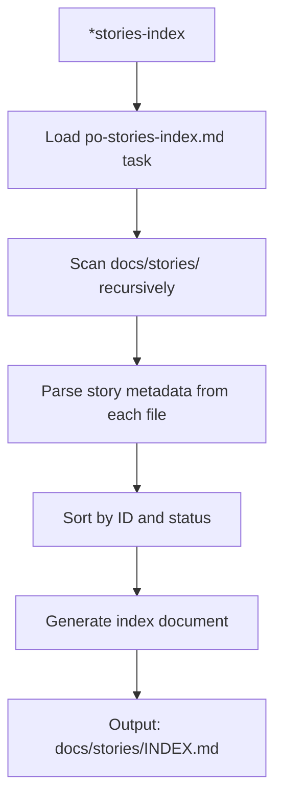

**Expected output:** Regenerated story index with all stories categorized by status.

---

### `*validate-story-draft`

**Task file:** `.aios-core/development/tasks/validate-next-story.md`

**Dependencies loaded:**
| File | Type | Status |
|------|------|--------|
| `validate-next-story.md` | Task | EXISTS |
| `.aios-core/product/templates/story-tmpl.yaml` | Template | EXISTS |
| `.aios-core/product/checklists/po-master-checklist.md` | Checklist | EXISTS |

**Execution flow:**

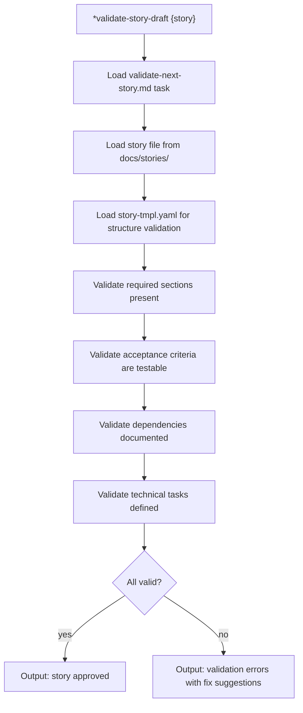

**Expected output:** Validation report with pass/fail per criterion and actionable fix suggestions.

---

### `*sync-story`

**Task file:** `.aios-core/development/tasks/po-sync-story.md`

**Dependencies loaded:**
| File | Type | Status |
|------|------|--------|
| `po-sync-story.md` | Task | EXISTS |
| Story file from `docs/stories/` | Input | Required |

**Execution flow:**

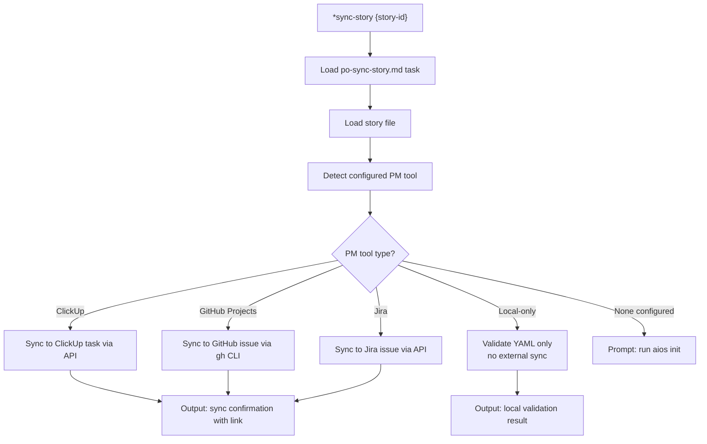

**Tools used:** github-cli (GitHub Projects mode)

**PM tool-agnostic:** Works with ClickUp, GitHub Projects, Jira, or local-only mode.

---

### `*pull-story`

**Task file:** `.aios-core/development/tasks/po-pull-story.md`

**Dependencies loaded:**
| File | Type | Status |
|------|------|--------|
| `po-pull-story.md` | Task | EXISTS |
| Story file from `docs/stories/` | Input | Required |

**Execution flow:**

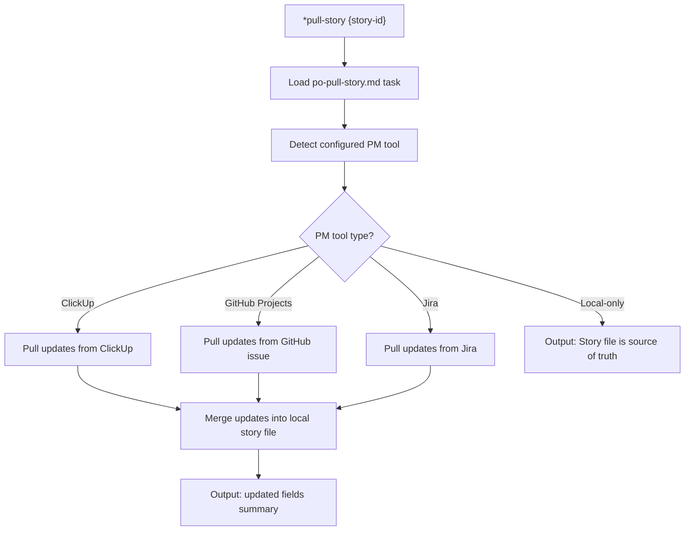

**Tools used:** github-cli (GitHub Projects mode)

**PM tool-agnostic:** Works with ClickUp, GitHub Projects, Jira, or local-only mode.

---

### `*execute-checklist-po`

**Task file:** `.aios-core/development/tasks/execute-checklist.md`

**Dependencies loaded:**
| File | Type | Status |
|------|------|--------|
| `execute-checklist.md` | Task | EXISTS |
| `.aios-core/product/checklists/po-master-checklist.md` | Checklist | EXISTS |
| `.aios-core/scripts/execute-task.js` | Script | Referenced |

**Execution flow:**

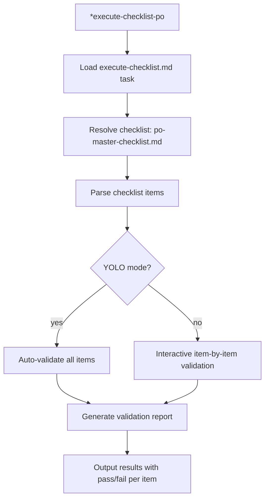

---

### `*shard-doc`

**Task file:** `.aios-core/development/tasks/shard-doc.md`

**Dependencies loaded:**
| File | Type | Status |
|------|------|--------|
| `shard-doc.md` | Task | EXISTS |
| Target document | Input | Required (user specifies) |

**Execution flow:**

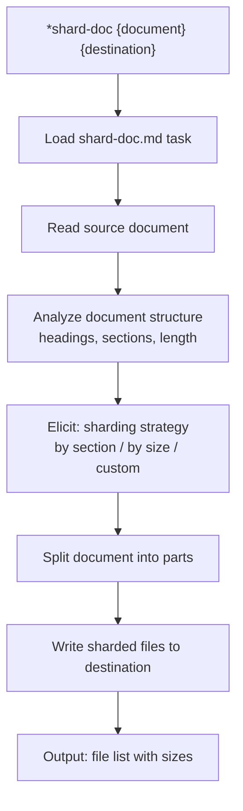

**Expected output:** Document broken into smaller, navigable parts at the specified destination.

---

### `*help`, `*guide`, `*session-info`, `*doc-out`, `*yolo`, `*exit`

These are built-in commands handled by the agent framework, not external task files.

| Command | Behavior |
|---------|----------|
| `*help` | Renders full command list from `commands[]` in agent definition |
| `*guide` | Renders the `## 🎯 Product Owner Guide` section from agent .md |
| `*session-info` | Shows session context (agent history, commands, project status) |
| `*doc-out` | Outputs complete document content to file |
| `*yolo` | Toggles confirmation skipping mode |
| `*exit` | Exits PO mode, returns to base Claude Code |

---

## 4. Complete Dependency Graph

```mermaid
graph TD
    subgraph "Agent Definition"
        AD[po.md]
    end

    subgraph "Activation Pipeline"
        GB[greeting-builder.js]
        ACL[agent-config-loader.js]
        CD[context-detector.js]
        GCD[git-config-detector.js]
        PSL[project-status-loader.js]
        GPM[greeting-preference-manager.js]
        WN[workflow-navigator.js]
        PM[permissions/index.js]
    end

    subgraph "Config Files"
        CC[core-config.yaml]
        ACR[agent-config-requirements.yaml]
        WP[workflow-patterns.yaml]
        EM[elicitation-methods.md]
    end

    subgraph "Task Files"
        T1[correct-course.md]
        T2[create-brownfield-story.md]
        T3[execute-checklist.md]
        T4[po-manage-story-backlog.md]
        T5[po-pull-story.md]
        T6[shard-doc.md]
        T7[po-sync-story.md]
        T8[validate-next-story.md]
        T9[po-backlog-add.md]
        T10[po-stories-index.md]
        T11["po-sync-story-to-clickup.md (deprecated)"]
        T12["po-pull-story-from-clickup.md (deprecated)"]
    end

    subgraph "Templates"
        TM1[story-tmpl.yaml]
    end

    subgraph "Checklists"
        CL1[po-master-checklist.md]
        CL2[change-checklist.md]
    end

    AD --> GB
    AD --> ACL
    GB --> CD
    GB --> GCD
    GB --> PSL
    GB --> GPM
    GB --> WN
    GB --> PM
    ACL --> ACR
    ACL --> CC
    ACL --> EM
    WN --> WP
    GPM --> CC

    AD -.->|commands| T1
    AD -.->|commands| T2
    AD -.->|commands| T3
    AD -.->|commands| T4
    AD -.->|commands| T5
    AD -.->|commands| T6
    AD -.->|commands| T7
    AD -.->|commands| T8
    AD -.->|commands| T9
    AD -.->|commands| T10
    AD -.->|commands| T11
    AD -.->|commands| T12

    T3 -.->|checklist| CL1
    T3 -.->|checklist| CL2
    T8 -.->|template| TM1
```

---

## 5. Cross-Agent Interactions

| Interaction | Direction | Trigger |
|-------------|-----------|---------|
| @sm -> @po | Coordinates | Backlog prioritization and sprint planning |
| @pm -> @po | Provides | Strategic direction, PRDs, requirements |
| @po -> @sm | Delegate | Story creation via `*draft` |
| @po -> @pm | Delegate | Epic creation via `*create-epic` |
| @po -> @aios-master | Escalate | Course corrections via `*correct-course` |
| @po -> @analyst | Delegate | Research via `*research` |
| @po -> @devops | Delegate | Git push operations, PR creation |
| @pm -> @po | Receives | Story validation requests via `*validate-story-draft` |
| @sm -> @po | Receives | Backlog prioritization via `*backlog-prioritize` |
| @qa -> @po | Receives | Quality gate review via `*backlog-review` |

### Delegation Rules (from agent definition)

**Delegates to @sm when:**
- Story creation is needed (uses `*draft` command)
- Sprint coordination requires SM facilitation

**Delegates to @pm when:**
- Epic creation is needed (uses `*create-epic` command)
- Strategic direction or PRD creation is required

**Delegates to @aios-master when:**
- Course corrections are needed (uses `*correct-course` command)
- Systemic issues require orchestrator-level intervention

**Delegates to @analyst when:**
- Research is needed to inform backlog decisions

**Retains:**
- Backlog management (add, review, prioritize, schedule)
- Story validation and quality gate execution
- Story sync/pull with PM tools (ClickUp, GitHub Projects, Jira, local)
- Document sharding and output
- Stories index generation

**Delegates to @devops when:**
- Git push operations to remote repository
- Pull request creation and management

**Git restrictions:**
- ALLOWED: `git status`, `git log`, `git diff`, `git branch -a`
- BLOCKED: `git push`, `git push --force`, `gh pr create`

---

## 6. Missing Dependencies

| File | Type | Referenced By | Impact |
|------|------|---------------|--------|
| (none) | -- | -- | All 11 task files exist |
| (none) | -- | -- | Template story-tmpl.yaml exists |
| (none) | -- | -- | Both checklists exist |

**Deprecated but retained for backward compatibility:**

| File | Type | Status | Replacement |
|------|------|--------|-------------|
| `po-sync-story-to-clickup.md` | Task | Deprecated | `po-sync-story.md` (PM tool-agnostic) |
| `po-pull-story-from-clickup.md` | Task | Deprecated | `po-pull-story.md` (PM tool-agnostic) |

---

*Traced from source on 2026-02-05 | Story AIOS-TRACE-001*
