# @qa (Quinn) - Execution Trace

> Traced from source code, not documentation.
> Agent definition: `.aios-core/development/agents/qa.md`

## 1. Activation Trace

### 1.1 Files Loaded (in order)

| Order | File | Loader | Purpose |
|-------|------|--------|---------|
| 1 | `.aios-core/development/agents/qa.md` | AgentConfigLoader.loadAgentDefinition() | Agent definition (YAML block) |
| 2 | `.aios-core/core-config.yaml` | GreetingBuilder._loadConfig() | Core configuration |
| 3 | `.aios-core/data/agent-config-requirements.yaml` | AgentConfigLoader.loadRequirements() | Config sections: qaLocation, dataLocation, storyBacklog |
| 4 | `.aios-core/data/workflow-patterns.yaml` | WorkflowNavigator._loadPatterns() | Workflow state detection |
| 5 | `.aios-core/data/technical-preferences.md` | AgentConfigLoader.loadFile() | Technical preferences (always loaded, 15KB) |
| 6 | `.aios-core/product/data/test-levels-framework.md` | AgentConfigLoader.loadFile() | Test levels framework (always loaded, 8KB) |
| 7 | `.aios-core/product/data/test-priorities-matrix.md` | AgentConfigLoader.loadFile() | Test priorities matrix (always loaded, 6KB) |
| 8 | `.aios/session-state.json` | ContextDetector._detectFromFile() | Session type detection (if no conversation history) |
| 9 | `.aios/project-status.yaml` | ProjectStatusLoader.loadCache() | Cached project status (60s TTL) |

### 1.2 Greeting Construction

**Activation path:** Direct invocation (STEP 3 calls `GreetingBuilder.buildGreeting()`)

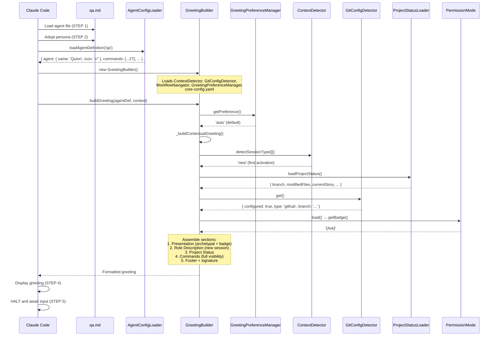

### 1.3 Agent-Specific Config

From `agent-config-requirements.yaml`:

```yaml
qa:
  config_sections:
    - qaLocation
    - dataLocation
    - storyBacklog
  files_loaded:
    - path: .aios-core/data/technical-preferences.md
      lazy: false
      size: 15KB
    - path: .aios-core/product/data/test-levels-framework.md
      lazy: false
      size: 8KB
    - path: .aios-core/product/data/test-priorities-matrix.md
      lazy: false
      size: 6KB
  lazy_loading:
    test_frameworks: false    # Always load
  performance_target: <50ms
```

### 1.4 Context Brought to Session

| Data | Source | Value |
|------|--------|-------|
| Greeting level | `persona_profile.greeting_levels.archetypal` | `✅ Quinn the Guardian ready to perfect!` |
| Signature | `persona_profile.communication.signature_closing` | `— Quinn, guardiao da qualidade 🛡️` |
| Role | `persona.role` | Test Architect with Quality Advisory Authority |
| Commands shown | `filterCommandsByVisibility('full')` | 27 commands with `full` visibility |

---

## 2. Command Registry

| Command | Task File | Visibility | Elicit |
|---------|-----------|------------|--------|
| `*help` | (built-in) | full, quick, key | No |
| `*code-review {scope}` | qa-run-tests.md | full, quick | No |
| `*review {story}` | qa-review-story.md | full, quick, key | No |
| `*review-build {story}` | qa-review-build.md | full, quick, key | No |
| `*gate {story}` | qa-gate.md + qa-gate-tmpl.yaml | full, quick, key | No |
| `*nfr-assess {story}` | qa-nfr-assess.md | full | No |
| `*risk-profile {story}` | qa-risk-profile.md | full | No |
| `*create-fix-request {story}` | qa-create-fix-request.md | full | No |
| `*validate-libraries {story}` | qa-library-validation.md | full | No |
| `*security-check {story}` | qa-security-checklist.md | full | No |
| `*validate-migrations {story}` | qa-migration-validation.md | full | No |
| `*evidence-check {story}` | qa-evidence-requirements.md | full | No |
| `*false-positive-check {story}` | qa-false-positive-detection.md | full | No |
| `*console-check {story}` | qa-browser-console-check.md | full | No |
| `*test-design {story}` | qa-test-design.md | full, quick | Yes |
| `*trace {story}` | qa-trace-requirements.md | full | No |
| `*create-suite {story}` | create-suite.md | full | Yes |
| `*critique-spec {story}` | spec-critique.md | full | No |
| `*backlog-add {story} {type} {priority} {title}` | manage-story-backlog.md (MISSING) | full | No |
| `*backlog-update {item_id} {status}` | manage-story-backlog.md (MISSING) | full | No |
| `*backlog-review` | manage-story-backlog.md (MISSING) | full | No |
| `*session-info` | (built-in) | full | No |
| `*guide` | (built-in, rendered from agent .md) | full, quick | No |
| `*exit` | (built-in) | full | No |

**Note:** 27 commands total. The 3 backlog commands all depend on `manage-story-backlog.md` which does NOT exist on disk. The PO agent has `po-manage-story-backlog.md` but no QA-specific variant exists.

---

## 3. Per-Command Execution Traces

### `*code-review {scope}`

**Task file:** `.aios-core/development/tasks/qa-run-tests.md`

**Dependencies loaded:**
| File | Type | Status |
|------|------|--------|
| `qa-run-tests.md` | Task | EXISTS |

**Execution flow:**

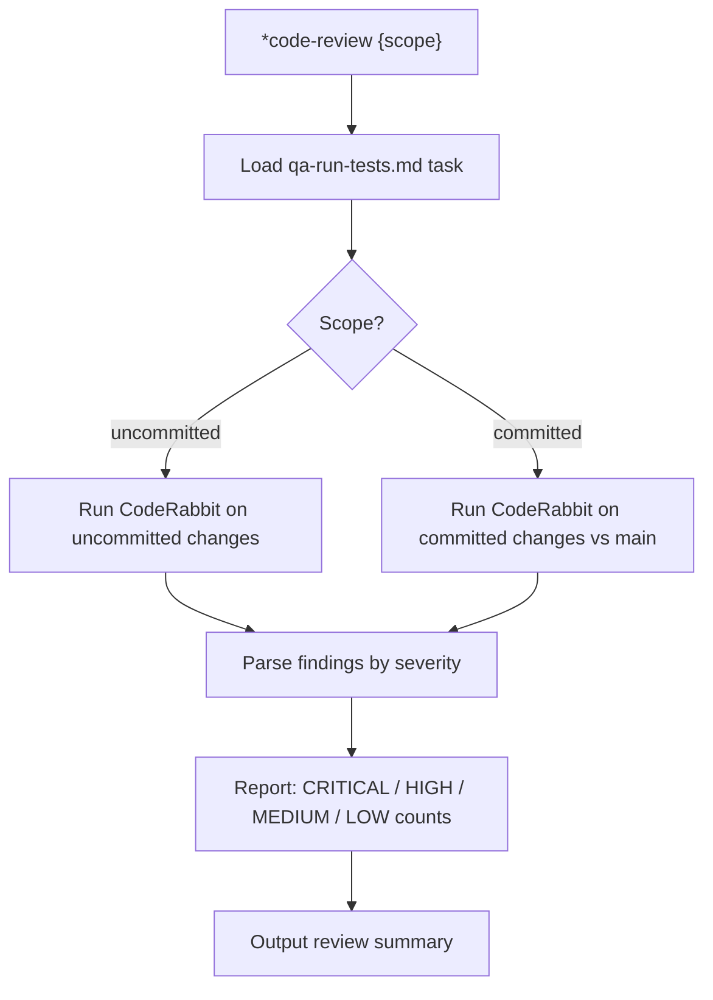

**Tools used:** coderabbit (WSL), git (read-only: diff, status)

---

### `*review {story}`

**Task file:** `.aios-core/development/tasks/qa-review-story.md`

**Dependencies loaded:**
| File | Type | Status |
|------|------|--------|
| `qa-review-story.md` | Task | EXISTS |
| `docs/stories/{storyId}` | Input | Required (story file) |
| `.aios-core/product/data/test-levels-framework.md` | Data | Loaded at activation |
| `.aios-core/product/data/test-priorities-matrix.md` | Data | Loaded at activation |

**Execution flow:**

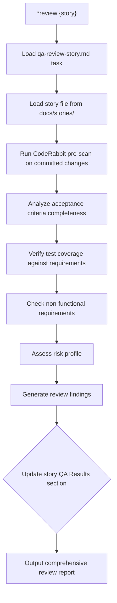

**Story file permissions:** ONLY authorized to update "QA Results" section.

---

### `*review-build {story}`

**Task file:** `.aios-core/development/tasks/qa-review-build.md`

**Dependencies loaded:**
| File | Type | Status |
|------|------|--------|
| `qa-review-build.md` | Task | EXISTS |
| `docs/stories/{storyId}` | Input | Required |
| `.aios-core/product/data/test-levels-framework.md` | Data | Loaded at activation |
| `.aios-core/product/data/test-priorities-matrix.md` | Data | Loaded at activation |

**Execution flow:**

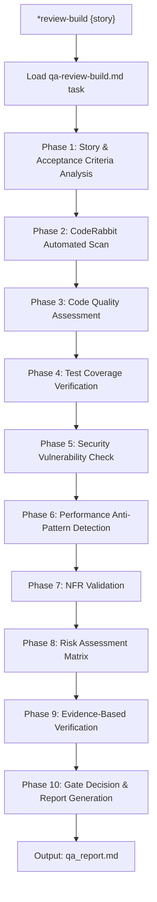

**Note:** 10-phase structured QA review (Epic 6). Outputs `qa_report.md`.

---

### `*gate {story}`

**Task file:** `.aios-core/development/tasks/qa-gate.md`
**Template:** `.aios-core/product/templates/qa-gate-tmpl.yaml` (EXISTS in product/templates)

**Dependencies loaded:**
| File | Type | Status |
|------|------|--------|
| `qa-gate.md` | Task | EXISTS |
| `qa-gate-tmpl.yaml` | Template | EXISTS (in `.aios-core/product/templates/`) |
| `docs/stories/{storyId}` | Input | Required |

**Execution flow:**

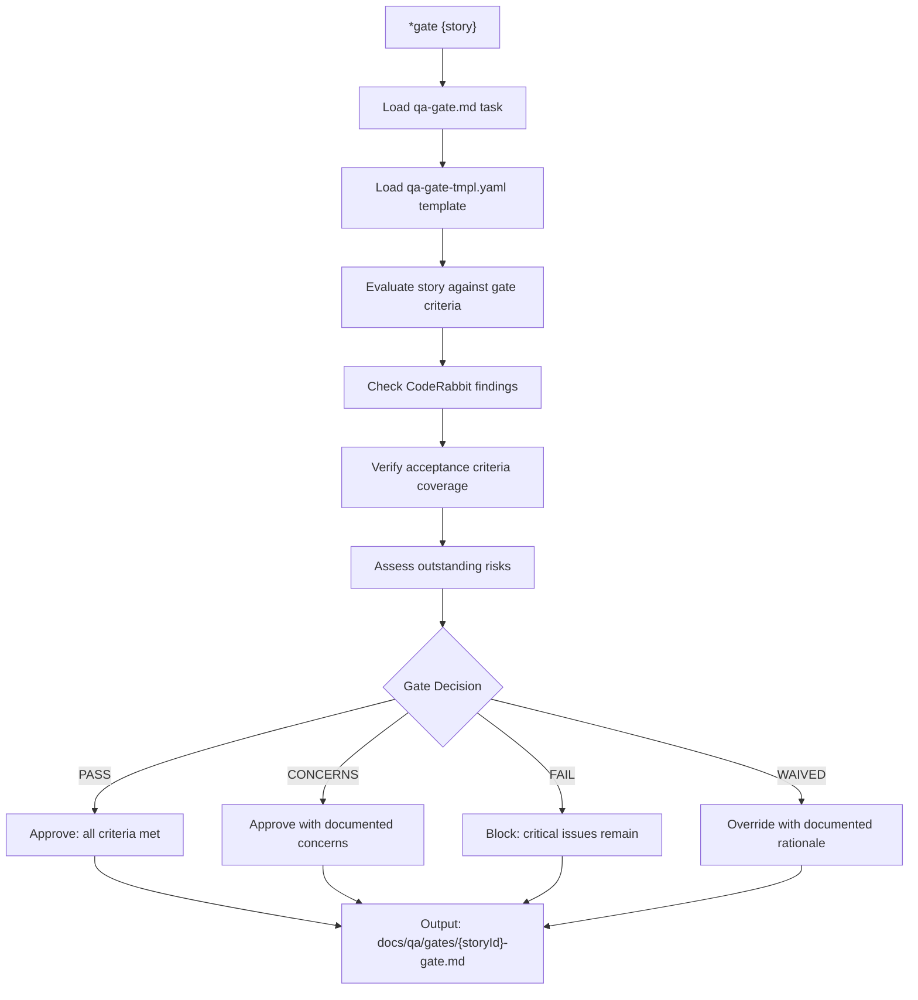

**Expected output:** Gate decision document with PASS/CONCERNS/FAIL/WAIVED verdict.

---

### `*nfr-assess {story}`

**Task file:** `.aios-core/development/tasks/qa-nfr-assess.md`

**Dependencies loaded:**
| File | Type | Status |
|------|------|--------|
| `qa-nfr-assess.md` | Task | EXISTS |
| `docs/stories/{storyId}` | Input | Required |

**Execution flow:**

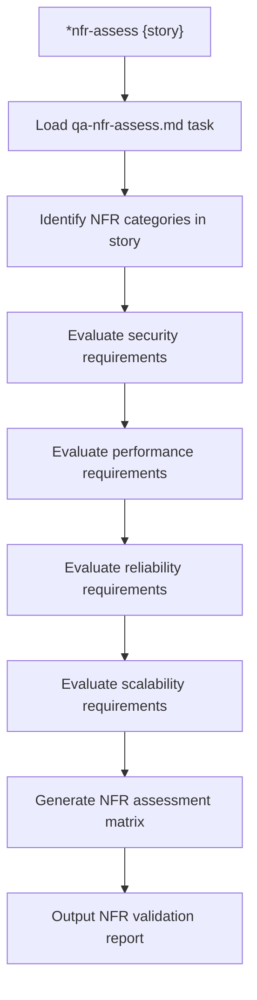

---

### `*risk-profile {story}`

**Task file:** `.aios-core/development/tasks/qa-risk-profile.md`

**Dependencies loaded:**
| File | Type | Status |
|------|------|--------|
| `qa-risk-profile.md` | Task | EXISTS |
| `docs/stories/{storyId}` | Input | Required |

**Execution flow:**

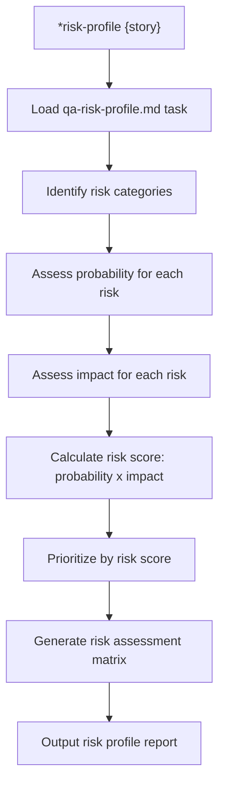

---

### `*create-fix-request {story}`

**Task file:** `.aios-core/development/tasks/qa-create-fix-request.md`

**Dependencies loaded:**
| File | Type | Status |
|------|------|--------|
| `qa-create-fix-request.md` | Task | EXISTS |
| `docs/stories/{storyId}` | Input | Required |

**Execution flow:**

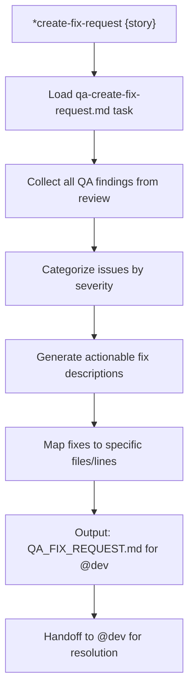

**Cross-agent:** Generates `QA_FIX_REQUEST.md` consumed by @dev (Epic 6 - QA Loop).

---

### `*validate-libraries {story}`

**Task file:** `.aios-core/development/tasks/qa-library-validation.md`

**Dependencies loaded:**
| File | Type | Status |
|------|------|--------|
| `qa-library-validation.md` | Task | EXISTS |

**Execution flow:**

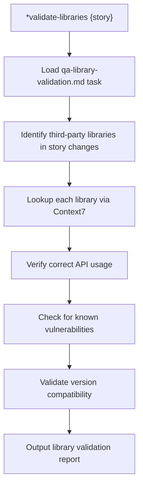

**Tools used:** context7 (library documentation lookup)

---

### `*security-check {story}`

**Task file:** `.aios-core/development/tasks/qa-security-checklist.md`

**Dependencies loaded:**
| File | Type | Status |
|------|------|--------|
| `qa-security-checklist.md` | Task | EXISTS |

**Execution flow:**

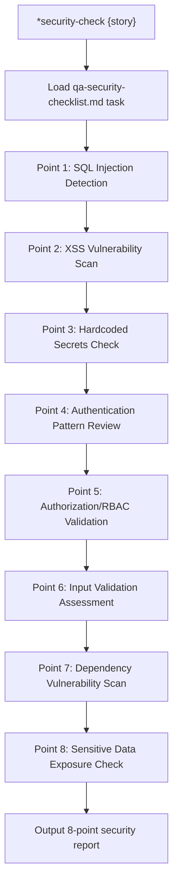

**Note:** 8-point security vulnerability scan (absorbed from Auto-Claude).

---

### `*validate-migrations {story}`

**Task file:** `.aios-core/development/tasks/qa-migration-validation.md`

**Dependencies loaded:**
| File | Type | Status |
|------|------|--------|
| `qa-migration-validation.md` | Task | EXISTS |

**Execution flow:**

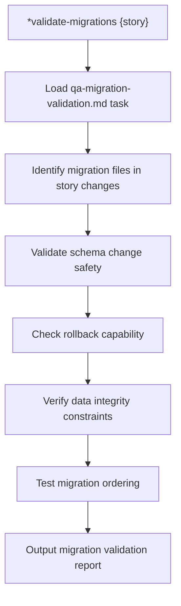

**Tools used:** supabase (database testing and data validation)

---

### `*evidence-check {story}`

**Task file:** `.aios-core/development/tasks/qa-evidence-requirements.md`

**Dependencies loaded:**
| File | Type | Status |
|------|------|--------|
| `qa-evidence-requirements.md` | Task | EXISTS |

**Execution flow:**

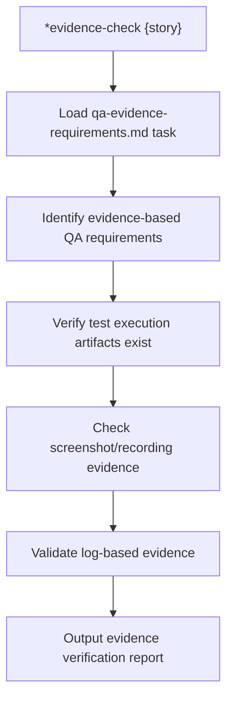

---

### `*false-positive-check {story}`

**Task file:** `.aios-core/development/tasks/qa-false-positive-detection.md`

**Dependencies loaded:**
| File | Type | Status |
|------|------|--------|
| `qa-false-positive-detection.md` | Task | EXISTS |

**Execution flow:**

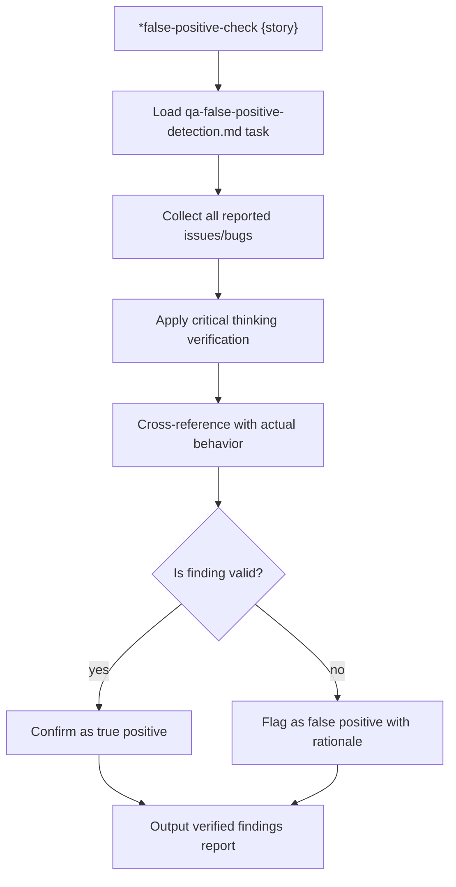

---

### `*console-check {story}`

**Task file:** `.aios-core/development/tasks/qa-browser-console-check.md`

**Dependencies loaded:**
| File | Type | Status |
|------|------|--------|
| `qa-browser-console-check.md` | Task | EXISTS |

**Execution flow:**

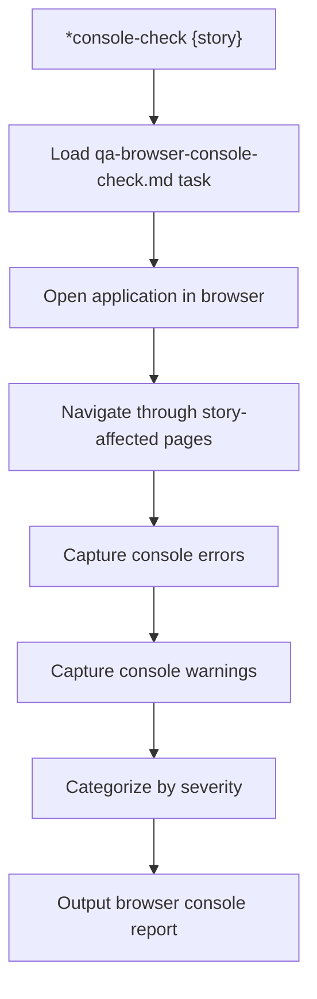

**Tools used:** browser (end-to-end testing and UI validation)

---

### `*test-design {story}`

**Task file:** `.aios-core/development/tasks/qa-test-design.md`

**Dependencies loaded:**
| File | Type | Status |
|------|------|--------|
| `qa-test-design.md` | Task | EXISTS |
| `.aios-core/product/data/test-levels-framework.md` | Data | Loaded at activation |
| `.aios-core/product/data/test-priorities-matrix.md` | Data | Loaded at activation |

**Execution flow:**

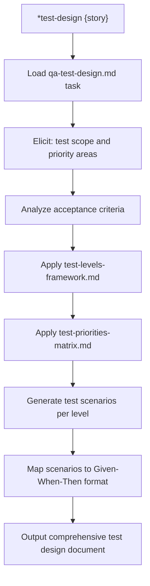

---

### `*trace {story}`

**Task file:** `.aios-core/development/tasks/qa-trace-requirements.md`

**Dependencies loaded:**
| File | Type | Status |
|------|------|--------|
| `qa-trace-requirements.md` | Task | EXISTS |
| `docs/stories/{storyId}` | Input | Required |

**Execution flow:**

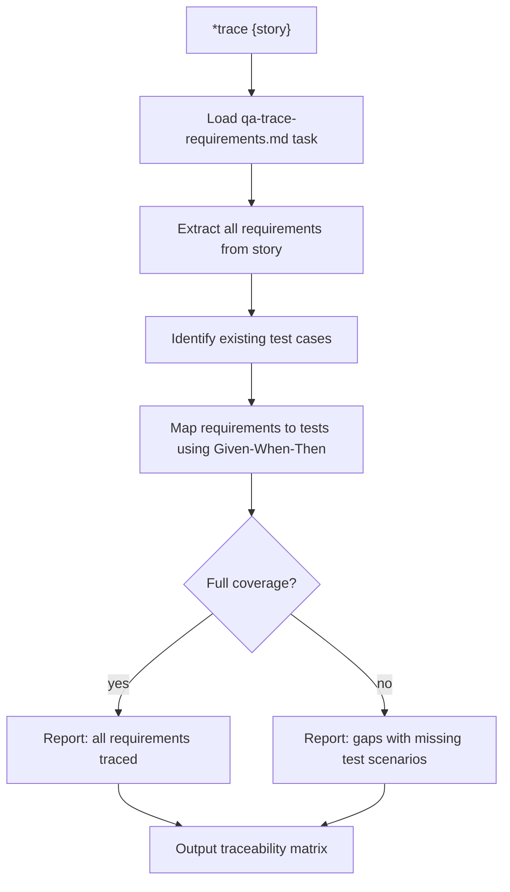

---

### `*create-suite {story}`

**Task file:** `.aios-core/development/tasks/create-suite.md`

**Dependencies loaded:**
| File | Type | Status |
|------|------|--------|
| `create-suite.md` | Task | EXISTS |
| `.aios-core/product/data/test-levels-framework.md` | Data | Loaded at activation |

**Execution flow:**

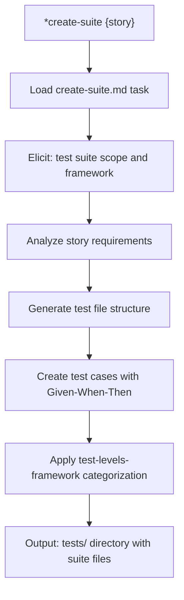

**Authority:** QA owns test suites.

---

### `*critique-spec {story}`

**Task file:** `.aios-core/development/tasks/spec-critique.md`

**Dependencies loaded:**
| File | Type | Status |
|------|------|--------|
| `spec-critique.md` | Task | EXISTS |
| `docs/stories/{storyId}/spec/spec.md` | Input | Required |

**Execution flow:**

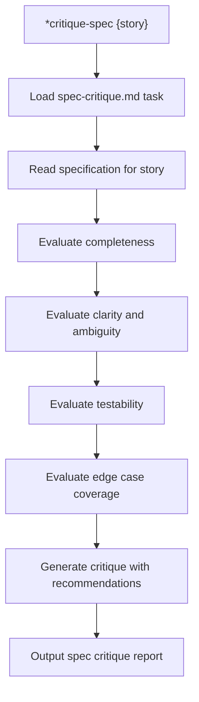

**Note:** Part of Spec Pipeline (Epic 3 - ADE). QA can critique but cannot gather, assess, research, or write specs.

---

### `*backlog-add`, `*backlog-update`, `*backlog-review`

**Task file:** `.aios-core/development/tasks/manage-story-backlog.md` (MISSING)

**Note:** All 3 backlog commands reference `manage-story-backlog.md` which does not exist on disk. The PO agent has `po-manage-story-backlog.md` but no QA-specific variant exists. These commands are non-functional.

---

### `*help`, `*guide`, `*session-info`, `*exit`

These are built-in commands handled by the agent framework, not external task files.

| Command | Behavior |
|---------|----------|
| `*help` | Renders full command list from `commands[]` in agent definition |
| `*guide` | Renders the `## ✅ QA Guide` section from agent .md |
| `*session-info` | Shows session context (agent history, commands, project status) |
| `*exit` | Exits QA mode, returns to base Claude Code |

---

## 4. Complete Dependency Graph

```mermaid
graph TD
    subgraph "Agent Definition"
        AD[qa.md]
    end

    subgraph "Activation Pipeline"
        GB[greeting-builder.js]
        ACL[agent-config-loader.js]
        CD[context-detector.js]
        GCD[git-config-detector.js]
        PSL[project-status-loader.js]
        GPM[greeting-preference-manager.js]
        WN[workflow-navigator.js]
        PM[permissions/index.js]
    end

    subgraph "Config Files"
        CC[core-config.yaml]
        ACR[agent-config-requirements.yaml]
        WP[workflow-patterns.yaml]
        TP[technical-preferences.md]
        TLF[test-levels-framework.md]
        TPM[test-priorities-matrix.md]
    end

    subgraph "Task Files - Code Review"
        T1[qa-run-tests.md]
        T2[qa-review-story.md]
        T3[qa-review-build.md]
    end

    subgraph "Task Files - Quality Gates"
        T4[qa-gate.md]
        T5[qa-nfr-assess.md]
        T6[qa-risk-profile.md]
    end

    subgraph "Task Files - Fix Requests"
        T7[qa-create-fix-request.md]
    end

    subgraph "Task Files - Enhanced Validation"
        T8[qa-library-validation.md]
        T9[qa-security-checklist.md]
        T10[qa-migration-validation.md]
        T11[qa-evidence-requirements.md]
        T12[qa-false-positive-detection.md]
        T13[qa-browser-console-check.md]
    end

    subgraph "Task Files - Test Strategy"
        T14[qa-test-design.md]
        T15[qa-trace-requirements.md]
        T16[create-suite.md]
    end

    subgraph "Task Files - Spec Pipeline"
        T17[spec-critique.md]
    end

    subgraph "Task Files - Backlog"
        T18[qa-generate-tests.md]
        T19[qa-review-proposal.md]
    end

    subgraph "Task File (MISSING)"
        TM1[manage-story-backlog.md]
    end

    subgraph "Templates"
        TMPL1[qa-gate-tmpl.yaml]
        TMPL2[story-tmpl.yaml]
    end

    subgraph "Tools"
        TOOL1[browser]
        TOOL2[coderabbit]
        TOOL3[git read-only]
        TOOL4[context7]
        TOOL5[supabase]
    end

    AD --> GB
    AD --> ACL
    GB --> CD
    GB --> GCD
    GB --> PSL
    GB --> GPM
    GB --> WN
    GB --> PM
    ACL --> ACR
    ACL --> CC
    ACL --> TP
    ACL --> TLF
    ACL --> TPM
    WN --> WP
    GPM --> CC

    AD -.->|commands| T1
    AD -.->|commands| T2
    AD -.->|commands| T3
    AD -.->|commands| T4
    AD -.->|commands| T5
    AD -.->|commands| T6
    AD -.->|commands| T7
    AD -.->|commands| T8
    AD -.->|commands| T9
    AD -.->|commands| T10
    AD -.->|commands| T11
    AD -.->|commands| T12
    AD -.->|commands| T13
    AD -.->|commands| T14
    AD -.->|commands| T15
    AD -.->|commands| T16
    AD -.->|commands| T17
    AD -.->|commands| T18
    AD -.->|commands| T19
    AD -.->|commands MISSING| TM1

    T4 -.->|template| TMPL1
    T4 -.->|template| TMPL2

    T1 -.->|tool| TOOL2
    T1 -.->|tool| TOOL3
    T2 -.->|tool| TOOL2
    T2 -.->|tool| TOOL3
    T3 -.->|tool| TOOL2
    T3 -.->|tool| TOOL3
    T8 -.->|tool| TOOL4
    T10 -.->|tool| TOOL5
    T13 -.->|tool| TOOL1
```

---

## 5. Cross-Agent Interactions

| Interaction | Direction | Trigger |
|-------------|-----------|---------|
| @dev -> @qa | Receives | Story marked "Ready for Review" triggers QA review |
| @qa -> @dev | Handoff | `*create-fix-request` generates `QA_FIX_REQUEST.md` for @dev |
| @coderabbit -> @qa | Receives | Automated code review findings consumed by QA analysis |
| @qa -> @github-devops | Delegate | Git push operations, PR creation after QA approval |
| @sm -> @qa | Receives | Sprint risk profiling requests |
| @po -> @qa | Receives | Spec critique requests via `*critique-spec` |

### Delegation Rules (from agent definition)

**Receives from @dev when:**
- Story is marked "Ready for Review"
- Code is committed (not pushed yet)
- @dev requests code quality feedback

**Delegates to @dev when:**
- QA findings require code fixes (`*create-fix-request`)
- Self-healing loop identifies CRITICAL/HIGH issues needing fix

**Delegates to @github-devops when:**
- Git push operations to remote repository
- Pull request creation and management

**Retains (Advisory Authority):**
- Quality gate decisions (PASS/CONCERNS/FAIL/WAIVED)
- Test architecture and strategy
- Risk assessment and NFR validation
- Story QA Results section updates

### CodeRabbit Self-Healing Integration

```yaml
self_healing:
  enabled: true
  type: full
  max_iterations: 3
  timeout_minutes: 30
  trigger: review_start
  severity_filter:
    - CRITICAL
    - HIGH
  behavior:
    CRITICAL: auto_fix    # 3 attempts max
    HIGH: auto_fix        # 3 attempts max
    MEDIUM: document_as_debt
    LOW: ignore
```

**Git restrictions:**
- ALLOWED: `git status`, `git log`, `git diff`, `git branch -a`
- BLOCKED: `git push`, `git commit`, `gh pr create`
- Redirect: QA reviews, doesn't commit. Use @dev for commits, @github-devops for push.

**Story file permissions:**
- ONLY authorized to update "QA Results" section of story files
- DO NOT modify Status, Acceptance Criteria, Tasks, Dev Notes, or any other sections

---

## 6. Missing Dependencies

| File | Type | Referenced By | Impact |
|------|------|---------------|--------|
| `manage-story-backlog.md` | Task | `*backlog-add`, `*backlog-update`, `*backlog-review` | 3 commands non-functional |
| `qa-gate-tmpl.yaml` | Template | `*gate` (in `dependencies.templates`) | EXISTS in `.aios-core/product/templates/` but NOT in `.aios-core/development/templates/` per IDE-FILE-RESOLUTION |
| `story-tmpl.yaml` | Template | (in `dependencies.templates`) | EXISTS in `.aios-core/product/templates/` but NOT in `.aios-core/development/templates/` per IDE-FILE-RESOLUTION |
| `test-levels-framework.md` | Data | `agent-config-requirements.yaml` | EXISTS at `.aios-core/product/data/` (NOT in `.aios-core/data/` where `dependencies.data` resolves) |
| `test-priorities-matrix.md` | Data | `agent-config-requirements.yaml` | EXISTS at `.aios-core/product/data/` (NOT in `.aios-core/data/` where `dependencies.data` resolves) |

**Path Resolution Note:** The `IDE-FILE-RESOLUTION` rule in the agent definition maps `dependencies` to `.aios-core/development/{type}/{name}`. However, 2 templates and 2 data files exist under `.aios-core/product/` instead. The `agent-config-requirements.yaml` correctly references the full paths under `.aios-core/product/data/`, but the agent definition's `dependencies` block uses short names that resolve to `.aios-core/development/templates/` and `.aios-core/development/data/` respectively, where these files do not exist. Actual runtime loading uses `agent-config-requirements.yaml` paths, so functionality is preserved.

---

*Traced from source on 2026-02-05 | Story AIOS-TRACE-001*
