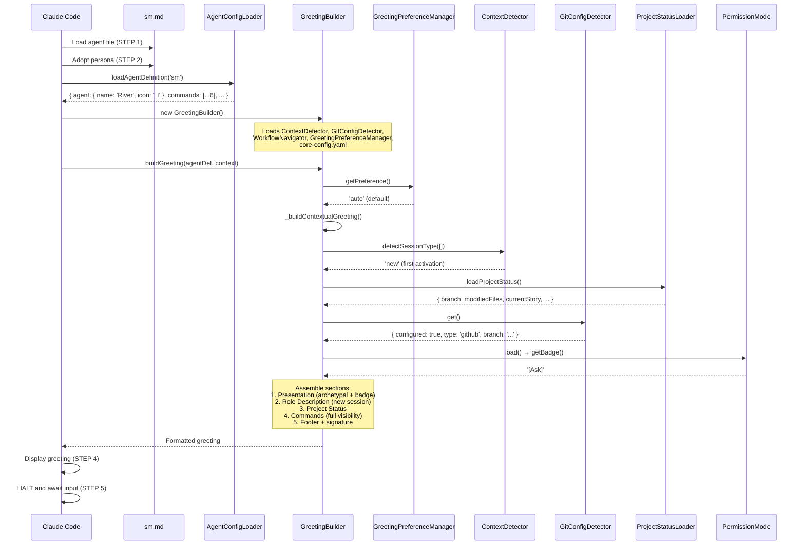
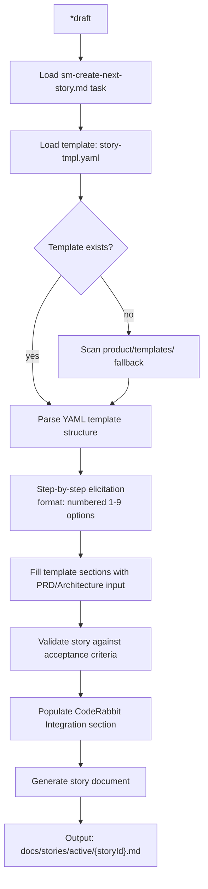
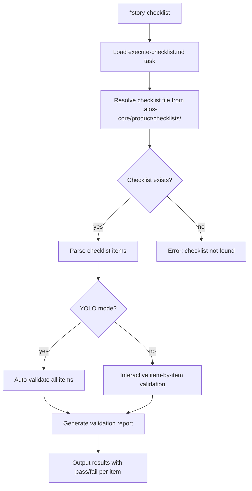
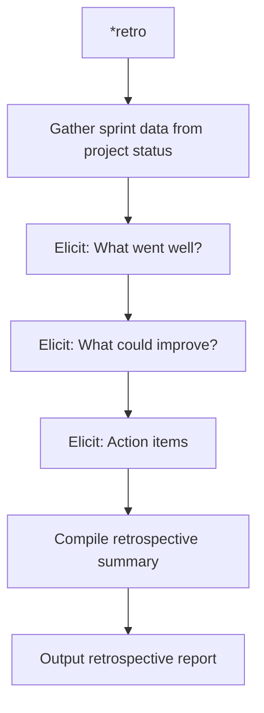
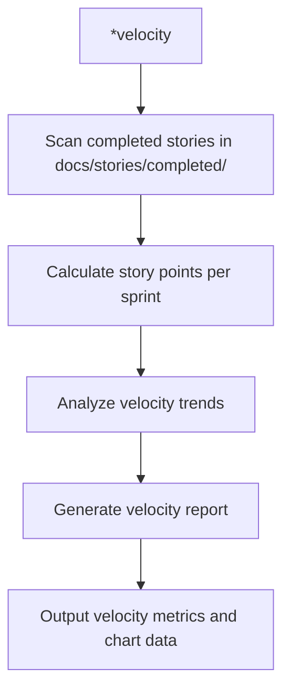
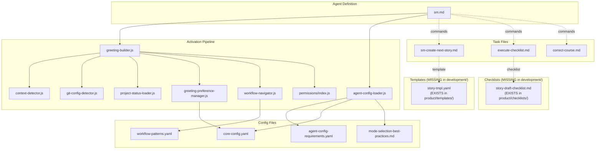

# @sm (River) - Execution Trace

> Traced from source code, not documentation.
> Agent definition: `.aios-core/development/agents/sm.md`

## 1. Activation Trace

### 1.1 Files Loaded (in order)

| Order | File | Loader | Purpose |
|-------|------|--------|---------|
| 1 | `.aios-core/development/agents/sm.md` | AgentConfigLoader.loadAgentDefinition() | Agent definition (YAML block) |
| 2 | `.aios-core/core-config.yaml` | GreetingBuilder._loadConfig() | Core configuration |
| 3 | `.aios-core/data/agent-config-requirements.yaml` | AgentConfigLoader.loadRequirements() | Config sections: devStoryLocation, storyBacklog, dataLocation |
| 4 | `.aios-core/data/workflow-patterns.yaml` | WorkflowNavigator._loadPatterns() | Workflow state detection |
| 5 | `.aios-core/product/data/mode-selection-best-practices.md` | AgentConfigLoader.loadFile() | Mode selection best practices (always loaded, 10KB) |
| 6 | `.aios/session-state.json` | ContextDetector._detectFromFile() | Session type detection (if no conversation history) |
| 7 | `.aios/project-status.yaml` | ProjectStatusLoader.loadCache() | Cached project status (60s TTL) |

### 1.2 Greeting Construction

**Activation path:** Direct invocation (STEP 3 calls `GreetingBuilder.buildGreeting()`)



### 1.3 Agent-Specific Config

From `agent-config-requirements.yaml`:

```yaml
sm:
  config_sections:
    - devStoryLocation
    - storyBacklog
    - dataLocation
  files_loaded:
    - path: .aios-core/product/data/mode-selection-best-practices.md
      lazy: false
      size: 10KB
    - path: .aios-core/data/workflow-patterns.yaml
      lazy: false
      size: 8KB
    - path: docs/framework/coding-standards.md    # Added in Story ACT-8
      lazy: false
      size: 25KB
  lazy_loading: {}
  performance_target: <75ms
```

**Note:** As of Story ACT-8, SM loads `coding-standards.md` during activation to have development standards context when creating and assigning stories.

### 1.4 Context Brought to Session

| Data | Source | Value |
|------|--------|-------|
| Greeting level | `persona_profile.greeting_levels.minimal` | `🌊 sm Agent ready` |
| Greeting level | `persona_profile.greeting_levels.named` | `🌊 River (Facilitator) ready. Let's flow!` |
| Greeting level | `persona_profile.greeting_levels.archetypal` | `🌊 River the Facilitator ready to flow!` |
| Signature | `persona_profile.communication.signature_closing` | `— River, fluindo com o time 🌊` |
| Role | `persona.role` | Agile Process Facilitator & Sprint Coordinator |
| Commands shown | `filterCommandsByVisibility('full')` | 6 commands with `full` visibility |

---

## 2. Command Registry

| Command | Task File | Visibility | Elicit |
|---------|-----------|------------|--------|
| `*help` | (built-in) | full, quick, key | No |
| `*draft` | sm-create-next-story.md + story-tmpl.yaml | full, quick, key | Yes |
| `*story-checklist` | execute-checklist.md + story-draft-checklist.md | full, quick | Optional |
| `*retro` | (built-in) | full | No |
| `*velocity` | (built-in) | full | No |
| `*guide` | (built-in, rendered from agent .md) | full, quick | No |
| `*session-info` | (built-in) | full | No |
| `*exit` | (built-in) | full | No |

---

## 3. Per-Command Execution Traces

### `*draft`

**Task file:** `.aios-core/development/tasks/sm-create-next-story.md`
**Template:** `.aios-core/development/templates/story-tmpl.yaml` (MISSING in development/, EXISTS in `.aios-core/product/templates/story-tmpl.yaml`)

**Dependencies loaded:**
| File | Type | Status |
|------|------|--------|
| `sm-create-next-story.md` | Task | EXISTS |
| `story-tmpl.yaml` | Template | MISSING in development/, EXISTS in product/templates/ |
| `.aios-core/product/data/mode-selection-best-practices.md` | Data | Referenced by sm config |
| `.aios-core/product/templates/` | Templates dir | Scanned dynamically |

**Execution flow:**



**Expected output:** Complete user story with acceptance criteria, implementation tasks, and CodeRabbit quality gates

---

### `*story-checklist`

**Task file:** `.aios-core/development/tasks/execute-checklist.md`
**Checklist:** `.aios-core/development/checklists/story-draft-checklist.md` (MISSING in development/, EXISTS in `.aios-core/product/checklists/story-draft-checklist.md`)

**Dependencies loaded:**
| File | Type | Status |
|------|------|--------|
| `execute-checklist.md` | Task | EXISTS |
| `story-draft-checklist.md` | Checklist | MISSING in development/, EXISTS in product/checklists/ |
| `.aios-core/scripts/execute-task.js` | Script | Referenced |

**Execution flow:**



---

### `*retro`

**Task file:** (built-in)

**Execution flow:**



**Expected output:** Sprint retrospective summary with action items

---

### `*velocity`

**Task file:** (built-in)

**Execution flow:**



**Expected output:** Velocity metrics for current and recent sprints

---

### `*help`, `*guide`, `*session-info`, `*exit`

These are built-in commands handled by the agent framework, not external task files.

| Command | Behavior |
|---------|----------|
| `*help` | Renders full command list from `commands[]` in agent definition |
| `*guide` | Renders the `## 🌊 Scrum Master Guide` section from agent .md |
| `*session-info` | Shows session context (agent history, commands, project status) |
| `*exit` | Exits Scrum Master mode, returns to base Claude Code |

---

## 4. Complete Dependency Graph



---

## 5. Cross-Agent Interactions

| Interaction | Direction | Trigger |
|-------------|-----------|---------|
| @po -> @sm | Receives | Backlog prioritization, story validation requests |
| @pm -> @sm | Receives | Epic structure for story breakdown |
| @sm -> @dev | Handoff | Completed stories for implementation |
| @sm -> @devops | Delegate | Git push operations, PR creation after story completion |
| @sm <-> @po | Collaborate | Sprint planning, backlog grooming |

### Delegation Rules (from agent definition)

**Coordinates with @po when:**
- Backlog prioritization and grooming
- Sprint planning
- Story validation (`@po *validate-story-draft`)

**Receives from @pm when:**
- Epic structure is ready for story breakdown
- Strategic direction for sprint goals

**Hands off to @dev when:**
- Story is drafted, validated, and ready for implementation
- Developer receives story via `@dev *develop`

**Delegates to @devops when:**
- Git push operations to remote repository
- Pull request creation and management
- Remote branch operations

**Escalates to @aios-master when:**
- Course corrections needed (`@aios-master *correct-course`)

**Git restrictions:**
- ALLOWED: `git status`, `git log`, `git diff`, `git branch`, `git branch -d`, `git checkout -b`, `git checkout`, `git merge`
- BLOCKED: `git push`, `git push --force`, `git push origin --delete`, `gh pr create`

---

## 6. Missing Dependencies

| File | Type | Referenced By | Impact |
|------|------|---------------|--------|
| `story-tmpl.yaml` | Template | `*draft` (sm-create-next-story.md) | MISSING in `.aios-core/development/templates/`, EXISTS in `.aios-core/product/templates/story-tmpl.yaml` |
| `story-draft-checklist.md` | Checklist | `*story-checklist` (execute-checklist.md) | MISSING in `.aios-core/development/checklists/`, EXISTS in `.aios-core/product/checklists/story-draft-checklist.md` |

---

## 7. Tools

| Tool | Scope | Purpose |
|------|-------|---------|
| `github-cli` | Local | Repository information, issue tracking |
| `context7` | External | Research technical requirements for stories |
| `git` | Local only | Local branch operations (status, log, diff, branch, checkout, merge). NO push -- delegates to @devops |

---

*Traced from source on 2026-02-05 | Story AIOS-TRACE-001*
