# @squad-creator (Craft) - Execution Trace

> Traced from source code, not documentation.
> Agent definition: `.aios-core/development/agents/squad-creator.md`

## 1. Activation Trace

### 1.1 Files Loaded (in order)

| Order | File | Loader | Purpose |
|-------|------|--------|---------|
| 1 | `.aios-core/development/agents/squad-creator.md` | AgentConfigLoader.loadAgentDefinition() | Agent definition (YAML block) |
| 2 | `.aios-core/core-config.yaml` | GreetingBuilder._loadConfig() | Core configuration |
| 3 | `.aios-core/data/agent-config-requirements.yaml` | AgentConfigLoader.loadRequirements() | Config sections: dataLocation (no squad-creator entry found) |
| 4 | `.aios-core/data/workflow-patterns.yaml` | WorkflowNavigator._loadPatterns() | Workflow state detection |
| 5 | `.aios/session-state.json` | ContextDetector._detectFromFile() | Session type detection (if no conversation history) |
| 6 | `.aios/project-status.yaml` | ProjectStatusLoader.loadCache() | Cached project status (60s TTL) |

### 1.2 Greeting Construction

**Activation path:** Direct invocation (STEP 3 calls `GreetingBuilder.buildGreeting()`)

```mermaid
sequenceDiagram
    participant CC as Claude Code
    participant AMd as squad-creator.md
    participant ACL as AgentConfigLoader
    participant GB as GreetingBuilder
    participant GPM as GreetingPreferenceManager
    participant CD as ContextDetector
    participant GCD as GitConfigDetector
    participant PSL as ProjectStatusLoader
    participant PM as PermissionMode

    CC->>AMd: Load agent file (STEP 1)
    CC->>AMd: Adopt persona (STEP 2)
    CC->>ACL: loadAgentDefinition('squad-creator')
    ACL-->>CC: { agent: { name: 'Craft', icon: '🏗️' }, commands: [...13], ... }

    CC->>GB: new GreetingBuilder()
    Note over GB: Loads ContextDetector, GitConfigDetector,<br/>WorkflowNavigator, GreetingPreferenceManager,<br/>core-config.yaml

    CC->>GB: buildGreeting(agentDef, context)
    GB->>GPM: getPreference()
    GPM-->>GB: 'auto' (default)

    GB->>GB: _buildContextualGreeting()
    GB->>CD: detectSessionType([])
    CD-->>GB: 'new' (first activation)
    GB->>PSL: loadProjectStatus()
    PSL-->>GB: { branch, modifiedFiles, currentStory, ... }
    GB->>GCD: get()
    GCD-->>GB: { configured: true, type: 'github', branch: '...' }
    GB->>PM: load() → getBadge()
    PM-->>GB: '[Ask]'

    Note over GB: Assemble sections:<br/>1. Presentation (archetypal + badge)<br/>2. Role Description (new session)<br/>3. Project Status<br/>4. Commands (full visibility)<br/>5. Footer + signature

    GB-->>CC: Formatted greeting
    CC->>CC: Display greeting (STEP 4)
    CC->>CC: HALT and await input (STEP 5)
```



### 1.3 Agent-Specific Config

From `agent-config-requirements.yaml`: As of Story ACT-8, squad-creator has an explicit entry:

```yaml
squad-creator:
  config_sections:
    - dataLocation
    - squadsTemplateLocation        # Added in Story ACT-8
  files_loaded: []                  # no agent-specific files eagerly loaded
  lazy_loading:
    agent_registry: true            # Load when validating/creating squads (ACT-8)
    squad_manifest: true   # Load when managing squads (ACT-8)
  performance_target: <150ms
```

**Note:** As of Story ACT-8, squad-creator has a proper entry in `agent-config-requirements.yaml` (previously fell to default). Adds `squadsTemplateLocation` config section and lazy-loaded registry/manifest for squad operations.

### 1.4 Context Brought to Session

| Data | Source | Value |
|------|--------|-------|
| Greeting level | `persona_profile.greeting_levels.archetypal` | `🏗️ Craft the Architect ready to create!` |
| Signature | `persona_profile.communication.signature_closing` | `— Craft, sempre estruturando 🏗️` |
| Role | `persona.role` | Squad Architect & Builder |
| Commands shown | `filterCommandsByVisibility('full')` | 13 commands with `full` visibility |

---

## 2. Command Registry

| Command | Task File | Visibility | Elicit |
|---------|-----------|------------|--------|
| `*help` | (built-in) | full, quick, key | No |
| `*design-squad` | squad-creator-design.md | full, quick, key | Yes |
| `*create-squad` | squad-creator-create.md | full, quick, key | Yes |
| `*validate-squad` | squad-creator-validate.md | full, quick, key | No |
| `*list-squads` | squad-creator-list.md | full, quick | No |
| `*migrate-squad` | squad-creator-migrate.md | full, quick | No |
| `*analyze-squad` | squad-creator-analyze.md | full, quick, key | Yes |
| `*extend-squad` | squad-creator-extend.md | full, quick, key | Yes |
| `*download-squad` | squad-creator-download.md | full | No |
| `*publish-squad` | squad-creator-publish.md | full | No |
| `*sync-squad-synkra` | squad-creator-sync-synkra.md | full | No |
| `*guide` | (built-in, rendered from agent .md) | full | No |
| `*exit` | (built-in) | full, quick, key | No |

---

## 3. Per-Command Execution Traces

### `*design-squad`

**Task file:** `.aios-core/development/tasks/squad-creator-design.md`

**Dependencies loaded:**
| File | Type | Status |
|------|------|--------|
| `squad-creator-design.md` | Task | EXISTS |
| `squad-designer.js` | Script | EXISTS |
| `squad-design-schema.json` | Schema | EXISTS |

**Execution flow:**


**Expected output:** Blueprint YAML file in `./squads/.designs/` for use with `*create-squad --from-design`

---

### `*create-squad`

**Task file:** `.aios-core/development/tasks/squad-creator-create.md`

**Dependencies loaded:**
| File | Type | Status |
|------|------|--------|
| `squad-creator-create.md` | Task | EXISTS |
| `squad-generator.js` | Script | EXISTS |
| `squad-validator.js` | Script | EXISTS |
| `squad-schema.json` | Schema | EXISTS |
| `.aios-core/development/templates/squad-template/` | Template scaffold | EXISTS |

**Execution flow:**


**Templates available:** basic (1 agent, 1 task), etl (2 agents, 3 tasks, scripts), agent-only (2 agents, no tasks)

**Expected output:** Complete squad directory structure in `./squads/{name}/`

---

### `*validate-squad`

**Task file:** `.aios-core/development/tasks/squad-creator-validate.md`

**Dependencies loaded:**
| File | Type | Status |
|------|------|--------|
| `squad-creator-validate.md` | Task | EXISTS |
| `squad-loader.js` | Script | EXISTS |
| `squad-validator.js` | Script | EXISTS |
| `squad-schema.json` | Schema | EXISTS |

**Execution flow:**


**Validation checks:** Manifest schema, directory structure, task format, agent format, config references (SQS-10)

---

### `*list-squads`

**Task file:** `.aios-core/development/tasks/squad-creator-list.md`

**Dependencies loaded:**
| File | Type | Status |
|------|------|--------|
| `squad-creator-list.md` | Task | EXISTS |
| `squad-generator.js` | Script | EXISTS |

**Execution flow:**


**Expected output:** Table/JSON/YAML listing of all local squads with name, version, description, and status

---

### `*migrate-squad`

**Task file:** `.aios-core/development/tasks/squad-creator-migrate.md`

**Dependencies loaded:**
| File | Type | Status |
|------|------|--------|
| `squad-creator-migrate.md` | Task | EXISTS |
| `squad-migrator.js` | Script | EXISTS |
| `squad-validator.js` | Script | EXISTS |

**Execution flow:**


**Migration detections:** config.yaml (rename to squad.yaml), flat structure (create dirs), missing fields (aios.type, aios.minVersion, name, version)

---

### `*analyze-squad`

**Task file:** `.aios-core/development/tasks/squad-creator-analyze.md`

**Dependencies loaded:**
| File | Type | Status |
|------|------|--------|
| `squad-creator-analyze.md` | Task | EXISTS |
| `squad-loader.js` | Script | EXISTS |
| `squad-analyzer.js` | Script | EXISTS |

**Execution flow:**


**Expected output:** Analysis report with overview, component inventory, coverage metrics, and improvement suggestions

---

### `*extend-squad`

**Task file:** `.aios-core/development/tasks/squad-creator-extend.md`

**Dependencies loaded:**
| File | Type | Status |
|------|------|--------|
| `squad-creator-extend.md` | Task | EXISTS |
| `squad-loader.js` | Script | EXISTS |
| `squad-extender.js` | Script | EXISTS |
| `squad-validator.js` | Script | EXISTS |
| `.aios-core/development/templates/squad/agent-template.md` | Template | EXISTS |
| `.aios-core/development/templates/squad/task-template.md` | Template | EXISTS |
| `.aios-core/development/templates/squad/workflow-template.yaml` | Template | EXISTS |
| `.aios-core/development/templates/squad/checklist-template.md` | Template | EXISTS |
| `.aios-core/development/templates/squad/template-template.md` | Template | EXISTS |
| `.aios-core/development/templates/squad/tool-template.js` | Template | EXISTS |
| `.aios-core/development/templates/squad/script-template.js` | Template | EXISTS |
| `.aios-core/development/templates/squad/data-template.yaml` | Template | EXISTS |

**Execution flow:**


**Component types:** agent, task, workflow, checklist, template, tool, script, data

---

### `*download-squad`

**Task file:** `.aios-core/development/tasks/squad-creator-download.md`
**Status:** Active (Sprint 8)

**Dependencies loaded:**
| File | Type | Status |
|------|------|--------|
| `squad-creator-download.md` | Task | EXISTS |
| `squad-downloader.js` | Script | EXISTS |
| `squad-validator.js` | Script | EXISTS |

**Execution flow:**


**Source:** `github.com/SynkraAI/aios-squads`

---

### `*publish-squad`

**Task file:** `.aios-core/development/tasks/squad-creator-publish.md`
**Status:** Active (Sprint 8)

**Dependencies loaded:**
| File | Type | Status |
|------|------|--------|
| `squad-creator-publish.md` | Task | EXISTS |
| `squad-publisher.js` | Script | EXISTS |
| `squad-validator.js` | Script | EXISTS |

**Execution flow:**


**Target:** `github.com/SynkraAI/aios-squads` via Pull Request

**Tools used:** github-cli (gh auth, gh pr create)

---

### `*sync-squad-synkra`

**Task file:** `.aios-core/development/tasks/squad-creator-sync-synkra.md`
**Status:** Active (Sprint 8)

**Dependencies loaded:**
| File | Type | Status |
|------|------|--------|
| `squad-creator-sync-synkra.md` | Task | EXISTS |
| `squad-validator.js` | Script | EXISTS |

**Execution flow:**


**API endpoint:** `https://api.synkra.dev/api/squads/sync`

---

### `*help`, `*guide`, `*exit`

These are built-in commands handled by the agent framework, not external task files.

| Command | Behavior |
|---------|----------|
| `*help` | Renders full command list from `commands[]` in agent definition |
| `*guide` | Renders the `## Squad Creator Guide` section from agent .md |
| `*exit` | Exits squad-creator mode, returns to base Claude Code |

---

## 4. Complete Dependency Graph


---

## 5. Cross-Agent Interactions

| Interaction | Direction | Trigger |
|-------------|-----------|---------|
| @squad-creator -> @dev | Handoff | Squad created, needs code implementation |
| @squad-creator -> @qa | Handoff | Squad created, needs quality review |
| @squad-creator -> @devops | Delegate | Publishing, deployment, git push operations |
| @aios-master -> @squad-creator | Invokes | Component creation (agents, tasks, workflows) |
| @pm -> @squad-creator | Receives | Requirements for new squads |
| @architect -> @squad-creator | Receives | Architecture decisions affecting squad structure |

### Collaboration Rules (from agent definition)

**Delegates to @dev when:**
- Squad code needs implementation
- Custom scripts/tools within squad need development

**Delegates to @qa when:**
- Squad implementation needs review
- Quality validation beyond structural checks

**Delegates to @devops when:**
- Git push operations to remote repository
- Pull request creation and management (via `*publish-squad`)
- CI/CD pipeline configuration for squad testing

**Cross-agent component creation:**
- Creates agent definitions that @dev implements
- Creates task workflows that @dev follows
- Creates templates that other agents consume
- Creates checklists that @qa executes

---

## 6. Missing Dependencies

| File | Type | Referenced By | Impact |
|------|------|---------------|--------|
| (none in agent-config-requirements.yaml) | Config entry | AgentConfigLoader | Falls back to defaults; no agent-specific files eagerly loaded |

**Note:** All task files (10), scripts (10 including index.js and README.md), schemas (2), and component templates (8) referenced by @squad-creator exist on disk. The squad template scaffold (8 files) also exists. This is a fully functional agent with zero missing dependencies.

### Complete File Inventory

**Tasks (11 files, all EXISTS):**
- `.aios-core/development/tasks/squad-creator-design.md`
- `.aios-core/development/tasks/squad-creator-create.md`
- `.aios-core/development/tasks/squad-creator-validate.md`
- `.aios-core/development/tasks/squad-creator-list.md`
- `.aios-core/development/tasks/squad-creator-migrate.md`
- `.aios-core/development/tasks/squad-creator-analyze.md`
- `.aios-core/development/tasks/squad-creator-extend.md`
- `.aios-core/development/tasks/squad-creator-download.md`
- `.aios-core/development/tasks/squad-creator-publish.md`
- `.aios-core/development/tasks/squad-creator-sync-synkra.md`
- `.aios-core/development/tasks/squad-creator-sync-ide-command.md`

**Scripts (11 files in squad/ dir, all EXISTS):**
- `.aios-core/development/scripts/squad/index.js`
- `.aios-core/development/scripts/squad/squad-loader.js`
- `.aios-core/development/scripts/squad/squad-validator.js`
- `.aios-core/development/scripts/squad/squad-generator.js`
- `.aios-core/development/scripts/squad/squad-designer.js`
- `.aios-core/development/scripts/squad/squad-migrator.js`
- `.aios-core/development/scripts/squad/squad-analyzer.js`
- `.aios-core/development/scripts/squad/squad-extender.js`
- `.aios-core/development/scripts/squad/squad-downloader.js`
- `.aios-core/development/scripts/squad/squad-publisher.js`
- `.aios-core/development/scripts/squad/README.md`

**Schemas (2 files, all EXISTS):**
- `.aios-core/schemas/squad-schema.json`
- `.aios-core/schemas/squad-design-schema.json`

**Component Templates (8 files, all EXISTS):**
- `.aios-core/development/templates/squad/agent-template.md`
- `.aios-core/development/templates/squad/task-template.md`
- `.aios-core/development/templates/squad/workflow-template.yaml`
- `.aios-core/development/templates/squad/checklist-template.md`
- `.aios-core/development/templates/squad/template-template.md`
- `.aios-core/development/templates/squad/tool-template.js`
- `.aios-core/development/templates/squad/script-template.js`
- `.aios-core/development/templates/squad/data-template.yaml`

**Squad Template Scaffold (10 files, all EXISTS):**
- `.aios-core/development/templates/squad-template/squad.yaml`
- `.aios-core/development/templates/squad-template/README.md`
- `.aios-core/development/templates/squad-template/package.json`
- `.aios-core/development/templates/squad-template/.gitignore`
- `.aios-core/development/templates/squad-template/LICENSE`
- `.aios-core/development/templates/squad-template/agents/example-agent.yaml`
- `.aios-core/development/templates/squad-template/tasks/example-task.yaml`
- `.aios-core/development/templates/squad-template/workflows/example-workflow.yaml`
- `.aios-core/development/templates/squad-template/templates/example-template.md`
- `.aios-core/development/templates/squad-template/tests/example-agent.test.js`

**Tools (2, referenced in agent definition):**
- `git` - For checking author info during squad creation
- `context7` - Library documentation lookup

---

*Traced from source on 2026-02-05 | Story AIOS-TRACE-001*
