# @ux-design-expert (Uma) - Execution Trace

> Traced from source code, not documentation.
> Agent definition: `.aios-core/development/agents/ux-design-expert.md`

## 1. Activation Trace

### 1.1 Files Loaded (in order)

| Order | File | Loader | Purpose |
|-------|------|--------|---------|
| 1 | `.aios-core/development/agents/ux-design-expert.md` | AgentConfigLoader.loadAgentDefinition() | Agent definition (YAML block) |
| 2 | `.aios-core/core-config.yaml` | generate-greeting.js (fs.readFile + yaml.load) | Core configuration |
| 3 | `.aios-core/data/agent-config-requirements.yaml` | AgentConfigLoader.loadRequirements() | Config sections: dataLocation, uxLocation |
| 4 | `.aios-core/data/workflow-patterns.yaml` | WorkflowNavigator._loadPatterns() | Workflow state detection |
| 5 | `.aios/session-state.json` | SessionContextLoader.loadContext() | Session type detection (sessionType, previousAgent, lastCommands) |
| 6 | `.aios/project-status.yaml` | loadProjectStatus() | Cached project status (60s TTL) |

### 1.2 Greeting Construction

**Activation path:** CLI wrapper invocation (generate-greeting.js orchestrates context, then calls `GreetingBuilder.buildGreeting()`)

```mermaid
sequenceDiagram
    participant CC as Claude Code
    participant UMd as ux-design-expert.md
    participant GG as generate-greeting.js (CLI Wrapper)
    participant ACL as AgentConfigLoader
    participant SCL as SessionContextLoader
    participant PSL as loadProjectStatus()
    participant GB as GreetingBuilder
    participant GPM as GreetingPreferenceManager
    participant CD as ContextDetector
    participant GCD as GitConfigDetector
    participant PM as PermissionMode

    CC->>UMd: Load agent file (STEP 1)
    CC->>UMd: Adopt hybrid persona - Sally + Brad Frost (STEP 2)

    Note over CC,GG: STEP 3: CLI wrapper path<br/>(differs from direct GreetingBuilder invocation)
    CC->>GG: node generate-greeting.js ux-design-expert
    GG->>GG: fs.readFile(core-config.yaml) + yaml.load()
    GG->>ACL: new AgentConfigLoader('ux-design-expert')

    par Parallel loading
        GG->>ACL: loader.loadComplete(coreConfig)
        ACL-->>GG: { agent: { name: 'Uma', icon: '🎨' }, commands: [...25], ... }
        GG->>SCL: new SessionContextLoader().loadContext('ux-design-expert')
        SCL-->>GG: { sessionType: 'new', previousAgent, lastCommands, ... }
        GG->>PSL: loadProjectStatus()
        PSL-->>GG: { branch, modifiedFiles, currentStory, ... }
    end

    GG->>GG: Build unified context object
    GG->>GG: Merge persona_profile + persona + commands into agentWithPersona

    GG->>GB: new GreetingBuilder()
    Note over GB: Loads ContextDetector, GitConfigDetector,<br/>WorkflowNavigator, GreetingPreferenceManager,<br/>core-config.yaml

    GG->>GB: buildGreeting(agentWithPersona, context)
    GB->>GPM: getPreference()
    GPM-->>GB: 'auto' (default)

    GB->>GB: _buildContextualGreeting()
    GB->>CD: detectSessionType([])
    CD-->>GB: 'new' (first activation)
    GB->>GCD: get()
    GCD-->>GB: { configured: true, type: 'github', branch: '...' }
    GB->>PM: load() → getBadge()
    PM-->>GB: '[Ask]'

    Note over GB: Assemble sections:<br/>1. Presentation (archetypal + badge)<br/>2. Role Description (new session)<br/>3. Project Status<br/>4. Commands (full visibility)<br/>5. Footer + signature

    GB-->>GG: Formatted greeting
    GG-->>CC: console.log(greeting)
    CC->>CC: Display greeting (STEP 4)
    CC->>CC: HALT and await input (STEP 5)
```



### 1.3 Agent-Specific Config

From `agent-config-requirements.yaml`:

```yaml
ux-design-expert:
  config_sections:
    - dataLocation
    - uxLocation
  files_loaded:
    - path: docs/framework/tech-stack.md          # Added in Story ACT-8
      lazy: false
      size: 30KB
    - path: docs/framework/coding-standards.md    # Added in Story ACT-8
      lazy: false
      size: 25KB
  lazy_loading: {}
  performance_target: <100ms
```

**Note:** As of Story ACT-8, UX Design Expert loads `tech-stack.md` and `coding-standards.md` during activation to understand the technical stack when designing UI components and interactions.

### 1.4 Context Brought to Session

| Data | Source | Value |
|------|--------|-------|
| Greeting level | `persona_profile.greeting_levels.archetypal` | `🎨 Uma the Empathizer ready to empathize!` |
| Signature | `persona_profile.communication.signature_closing` | `— Uma, desenhando com empatia 💝` |
| Role | `persona.role` | UX/UI Designer & Design System Architect |
| Commands shown | `filterCommandsByVisibility('full')` | 25 commands with `full` visibility |

---

## 2. Command Registry

| Command | Task File | Phase | Elicit |
|---------|-----------|-------|--------|
| `*help` | (built-in) | Universal | No |
| `*status` | (built-in) | Universal | No |
| `*guide` | (built-in, rendered from agent .md) | Universal | No |
| `*exit` | (built-in) | Universal | No |
| `*research` | ux-user-research.md | Phase 1: UX Research | Yes |
| `*wireframe {fidelity}` | ux-create-wireframe.md | Phase 1: UX Research | Yes |
| `*generate-ui-prompt` | generate-ai-frontend-prompt.md | Phase 1: UX Research | Yes |
| `*create-front-end-spec` | create-doc.md + front-end-spec-tmpl.yaml | Phase 1: UX Research | Yes |
| `*audit {path}` | audit-codebase.md | Phase 2: Audit | Yes |
| `*consolidate` | consolidate-patterns.md | Phase 2: Audit | Yes |
| `*shock-report` | generate-shock-report.md | Phase 2: Audit | No |
| `*tokenize` | extract-tokens.md | Phase 3: Tokens | Yes |
| `*setup` | setup-design-system.md | Phase 3: Tokens | Yes |
| `*migrate` | generate-migration-strategy.md | Phase 3: Tokens | Yes |
| `*upgrade-tailwind` | tailwind-upgrade.md | Phase 3: Tokens | Yes |
| `*audit-tailwind-config` | audit-tailwind-config.md | Phase 3: Tokens | No |
| `*export-dtcg` | export-design-tokens-dtcg.md | Phase 3: Tokens | No |
| `*bootstrap-shadcn` | bootstrap-shadcn-library.md | Phase 3: Tokens | Yes |
| `*build {component}` | build-component.md | Phase 4: Build | Yes |
| `*compose {molecule}` | compose-molecule.md | Phase 4: Build | Yes |
| `*extend {component}` | extend-pattern.md | Phase 4: Build | Yes |
| `*document` | generate-documentation.md | Phase 5: Quality | Yes |
| `*a11y-check` | accessibility-wcag-checklist.md (checklist) | Phase 5: Quality | Optional |
| `*calculate-roi` | calculate-roi.md | Phase 5: Quality | No |
| `*scan {path\|url}` | ux-ds-scan-artifact.md | Universal | Yes |
| `*integrate {squad}` | integrate-Squad.md (MISSING - see Section 6) | Universal | Yes |

---

## 3. Per-Command Execution Traces

### `*research`

**Task file:** `.aios-core/development/tasks/ux-user-research.md`

**Dependencies loaded:**
| File | Type | Status |
|------|------|--------|
| `ux-user-research.md` | Task | EXISTS |

**Execution flow:**


**Personality mode:** More Sally - empathetic, exploratory, user-focused

---

### `*wireframe {fidelity}`

**Task file:** `.aios-core/development/tasks/ux-create-wireframe.md`

**Dependencies loaded:**
| File | Type | Status |
|------|------|--------|
| `ux-create-wireframe.md` | Task | EXISTS |

**Execution flow:**


**Personality mode:** More Sally - empathetic, exploratory, user-focused

---

### `*generate-ui-prompt`

**Task file:** `.aios-core/development/tasks/generate-ai-frontend-prompt.md`

**Dependencies loaded:**
| File | Type | Status |
|------|------|--------|
| `generate-ai-frontend-prompt.md` | Task | EXISTS |

**Execution flow:**


---

### `*create-front-end-spec`

**Task file:** `.aios-core/development/tasks/create-doc.md`
**Template:** `.aios-core/product/templates/front-end-spec-tmpl.yaml`

**Dependencies loaded:**
| File | Type | Status |
|------|------|--------|
| `create-doc.md` | Task | EXISTS |
| `front-end-spec-tmpl.yaml` | Template | EXISTS |

**Execution flow:**


---

### `*audit {path}`

**Task file:** `.aios-core/development/tasks/audit-codebase.md`

**Dependencies loaded:**
| File | Type | Status |
|------|------|--------|
| `audit-codebase.md` | Task | EXISTS |
| `pattern-audit-checklist.md` | Checklist | EXISTS (product/checklists/) |

**Execution flow:**


**Personality mode:** More Brad - metric-driven, direct, data-focused

---

### `*consolidate`

**Task file:** `.aios-core/development/tasks/consolidate-patterns.md`

**Dependencies loaded:**
| File | Type | Status |
|------|------|--------|
| `consolidate-patterns.md` | Task | EXISTS |
| `consolidation-algorithms.md` | Data | EXISTS (product/data/) |

**Execution flow:**


**Personality mode:** More Brad - metric-driven, direct, data-focused

---

### `*shock-report`

**Task file:** `.aios-core/development/tasks/generate-shock-report.md`
**Template:** `.aios-core/product/templates/shock-report-tmpl.html`

**Dependencies loaded:**
| File | Type | Status |
|------|------|--------|
| `generate-shock-report.md` | Task | EXISTS |
| `shock-report-tmpl.html` | Template | EXISTS |

**Execution flow:**


**Personality mode:** More Brad - visual shock therapy, prove the chaos with data

---

### `*tokenize`

**Task file:** `.aios-core/development/tasks/extract-tokens.md`
**Template:** `.aios-core/product/templates/tokens-schema-tmpl.yaml`

**Dependencies loaded:**
| File | Type | Status |
|------|------|--------|
| `extract-tokens.md` | Task | EXISTS |
| `tokens-schema-tmpl.yaml` | Template | EXISTS |
| `design-token-best-practices.md` | Data | EXISTS (product/data/) |

**Execution flow:**


---

### `*setup`

**Task file:** `.aios-core/development/tasks/setup-design-system.md`

**Dependencies loaded:**
| File | Type | Status |
|------|------|--------|
| `setup-design-system.md` | Task | EXISTS |
| `atomic-design-principles.md` | Data | EXISTS (product/data/) |

**Execution flow:**


---

### `*migrate`

**Task file:** `.aios-core/development/tasks/generate-migration-strategy.md`
**Template:** `.aios-core/product/templates/migration-strategy-tmpl.md`

**Dependencies loaded:**
| File | Type | Status |
|------|------|--------|
| `generate-migration-strategy.md` | Task | EXISTS |
| `migration-strategy-tmpl.md` | Template | EXISTS |
| `migration-readiness-checklist.md` | Checklist | EXISTS (product/checklists/) |

**Execution flow:**


---

### `*upgrade-tailwind`

**Task file:** `.aios-core/development/tasks/tailwind-upgrade.md`

**Dependencies loaded:**
| File | Type | Status |
|------|------|--------|
| `tailwind-upgrade.md` | Task | EXISTS |

**Execution flow:**


---

### `*audit-tailwind-config`

**Task file:** `.aios-core/development/tasks/audit-tailwind-config.md`

**Dependencies loaded:**
| File | Type | Status |
|------|------|--------|
| `audit-tailwind-config.md` | Task | EXISTS |

**Execution flow:**


---

### `*export-dtcg`

**Task file:** `.aios-core/development/tasks/export-design-tokens-dtcg.md`
**Templates:** `.aios-core/product/templates/token-exports-css-tmpl.css`, `.aios-core/product/templates/token-exports-tailwind-tmpl.js`

**Dependencies loaded:**
| File | Type | Status |
|------|------|--------|
| `export-design-tokens-dtcg.md` | Task | EXISTS |
| `token-exports-css-tmpl.css` | Template | EXISTS |
| `token-exports-tailwind-tmpl.js` | Template | EXISTS |

**Execution flow:**


---

### `*bootstrap-shadcn`

**Task file:** `.aios-core/development/tasks/bootstrap-shadcn-library.md`

**Dependencies loaded:**
| File | Type | Status |
|------|------|--------|
| `bootstrap-shadcn-library.md` | Task | EXISTS |

**Execution flow:**


---

### `*build {component}`

**Task file:** `.aios-core/development/tasks/build-component.md`
**Template:** `.aios-core/product/templates/component-react-tmpl.tsx`

**Dependencies loaded:**
| File | Type | Status |
|------|------|--------|
| `build-component.md` | Task | EXISTS |
| `component-react-tmpl.tsx` | Template | EXISTS |
| `component-quality-checklist.md` | Checklist | EXISTS (product/checklists/) |

**Execution flow:**


**Personality mode:** Balanced - user needs + system thinking

---

### `*compose {molecule}`

**Task file:** `.aios-core/development/tasks/compose-molecule.md`

**Dependencies loaded:**
| File | Type | Status |
|------|------|--------|
| `compose-molecule.md` | Task | EXISTS |

**Execution flow:**


---

### `*extend {component}`

**Task file:** `.aios-core/development/tasks/extend-pattern.md`

**Dependencies loaded:**
| File | Type | Status |
|------|------|--------|
| `extend-pattern.md` | Task | EXISTS |

**Execution flow:**


---

### `*document`

**Task file:** `.aios-core/development/tasks/generate-documentation.md`

**Dependencies loaded:**
| File | Type | Status |
|------|------|--------|
| `generate-documentation.md` | Task | EXISTS |

**Execution flow:**


**Personality mode:** Balanced - user needs + system thinking

---

### `*a11y-check`

**Checklist file:** `.aios-core/product/checklists/accessibility-wcag-checklist.md`

**Dependencies loaded:**
| File | Type | Status |
|------|------|--------|
| `accessibility-wcag-checklist.md` | Checklist | EXISTS (product/checklists/) |
| `wcag-compliance-guide.md` | Data | EXISTS (product/data/) |

**Execution flow:**


---

### `*calculate-roi`

**Task file:** `.aios-core/development/tasks/calculate-roi.md`

**Dependencies loaded:**
| File | Type | Status |
|------|------|--------|
| `calculate-roi.md` | Task | EXISTS |
| `roi-calculation-guide.md` | Data | EXISTS (product/data/) |

**Execution flow:**

```mermaid
flowchart TD
    A["*calculate-roi"] --> B[Load calculate-roi.md task]
    B --> C[Read audit + consolidation metrics]
    C --> D[Calculate developer time savings]
    D --> E[Calculate maintenance cost reduction]
    E --> F[Calculate consistency improvement value]
    F --> G[Compute ROI multiplier]
    G --> H["Output: ROI report<br/>(e.g., ROI 34.6x, $374k/year savings)"]
```

---

### `*scan {path|url}`

**Task file:** `.aios-core/development/tasks/ux-ds-scan-artifact.md`
**Template:** `.aios-core/product/templates/ds-artifact-analysis.md`

**Dependencies loaded:**
| File | Type | Status |
|------|------|--------|
| `ux-ds-scan-artifact.md` | Task | EXISTS |
| `ds-artifact-analysis.md` | Template | EXISTS |

**Execution flow:**

```mermaid
flowchart TD
    A["*scan {path|url}"] --> B[Load ux-ds-scan-artifact.md task]
    B --> C{Input type?}
    C -->|path| D[Read local HTML/React files]
    C -->|url| E[Use browser tool to fetch page]
    D --> F[Analyze for design patterns]
    E --> F
    F --> G[Identify atoms, molecules, organisms]
    G --> H[Map to Atomic Design classification]
    H --> I["Output: artifact analysis report"]
```

**Tools used:** browser (for URL scanning)

---

### `*integrate {squad}`

**Task file:** `.aios-core/development/tasks/integrate-Squad.md` (MISSING)

**Dependencies loaded:**
| File | Type | Status |
|------|------|--------|
| `integrate-Squad.md` | Task | MISSING |
| `integrate-squad.md` | Task | EXISTS (possible intended file) |
| `integration-patterns.md` | Data | EXISTS (product/data/) |

**Note:** The agent definition references `integrate-Squad.md` but only `integrate-squad.md` exists on disk. This may cause a runtime error or the task loader may fall back.

---

### `*help`, `*status`, `*guide`, `*exit`

These are built-in commands handled by the agent framework, not external task files.

| Command | Behavior |
|---------|----------|
| `*help` | Renders full command list organized by 5 phases from `commands[]` in agent definition |
| `*status` | Shows current workflow phase from `.state.yaml` (research/audit/tokenize/build/quality) |
| `*guide` | Renders the `## 🎨 UX Design Expert Guide` section from agent .md |
| `*exit` | Exits UX-Design Expert mode, returns to base Claude Code |

---

## 4. Complete Dependency Graph

```mermaid
graph TD
    subgraph "Agent Definition"
        AD[ux-design-expert.md]
    end

    subgraph "Activation Pipeline (CLI Wrapper)"
        GG[generate-greeting.js]
        GB[greeting-builder.js]
        ACL[agent-config-loader.js]
        SCL[session-context-loader.js]
        PSL[project-status-loader.js]
        GPM[greeting-preference-manager.js]
        CD[context-detector.js]
        GCD[git-config-detector.js]
        WN[workflow-navigator.js]
        PM[permissions/index.js]
    end

    subgraph "Config Files"
        CC[core-config.yaml]
        ACR[agent-config-requirements.yaml]
        WP[workflow-patterns.yaml]
    end

    subgraph "Task Files - Phase 1: UX Research"
        T1[ux-user-research.md]
        T2[ux-create-wireframe.md]
        T3[generate-ai-frontend-prompt.md]
        T4[create-doc.md]
    end

    subgraph "Task Files - Phase 2: Audit"
        T5[audit-codebase.md]
        T6[consolidate-patterns.md]
        T7[generate-shock-report.md]
    end

    subgraph "Task Files - Phase 3: Tokens"
        T8[extract-tokens.md]
        T9[setup-design-system.md]
        T10[generate-migration-strategy.md]
        T11[tailwind-upgrade.md]
        T12[audit-tailwind-config.md]
        T13[export-design-tokens-dtcg.md]
        T14[bootstrap-shadcn-library.md]
    end

    subgraph "Task Files - Phase 4: Build"
        T15[build-component.md]
        T16[compose-molecule.md]
        T17[extend-pattern.md]
    end

    subgraph "Task Files - Phase 5: Quality"
        T18[generate-documentation.md]
        T19[calculate-roi.md]
    end

    subgraph "Task Files - Universal"
        T20[ux-ds-scan-artifact.md]
        T21[run-design-system-pipeline.md]
        T22[execute-checklist.md]
    end

    subgraph "Task Files - MISSING"
        TM1[integrate-Squad.md]
    end

    subgraph "Templates (product/templates/)"
        TP1[front-end-spec-tmpl.yaml]
        TP2[tokens-schema-tmpl.yaml]
        TP3[component-react-tmpl.tsx]
        TP4[state-persistence-tmpl.yaml]
        TP5[shock-report-tmpl.html]
        TP6[migration-strategy-tmpl.md]
        TP7[token-exports-css-tmpl.css]
        TP8[token-exports-tailwind-tmpl.js]
        TP9[ds-artifact-analysis.md]
    end

    subgraph "Checklists (product/checklists/)"
        CL1[pattern-audit-checklist.md]
        CL2[component-quality-checklist.md]
        CL3[accessibility-wcag-checklist.md]
        CL4[migration-readiness-checklist.md]
    end

    subgraph "Data Files (product/data/ + data/)"
        D1[technical-preferences.md]
        D2[atomic-design-principles.md]
        D3[design-token-best-practices.md]
        D4[consolidation-algorithms.md]
        D5[roi-calculation-guide.md]
        D6[integration-patterns.md]
        D7[wcag-compliance-guide.md]
    end

    subgraph "State Management"
        ST[outputs/ux-design/{project}/.state.yaml]
    end

    subgraph "Tools"
        TL1[21st-dev-magic]
        TL2[browser]
    end

    AD --> GG
    GG --> ACL
    GG --> SCL
    GG --> PSL
    GG --> GB
    GB --> CD
    GB --> GCD
    GB --> GPM
    GB --> WN
    GB --> PM
    ACL --> ACR
    ACL --> CC
    WN --> WP

    AD -.->|Phase 1| T1
    AD -.->|Phase 1| T2
    AD -.->|Phase 1| T3
    AD -.->|Phase 1| T4
    AD -.->|Phase 2| T5
    AD -.->|Phase 2| T6
    AD -.->|Phase 2| T7
    AD -.->|Phase 3| T8
    AD -.->|Phase 3| T9
    AD -.->|Phase 3| T10
    AD -.->|Phase 3| T11
    AD -.->|Phase 3| T12
    AD -.->|Phase 3| T13
    AD -.->|Phase 3| T14
    AD -.->|Phase 4| T15
    AD -.->|Phase 4| T16
    AD -.->|Phase 4| T17
    AD -.->|Phase 5| T18
    AD -.->|Phase 5| T19
    AD -.->|Universal| T20
    AD -.->|Universal| T21
    AD -.->|Universal| T22
    AD -.->|MISSING| TM1

    T4 -.->|template| TP1
    T8 -.->|template| TP2
    T15 -.->|template| TP3
    T7 -.->|template| TP5
    T10 -.->|template| TP6
    T13 -.->|template| TP7
    T13 -.->|template| TP8
    T20 -.->|template| TP9

    T5 -.->|checklist| CL1
    T15 -.->|checklist| CL2
    T22 -.->|checklist| CL3
    T10 -.->|checklist| CL4

    T6 -.->|data| D4
    T8 -.->|data| D3
    T9 -.->|data| D2
    T19 -.->|data| D5
    TM1 -.->|data| D6
    T22 -.->|data| D7

    AD -.->|state| ST
    AD -.->|tool| TL1
    AD -.->|tool| TL2
```

---

## 5. Cross-Agent Interactions

| Interaction | Direction | Trigger |
|-------------|-----------|---------|
| @architect -> @ux-design-expert | Collaborate | Frontend architecture, user flows, component hierarchy |
| @ux-design-expert -> @dev | Handoff | Design specs, component blueprints for implementation |
| @ux-design-expert -> @analyst | Collaborate | User research planning, data analysis |
| @ux-design-expert -> @devops | Delegate | Git push operations, PR creation |
| @po -> @ux-design-expert | Receives | Design stories, UX requirements |
| @qa -> @ux-design-expert | Validate | Component quality checklists, accessibility audits |

### Collaboration Rules (from agent definition)

**Receives from @architect (Aria):**
- Frontend architecture and system design guidance
- Component hierarchy and integration patterns
- Technology stack decisions affecting UX

**Hands off to @dev (Dex):**
- Design specifications and component blueprints
- Token definitions and design system configurations
- Component implementations with TypeScript + tests

**Collaborates with @analyst (Alex):**
- User research planning and execution
- Data analysis for design decisions

**Git restrictions (same as all non-devops agents):**
- ALLOWED: `git status`, `git log`, `git diff`, `git branch -a`
- BLOCKED: `git push`, `git push --force`, `gh pr create`

---

## 6. Missing Dependencies

| File | Type | Referenced By | Impact |
|------|------|---------------|--------|
| `integrate-Squad.md` | Task | `*integrate {squad}` | Command non-functional; `integrate-squad.md` exists as possible substitute |

### Notes on Dependency Locations

The agent definition references dependencies using short names (e.g., `aios-core/tasks/...`). The actual resolution paths are:

| Dependency Type | Agent Definition Path | Actual Disk Location |
|-----------------|----------------------|---------------------|
| Tasks | `aios-core/tasks/{name}` | `.aios-core/development/tasks/{name}` |
| Templates | `aios-core/templates/{name}` | `.aios-core/product/templates/{name}` |
| Checklists | `aios-core/checklists/{name}` | `.aios-core/product/checklists/{name}` |
| Data | `aios-core/data/{name}` | `.aios-core/data/{name}` or `.aios-core/product/data/{name}` |

All 9 templates, all 4 checklists, and all 7 data files resolve correctly to files in `product/` directories. The `development/data/` directory does not exist; data files live under `.aios-core/data/` and `.aios-core/product/data/`.

---

## 7. State Management

The agent tracks workflow state in a single YAML file:

**Location:** `outputs/ux-design/{project}/.state.yaml`

```yaml
# Tracked state dimensions
user_research_complete: boolean
wireframes_created: []
ui_prompts_generated: []
audit_complete: boolean
patterns_inventory: {}
consolidation_complete: boolean
tokens_extracted: boolean
components_built: []
atomic_levels:
  atoms: []
  molecules: []
  organisms: []
accessibility_score: number
wcag_level: 'AA'    # or 'AAA'
roi_calculated: {}
current_phase: research | audit | tokenize | build | quality
workflow_type: greenfield | brownfield | complete
```

**Template for state persistence:** `.aios-core/product/templates/state-persistence-tmpl.yaml` (EXISTS)

---

## 8. Workflow Paths

| Workflow | Description | Command Sequence |
|----------|-------------|-----------------|
| **complete_ux_to_build** | Full 5-phase pipeline | `*research` -> `*wireframe` -> `*audit` -> `*consolidate` -> `*tokenize` -> `*setup` -> `*build` -> `*document` -> `*a11y-check` |
| **greenfield_only** | New design system from scratch | `*research` -> `*wireframe` -> `*setup` -> `*build` -> `*compose` -> `*document` |
| **brownfield_only** | Improve existing system | `*audit` -> `*consolidate` -> `*tokenize` -> `*migrate` -> `*build` -> `*document` |

### Personality Adaptation by Phase

| Phase | Personality | Style |
|-------|-------------|-------|
| Phase 1 (UX Research) | More Sally | Empathetic, exploratory, user-focused |
| Phase 2 (Audit) | More Brad | Metric-driven, direct, data-focused |
| Phase 3 (Tokens) | More Brad | Metric-driven, direct, data-focused |
| Phase 4 (Build) | Balanced | User needs + system thinking |
| Phase 5 (Quality) | Balanced | User needs + system thinking |

---

*Traced from source on 2026-02-05 | Story AIOS-TRACE-001*
