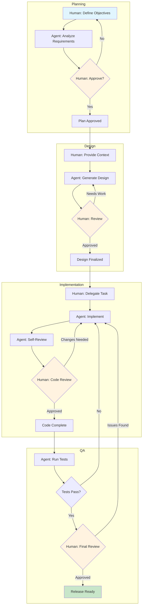
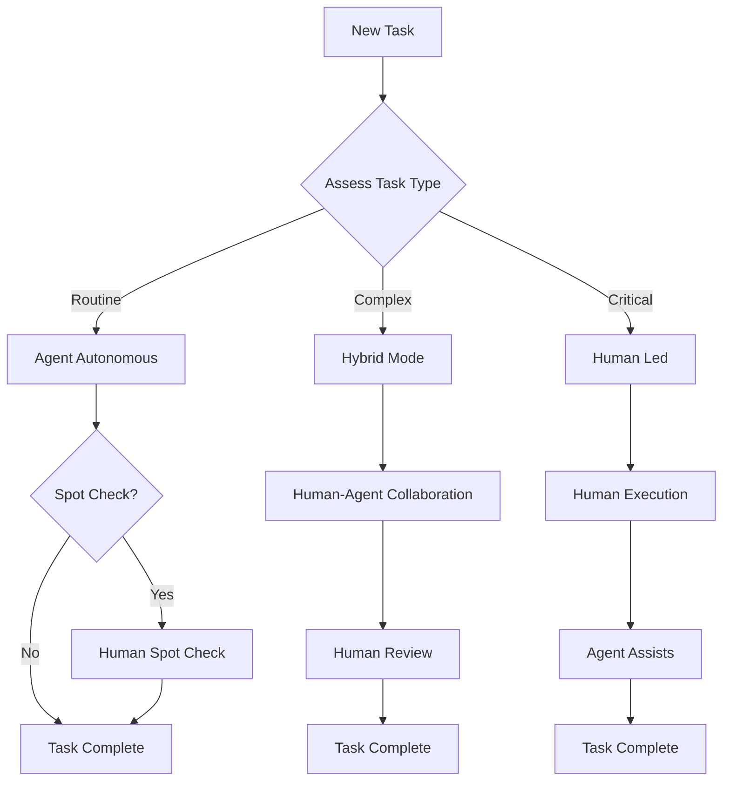
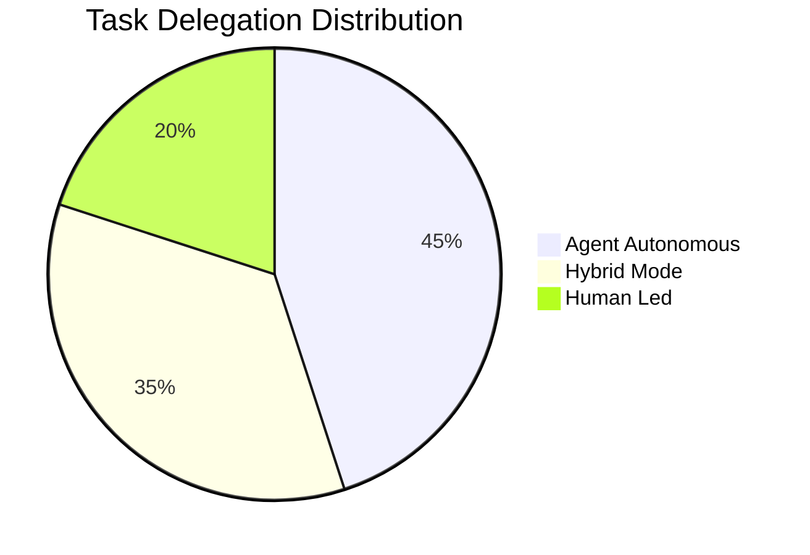

# HybridOps Workflow Diagram

**Version:** 1.0.0
**Last Updated:** 2026-01-28
**Status:** Active

---

## Overview

HybridOps (Hybrid Operations) is a methodology for orchestrating human-agent collaboration in software development workflows. It combines the strengths of AI agents with human oversight to achieve optimal results.

### Key Principles

| Principle                  | Description                                                              |
| -------------------------- | ------------------------------------------------------------------------ |
| **Hybrid Execution**       | Tasks can be executed by humans, agents, or both in collaboration        |
| **Progressive Delegation** | Start with human oversight, gradually delegate to agents as trust builds |
| **Quality Checkpoints**    | Human review at critical decision points                                 |
| **Contextual Handoff**     | Seamless context transfer between human and agent                        |

---

## Workflow Stages

### Stage 1: Planning

```
Human                    Agent
  │                        │
  │   Define objectives    │
  │───────────────────────>│
  │                        │
  │   Analyze requirements │
  │<───────────────────────│
  │                        │
  │   Review & approve     │
  │───────────────────────>│
  │                        │
```

**Responsibilities:**

- Human: Define business objectives and constraints
- Agent: Analyze technical requirements and propose solutions
- Human: Review analysis and approve direction

### Stage 2: Design

```
Human                    Agent
  │                        │
  │   Provide context      │
  │───────────────────────>│
  │                        │
  │   Generate designs     │
  │<───────────────────────│
  │                        │
  │   Iterate on feedback  │
  │<──────────────────────>│
  │                        │
```

**Responsibilities:**

- Human: Provide domain expertise and context
- Agent: Generate design options and documentation
- Both: Iterate on design until approved

### Stage 3: Implementation

```
Human                    Agent
  │                        │
  │   Delegate task        │
  │───────────────────────>│
  │                        │
  │   Execute task         │
  │<───────────────────────│
  │                        │
  │   Review code          │
  │───────────────────────>│
  │                        │
  │   Apply feedback       │
  │<───────────────────────│
  │                        │
```

**Responsibilities:**

- Human: Define task scope and acceptance criteria
- Agent: Implement solution and write tests
- Human: Review implementation and provide feedback

### Stage 4: Quality Assurance

```
Human                    Agent
  │                        │
  │   Define test criteria │
  │───────────────────────>│
  │                        │
  │   Execute tests        │
  │<───────────────────────│
  │                        │
  │   Analyze results      │
  │<──────────────────────>│
  │                        │
  │   Approve release      │
  │───────────────────────>│
  │                        │
```

**Responsibilities:**

- Human: Define quality criteria and edge cases
- Agent: Execute automated tests and generate reports
- Human: Final approval for release

---

## Mermaid Diagram

### Complete Workflow



### Delegation Decision Flow



### Task Type Classification



---

## Integration Points

### With AIOS Agents

| Integration    | Description                                     |
| -------------- | ----------------------------------------------- |
| **@dev**       | Primary implementer for coding tasks            |
| **@qa**        | Test execution and quality verification         |
| **@architect** | Design review and technical guidance            |
| **@pm**        | Progress tracking and stakeholder communication |

### With Quality Gates

HybridOps integrates with AIOS 3-layer quality gates:

| Layer                   | HybridOps Role                 |
| ----------------------- | ------------------------------ |
| Layer 1 (Pre-commit)    | Agent executes, human monitors |
| Layer 2 (PR Automation) | Agent + human review           |
| Layer 3 (Final Review)  | Human approval required        |

### With Story Workflow

```
┌─────────────────────────────────────────────────────────────────┐
│                    HybridOps + Story Workflow                    │
│                                                                  │
│  Story Created     ──────────>  Planning Stage                   │
│       │                              │                           │
│       ▼                              ▼                           │
│  Requirements      <──────────  Agent Analysis                   │
│       │                              │                           │
│       ▼                              ▼                           │
│  Human Approval    ──────────>  Implementation                   │
│       │                              │                           │
│       ▼                              ▼                           │
│  QA Review         <──────────  Agent Testing                    │
│       │                              │                           │
│       ▼                              ▼                           │
│  Story Complete    <──────────  Human Sign-off                   │
│                                                                  │
└─────────────────────────────────────────────────────────────────┘
```

---

## Best Practices

### For Humans

1. **Clear Communication** - Provide explicit objectives and constraints
2. **Timely Feedback** - Review agent output promptly to maintain momentum
3. **Trust Building** - Start with oversight, reduce as confidence grows
4. **Context Sharing** - Share relevant domain knowledge proactively

### For Agents

1. **Progress Updates** - Report status at defined checkpoints
2. **Uncertainty Flagging** - Explicitly flag areas needing human input
3. **Option Presentation** - Present alternatives for human decision
4. **Documentation** - Maintain clear audit trail of decisions

### For Both

1. **Defined Boundaries** - Clear task ownership and handoff points
2. **Shared Artifacts** - Use common documentation and tracking
3. **Iterative Refinement** - Embrace feedback loops
4. **Learning Loop** - Capture lessons for future improvements

---

## Related Documents

- [hybrid-ops-pv.yaml](./hybrid-ops-pv.yaml) - Workflow definition
- [AIOS High-Level Architecture](../../architecture/high-level-architecture.md)
- [CI/CD Architecture](../../architecture/ci-cd.md)

---

_HybridOps Workflow Diagram v1.0 - Pedro Valerio Methodology_
