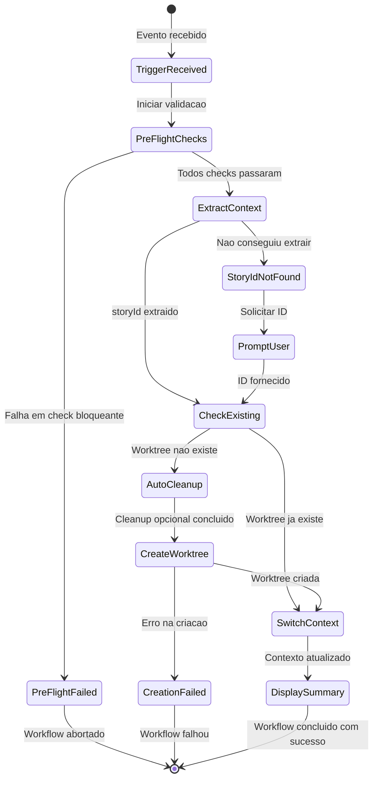
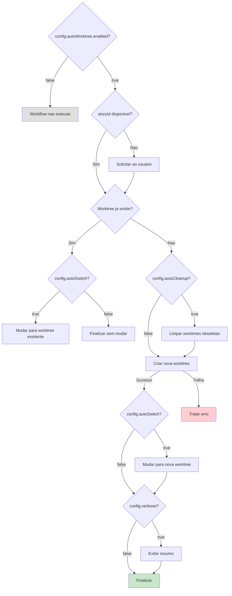
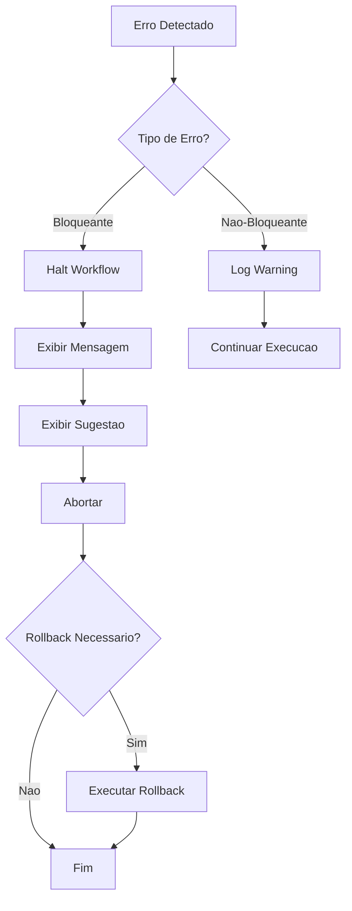

# Auto-Worktree Workflow

**Versao:** 1.0
**Criado:** 2026-01-28
**Autor:** @architect (Aria)
**Story:** 1.4 - Epic 1 - Worktree Manager

---

## Visao Geral

O **Auto-Worktree** e um workflow de automacao que cria e gerencia worktrees Git isoladas para desenvolvimento de stories. Faz parte da infraestrutura **Auto-Claude ADE** (Autonomous Development Engine), permitindo desenvolvimento paralelo de multiplas stories sem conflitos entre branches.

### Principais Beneficios

| Beneficio | Descricao |
|-----------|-----------|
| **Isolamento** | Cada story trabalha em um diretorio e branch separados |
| **Paralelismo** | Multiplas stories podem ser desenvolvidas simultaneamente |
| **Automacao** | Worktrees sao criadas automaticamente ao iniciar uma story |
| **Limpeza** | Worktrees obsoletas podem ser removidas automaticamente |

### Quando o Workflow e Acionado

1. **Evento `story_started`**: Quando `@dev` inicia uma story
2. **Evento `story_assigned`**: Quando `@po` atribui uma story (opcional)
3. **Comando manual**: `*auto-worktree`

---

## Diagrama do Workflow

### Fluxo Principal

```mermaid
flowchart TB
    subgraph TRIGGER["Trigger"]
        T1[story_started<br/>@dev]
        T2[story_assigned<br/>@po]
        T3[*auto-worktree<br/>manual]
    end

    subgraph PREFLIGHT["Pre-Flight Checks"]
        PF1{Repositorio Git?}
        PF2{Suporte a Worktree?}
        PF3{WorktreeManager?}
        PF4{Limite de Worktrees?}
    end

    subgraph WORKFLOW["Sequencia do Workflow"]
        S1["STEP 1: Extract Story Context<br/>Extrair ID da Story"]
        S2["STEP 2: Check Existing<br/>Verificar Worktree Existente"]
        S3["STEP 3: Auto Cleanup<br/>Limpar Worktrees Obsoletas"]
        S4["STEP 4: Create Worktree<br/>Criar Worktree Isolada"]
        S5["STEP 5: Switch Context<br/>Mudar para Worktree"]
        S6["STEP 6: Display Summary<br/>Exibir Resumo"]
    end

    subgraph OUTPUT["Saida"]
        O1[storyId]
        O2[worktree.path]
        O3[worktree.branch]
        O4[worktree.status]
    end

    T1 --> PF1
    T2 --> PF1
    T3 --> PF1

    PF1 -->|Sim| PF2
    PF1 -->|Nao| ERR1[Erro: Nao e repositorio git]

    PF2 -->|Sim| PF3
    PF2 -->|Nao| ERR2[Erro: Git < 2.5]

    PF3 -->|Existe| PF4
    PF3 -->|Nao existe| ERR3[Erro: AIOS incompleto]

    PF4 -->|OK| S1
    PF4 -->|Limite| WARN1[Aviso: Proximo do limite]
    WARN1 --> S1

    S1 --> S2
    S2 -->|Existe| S5
    S2 -->|Nao existe| S3
    S3 --> S4
    S4 -->|Sucesso| S5
    S4 -->|Falha| ERR4[Erro: Criacao falhou]
    S5 --> S6
    S6 --> O1
    S6 --> O2
    S6 --> O3
    S6 --> O4

    style TRIGGER fill:#e1f5fe
    style PREFLIGHT fill:#fff3e0
    style WORKFLOW fill:#e8f5e9
    style OUTPUT fill:#f3e5f5
    style ERR1 fill:#ffcdd2
    style ERR2 fill:#ffcdd2
    style ERR3 fill:#ffcdd2
    style ERR4 fill:#ffcdd2
    style WARN1 fill:#fff9c4
```

### Diagrama de Estados



### Arquitetura de Componentes

```mermaid
graph TB
    subgraph AIOS["AIOS Core"]
        WF[auto-worktree.yaml<br/>Workflow Definition]
        TK[create-worktree.md<br/>Task Definition]
    end

    subgraph INFRA["Infrastructure"]
        WM[worktree-manager.js<br/>WorktreeManager Class]
        GIT[Git CLI<br/>git worktree]
    end

    subgraph FS["File System"]
        WT[.aios/worktrees/{storyId}/<br/>Worktree Directory]
        LOG[.aios/logs/merges/<br/>Merge Audit Logs]
    end

    subgraph AGENTS["Agentes"]
        DEV[@dev<br/>Gage - DevOps]
        PO[@po<br/>Product Owner]
    end

    DEV -->|Inicia story| WF
    PO -->|Atribui story| WF
    WF -->|Executa| TK
    TK -->|Usa| WM
    WM -->|Executa| GIT
    GIT -->|Cria| WT
    WM -->|Grava logs| LOG

    style AIOS fill:#e3f2fd
    style INFRA fill:#fce4ec
    style FS fill:#f3e5f5
    style AGENTS fill:#e8f5e9
```

---

## Steps Detalhados

### Step 1: Extract Story Context

| Propriedade | Valor |
|-------------|-------|
| **Phase** | 1 - Extract Context |
| **Action** | `extract_story_info` |
| **Agente** | Sistema (automatico) |
| **Blocking** | Sim |

**Descricao:**
Extrai o ID da story do contexto do trigger. Busca em varias fontes:

1. Parametro explicito `storyId`
2. Caminho do arquivo da story (`storyFile`)
3. Task atual (`currentTask.storyId`)
4. Nome da branch atual (convencao `story-X.Y`)

**Input:**
```typescript
interface TriggerContext {
  storyId?: string;
  storyFile?: string;
  currentTask?: { storyId: string };
}
```

**Output:**
```typescript
{ storyId: string }
```

**Erro se falhar:**
```
Could not determine story ID. Please provide explicitly.
```

---

### Step 2: Check Existing

| Propriedade | Valor |
|-------------|-------|
| **Phase** | 2 - Check Existing |
| **Action** | `check_worktree_exists` |
| **Agente** | Sistema (automatico) |
| **Blocking** | Nao (pode pular para switch) |

**Descricao:**
Verifica se ja existe uma worktree para a story. Se existir, pula para o Step 5 (Switch Context).

**Logica:**
```javascript
const manager = new WorktreeManager();
const exists = await manager.exists(storyId);

if (exists) {
  return { exists: true, action: 'switch' };
}
return { exists: false, action: 'create' };
```

**Output:**
```typescript
interface CheckResult {
  exists: boolean;
  worktree?: WorktreeInfo;
  action: 'switch' | 'skip' | 'create';
}
```

---

### Step 3: Auto Cleanup

| Propriedade | Valor |
|-------------|-------|
| **Phase** | 3 - Auto Cleanup |
| **Action** | `cleanup_stale_worktrees` |
| **Agente** | @devops (Gage) |
| **Condicional** | `config.autoCleanup === true` |

**Descricao:**
Remove automaticamente worktrees obsoletas (mais de 30 dias sem uso) antes de criar uma nova. Este step so executa se `autoCleanup` estiver habilitado na configuracao.

**Criterio de Obsolescencia:**
- Worktree criada ha mais de `staleDays` (default: 30 dias)

**Output:**
```typescript
interface CleanupResult {
  cleaned: number;
  removedIds: string[];
}
```

**Log:**
```
Cleaned up {cleaned} stale worktrees
```

---

### Step 4: Create Worktree

| Propriedade | Valor |
|-------------|-------|
| **Phase** | 4 - Create Worktree |
| **Action** | `create_isolated_worktree` |
| **Agente** | @devops (Gage) |
| **Task** | `create-worktree.md` |
| **Blocking** | Sim |

**Descricao:**
Cria uma nova worktree isolada para a story usando o WorktreeManager.

**Estrutura Criada:**
```
.aios/worktrees/{storyId}/     # Diretorio de trabalho
Branch: auto-claude/{storyId}   # Branch Git
```

**Input:**
```typescript
{ story_id: string }
```

**Output:**
```typescript
interface CreateResult {
  success: boolean;
  worktree: WorktreeInfo;
  path: string;
  branch: string;
  error?: string;
}
```

**Comandos Git Executados:**
```bash
git worktree add .aios/worktrees/{storyId} -b auto-claude/{storyId}
```

---

### Step 5: Switch Context

| Propriedade | Valor |
|-------------|-------|
| **Phase** | 5 - Switch Context |
| **Action** | `switch_to_worktree` |
| **Agente** | Sistema (automatico) |
| **Condicional** | `config.autoSwitch === true` |

**Descricao:**
Configura variaveis de ambiente e exibe instrucoes para navegar ate a worktree.

**Variaveis de Ambiente:**
```bash
AIOS_WORKTREE=/path/to/.aios/worktrees/{storyId}
AIOS_STORY={storyId}
```

**Output:**
```typescript
interface SwitchResult {
  worktreePath: string;
  instructions: string;  // "cd /path/to/worktree"
}
```

---

### Step 6: Display Summary

| Propriedade | Valor |
|-------------|-------|
| **Phase** | 6 - Summary |
| **Action** | `show_summary` |
| **Agente** | Sistema (automatico) |
| **Condicional** | `config.verbose === true` |

**Descricao:**
Exibe um resumo completo da operacao com informacoes da worktree e proximos passos.

**Template de Saida:**
```
+------------------------------------------------------------------+
|  Auto-Worktree Complete                                          |
+------------------------------------------------------------------+

Story:      {storyId}
Worktree:   {worktree.path}
Branch:     {worktree.branch}
Status:     {worktree.status}

-------------------------------------------------------------------
Quick Reference:

Navigate:   cd {worktree.path}
Status:     *list-worktrees
Merge:      *merge-worktree {storyId}
Remove:     *remove-worktree {storyId}

-------------------------------------------------------------------
Voce agora esta trabalhando em um ambiente isolado.
Alteracoes aqui nao afetam a branch principal ate o merge.
```

---

## Agentes Participantes

### @devops (Gage)

| Responsabilidade | Descricao |
|------------------|-----------|
| **Criacao de Worktree** | Executa a task `create-worktree.md` |
| **Remocao de Worktree** | Executa a task `remove-worktree.md` |
| **Limpeza Automatica** | Remove worktrees obsoletas |
| **Merge de Worktree** | Executa a task `merge-worktree.md` |

**Comandos do Agente:**
- `*create-worktree {storyId}` - Criar worktree isolada
- `*list-worktrees` - Listar worktrees ativas
- `*remove-worktree {storyId}` - Remover worktree
- `*merge-worktree {storyId}` - Fazer merge da worktree
- `*cleanup-worktrees` - Limpar worktrees obsoletas

### @dev (Desenvolvedor)

| Responsabilidade | Descricao |
|------------------|-----------|
| **Trigger Primario** | Inicia o workflow ao comecar uma story |
| **Desenvolvimento** | Trabalha dentro da worktree isolada |

### @po (Product Owner)

| Responsabilidade | Descricao |
|------------------|-----------|
| **Trigger Secundario** | Pode disparar criacao ao atribuir story |

---

## Tasks Executadas

### create-worktree.md

| Propriedade | Valor |
|-------------|-------|
| **Localizacao** | `.aios-core/development/tasks/create-worktree.md` |
| **Agente** | @devops (Gage) |
| **Versao** | 1.0 |
| **Story** | 1.3 |

**Modos de Execucao:**

| Modo | Prompts | Uso Recomendado |
|------|---------|-----------------|
| **YOLO** (default) | 0-1 | Setup rapido de story |
| **Interactive** | 2-3 | Usuarios iniciantes |

**Pre-Condicoes:**
- [x] Diretorio atual e repositorio git
- [x] WorktreeManager disponivel
- [x] Limite de worktrees nao atingido

**Post-Condicoes:**
- [x] Diretorio da worktree existe
- [x] Branch `auto-claude/{storyId}` existe

---

## Pre-requisitos

### Requisitos de Sistema

| Requisito | Versao Minima | Verificacao |
|-----------|---------------|-------------|
| **Git** | >= 2.5 | `git --version` |
| **Node.js** | >= 18 | `node --version` |
| **AIOS Core** | Instalado | Verificar `.aios-core/` |

### Dependencias NPM

| Pacote | Uso |
|--------|-----|
| **execa** | Execucao de comandos git |
| **chalk** | Cores no terminal |

### Arquivos Necessarios

```
.aios-core/
  infrastructure/
    scripts/
      worktree-manager.js     # Classe WorktreeManager
  development/
    workflows/
      auto-worktree.yaml       # Definicao do workflow
    tasks/
      create-worktree.md       # Task de criacao
      list-worktrees.md        # Task de listagem
      remove-worktree.md       # Task de remocao
      merge-worktree.md        # Task de merge
```

---

## Entradas e Saidas

### Entradas do Workflow

| Entrada | Tipo | Obrigatorio | Origem | Descricao |
|---------|------|-------------|--------|-----------|
| `storyId` | string | Sim* | Contexto ou usuario | ID da story (ex: STORY-42, 1.3) |
| `storyFile` | string | Nao | Contexto | Caminho do arquivo da story |
| `currentTask` | object | Nao | Contexto | Task atual em execucao |

*Obrigatorio, mas pode ser extraido automaticamente do contexto.

### Saidas do Workflow

| Saida | Tipo | Descricao |
|-------|------|-----------|
| `storyId` | string | ID da story processada |
| `worktree` | WorktreeInfo | Objeto com informacoes da worktree |
| `path` | string | Caminho absoluto da worktree |
| `branch` | string | Nome da branch (`auto-claude/{storyId}`) |

### Interface WorktreeInfo

```typescript
interface WorktreeInfo {
  storyId: string;           // 'STORY-42'
  path: string;              // '/abs/path/.aios/worktrees/STORY-42'
  branch: string;            // 'auto-claude/STORY-42'
  createdAt: Date;           // Data de criacao
  uncommittedChanges: number; // Numero de alteracoes nao commitadas
  status: 'active' | 'stale'; // Status baseado em idade
}
```

---

## Pontos de Decisao

### Diagrama de Decisao



### Configuracoes que Afetam Decisoes

| Configuracao | Default | Impacto |
|--------------|---------|---------|
| `enabled` | true | Habilita/desabilita o workflow |
| `createOnAssign` | false | Cria worktree quando @po atribui story |
| `autoSwitch` | true | Muda automaticamente para a worktree |
| `verbose` | true | Exibe resumo ao final |
| `autoCleanup` | false | Limpa worktrees obsoletas automaticamente |
| `maxWorktrees` | 10 | Limite de worktrees simultaneas |
| `staleDays` | 30 | Dias para considerar worktree obsoleta |

---

## Tratamento de Erros

### Erros Bloqueantes

| Erro | Causa | Resolucao |
|------|-------|-----------|
| `Not a git repository` | Diretorio nao e repo git | Executar `git init` |
| `Git worktree not supported` | Git < 2.5 | Atualizar Git |
| `WorktreeManager not found` | AIOS incompleto | Reinstalar AIOS |
| `Maximum worktrees limit reached` | >= 10 worktrees | Executar `*cleanup-worktrees` |
| `Could not determine story ID` | ID nao encontrado | Fornecer ID explicitamente |
| `Worktree creation failed` | Erro no git worktree | Verificar git status |

### Erros Nao-Bloqueantes (Warnings)

| Warning | Causa | Acao |
|---------|-------|------|
| `Approaching worktree limit` | Proximo do limite | Considerar cleanup |
| `Could not delete branch` | Branch protegida ou em uso | Remover manualmente |

### Fluxo de Recuperacao de Erro



---

## Troubleshooting

### Problema: Worktree nao e criada

**Sintomas:**
- Comando `*create-worktree` falha
- Mensagem "Failed to create worktree"

**Diagnostico:**
```bash
# Verificar se e repositorio git
git rev-parse --is-inside-work-tree

# Verificar versao do git
git --version

# Verificar worktrees existentes
git worktree list

# Verificar se WorktreeManager existe
ls .aios-core/infrastructure/scripts/worktree-manager.js
```

**Solucoes:**
1. Inicializar repositorio: `git init`
2. Atualizar Git para >= 2.5
3. Limpar worktrees: `*cleanup-worktrees`
4. Remover worktree especifica: `*remove-worktree {storyId}`

---

### Problema: Limite de worktrees atingido

**Sintomas:**
- Mensagem "Maximum worktrees limit (10) reached"

**Diagnostico:**
```bash
# Listar todas worktrees
*list-worktrees

# Verificar contagem
git worktree list | wc -l
```

**Solucoes:**
1. Limpar worktrees obsoletas: `*cleanup-worktrees`
2. Remover worktrees nao utilizadas: `*remove-worktree {storyId}`
3. Aumentar limite (se necessario) em `.aios/config.yaml`

---

### Problema: Conflitos ao fazer merge

**Sintomas:**
- `*merge-worktree` falha
- Mensagem com lista de arquivos em conflito

**Diagnostico:**
```bash
# Verificar arquivos em conflito
git diff --name-only --diff-filter=U

# Visualizar diferencas
git diff HEAD...auto-claude/{storyId}
```

**Solucoes:**
1. Resolver conflitos manualmente na worktree
2. Fazer rebase da worktree: `git rebase main` (dentro da worktree)
3. Usar merge staged: `*merge-worktree {storyId} --staged`

---

### Problema: Worktree corrompida

**Sintomas:**
- Comandos git falham na worktree
- Worktree aparece como "locked"

**Diagnostico:**
```bash
# Verificar status da worktree
git worktree list

# Verificar se esta locked
ls .git/worktrees/{storyId}/locked
```

**Solucoes:**
1. Remover lock: `rm .git/worktrees/{storyId}/locked`
2. Remover worktree com force: `*remove-worktree {storyId} --force`
3. Remocao manual:
   ```bash
   git worktree remove .aios/worktrees/{storyId} --force
   git branch -D auto-claude/{storyId}
   ```

---

### Problema: Story ID nao detectado

**Sintomas:**
- Mensagem "Could not determine story ID"

**Solucoes:**
1. Fornecer ID explicitamente: `*auto-worktree STORY-42`
2. Verificar se o arquivo da story existe
3. Verificar convencao de nome da branch atual

---

## Comandos Relacionados

| Comando | Descricao | Exemplo |
|---------|-----------|---------|
| `*create-worktree` | Criar worktree manualmente | `*create-worktree STORY-42` |
| `*list-worktrees` | Listar todas worktrees | `*list-worktrees` |
| `*remove-worktree` | Remover worktree | `*remove-worktree STORY-42` |
| `*merge-worktree` | Fazer merge da worktree | `*merge-worktree STORY-42` |
| `*cleanup-worktrees` | Limpar worktrees obsoletas | `*cleanup-worktrees` |

---

## Referencias

### Arquivos do Framework

| Arquivo | Caminho |
|---------|---------|
| **Workflow Definition** | `.aios-core/development/workflows/auto-worktree.yaml` |
| **Task Create** | `.aios-core/development/tasks/create-worktree.md` |
| **WorktreeManager** | `.aios-core/infrastructure/scripts/worktree-manager.js` |

### Documentacao Relacionada

- [Git Worktree Documentation](https://git-scm.com/docs/git-worktree)
- Epic 1 - Worktree Manager (Stories 1.1-1.5)
- Auto-Claude ADE Architecture

### Stories Relacionadas

| Story | Titulo |
|-------|--------|
| 1.1 | WorktreeManager Core Class |
| 1.2 | Merge Functionality |
| 1.3 | CLI Commands for Worktree Management |
| 1.4 | Auto-Worktree Workflow Integration |
| 1.5 | Worktree Status in Project Context |

---

## Historico de Versoes

| Versao | Data | Autor | Alteracoes |
|--------|------|-------|------------|
| 1.0 | 2026-01-28 | @architect (Aria) | Versao inicial |

---

*Documentacao gerada automaticamente pelo AIOS-FULLSTACK*
