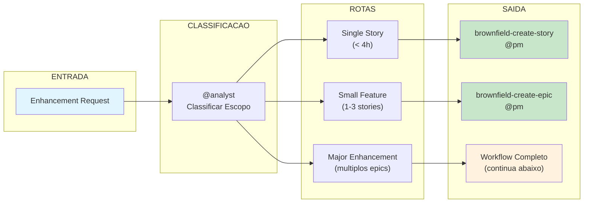
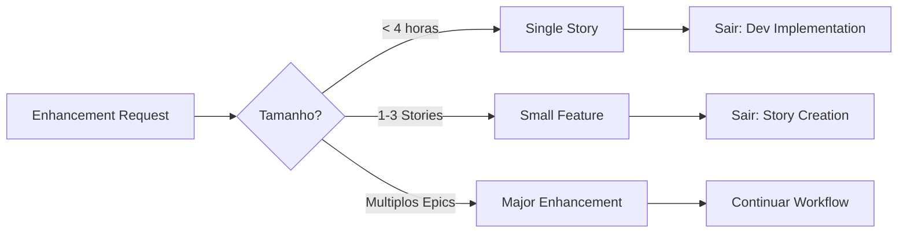
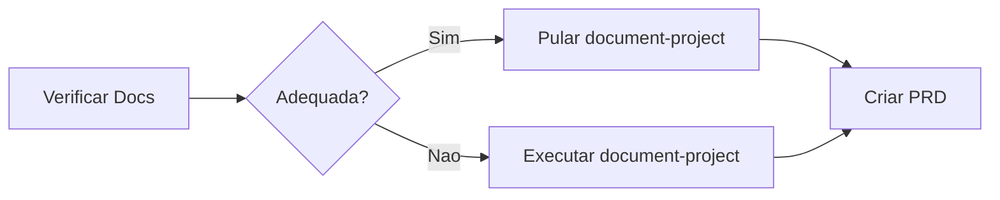
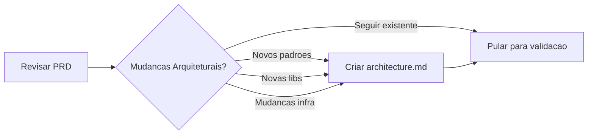
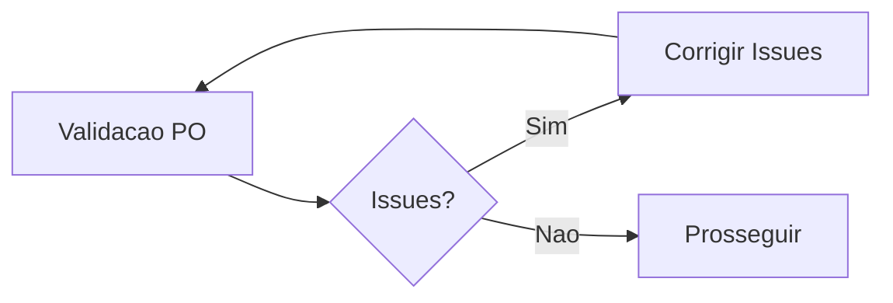
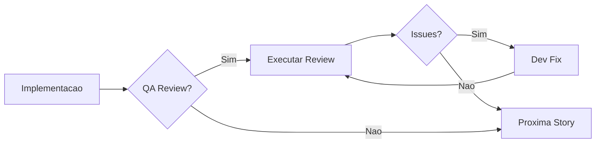
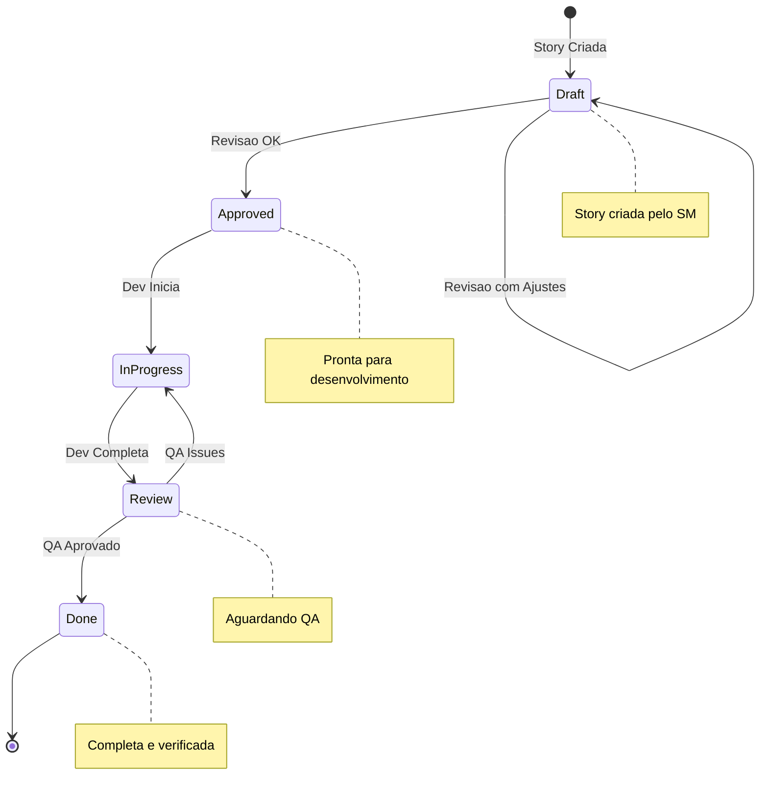
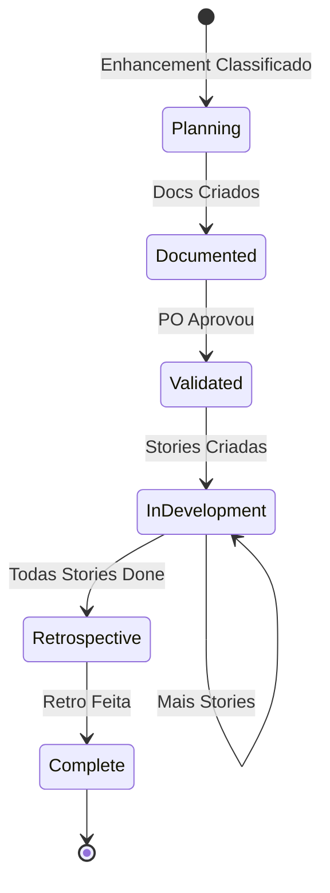

# Workflow: Brownfield Full-Stack Enhancement

> **Versao:** 1.0.0
> **Criado:** 2026-02-04
> **Tipo:** Desenvolvimento Brownfield
> **Status:** Documentacao Oficial
> **Arquivo Fonte:** `.aios-core/development/workflows/brownfield-fullstack.yaml`

---

## Visao Geral

O workflow **Brownfield Full-Stack Enhancement** e projetado para aprimorar aplicacoes full-stack existentes com novas funcionalidades, modernizacao ou mudancas significativas. Este workflow lida com analise de sistemas existentes e integracao segura, garantindo que as modificacoes nao quebrem funcionalidades ja estabelecidas.

### Quando Usar Este Workflow

**Use este workflow quando:**

- O aprimoramento requer stories coordenadas
- Mudancas arquiteturais sao necessarias
- Trabalho significativo de integracao e requerido
- Avaliacao e mitigacao de riscos sao necessarias
- Multiplos membros da equipe trabalharao em mudancas relacionadas

**Tipos de Projeto Suportados:**

- `feature-addition` - Adicao de novas funcionalidades
- `refactoring` - Refatoracao de codigo existente
- `modernization` - Modernizacao de tecnologias
- `integration-enhancement` - Aprimoramento de integracoes

---

## Diagrama Principal do Workflow

```mermaid
flowchart TB
    subgraph CLASSIFICATION["1. CLASSIFICACAO DO ENHANCEMENT"]
        START[("Inicio: Brownfield Enhancement")] --> ANALYST_CLASSIFY
        ANALYST_CLASSIFY["@analyst<br/>Classificar escopo do enhancement"]
    end

    ANALYST_CLASSIFY --> DECISION_SIZE{{"Tamanho do Enhancement?"}}

    subgraph ROUTING["2. ROTEAMENTO POR TAMANHO"]
        DECISION_SIZE -->|"Single Story<br/>(< 4 horas)"| PM_STORY
        DECISION_SIZE -->|"Small Feature<br/>(1-3 Stories)"| PM_EPIC
        DECISION_SIZE -->|"Major Enhancement<br/>(Multiplos Epics)"| ANALYST_DOCS

        PM_STORY["@pm<br/>brownfield-create-story"]
        PM_EPIC["@pm<br/>brownfield-create-epic"]
    end

    PM_STORY --> EXIT_STORY[/"Saida: Dev Implementation"/]
    PM_EPIC --> EXIT_EPIC[/"Saida: Story Creation"/]

    subgraph DOCUMENTATION["3. VERIFICACAO DE DOCUMENTACAO"]
        ANALYST_DOCS["@analyst<br/>Verificar documentacao existente"]
        ANALYST_DOCS --> DECISION_DOCS{{"Documentacao Adequada?"}}
        DECISION_DOCS -->|Nao| ARCHITECT_DOCPROJ["@architect<br/>document-project"]
        DECISION_DOCS -->|Sim| PM_PRD["@pm<br/>Criar brownfield-prd.md"]
        ARCHITECT_DOCPROJ --> PM_PRD
    end

    subgraph PLANNING["4. PLANEJAMENTO"]
        PM_PRD --> DECISION_ARCH{{"Mudancas<br/>Arquiteturais?"}}
        DECISION_ARCH -->|Sim| ARCHITECT_ARCH["@architect<br/>Criar architecture.md"]
        DECISION_ARCH -->|Nao| PO_VALIDATE
        ARCHITECT_ARCH --> PO_VALIDATE["@po<br/>Validar artifacts<br/>(po-master-checklist)"]
    end

    subgraph VALIDATION["5. VALIDACAO E CORRECAO"]
        PO_VALIDATE --> DECISION_ISSUES{{"PO encontrou<br/>problemas?"}}
        DECISION_ISSUES -->|Sim| FIX_ISSUES["Corrigir issues<br/>(agente relevante)"]
        FIX_ISSUES --> PO_VALIDATE
        DECISION_ISSUES -->|Nao| PO_SHARD["@po<br/>Shard documents"]
    end

    subgraph DEVELOPMENT["6. CICLO DE DESENVOLVIMENTO"]
        PO_SHARD --> SM_STORY["@sm<br/>Criar story"]
        SM_STORY --> DECISION_STORY_TYPE{{"Tipo de<br/>Documentacao?"}}
        DECISION_STORY_TYPE -->|"PRD Sharded"| SM_NEXT["create-next-story"]
        DECISION_STORY_TYPE -->|"Brownfield Docs"| SM_BROWNFIELD["create-brownfield-story"]
        SM_NEXT --> DECISION_REVIEW{{"Revisar draft?"}}
        SM_BROWNFIELD --> DECISION_REVIEW
        DECISION_REVIEW -->|Sim| REVIEW_APPROVE["Revisar & Aprovar"]
        DECISION_REVIEW -->|Nao| DEV_IMPLEMENT
        REVIEW_APPROVE --> DEV_IMPLEMENT["@dev<br/>Implementar story"]
    end

    subgraph QA_CYCLE["7. CICLO DE QA"]
        DEV_IMPLEMENT --> DECISION_QA{{"QA Review?"}}
        DECISION_QA -->|Sim| QA_REVIEW["@qa<br/>Review implementation"]
        DECISION_QA -->|Nao| DECISION_MORE_STORIES
        QA_REVIEW --> DECISION_QA_ISSUES{{"Issues?"}}
        DECISION_QA_ISSUES -->|Sim| DEV_FIX["@dev<br/>Corrigir feedback"]
        DECISION_QA_ISSUES -->|Nao| DECISION_MORE_STORIES
        DEV_FIX --> QA_REVIEW
    end

    subgraph COMPLETION["8. FINALIZACAO"]
        DECISION_MORE_STORIES{{"Mais stories?"}}
        DECISION_MORE_STORIES -->|Sim| SM_STORY
        DECISION_MORE_STORIES -->|Nao| DECISION_RETRO
        DECISION_RETRO{{"Retrospectiva?"}}
        DECISION_RETRO -->|Sim| PO_RETRO["@po<br/>Epic Retrospective"]
        DECISION_RETRO -->|Nao| COMPLETE
        PO_RETRO --> COMPLETE[("Projeto Completo")]
    end

    style START fill:#87CEEB
    style COMPLETE fill:#90EE90
    style EXIT_STORY fill:#90EE90
    style EXIT_EPIC fill:#90EE90
    style PM_STORY fill:#87CEEB
    style PM_EPIC fill:#87CEEB
    style PM_PRD fill:#FFE4B5
    style ARCHITECT_ARCH fill:#FFE4B5
    style PO_SHARD fill:#ADD8E6
    style SM_STORY fill:#ADD8E6
    style DEV_IMPLEMENT fill:#ADD8E6
    style REVIEW_APPROVE fill:#F0E68C
    style QA_REVIEW fill:#F0E68C
    style PO_RETRO fill:#F0E68C
```



---

## Diagrama Simplificado de Roteamento



---

## Steps Detalhados

### Step 1: Classificacao do Enhancement

| Atributo | Valor |
|----------|-------|
| **Agente** | @analyst (Atlas) |
| **Acao** | Classificar escopo do enhancement |
| **Input** | Descricao do enhancement pelo usuario |
| **Output** | Classificacao: single_story / small_feature / major_enhancement |

**Processo:**

O analista determina a complexidade do enhancement para rotear ao caminho apropriado. A pergunta-chave ao usuario e:

> "Voce pode descrever o escopo do enhancement? E uma pequena correcao, uma adicao de feature, ou um enhancement maior que requer mudancas arquiteturais?"

**Criterios de Classificacao:**

- **Single Story** (< 4 horas): Use task `brownfield-create-story`
- **Small Feature** (1-3 stories): Use task `brownfield-create-epic`
- **Major Enhancement** (multiplos epics): Continue com workflow completo

---

### Step 2: Roteamento por Decisao

| Rota | Agente | Task | Proxima Acao |
|------|--------|------|--------------|
| `single_story` | @pm | `brownfield-create-story` | Sair do workflow apos criacao da story |
| `small_feature` | @pm | `brownfield-create-epic` | Sair do workflow apos criacao do epic |
| `major_enhancement` | - | - | Continuar para o proximo step |

---

### Step 3: Verificacao de Documentacao

| Atributo | Valor |
|----------|-------|
| **Agente** | @analyst (Atlas) |
| **Acao** | Verificar documentacao existente |
| **Condicao** | Apenas para `major_enhancement` |
| **Input** | Codebase e documentacao existente |
| **Output** | Avaliacao: documentacao_adequada / documentacao_inadequada |

**Checklist de Verificacao:**

- [ ] Documentos de arquitetura existem?
- [ ] Especificacoes de API estao atualizadas?
- [ ] Padroes de codificacao estao documentados?
- [ ] Documentacao esta atual e abrangente?

**Decisao:**

- **Se adequada**: Pular `document-project`, prosseguir para criacao do PRD
- **Se inadequada**: Executar `document-project` primeiro

---

### Step 4: Analise do Projeto (Condicional)

| Atributo | Valor |
|----------|-------|
| **Agente** | @architect (Aria) |
| **Task** | `document-project` |
| **Condicao** | Executar se documentacao for inadequada |
| **Input** | Codebase existente |
| **Output** | `brownfield-architecture.md` (ou multiplos documentos) |

**Proposito:**

Capturar o estado atual do sistema, divida tecnica e restricoes. Os achados sao passados para a criacao do PRD.

**Arquivo de Task:** `.aios-core/development/tasks/document-project.md`

---

### Step 5: Criacao do PRD Brownfield

| Atributo | Valor |
|----------|-------|
| **Agente** | @pm (Morgan) |
| **Template** | `brownfield-prd-tmpl` |
| **Requisito** | Documentacao existente ou analise do Step 4 |
| **Output** | `docs/prd.md` |

**Instrucoes:**

- Se `document-project` foi executado, referencie sua saida para evitar re-analise
- Se pulado, use documentacao existente do projeto
- **IMPORTANTE**: Copie o `prd.md` final para a pasta `docs/` do projeto

---

### Step 6: Decisao de Arquitetura

| Atributo | Valor |
|----------|-------|
| **Agentes** | @pm (Morgan) / @architect (Aria) |
| **Acao** | Determinar se documento de arquitetura e necessario |
| **Condicao** | Apos criacao do PRD |

**Criterios para criar documento de arquitetura:**

- [ ] Novos padroes arquiteturais necessarios
- [ ] Novas bibliotecas/frameworks a serem adotados
- [ ] Mudancas de plataforma/infraestrutura
- [ ] Seguir padroes existentes? -> Pular para criacao de story

---

### Step 7: Criacao de Arquitetura (Condicional)

| Atributo | Valor |
|----------|-------|
| **Agente** | @architect (Aria) |
| **Template** | `brownfield-architecture-tmpl` |
| **Requisito** | `prd.md` |
| **Condicao** | Mudancas arquiteturais necessarias |
| **Output** | `docs/architecture.md` |

**Instrucoes:**

Crie documento de arquitetura APENAS para mudancas arquiteturais significativas.

**IMPORTANTE**: Copie o `architecture.md` final para a pasta `docs/` do projeto

---

### Step 8: Validacao pelo PO

| Atributo | Valor |
|----------|-------|
| **Agente** | @po (Pax) |
| **Checklist** | `po-master-checklist` |
| **Input** | Todos os artefatos criados |
| **Output** | Validacao ou lista de issues |

**Arquivo de Checklist:** `.aios-core/product/checklists/po-master-checklist.md`

**Processo:**

Valida todos os documentos quanto a:
- Seguranca de integracao
- Completude
- Alinhamento com requisitos
- Riscos brownfield especificos

---

### Step 9: Correcao de Issues (Condicional)

| Atributo | Valor |
|----------|-------|
| **Agente** | Variavel (depende do issue) |
| **Condicao** | PO encontrou problemas |
| **Acao** | Corrigir e re-exportar documentos atualizados |

**Fluxo:**

1. PO identifica issues
2. Agente relevante corrige
3. Documento atualizado e salvo em `docs/`
4. Retorna para validacao do PO

---

### Step 10: Sharding de Documentos

| Atributo | Valor |
|----------|-------|
| **Agente** | @po (Pax) |
| **Task** | `shard-doc` |
| **Input** | Documentos validados no projeto |
| **Output** | `docs/prd/` e `docs/architecture/` com conteudo fragmentado |

**Opcoes de Execucao:**

- **Opcao A**: Use agente PO para shard: `@po` e peca para fragmentar `docs/prd.md`
- **Opcao B**: Manual: Arraste a task `shard-doc` + `docs/prd.md` no chat

**Arquivo de Task:** `.aios-core/development/tasks/shard-doc.md`

---

### Step 11: Criacao de Story

| Atributo | Valor |
|----------|-------|
| **Agente** | @sm (River) |
| **Repete** | Para cada epic ou enhancement |
| **Input** | Documentos fragmentados ou docs brownfield |
| **Output** | `story.md` em status "Draft" |

**Decisao de Task:**

| Tipo de Documentacao | Task |
|---------------------|------|
| PRD Sharded | `create-next-story` |
| Brownfield Docs | `create-brownfield-story` |

**Arquivos de Task:**
- `.aios-core/development/tasks/create-next-story.md`
- `.aios-core/development/tasks/create-brownfield-story.md`

---

### Step 12: Revisao de Draft (Opcional)

| Atributo | Valor |
|----------|-------|
| **Agentes** | @analyst / @pm |
| **Condicao** | Usuario deseja revisao da story |
| **Input** | `story.md` em Draft |
| **Output** | Story atualizada: Draft -> Approved |

**Nota:** Task `story-review` em desenvolvimento.

---

### Step 13: Implementacao

| Atributo | Valor |
|----------|-------|
| **Agente** | @dev (Dex) |
| **Requisito** | Story aprovada |
| **Output** | Arquivos de implementacao |

**Instrucoes:**

1. Dev Agent (Nova sessao de chat): `@dev`
2. Implementa story aprovada
3. Atualiza File List com todas as mudancas
4. Marca story como "Review" quando completo

---

### Step 14: Review de QA (Opcional)

| Atributo | Valor |
|----------|-------|
| **Agente** | @qa (Quinn) |
| **Task** | `review-story` |
| **Requisito** | Arquivos implementados |
| **Output** | Implementacao revisada |

**Processo:**

1. QA Agent (Nova sessao de chat): `@qa` -> `review-story`
2. Review de senior dev com capacidade de refatoracao
3. Corrige issues pequenos diretamente
4. Deixa checklist para itens restantes
5. Atualiza status da story (Review -> Done ou permanece Review)

---

### Step 15: Correcao de Feedback do QA (Condicional)

| Atributo | Valor |
|----------|-------|
| **Agente** | @dev (Dex) |
| **Condicao** | QA deixou itens nao verificados |
| **Acao** | Endereca itens restantes |

**Fluxo:**

1. Dev Agent (Nova sessao de chat): Enderecar itens restantes
2. Retornar para QA para aprovacao final

---

### Step 16: Ciclo de Desenvolvimento

**Repete:** Ciclo SM -> Dev -> QA para todas as stories do epic

Continua ate que todas as stories no PRD estejam completas.

---

### Step 17: Retrospectiva do Epic (Opcional)

| Atributo | Valor |
|----------|-------|
| **Agente** | @po (Pax) |
| **Condicao** | Epic completo |
| **Output** | `epic-retrospective.md` |

**Processo:**

1. Validar que epic foi completado corretamente
2. Documentar aprendizados e melhorias

**Nota:** Task `epic-retrospective` em desenvolvimento.

---

### Step 18: Conclusao do Workflow

**Status:** Todas as stories implementadas e revisadas

**Referencia:** `.aios-core/data/aios-kb.md#IDE Development Workflow`

---

## Agentes Participantes

| Agente | Nome | Papel no Workflow | Steps |
|--------|------|-------------------|-------|
| @analyst | Atlas | Classificacao de escopo, verificacao de documentacao | 1, 3 |
| @architect | Aria | Documentacao de projeto, design de arquitetura | 4, 6, 7 |
| @pm | Morgan | Criacao de PRD, epics e stories simples | 2, 5, 6 |
| @po | Pax | Validacao de artefatos, sharding, retrospectiva | 8, 10, 17 |
| @sm | River | Criacao detalhada de stories | 11 |
| @dev | Dex | Implementacao de stories | 13, 15 |
| @qa | Quinn | Review de implementacao | 14 |

---

## Tasks Executadas

| Task | Step | Agente | Proposito |
|------|------|--------|-----------|
| `brownfield-create-story` | 2 | @pm | Criar story unica para enhancements simples |
| `brownfield-create-epic` | 2 | @pm | Criar epic focado com 1-3 stories |
| `document-project` | 4 | @architect | Documentar estado atual do sistema brownfield |
| `brownfield-prd-tmpl` | 5 | @pm | Template para PRD de projeto brownfield |
| `brownfield-architecture-tmpl` | 7 | @architect | Template para arquitetura brownfield |
| `po-master-checklist` | 8 | @po | Validacao abrangente de artefatos |
| `shard-doc` | 10 | @po | Fragmentar documentos em arquivos menores |
| `create-next-story` | 11 | @sm | Criar story de PRD sharded |
| `create-brownfield-story` | 11 | @sm | Criar story de docs brownfield |
| `review-story` | 14 | @qa | Review de implementacao |

---

## Pre-requisitos

Antes de iniciar este workflow, certifique-se de:

### Ambiente

- [ ] Acesso ao repositorio do projeto existente
- [ ] Ambiente de desenvolvimento configurado
- [ ] Dependencias instaladas

### Documentacao

- [ ] Entendimento basico do sistema existente
- [ ] Acesso a documentacao existente (se houver)
- [ ] Requisitos do enhancement claros

### Ferramentas

- [ ] GitHub CLI configurado (`gh auth status`)
- [ ] Acesso ao PM tool (ClickUp/GitHub/Jira) se aplicavel
- [ ] Core config AIOS configurado (`.aios-core/core-config.yaml`)

---

## Entradas e Saidas

### Entradas do Workflow

| Entrada | Origem | Formato | Obrigatorio |
|---------|--------|---------|-------------|
| Enhancement Request | Usuario | Descricao textual | Sim |
| Codebase Existente | Repositorio | Codigo fonte | Sim |
| Documentacao Existente | `docs/` | Markdown | Nao |
| Requisitos de Stakeholders | Usuario/PM tool | Texto/Tickets | Nao |

### Saidas do Workflow

| Saida | Destino | Formato | Condicao |
|-------|---------|---------|----------|
| `brownfield-architecture.md` | `docs/` | Markdown | Se doc inadequada |
| `prd.md` | `docs/` | Markdown | Major enhancement |
| `architecture.md` | `docs/` | Markdown | Se mudancas arquiteturais |
| Stories fragmentados | `docs/stories/` | Markdown | Sempre |
| Codigo implementado | `src/` | Varios | Sempre |
| `epic-retrospective.md` | `docs/` | Markdown | Opcional |

---

## Pontos de Decisao

### Decisao 1: Tamanho do Enhancement



### Decisao 2: Documentacao Adequada



### Decisao 3: Mudancas Arquiteturais



### Decisao 4: Issues do PO



### Decisao 5: QA Review



---

## Handoff Prompts

### Classificacao Completa

```text
Enhancement classificado como: {{enhancement_type}}

Se single_story: Procedendo com brownfield-create-story task para implementacao imediata.
Se small_feature: Criando epic focado com brownfield-create-epic task.
Se major_enhancement: Continuando com workflow de planejamento abrangente.
```

### Avaliacao de Documentacao

```text
Avaliacao de documentacao completa:

Se adequada: Documentacao existente e suficiente. Procedendo diretamente para criacao do PRD.
Se inadequada: Executando document-project para capturar estado atual do sistema antes do PRD.
```

### Document Project para PM

```text
Analise do projeto completa. Principais achados documentados em:
- {{document_list}}

Use estes achados para informar a criacao do PRD e evitar re-analisar os mesmos aspectos.
```

### PM para Decisao do Architect

```text
PRD completo e salvo como docs/prd.md.
Mudancas arquiteturais identificadas: {{sim/nao}}

Se sim: Procedendo para criar documento de arquitetura para: {{mudancas_especificas}}
Se nao: Nenhuma mudanca arquitetural necessaria. Procedendo para validacao.
```

### Architect para PO

```text
Arquitetura completa. Salve como docs/architecture.md.
Por favor, valide todos os artefatos quanto a seguranca de integracao.
```

### PO para SM

```text
Todos os artefatos validados.
Tipo de documentacao disponivel: {{sharded_prd / brownfield_docs}}

Se sharded: Use task create-next-story padrao.
Se brownfield: Use task create-brownfield-story para lidar com formatos de documentacao variados.
```

### Criacao de Story pelo SM

```text
Criando story de {{documentation_type}}.

Se contexto faltando: Pode ser necessario coletar contexto adicional do usuario durante criacao da story.
```

### Workflow Completo

```text
Todos os artefatos de planejamento validados e desenvolvimento pode comecar.
Stories serao criadas baseadas no formato de documentacao disponivel.
```

---

## Troubleshooting

### Problema: Enhancement mal classificado

**Sintoma:** Workflow simples usado para enhancement complexo ou vice-versa

**Solucao:**
1. Pause o workflow atual
2. Re-execute classificacao com @analyst
3. Fornecer mais contexto sobre integracao e complexidade

### Problema: Documentacao inadequada nao detectada

**Sintoma:** PRD criado sem contexto suficiente do sistema

**Solucao:**
1. Execute `document-project` manualmente com @architect
2. Atualize PRD com novos achados
3. Re-valide com @po

### Problema: Ciclo infinito de validacao PO

**Sintoma:** Issues continuam aparecendo apos correcoes

**Solucao:**
1. Agendar reuniao de sincronizacao com stakeholders
2. Documentar criterios de aceitacao mais claros
3. Considerar reduzir escopo do enhancement

### Problema: Story muito grande

**Sintoma:** Story nao pode ser completada em uma sessao

**Solucao:**
1. Divida story em multiplas sub-stories
2. Re-avalie classificacao do enhancement
3. Considere usar `brownfield-create-epic` em vez de story unica

### Problema: Integracao quebrando funcionalidade existente

**Sintoma:** Testes de regressao falhando

**Solucao:**
1. Revise analise de impacto no PRD
2. Adicione mais testes de integracao
3. Considere feature flags para rollout gradual

### Problema: QA Review inconclusivo

**Sintoma:** Issues indo e voltando entre dev e QA

**Solucao:**
1. Documente criterios de aceitacao mais claros
2. Agende pair-programming para issues complexos
3. Considere adicionar testes automatizados

---

## Diagramas de Estado

### Estado da Story



### Estado do Epic



---

## Metricas de Sucesso

| Metrica | Descricao | Alvo |
|---------|-----------|------|
| Precisao de Classificacao | % de enhancements corretamente classificados | > 90% |
| Tempo ate PRD | Dias desde request ate PRD aprovado | < 3 dias |
| Issues por Validacao | Numero medio de issues encontrados por PO | < 3 |
| Ciclos de QA | Numero medio de ida-e-volta dev/QA | < 2 |
| Regressao Zero | % de releases sem bugs de regressao | 100% |

---

## Referencias

### Arquivos Core do Workflow

| Arquivo | Proposito |
|---------|-----------|
| `.aios-core/development/workflows/brownfield-fullstack.yaml` | Definicao do workflow |
| `.aios-core/development/tasks/brownfield-create-story.md` | Task para criar story simples |
| `.aios-core/development/tasks/brownfield-create-epic.md` | Task para criar epic |
| `.aios-core/development/tasks/document-project.md` | Task para documentar projeto existente |
| `.aios-core/development/tasks/shard-doc.md` | Task para fragmentar documentos |
| `.aios-core/development/tasks/create-brownfield-story.md` | Task para criar story brownfield |
| `.aios-core/development/tasks/create-next-story.md` | Task para criar story de PRD |
| `.aios-core/product/checklists/po-master-checklist.md` | Checklist de validacao PO |

### Arquivos de Agentes

| Arquivo | Agente |
|---------|--------|
| `.aios-core/development/agents/analyst.md` | @analyst (Atlas) |
| `.aios-core/development/agents/architect.md` | @architect (Aria) |
| `.aios-core/development/agents/pm.md` | @pm (Morgan) |
| `.aios-core/development/agents/po.md` | @po (Pax) |
| `.aios-core/development/agents/sm.md` | @sm (River) |
| `.aios-core/development/agents/dev.md` | @dev (Dex) |
| `.aios-core/development/agents/qa.md` | @qa (Quinn) |

### Documentacao Relacionada

| Documento | Proposito |
|-----------|-----------|
| `docs/guides/BACKLOG-MANAGEMENT-SYSTEM.md` | Sistema de gestao de backlog |
| `docs/guides/workflows/GREENFIELD-SERVICE-WORKFLOW.md` | Workflow para projetos greenfield |
| `.aios-core/working-in-the-brownfield.md` | Guia de trabalho brownfield |

---

## Changelog

| Data | Autor | Descricao |
|------|-------|-----------|
| 2026-02-04 | @analyst | Documento inicial criado |

---

*-- Atlas, decodificando complexidade em clareza*
