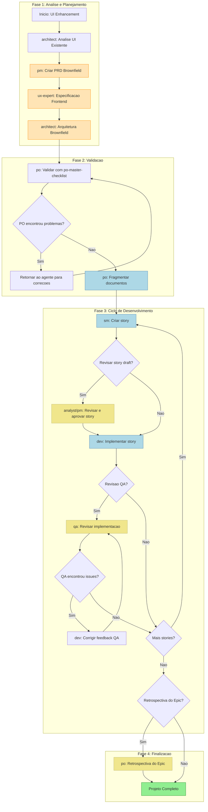
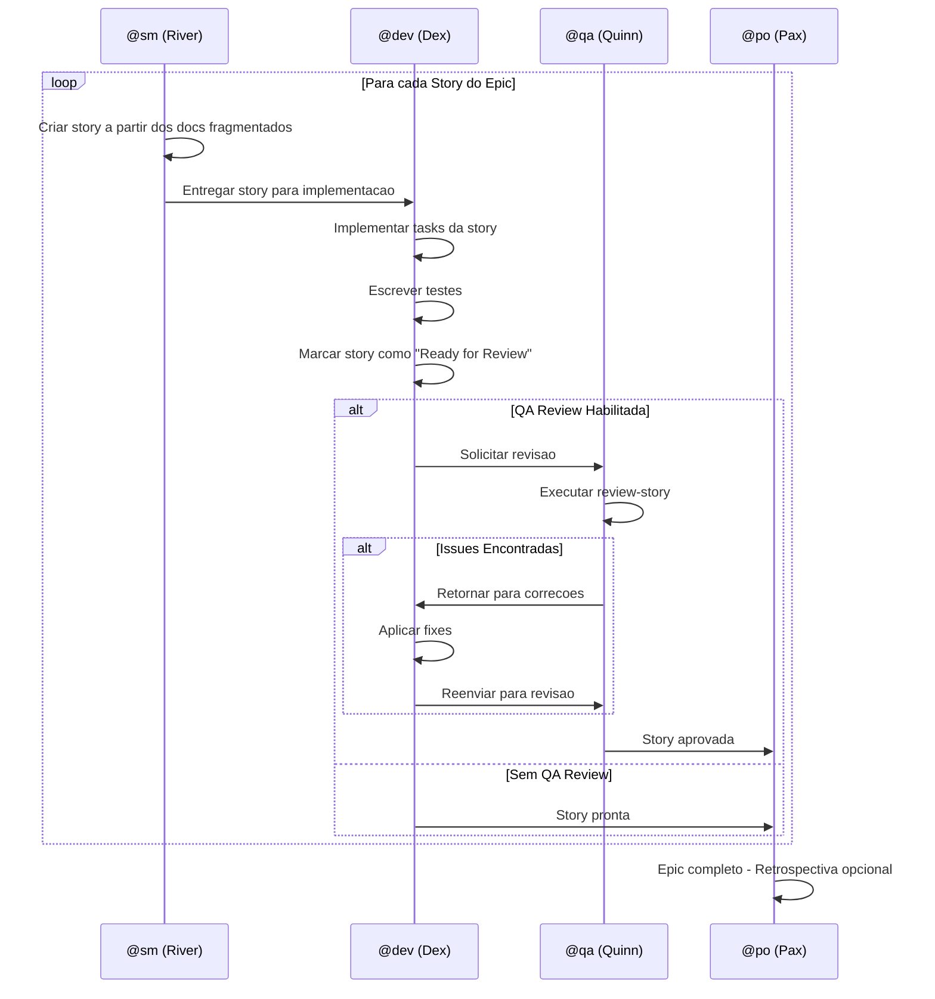
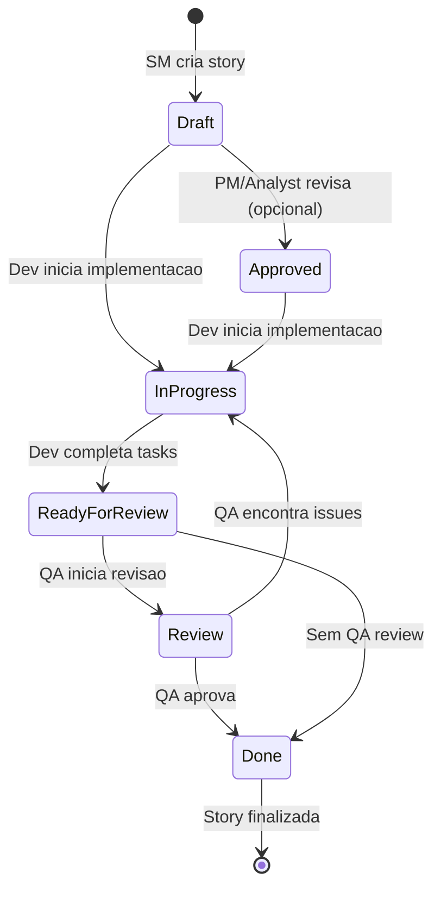
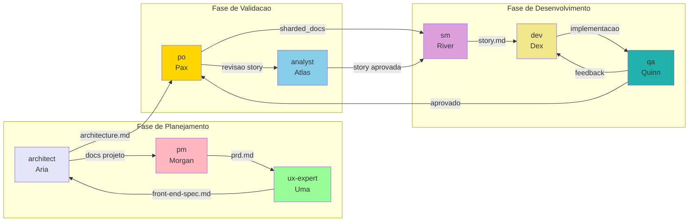
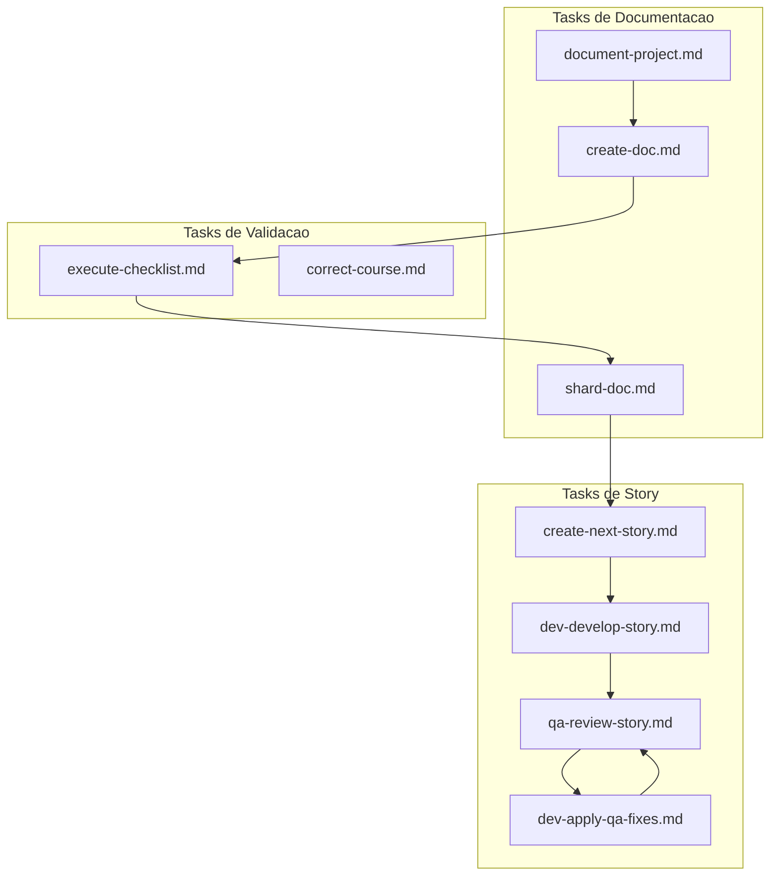
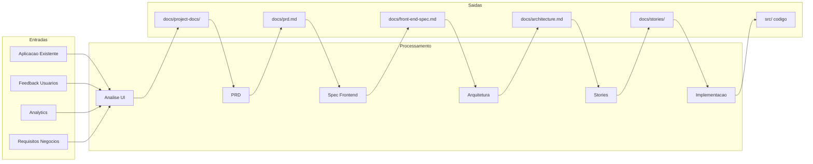
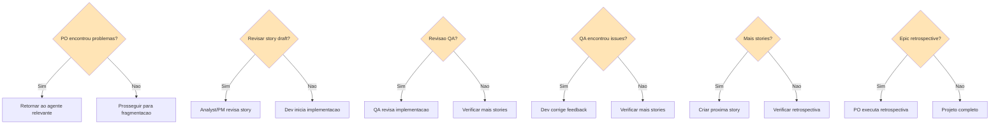

# Workflow Brownfield UI/Frontend Enhancement

> **ID:** `brownfield-ui`
> **Tipo:** Brownfield (projeto existente)
> **Versao:** 1.0
> **Ultima Atualizacao:** 2026-02-04

## Sumario

- [Visao Geral](#visao-geral)
- [Diagrama do Workflow](#diagrama-do-workflow)
- [Steps Detalhados](#steps-detalhados)
- [Agentes Participantes](#agentes-participantes)
- [Tasks Executadas](#tasks-executadas)
- [Pre-requisitos](#pre-requisitos)
- [Entradas e Saidas](#entradas-e-saidas)
- [Pontos de Decisao](#pontos-de-decisao)
- [Troubleshooting](#troubleshooting)
- [Referencias](#referencias)

---

## Visao Geral

O **Brownfield UI/Frontend Enhancement Workflow** e um fluxo de trabalho estruturado para aprimorar aplicacoes frontend existentes. Ele abrange desde a analise inicial do sistema legado ate a implementacao completa de novas funcionalidades, modernizacao de componentes ou atualizacao do design.

### Casos de Uso

| Tipo de Projeto | Descricao |
|-----------------|-----------|
| **UI Modernization** | Atualizacao de interfaces legadas para padroes modernos |
| **Framework Migration** | Migracao entre frameworks (ex: jQuery para React) |
| **Design Refresh** | Atualizacao visual seguindo novos padroes de design |
| **Frontend Enhancement** | Adicao de novas funcionalidades ao frontend existente |

### Beneficios

- Analise estruturada do sistema existente antes de modificacoes
- Integracao segura com codigo legado
- Validacao de qualidade em cada etapa
- Documentacao completa de decisoes arquiteturais

---

## Diagrama do Workflow

### Diagrama Principal de Fluxo



### Legenda de Cores

| Cor | Significado |
|-----|-------------|
| Verde Claro | Conclusao do workflow |
| Azul Claro | Steps de execucao principal |
| Laranja Claro | Criacao de artefatos de documentacao |
| Amarelo Claro | Steps opcionais de revisao |

### Diagrama de Ciclo de Desenvolvimento



### Diagrama de Estados da Story



---

## Steps Detalhados

### Step 1: Analise UI Existente

| Atributo | Valor |
|----------|-------|
| **Agente** | @architect (Aria) |
| **Acao** | Analisar projeto existente usando task `document-project` |
| **Artefatos Criados** | Multiplos documentos conforme template document-project |
| **Input** | Aplicacao frontend existente, feedback de usuarios, dados de analytics |
| **Output** | Documentacao do projeto com areas de melhoria identificadas |

**Observacoes:**
- Revisar a aplicacao frontend existente
- Analisar feedback de usuarios e dados de uso
- Identificar areas de melhoria e modernizacao
- Documentar a arquitetura atual

---

### Step 2: Criar PRD Brownfield

| Atributo | Valor |
|----------|-------|
| **Agente** | @pm (Morgan) |
| **Acao** | Criar PRD focado em enhancement de UI |
| **Template** | `brownfield-prd-tmpl` |
| **Artefatos Criados** | `prd.md` |
| **Requer** | Analise UI existente (Step 1) |
| **Output** | Documento PRD completo com estrategia de integracao |

**Observacoes:**
- Criar PRD abrangente focado em enhancement de UI
- Incluir analise do sistema existente
- IMPORTANTE: Salvar o arquivo final `prd.md` na pasta `docs/` do projeto

---

### Step 3: Especificacao Frontend

| Atributo | Valor |
|----------|-------|
| **Agente** | @ux-expert (Uma) |
| **Acao** | Criar especificacao UI/UX integrada com padroes existentes |
| **Template** | `front-end-spec-tmpl` |
| **Artefatos Criados** | `front-end-spec.md` |
| **Requer** | `prd.md` (Step 2) |
| **Output** | Especificacao de UI/UX detalhada |

**Observacoes:**
- Criar especificacao UI/UX que integra com padroes de design existentes
- Considerar design tokens ja utilizados
- IMPORTANTE: Salvar o arquivo final `front-end-spec.md` na pasta `docs/` do projeto

---

### Step 4: Arquitetura Brownfield

| Atributo | Valor |
|----------|-------|
| **Agente** | @architect (Aria) |
| **Acao** | Criar arquitetura frontend com estrategia de integracao |
| **Template** | `brownfield-architecture-tmpl` |
| **Artefatos Criados** | `architecture.md` |
| **Requer** | `prd.md`, `front-end-spec.md` (Steps 2 e 3) |
| **Output** | Documento de arquitetura com plano de migracao |

**Observacoes:**
- Criar arquitetura frontend com estrategia de integracao de componentes
- Incluir planejamento de migracao
- Definir como novos componentes interagem com o sistema existente
- IMPORTANTE: Salvar o arquivo final `architecture.md` na pasta `docs/` do projeto

---

### Step 5: Validacao PO

| Atributo | Valor |
|----------|-------|
| **Agente** | @po (Pax) |
| **Acao** | Validar todos os artefatos |
| **Checklist** | `po-master-checklist` |
| **Artefatos Validados** | Todos os artefatos criados |
| **Output** | Decisao de aprovacao ou lista de correcoes |

**Observacoes:**
- Validar todos os documentos para seguranca de integracao UI
- Verificar consistencia de design
- Pode requerer atualizacoes em qualquer documento

---

### Step 6: Correcoes (Condicional)

| Atributo | Valor |
|----------|-------|
| **Agente** | Variado (conforme problema encontrado) |
| **Condicao** | `po_checklist_issues` - PO encontrou problemas |
| **Acao** | Corrigir documentos sinalizados |
| **Output** | Documentos atualizados re-exportados para `docs/` |

**Observacoes:**
- Se PO encontrar problemas, retornar ao agente relevante
- Corrigir e re-exportar documentos atualizados

---

### Step 7: Fragmentacao de Documentos

| Atributo | Valor |
|----------|-------|
| **Agente** | @po (Pax) |
| **Acao** | Fragmentar documentos para desenvolvimento IDE |
| **Artefatos Criados** | `sharded_docs` (pastas `docs/prd/` e `docs/architecture/`) |
| **Requer** | Todos os artefatos na pasta do projeto |
| **Output** | Conteudo fragmentado pronto para consumo por agentes |

**Metodos de Execucao:**
- **Opcao A:** Usar agente PO para fragmentar: `@po` depois solicitar "shard docs/prd.md"
- **Opcao B:** Manual: Arrastar task `shard-doc` + `docs/prd.md` para o chat

---

### Step 8: Criacao de Stories (Ciclo)

| Atributo | Valor |
|----------|-------|
| **Agente** | @sm (River) |
| **Acao** | Criar stories a partir dos documentos fragmentados |
| **Artefatos Criados** | `story.md` (para cada epic) |
| **Requer** | `sharded_docs` (Step 7) |
| **Repete** | Para cada epic do PRD |
| **Output** | Stories em status "Draft" |

**Processo:**
1. Ativar SM Agent em novo chat: `@sm`
2. Executar comando: `*draft`
3. SM cria proxima story a partir dos docs fragmentados
4. Story inicia em status "Draft"

---

### Step 9: Revisao de Story Draft (Opcional)

| Atributo | Valor |
|----------|-------|
| **Agente** | @analyst (Atlas) ou @pm (Morgan) |
| **Acao** | Revisar e aprovar story draft |
| **Condicao** | `user_wants_story_review` - Usuario deseja revisao |
| **Opcional** | Sim |
| **Output** | Story atualizada com status "Draft" -> "Approved" |

**Observacoes:**
- Task `story-review` em desenvolvimento
- Revisar completude e alinhamento da story
- Atualizar status da story

---

### Step 10: Implementacao da Story

| Atributo | Valor |
|----------|-------|
| **Agente** | @dev (Dex) |
| **Acao** | Implementar story aprovada |
| **Artefatos Criados** | Arquivos de implementacao |
| **Requer** | `story.md` aprovada |
| **Output** | Codigo implementado, File List atualizada, status "Review" |

**Processo:**
1. Ativar Dev Agent em novo chat: `@dev`
2. Executar comando: `*develop {story-id}`
3. Implementar story conforme tasks
4. Atualizar File List com todas as mudancas
5. Marcar story como "Review" ao completar

---

### Step 11: Revisao QA (Opcional)

| Atributo | Valor |
|----------|-------|
| **Agente** | @qa (Quinn) |
| **Acao** | Revisar implementacao como senior dev |
| **Artefatos Atualizados** | Arquivos de implementacao |
| **Requer** | Arquivos implementados |
| **Opcional** | Sim |
| **Output** | Fixes aplicados ou checklist de items pendentes |

**Processo:**
1. Ativar QA Agent em novo chat: `@qa`
2. Executar comando: `*review {story-id}`
3. Revisao senior dev com capacidade de refatoracao
4. Corrigir issues pequenas diretamente
5. Deixar checklist para items restantes
6. Atualizar status da story (Review -> Done ou permanece Review)

---

### Step 12: Correcoes de Feedback QA (Condicional)

| Atributo | Valor |
|----------|-------|
| **Agente** | @dev (Dex) |
| **Condicao** | `qa_left_unchecked_items` - QA deixou items pendentes |
| **Acao** | Enderecao de feedback do QA |
| **Output** | Items corrigidos, retorno ao QA para aprovacao final |

---

### Step 13: Ciclo de Desenvolvimento

| Atributo | Valor |
|----------|-------|
| **Acao** | Repetir ciclo SM -> Dev -> QA |
| **Repete** | Para todas as stories do PRD |
| **Condicao de Saida** | Todas as stories do PRD completas |

---

### Step 14: Retrospectiva do Epic (Opcional)

| Atributo | Valor |
|----------|-------|
| **Agente** | @po (Pax) |
| **Condicao** | `epic_complete` - Epic finalizado |
| **Opcional** | Sim |
| **Artefatos Criados** | `epic-retrospective.md` |
| **Output** | Documentacao de learnings e melhorias |

**Observacoes:**
- Task `epic-retrospective` em desenvolvimento
- Validar que epic foi completado corretamente
- Documentar aprendizados e melhorias

---

### Step 15: Projeto Completo

| Atributo | Valor |
|----------|-------|
| **Acao** | Finalizacao do workflow |
| **Status** | Todas as stories implementadas e revisadas |
| **Output** | Fase de desenvolvimento do projeto completa |

---

## Agentes Participantes

### Tabela de Agentes

| Icone | ID | Nome | Titulo | Papel no Workflow |
|-------|-----|------|--------|-------------------|
| @architect | architect | Aria | Holistic System Architect | Analise inicial e arquitetura brownfield |
| @pm | pm | Morgan | Product Manager | Criacao do PRD brownfield |
| @ux-expert | ux-design-expert | Uma | UX/UI Designer | Especificacao frontend |
| @po | po | Pax | Product Owner | Validacao, fragmentacao, retrospectiva |
| @sm | sm | River | Scrum Master | Criacao de stories |
| @analyst | analyst | Atlas | Business Analyst | Revisao de stories (opcional) |
| @dev | dev | Dex | Full Stack Developer | Implementacao |
| @qa | qa | Quinn | Test Architect | Revisao de qualidade (opcional) |

### Diagrama de Colaboracao entre Agentes



---

## Tasks Executadas

### Tasks por Step

| Step | Task | Agente | Descricao |
|------|------|--------|-----------|
| 1 | `document-project.md` | architect | Documentar projeto existente |
| 2 | `create-doc.md` + `brownfield-prd-tmpl` | pm | Criar PRD brownfield |
| 3 | `create-doc.md` + `front-end-spec-tmpl` | ux-expert | Criar especificacao frontend |
| 4 | `create-doc.md` + `brownfield-architecture-tmpl` | architect | Criar arquitetura brownfield |
| 5 | `execute-checklist.md` + `po-master-checklist` | po | Validar artefatos |
| 7 | `shard-doc.md` | po | Fragmentar documentos |
| 8 | `create-next-story.md` | sm | Criar stories |
| 10 | `dev-develop-story.md` | dev | Implementar story |
| 11 | `qa-review-story.md` | qa | Revisar implementacao |
| 12 | `dev-apply-qa-fixes.md` | dev | Aplicar correcoes QA |

### Tasks Relacionadas



---

## Pre-requisitos

### Requisitos Tecnicos

| Requisito | Descricao | Verificacao |
|-----------|-----------|-------------|
| **Aplicacao Existente** | Frontend ativo para analise | Codebase acessivel |
| **Templates AIOS** | Templates instalados | Verificar `.aios-core/development/templates/` |
| **Agentes Configurados** | Todos os agentes do workflow | Verificar `.aios-core/development/agents/` |
| **Git Configurado** | Controle de versao | `git status` funcional |
| **Node.js** | Runtime para scripts | `node --version` >= 18 |

### Requisitos de Documentacao

| Documento | Localizacao | Necessario Para |
|-----------|-------------|-----------------|
| Templates de PRD | `.aios-core/development/templates/brownfield-prd-tmpl.yaml` | Step 2 |
| Template Frontend | `.aios-core/development/templates/front-end-spec-tmpl.yaml` | Step 3 |
| Template Arquitetura | `.aios-core/development/templates/brownfield-architecture-tmpl.yaml` | Step 4 |
| Checklist PO | `.aios-core/development/checklists/po-master-checklist.md` | Step 5 |
| Template Story | `.aios-core/development/templates/story-tmpl.yaml` | Step 8 |

### Dados de Entrada Recomendados

- Feedback de usuarios da aplicacao atual
- Dados de analytics (uso de features, tempo em pagina, etc.)
- Documentacao tecnica existente (se disponivel)
- Design system ou style guide atual
- Requisitos de negocio para melhorias

---

## Entradas e Saidas

### Matriz de Entradas/Saidas por Step



### Artefatos Finais

| Artefato | Localizacao | Descricao |
|----------|-------------|-----------|
| Documentacao do Projeto | `docs/project-docs/` | Analise do sistema existente |
| PRD Brownfield | `docs/prd.md` | Requisitos do produto |
| Especificacao Frontend | `docs/front-end-spec.md` | Especificacao UI/UX |
| Arquitetura | `docs/architecture.md` | Arquitetura do sistema |
| PRD Fragmentado | `docs/prd/` | Documentos fragmentados |
| Arquitetura Fragmentada | `docs/architecture/` | Arquitetura fragmentada |
| Stories | `docs/stories/epic-{N}/` | User stories |
| Codigo Implementado | `src/` | Codigo fonte |
| Retrospectiva | `docs/epic-retrospective.md` | Learnings (opcional) |

---

## Pontos de Decisao

### Diagrama de Decisoes



### Descricao dos Pontos de Decisao

| Ponto | Condicao | Caminho Sim | Caminho Nao |
|-------|----------|-------------|-------------|
| **D1** | `po_checklist_issues` | Corrigir documentos | Fragmentar documentos |
| **D2** | `user_wants_story_review` | Revisao por Analyst/PM | Direto para Dev |
| **D3** | Configuracao do projeto | Revisao QA completa | Skip para proxima story |
| **D4** | `qa_left_unchecked_items` | Dev corrige issues | Marcar story como Done |
| **D5** | Stories restantes no PRD | Criar proxima story | Verificar retrospectiva |
| **D6** | `epic_complete` e desejado | Executar retrospectiva | Finalizar projeto |

### Criterios de Decisao

#### Quando Usar Revisao de Story (D2)
- Stories complexas com multiplas dependencias
- Primeira story de um novo epic
- Stories com impacto em multiplos sistemas
- Requisitos de negocio ambiguos

#### Quando Usar Revisao QA (D3)
- Mudancas em componentes criticos
- Alteracoes de seguranca ou performance
- Codigo que interage com sistemas externos
- Primeira implementacao de novos patterns

#### Quando Fazer Retrospectiva (D6)
- Epic levou mais tempo que planejado
- Houve muitos ciclos de correcao
- Novos patterns foram estabelecidos
- Aprendizados importantes para compartilhar

---

## Troubleshooting

### Problemas Comuns e Solucoes

#### Problema: Agente nao reconhece comandos

**Sintomas:**
- Agente nao responde a comandos com prefixo `*`
- Mensagens de erro sobre comandos desconhecidos

**Solucao:**
1. Verificar se o agente foi ativado corretamente com `@{agent-id}`
2. Confirmar que o comando existe para o agente (consultar `*help`)
3. Verificar ortografia do comando

```bash
# Exemplo de ativacao correta
@pm
*create-brownfield-prd
```

---

#### Problema: Templates nao encontrados

**Sintomas:**
- Erro ao criar documentos
- Mensagem sobre template inexistente

**Solucao:**
1. Verificar se templates existem:
```bash
ls .aios-core/development/templates/
```

2. Verificar nome correto do template no workflow
3. Se necessario, reinstalar templates do AIOS core

---

#### Problema: Validacao PO falha repetidamente

**Sintomas:**
- Ciclo infinito entre validacao e correcoes
- Documentos nunca sao aprovados

**Solucao:**
1. Revisar criterios do `po-master-checklist`
2. Verificar se todos os requisitos foram compreendidos
3. Considerar simplificar escopo se necessario
4. Consultar PO sobre criterios especificos

---

#### Problema: Story muito grande para implementacao

**Sintomas:**
- Dev demora muito para completar
- Muitas tasks na story
- Feedback de escopo muito amplo

**Solucao:**
1. Voltar ao SM para fragmentar story em stories menores
2. Usar comando `*shard-doc` para quebrar PRD
3. Revisar granularidade do epic

---

#### Problema: QA encontra muitos issues

**Sintomas:**
- Ciclos repetidos entre Dev e QA
- Lista crescente de issues

**Solucao:**
1. Verificar se Dev esta seguindo padroes de codigo
2. Rodar linting antes de submeter para QA
3. Verificar testes unitarios passando
4. Considerar pair programming para issues recorrentes

---

#### Problema: Fragmentacao de documentos nao funciona

**Sintomas:**
- Erro ao executar shard-doc
- Pastas nao criadas

**Solucao:**
1. Verificar se documentos foram salvos na pasta `docs/`
2. Confirmar permissoes de escrita
3. Executar manualmente:
```bash
@po
# Solicitar fragmentacao especifica
"shard docs/prd.md"
```

---

### Logs e Diagnosticos

#### Verificar Status do Projeto

```bash
# Via AIOS
@aios-master
*status

# Via Git
git status
```

#### Verificar Historico de Agentes

```bash
@{agent}
*session-info
```

#### Localizar Artefatos

```bash
# Documentos
ls docs/

# Stories
ls docs/stories/

# Arquitetura
ls docs/architecture/
```

---

## Referencias

### Documentacao Relacionada

| Documento | Localizacao | Descricao |
|-----------|-------------|-----------|
| AIOS Knowledge Base | `.aios-core/data/aios-kb.md` | Base de conhecimento AIOS |
| IDE Development Workflow | `.aios-core/data/aios-kb.md#IDE Development Workflow` | Workflow de desenvolvimento IDE |
| Brownfield PRD Template | `.aios-core/development/templates/brownfield-prd-tmpl.yaml` | Template PRD brownfield |
| Frontend Spec Template | `.aios-core/development/templates/front-end-spec-tmpl.yaml` | Template especificacao frontend |
| Brownfield Architecture Template | `.aios-core/development/templates/brownfield-architecture-tmpl.yaml` | Template arquitetura brownfield |
| PO Master Checklist | `.aios-core/development/checklists/po-master-checklist.md` | Checklist de validacao PO |

### Agentes

| Agente | Arquivo | Documentacao |
|--------|---------|--------------|
| @architect | `.aios-core/development/agents/architect.md` | Aria - Holistic System Architect |
| @pm | `.aios-core/development/agents/pm.md` | Morgan - Product Manager |
| @ux-expert | `.aios-core/development/agents/ux-design-expert.md` | Uma - UX/UI Designer |
| @po | `.aios-core/development/agents/po.md` | Pax - Product Owner |
| @sm | `.aios-core/development/agents/sm.md` | River - Scrum Master |
| @analyst | `.aios-core/development/agents/analyst.md` | Atlas - Business Analyst |
| @dev | `.aios-core/development/agents/dev.md` | Dex - Full Stack Developer |
| @qa | `.aios-core/development/agents/qa.md` | Quinn - Test Architect |

### Handoff Prompts

Os seguintes prompts sao usados para transicoes entre agentes:

| Transicao | Prompt |
|-----------|--------|
| Analyst -> PM | "UI analysis complete. Create comprehensive PRD with UI integration strategy." |
| PM -> UX | "PRD ready. Save it as docs/prd.md, then create the UI/UX specification." |
| UX -> Architect | "UI/UX spec complete. Save it as docs/front-end-spec.md, then create the frontend architecture." |
| Architect -> PO | "Architecture complete. Save it as docs/architecture.md. Please validate all artifacts for UI integration safety." |
| PO Issues | "PO found issues with [document]. Please return to [agent] to fix and re-save the updated document." |
| Complete | "All planning artifacts validated and saved in docs/ folder. Move to IDE environment to begin development." |

---

## Quando Usar Este Workflow

### Indicadores para Uso

- Enhancement de UI requer stories coordenadas
- Mudancas no design system sao necessarias
- Novos patterns de componentes sao requeridos
- Pesquisa e teste de usuarios sao necessarios
- Multiplos membros da equipe trabalharao em mudancas relacionadas

### Alternativas

| Cenario | Workflow Recomendado |
|---------|---------------------|
| Projeto novo (greenfield) | `greenfield-ui` |
| Bug fix simples | Workflow ad-hoc com @dev |
| Mudanca isolada | Story unica sem workflow completo |
| Migracao de backend | `brownfield-backend` |
| Full stack | `brownfield-fullstack` |

---

*Documentacao gerada automaticamente a partir de `.aios-core/development/workflows/brownfield-ui.yaml`*

*Ultima atualizacao: 2026-02-04*
