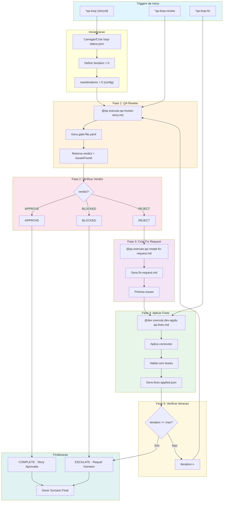
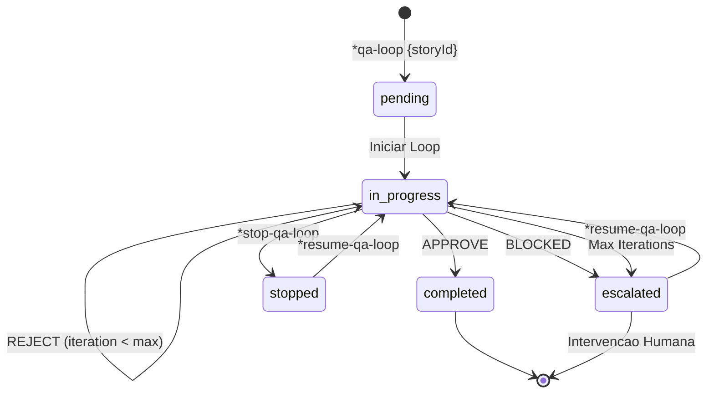
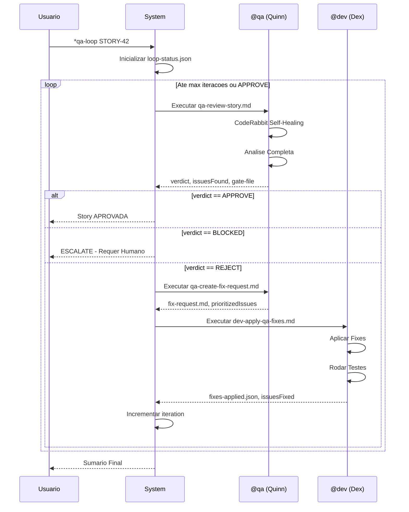
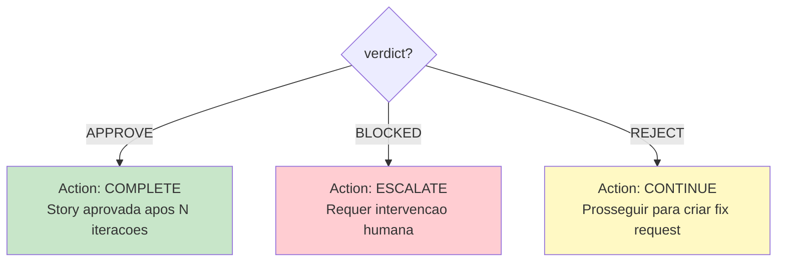
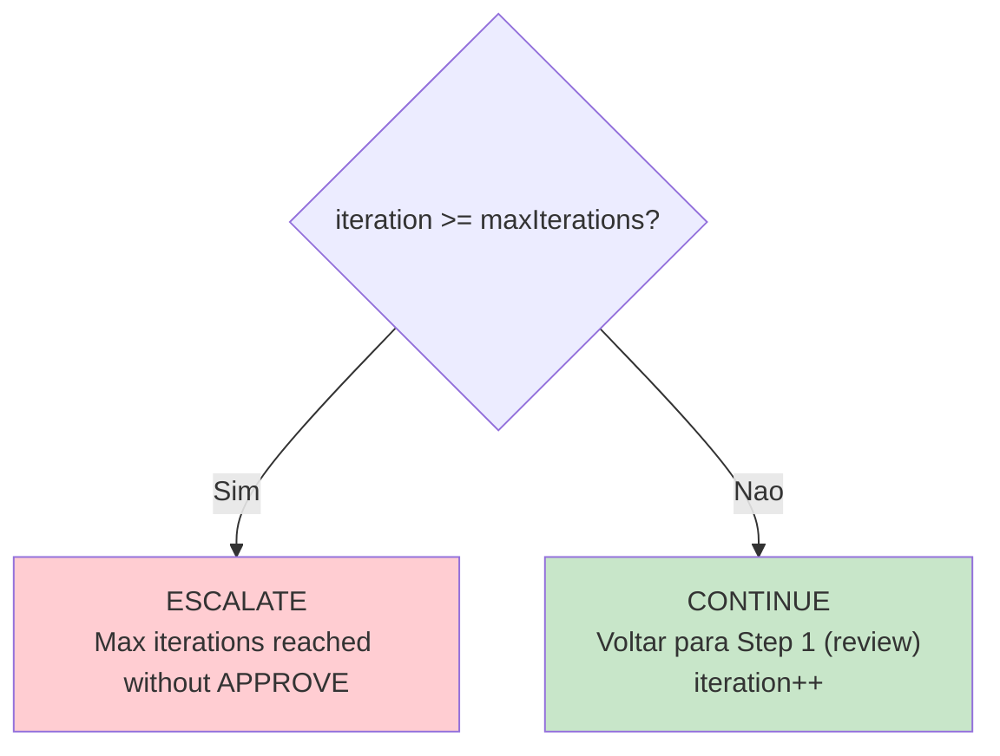
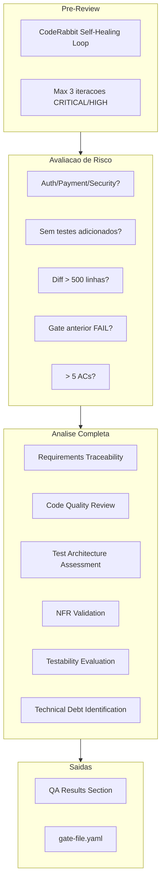
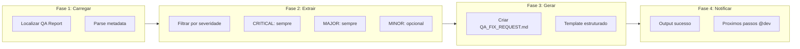
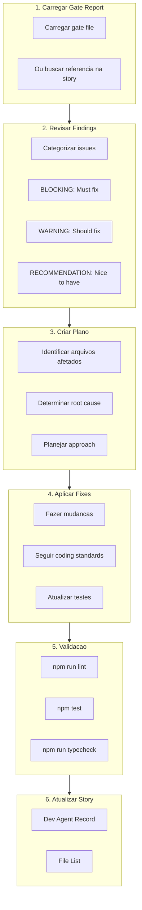
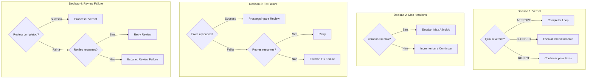
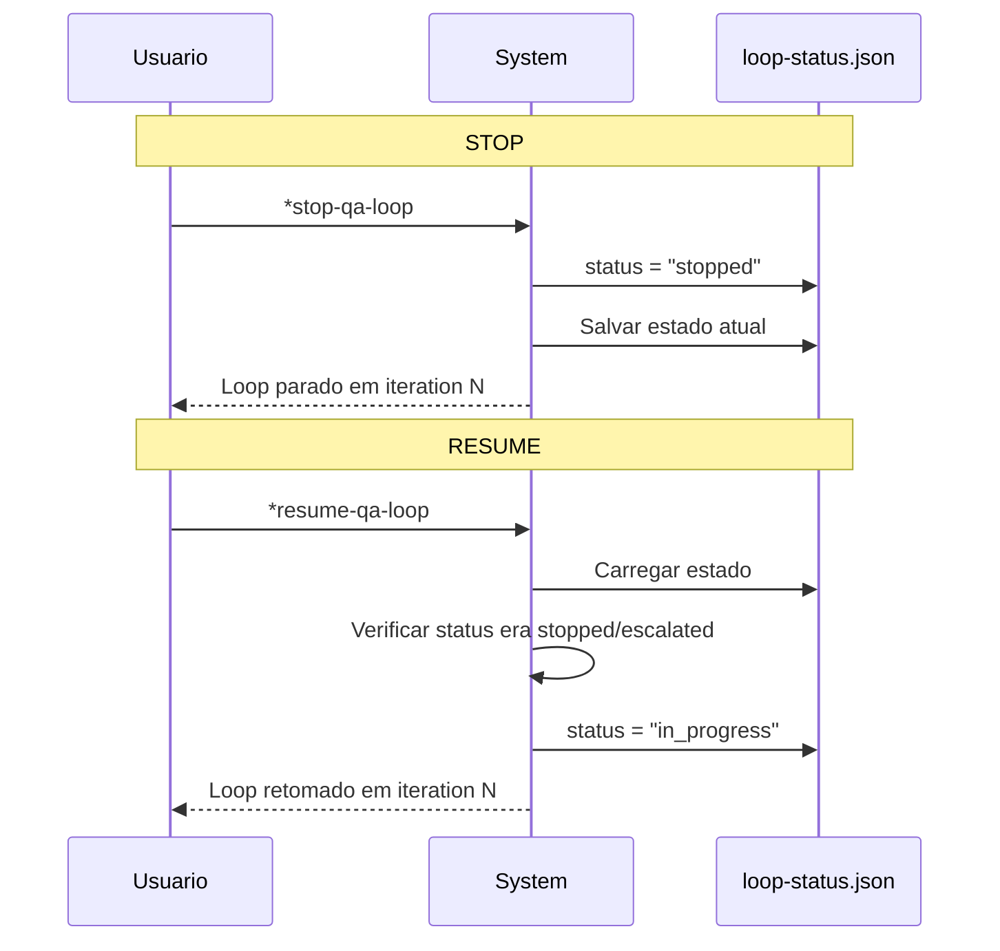

# QA Loop Workflow - Documentacao Completa

**Versao:** 1.0
**Ultima Atualizacao:** 2026-02-04
**Epic:** 6 - QA Evolution: Autonomous Development Engine (ADE)
**Story:** 6.5
**Autor:** @architect (Aria)

---

## Indice

1. [Visao Geral](#visao-geral)
2. [Diagrama do Workflow](#diagrama-do-workflow)
3. [Steps Detalhados](#steps-detalhados)
4. [Agentes Participantes](#agentes-participantes)
5. [Tasks Executadas](#tasks-executadas)
6. [Pre-requisitos](#pre-requisitos)
7. [Entradas e Saidas](#entradas-e-saidas)
8. [Pontos de Decisao](#pontos-de-decisao)
9. [Configuracao](#configuracao)
10. [Controle de Execucao](#controle-de-execucao)
11. [Escalacao](#escalacao)
12. [Integracao com Dashboard](#integracao-com-dashboard)
13. [Tratamento de Erros](#tratamento-de-erros)
14. [Troubleshooting](#troubleshooting)
15. [Referencias](#referencias)

---

## Visao Geral

O **QA Loop Orchestrator** e um workflow automatizado que orquestra o ciclo completo de:

```
Review -> Fix -> Re-review
```

Este workflow executa ate um maximo de iteracoes configuravel (padrao: 5), rastreando os resultados de cada iteracao. Quando o limite maximo e atingido ou uma parada manual e solicitada, o workflow escala para intervencao humana.

### Proposito

- Automatizar o ciclo de revisao de qualidade
- Reduzir tempo entre feedback e correcao
- Garantir rastreabilidade completa do processo de QA
- Escalar automaticamente quando necessario

### Tipos de Projeto Suportados

- `aios-development`
- `autonomous-development`
- `qa-automation`

---

## Diagrama do Workflow

### Fluxo Principal



### Diagrama de Estados



### Sequencia de Comunicacao entre Agentes



---

## Steps Detalhados

### Step 1: Review (Fase 1)

| Atributo | Valor |
|----------|-------|
| **Nome** | `review` |
| **Fase** | 1 - QA Review |
| **Agente** | `@qa` (Quinn) |
| **Task** | `qa-review-story.md` |
| **Timeout** | 30 minutos (1.800.000 ms) |

**Descricao:**
Executa revisao completa de QA da implementacao da story, produzindo um verdict: APPROVE, REJECT ou BLOCKED.

**Inputs:**

```yaml
storyId: "{storyId}"
iteration: "{currentIteration}"
previousIssues: "{history[-1].issuesFound|0}"
```

**Outputs:**

- `gate-file.yaml` - Arquivo de gate com decisao
- `verdict` - APPROVE | REJECT | BLOCKED
- `issuesFound` - Numero de issues encontrados

**On Success:**
```
log: "Review complete: {verdict} ({issuesFound} issues)"
next: check_verdict
```

**On Failure:**
```
action: retry (max 2 tentativas)
on_exhausted: escalate
```

---

### Step 2: Check Verdict (Fase 2)

| Atributo | Valor |
|----------|-------|
| **Nome** | `check_verdict` |
| **Fase** | 2 - Verdict Check |
| **Agente** | `system` |

**Descricao:**
Avalia o verdict da revisao e determina a proxima acao.

**Logica de Decisao:**



---

### Step 3: Create Fix Request (Fase 3)

| Atributo | Valor |
|----------|-------|
| **Nome** | `create_fix_request` |
| **Fase** | 3 - Create Fix Request |
| **Agente** | `@qa` (Quinn) |
| **Task** | `qa-create-fix-request.md` |

**Descricao:**
Gera um documento estruturado de fix request a partir dos findings da revisao. Prioriza issues e fornece instrucoes acionaveis de correcao.

**Inputs:**

```yaml
storyId: "{storyId}"
gateFile: "{outputs.review.gate-file}"
iteration: "{currentIteration}"
```

**Outputs:**

- `fix-request.md` - Documento com issues priorizados
- `prioritizedIssues` - Lista de issues ordenados por prioridade

**On Success:**
```
log: "Fix request created with {prioritizedIssues.length} prioritized issues"
next: fix_issues
```

**On Failure:**
```
action: continue
fallback: "Use raw gate file for fixes"
```

---

### Step 4: Fix Issues (Fase 4)

| Atributo | Valor |
|----------|-------|
| **Nome** | `fix_issues` |
| **Fase** | 4 - Apply Fixes |
| **Agente** | `@dev` (Dex) |
| **Task** | `dev-apply-qa-fixes.md` |
| **Timeout** | 60 minutos (3.600.000 ms) |

**Descricao:**
O agente desenvolvedor aplica as correcoes baseadas no fix request. Executa testes e valida as mudancas.

**Inputs:**

```yaml
storyId: "{storyId}"
fixRequest: "{outputs.create_fix_request.fix-request}"
iteration: "{currentIteration}"
```

**Outputs:**

- `fixes-applied.json` - Registro das correcoes aplicadas
- `issuesFixed` - Numero de issues corrigidos

**On Success:**
```
log: "Fixed {issuesFixed} of {issuesFound} issues"
next: increment_iteration
```

**On Failure:**
```
action: retry (max 2 tentativas)
on_exhausted: escalate com razao "Dev agent unable to apply fixes after retries"
```

---

### Step 5: Increment Iteration (Fase 5)

| Atributo | Valor |
|----------|-------|
| **Nome** | `increment_iteration` |
| **Fase** | 5 - Check Iteration |
| **Agente** | `system` |

**Descricao:**
Incrementa o contador de iteracao e verifica contra o maximo. Se max atingido, escala para humano.

**Logica:**



---

## Agentes Participantes

### @qa - Quinn (Test Architect)

```yaml
Nome: Quinn
ID: qa
Titulo: Test Architect & Quality Advisor
Icone: ✅
Arquetipo: Guardian
Signo: Virgo

Responsabilidades no QA Loop:
  - Executar revisao completa de QA (qa-review-story.md)
  - Criar fix requests estruturados (qa-create-fix-request.md)
  - Determinar verdict: APPROVE, REJECT, BLOCKED
  - Gerar gate files com decisoes documentadas
```

**Ferramentas Utilizadas:**

| Ferramenta | Proposito |
|------------|-----------|
| `github-cli` | Code review e PR management |
| `browser` | End-to-end testing e UI validation |
| `context7` | Research testing frameworks |
| `supabase` | Database testing e data validation |
| `coderabbit` | Automated code review |

**Integracao CodeRabbit:**

```yaml
self_healing:
  enabled: true
  type: full
  max_iterations: 3
  timeout_minutes: 30
  severity_filter: [CRITICAL, HIGH]
  behavior:
    CRITICAL: auto_fix
    HIGH: auto_fix
    MEDIUM: document_as_debt
    LOW: ignore
```

---

### @dev - Dex (Full Stack Developer)

```yaml
Nome: Dex
ID: dev
Titulo: Full Stack Developer
Icone: 💻
Arquetipo: Builder
Signo: Aquarius

Responsabilidades no QA Loop:
  - Aplicar correcoes baseadas em fix request (dev-apply-qa-fixes.md)
  - Executar testes para validar correcoes
  - Atualizar Dev Agent Record na story
  - Garantir que fixes nao quebrem funcionalidades existentes
```

**Ferramentas Utilizadas:**

| Ferramenta | Proposito |
|------------|-----------|
| `git` | Local operations: add, commit, status, diff |
| `context7` | Look up library documentation |
| `supabase` | Database operations |
| `browser` | Test web applications |
| `coderabbit` | Pre-commit code quality review |

---

### System Agent

```yaml
Tipo: Automatico
Responsabilidades:
  - Verificar verdicts
  - Incrementar iteracoes
  - Controlar fluxo do workflow
  - Gerenciar status do loop
```

---

## Tasks Executadas

### 1. qa-review-story.md

**Localizacao:** `.aios-core/development/tasks/qa-review-story.md`

**Proposito:** Realizar revisao arquitetural de testes com decisao de quality gate.

**Processo de Revisao:**



**Criterios de Gate:**

| Gate | Condicao |
|------|----------|
| **PASS** | Todos requisitos criticos atendidos, sem issues bloqueantes |
| **CONCERNS** | Issues nao-criticos encontrados, time deve revisar |
| **FAIL** | Issues criticos que devem ser enderecados |
| **WAIVED** | Issues reconhecidos mas explicitamente waived pelo time |

---

### 2. qa-create-fix-request.md

**Localizacao:** `.aios-core/development/tasks/qa-create-fix-request.md`

**Proposito:** Gerar documento estruturado `QA_FIX_REQUEST.md` para @dev baseado nos findings de QA.

**Workflow:**



**Estrutura do Fix Request:**

```markdown
# QA Fix Request: {storyId}

## Instructions for @dev
- Fix ONLY the issues listed below
- Do not add features or refactor unrelated code

## Summary
| Severity | Count | Status |
|----------|-------|--------|
| CRITICAL | N | Must fix before merge |
| MAJOR | N | Should fix before merge |
| MINOR | N | Optional improvements |

## Issues to Fix
### 1. [CRITICAL] {title}
- Location: `{file:line}`
- Problem: {description}
- Expected: {expected}
- Verification: [ ] {steps}

## Constraints
- [ ] Fix ONLY listed issues
- [ ] Run all tests: `npm test`
- [ ] Run linting: `npm run lint`
```

---

### 3. dev-apply-qa-fixes.md

**Localizacao:** `.aios-core/development/tasks/dev-apply-qa-fixes.md`

**Proposito:** Aplicar fixes baseados no feedback de QA e gate review.

**Workflow do Developer:**



**Exit Criteria:**

- Todos issues BLOCKING resolvidos
- Todos testes passando (lint, unit, integration)
- Story file atualizado
- Codigo pronto para re-review

---

## Pre-requisitos

### Para Iniciar o QA Loop

| Requisito | Descricao |
|-----------|-----------|
| **Story Status** | Deve estar em "Review" |
| **Implementacao Completa** | Developer completou todas as tasks |
| **File List Atualizada** | Lista de arquivos no story file esta atual |
| **Testes Automatizados** | Todos testes automatizados passando |
| **CodeRabbit Configurado** | CLI instalado no WSL (opcional mas recomendado) |

### Configuracao do Ambiente

```yaml
# Verificar CodeRabbit
wsl bash -c '~/.local/bin/coderabbit auth status'

# Verificar Node.js
node --version  # >= 18

# Verificar dependencias
npm test        # Deve passar
npm run lint    # Deve passar
```

---

## Entradas e Saidas

### Entradas do Workflow

| Campo | Tipo | Obrigatorio | Descricao |
|-------|------|-------------|-----------|
| `storyId` | string | Sim | Identificador da story (ex: "STORY-42") |
| `maxIterations` | number | Nao | Override do max (default: 5) |
| `mode` | string | Nao | `yolo`, `interactive`, `preflight` |

### Saidas do Workflow

| Arquivo | Localizacao | Descricao |
|---------|-------------|-----------|
| `loop-status.json` | `qa/loop-status.json` | Status atual do loop |
| `gate-file.yaml` | `qa/gates/{storyId}.yaml` | Decisao de quality gate |
| `fix-request.md` | `qa/QA_FIX_REQUEST.md` | Documento de correcoes |
| `fixes-applied.json` | `qa/fixes-applied.json` | Registro de correcoes |
| `summary.md` | `qa/summary.md` | Sumario final do loop |

### Schema do Status File

```yaml
storyId: string              # ID da story
currentIteration: number     # Iteracao atual
maxIterations: number        # Maximo configurado
status: enum                 # pending | in_progress | completed | stopped | escalated
startedAt: ISO-8601          # Timestamp de inicio
updatedAt: ISO-8601          # Ultima atualizacao

history:
  - iteration: number
    reviewedAt: ISO-8601
    verdict: APPROVE | REJECT | BLOCKED
    issuesFound: number
    fixedAt: ISO-8601 | null
    issuesFixed: number | null
    duration: number         # milliseconds
```

---

## Pontos de Decisao

### Diagrama de Decisoes



### Criterios de Escalacao

| Trigger | Razao | Acao |
|---------|-------|------|
| `max_iterations_reached` | Loop atingiu max sem APPROVE | Escalar com contexto completo |
| `verdict_blocked` | QA retornou BLOCKED | Escalar imediatamente |
| `fix_failure` | @dev nao conseguiu aplicar fixes apos retries | Escalar com log de erros |
| `manual_escalate` | Usuario executou `*escalate-qa-loop` | Escalar sob demanda |

---

## Configuracao

### Parametros Configuraveis

```yaml
config:
  # Maximo de iteracoes (AC2)
  maxIterations: 5
  configPath: autoClaude.qaLoop.maxIterations

  # Progress tracking
  showProgress: true
  verbose: true

  # Localizacao do status file (AC4)
  statusFile: qa/loop-status.json

  # Integracao com Dashboard (AC7)
  dashboardStatusPath: .aios/dashboard/status.json
  legacyStatusPath: .aios/status.json

  # Timeout por fase (milliseconds)
  reviewTimeout: 1800000    # 30 minutos
  fixTimeout: 3600000       # 60 minutos

  # Configuracao de retry
  maxRetries: 2
  retryDelay: 5000          # 5 segundos
```

### Customizacao por Projeto

No arquivo `.aios-core/core-config.yaml`:

```yaml
autoClaude:
  qaLoop:
    maxIterations: 3        # Reduzir para projetos menores
    reviewTimeout: 900000   # 15 min para reviews rapidos
    fixTimeout: 1800000     # 30 min para fixes simples
```

---

## Controle de Execucao

### Comandos Disponiveis

| Comando | Acao | Descricao |
|---------|------|-----------|
| `*qa-loop {storyId}` | `start_loop` | Inicia loop completo |
| `*qa-loop-review` | `run_step: review` | Inicia apenas do step review |
| `*qa-loop-fix` | `run_step: fix` | Inicia apenas do step fix |
| `*stop-qa-loop` | `stop_loop` | Para loop e salva estado |
| `*resume-qa-loop` | `resume_loop` | Retoma loop parado/escalado |
| `*escalate-qa-loop` | `escalate` | Forca escalacao manual |
| `*qa-loop --reset` | `reset` | Deleta status e reinicia |

### Fluxo de Stop/Resume



---

## Escalacao

### Triggers de Escalacao

```yaml
escalation:
  enabled: true
  triggers:
    - max_iterations_reached
    - verdict_blocked
    - fix_failure
    - manual_escalate
```

### Pacote de Contexto

Quando ocorre escalacao, o sistema prepara:

| Item | Descricao |
|------|-----------|
| `loop-status.json` | Status completo do loop |
| Gate files | Todos gate files do historico |
| Fix requests | Todos fix requests gerados |
| Summary | Resumo de todas iteracoes |

### Mensagem de Notificacao

```
QA Loop Escalation for {storyId}

Reason: {escalation.reason}
Iterations completed: {currentIteration}
Last verdict: {history[-1].verdict}
Outstanding issues: {history[-1].issuesFound - history[-1].issuesFixed}

Review the context package and decide:
1. Resume loop: *resume-qa-loop {storyId}
2. Manually fix and approve
3. Reject story and create follow-up
```

### Canais de Notificacao

- `log` - Log do sistema
- `console` - Output no terminal

---

## Integracao com Dashboard

### Status JSON Schema

```yaml
integration:
  status_json:
    track_loop: true
    field: qaLoop
    update_on_each_iteration: true

    schema:
      storyId: string
      status: string
      currentIteration: number
      maxIterations: number
      lastVerdict: string
      lastIssuesFound: number
      updatedAt: ISO-8601
```

### Atualizacao de Status do Projeto

```yaml
project_status:
  update_story_status: true
  status_field: qaLoopStatus
```

### Notificacoes

| Evento | Mensagem | Canais |
|--------|----------|--------|
| `on_approve` | "QA Loop APPROVED: {storyId}" | log |
| `on_escalate` | "QA Loop ESCALATED: {storyId} - needs attention" | log |
| `on_stop` | "QA Loop STOPPED: {storyId}" | log |

---

## Tratamento de Erros

### Erros Comuns e Resolucoes

| Erro | Causa | Resolucao | Acao |
|------|-------|-----------|------|
| `missing_story_id` | Story ID nao fornecido | "Usage: *qa-loop STORY-42" | prompt |
| `review_timeout` | Fase de review excedeu timeout | Verificar status do QA agent | escalate |
| `fix_timeout` | Fase de fix excedeu timeout | Verificar status do Dev agent | escalate |
| `invalid_status` | Arquivo de status corrompido | "Reset loop: *qa-loop {storyId} --reset" | halt |

### Estrategias de Retry

```yaml
on_failure:
  action: retry
  max_retries: 2              # Maximo de tentativas
  retryDelay: 5000            # Delay entre tentativas
  on_exhausted: escalate      # Acao quando retries esgotados
```

---

## Troubleshooting

### Problema: Loop Travado em Review

**Sintomas:**
- Review nao completa apos 30 minutos
- Status permanece "in_progress"

**Diagnostico:**
```bash
# Verificar status do loop
cat qa/loop-status.json | jq '.status, .currentIteration'

# Verificar ultimo gate file
ls -la qa/gates/
```

**Solucao:**
1. Executar `*stop-qa-loop`
2. Verificar se CodeRabbit esta respondendo
3. Executar `*resume-qa-loop` para retomar

---

### Problema: Fix Nao Aplicado

**Sintomas:**
- @dev reporta sucesso mas issues persistem
- Re-review encontra mesmos problemas

**Diagnostico:**
```bash
# Verificar fix request
cat qa/QA_FIX_REQUEST.md

# Verificar fixes aplicados
cat qa/fixes-applied.json
```

**Solucao:**
1. Revisar manualmente o fix-request.md
2. Verificar se @dev atualizou os arquivos corretos
3. Rodar testes localmente antes de re-review

---

### Problema: Max Iterations Atingido

**Sintomas:**
- Loop escala apos 5 iteracoes sem APPROVE

**Diagnostico:**
```bash
# Ver historico completo
cat qa/loop-status.json | jq '.history'
```

**Solucao:**
1. Analisar pattern de issues recorrentes
2. Verificar se requisitos estao claros
3. Considerar aumentar maxIterations ou resolver manualmente

---

### Problema: CodeRabbit Nao Funciona

**Sintomas:**
- Erro "coderabbit: command not found"
- Timeout na fase de self-healing

**Diagnostico:**
```bash
# Verificar instalacao
wsl bash -c 'which coderabbit'

# Verificar autenticacao
wsl bash -c '~/.local/bin/coderabbit auth status'
```

**Solucao:**
1. Reinstalar CodeRabbit no WSL
2. Executar `coderabbit auth login`
3. Verificar path no agent config

---

### Problema: Status File Corrompido

**Sintomas:**
- Erro "invalid_status"
- Loop nao inicia ou retoma

**Solucao:**
```bash
# Backup do arquivo corrompido
mv qa/loop-status.json qa/loop-status.json.bak

# Reiniciar loop
*qa-loop {storyId} --reset
```

---

## Referencias

### Arquivos do Workflow

| Arquivo | Localizacao |
|---------|-------------|
| Workflow Definition | `.aios-core/development/workflows/qa-loop.yaml` |
| QA Review Task | `.aios-core/development/tasks/qa-review-story.md` |
| Create Fix Request Task | `.aios-core/development/tasks/qa-create-fix-request.md` |
| Apply QA Fixes Task | `.aios-core/development/tasks/dev-apply-qa-fixes.md` |
| QA Agent | `.aios-core/development/agents/qa.md` |
| Dev Agent | `.aios-core/development/agents/dev.md` |

### Documentacao Relacionada

| Documento | Descricao |
|-----------|-----------|
| Epic 6 - QA Evolution | Contexto do Autonomous Development Engine |
| Story 6.5 | Story de implementacao do QA Loop |
| Story 6.3.3 | CodeRabbit Self-Healing Integration |
| ADR-XXX | Architecture Decision Record (se existir) |

### Templates

| Template | Localizacao | Uso |
|----------|-------------|-----|
| `qa-gate-tmpl.yaml` | `.aios-core/development/templates/` | Gate file structure |
| `story-tmpl.yaml` | `.aios-core/development/templates/` | Story file structure |

---

## Historico de Alteracoes

| Data | Versao | Autor | Mudancas |
|------|--------|-------|----------|
| 2026-02-04 | 1.0 | Technical Documentation Specialist | Versao inicial |

---

*Documentacao gerada automaticamente a partir do workflow `qa-loop.yaml`*
