# AIOS Workflow / Task / Agent Cross-Reference Analysis

**Generated:** 2026-02-05
**Scope:** All 12 workflows and 11 agents
**Purpose:** Map every script/task to its calling agent, workflow, and sequence

---

## Table of Contents

1. [Master Workflow Map](#1-master-workflow-map)
2. [Task Registry - Complete Cross-Reference](#2-task-registry---complete-cross-reference)
3. [Agent Command Registry](#3-agent-command-registry)
4. [Workflow Detail Diagrams](#4-workflow-detail-diagrams)
5. [Orphan Analysis - Unused Tasks & Commands](#5-orphan-analysis---unused-tasks--commands)
6. [Issues & Broken References](#6-issues--broken-references)

---

## 1. Master Workflow Map

### All Workflows Overview

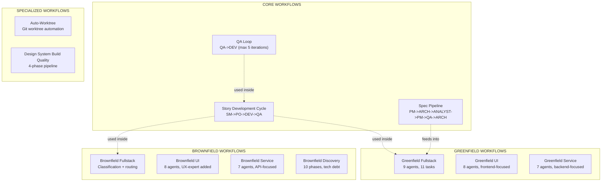
```mermaid
graph TD
    subgraph "CORE WORKFLOWS"
        SDC["Story Development Cycle<br/>SM->PO->DEV->QA"]
        SP["Spec Pipeline<br/>PM->ARCH->ANALYST->PM->QA->ARCH"]
        QAL["QA Loop<br/>QA->DEV (max 5 iterations)"]
    end

    subgraph "GREENFIELD WORKFLOWS"
        GF["Greenfield Fullstack<br/>9 agents, 11 tasks"]
        GU["Greenfield UI<br/>8 agents, frontend-focused"]
        GS["Greenfield Service<br/>7 agents, backend-focused"]
    end

    subgraph "BROWNFIELD WORKFLOWS"
        BF["Brownfield Fullstack<br/>Classification + routing"]
        BU["Brownfield UI<br/>8 agents, UX-expert added"]
        BS["Brownfield Service<br/>7 agents, API-focused"]
        BD["Brownfield Discovery<br/>10 phases, tech debt"]
    end

    subgraph "SPECIALIZED WORKFLOWS"
        AW["Auto-Worktree<br/>Git worktree automation"]
        DS["Design System Build Quality<br/>4-phase pipeline"]
    end

    SDC -.->|"used inside"| GF
    SDC -.->|"used inside"| BF
    QAL -.->|"used inside"| SDC
    SP -.->|"feeds into"| GF
```

### Workflow-Agent Participation Matrix

| Workflow | @aios-master | @analyst | @architect | @data-eng | @dev | @devops | @pm | @po | @qa | @sm | @ux-expert | @squad-creator |
|----------|:---:|:---:|:---:|:---:|:---:|:---:|:---:|:---:|:---:|:---:|:---:|:---:|
| Story Dev Cycle | - | - | - | - | X | - | - | X | X | X | - | - |
| Spec Pipeline | - | X | X | - | - | - | X | - | X | - | - | - |
| QA Loop | - | - | - | - | X | - | - | - | X | - | - | - |
| Greenfield Fullstack | - | X | X | - | X | X | X | X | X | X | X | - |
| Greenfield UI | - | X | X | - | X | X | X | X | X | X | X | - |
| Greenfield Service | - | X | X | - | X | X | X | X | X | X | - | - |
| Brownfield Fullstack | - | X | X | - | X | - | X | X | X | X | - | - |
| Brownfield UI | - | X | X | - | X | - | X | X | X | X | X | - |
| Brownfield Service | - | X | X | - | X | - | X | X | X | X | - | - |
| Brownfield Discovery | - | X | X | X | - | - | X | - | X | - | X | - |
| Auto-Worktree | - | - | - | - | X* | X | - | X* | - | - | - | - |
| Design System Quality | - | - | - | - | - | - | - | - | - | - | X | - |

*X\* = trigger only*

---

## 2. Task Registry - Complete Cross-Reference

### Master Task Table

Every task file referenced across all workflows and agents:

| # | Task File | Agents | Workflows Used In | Agent Command |
|---|-----------|--------|-------------------|---------------|
| 1 | `create-next-story.md` | @sm | SDC, GF, GU, GS, BF, BU, BS | `*draft` |
| 2 | `sm-create-next-story.md` | @sm | GF, GU, GS | `*draft` |
| 3 | `create-brownfield-story.md` | @sm, @pm | BF | `*draft` (SM), `*create-story` (PM) |
| 4 | `validate-next-story.md` | @po, @dev | SDC | `*validate-story-draft` |
| 5 | `dev-develop-story.md` | @dev | SDC, GF, GU, GS, BF, BU, BS | `*develop {story-id}` |
| 6 | `apply-qa-fixes.md` | @dev | QAL, GF, GU, GS, BU, BS | `*apply-qa-fixes` |
| 7 | `qa-gate.md` | @qa | SDC | `*gate {story}` |
| 8 | `qa-review-story.md` | @qa | QAL, GF, GU, GS, BU, BS | `*review {story}` |
| 9 | `qa-create-fix-request.md` | @qa | QAL | `*create-fix-request {story}` |
| 10 | `create-doc.md` | @pm, @architect, @ux-expert, @analyst, @aios-master | GF, GU, GS, BU, BS, SP | `*create-prd`, `*create-*-architecture`, etc. |
| 11 | `shard-doc.md` | @po, @pm, @aios-master | GF, GU, GS, BF, BU, BS | `*shard-doc` |
| 12 | `execute-checklist.md` | @po, @architect, @data-eng, @aios-master | GF, GU, GS, BF, BU, BS | `*execute-checklist-po`, `*execute-checklist` |
| 13 | `document-project.md` | @architect, @analyst, @aios-master | BD, BF, BU, BS | `*document-project` |
| 14 | `correct-course.md` | @pm, @sm, @aios-master | (any - course correction) | `*correct-course` |
| 15 | `environment-bootstrap.md` | @devops | GF, GU, GS | `*environment-bootstrap` |
| 16 | `facilitate-brainstorming-session.md` | @analyst | GF, GU, GS | `*brainstorm {topic}` |
| 17 | `create-deep-research-prompt.md` | @analyst, @architect, @data-eng, @aios-master | GF, GU, GS | `*research {topic}` |
| 18 | `generate-ai-frontend-prompt.md` | @ux-expert | GF, GU | `*generate-ui-prompt` |
| 19 | `spec-gather-requirements.md` | @pm | SP | (Phase 1) |
| 20 | `spec-assess-complexity.md` | @architect | SP | `*assess-complexity` |
| 21 | `spec-research-dependencies.md` | @analyst | SP | (Phase 3) |
| 22 | `spec-write-spec.md` | @pm | SP | (Phase 4) |
| 23 | `spec-critique.md` | @qa | SP | (Phase 5) |
| 24 | `plan-create-implementation.md` | @architect | SP | (Phase 6) |
| 25 | `brownfield-create-epic.md` | @pm | BF, BD | `*create-epic` |
| 26 | `brownfield-create-story.md` | @pm | BF, BD | `*create-story` |
| 27 | `db-schema-audit.md` | @data-eng | BD | `*db-schema-audit` (implied) |
| 28 | `security-audit.md` | @data-eng, @devops | BD | `*security-audit` |
| 29 | `create-worktree.md` | @devops | AW | `*create-worktree` |
| 30 | `list-worktrees.md` | @devops | AW | `*list-worktrees` |
| 31 | `remove-worktree.md` | @devops | AW | `*remove-worktree` |
| 32 | `merge-worktree.md` | @devops | AW | `*merge-worktree` |
| 33 | `build-component.md` | @ux-expert | DS | `*build {component}` |
| 34 | `generate-documentation.md` | @ux-expert | DS | `*document` |
| 35 | `accessibility-wcag-checklist.md` | @ux-expert | DS | `*a11y-check` |
| 36 | `calculate-roi.md` | @ux-expert, @analyst | DS | `*calculate-roi` |
| 37 | `github-devops-pre-push-quality-gate.md` | @devops | (push flow) | `*push` |
| 38 | `github-devops-version-management.md` | @devops | (release flow) | `*version-check` |
| 39 | `github-devops-repository-cleanup.md` | @devops | (maintenance) | `*cleanup` |
| 40 | `ci-cd-configuration.md` | @devops | (CI/CD) | `*ci-cd` |
| 41 | `release-management.md` | @devops | (release flow) | `*release` |
| 42 | `search-mcp.md` | @devops | (MCP mgmt) | `*search-mcp` |
| 43 | `add-mcp.md` | @devops | (MCP mgmt) | `*add-mcp` |
| 44 | `setup-mcp-docker.md` | @devops | (MCP mgmt) | `*setup-mcp-docker` |
| 45 | `setup-github.md` | @devops | (setup) | `*setup-github` |
| 46 | `architect-analyze-impact.md` | @architect | (on-demand) | `*analyze-impact` |
| 47 | `collaborative-edit.md` | @architect, @sm | (on-demand) | (internal) |
| 48 | `qa-test-design.md` | @qa | (on-demand) | `*test-design {story}` |
| 49 | `qa-risk-profile.md` | @qa | (on-demand) | `*risk-profile {story}` |
| 50 | `qa-nfr-assess.md` | @qa | (on-demand) | `*nfr-assess {story}` |
| 51 | `qa-trace-requirements.md` | @qa | (on-demand) | `*trace {story}` |
| 52 | `qa-generate-tests.md` | @qa | (on-demand) | `*generate-tests` |
| 53 | `qa-run-tests.md` | @qa | (on-demand) | `*run-tests` |
| 54 | `qa-backlog-add-followup.md` | @qa | (on-demand) | `*backlog-add` |
| 55 | `dev-improve-code-quality.md` | @dev | (on-demand) | `*improve-code-quality` |
| 56 | `dev-optimize-performance.md` | @dev | (on-demand) | `*optimize-performance` |
| 57 | `dev-suggest-refactoring.md` | @dev | (on-demand) | `*suggest-refactoring` |
| 58 | `dev-backlog-debt.md` | @dev | (on-demand) | `*backlog-debt` |
| 59 | `sync-documentation.md` | @dev | (on-demand) | `*sync-documentation` |
| 60 | `po-manage-story-backlog.md` | @po, @qa | (backlog mgmt) | `*backlog-*` |
| 61 | `init-project-status.md` | @sm | (init) | (internal) |

### Tasks in Agent Dependencies but NOT in Any Workflow

These tasks are available as on-demand commands but are not called by any workflow:

| Task | Agent | Command | Status |
|------|-------|---------|--------|
| `architect-analyze-impact.md` | @architect | `*analyze-impact` | On-demand only |
| `qa-test-design.md` | @qa | `*test-design` | On-demand only |
| `qa-risk-profile.md` | @qa | `*risk-profile` | On-demand only |
| `qa-nfr-assess.md` | @qa | `*nfr-assess` | On-demand only |
| `qa-trace-requirements.md` | @qa | `*trace` | On-demand only |
| `qa-generate-tests.md` | @qa | `*generate-tests` | On-demand only |
| `qa-run-tests.md` | @qa | `*run-tests` | On-demand only |
| `qa-backlog-add-followup.md` | @qa | `*backlog-add` | On-demand only |
| `dev-improve-code-quality.md` | @dev | `*improve-code-quality` | On-demand only |
| `dev-optimize-performance.md` | @dev | `*optimize-performance` | On-demand only |
| `dev-suggest-refactoring.md` | @dev | `*suggest-refactoring` | On-demand only |
| `dev-backlog-debt.md` | @dev | `*backlog-debt` | On-demand only |
| `sync-documentation.md` | @dev | `*sync-documentation` | On-demand only |
| `po-manage-story-backlog.md` | @po | `*backlog-*` | On-demand only |
| `db-domain-modeling.md` | @data-eng | `*model-domain` | On-demand only |
| `setup-database.md` | @data-eng | `*setup-database` | On-demand only |
| `db-bootstrap.md` | @data-eng | `*bootstrap` | On-demand only |
| `db-env-check.md` | @data-eng | `*env-check` | On-demand only |
| `db-apply-migration.md` | @data-eng | `*apply-migration` | On-demand only |
| `db-dry-run.md` | @data-eng | `*dry-run` | On-demand only |
| `db-seed.md` | @data-eng | `*seed` | On-demand only |
| `db-snapshot.md` | @data-eng | `*snapshot` | On-demand only |
| `db-rollback.md` | @data-eng | `*rollback` | On-demand only |
| `db-smoke-test.md` | @data-eng | `*smoke-test` | On-demand only |
| `analyze-performance.md` | @data-eng | `*analyze-performance` | On-demand only |
| `db-policy-apply.md` | @data-eng | `*policy-apply` | On-demand only |
| `test-as-user.md` | @data-eng | `*test-as-user` | On-demand only |
| `db-verify-order.md` | @data-eng | `*verify-order` | On-demand only |
| `db-load-csv.md` | @data-eng | `*load-csv` | On-demand only |
| `db-run-sql.md` | @data-eng | `*run-sql` | On-demand only |
| All `squad-creator-*.md` tasks | @squad-creator | `*create-squad`, etc. | On-demand only |
| All UX Phase 2-4 tasks | @ux-expert | `*audit`, `*tokenize`, etc. | On-demand only |

> **Note:** On-demand tasks are NOT broken. They are utility commands agents can run outside formal workflows. This is by design.

---

## 3. Agent Command Registry

### Complete Command-to-Task-to-Workflow Map

#### @sm (River) - Scrum Master

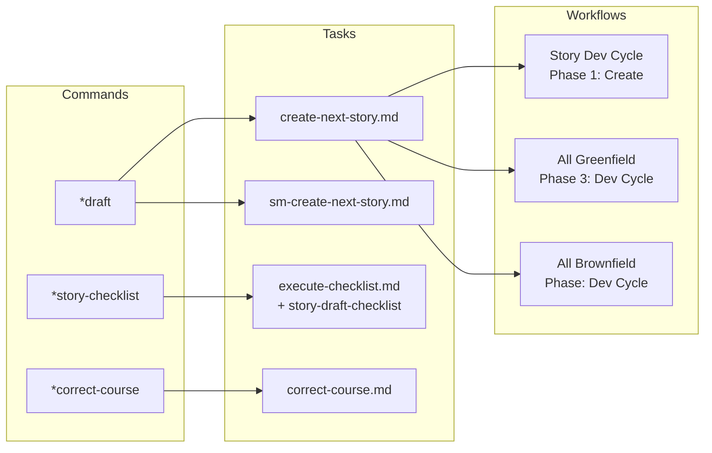
```mermaid
graph LR
    subgraph "Commands"
        C1["*draft"]
        C2["*story-checklist"]
        C3["*correct-course"]
    end

    subgraph "Tasks"
        T1["create-next-story.md"]
        T1b["sm-create-next-story.md"]
        T2["execute-checklist.md<br/>+ story-draft-checklist"]
        T3["correct-course.md"]
    end

    subgraph "Workflows"
        W1["Story Dev Cycle<br/>Phase 1: Create"]
        W2["All Greenfield<br/>Phase 3: Dev Cycle"]
        W3["All Brownfield<br/>Phase: Dev Cycle"]
    end

    C1 --> T1
    C1 --> T1b
    C2 --> T2
    C3 --> T3
    T1 --> W1
    T1 --> W2
    T1 --> W3
```

**Sequence: Before/After `*draft`**
```
BEFORE: @po validates artifacts + shard-doc completes → docs/prd/ and docs/architecture/ ready
DURING: @sm *draft → reads sharded docs → creates story.md (status: Draft)
AFTER:  @dev *develop {story-id} OR @analyst/@pm review story (optional)
```

---

#### @po (Pax) - Product Owner

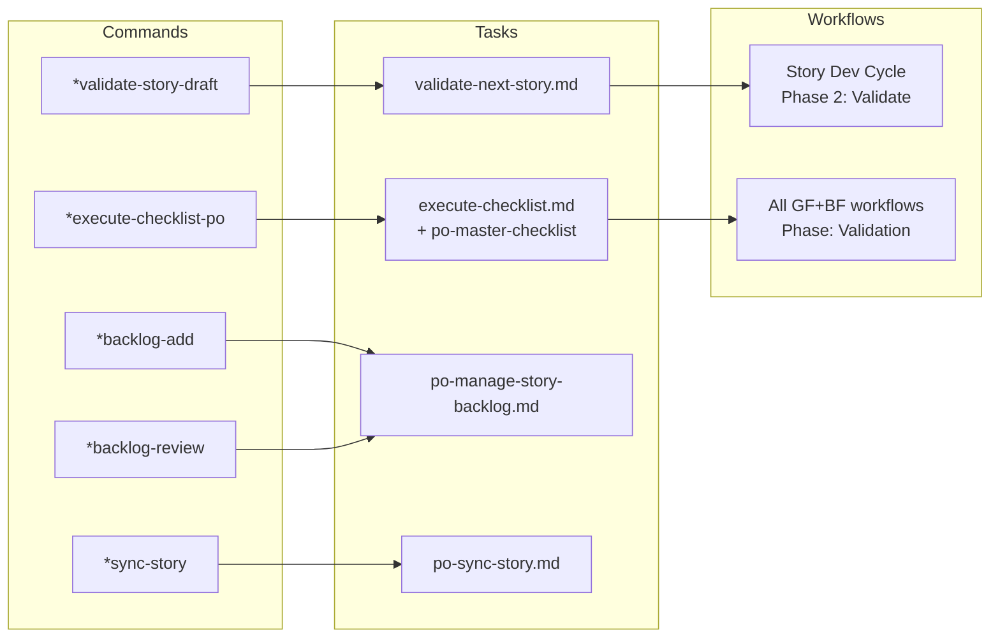
```mermaid
graph LR
    subgraph "Commands"
        C1["*validate-story-draft"]
        C2["*execute-checklist-po"]
        C3["*backlog-add"]
        C4["*backlog-review"]
        C5["*sync-story"]
    end

    subgraph "Tasks"
        T1["validate-next-story.md"]
        T2["execute-checklist.md<br/>+ po-master-checklist"]
        T3["po-manage-story-backlog.md"]
        T4["po-sync-story.md"]
    end

    subgraph "Workflows"
        W1["Story Dev Cycle<br/>Phase 2: Validate"]
        W2["All GF+BF workflows<br/>Phase: Validation"]
    end

    C1 --> T1
    C2 --> T2
    C3 --> T3
    C4 --> T3
    C5 --> T4
    T1 --> W1
    T2 --> W2
```

**Sequence: Before/After `*execute-checklist-po`**
```
BEFORE: @pm creates prd.md + @architect creates architecture.md → both in docs/
DURING: @po *execute-checklist-po → validates all artifacts against po-master-checklist
AFTER:  If issues: return to relevant agent for fixes → re-validate
        If OK: @po *shard-doc → fragment documents for development
```

---

#### @dev (Dex) - Full Stack Developer

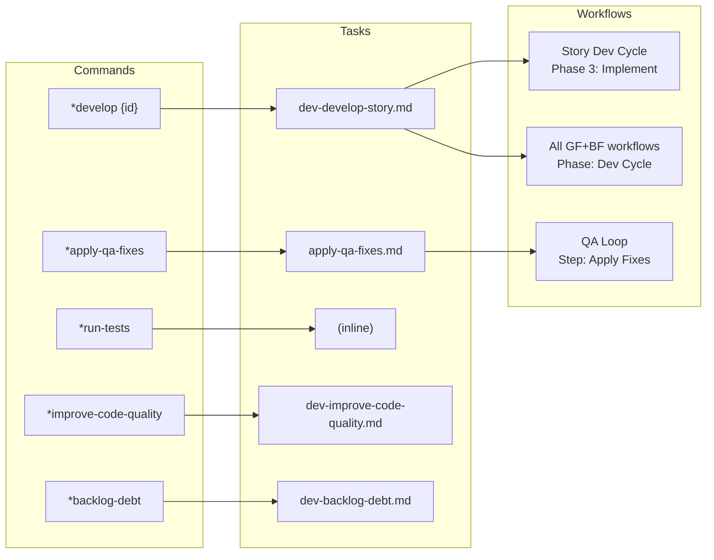
```mermaid
graph LR
    subgraph "Commands"
        C1["*develop {id}"]
        C2["*apply-qa-fixes"]
        C3["*run-tests"]
        C4["*improve-code-quality"]
        C5["*backlog-debt"]
    end

    subgraph "Tasks"
        T1["dev-develop-story.md"]
        T2["apply-qa-fixes.md"]
        T3["(inline)"]
        T4["dev-improve-code-quality.md"]
        T5["dev-backlog-debt.md"]
    end

    subgraph "Workflows"
        W1["Story Dev Cycle<br/>Phase 3: Implement"]
        W2["QA Loop<br/>Step: Apply Fixes"]
        W3["All GF+BF workflows<br/>Phase: Dev Cycle"]
    end

    C1 --> T1
    C2 --> T2
    C3 --> T3
    C4 --> T4
    C5 --> T5
    T1 --> W1
    T1 --> W3
    T2 --> W2
```

**Sequence: Before/After `*develop {story-id}`**
```
BEFORE: Story exists with status Approved/Ready (created by @sm, validated by @po)
DURING: @dev *develop {story-id} → reads story → implements tasks → updates File List → marks "Review"
AFTER:  @qa *review {story-id} OR story goes directly to Done (if QA skipped)
```

**Execution modes for `*develop`:**
| Mode | Flag | Prompts | Use Case |
|------|------|---------|----------|
| YOLO | `*develop {id} yolo` | 0-1 | Autonomous, fast |
| Interactive | `*develop {id} interactive` | 5-10 | Default, checkpoints |
| Pre-Flight | `*develop {id} preflight` | 10-15 | Full planning first |

---

#### @qa (Quinn) - Test Architect

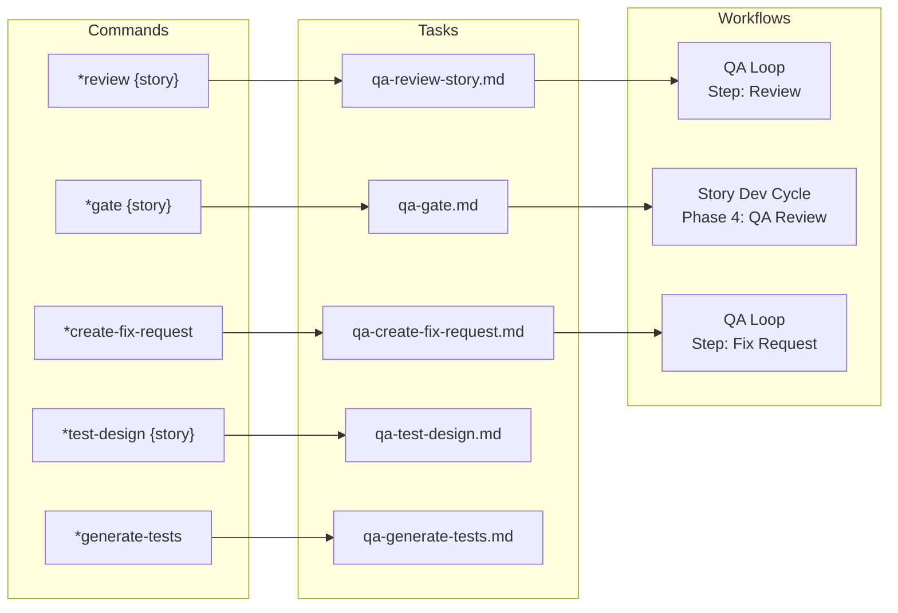
```mermaid
graph LR
    subgraph "Commands"
        C1["*review {story}"]
        C2["*gate {story}"]
        C3["*create-fix-request"]
        C4["*test-design {story}"]
        C5["*generate-tests"]
    end

    subgraph "Tasks"
        T1["qa-review-story.md"]
        T2["qa-gate.md"]
        T3["qa-create-fix-request.md"]
        T4["qa-test-design.md"]
        T5["qa-generate-tests.md"]
    end

    subgraph "Workflows"
        W1["QA Loop<br/>Step: Review"]
        W2["Story Dev Cycle<br/>Phase 4: QA Review"]
        W3["QA Loop<br/>Step: Fix Request"]
    end

    C1 --> T1
    C2 --> T2
    C3 --> T3
    C4 --> T4
    C5 --> T5
    T1 --> W1
    T2 --> W2
    T3 --> W3
```

**Sequence: Before/After `*review {story}`**
```
BEFORE: @dev completes implementation → story status = "Review"
DURING: @qa *review {story} → reads code + story → identifies issues → may fix minor items
AFTER:  If PASS: story status → Done
        If FAIL: @qa *create-fix-request → @dev *apply-qa-fixes → back to @qa *review
        (Max 5 iterations in QA Loop, then escalation)
```

---

#### @pm (Morgan) - Product Manager

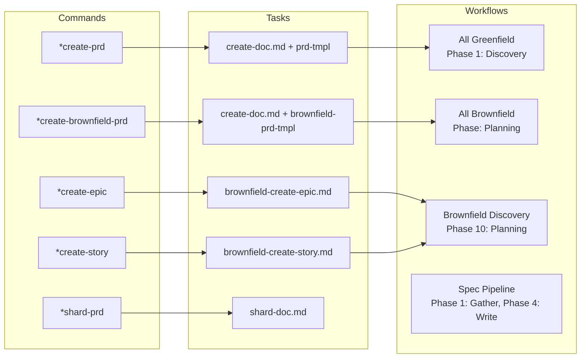
```mermaid
graph LR
    subgraph "Commands"
        C1["*create-prd"]
        C2["*create-brownfield-prd"]
        C3["*create-epic"]
        C4["*create-story"]
        C5["*shard-prd"]
    end

    subgraph "Tasks"
        T1["create-doc.md + prd-tmpl"]
        T2["create-doc.md + brownfield-prd-tmpl"]
        T3["brownfield-create-epic.md"]
        T4["brownfield-create-story.md"]
        T5["shard-doc.md"]
    end

    subgraph "Workflows"
        W1["All Greenfield<br/>Phase 1: Discovery"]
        W2["All Brownfield<br/>Phase: Planning"]
        W3["Brownfield Discovery<br/>Phase 10: Planning"]
        W4["Spec Pipeline<br/>Phase 1: Gather, Phase 4: Write"]
    end

    C1 --> T1 --> W1
    C2 --> T2 --> W2
    C3 --> T3 --> W3
    C4 --> T4 --> W3
    C5 --> T5
```

---

#### @architect (Aria) - Holistic System Architect

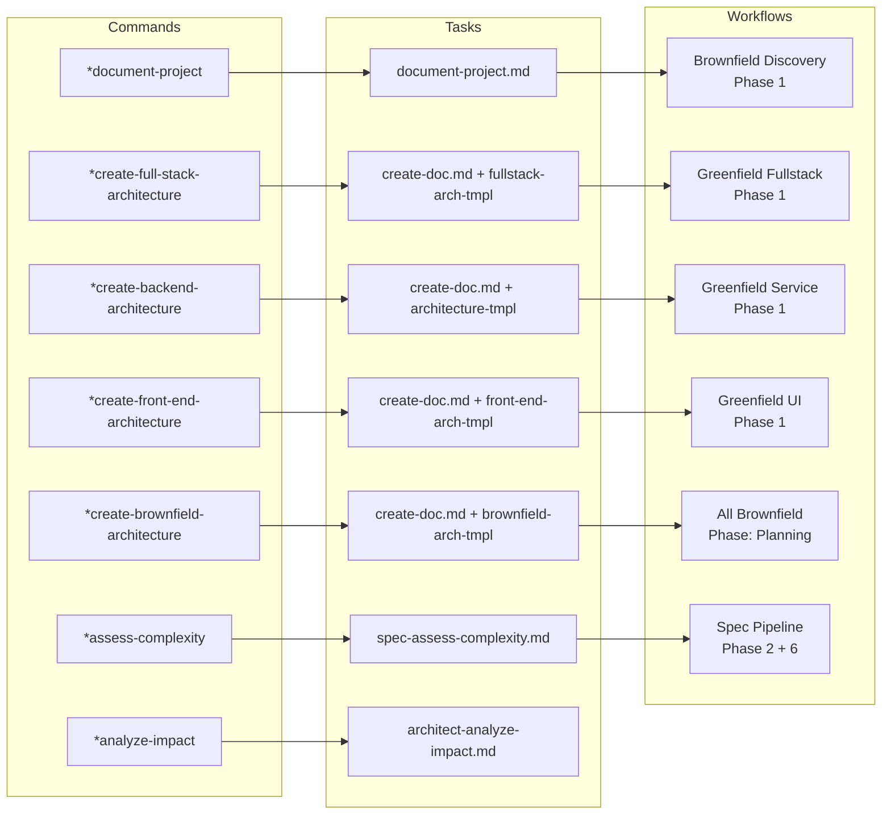
```mermaid
graph LR
    subgraph "Commands"
        C1["*document-project"]
        C2["*create-full-stack-architecture"]
        C3["*create-backend-architecture"]
        C4["*create-front-end-architecture"]
        C5["*create-brownfield-architecture"]
        C6["*assess-complexity"]
        C7["*analyze-impact"]
    end

    subgraph "Tasks"
        T1["document-project.md"]
        T2["create-doc.md + fullstack-arch-tmpl"]
        T3["create-doc.md + architecture-tmpl"]
        T4["create-doc.md + front-end-arch-tmpl"]
        T5["create-doc.md + brownfield-arch-tmpl"]
        T6["spec-assess-complexity.md"]
        T7["architect-analyze-impact.md"]
    end

    subgraph "Workflows"
        W1["Brownfield Discovery<br/>Phase 1"]
        W2["Greenfield Fullstack<br/>Phase 1"]
        W3["Greenfield Service<br/>Phase 1"]
        W4["Greenfield UI<br/>Phase 1"]
        W5["All Brownfield<br/>Phase: Planning"]
        W6["Spec Pipeline<br/>Phase 2 + 6"]
    end

    C1 --> T1
    C2 --> T2 --> W2
    C3 --> T3 --> W3
    C4 --> T4 --> W4
    C5 --> T5 --> W5
    C6 --> T6 --> W6
    C7 --> T7
    T1 --> W1
```

---

#### @analyst (Atlas) - Business Analyst

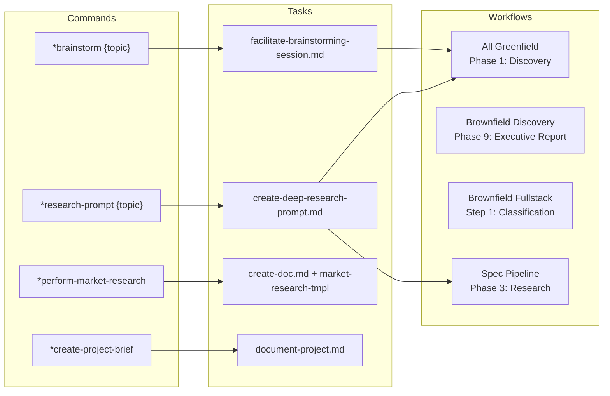
```mermaid
graph LR
    subgraph "Commands"
        C1["*brainstorm {topic}"]
        C2["*research-prompt {topic}"]
        C3["*perform-market-research"]
        C4["*create-project-brief"]
    end

    subgraph "Tasks"
        T1["facilitate-brainstorming-session.md"]
        T2["create-deep-research-prompt.md"]
        T3["create-doc.md + market-research-tmpl"]
        T4["document-project.md"]
    end

    subgraph "Workflows"
        W1["All Greenfield<br/>Phase 1: Discovery"]
        W2["Brownfield Discovery<br/>Phase 9: Executive Report"]
        W3["Brownfield Fullstack<br/>Step 1: Classification"]
        W4["Spec Pipeline<br/>Phase 3: Research"]
    end

    C1 --> T1 --> W1
    C2 --> T2 --> W1
    C3 --> T3
    C4 --> T4
    T2 --> W4
```

---

#### @data-engineer (Dara) - Database Architect

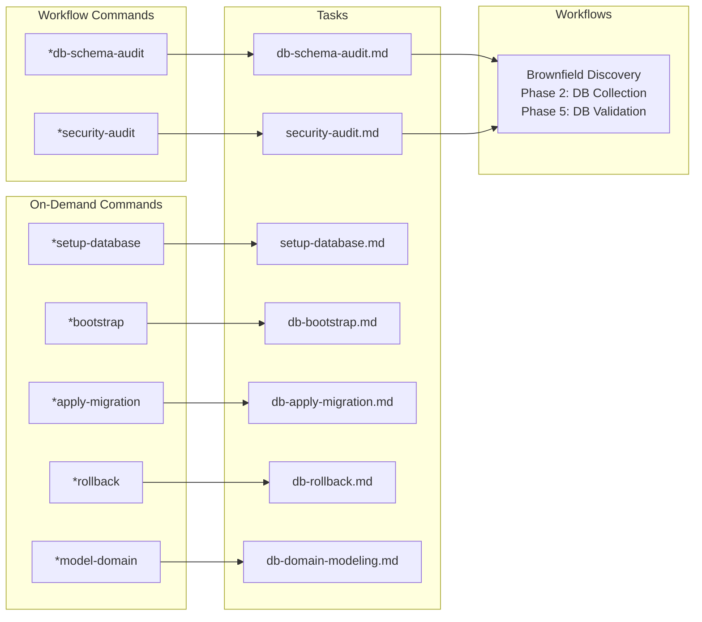
```mermaid
graph LR
    subgraph "Workflow Commands"
        C1["*db-schema-audit"]
        C2["*security-audit"]
    end

    subgraph "On-Demand Commands"
        C3["*setup-database"]
        C4["*bootstrap"]
        C5["*apply-migration"]
        C6["*rollback"]
        C7["*model-domain"]
    end

    subgraph "Tasks"
        T1["db-schema-audit.md"]
        T2["security-audit.md"]
        T3["setup-database.md"]
        T4["db-bootstrap.md"]
        T5["db-apply-migration.md"]
        T6["db-rollback.md"]
        T7["db-domain-modeling.md"]
    end

    subgraph "Workflows"
        W1["Brownfield Discovery<br/>Phase 2: DB Collection<br/>Phase 5: DB Validation"]
    end

    C1 --> T1 --> W1
    C2 --> T2 --> W1
    C3 --> T3
    C4 --> T4
    C5 --> T5
    C6 --> T6
    C7 --> T7
```

---

#### @ux-design-expert (Uma) - UX/UI Designer

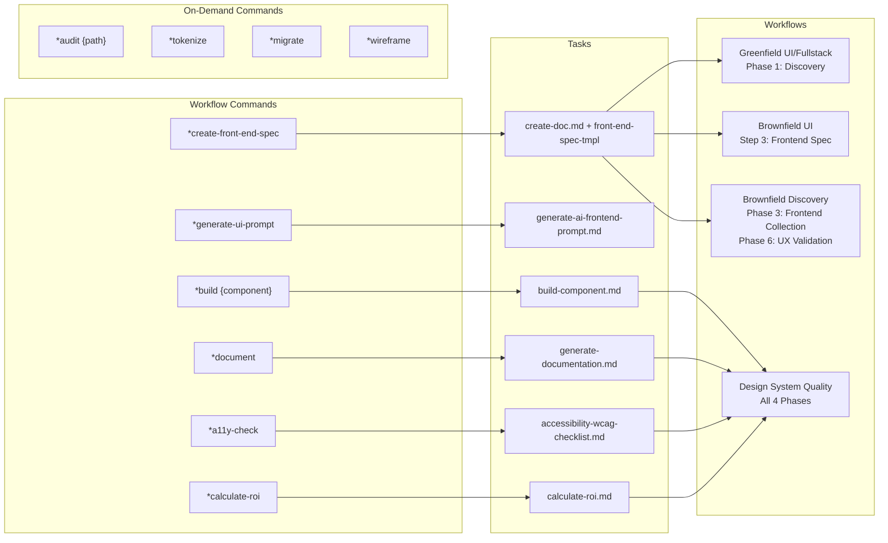
```mermaid
graph LR
    subgraph "Workflow Commands"
        C1["*create-front-end-spec"]
        C2["*generate-ui-prompt"]
        C3["*build {component}"]
        C4["*document"]
        C5["*a11y-check"]
        C6["*calculate-roi"]
    end

    subgraph "On-Demand Commands"
        C7["*audit {path}"]
        C8["*tokenize"]
        C9["*migrate"]
        C10["*wireframe"]
    end

    subgraph "Tasks"
        T1["create-doc.md + front-end-spec-tmpl"]
        T2["generate-ai-frontend-prompt.md"]
        T3["build-component.md"]
        T4["generate-documentation.md"]
        T5["accessibility-wcag-checklist.md"]
        T6["calculate-roi.md"]
    end

    subgraph "Workflows"
        W1["Greenfield UI/Fullstack<br/>Phase 1: Discovery"]
        W2["Brownfield UI<br/>Step 3: Frontend Spec"]
        W3["Brownfield Discovery<br/>Phase 3: Frontend Collection<br/>Phase 6: UX Validation"]
        W4["Design System Quality<br/>All 4 Phases"]
    end

    C1 --> T1
    C2 --> T2
    C3 --> T3
    C4 --> T4
    C5 --> T5
    C6 --> T6
    T1 --> W1
    T1 --> W2
    T1 --> W3
    T3 --> W4
    T4 --> W4
    T5 --> W4
    T6 --> W4
```

---

#### @devops (Gage) - DevOps Specialist

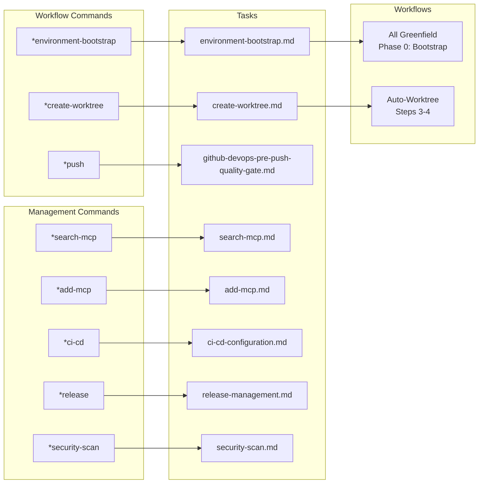
```mermaid
graph LR
    subgraph "Workflow Commands"
        C1["*environment-bootstrap"]
        C2["*create-worktree"]
        C3["*push"]
    end

    subgraph "Management Commands"
        C4["*search-mcp"]
        C5["*add-mcp"]
        C6["*ci-cd"]
        C7["*release"]
        C8["*security-scan"]
    end

    subgraph "Tasks"
        T1["environment-bootstrap.md"]
        T2["create-worktree.md"]
        T3["github-devops-pre-push-quality-gate.md"]
        T4["search-mcp.md"]
        T5["add-mcp.md"]
        T6["ci-cd-configuration.md"]
        T7["release-management.md"]
        T8["security-scan.md"]
    end

    subgraph "Workflows"
        W1["All Greenfield<br/>Phase 0: Bootstrap"]
        W2["Auto-Worktree<br/>Steps 3-4"]
    end

    C1 --> T1 --> W1
    C2 --> T2 --> W2
    C3 --> T3
    C4 --> T4
    C5 --> T5
    C6 --> T6
    C7 --> T7
    C8 --> T8
```

---

#### @squad-creator (Craft)

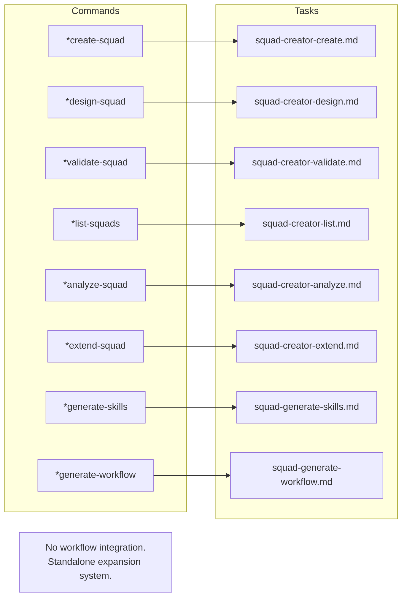
```mermaid
graph LR
    subgraph "Commands"
        C1["*create-squad"]
        C2["*design-squad"]
        C3["*validate-squad"]
        C4["*list-squads"]
        C5["*analyze-squad"]
        C6["*extend-squad"]
        C7["*generate-skills"]
        C8["*generate-workflow"]
    end

    subgraph "Tasks"
        T1["squad-creator-create.md"]
        T2["squad-creator-design.md"]
        T3["squad-creator-validate.md"]
        T4["squad-creator-list.md"]
        T5["squad-creator-analyze.md"]
        T6["squad-creator-extend.md"]
        T7["squad-generate-skills.md"]
        T8["squad-generate-workflow.md"]
    end

    C1 --> T1
    C2 --> T2
    C3 --> T3
    C4 --> T4
    C5 --> T5
    C6 --> T6
    C7 --> T7
    C8 --> T8

    NOTE["No workflow integration.<br/>Standalone expansion system."]
```

---

## 4. Workflow Detail Diagrams

### 4.1 Story Development Cycle (Core)

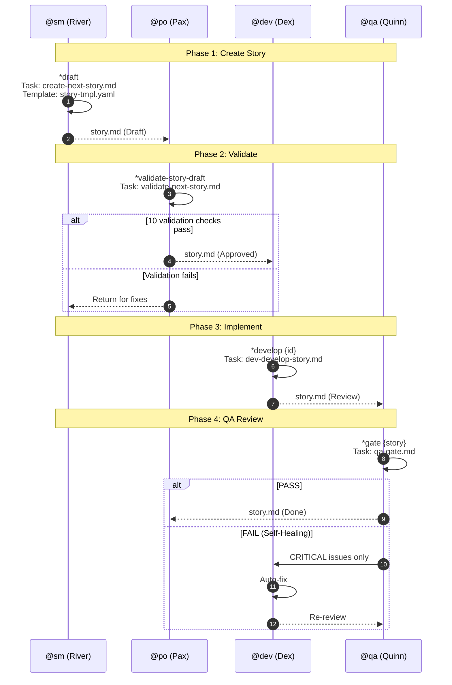
```mermaid
sequenceDiagram
    autonumber
    participant SM as @sm (River)
    participant PO as @po (Pax)
    participant DEV as @dev (Dex)
    participant QA as @qa (Quinn)

    Note over SM,QA: Phase 1: Create Story
    SM->>SM: *draft<br/>Task: create-next-story.md<br/>Template: story-tmpl.yaml
    SM-->>PO: story.md (Draft)

    Note over SM,QA: Phase 2: Validate
    PO->>PO: *validate-story-draft<br/>Task: validate-next-story.md
    alt 10 validation checks pass
        PO-->>DEV: story.md (Approved)
    else Validation fails
        PO-->>SM: Return for fixes
    end

    Note over SM,QA: Phase 3: Implement
    DEV->>DEV: *develop {id}<br/>Task: dev-develop-story.md
    DEV-->>QA: story.md (Review)

    Note over SM,QA: Phase 4: QA Review
    QA->>QA: *gate {story}<br/>Task: qa-gate.md
    alt PASS
        QA-->>PO: story.md (Done)
    else FAIL (Self-Healing)
        QA->>DEV: CRITICAL issues only
        DEV->>DEV: Auto-fix
        DEV-->>QA: Re-review
    end
```

### 4.2 Spec Pipeline

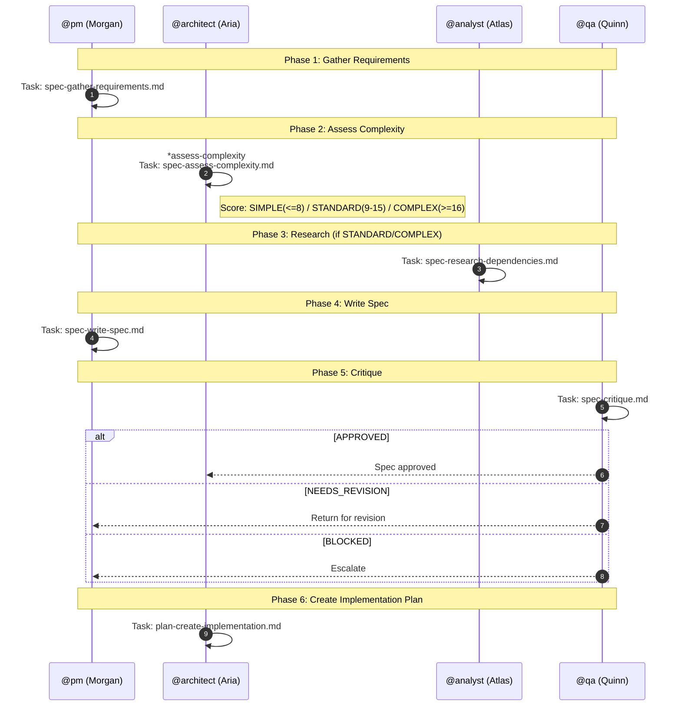
```mermaid
sequenceDiagram
    autonumber
    participant PM as @pm (Morgan)
    participant ARCH as @architect (Aria)
    participant AN as @analyst (Atlas)
    participant QA as @qa (Quinn)

    Note over PM,QA: Phase 1: Gather Requirements
    PM->>PM: Task: spec-gather-requirements.md

    Note over PM,QA: Phase 2: Assess Complexity
    ARCH->>ARCH: *assess-complexity<br/>Task: spec-assess-complexity.md
    Note right of ARCH: Score: SIMPLE(<=8) / STANDARD(9-15) / COMPLEX(>=16)

    Note over PM,QA: Phase 3: Research (if STANDARD/COMPLEX)
    AN->>AN: Task: spec-research-dependencies.md

    Note over PM,QA: Phase 4: Write Spec
    PM->>PM: Task: spec-write-spec.md

    Note over PM,QA: Phase 5: Critique
    QA->>QA: Task: spec-critique.md
    alt APPROVED
        QA-->>ARCH: Spec approved
    else NEEDS_REVISION
        QA-->>PM: Return for revision
    else BLOCKED
        QA-->>PM: Escalate
    end

    Note over PM,QA: Phase 6: Create Implementation Plan
    ARCH->>ARCH: Task: plan-create-implementation.md
```

### 4.3 QA Loop

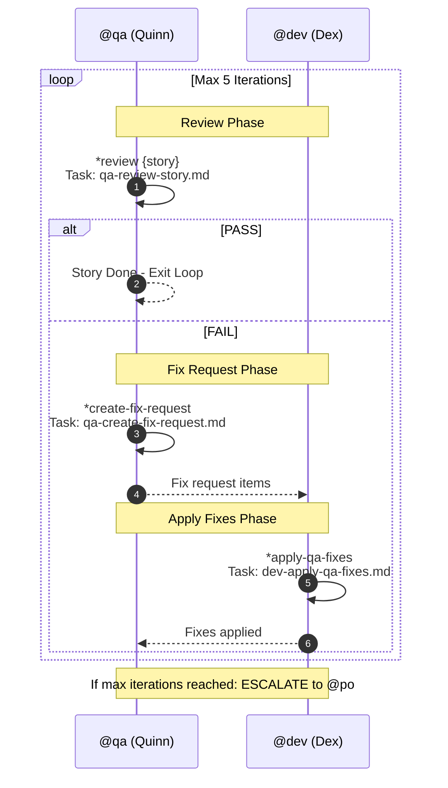
```mermaid
sequenceDiagram
    autonumber
    participant QA as @qa (Quinn)
    participant DEV as @dev (Dex)

    loop Max 5 Iterations
        Note over QA,DEV: Review Phase
        QA->>QA: *review {story}<br/>Task: qa-review-story.md

        alt PASS
            QA-->>QA: Story Done - Exit Loop
        else FAIL
            Note over QA,DEV: Fix Request Phase
            QA->>QA: *create-fix-request<br/>Task: qa-create-fix-request.md
            QA-->>DEV: Fix request items

            Note over QA,DEV: Apply Fixes Phase
            DEV->>DEV: *apply-qa-fixes<br/>Task: dev-apply-qa-fixes.md
            DEV-->>QA: Fixes applied
        end
    end

    Note over QA,DEV: If max iterations reached: ESCALATE to @po
```

### 4.4 Greenfield Fullstack (Complete)

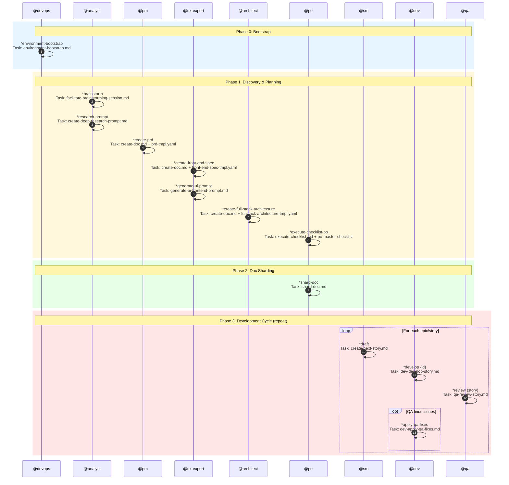
```mermaid
sequenceDiagram
    autonumber
    participant DEVOPS as @devops
    participant AN as @analyst
    participant PM as @pm
    participant UX as @ux-expert
    participant ARCH as @architect
    participant PO as @po
    participant SM as @sm
    participant DEV as @dev
    participant QA as @qa

    rect rgb(230, 245, 255)
        Note over DEVOPS,QA: Phase 0: Bootstrap
        DEVOPS->>DEVOPS: *environment-bootstrap<br/>Task: environment-bootstrap.md
    end

    rect rgb(255, 248, 220)
        Note over DEVOPS,QA: Phase 1: Discovery & Planning
        AN->>AN: *brainstorm<br/>Task: facilitate-brainstorming-session.md
        AN->>AN: *research-prompt<br/>Task: create-deep-research-prompt.md
        PM->>PM: *create-prd<br/>Task: create-doc.md + prd-tmpl.yaml
        UX->>UX: *create-front-end-spec<br/>Task: create-doc.md + front-end-spec-tmpl.yaml
        UX->>UX: *generate-ui-prompt<br/>Task: generate-ai-frontend-prompt.md
        ARCH->>ARCH: *create-full-stack-architecture<br/>Task: create-doc.md + fullstack-architecture-tmpl.yaml
        PO->>PO: *execute-checklist-po<br/>Task: execute-checklist.md + po-master-checklist
    end

    rect rgb(230, 255, 230)
        Note over DEVOPS,QA: Phase 2: Doc Sharding
        PO->>PO: *shard-doc<br/>Task: shard-doc.md
    end

    rect rgb(255, 230, 230)
        Note over DEVOPS,QA: Phase 3: Development Cycle (repeat)
        loop For each epic/story
            SM->>SM: *draft<br/>Task: create-next-story.md
            DEV->>DEV: *develop {id}<br/>Task: dev-develop-story.md
            QA->>QA: *review {story}<br/>Task: qa-review-story.md
            opt QA finds issues
                DEV->>DEV: *apply-qa-fixes<br/>Task: dev-apply-qa-fixes.md
            end
        end
    end
```

### 4.5 Brownfield Fullstack (with Classification)

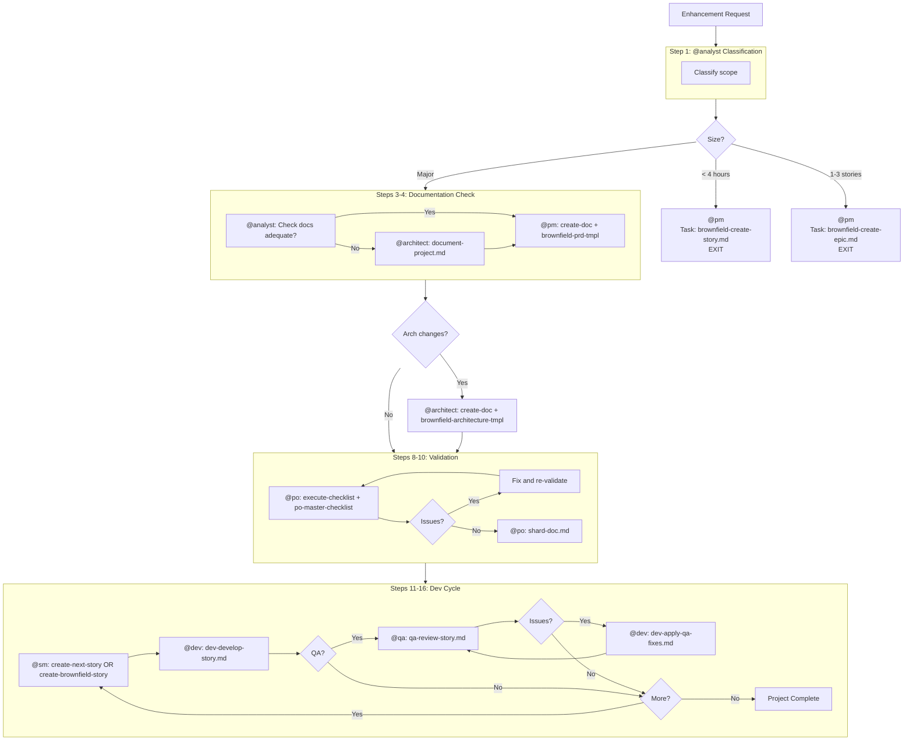
```mermaid
flowchart TD
    START[Enhancement Request] --> CLASSIFY

    subgraph CLASSIFY["Step 1: @analyst Classification"]
        A1["Classify scope"]
    end

    CLASSIFY --> ROUTE{Size?}

    ROUTE -->|"< 4 hours"| SINGLE["@pm<br/>Task: brownfield-create-story.md<br/>EXIT"]
    ROUTE -->|"1-3 stories"| SMALL["@pm<br/>Task: brownfield-create-epic.md<br/>EXIT"]
    ROUTE -->|"Major"| DOCS

    subgraph DOCS["Steps 3-4: Documentation Check"]
        D1["@analyst: Check docs adequate?"]
        D1 -->|No| D2["@architect: document-project.md"]
        D1 -->|Yes| D3["@pm: create-doc + brownfield-prd-tmpl"]
        D2 --> D3
    end

    DOCS --> ARCH_DECISION{Arch changes?}
    ARCH_DECISION -->|Yes| ARCH["@architect: create-doc + brownfield-architecture-tmpl"]
    ARCH_DECISION -->|No| PO_VALIDATE
    ARCH --> PO_VALIDATE

    subgraph PO_VALIDATE["Steps 8-10: Validation"]
        V1["@po: execute-checklist + po-master-checklist"]
        V1 --> V2{Issues?}
        V2 -->|Yes| V3[Fix and re-validate]
        V3 --> V1
        V2 -->|No| V4["@po: shard-doc.md"]
    end

    PO_VALIDATE --> DEV_CYCLE

    subgraph DEV_CYCLE["Steps 11-16: Dev Cycle"]
        S1["@sm: create-next-story OR create-brownfield-story"]
        S1 --> S2["@dev: dev-develop-story.md"]
        S2 --> S3{"QA?"}
        S3 -->|Yes| S4["@qa: qa-review-story.md"]
        S4 --> S5{Issues?}
        S5 -->|Yes| S6["@dev: dev-apply-qa-fixes.md"]
        S6 --> S4
        S5 -->|No| S7{More?}
        S3 -->|No| S7
        S7 -->|Yes| S1
        S7 -->|No| DONE
    end

    DONE[Project Complete]
```

### 4.6 Brownfield Discovery (10 Phases)

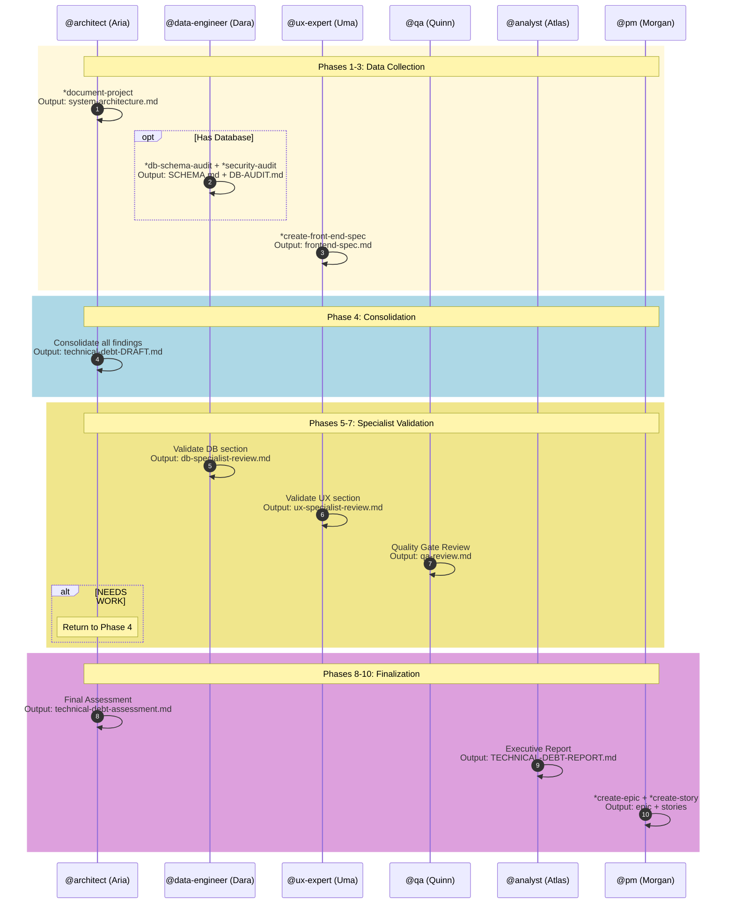
```mermaid
sequenceDiagram
    autonumber
    participant ARCH as @architect (Aria)
    participant DE as @data-engineer (Dara)
    participant UX as @ux-expert (Uma)
    participant QA as @qa (Quinn)
    participant AN as @analyst (Atlas)
    participant PM as @pm (Morgan)

    rect rgb(255, 248, 220)
        Note over ARCH,PM: Phases 1-3: Data Collection
        ARCH->>ARCH: *document-project<br/>Output: system-architecture.md
        opt Has Database
            DE->>DE: *db-schema-audit + *security-audit<br/>Output: SCHEMA.md + DB-AUDIT.md
        end
        UX->>UX: *create-front-end-spec<br/>Output: frontend-spec.md
    end

    rect rgb(173, 216, 230)
        Note over ARCH,PM: Phase 4: Consolidation
        ARCH->>ARCH: Consolidate all findings<br/>Output: technical-debt-DRAFT.md
    end

    rect rgb(240, 230, 140)
        Note over ARCH,PM: Phases 5-7: Specialist Validation
        DE->>DE: Validate DB section<br/>Output: db-specialist-review.md
        UX->>UX: Validate UX section<br/>Output: ux-specialist-review.md
        QA->>QA: Quality Gate Review<br/>Output: qa-review.md
        alt NEEDS WORK
            Note over ARCH: Return to Phase 4
        end
    end

    rect rgb(221, 160, 221)
        Note over ARCH,PM: Phases 8-10: Finalization
        ARCH->>ARCH: Final Assessment<br/>Output: technical-debt-assessment.md
        AN->>AN: Executive Report<br/>Output: TECHNICAL-DEBT-REPORT.md
        PM->>PM: *create-epic + *create-story<br/>Output: epic + stories
    end
```

### 4.7 Auto-Worktree

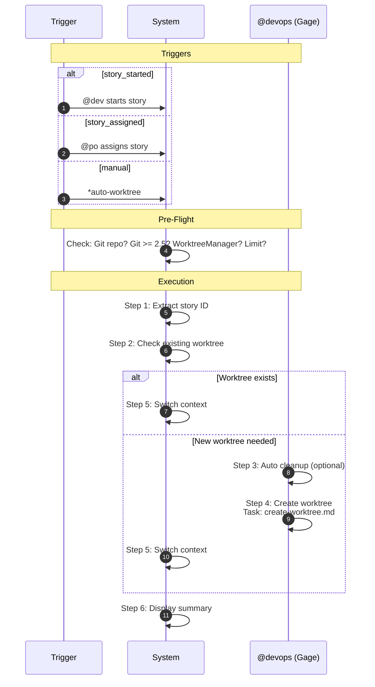
```mermaid
sequenceDiagram
    autonumber
    participant TRIGGER as Trigger
    participant SYS as System
    participant DEVOPS as @devops (Gage)

    Note over TRIGGER,DEVOPS: Triggers
    alt story_started
        TRIGGER->>SYS: @dev starts story
    else story_assigned
        TRIGGER->>SYS: @po assigns story
    else manual
        TRIGGER->>SYS: *auto-worktree
    end

    Note over TRIGGER,DEVOPS: Pre-Flight
    SYS->>SYS: Check: Git repo? Git >= 2.5? WorktreeManager? Limit?

    Note over TRIGGER,DEVOPS: Execution
    SYS->>SYS: Step 1: Extract story ID
    SYS->>SYS: Step 2: Check existing worktree
    alt Worktree exists
        SYS->>SYS: Step 5: Switch context
    else New worktree needed
        DEVOPS->>DEVOPS: Step 3: Auto cleanup (optional)
        DEVOPS->>DEVOPS: Step 4: Create worktree<br/>Task: create-worktree.md
        SYS->>SYS: Step 5: Switch context
    end
    SYS->>SYS: Step 6: Display summary
```

### 4.8 Design System Build Quality

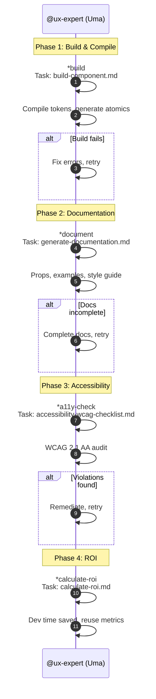
```mermaid
sequenceDiagram
    autonumber
    participant UX as @ux-expert (Uma)

    Note over UX: Phase 1: Build & Compile
    UX->>UX: *build<br/>Task: build-component.md
    UX->>UX: Compile tokens, generate atomics
    alt Build fails
        UX->>UX: Fix errors, retry
    end

    Note over UX: Phase 2: Documentation
    UX->>UX: *document<br/>Task: generate-documentation.md
    UX->>UX: Props, examples, style guide
    alt Docs incomplete
        UX->>UX: Complete docs, retry
    end

    Note over UX: Phase 3: Accessibility
    UX->>UX: *a11y-check<br/>Task: accessibility-wcag-checklist.md
    UX->>UX: WCAG 2.1 AA audit
    alt Violations found
        UX->>UX: Remediate, retry
    end

    Note over UX: Phase 4: ROI
    UX->>UX: *calculate-roi<br/>Task: calculate-roi.md
    UX->>UX: Dev time saved, reuse metrics
```

---

## 5. Orphan Analysis - Unused Tasks & Commands

### Tasks Referenced by Agents but NOT in ANY Workflow YAML

These are valid "utility" tasks, but have no formal workflow integration:

| Category | Tasks | Risk |
|----------|-------|------|
| **QA Analysis** | `qa-test-design.md`, `qa-risk-profile.md`, `qa-nfr-assess.md`, `qa-trace-requirements.md`, `qa-generate-tests.md`, `qa-run-tests.md` | LOW - On-demand QA tools |
| **QA Secondary** | `qa-browser-console-check.md`, `qa-evidence-requirements.md`, `qa-false-positive-detection.md`, `qa-fix-issues.md`, `qa-library-validation.md`, `qa-migration-validation.md`, `qa-review-build.md`, `qa-security-checklist.md`, `qa-review-proposal.md` | LOW - Specialized QA tools |
| **Dev Quality** | `dev-improve-code-quality.md`, `dev-optimize-performance.md`, `dev-suggest-refactoring.md`, `dev-backlog-debt.md`, `sync-documentation.md` | LOW - On-demand dev tools |
| **DB Operations** | All `db-*.md` tasks except `db-schema-audit.md` | LOW - DBA operations |
| **UX Phases 2-4** | `audit-codebase.md`, `consolidate-patterns.md`, `extract-tokens.md`, `setup-design-system.md`, etc. | LOW - Design system tools |
| **Squad Creator** | All `squad-creator-*.md`, `squad-generate-*.md` | LOW - Expansion system |
| **DevOps Mgmt** | `search-mcp.md`, `add-mcp.md`, `setup-mcp-docker.md`, `ci-cd-configuration.md`, `release-management.md` | LOW - Infrastructure tools |
| **Backlog** | `po-manage-story-backlog.md` | LOW - Backlog management |

### Agents NOT Participating in Any Formal Workflow

| Agent | Status | Notes |
|-------|--------|-------|
| `@squad-creator` (Craft) | NO WORKFLOW | Creates and manages squads. Standalone by design. |
| `@aios-master` (Orion) | META-AGENT | Orchestrates other agents. Not a workflow participant but a workflow creator/executor. |
| `@devops` (Gage) | SERVICE ROLE | Provides infrastructure (bootstrap, push, worktrees) but doesn't follow workflow sequences. |

---

## 6. Issues & Broken References

### 6.1 CRITICAL: @qa Agent Definition - Broken Task References

**Verified 2026-02-05:** The `@qa` agent definition (`agents/qa.md`) references 9 task files using **non-prefixed names that DO NOT EXIST** on the filesystem. Only `qa-gate.md` is correctly referenced.

| Agent Reference | Actual File on Disk | Status |
|----------------|---------------------|--------|
| `generate-tests.md` | `qa-generate-tests.md` | **BROKEN** |
| `manage-story-backlog.md` | `po-manage-story-backlog.md` / `qa-backlog-add-followup.md` | **BROKEN** |
| `nfr-assess.md` | `qa-nfr-assess.md` | **BROKEN** |
| `review-proposal.md` | `qa-review-proposal.md` | **BROKEN** |
| `review-story.md` | `qa-review-story.md` | **BROKEN** |
| `risk-profile.md` | `qa-risk-profile.md` | **BROKEN** |
| `run-tests.md` | `qa-run-tests.md` | **BROKEN** |
| `test-design.md` | `qa-test-design.md` | **BROKEN** |
| `trace-requirements.md` | `qa-trace-requirements.md` | **BROKEN** |
| `qa-gate.md` | `qa-gate.md` | OK |

**Impact:** If the dependency resolution does NOT apply automatic prefix fallback, @qa commands referencing these tasks will fail to find the task files.

**Fix:** Update `agents/qa.md` to use the full prefixed names matching actual files.

### 6.2 Duplicate Task Files (Both Exist on Disk)

Three task pairs exist with both a generic and agent-prefixed version:

| Generic (non-prefixed) | Agent-Prefixed | Used in Agent Def | Used in YAML Workflow | Recommendation |
|------------------------|----------------|--------------------|-----------------------|----------------|
| `create-next-story.md` (`createNextStory()` by River) | `sm-create-next-story.md` (`smCreateNextStory()` by River) | @sm → `create-next-story.md` | `story-development-cycle.yaml` → `create-next-story` | **Keep generic**, deprecate `sm-` prefix |
| `apply-qa-fixes.md` (`applyQaFixes()` by Dex) | `dev-apply-qa-fixes.md` (`devApplyQaFixes()` by Dex) | @dev → `apply-qa-fixes.md` | `qa-loop.yaml` → `dev-apply-qa-fixes.md` | **Mismatch!** Agent def ≠ YAML. Standardize. |
| `validate-next-story.md` (`validateNextStory()` by Quinn) | `dev-validate-next-story.md` (`devValidateNextStory()` by Dex) | @po/@dev → `validate-next-story.md` | (indirect) | Different tasks for different agents. Both valid. |

### 6.3 Naming Inconsistencies in Documentation

| Issue | Details | Severity |
|-------|---------|----------|
| `sm-create-next-story.md` vs `create-next-story.md` | SM agent def uses `create-next-story.md`. Some workflow DOCS reference `sm-` prefix. YAML uses generic. | MEDIUM |
| `dev-develop-story.md` vs `develop-story` | Workflow docs sometimes omit `dev-` prefix. Actual task file is `dev-develop-story.md`. | LOW |
| `qa-review-story.md` vs `review-story.md` | Brownfield docs reference `review-story.md` but actual file is `qa-review-story.md`. YAML uses `qa-review-story.md`. | MEDIUM |
| `dev-apply-qa-fixes.md` vs `apply-qa-fixes.md` | QA Loop YAML uses `dev-apply-qa-fixes.md`, @dev agent uses `apply-qa-fixes.md`. Both files exist. | MEDIUM |
| `story-dod-checklist.md` path | Referenced in `@dev` checklist dependency but checklists/ dir does not exist. | MEDIUM |

### 6.4 Tasks Referenced in "Em Desenvolvimento" (Future/Planned)

| Task | Referenced By | Status |
|------|--------------|--------|
| `story-review` | Brownfield workflows (optional step) | "Em desenvolvimento" |
| `epic-retrospective` | All brownfield + greenfield workflows (optional) | "Em desenvolvimento" |
| `brownfield-migration` | Design System Build Quality references | Not yet created |

### 6.5 Template Cross-Reference Issues

| Template | Referenced By | Issue |
|----------|--------------|-------|
| `brainstorming-output-tmpl.yaml` | @analyst only | Not referenced in any workflow step output |
| `state-persistence-tmpl.yaml` | @ux-expert only | Not referenced in any workflow |
| `shock-report-tmpl.html` | @ux-expert only | Not referenced in any workflow |

### 6.6 Potential Missing Connections

| Gap | Description | Recommendation |
|-----|-------------|----------------|
| @data-engineer in Greenfield | Dara has no role in any Greenfield workflow | Consider adding DB setup step if project has database |
| @squad-creator in workflows | Craft has no workflow integration | By design - standalone expansion system |
| DevOps push not in workflows | `*push` is never referenced in any workflow step | Push happens outside formal workflow (by convention after QA Done) |
| Spec Pipeline not embedded | Spec Pipeline is standalone, not embedded in Greenfield/Brownfield | Could be integrated as Phase 0.5 before Discovery |

### 6.7 Checklists Directory Missing

The `checklists/` directory does NOT exist at `.aios-core/development/checklists/`. Multiple agents reference checklists:
- `@dev` → `story-dod-checklist.md`
- `@po` → `po-master-checklist.md`, `change-checklist.md`

**Impact:** If agents resolve checklists via the standard `dependencies → checklists → .aios-core/development/checklists/{name}` path, these will fail.

---

## 7. Agent Definition ↔ File Existence Validation

Cross-reference of every agent's task dependencies against actual files on disk:

### @sm (River)
| Dependency | File Exists? |
|-----------|:---:|
| `create-next-story.md` | ✅ |
| `execute-checklist.md` | ✅ |
| `correct-course.md` | ✅ |

### @dev (Dex)
| Dependency | File Exists? |
|-----------|:---:|
| `apply-qa-fixes.md` | ✅ |
| `dev-develop-story.md` | ✅ |
| `execute-checklist.md` | ✅ |
| `dev-improve-code-quality.md` | ✅ |
| `po-manage-story-backlog.md` | ✅ |
| `dev-optimize-performance.md` | ✅ |
| `dev-suggest-refactoring.md` | ✅ |
| `sync-documentation.md` | ✅ |
| `validate-next-story.md` | ✅ |
| Checklist: `story-dod-checklist.md` | ⚠️ Dir missing |

### @qa (Quinn) - 9 BROKEN
| Dependency | File Exists? | Correct Name |
|-----------|:---:|-------------|
| `generate-tests.md` | ❌ | `qa-generate-tests.md` |
| `manage-story-backlog.md` | ❌ | `qa-backlog-add-followup.md` |
| `nfr-assess.md` | ❌ | `qa-nfr-assess.md` |
| `qa-gate.md` | ✅ | — |
| `review-proposal.md` | ❌ | `qa-review-proposal.md` |
| `review-story.md` | ❌ | `qa-review-story.md` |
| `risk-profile.md` | ❌ | `qa-risk-profile.md` |
| `run-tests.md` | ❌ | `qa-run-tests.md` |
| `test-design.md` | ❌ | `qa-test-design.md` |
| `trace-requirements.md` | ❌ | `qa-trace-requirements.md` |

### @po (Pax)
| Dependency | File Exists? |
|-----------|:---:|
| `correct-course.md` | ✅ |
| `create-brownfield-story.md` | ✅ |
| `execute-checklist.md` | ✅ |
| `po-manage-story-backlog.md` | ✅ |
| `po-pull-story.md` | ✅ |
| `shard-doc.md` | ✅ |
| `po-sync-story.md` | ✅ |
| `validate-next-story.md` | ✅ |
| Checklist: `po-master-checklist.md` | ⚠️ Dir missing |
| Checklist: `change-checklist.md` | ⚠️ Dir missing |

---

## Summary Statistics

| Metric | Count |
|--------|-------|
| Total Workflows | 12 |
| Total Agents | 11 |
| Total Task Files on Disk | 191 |
| Total Unique Tasks (in workflows) | ~36 |
| Total Unique Tasks (on-demand only) | ~155 |
| Total Agent Commands | ~180 |
| Tasks in "Em Desenvolvimento" | 3 |
| Duplicate Task Pairs | 3 |
| Naming Inconsistencies | 5 |
| @qa Broken References | 9 |
| Checklists Dir Missing | 1 |
| Missing Workflow Connections | 4 (by design) |
| Critical Issues | 1 (@qa broken refs) |

---

*Analysis generated by AIOS Cross-Reference Audit*
*Updated 2026-02-05: Verified agent definitions against actual file system.*
*1 critical issue found: @qa agent has 9 broken task references.*
