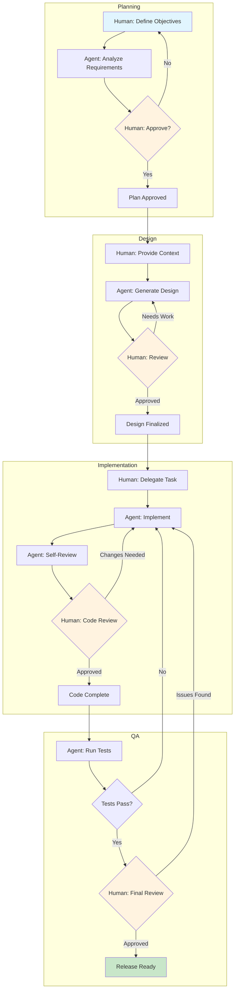
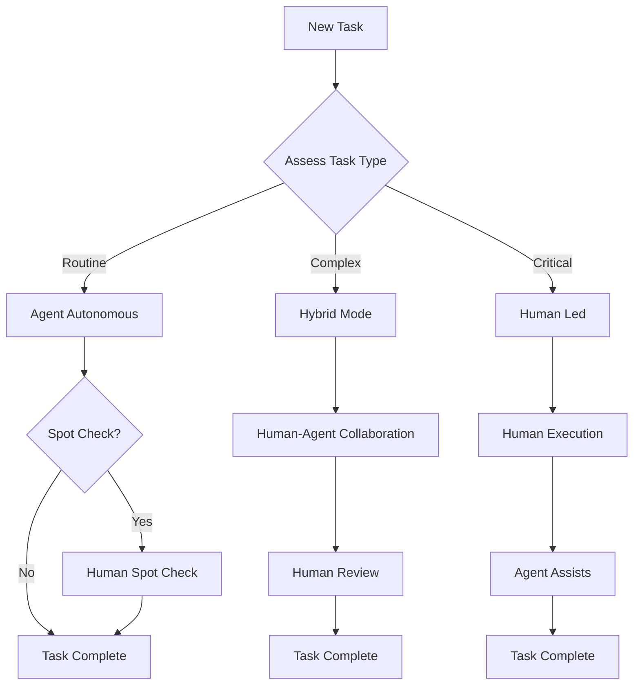
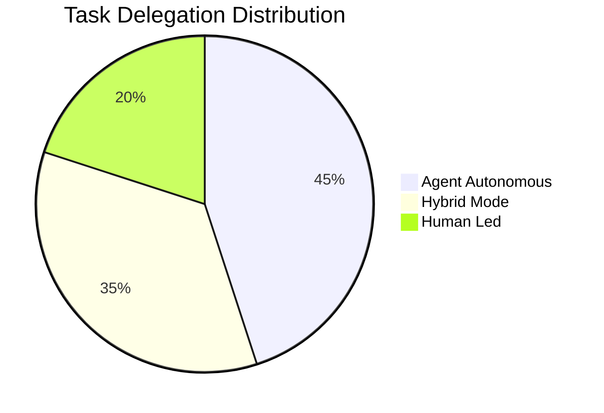

# Diagrama de Workflow HybridOps

**Versao:** 1.0.0
**Ultima Atualizacao:** 2026-01-28
**Status:** Ativo

---

## Visao Geral

HybridOps (Hybrid Operations) e uma metodologia para orquestrar a colaboracao entre humanos e agents em workflows de desenvolvimento de software. Ela combina os pontos fortes dos agents de IA com a supervisao humana para alcancar resultados otimos.

### Principios Fundamentais

| Principio                  | Descricao                                                                        |
| -------------------------- | -------------------------------------------------------------------------------- |
| **Execucao Hibrida**       | Tasks podem ser executadas por humanos, agents ou ambos em colaboracao           |
| **Delegacao Progressiva**  | Comece com supervisao humana, delegue gradualmente aos agents conforme a confianca aumenta |
| **Checkpoints de Qualidade** | Revisao humana em pontos de decisao criticos                                   |
| **Handoff Contextual**     | Transferencia de contexto sem interrupcoes entre humano e agent                  |

---

## Estagios do Workflow

### Estagio 1: Planejamento

```
Human                    Agent
  │                        │
  │   Define objectives    │
  │───────────────────────>│
  │                        │
  │   Analyze requirements │
  │<───────────────────────│
  │                        │
  │   Review & approve     │
  │───────────────────────>│
  │                        │
```

**Responsabilidades:**

- Humano: Definir objetivos de negocio e restricoes
- Agent: Analisar requisitos tecnicos e propor solucoes
- Humano: Revisar analise e aprovar direcao

### Estagio 2: Design

```
Human                    Agent
  │                        │
  │   Provide context      │
  │───────────────────────>│
  │                        │
  │   Generate designs     │
  │<───────────────────────│
  │                        │
  │   Iterate on feedback  │
  │<──────────────────────>│
  │                        │
```

**Responsabilidades:**

- Humano: Fornecer expertise de dominio e contexto
- Agent: Gerar opcoes de design e documentacao
- Ambos: Iterar no design ate aprovacao

### Estagio 3: Implementacao

```
Human                    Agent
  │                        │
  │   Delegate task        │
  │───────────────────────>│
  │                        │
  │   Execute task         │
  │<───────────────────────│
  │                        │
  │   Review code          │
  │───────────────────────>│
  │                        │
  │   Apply feedback       │
  │<───────────────────────│
  │                        │
```

**Responsabilidades:**

- Humano: Definir escopo da task e criterios de aceitacao
- Agent: Implementar solucao e escrever testes
- Humano: Revisar implementacao e fornecer feedback

### Estagio 4: Garantia de Qualidade

```
Human                    Agent
  │                        │
  │   Define test criteria │
  │───────────────────────>│
  │                        │
  │   Execute tests        │
  │<───────────────────────│
  │                        │
  │   Analyze results      │
  │<──────────────────────>│
  │                        │
  │   Approve release      │
  │───────────────────────>│
  │                        │
```

**Responsabilidades:**

- Humano: Definir criterios de qualidade e casos extremos
- Agent: Executar testes automatizados e gerar relatorios
- Humano: Aprovacao final para release

---

## Diagrama Mermaid

### Workflow Completo



### Fluxo de Decisao de Delegacao



### Classificacao de Tipo de Task



---

## Pontos de Integracao

### Com Agents AIOS

| Integracao     | Descricao                                                   |
| -------------- | ----------------------------------------------------------- |
| **@dev**       | Implementador principal para tasks de codificacao           |
| **@qa**        | Execucao de testes e verificacao de qualidade               |
| **@architect** | Revisao de design e orientacao tecnica                      |
| **@pm**        | Acompanhamento de progresso e comunicacao com stakeholders  |

### Com Quality Gates

HybridOps integra com os quality gates de 3 camadas do AIOS:

| Camada                      | Papel no HybridOps                  |
| --------------------------- | ----------------------------------- |
| Camada 1 (Pre-commit)       | Agent executa, humano monitora      |
| Camada 2 (Automacao de PR)  | Revisao de agent + humano           |
| Camada 3 (Revisao Final)    | Aprovacao humana obrigatoria        |

### Com Story Workflow

```
┌─────────────────────────────────────────────────────────────────┐
│                    HybridOps + Story Workflow                    │
│                                                                  │
│  Story Created     ──────────>  Planning Stage                   │
│       │                              │                           │
│       ▼                              ▼                           │
│  Requirements      <──────────  Agent Analysis                   │
│       │                              │                           │
│       ▼                              ▼                           │
│  Human Approval    ──────────>  Implementation                   │
│       │                              │                           │
│       ▼                              ▼                           │
│  QA Review         <──────────  Agent Testing                    │
│       │                              │                           │
│       ▼                              ▼                           │
│  Story Complete    <──────────  Human Sign-off                   │
│                                                                  │
└─────────────────────────────────────────────────────────────────┘
```

---

## Melhores Praticas

### Para Humanos

1. **Comunicacao Clara** - Forneca objetivos e restricoes explicitos
2. **Feedback Oportuno** - Revise a saida do agent prontamente para manter o ritmo
3. **Construcao de Confianca** - Comece com supervisao, reduza conforme a confianca cresce
4. **Compartilhamento de Contexto** - Compartilhe conhecimento de dominio relevante proativamente

### Para Agents

1. **Atualizacoes de Progresso** - Reporte status em checkpoints definidos
2. **Sinalizacao de Incerteza** - Sinalize explicitamente areas que precisam de input humano
3. **Apresentacao de Opcoes** - Apresente alternativas para decisao humana
4. **Documentacao** - Mantenha trilha de auditoria clara das decisoes

### Para Ambos

1. **Limites Definidos** - Propriedade clara de tasks e pontos de handoff
2. **Artefatos Compartilhados** - Use documentacao e rastreamento comuns
3. **Refinamento Iterativo** - Abrace ciclos de feedback
4. **Ciclo de Aprendizado** - Capture licoes para melhorias futuras

---

## Documentos Relacionados

- [hybrid-ops-pv.yaml](./hybrid-ops-pv.yaml) - Definicao do workflow
- [Arquitetura de Alto Nivel AIOS](../../architecture/high-level-architecture.md)
- [Arquitetura CI/CD](../../architecture/ci-cd.md)

---

_Diagrama de Workflow HybridOps v1.0 - Metodologia Pedro Valerio_
