# Squad Creator - Architecture Diagrams

> **Documento avancado/tecnico.** Nao e necessario para usar o Squad Creator.
>
> **Primeira vez?** Comece por [POR-ONDE-COMECAR.md](./POR-ONDE-COMECAR.md).
>
> Diagramas de sequencia dos principais fluxos. Renderize com [Mermaid Live](https://mermaid.live).

---

## 0. Arquitetura v4.0.0: Base/Pro Architecture

### 0.1 Base vs Pro Split

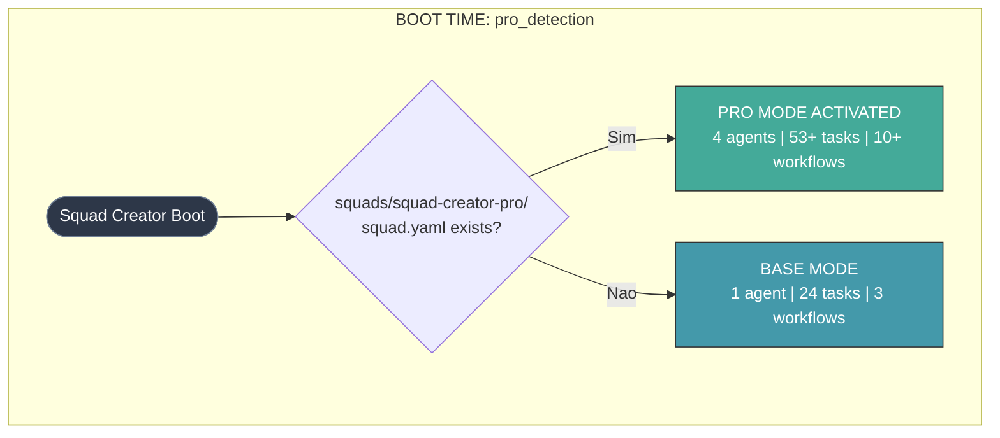

### 0.2 BASE MODE: squad-chief Alone

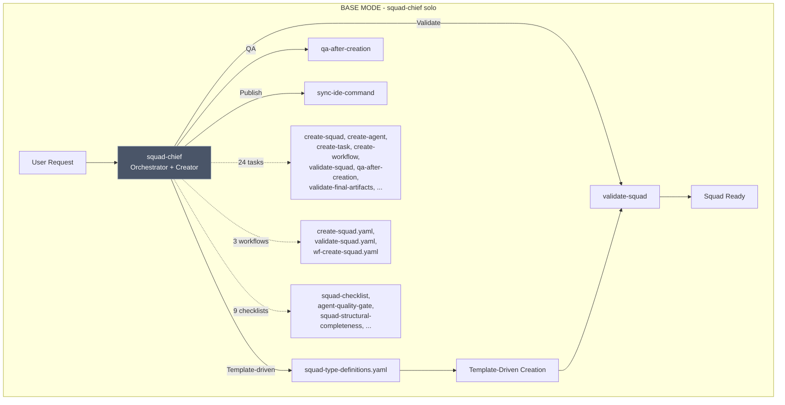

### 0.3 PRO MODE: 4 Agentes

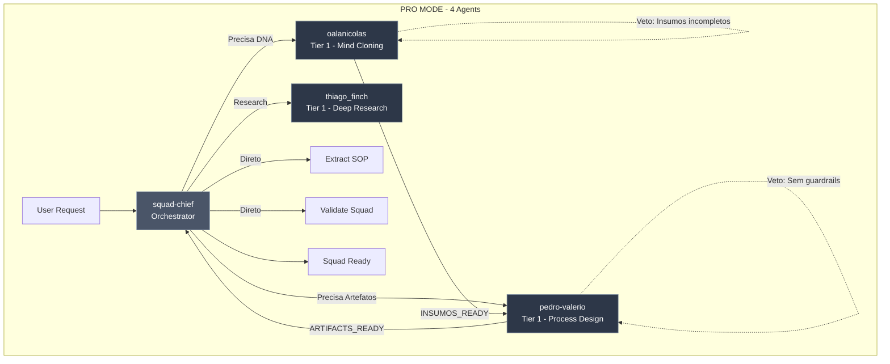

### Fluxo de Colaboracao Detalhado [PRO]

```mermaid
sequenceDiagram
    autonumber
    participant U as User
    participant SC as squad-chief
    participant AN as @oalanicolas
    participant PV as @pedro-valerio

    U->>SC: *create-squad copywriting

    rect rgb(40, 40, 60)
        Note over SC: PHASE 0: TRIAGE
        SC->>SC: Verificar squad-registry
        SC->>SC: Research elite minds
        SC->>U: Apresentar minds encontrados
        U-->>SC: Aprovar minds
    end

    rect rgb(40, 60, 40)
        Note over SC,AN: PHASE 1: CLONAGEM (por mind)
        loop Para cada mind aprovado
            SC->>AN: Clone {mind_name}
            AN->>AN: Collect sources
            AN->>AN: Curate (ouro/bronze)
            AN->>AN: Extract Voice DNA
            AN->>AN: Extract Thinking DNA
            AN->>AN: Self-validation

            alt Self-validation PASS
                AN-->>SC: DNA Complete
            else Self-validation FAIL
                AN->>AN: Retry extraction
            end
        end
    end

    rect rgb(60, 40, 40)
        Note over AN,PV: PHASE 2: HANDOFF AN -> PV
        AN->>AN: Prepare INSUMOS_READY
        AN->>PV: Handoff com DNAs

        alt Veto conditions
            PV-->>AN: REJECT (insumos incompletos)
            AN->>AN: Complete insumos
            AN->>PV: Retry handoff
        else Accept
            PV->>PV: Create agents
            PV->>PV: Create tasks
            PV->>PV: Create workflows
            PV->>PV: Define veto conditions
        end
    end

    rect rgb(40, 40, 80)
        Note over PV,SC: PHASE 3: HANDOFF PV -> SC
        PV->>PV: Validate artifacts
        PV->>SC: ARTIFACTS_READY
    end

    rect rgb(60, 60, 40)
        Note over SC: PHASE 4: INTEGRATION
        SC->>SC: Generate squad.yaml
        SC->>SC: Generate README.md
        SC->>SC: Wire dependencies
        SC->>SC: Run smoke tests
        SC->>SC: Generate quality dashboard
    end

    SC->>U: Squad pronto!
```

### Handoffs e Veto Conditions [PRO]

| De -> Para | Protocolo | Veto Se |
|-----------|-----------|---------|
| SC -> AN | Mind para clonar | - |
| AN -> PV | INSUMOS_READY | < 15 citacoes, < 5 signature phrases |
| AN -> SC | DNA Complete | - |
| PV -> SC | ARTIFACTS_READY | Smoke test FAIL |

**Documentacao completa:** [AGENT-COLLABORATION.md](./AGENT-COLLABORATION.md)

---

## 1. Fluxo Principal: Criacao de Squad

### 1.1 Fluxo de Criacao (Base Mode)

```mermaid
sequenceDiagram
    autonumber
    participant U as User
    participant SC as squad-chief
    participant TPL as Templates
    participant VAL as Validation Chain

    U->>SC: *create-squad {domain}

    rect rgb(40, 40, 60)
        Note over SC: PHASE 0: DISCOVERY
        SC->>SC: Check squad-registry
        SC->>SC: Domain viability check
        SC->>U: Present domain analysis
    end

    rect rgb(40, 60, 40)
        Note over SC,TPL: PHASE 1: TEMPLATE SELECTION
        SC->>TPL: Load squad-type-definitions.yaml
        TPL-->>SC: Type requirements + structure
        SC->>SC: Determine squad type (Expert/Pipeline/Hybrid)
    end

    rect rgb(60, 40, 40)
        Note over SC: PHASE 2: ARCHITECTURE
        SC->>SC: Define tier structure
        SC->>SC: Configure orchestrator
        SC->>SC: Set quality gates
    end

    rect rgb(40, 40, 80)
        Note over SC: PHASE 3: CREATION
        SC->>SC: Template-driven agent creation
        SC->>SC: Create tasks from patterns
        SC->>SC: Create workflows
        SC->>SC: SC_AGT_001 validation per agent
    end

    rect rgb(60, 60, 40)
        Note over SC,VAL: PHASE 4: INTEGRATION
        SC->>SC: Wire dependencies
        SC->>SC: Generate squad.yaml
        SC->>SC: Publish chief command
    end

    rect rgb(50, 40, 50)
        Note over SC,VAL: PHASE 5: VALIDATION
        SC->>VAL: validate-squad (>= 7.0)
        VAL-->>SC: Score + Report
    end

    SC->>U: Squad pronto + Validation Report
```

### 1.2 Consistency Chain v4.0.0

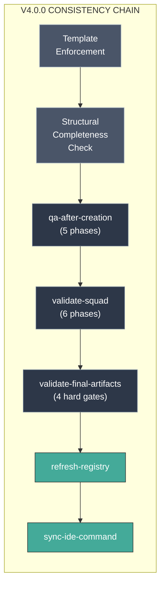

### 1.3 Fluxo de Criacao Completo [PRO]

```mermaid
sequenceDiagram
    autonumber
    participant U as User
    participant SA as Squad Architect
    participant MRL as Mind Research Loop
    participant CM as Clone Mind
    participant CA as Create Agent
    participant QG as Quality Gates

    U->>SA: *create-squad {domain}

    rect rgb(40, 40, 60)
        Note over SA: PRE-FLIGHT
        SA->>U: Mostrar requisitos de materiais
        SA->>U: Perguntar modo (YOLO/QUALITY/HYBRID)
        U-->>SA: Selecionar modo
    end

    rect rgb(40, 60, 40)
        Note over SA,MRL: PHASE 1: RESEARCH
        SA->>MRL: Iniciar pesquisa iterativa
        loop 3-5 iterations
            MRL->>MRL: Pesquisar elite minds
            MRL->>MRL: Devil's advocate
            MRL->>MRL: Validar frameworks
        end
        MRL-->>SA: Lista curada de minds
    end

    SA->>U: Apresentar minds encontrados
    U-->>SA: Aprovar minds

    alt QUALITY/HYBRID Mode
        rect rgb(60, 40, 40)
            Note over SA,U: MATERIALS COLLECTION
            SA->>U: Solicitar materiais por mind
            U-->>SA: Fornecer paths/links
        end
    end

    rect rgb(40, 40, 80)
        Note over SA,CA: PHASE 3: CREATION (per mind)
        loop Para cada mind aprovado
            SA->>CM: *clone-mind {name}
            CM-->>SA: mind_dna_complete.yaml
            SA->>CA: *create-agent usando DNA
            CA->>QG: Validar agent
            QG-->>CA: PASS/FAIL
            CA-->>SA: agent.md criado
        end
    end

    SA->>SA: Criar orchestrator
    SA->>SA: Criar workflows/tasks
    SA->>QG: Validacao final do squad
    QG-->>SA: Score final

    SA->>U: Squad pronto + Quality Dashboard
```

---

## 2. Fluxo: Clone Mind (DNA Extraction) [PRO]

```mermaid
sequenceDiagram
    autonumber
    participant U as User
    participant CM as Clone Mind
    participant CS as Collect Sources
    participant AA as Auto-Acquire
    participant VE as Voice Extractor
    participant TE as Thinking Extractor
    participant ST as Smoke Tests

    U->>CM: *clone-mind {name} --domain {domain}

    rect rgb(50, 40, 40)
        Note over CM,CS: PHASE 0: SOURCE COLLECTION
        CM->>CS: Iniciar coleta de fontes

        alt User forneceu materiais
            CS->>CS: Indexar como Tier 0
        else Sem materiais
            CS->>AA: Executar auto-acquire
            AA->>AA: YouTube transcripts
            AA->>AA: Book summaries
            AA->>AA: Podcasts
            AA-->>CS: Fontes encontradas
        end

        alt < 10 fontes
            CS->>CS: Manual web search
        end

        alt < 5 fontes
            CS-->>U: Expert muito obscuro
            Note over U: Workflow PARA
        else >= 5 fontes
            CS-->>CM: sources_inventory.yaml
        end
    end

    rect rgb(40, 50, 40)
        Note over CM,VE: PHASE 1: VOICE DNA
        CM->>VE: Extrair Voice DNA
        VE->>VE: Power words
        VE->>VE: Signature phrases
        VE->>VE: Stories/anecdotes
        VE->>VE: Anti-patterns
        VE->>VE: Immune system
        VE-->>CM: voice_dna.yaml (8/10 min)
    end

    rect rgb(40, 40, 50)
        Note over CM,TE: PHASE 2: THINKING DNA
        CM->>TE: Extrair Thinking DNA
        TE->>TE: Recognition patterns
        TE->>TE: Frameworks
        TE->>TE: Heuristics
        TE->>TE: Objection handling
        TE->>TE: Handoff triggers
        TE-->>CM: thinking_dna.yaml (7/9 min)
    end

    CM->>CM: Synthesis: Combinar DNAs
    CM->>CM: Gerar mind_dna_complete.yaml

    rect rgb(60, 40, 60)
        Note over CM,ST: PHASE 4: SMOKE TESTS
        CM->>ST: Executar 3 testes
        ST->>ST: Test 1: Domain Knowledge
        ST->>ST: Test 2: Decision Making
        ST->>ST: Test 3: Objection Handling

        alt 3/3 PASS
            ST-->>CM: Agente validado
        else Qualquer FAIL
            ST-->>CM: Re-trabalhar DNA
            CM->>VE: Revisar secao que falhou
        end
    end

    CM->>CM: Gerar Quality Dashboard
    CM-->>U: mind_dna_complete.yaml + dashboard
```

---

## 3. Fluxo: Coleta de Fontes (Fallback Chain) [PRO]

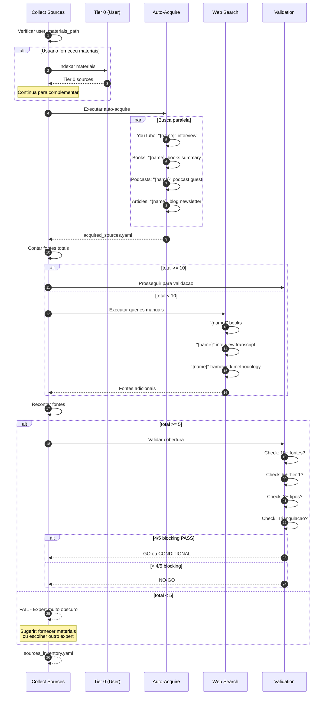

---

## 4. Fluxo: Auto-Acquire Sources (wf-auto-acquire-sources.yaml) [PRO]

```mermaid
sequenceDiagram
    autonumber
    participant U as User/Trigger
    participant WF as wf-auto-acquire-sources
    participant EXA as Exa MCP
    participant YT as YouTube Transcript MCP
    participant FC as Firecrawl MCP
    participant WEB as WebFetch (fallback)
    participant QG as Quality Gate

    U->>WF: *auto-acquire-sources "Gary Halbert" --domain copywriting

    rect rgb(40, 40, 50)
        Note over WF: PHASE 0: SETUP
        WF->>WF: Gerar slug: "gary_halbert"
        WF->>WF: Criar estrutura de diretorios
        WF->>WF: Detectar tools disponiveis
    end

    rect rgb(40, 50, 40)
        Note over WF,YT: PHASE 1: YOUTUBE MINING (paralelo)

        par Busca paralela
            WF->>EXA: "{name}" interview YouTube
            WF->>EXA: "{name}" podcast YouTube
            WF->>EXA: "{name}" keynote speech
        end

        EXA-->>WF: URLs de videos
        WF->>WF: Filtrar (>10min, expert principal)

        alt mcp-youtube-transcript instalado
            WF->>YT: Extrair transcripts
            YT-->>WF: Transcripts em markdown
        else fallback
            WF->>EXA: Buscar transcripts existentes
            WF->>WEB: Fetch content
            WEB-->>WF: Transcripts parciais
        end

        WF->>WF: Salvar em transcripts/YT_*.md
    end

    rect rgb(50, 40, 40)
        Note over WF,FC: PHASE 2: BOOK MINING (paralelo)

        WF->>EXA: "{name}" books author
        EXA-->>WF: Lista de livros

        WF->>EXA: "{book}" summary site:shortform.com
        EXA-->>WF: URLs de resumos

        alt firecrawl-mcp instalado
            WF->>FC: Scrape summaries (markdown)
            FC-->>WF: Conteudo limpo
        else fallback
            WF->>WEB: Fetch summaries
            WEB-->>WF: Conteudo basico
        end

        WF->>WF: Salvar em books/BK_*.md
    end

    rect rgb(40, 40, 60)
        Note over WF,EXA: PHASE 3: PODCAST MINING (paralelo)

        par Busca paralela
            WF->>EXA: "{name}" podcast guest
            WF->>EXA: site:spotify.com "{name}"
            WF->>EXA: site:podcasts.apple.com "{name}"
        end

        EXA-->>WF: Aparicoes em podcasts
        WF->>WF: Marcar para processamento (Whisper se necessario)
    end

    rect rgb(60, 40, 40)
        Note over WF,FC: PHASE 4: ARTICLE MINING (paralelo)

        par Tier 1: BY expert
            WF->>EXA: "{name}" blog newsletter
            WF->>EXA: site:medium.com author:"{name}"
        and Tier 2: ABOUT expert
            WF->>EXA: "{name}" methodology framework
        end

        EXA-->>WF: URLs de artigos

        alt firecrawl-mcp instalado
            WF->>FC: Batch scrape articles
            FC-->>WF: Artigos em markdown
        else fallback
            WF->>WEB: Fetch articles
            WEB-->>WF: Conteudo extraido
        end

        WF->>WF: Salvar em articles/AR_*.md
    end

    rect rgb(50, 50, 40)
        Note over WF,QG: PHASE 5: CONSOLIDATION

        WF->>WF: Merge todas as fontes
        WF->>WF: Classificar por Tier (1, 2, 3)
        WF->>WF: Gerar sources_inventory.yaml
        WF->>WF: Gerar acquisition_report.md

        WF->>QG: Validar SRC_ACQ_001

        QG->>QG: total >= 10?
        QG->>QG: tier_1 >= 5?
        QG->>QG: youtube_with_transcript >= 3?

        alt Excellent (20+, 60% tier 1)
            QG-->>WF: Score: Excellent
        else Good (15+, 50% tier 1)
            QG-->>WF: Score: Good
        else Acceptable (10+, 40% tier 1)
            QG-->>WF: Score: Acceptable
        else Needs Improvement
            QG-->>WF: Score: Needs Work
            Note over WF: Recomendacoes geradas
        end
    end

    WF-->>U: sources_inventory.yaml + acquisition_report.md
```

---

## 4.1 Fluxo: Tool Fallback Chain [PRO]

```mermaid
flowchart TD
    subgraph "YouTube Transcripts"
        YT_START([Extrair transcript]) --> YT_CHECK{mcp-youtube-transcript<br/>instalado?}
        YT_CHECK -->|Sim| YT_MCP[Usar MCP]
        YT_MCP --> YT_OK([Transcript extraido])

        YT_CHECK -->|Nao| YT_FALLBACK1[Buscar via Exa]
        YT_FALLBACK1 --> YT_FOUND{Transcript<br/>existente?}
        YT_FOUND -->|Sim| YT_FETCH[WebFetch content]
        YT_FETCH --> YT_OK

        YT_FOUND -->|Nao| YT_QUEUE[Adicionar a manual_queue]
        YT_QUEUE --> YT_PARTIAL([Pendente manual])
    end

    subgraph "Web Scraping"
        WS_START([Scrape artigo]) --> WS_CHECK{firecrawl-mcp<br/>instalado?}
        WS_CHECK -->|Sim| WS_MCP[Usar Firecrawl]
        WS_MCP --> WS_OK([Markdown limpo])

        WS_CHECK -->|Nao| WS_NATIVE[Usar WebFetch nativo]
        WS_NATIVE --> WS_BASIC([Extracao basica])
    end

    subgraph "Deep Research"
        DR_START([Research iterativo]) --> DR_CHECK{mcp-perplexity<br/>instalado?}
        DR_CHECK -->|Sim| DR_MCP[Usar Perplexity]
        DR_MCP --> DR_CITE([Com citacoes])

        DR_CHECK -->|Nao| DR_EXA[Usar Exa]
        DR_EXA --> DR_OK([Resultados Exa])
    end

    style YT_OK fill:#4a9,stroke:#333
    style WS_OK fill:#4a9,stroke:#333
    style DR_CITE fill:#4a9,stroke:#333
    style DR_OK fill:#4a9,stroke:#333
    style YT_PARTIAL fill:#fa4,stroke:#333
    style WS_BASIC fill:#fa4,stroke:#333
```

---

## 4.2 Integracao: wf-auto-acquire no Pipeline [PRO]

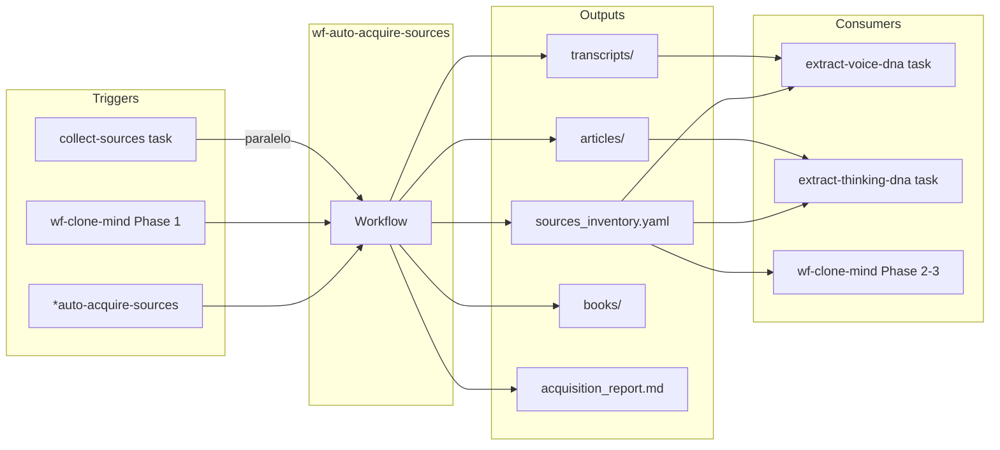

---

## 5. Fluxo: Smoke Tests

```mermaid
sequenceDiagram
    autonumber
    participant AG as Agent.md
    participant ST as Smoke Test Runner
    participant T1 as Test 1: Domain
    participant T2 as Test 2: Decision
    participant T3 as Test 3: Objection
    participant DNA as mind_dna.yaml

    ST->>DNA: Carregar DNA do mind
    DNA-->>ST: voice_dna + thinking_dna

    rect rgb(40, 50, 40)
        Note over ST,T1: TEST 1: CONHECIMENTO
        ST->>AG: "Explique {framework_principal}..."
        AG-->>ST: Resposta
        ST->>T1: Validar resposta
        T1->>T1: Conta power_words (min 3)
        T1->>T1: Verifica signature_phrases (min 1)
        T1->>T1: Verifica never_use (max 0)
        T1->>T1: Valida tom/estrutura
        T1-->>ST: 4/5 checks -> PASS/FAIL
    end

    rect rgb(50, 40, 40)
        Note over ST,T2: TEST 2: DECISAO
        ST->>AG: "Devo fazer A ou B? Por que?"
        AG-->>ST: Resposta
        ST->>T2: Validar resposta
        T2->>T2: Aplica heuristica do DNA?
        T2->>T2: Segue decision_pipeline?
        T2->>T2: Usa framework?
        T2->>T2: Responde com conviccao?
        T2-->>ST: 4/5 checks -> PASS/FAIL
    end

    rect rgb(40, 40, 50)
        Note over ST,T3: TEST 3: OBJECAO
        ST->>AG: "Discordo porque {objecao}..."
        AG-->>ST: Resposta
        ST->>T3: Validar resposta
        T3->>T3: Reconhece objecao?
        T3->>T3: Usa objection_response do DNA?
        T3->>T3: Mantem conviccao?
        T3->>T3: Parece autentico?
        T3-->>ST: 4/5 checks -> PASS/FAIL
    end

    ST->>ST: Consolidar resultados

    alt 3/3 tests PASS
        ST-->>AG: SMOKE TEST PASSED
        Note over AG: Agente pronto para uso
    else Qualquer test FAIL
        ST-->>AG: SMOKE TEST FAILED
        Note over AG: Acoes:<br/>1. Revisar DNA<br/>2. Adicionar exemplos<br/>3. Re-testar
    end
```

---

## 5.1 Fluxo: YOLO vs QUALITY Mode [PRO]

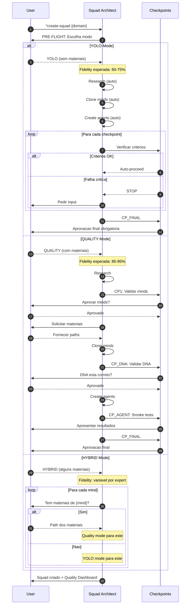

---

## 6. Estrutura de Arquivos: Base vs Pro

### 6.1 Base: squads/squad-creator/

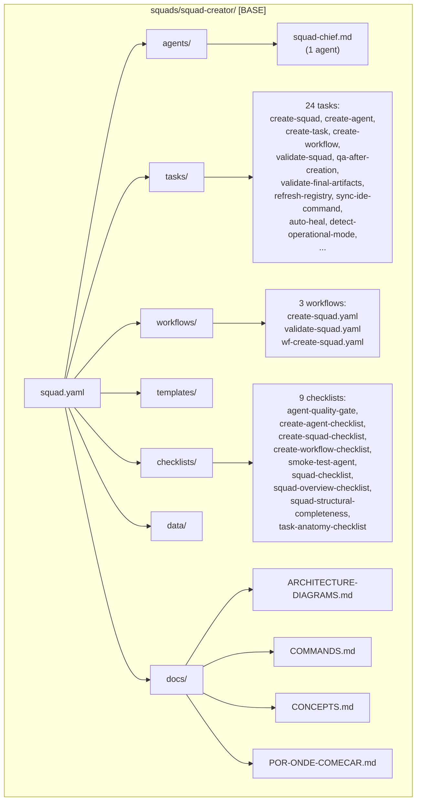

### 6.2 Pro: squads/squad-creator-pro/

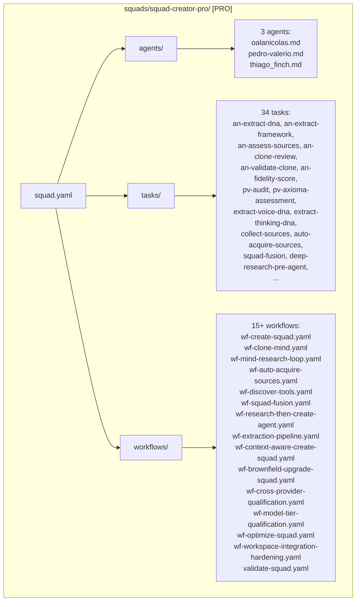

---

## 7. Quality Gates Flow

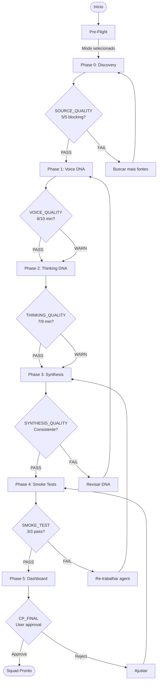

---

## 8. Fluxo: Mind Research Loop (wf-mind-research-loop.yaml) [PRO]

```mermaid
sequenceDiagram
    autonumber
    participant U as User/Trigger
    participant MRL as Mind Research Loop
    participant EXA as Exa MCP
    participant DA as Devil's Advocate
    participant VAL as Validation
    participant QG as Quality Gate

    U->>MRL: Pesquisar minds para {domain}

    rect rgb(40, 40, 50)
        Note over MRL: SETUP
        MRL->>MRL: Definir domain
        MRL->>MRL: Carregar criterios de selecao
        MRL->>MRL: Configurar max_iterations (3-5)
    end

    loop Iteration 1..N (max 5)
        rect rgb(40, 50, 40)
            Note over MRL,EXA: RESEARCH PHASE

            par Busca paralela
                MRL->>EXA: "{domain}" top experts
                MRL->>EXA: "{domain}" thought leaders
                MRL->>EXA: "{domain}" best books authors
                MRL->>EXA: "{domain}" famous frameworks
            end

            EXA-->>MRL: Candidatos encontrados
            MRL->>MRL: Consolidar lista
        end

        rect rgb(50, 40, 40)
            Note over MRL,DA: DEVIL'S ADVOCATE
            MRL->>DA: Criticar candidatos
            DA->>DA: Verificar credenciais
            DA->>DA: Buscar controversias
            DA->>DA: Validar relevancia atual
            DA->>DA: Checar fontes disponiveis
            DA-->>MRL: Candidatos refinados + concerns
        end

        rect rgb(40, 40, 60)
            Note over MRL,VAL: TIER CLASSIFICATION
            MRL->>VAL: Classificar candidatos

            VAL->>VAL: Tier 0: Foundational Experts
            VAL->>VAL: Tier 1: Elite Practitioners
            VAL->>VAL: Tier 2: Complementary Minds
            VAL->>VAL: Tier 3: Supporting Voices

            VAL-->>MRL: minds_by_tier.yaml
        end

        MRL->>MRL: Avaliar cobertura

        alt Cobertura >= 80% && diverse_tiers
            MRL->>MRL: Break loop early
        else Precisa mais
            MRL->>MRL: Ajustar queries
            Note over MRL: Proxima iteracao
        end
    end

    rect rgb(50, 50, 40)
        Note over MRL,QG: QUALITY GATE
        MRL->>QG: Validar resultado final

        QG->>QG: min_minds >= 4?
        QG->>QG: tier_0_or_1 >= 2?
        QG->>QG: diverse_perspectives?
        QG->>QG: sources_available?

        alt 4/4 PASS
            QG-->>MRL: APPROVED
        else < 4/4
            QG-->>MRL: CONDITIONAL
            Note over MRL: Recomendacoes geradas
        end
    end

    MRL-->>U: minds_curated.yaml + research_report.md
```

---

## 8.1 Mind Research: Tier Classification [PRO]

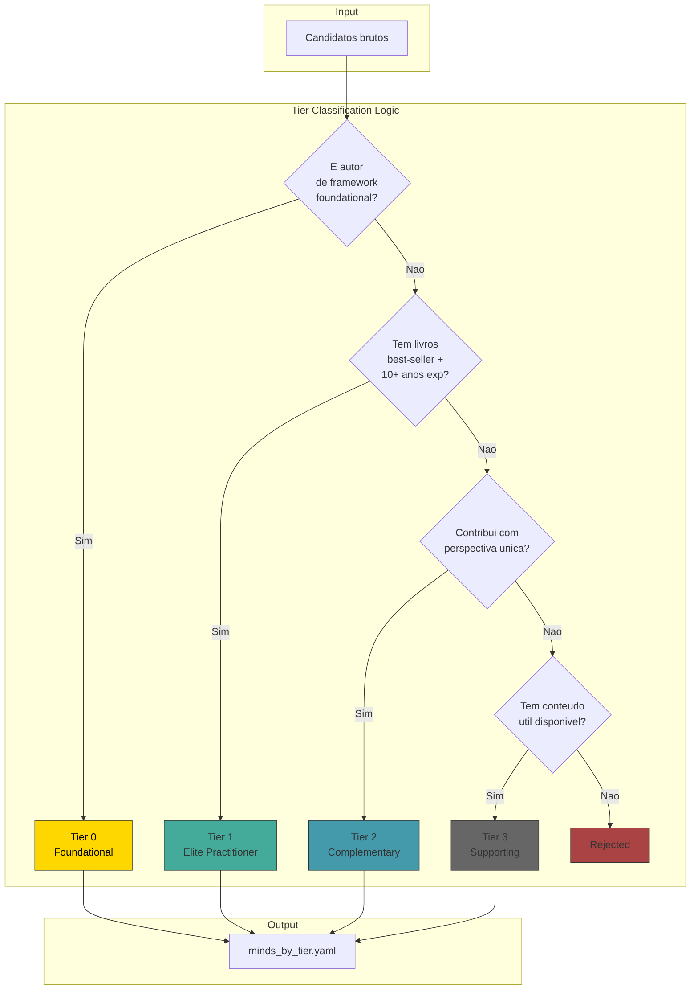

---

## 9. Fluxo: Tool Discovery (wf-discover-tools.yaml)

```mermaid
sequenceDiagram
    autonumber
    participant U as User
    participant WF as wf-discover-tools
    participant A1 as Agent: MCP Hunter
    participant A2 as Agent: API Scout
    participant A3 as Agent: CLI Explorer
    participant A4 as Agent: Library Finder
    participant A5 as Agent: GitHub Searcher
    participant CONS as Consolidator

    U->>WF: *discover-tools {domain}

    rect rgb(40, 40, 50)
        Note over WF: PHASE 1: SETUP
        WF->>WF: Parse domain
        WF->>WF: Identificar capability gaps
        WF->>WF: Carregar tool-registry.yaml
    end

    rect rgb(40, 50, 40)
        Note over WF,A5: PHASE 2: PARALLEL DISCOVERY

        par 5 Agentes em paralelo
            WF->>A1: Buscar MCPs
            A1->>A1: glama.ai/mcp
            A1->>A1: GitHub MCP repos
            A1->>A1: npm MCP packages
            A1-->>WF: mcp_candidates[]
        and
            WF->>A2: Buscar APIs
            A2->>A2: RapidAPI
            A2->>A2: ProgrammableWeb
            A2->>A2: Public APIs list
            A2-->>WF: api_candidates[]
        and
            WF->>A3: Buscar CLIs
            A3->>A3: Homebrew
            A3->>A3: npm global
            A3->>A3: pip tools
            A3-->>WF: cli_candidates[]
        and
            WF->>A4: Buscar Libraries
            A4->>A4: npm packages
            A4->>A4: pip packages
            A4->>A4: awesome-* lists
            A4-->>WF: lib_candidates[]
        and
            WF->>A5: Buscar GitHub Projects
            A5->>A5: Trending repos
            A5->>A5: Topic search
            A5->>A5: Stars ranking
            A5-->>WF: github_candidates[]
        end
    end

    rect rgb(50, 40, 40)
        Note over WF,CONS: PHASE 3: CONSOLIDATION
        WF->>CONS: Merge all candidates

        CONS->>CONS: Deduplicate
        CONS->>CONS: Score by relevance
        CONS->>CONS: Score by maturity
        CONS->>CONS: Score by ease of integration

        CONS-->>WF: scored_tools[]
    end

    rect rgb(40, 40, 60)
        Note over WF: PHASE 4: PRIORITIZATION
        WF->>WF: Build Impact vs Effort matrix

        WF->>WF: Priority 1: Quick Wins (High Impact, Low Effort)
        WF->>WF: Priority 2: Strategic (High Impact, High Effort)
        WF->>WF: Priority 3: Nice-to-have (Low Impact, Low Effort)
        WF->>WF: Priority 4: Avoid (Low Impact, High Effort)

        WF->>WF: Gerar integration_plan.yaml
    end

    WF-->>U: Tool Discovery Report + Recommendations
```

---

## 9.1 Tool Discovery: Prioritization Matrix

```mermaid
quadrantChart
    title Impact vs Effort Matrix
    x-axis Low Effort --> High Effort
    y-axis Low Impact --> High Impact
    quadrant-1 Strategic Investment
    quadrant-2 Quick Wins (Do First!)
    quadrant-3 Nice-to-have
    quadrant-4 Avoid
    mcp-youtube-transcript: [0.2, 0.9]
    firecrawl-mcp: [0.3, 0.9]
    mcp-perplexity: [0.25, 0.85]
    knowledge-graph-memory: [0.5, 0.8]
    supadata-mcp: [0.6, 0.6]
    cognee-mcp: [0.8, 0.7]
```

---

## 10. Fluxo: Validate Squad v5.0.0 (validate-squad)

### 10.1 Pipeline de Validacao: 7 Fases (Phase 0-6)

```mermaid
sequenceDiagram
    autonumber
    participant U as User
    participant VS as validate-squad
    participant P0 as Phase 0: Type Detection
    participant P1 as Phase 1: Structure (TIER 1)
    participant P2 as Phase 2: Coverage (TIER 2)
    participant P3 as Phase 3: Quality (TIER 3)
    participant P4 as Phase 4: Contextual (TIER 4)
    participant P5 as Phase 5: Veto Check
    participant P6 as Phase 6: Scoring & Report

    U->>VS: *validate-squad {squad-name}

    rect rgb(40, 40, 50)
        Note over VS,P0: PHASE 0: TYPE DETECTION
        VS->>P0: Detect squad type
        P0->>P0: Load squad-type-definitions.yaml
        P0->>P0: Classify: Expert / Pipeline / Hybrid
        P0->>P0: Load type-specific requirements
        P0-->>VS: squad_type + requirements
    end

    rect rgb(40, 50, 40)
        Note over VS,P1: PHASE 1: STRUCTURE (TIER 1 - BLOCKING)
        VS->>P1: Validar estrutura
        P1->>P1: squad.yaml exists and valid?
        P1->>P1: Entry agent defined and activatable?
        P1->>P1: All referenced files exist?
        P1->>P1: YAML syntax valid?

        alt Any failure
            P1-->>VS: ABORT - structure broken
            Note over VS: BLOCKING: Cannot continue
        else All pass
            P1-->>VS: structure_ok
        end
    end

    rect rgb(50, 40, 40)
        Note over VS,P2: PHASE 2: COVERAGE (TIER 2 - BLOCKING)
        VS->>P2: Validar cobertura
        P2->>P2: Checklist coverage >= 30%?
        P2->>P2: Orphan tasks max 2?
        P2->>P2: Pipeline phase coverage? (if pipeline)
        P2->>P2: Data file usage >= 50%?
        P2->>P2: Tool registry valid? (if exists)

        alt Coverage failures
            P2-->>VS: ABORT - coverage insufficient
        else All pass
            P2-->>VS: coverage_ok
        end
    end

    rect rgb(40, 40, 60)
        Note over VS,P3: PHASE 3: QUALITY (TIER 3 - SCORING)
        VS->>P3: Avaliar qualidade
        P3->>P3: Prompt Quality (20%)
        P3->>P3: Pipeline Coherence (20%)
        P3->>P3: Checklist Actionability (20%)
        P3->>P3: Documentation (20%)
        P3->>P3: Optimization Opportunities (20%)
        P3-->>VS: quality_score (0-10, threshold 7.0)
    end

    rect rgb(50, 50, 40)
        Note over VS,P4: PHASE 4: CONTEXTUAL (TIER 4 - TYPE-SPECIFIC)
        VS->>P4: Validacao contextual

        alt Expert Squad
            P4->>P4: voice_dna present?
            P4->>P4: objection_algorithms?
            P4->>P4: Agent tiers defined?
        else Pipeline Squad
            P4->>P4: Workflow complete?
            P4->>P4: Checkpoints defined?
            P4->>P4: Orchestrator configured?
        else Hybrid Squad
            P4->>P4: Persona defined?
            P4->>P4: behavioral_states?
            P4->>P4: heuristics?
            P4->>P4: executor_decision_tree?
        end

        P4-->>VS: contextual_score (0-10, weighted 20%)
    end

    rect rgb(60, 40, 40)
        Note over VS,P5: PHASE 5: VETO CHECK
        VS->>P5: Check veto conditions
        P5->>P5: Type-specific veto rules
        P5->>P5: Security scan (secrets, hardcoded paths)
        P5->>P5: Injection risk check

        alt Any veto triggered
            P5-->>VS: FAIL (regardless of score)
        else No vetoes
            P5-->>VS: veto_clear
        end
    end

    rect rgb(40, 60, 40)
        Note over VS,P6: PHASE 6: SCORING & REPORT
        VS->>P6: Calculate final score
        P6->>P6: Formula: (Tier3 x 0.80) + (Tier4 x 0.20)
        P6->>P6: Generate detailed report
        P6->>P6: List recommendations
        P6-->>VS: final_score + report
    end

    VS-->>U: validation_report.md + final_score
```

### 10.2 Validate Squad: Scoring Breakdown

```mermaid
pie showData
    title Squad Validation Score Weights
    "Phase 3: Quality (Tier 3)" : 80
    "Phase 4: Contextual (Tier 4)" : 20
```

> **Nota:** Phases 1 e 2 sao BLOCKING -- nao contribuem para o score, mas falha = ABORT imediato.
> Phase 5 (Veto) pode anular qualquer score positivo.

---

## 11. Fluxo: Squad Fusion (wf-squad-fusion.yaml) [PRO]

```mermaid
sequenceDiagram
    autonumber
    participant U as User
    participant SF as Squad Fusion
    participant VAL as Validator
    participant ANA as Analyzer
    participant PLAN as Planner
    participant MERGE as Merger
    participant ORCH as Orchestrator Builder
    participant QG as Quality Gate

    U->>SF: *fuse-squads squad1 squad2 --name combined

    rect rgb(40, 40, 50)
        Note over SF,VAL: PHASE 1: PRE-FLIGHT VALIDATION
        SF->>VAL: Validar squads de origem

        par Validacao paralela
            VAL->>VAL: squad1 existe?
            VAL->>VAL: squad2 existe?
        end

        VAL->>VAL: Compatibilidade de dominios?
        VAL->>VAL: Conflitos de agents?
        VAL-->>SF: validation_result

        alt Conflitos criticos
            SF-->>U: Fusao impossivel: {reason}
            Note over U: Workflow PARA
        end
    end

    rect rgb(40, 50, 40)
        Note over SF,ANA: PHASE 2: DEEP ANALYSIS
        SF->>ANA: Analisar ambos squads

        ANA->>ANA: Map agents por tier
        ANA->>ANA: Identificar overlaps
        ANA->>ANA: Identificar gaps
        ANA->>ANA: Map workflows
        ANA->>ANA: Map dependencies

        ANA-->>SF: analysis_report
    end

    rect rgb(50, 40, 40)
        Note over SF,PLAN: PHASE 3: FUSION PLANNING
        SF->>PLAN: Criar plano de fusao

        PLAN->>PLAN: Agent merge strategy
        PLAN->>PLAN: Workflow integration
        PLAN->>PLAN: Task consolidation
        PLAN->>PLAN: Template merging
        PLAN->>PLAN: New orchestrator design

        PLAN-->>SF: fusion_plan.yaml
    end

    SF->>U: Apresentar fusion_plan
    U-->>SF: Aprovar plano

    rect rgb(40, 40, 60)
        Note over SF,MERGE: PHASE 4-6: EXECUTION

        SF->>MERGE: Phase 4: Merge Agents
        MERGE->>MERGE: Copy agents
        MERGE->>MERGE: Resolve conflicts
        MERGE->>MERGE: Update references
        MERGE-->>SF: agents_merged

        SF->>MERGE: Phase 5: Merge Workflows
        MERGE->>MERGE: Combine workflows
        MERGE->>MERGE: Update agent references
        MERGE-->>SF: workflows_merged

        SF->>MERGE: Phase 6: Merge Tasks/Templates
        MERGE-->>SF: tasks_templates_merged
    end

    rect rgb(50, 50, 40)
        Note over SF,ORCH: PHASE 7: NEW ORCHESTRATOR
        SF->>ORCH: Criar orchestrator combinado

        ORCH->>ORCH: Definir handoff rules
        ORCH->>ORCH: Map all agents
        ORCH->>ORCH: Define routing logic
        ORCH->>ORCH: Set quality gates

        ORCH-->>SF: orchestrator.md
    end

    rect rgb(60, 40, 60)
        Note over SF,QG: PHASE 8: FINAL VALIDATION
        SF->>QG: Validar squad fusionado

        QG->>QG: Structure valid?
        QG->>QG: All agents accessible?
        QG->>QG: Workflows functional?
        QG->>QG: No broken references?
        QG->>QG: Smoke test orchestrator

        alt All PASS
            QG-->>SF: Fusao completa
        else Issues found
            QG-->>SF: Issues para resolver
            Note over SF: Gerar fix recommendations
        end
    end

    SF-->>U: combined_squad/ + fusion_report.md
```

---

## 11.1 Squad Fusion: Merge Strategy [PRO]

```mermaid
flowchart TD
    subgraph "Squad A"
        A1[Agent A1<br/>Tier 1]
        A2[Agent A2<br/>Tier 2]
        A3[Agent A3<br/>Tier 3]
    end

    subgraph "Squad B"
        B1[Agent B1<br/>Tier 0]
        B2[Agent B2<br/>Tier 1]
        B3[Agent B3<br/>Tier 2]
    end

    subgraph "Merge Logic"
        CHECK{Overlap?}
        KEEP[Keep higher tier]
        MERGE_DNA[Merge DNAs]
        RENAME[Rename if conflict]
    end

    subgraph "Combined Squad"
        C0[Agent B1<br/>Tier 0]
        C1A[Agent A1<br/>Tier 1]
        C1B[Agent B2<br/>Tier 1]
        C2[Agent merged<br/>Tier 2]
        C3[Agent A3<br/>Tier 3]
        CORCH[New Orchestrator]
    end

    A1 --> CHECK
    B2 --> CHECK
    CHECK -->|No| KEEP
    CHECK -->|Yes, same tier| MERGE_DNA
    CHECK -->|Yes, diff tier| KEEP

    B1 --> C0
    A1 --> C1A
    B2 --> C1B
    A2 --> MERGE_DNA
    B3 --> MERGE_DNA
    MERGE_DNA --> C2
    A3 --> C3

    C0 --> CORCH
    C1A --> CORCH
    C1B --> CORCH
    C2 --> CORCH
    C3 --> CORCH

    style C0 fill:#ffd700,stroke:#333,color:#000
    style CORCH fill:#49a,stroke:#333
```

---

## 12. Fluxo: Research Then Create Agent (wf-research-then-create-agent.yaml) [PRO]

```mermaid
sequenceDiagram
    autonumber
    participant U as User
    participant RTC as Research-Then-Create
    participant MRL as Mind Research Loop
    participant CS as Collect Sources
    participant VE as Voice Extractor
    participant TE as Thinking Extractor
    participant CA as Create Agent
    participant ST as Smoke Tests
    participant QG as Quality Gate

    U->>RTC: Criar agent baseado em {expert_name}

    rect rgb(40, 40, 50)
        Note over RTC: STEP 1: CONTEXT GATHERING
        RTC->>RTC: Identificar expert
        RTC->>RTC: Definir domain
        RTC->>RTC: Determinar target_squad
        RTC->>RTC: Configurar mode (YOLO/QUALITY)
    end

    rect rgb(40, 50, 40)
        Note over RTC,MRL: STEP 2: DEEP RESEARCH
        RTC->>MRL: Pesquisar expert

        MRL->>MRL: Background research
        MRL->>MRL: Find frameworks
        MRL->>MRL: Identify key works
        MRL->>MRL: Devil's advocate

        MRL-->>RTC: research_report.md
    end

    rect rgb(50, 40, 40)
        Note over RTC,CS: STEP 3: SOURCE COLLECTION
        RTC->>CS: Coletar fontes

        CS->>CS: YouTube transcripts
        CS->>CS: Book summaries
        CS->>CS: Podcasts
        CS->>CS: Articles

        CS-->>RTC: sources_inventory.yaml
    end

    RTC->>RTC: Verificar cobertura de fontes

    alt < 5 fontes
        RTC-->>U: Fontes insuficientes
        RTC->>U: Pedir materiais adicionais
        U-->>RTC: Fornecer paths
    end

    rect rgb(40, 40, 60)
        Note over RTC,VE: STEP 4: VOICE DNA EXTRACTION
        RTC->>VE: Extrair Voice DNA

        VE->>VE: Power words
        VE->>VE: Signature phrases
        VE->>VE: Writing style
        VE->>VE: Anti-patterns
        VE->>VE: Immune system

        VE-->>RTC: voice_dna.yaml
    end

    rect rgb(50, 50, 40)
        Note over RTC,TE: STEP 5: THINKING DNA EXTRACTION
        RTC->>TE: Extrair Thinking DNA

        TE->>TE: Recognition patterns
        TE->>TE: Frameworks
        TE->>TE: Heuristics
        TE->>TE: Decision pipeline

        TE-->>RTC: thinking_dna.yaml
    end

    rect rgb(60, 40, 40)
        Note over RTC: STEP 6: DNA SYNTHESIS
        RTC->>RTC: Combinar DNAs
        RTC->>RTC: Resolver inconsistencias
        RTC->>RTC: Gerar mind_dna_complete.yaml
    end

    rect rgb(40, 60, 40)
        Note over RTC,CA: STEP 7: AGENT CREATION
        RTC->>CA: Criar agent.md

        CA->>CA: Apply 6-level structure
        CA->>CA: Embed voice_dna
        CA->>CA: Embed thinking_dna
        CA->>CA: Add output_examples
        CA->>CA: Define completion_criteria

        CA-->>RTC: agent.md (draft)
    end

    rect rgb(40, 40, 70)
        Note over RTC,ST: STEP 8: SMOKE TESTS
        RTC->>ST: Executar smoke tests

        ST->>ST: Test 1: Domain Knowledge
        ST->>ST: Test 2: Decision Making
        ST->>ST: Test 3: Objection Handling

        alt 3/3 PASS
            ST-->>RTC: Smoke tests passed
        else Qualquer FAIL
            ST-->>RTC: Needs refinement
            RTC->>VE: Revisar DNA
            Note over RTC: Loop de refinamento
        end
    end

    rect rgb(50, 40, 50)
        Note over RTC,QG: STEP 9: QUALITY GATE
        RTC->>QG: Validacao final

        QG->>QG: Agent structure valid?
        QG->>QG: DNA score >= 7/10?
        QG->>QG: Smoke tests 3/3?
        QG->>QG: Output examples quality?

        QG-->>RTC: final_score + recommendations
    end

    RTC-->>U: agent.md + quality_dashboard.md
```

---

## 12.1 Research-Then-Create: Decision Points [PRO]

```mermaid
flowchart TD
    START([*create-agent --research]) --> S1[Step 1: Context]
    S1 --> S2[Step 2: Research]
    S2 --> S3[Step 3: Sources]

    S3 --> CHECK1{>= 5 fontes?}
    CHECK1 -->|Nao| ASK[Pedir materiais]
    ASK --> S3
    CHECK1 -->|Sim| S4[Step 4: Voice DNA]

    S4 --> S5[Step 5: Thinking DNA]
    S5 --> S6[Step 6: Synthesis]
    S6 --> S7[Step 7: Create Agent]
    S7 --> S8[Step 8: Smoke Tests]

    S8 --> CHECK2{3/3 PASS?}
    CHECK2 -->|Nao| REFINE[Refinar DNA]
    REFINE --> S4
    CHECK2 -->|Sim| S9[Step 9: Quality Gate]

    S9 --> CHECK3{Score >= 7/10?}
    CHECK3 -->|Nao| IMPROVE[Melhorar agent]
    IMPROVE --> S7
    CHECK3 -->|Sim| DONE([Agent Pronto])

    style DONE fill:#4a9,stroke:#333
    style ASK fill:#fa4,stroke:#333
    style REFINE fill:#fa4,stroke:#333
    style IMPROVE fill:#fa4,stroke:#333
```

---

## Como Visualizar

1. **Mermaid Live Editor:** https://mermaid.live
2. **VS Code:** Instalar extensao "Markdown Preview Mermaid Support"
3. **GitHub:** Renderiza automaticamente em arquivos .md
4. **Obsidian:** Suporte nativo a Mermaid

---

---

## Changelog

| Versao | Data | Mudancas |
|--------|------|----------|
| v4.0.0 | 2026-03-06 | **Base/Pro Architecture!** Adicionado Base vs Pro split (secao 0), pro_detection boot-time, base mode diagrams, v4.0.0 consistency chain (secao 1.2), validate-squad v5.0.0 com 7 fases (secao 10), file structure atualizada para Base vs Pro (secao 6). Secoes PRO marcadas com [PRO]. |
| v3.0 | 2026-02-28 | Separacao Base/Pro fisica em diretorios distintos (squad-creator vs squad-creator-pro). Adicionado thiago_finch como 4o agente PRO. Consolidacao de tasks base para 24. |
| v2.1 | 2026-02-05 | Atualizado referencias: todos workflows agora em .yaml (mind-research-loop legado -> wf-mind-research-loop.yaml, research-then-create-agent legado -> wf-research-then-create-agent.yaml). Secao 6 atualizada com lista completa de workflows. |
| v2.0 | 2026-02-05 | **100% Coverage!** Adicionados 5 workflows faltantes: mind-research-loop (secoes 8, 8.1), wf-discover-tools (secoes 9, 9.1), validate-squad (secoes 10, 10.1), wf-squad-fusion (secoes 11, 11.1), research-then-create-agent (secoes 12, 12.1) |
| v1.1 | 2026-02-05 | Adicionado: wf-auto-acquire-sources (secoes 4, 4.1, 4.2), Tool Fallback Chain, Integration diagram |
| v1.0 | 2026-02-01 | Versao inicial com fluxos principais |

---

## Coverage Summary

| Workflow/Feature | Secoes | Mode | Status |
|------------------|--------|------|--------|
| Base/Pro Split Architecture | 0.1, 0.2, 0.3 | ALL | OK |
| pro_detection boot | 0.1 | ALL | OK |
| v4.0.0 Consistency Chain | 1.2 | ALL | OK |
| Base Mode Creation Flow | 1.1 | BASE | OK |
| wf-create-squad.yaml (PRO) | 1.3 | PRO | OK |
| wf-clone-mind.yaml | 2 | PRO | OK |
| collect-sources (task) | 3 | PRO | OK |
| wf-auto-acquire-sources.yaml | 4, 4.1, 4.2 | PRO | OK |
| smoke-tests (checklist) | 5 | ALL | OK |
| YOLO vs QUALITY modes | 5.1 | PRO | OK |
| File Structure (Base vs Pro) | 6.1, 6.2 | ALL | OK |
| Quality Gates | 7 | ALL | OK |
| wf-mind-research-loop.yaml | 8, 8.1 | PRO | OK |
| wf-discover-tools.yaml | 9, 9.1 | ALL | OK |
| validate-squad v5.0.0 (7 phases) | 10.1, 10.2 | ALL | OK |
| wf-squad-fusion.yaml | 11, 11.1 | PRO | OK |
| wf-research-then-create-agent.yaml | 12, 12.1 | PRO | OK |

**Base Coverage:** 7 sections (Architecture, Creation, Consistency Chain, File Structure, Quality Gates, Tool Discovery, Validate Squad)
**Pro Coverage:** 13 sections (all Base + Mind Cloning, Source Collection, Auto-Acquire, Research Loop, Squad Fusion, Research-Then-Create)
**Total Coverage: 100%**

---

**Squad Creator | Architecture Diagrams v4.0.0 (Base/Pro Architecture)**
*"A picture is worth a thousand lines of YAML."*
