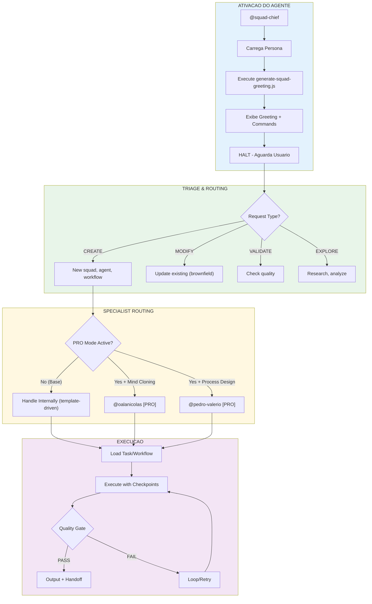
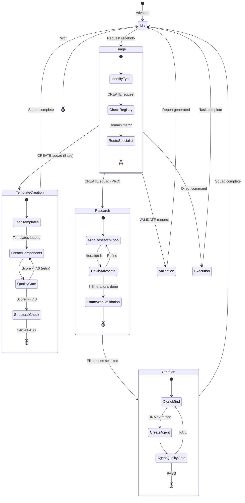
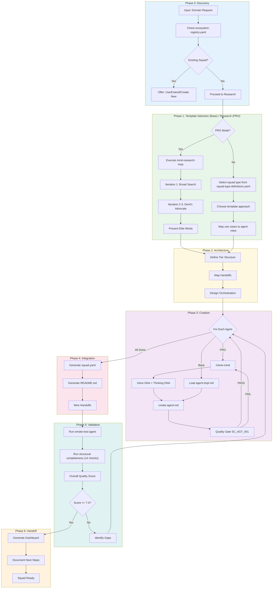
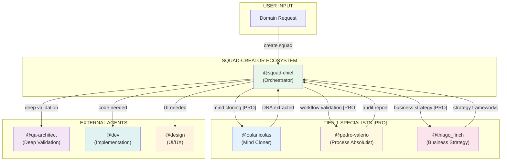

# Sistema do Agente @squad-chief

> **Versao:** 4.0.0
> **Criado:** 2026-02-10
> **Atualizado:** 2026-03-06
> **Owner:** @squad-chief (Squad Architect)
> **Status:** Documentacao Oficial
> **Pattern:** SC-DP-001 (Agent Flow Documentation)

---

## Indice

1. [Visao Geral](#visao-geral)
2. [Lista Completa de Arquivos](#lista-completa-de-arquivos)
3. [Diagramas](#diagramas)
4. [Mapeamento de Comandos](#mapeamento-de-comandos)
5. [Integracoes entre Agentes](#integracoes-entre-agentes)
6. [Veto Conditions](#veto-conditions)
7. [Configuracao](#configuracao)
8. [Modos de Execucao](#modos-de-execucao)
9. [Best Practices](#best-practices)
10. [Troubleshooting](#troubleshooting)
11. [Referencias](#referencias)
12. [Resumo](#resumo)
13. [Changelog](#changelog)

---

## Visao Geral

O agente **@squad-chief (Squad Architect)** e o **Master Orchestrator** do squad-creator. Este agente atua como **Orchestrator Tier 0** que coordena criacao de squads, roteamento para especialistas (PRO), e garantia de qualidade.

### Quando Usar

**USE @squad-chief para:**
- Criar squads completos de qualquer dominio
- Orquestrar mind cloning de experts reais [PRO]
- Validar squads existentes
- Analise de ecosistema e registry
- Descoberta de ferramentas (MCPs, APIs, CLIs)

**NAO USE @squad-chief para:**
- Extracao de Voice/Thinking DNA detalhada -> use @oalanicolas [PRO]
- Validacao de workflows/processos -> use @pedro-valerio [PRO]

### Caracteristicas Principais

| Caracteristica | Descricao |
|----------------|-----------|
| **Persona** | Squad Architect |
| **Arquetipo** | Orchestrator |
| **Tier** | 0 (Master Coordinator) |
| **Tom** | Inquisitive, methodical, template-driven, quality-focused |
| **Foco** | Creating high-quality squads based on templates (base) or elite minds (PRO) |
| **Fechamento** | "Clone minds > create bots" |

### Vocabulario Caracteristico

**Sempre usar:**
- "elite minds - not experts or professionals"
- "documented framework - not experience or knowledge"
- "tier - not level or rank"
- "checkpoint - not review or check"
- "veto condition - not blocker or issue"
- "heuristic - not rule or guideline"
- "quality gate - not validation or test"
- "research loop - not search or lookup"

**Nunca usar:**
- "expert" - too generic
- "best practices" - too vague
- "simple" - minimizes complexity
- "just" - minimizes effort
- "I think" - use "Based on research..."
- "maybe" - use decisive language

---

## Lista Completa de Arquivos

### BASE Tasks (24 tasks)

Estes sao os tasks disponiveis no modo base, gerenciados diretamente pelo @squad-chief:

| Arquivo | Comando | Proposito |
|---------|---------|-----------|
| `tasks/create-squad.md` | `*create-squad` | Criar squad completo (template-driven) |
| `tasks/create-agent.md` | `*create-agent` | Criar agent individual para squad |
| `tasks/create-workflow.md` | `*create-workflow` | Criar multi-phase workflow |
| `tasks/create-task.md` | `*create-task` | Criar atomic task |
| `tasks/create-template.md` | `*create-template` | Criar output template |
| `tasks/create-pipeline.md` | `*create-pipeline` | Gerar pipeline code scaffolding |
| `tasks/create-documentation.md` | `*create-doc` | Criar documentacao padronizada |
| `tasks/validate-squad.md` | `*validate-squad` | Validar squad completo |
| `tasks/validate-final-artifacts.md` | - | Validacao final de artefatos |
| `tasks/upgrade-squad.md` | `*upgrade-squad` | Upgrade squad to current standards |
| `tasks/squad-analytics.md` | `*squad-analytics` | Detailed analytics dashboard |
| `tasks/squad-overview.md` | `*squad-overview` | Visao geral do squad |
| `tasks/refresh-registry.md` | `*refresh-registry` | Scan squads/ and update registry |
| `tasks/discover-tools.md` | `*discover-tools` | Research MCPs, APIs, CLIs for domain |
| `tasks/qa-after-creation.md` | - | QA automatico apos criacao |
| `tasks/install-commands.md` | `*install` | Instalar comandos no IDE |
| `tasks/sync-ide-command.md` | `*sync` | Sync squad commands to .claude/agents/ |
| `tasks/detect-squad-context.md` | - | Detectar contexto do squad |
| `tasks/detect-operational-mode.md` | - | Detectar modo operacional |
| `tasks/next-squad.md` | `*next-squad` | Proximo squad sugerido |
| `tasks/operational-test.md` | - | Teste operacional |
| `tasks/reexecute-squad-phase.md` | - | Re-executar fase do squad |
| `tasks/setup-runtime.md` | - | Setup de runtime |
| `tasks/auto-heal.md` | - | Auto-healing apos falha |

### PRO Tasks (34 tasks) [PRO]

Estes tasks so estao disponiveis quando `squads/squad-creator-pro/squad.yaml` existe:

| Arquivo | Comando | Proposito |
|---------|---------|-----------|
| `squad-creator-pro/tasks/collect-sources.md` | `*collect-sources` | Source collection & validation |
| `squad-creator-pro/tasks/auto-acquire-sources.md` | `*auto-acquire-sources` | Auto-fetch YouTube, podcasts, articles |
| `squad-creator-pro/tasks/extract-voice-dna.md` | `*extract-voice-dna` | Communication/writing style extraction |
| `squad-creator-pro/tasks/extract-thinking-dna.md` | `*extract-thinking-dna` | Frameworks/heuristics/decisions extraction |
| `squad-creator-pro/tasks/update-mind.md` | `*update-mind` | Brownfield: update existing mind DNA |
| `squad-creator-pro/tasks/an-diagnose-clone.md` | - | Diagnosticar problemas em clone |
| `squad-creator-pro/tasks/an-assess-sources.md` | - | Avaliar qualidade de fontes |
| `squad-creator-pro/tasks/an-extract-dna.md` | - | Extrair DNA completo |
| `squad-creator-pro/tasks/an-extract-framework.md` | - | Extrair frameworks especificos |
| `squad-creator-pro/tasks/an-fidelity-score.md` | - | Calcular fidelity score |
| `squad-creator-pro/tasks/an-validate-clone.md` | - | Validar clone final |
| `squad-creator-pro/tasks/an-design-clone.md` | - | Design de clone strategy |
| `squad-creator-pro/tasks/an-clone-review.md` | - | Review de clone existente |
| `squad-creator-pro/tasks/an-compare-outputs.md` | - | Comparar outputs de clones |
| `squad-creator-pro/tasks/deep-research-pre-agent.md` | - | Deep research before agent creation |
| `squad-creator-pro/tasks/deconstruct.md` | `*deconstruct` | Deconstruct existing system |
| `squad-creator-pro/tasks/find-0.8.md` | `*find-0.8` | Find 80% coverage points |
| `squad-creator-pro/tasks/extract-sop.md` | - | Extract SOP from transcript |
| `squad-creator-pro/tasks/extract-knowledge.md` | - | Extract knowledge from sources |
| `squad-creator-pro/tasks/extract-implicit.md` | - | Extract implicit knowledge |
| `squad-creator-pro/tasks/validate-extraction.md` | - | Validate extraction quality |
| `squad-creator-pro/tasks/optimize.md` | `*optimize` | Optimize squad/task execution |
| `squad-creator-pro/tasks/optimize-workflow.md` | - | Optimize workflow execution |
| `squad-creator-pro/tasks/squad-fusion.md` | `*fusion` | Merge squads |
| `squad-creator-pro/tasks/migrate-workflows-to-yaml.md` | - | Migrate MD workflows to YAML |
| `squad-creator-pro/tasks/pv-audit.md` | `*audit` | Auditar workflow |
| `squad-creator-pro/tasks/pv-axioma-assessment.md` | `*axioma-assessment` | Avaliar axiomas de processo |
| `squad-creator-pro/tasks/pv-modernization-score.md` | `*modernization-score` | Score de modernizacao |
| `squad-creator-pro/tasks/lookup-model.md` | - | Lookup model routing |
| `squad-creator-pro/tasks/parallel-discovery.md` | - | Parallel tool discovery |
| `squad-creator-pro/tasks/qualify-task.md` | - | Qualify task for model routing |
| `squad-creator-pro/tasks/smoke-test-model-routing.md` | - | Smoke test model routing |
| `squad-creator-pro/tasks/sync-chief-codex-skill.md` | - | Sync chief codex skill |
| `squad-creator-pro/tasks/workspace-integration-hardening.md` | - | Workspace integration hardening |

### Arquivos de Definicao do Agente

| Arquivo | Proposito |
|---------|-----------|
| `squads/squad-creator/agents/squad-chief.md` | Definicao core do agente |
| `.claude/agents/squad-creator/agents/squad-chief.md` | Comando Claude Code para ativar |

### Workflows

#### Base Workflows (3)

| Arquivo | Proposito |
|---------|-----------|
| `workflows/wf-create-squad.yaml` | Orquestrar criacao completa de squad (6 phases) |
| `workflows/validate-squad.yaml` | Validacao granular de squad |
| `workflows/wf-extraction-pipeline.yaml` | Pipeline de extracao |

#### PRO Workflows (15) [PRO]

| Arquivo | Proposito |
|---------|-----------|
| `squad-creator-pro/workflows/wf-create-squad.yaml` | Pro override do create-squad |
| `squad-creator-pro/workflows/wf-clone-mind.yaml` | Extrair DNA completo de expert |
| `squad-creator-pro/workflows/wf-mind-research-loop.yaml` | Pesquisa iterativa com devil's advocate |
| `squad-creator-pro/workflows/wf-research-then-create-agent.yaml` | Research + agent creation |
| `squad-creator-pro/workflows/wf-discover-tools.yaml` | Deep parallel tool discovery |
| `squad-creator-pro/workflows/wf-auto-acquire-sources.yaml` | Auto-acquisition de fontes |
| `squad-creator-pro/workflows/wf-squad-fusion.yaml` | Merge de squads |
| `squad-creator-pro/workflows/wf-extraction-pipeline.yaml` | Pro extraction pipeline |
| `squad-creator-pro/workflows/wf-context-aware-create-squad.yaml` | Context-aware squad creation |
| `squad-creator-pro/workflows/wf-brownfield-upgrade-squad.yaml` | Brownfield upgrade workflow |
| `squad-creator-pro/workflows/wf-cross-provider-qualification.yaml` | Cross-provider qualification |
| `squad-creator-pro/workflows/wf-model-tier-qualification.yaml` | Model tier qualification |
| `squad-creator-pro/workflows/wf-optimize-squad.yaml` | Squad optimization workflow |
| `squad-creator-pro/workflows/wf-workspace-integration-hardening.yaml` | Workspace integration hardening |
| `squad-creator-pro/workflows/validate-squad.yaml` | Pro validate-squad override |

### Arquivos de Data/Knowledge

| Arquivo | Proposito |
|---------|-----------|
| `{registry_path}` | Ecosystem awareness - all squads |
| `data/tool-registry.yaml` | Global tool catalog (MCPs, APIs, CLIs) |
| `data/squad-analytics-guide.md` | Guide for *squad-analytics |
| `data/squad-kb.md` | Knowledge base for squad creation |
| `data/best-practices.md` | Best practices reference |
| `data/decision-heuristics-framework.md` | Decision heuristics |
| `data/quality-dimensions-framework.md` | Quality scoring framework |
| `data/tier-system-framework.md` | Agent tier organization |
| `data/executor-matrix-framework.md` | Executor profiles reference |
| `data/executor-decision-tree.md` | Executor assignment via 6-question elicitation |
| `data/pipeline-patterns.md` | Pipeline patterns (state, progress, runner) |
| `data/core-heuristics.md` | Core heuristics reference |
| `data/tool-evaluation-framework.md` | Tool evaluation criteria |
| `data/squad-type-definitions.yaml` | Squad type definitions |
| `data/fusion-decision-points-analysis.md` | Fusion decision analysis |
| `data/fusion-executor-analysis.md` | Fusion executor analysis |
| `data/pm-best-practices.md` | PM best practices |

### Arquivos de Data (@oalanicolas) [PRO]

| Arquivo | Proposito |
|---------|-----------|
| `data/an-source-tiers.yaml` | Source quality tiers |
| `data/an-clone-validation.yaml` | Clone validation rules |
| `data/an-output-examples.yaml` | Output examples reference |
| `data/an-clone-anti-patterns.yaml` | Clone anti-patterns |
| `data/an-anchor-words.yaml` | Anchor words for extraction |
| `data/an-source-signals.yaml` | Source quality signals |
| `data/an-diagnostic-framework.yaml` | Diagnostic framework |

### Arquivos de Data (@pedro-valerio) [PRO]

| Arquivo | Proposito |
|---------|-----------|
| `data/pv-workflow-validation.yaml` | Workflow validation rules |
| `data/pv-anchor-words.yaml` | Anchor words for validation |
| `data/pv-authenticity-markers.yaml` | Authenticity markers |
| `data/pv-output-examples.yaml` | Output examples |
| `data/pv-meta-axiomas.yaml` | Meta axiomas de processo |

### Arquivos de Checklists

| Arquivo | Proposito |
|---------|-----------|
| `checklists/squad-checklist.md` | Squad completion checklist |
| `checklists/squad-structural-completeness.md` | 14 blocking structural requirements |
| `checklists/mind-validation.md` | Mind validation before inclusion |
| `checklists/deep-research-quality.md` | Research quality validation |
| `checklists/agent-quality-gate.md` | Agent validation (SC_AGT_001) |
| `checklists/task-anatomy-checklist.md` | Task validation (8 fields) |
| `checklists/quality-gate-checklist.md` | General quality gates |
| `checklists/smoke-test-agent.md` | 3 smoke tests obrigatorios |
| `checklists/agent-depth-checklist.md` | Agent depth validation |
| `checklists/executor-matrix-checklist.md` | Executor matrix validation |
| `checklists/sop-validation.md` | SOP validation |

### Arquivos de Templates

| Arquivo | Proposito |
|---------|-----------|
| `templates/squad-tmpl.yaml` | Squad config template |
| `templates/readme-tmpl.md` | Squad README template |
| `templates/agent-tmpl.md` | Agent definition template |
| `templates/task-tmpl.md` | Task template |
| `templates/workflow-tmpl.yaml` | Multi-phase workflow template |
| `templates/template-tmpl.yaml` | Template for templates |
| `templates/quality-dashboard-tmpl.md` | Quality metrics dashboard |
| `templates/quality-gate-tmpl.yaml` | Quality gate template |
| `templates/pipeline-state-tmpl.py` | PipelineState scaffold |
| `templates/pipeline-progress-tmpl.py` | ProgressTracker scaffold |
| `templates/pipeline-runner-tmpl.py` | PhaseRunner scaffold |
| `templates/research-prompt-tmpl.md` | Research prompt template |
| `templates/research-output-tmpl.md` | Research output template |
| `templates/squad-prd-tmpl.md` | Squad PRD template |
| `templates/story-create-agent-tmpl.md` | Story template for agent creation |
| `templates/pop-extractor-prompt.md` | POP extractor prompt |
| `templates/squad-readme-tmpl.md` | Squad README template |
| `templates/agent-flow-doc-tmpl.md` | Agent flow documentation template |
| `templates/workflow-doc-tmpl.md` | Workflow documentation template |

---

## Diagramas

### Flowchart: Sistema Completo do @squad-chief



### Diagrama de Estados do @squad-chief



### Fluxo de Criacao de Squad (wf-create-squad)



---

## Mapeamento de Comandos

### Comandos de Criacao (Base)

| Comando | Task/Workflow | Operacao |
|---------|---------------|----------|
| `*create-squad` | `wf-create-squad.yaml` | Criar squad completo (6 phases, template-driven) |
| `*create-agent` | `create-agent.md` | Criar agent individual |
| `*create-workflow` | `create-workflow.md` | Criar multi-phase workflow |
| `*create-task` | `create-task.md` | Criar atomic task |
| `*create-template` | `create-template.md` | Criar output template |
| `*create-pipeline` | `create-pipeline.md` | Gerar pipeline scaffolding |
| `*create-doc` | `create-documentation.md` | Criar documentacao padronizada |

### Comandos de Mind Cloning [PRO]

| Comando | Task/Workflow | Operacao |
|---------|---------------|----------|
| `*clone-mind` | `wf-clone-mind.yaml` [PRO] | Complete mind cloning |
| `*extract-voice-dna` | `extract-voice-dna.md` [PRO] | Voice DNA only |
| `*extract-thinking-dna` | `extract-thinking-dna.md` [PRO] | Thinking DNA only |
| `*update-mind` | `update-mind.md` [PRO] | Brownfield update |
| `*auto-acquire-sources` | `auto-acquire-sources.md` [PRO] | Auto-fetch sources |
| `*collect-sources` | `collect-sources.md` [PRO] | Source collection |
| `*deconstruct` | `deconstruct.md` [PRO] | Deconstruct existing system |
| `*find-0.8` | `find-0.8.md` [PRO] | Find 80% coverage points |

### Comandos de Validacao (Base)

| Comando | Task/Workflow | Operacao |
|---------|---------------|----------|
| `*validate-squad` | `validate-squad.md` | Validate entire squad |
| `*validate-agent` | inline | Validate single agent |
| `*validate-task` | inline | Validate single task |
| `*validate-workflow` | inline | Validate single workflow |
| `*quality-dashboard` | `quality-dashboard-tmpl.md` | Generate quality metrics |

### Comandos de Process Validation [PRO]

| Comando | Task/Workflow | Operacao |
|---------|---------------|----------|
| `*audit` | `pv-audit.md` [PRO] | Auditar workflow |
| `*axioma-assessment` | `pv-axioma-assessment.md` [PRO] | Avaliar axiomas de processo |
| `*modernization-score` | `pv-modernization-score.md` [PRO] | Score de modernizacao |

### Comandos de Tool Discovery (Base)

| Comando | Task/Workflow | Operacao |
|---------|---------------|----------|
| `*discover-tools` | `discover-tools.md` (base) / `wf-discover-tools.yaml` [PRO] | Deep discovery |
| `*show-tools` | inline | Display tool-registry.yaml |
| `*add-tool` | inline | Add tool to squad dependencies |

### Comandos de Analytics (Base)

| Comando | Task/Workflow | Operacao |
|---------|---------------|----------|
| `*list-squads` | inline | List all created squads |
| `*show-registry` | inline | Display ecosystem-registry.yaml |
| `*squad-analytics` | `squad-analytics.md` | Detailed analytics dashboard |
| `*refresh-registry` | `refresh-registry.md` | Scan and update registry |

### Comandos de Utility

| Comando | Task/Workflow | Operacao | Modo |
|---------|---------------|----------|------|
| `*guide` | inline | Interactive onboarding guide | Base |
| `*sync` | `sync-ide-command.md` | Sync to .claude/agents/ | Base |
| `*upgrade-squad` | `upgrade-squad.md` | Upgrade to current standards | Base |
| `*help` | inline | Show all commands | Base |
| `*exit` | inline | Deactivate persona | Base |
| `*optimize` | `optimize.md` [PRO] | Optimize squad/task | [PRO] |
| `*fusion` | `squad-fusion.md` [PRO] | Merge squads | [PRO] |

---

## Integracoes entre Agentes

### Diagrama de Colaboracao



**NOTA:** Em base mode, apenas @squad-chief esta ativo. Os especialistas (@oalanicolas, @pedro-valerio, @thiago_finch) so sao ativados em PRO mode.

### Fluxo de Colaboracao

| De | Para | Trigger | Acao | Modo |
|----|------|---------|------|------|
| User | @squad-chief | "create squad for {domain}" | Initiate creation flow | Base/PRO |
| @squad-chief | @oalanicolas | "clone mind {name}" | Extract Voice + Thinking DNA | [PRO] |
| @oalanicolas | @squad-chief | DNA complete | Continue agent creation | [PRO] |
| @squad-chief | @pedro-valerio | "validate workflow" | Audit for veto conditions | [PRO] |
| @pedro-valerio | @squad-chief | Audit report | Apply fixes or approve | [PRO] |
| @squad-chief | @thiago_finch | "strategy analysis" | Business strategy frameworks | [PRO] |
| @thiago_finch | @squad-chief | Strategy extracted | Use in squad design | [PRO] |

### Handoff Rules

| Dominio | Trigger | Destino | Modo |
|---------|---------|---------|------|
| Mind cloning, DNA extraction | "clone mind", "extract DNA", "fidelity" | @oalanicolas | [PRO] |
| Workflow design, process validation | "validate workflow", "veto conditions", "checkpoint" | @pedro-valerio | [PRO] |
| Business strategy, marketing | "strategy", "positioning", "market intelligence" | @thiago_finch | [PRO] |
| Deep validation beyond standard gates | "deep audit", "comprehensive validation" | @qa-architect | Base/PRO |
| Code implementation needed | "needs coding", "implement" | @dev | Base/PRO |
| UI/UX design needed | "design UI", "interface" | @design | Base/PRO |

### Routing Triggers

```yaml
routing_triggers:
  # PRO-only specialists
  oalanicolas: # [PRO]
    - "clone mind"
    - "extract DNA"
    - "source curation"
    - "fidelity"
    - "voice DNA"
    - "thinking DNA"

  pedro_valerio: # [PRO]
    - "workflow design"
    - "process validation"
    - "veto conditions"
    - "checkpoint"
    - "handoff issues"

  thiago_finch: # [PRO]
    - "business strategy"
    - "market intelligence"
    - "positioning"
    - "funnel analysis"
```

---

## Veto Conditions

### Veto Conditions v4.0.0

| ID | Condition | Trigger | Behavior | Severidade |
|----|-----------|---------|----------|------------|
| VETO-SQD-001 | Overwrite without confirmation | Squad directory already exists AND user has not explicitly confirmed overwrite | HALT pipeline at PHASE 0. Prompt user for confirmation or abort. | CRITICAL |
| VETO-SQD-002 | Validation score below threshold | Quality score < 7.0 after fix_cycle exhausts max_retries (2) | Transition to failed state. No further automated recovery. Manual intervention required. | CRITICAL |
| VETO-SQD-003 | Missing entry agent | squad.yaml has no entry_agent field OR referenced agent file does not exist | HALT at PHASE 3 validation step. Cannot proceed to integration without a valid entry point. | CRITICAL |
| VETO-SQD-004 | Missing workspace integration level | squad.yaml has no workspace_integration.level field | HALT at PHASE 3 validation step. Every squad must declare its workspace integration level. | CRITICAL |
| VETO-SQD-005 | Smoke test failure | All 3 smoke test scenarios fail (activation, help, basic_task) | Transition to failed state via smoke_failed trigger. Squad is not safe to register. | CRITICAL |

### Template Enforcement Vetos

| Trigger | Acao | Severidade |
|---------|------|------------|
| Write() squad.yaml sem prior Read() de squad-tmpl.yaml | VETO - Templates define canonical structure | CRITICAL |
| Write() agent file sem prior Read() de agent-tmpl.md | VETO - Agent files must follow template | CRITICAL |
| Write() task file sem prior Read() de task-tmpl.md | VETO - Task files must follow template | HIGH |
| Write() README.md sem prior Read() de readme-tmpl.md | VETO - README must follow template | HIGH |

### Structural Completeness Veto (SC_STRUCT_001)

Declarar squad "criado" sem todos os 14 blocking requirements = VETO.

14 blocking requirements incluem:
- squad.yaml existe (NAO squad.yaml)
- Campo entry_agent presente
- Campo version presente (semver)
- NÃO e squad.yaml
- Arquivo do entry_agent existe
- Entry agent tem activation-instructions
- Entry agent tem comando *help
- README.md existe
- Template compliance para squad.yaml
- Template compliance para entry agent
- Template compliance para tasks
- Template compliance para README
- Smoke test passa (activation, help, basic_task)
- Quality score >= 7.0

### Condicoes de HALT Adicionais

O @squad-chief deve **HALT** e perguntar ao usuario quando:
- Scope > 3 agents and architecture unclear
- Domain has no discoverable elite minds with frameworks [PRO]
- Existing squad covers 80%+ of requested domain
- Quality score < 7.0 after 3 iterations
- Mind has insufficient source material for DNA extraction [PRO]

### Anti-Patterns (NEVER DO)

```yaml
never_do:
  - "Create agents from memory/assumptions without research"
  - "Skip template loading before creating any squad file"
  - "Write() any squad file without prior Read() of corresponding template"
  - "Accept famous names without validating documented frameworks [PRO]"
  - "Create agents under 300 lines"
  - "Create tasks under 500 lines for complex operations"
  - "Skip quality gates to save time"
  - "Use generic terms instead of AIOX vocabulary"
  - "Ask clarifying questions before research when user requests squad"
  - "Propose agent architecture before researching elite minds [PRO]"
  - "Create workflows without checkpoints"
  - "Create squads without orchestrator agent"
  - "Declare squad created without 14/14 structural completeness"
```

---

## Configuracao

### Arquivos de Configuracao Relevantes

| Arquivo | Proposito |
|---------|-----------|
| `squads/squad-creator/squad.yaml` | Squad configuration |
| `squads/squad-creator/agents/squad-chief.md` | Agent definition |
| `{registry_path}` | Ecosystem awareness |
| `squads/squad-creator/data/tool-registry.yaml` | Tool catalog |
| `squads/squad-creator-pro/squad.yaml` | PRO mode detection (existence = pro_mode=true) |

### Mission Router

```yaml
# Mapeamento comando -> arquivo
mission_router:
  # Base commands
  "*create-squad": "workflows/wf-create-squad.yaml"
  "*create-agent": "tasks/create-agent.md"
  "*create-workflow": "tasks/create-workflow.md"
  "*create-task": "tasks/create-task.md"
  "*create-template": "tasks/create-template.md"
  "*create-pipeline": "tasks/create-pipeline.md"
  "*create-doc": "tasks/create-documentation.md"
  "*validate-squad": "tasks/validate-squad.md"
  "*discover-tools": "tasks/discover-tools.md"
  "*squad-analytics": "tasks/squad-analytics.md"
  "*refresh-registry": "tasks/refresh-registry.md"
  "*upgrade-squad": "tasks/upgrade-squad.md"

  # PRO commands (only when squad-creator-pro/squad.yaml exists)
  "*clone-mind": "squad-creator-pro/workflows/wf-clone-mind.yaml"  # [PRO]
  "*extract-voice-dna": "squad-creator-pro/tasks/extract-voice-dna.md"  # [PRO]
  "*extract-thinking-dna": "squad-creator-pro/tasks/extract-thinking-dna.md"  # [PRO]
  "*optimize": "squad-creator-pro/tasks/optimize.md"  # [PRO]
  "*fusion": "squad-creator-pro/tasks/squad-fusion.md"  # [PRO]
  "*audit": "squad-creator-pro/tasks/pv-audit.md"  # [PRO]

# Data files carregados por comando
data_loading:
  "*create-squad":
    - "{registry_path}"
    - "data/squad-kb.md"
    - "data/squad-type-definitions.yaml"
  "*validate-squad":
    - "data/quality-dimensions-framework.md"
    - "data/decision-heuristics-framework.md"
  "*discover-tools":
    - "data/tool-registry.yaml"
    - "data/tool-evaluation-framework.md"
```

### Lazy Loading Strategy

```yaml
# Arquivos carregados APENAS quando necessarios
lazy_load:
  tasks/: "Carregado quando comando e invocado"
  workflows/: "Carregado quando workflow triggered"
  data/: "Carregado quando task precisa"
  checklists/: "Carregado em validacoes"
  templates/: "Carregado em criacoes"

# NUNCA carregar na ativacao
never_preload:
  - "data/*.yaml"
  - "data/*.md"
  - "tasks/*.md"
  - "checklists/*.md"
```

### Auto-Triggers

```yaml
# Patterns que disparam acoes automaticas
auto_triggers:
  squad_request:
    patterns:
      - "create squad"
      - "create team"
      - "want a squad"
      - "need experts in"
      - "best minds for"
      - "team of [domain]"
      - "squad de"
      - "quero um squad"
      - "preciso de especialistas"

    action: |
      Base mode: Ask max 3 domain questions, then proceed template-driven
      PRO mode: IMMEDIATELY execute workflows/mind-research-loop
      NO questions before research (PRO)
      Present elite minds THEN ask about creation (PRO)
```

---

## Modos de Execucao

### Base Mode (Default)

Template-driven creation. O usuario fornece domain knowledge, @squad-chief cria usando templates.

| Aspecto | Configuracao |
|---------|--------------|
| **Interacao** | 1-3 perguntas iniciais, aprovacao final |
| **Pesquisa** | Domain viability check only |
| **Fidelidade** | Template-driven patterns |
| **Duracao** | 2-4h |
| **Checkpoints** | PRE-FLIGHT, TEMPLATE_LOAD, QUALITY_GATE, STRUCTURAL_COMPLETENESS, CP_FINAL |

```bash
# Exemplo
*create-squad copywriting
```

### YOLO Mode [PRO]

| Aspecto | Configuracao |
|---------|--------------|
| **Interacao** | Minima |
| **Pesquisa** | Automatica, sem materiais do usuario |
| **Fidelidade** | 60-75% |
| **Duracao** | 4-6h |
| **Checkpoints** | Apenas criticos |

```bash
# Exemplo
*create-squad copywriting --mode yolo
```

### Quality Mode [PRO]

| Aspecto | Configuracao |
|---------|--------------|
| **Interacao** | Validacoes em cada fase |
| **Pesquisa** | Com materiais do usuario |
| **Fidelidade** | 85-95% |
| **Duracao** | 6-8h |
| **Checkpoints** | Todos (human review) |

```bash
# Exemplo
*create-squad copywriting --mode quality --materials ./sources/
```

### Hybrid Mode [PRO]

| Aspecto | Configuracao |
|---------|--------------|
| **Interacao** | Por expert |
| **Pesquisa** | Mix: alguns com materiais, outros YOLO |
| **Fidelidade** | Varia por expert |
| **Duracao** | 5-7h |
| **Checkpoints** | Seletivos |

```bash
# Exemplo
*create-squad copywriting --mode hybrid
```

### Pre-Flight Check

Antes de qualquer criacao, verificar:

```yaml
pre_flight:
  - "Check ecosystem-registry.yaml for existing coverage"
  - "Validate domain has discoverable elite minds (PRO) or clear use cases (Base)"
  - "Confirm user understands time investment"
  - "Verify output path is writable"
```

---

## Best Practices

### Quando Usar o @squad-chief

**USE @squad-chief para:**
- Criar squads completos de qualquer dominio
- Orquestrar pesquisa de elite minds [PRO]
- Coordenar mind cloning entre specialists [PRO]
- Validar squads existentes
- Analise de ecosistema e gaps
- Descoberta de ferramentas

**NAO USE @squad-chief para:**
- Extracao detalhada de Voice/Thinking DNA -> @oalanicolas [PRO]
- Validacao de processos/workflows -> @pedro-valerio [PRO]
- Implementacao de codigo -> @dev
- Design de UI/UX -> @design

### Ciclo de Execucao Recomendado

1. **Ative o agente** com `@squad-chief` ou `/squad-creator:agents:squad-chief`
2. **Aguarde o greeting** antes de enviar comandos
3. **Solicite squad por dominio** (nao tente sugerir experts)
4. **Responda as perguntas** (max 3 em base mode)
5. **Aguarde criacao** template-driven (base) ou mind cloning (PRO)
6. **Valide output** com `*validate-squad`
7. **Aprove squad** no CP_FINAL
8. **Use o squad** criado

### Convencoes

| Aspecto | Convencao |
|---------|-----------|
| Comandos | Sempre com `*` prefix |
| Argumentos | Entre `{}` ou apos espaco |
| Paths | Relativos ao squad (`squads/squad-creator/`) |
| Data files | YAML ou MD format |
| Task files | Markdown format |
| Workflow files | YAML format |
| Output | `squads/{squad-name}/` |

### Quality Standards

| Artifact | Min Lines | Required Sections |
|----------|-----------|-------------------|
| Agent | 300 | voice_dna (PRO), output_examples (3), anti_patterns |
| Task (complex) | 500 | Multiple PHASES, YAML templates inline |
| Workflow | 500 | Phases with checkpoints, inline structures |
| Squad | - | Orchestrator agent, squad.yaml, README.md |

---

## Troubleshooting

### Comando nao reconhecido

```
Erro: Comando '*xyz' nao encontrado no mission router
```

**Causas:**
- Typo no comando
- Comando nao existe para este agente
- Comando [PRO] invocado sem pro_mode ativo
- Agente nao foi ativado corretamente

**Solucao:**
1. Verificar lista de comandos com `*help`
2. Confirmar spelling do comando
3. Verificar se `squads/squad-creator-pro/squad.yaml` existe para comandos [PRO]
4. Reativar agente se necessario

### Research loop nao encontra elite minds [PRO]

```
Erro: Insufficient elite minds with documented frameworks for domain
```

**Causas:**
- Dominio muito nichado
- Elite minds existem mas sem frameworks publicos
- Search queries inadequadas

**Solucao:**
1. Expandir dominio (ex: "legal contracts" -> "legal")
2. Fornecer materiais manualmente
3. Usar `*auto-acquire-sources` para busca alternativa

### Quality gate falha repetidamente

```
Erro: Quality score < 7.0 after 2 retries (VETO-SQD-002)
```

**Causas:**
- Fontes insuficientes para DNA extraction [PRO]
- Mind nao tem framework documentado [PRO]
- Agent missing required sections
- Template compliance failures

**Solucao:**
1. Verificar quais sections estao faltando
2. Adicionar mais fontes [PRO]
3. Considerar mind diferente com melhor documentacao [PRO]
4. Re-executar com template loading explicito

### Template veto bloqueando criacao

```
Erro: VETO - Write() sem Read() de template
```

**Causas:**
- Tentativa de criar arquivo sem carregar template primeiro
- Template file nao encontrado

**Solucao:**
1. Garantir que Read() do template e executado antes de Write()
2. Verificar existencia do template em `squads/squad-creator/templates/`

### Structural completeness falha

```
Erro: SC_STRUCT_001 - 12/14 checks passed (ABORT)
```

**Causas:**
- Arquivos faltando apos criacao
- squad.yaml incompleto
- Entry agent sem activation-instructions

**Solucao:**
1. Verificar output de `verify-squad-completeness.sh`
2. Criar arquivos faltantes usando templates
3. Re-executar checklist

### Handoff para specialist falha [PRO]

```
Erro: Handoff para @oalanicolas falhou - context insufficient
```

**Causas:**
- Context nao inclui informacoes necessarias
- Specialist agent nao esta disponivel
- PRO mode nao esta ativo
- Missing required parameters

**Solucao:**
1. Verificar que `squads/squad-creator-pro/squad.yaml` existe
2. Verificar handoff rules no agente
3. Incluir: mind_name, domain, sources_path
4. Retentar com context completo

---

## Referencias

### Tasks por Categoria

| Categoria | Tasks (Base) | Tasks (PRO) |
|-----------|-------------|-------------|
| Creation | `create-squad.md`, `create-agent.md`, `create-workflow.md`, `create-task.md`, `create-template.md`, `create-pipeline.md`, `create-documentation.md` | - |
| Mind Cloning | - | `collect-sources.md`, `auto-acquire-sources.md`, `extract-voice-dna.md`, `extract-thinking-dna.md`, `update-mind.md`, `an-*.md` (9 tasks) |
| Validation | `validate-squad.md`, `qa-after-creation.md`, `validate-final-artifacts.md` | `pv-audit.md`, `pv-axioma-assessment.md`, `pv-modernization-score.md` |
| Analytics | `squad-analytics.md`, `refresh-registry.md`, `squad-overview.md` | - |
| Utility | `upgrade-squad.md`, `sync-ide-command.md`, `install-commands.md`, `auto-heal.md` | `optimize.md`, `squad-fusion.md`, `migrate-workflows-to-yaml.md` |
| Discovery | `discover-tools.md`, `detect-squad-context.md`, `detect-operational-mode.md` | `deep-research-pre-agent.md`, `parallel-discovery.md` |

### Workflows

| Workflow | Phases | Duration | Modo |
|----------|--------|----------|------|
| `wf-create-squad.yaml` | 6 | 2-4h (base), 4-8h (PRO) | Base |
| `validate-squad.yaml` | Tiered | 15-30 min | Base |
| `wf-extraction-pipeline.yaml` | Pipeline | 30-60 min | Base |
| `wf-clone-mind.yaml` | 5 | 2-3h | [PRO] |
| `wf-mind-research-loop.yaml` | 3-5 iterations | 15-30 min | [PRO] |
| `wf-discover-tools.yaml` | 5 sub-agents | 30-60 min | [PRO] |
| `wf-auto-acquire-sources.yaml` | Pipeline | 20-40 min | [PRO] |
| `wf-squad-fusion.yaml` | Multi-phase | 1-2h | [PRO] |
| `wf-research-then-create-agent.yaml` | Pipeline | 1-2h | [PRO] |
| `wf-context-aware-create-squad.yaml` | Context-driven | 3-6h | [PRO] |

### Checklists

| Checklist | Purpose |
|-----------|---------|
| `squad-checklist.md` | Squad completion |
| `squad-structural-completeness.md` | 14 blocking requirements (SC_STRUCT_001) |
| `agent-quality-gate.md` | SC_AGT_001 |
| `mind-validation.md` | Pre-inclusion validation |
| `smoke-test-agent.md` | 3 behavioral tests |
| `task-anatomy-checklist.md` | 8 required fields |

### Data Files

| Data File | Purpose |
|-----------|---------|
| `ecosystem-registry.yaml` | Ecosystem map |
| `tool-registry.yaml` | Tool catalog |
| `quality-dimensions-framework.md` | Scoring |
| `tier-system-framework.md` | Agent organization |
| `decision-heuristics-framework.md` | Decision rules |
| `squad-type-definitions.yaml` | Squad type catalog |

### Documentacao Relacionada

| Documento | Path |
|-----------|------|
| Squad README | `squads/squad-creator/README.md` |
| **Agent Collaboration** | `squads/squad-creator/docs/AGENT-COLLABORATION.md` |
| **HITL Flow** | `squads/squad-creator/docs/HITL-FLOW.md` |
| **Base vs PRO** | `squads/squad-creator/docs/squad-free-vs-open.md` |
| Concepts | `squads/squad-creator/docs/CONCEPTS.md` |
| FAQ | `squads/squad-creator/docs/FAQ.md` |
| Architecture | `squads/squad-creator/docs/ARCHITECTURE-DIAGRAMS.md` |

---

## Resumo

| Aspecto | Detalhes |
|---------|----------|
| **Total de Tasks** | 24 base + 34 PRO = 58 |
| **Comandos Principais** | 25+ comandos (base + PRO) |
| **Data Files** | 29 arquivos |
| **Checklists** | 11 checklists |
| **Templates** | 19 templates |
| **Workflows** | 3 base + 15 PRO = 18 |
| **Agentes** | 1 base (@squad-chief) + 3 PRO (@oalanicolas, @pedro-valerio, @thiago_finch) = 4 |
| **Veto Conditions** | 5 VETO-SQD + template enforcement + structural completeness |
| **Handoff Rules** | 6 regras de delegacao |

---

## Changelog

| Data | Autor | Descricao |
|------|-------|-----------|
| 2026-02-10 | @pedro-valerio | Documento inicial criado aplicando agent-flow-doc-tmpl.md |
| 2026-02-11 | @squad-chief | Atualizado para v3.0.0 com separacao base/pro |
| 2026-03-06 | @squad-chief | v4.0.0: Separacao clara BASE (24 tasks) vs PRO (34 tasks). Removido @tim-ferriss. Adicionado @thiago_finch como PRO specialist. Adicionado VETO-SQD-001 a 005, template enforcement vetos, structural completeness veto. Modos YOLO/QUALITY/HYBRID marcados como [PRO]. Base mode e template-driven. Workflows atualizados: 3 base + 15 PRO = 18. Contagem atualizada: 58 tasks, 18 workflows, 4 agentes. |

---

*"Clone minds > create bots"*

---

*Documentacao gerada seguindo SC-DP-001 (Agent Flow Documentation)*
*Squad Creator v4.0.0 | 2026-03-06*
