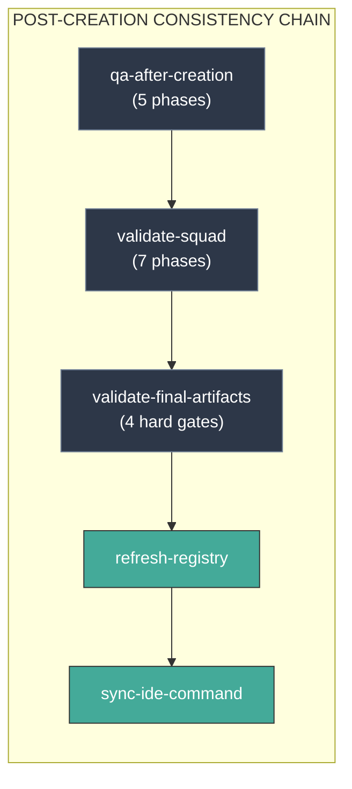
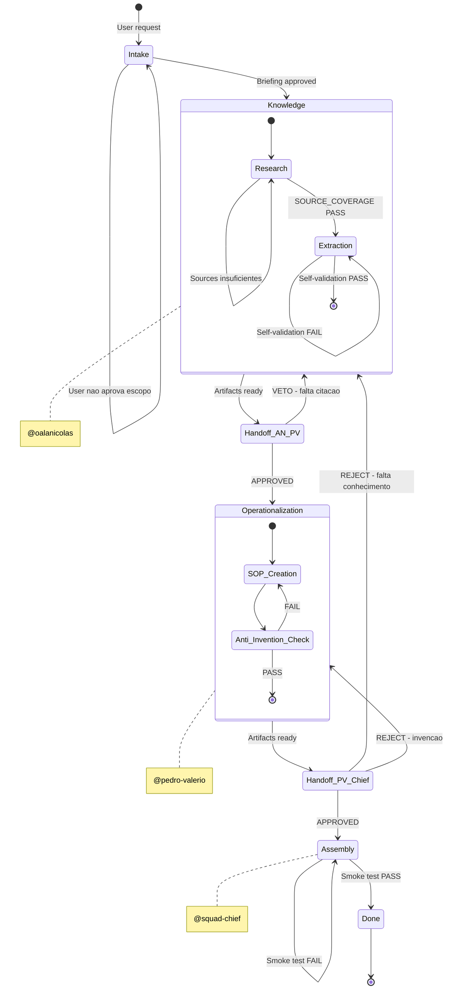
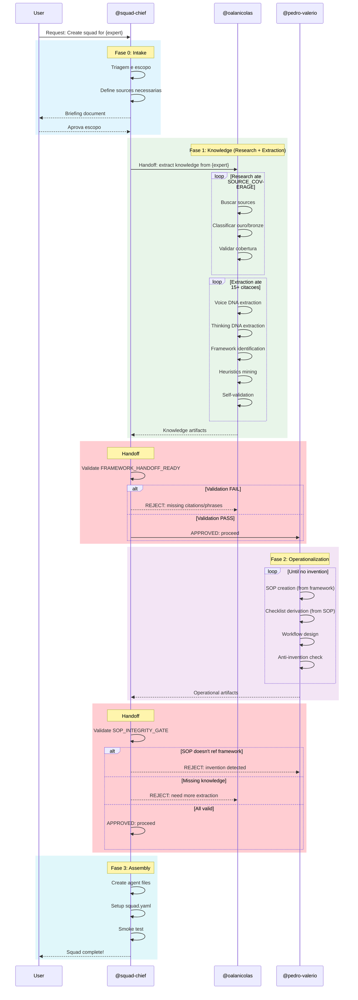
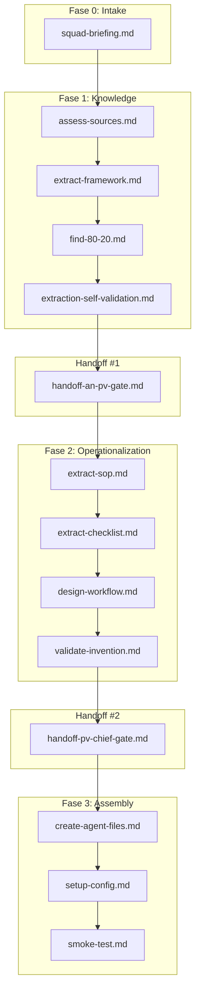
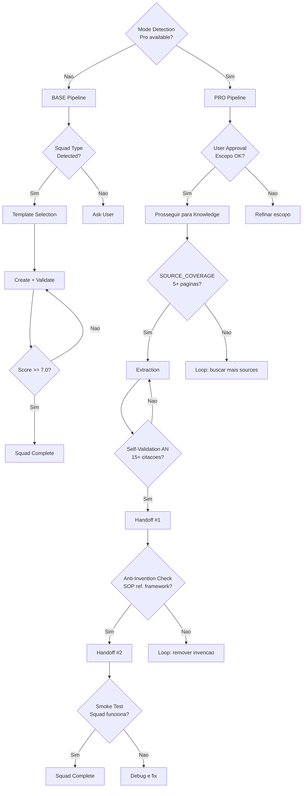
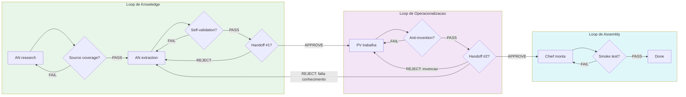

# Workflow: Squad Creation Pipeline

**Versao:** 4.0.0
**Tipo:** Workflow de Criacao de Squads
**Autores:** @squad-chief (Base) + @oalanicolas (Knowledge Architect) + @pedro-valerio (Process Architect) [PRO]
**Data de Criacao:** 2026-02-10
**Ultima Atualizacao:** 2026-03-06
**Tags:** squad, creation, extraction, operationalization, pipeline, base, pro

---

## Visao Geral

O **Squad Creation Pipeline** e o workflow completo para criacao de squads. Na v4.0.0, opera em dois modos distintos detectados no boot:

- **BASE MODE:** squad-chief sozinho, criacao template-driven usando conhecimento do dominio do usuario
- **PRO MODE:** arquitetura de 4 agentes com separacao Knowledge/Operationalization

### Objetivo

Garantir que squads sejam criados com:
1. **Conhecimento autentico** - Extraido de fontes reais, nao inventado
2. **Processos a prova de erro** - Operacionalizados com veto conditions
3. **Rastreabilidade completa** - Citacoes, fontes, e validacoes documentadas

---

## Base/Pro Modes

### Deteccao de Modo (Boot Time)

```
IF squads/squad-creator-pro/squad.yaml EXISTS
  AND pro_mode=true
THEN → PRO MODE (4 agents, 53+ tasks, 10+ workflows)
ELSE → BASE MODE (1 agent, 24 tasks, 3 workflows)
```

### BASE MODE

O squad-chief opera sozinho, usando templates e conhecimento de dominio fornecido pelo usuario para criar squads completos.

| Aspecto | Detalhe |
|---------|---------|
| **Agente** | squad-chief (unico) |
| **Tasks** | 24 tasks base |
| **Workflows** | 3 (create-squad.yaml, validate-squad.yaml, wf-create-squad.yaml) |
| **Checklists** | 9 checklists |
| **Criacao** | Template-driven via squad-type-definitions.yaml |
| **Validacao** | validate-squad >= 7.0 (7 fases) |

**Quando usar BASE:**
- Squads de pipeline/processos (nao precisam de mind cloning)
- Squads domain-specific sem experts especificos
- Prototipagem rapida de squads funcionais
- Quando squad-creator-pro nao esta instalado

### PRO MODE

Arquitetura de 4 agentes com separacao fundamental entre Knowledge e Operationalization.

| Aspecto | Detalhe |
|---------|---------|
| **Agentes** | squad-chief + @oalanicolas + @pedro-valerio + @thiago_finch |
| **Tasks** | 34 tasks pro (alem das 24 base) |
| **Workflows** | 15+ workflows especializados |
| **Criacao** | Mind cloning + DNA extraction + operationalization |
| **Validacao** | Consistency chain completa |

**Quando usar PRO:**
- Squads baseados em experts (mind cloning)
- Multi-mind squads (varios experts)
- Hybrid squads (minds + agentes funcionais)
- Quando alta fidelidade ao expert e necessaria

### Principio Fundamental [PRO]

```
KNOWLEDGE =/= OPERATIONALIZATION

@oalanicolas (Knowledge Architect) extrai "O QUE o expert sabe/pensa"
@pedro-valerio (Process Architect) transforma em "COMO fazer sem errar"
```

### Arquitetura de Agentes [PRO]

```
┌────────────┐     ┌───────────────────────┐     ┌────────────────┐     ┌────────────┐
│   CHIEF    │ --> │    @oalanicolas       │ --> │ @pedro-valerio │ --> │   CHIEF    │
│  (triage)  │     │ (research+extraction) │     │ (operationalize)│     │ (assembly) │
└────────────┘     └───────────────────────┘     └────────────────┘     └────────────┘
```

### Tipos de Projeto Suportados

| Tipo | Modo | Descricao |
|------|------|-----------|
| `pipeline-squad` | BASE | Squad de processos/pipeline (template-driven) |
| `domain-squad` | BASE | Squad tematico (ex: Copy, Design, Data) |
| `mind-clone` | PRO | Clonagem de expert individual |
| `multi-mind` | PRO | Squad com multiplos experts clonados |
| `hybrid-squad` | PRO | Combinacao de minds clonados + agents funcionais |

---

## Pipeline BASE MODE

### Fluxo de 7 Fases

```mermaid
flowchart TB
    subgraph PHASE_0["Fase 0: DISCOVERY"]
        START([User Request]) --> CHIEF["@squad-chief<br/>Discovery"]
        CHIEF --> REG["Verificar squad-registry<br/>Domain viability check"]
        REG --> USER_READY{"Domain viavel?"}
        USER_READY -->|Nao| CHIEF
    end

    subgraph PHASE_1["Fase 1: TEMPLATE SELECTION"]
        USER_READY -->|Sim| TPL["Load squad-type-definitions.yaml<br/>Determinar tipo de squad"]
        TPL --> TYPE_SELECT{"Expert/Pipeline/Hybrid?"}
        TYPE_SELECT --> REQS["Carregar type-specific<br/>requirements"]
    end

    subgraph PHASE_2["Fase 2: ARCHITECTURE"]
        REQS --> ARCH["Definir tier structure<br/>Configurar orchestrator<br/>Set quality gates<br/>Define agent count"]
    end

    subgraph PHASE_3["Fase 3: CREATION"]
        ARCH --> CREATE["Template-driven creation:<br/>- Agents (agent-tmpl.md)<br/>- Tasks (task-anatomy-checklist)<br/>- Workflows<br/>- SC_AGT_001 validation per agent"]
    end

    subgraph PHASE_4["Fase 4: INTEGRATION"]
        CREATE --> WIRE["Wire dependencies<br/>Generate squad.yaml<br/>Publish chief command<br/>Setup data/ structure"]
    end

    subgraph PHASE_5["Fase 5: VALIDATION"]
        WIRE --> VALIDATE["validate-squad >= 7.0<br/>(7 phases: Type Detection →<br/>Structure → Coverage →<br/>Quality → Contextual →<br/>Veto → Scoring)"]
        VALIDATE --> SCORE{">= 7.0?"}
        SCORE -->|Nao| CREATE
    end

    subgraph PHASE_6["Fase 6: HANDOFF"]
        SCORE -->|Sim| OUTPUT["Squad Completo<br/>+ Validation Report<br/>+ Registry Updated"]
    end

    style PHASE_0 fill:#e1f5fe
    style PHASE_1 fill:#e8f5e9
    style PHASE_2 fill:#f3e5f5
    style PHASE_3 fill:#e0f7fa
    style PHASE_4 fill:#fff3e0
    style PHASE_5 fill:#ffcdd2
    style PHASE_6 fill:#c8e6c9
```



### Post-Creation Hooks (Base + Pro)



### Base Mode: Inputs e Outputs

**Inputs:**

| Input | Tipo | Obrigatorio | Descricao |
|-------|------|-------------|-----------|
| `domain` | string | Sim | Dominio do squad |
| `squad_type` | string | Nao | Tipo forcado (auto-detected se omitido) |
| `agent_count` | number | Nao | Numero de agents desejados |

**Outputs:**

| Output | Destino | Descricao |
|--------|---------|-----------|
| `squads/{name}/squad.yaml` | Root | Configuracao do squad |
| `squads/{name}/agents/*.md` | agents/ | Agent files |
| `squads/{name}/tasks/*.md` | tasks/ | Task files |
| `squads/{name}/workflows/*.yaml` | workflows/ | Workflow files |
| `squads/{name}/checklists/*.md` | checklists/ | Validation checklists |
| `validation_report.md` | docs/ | Resultado da validacao |

---

## Pipeline PRO MODE [PRO]

### Arquitetura de Responsabilidades [PRO]

#### Regra de Ouro

| Se o artefato responde... | Owner |
|---------------------------|-------|
| "O que ele pensa?" | @oalanicolas |
| "Como ele decide?" | @oalanicolas |
| "Qual o modelo mental?" | @oalanicolas |
| "Quais as heuristicas?" | @oalanicolas |
| "Como fazer sem errar?" | @pedro-valerio |
| "Qual a sequencia?" | @pedro-valerio |
| "Como validar?" | @pedro-valerio |

#### Mapeamento de Artefatos [PRO]

| Artefato | Tipo | Owner |
|----------|------|-------|
| `*-framework.md` | Knowledge | @oalanicolas |
| `*_dna.yaml` | Knowledge | @oalanicolas |
| `core_principles.yaml` | Knowledge | @oalanicolas |
| `mental_models.yaml` | Knowledge | @oalanicolas |
| `heuristics.yaml` | Knowledge | @oalanicolas |
| `signature_phrases.yaml` | Knowledge | @oalanicolas |
| `source-index.yaml` | Knowledge | @oalanicolas |
| `*-sop.md` | Operationalization | @pedro-valerio |
| `*-checklist.md` | Operationalization | @pedro-valerio |
| `*-workflow.yaml` | Operationalization | @pedro-valerio |
| `*-blueprint.yaml` | Operationalization | @pedro-valerio |

### Diagrama Mermaid do Pipeline PRO [PRO]

#### Pipeline Completo

```mermaid
flowchart TB
    subgraph PHASE_0["Fase 0: INTAKE"]
        START([User Request]) --> CHIEF["@squad-chief<br/>Triagem"]
        CHIEF --> BRIEFING["Briefing Document<br/>Expert target<br/>Domain<br/>Sources hints<br/>Agents needed"]
        BRIEFING --> USER_APPROVAL{"User aprova<br/>escopo?"}
        USER_APPROVAL -->|Nao| CHIEF
    end

    subgraph PHASE_1["Fase 1: KNOWLEDGE (Research + Extraction)"]
        USER_APPROVAL -->|Sim| AN["@oalanicolas<br/>Knowledge Architect"]
        AN --> AN_RESEARCH["Research:<br/>Buscar sources<br/>Classificar ouro/bronze<br/>Validar cobertura"]
        AN_RESEARCH --> SOURCE_GATE{"SOURCE_COVERAGE<br/>5+ paginas?<br/>3+ citacoes?"}
        SOURCE_GATE -->|FAIL| AN_RESEARCH
        SOURCE_GATE -->|PASS| AN_EXTRACT["Extraction:<br/>Voice DNA<br/>Thinking DNA<br/>Frameworks<br/>Heuristics<br/>Mental Models"]
        AN_EXTRACT --> AN_VALIDATE{"Self-Validation<br/>15+ citacoes?<br/>5+ phrases?"}
        AN_VALIDATE -->|FAIL| AN_EXTRACT
        AN_VALIDATE -->|PASS| KNOWLEDGE_ARTIFACTS["KNOWLEDGE ARTIFACTS<br/>{expert}_dna.yaml<br/>core_principles.yaml<br/>heuristics.yaml<br/>frameworks/*.md"]
    end

    subgraph HANDOFF_1["HANDOFF #1: AN -> PV"]
        KNOWLEDGE_ARTIFACTS --> GATE_1{"FRAMEWORK_HANDOFF_READY<br/>15+ citacoes?<br/>Voice verificavel?<br/>Thinking aplicavel?<br/>Zero inferencias?"}
        GATE_1 -->|REJECT| AN_EXTRACT
        GATE_1 -->|APPROVED| PV
    end

    subgraph PHASE_2["Fase 2: OPERATIONALIZATION"]
        PV["@pedro-valerio<br/>Process Architect"]
        PV --> PV_WORK["Executa:<br/>SOPs (do framework)<br/>Checklists (do SOP)<br/>Workflows<br/>Veto Conditions<br/>Quality Gates"]
        PV_WORK --> PV_VALIDATE{"Anti-Invention Check<br/>SOP ref. framework?<br/>Zero conceitos novos?"}
        PV_VALIDATE -->|FAIL| PV_WORK
        PV_VALIDATE -->|PASS| OPERATIONAL_ARTIFACTS["OPERATIONAL ARTIFACTS<br/>sops/*.md<br/>checklists/*.md<br/>workflows/*.yaml<br/>blueprints/*.yaml"]
    end

    subgraph HANDOFF_2["HANDOFF #2: PV -> CHIEF"]
        OPERATIONAL_ARTIFACTS --> GATE_2{"SOP_INTEGRITY_GATE<br/>SOP ref. framework?<br/>Checklist ref. SOP?<br/>Paths corretos?"}
        GATE_2 -->|REJECT: invencao| PV_WORK
        GATE_2 -->|REJECT: falta conhecimento| AN_EXTRACT
        GATE_2 -->|APPROVED| ASSEMBLY
    end

    subgraph PHASE_3["Fase 3: ASSEMBLY"]
        ASSEMBLY["@squad-chief<br/>ASSEMBLY"]
        ASSEMBLY --> ASSEMBLY_WORK["Executa:<br/>Agent files<br/>squad.yaml<br/>Routing setup<br/>Inter-agent refs"]
        ASSEMBLY_WORK --> SMOKE{"SMOKE TEST<br/>Agent carrega?<br/>Commands funcionam?<br/>Paths resolvem?"}
        SMOKE -->|FAIL| ASSEMBLY_WORK
        SMOKE -->|PASS| OUTPUT
    end

    subgraph PHASE_4["Fase 4: OUTPUT"]
        OUTPUT["SQUAD COMPLETO"]
        OUTPUT --> STRUCTURE["squads/{squad-name}/<br/>agents/<br/>tasks/<br/>checklists/<br/>workflows/<br/>sops/<br/>templates/<br/>data/minds/<br/>squad.yaml"]
    end

    style PHASE_0 fill:#e1f5fe
    style PHASE_1 fill:#e8f5e9
    style HANDOFF_1 fill:#ffcdd2
    style PHASE_2 fill:#f3e5f5
    style HANDOFF_2 fill:#ffcdd2
    style PHASE_3 fill:#e0f7fa
    style PHASE_4 fill:#c8e6c9
```



#### Diagrama de Estados [PRO]



#### Diagrama de Sequencia [PRO]



---

## Steps Detalhados [PRO]

### Step 0: Intake (Fase 0) [PRO]

| Campo | Valor |
|-------|-------|
| **ID** | `intake` |
| **Agente** | @squad-chief |
| **Acao** | Triagem e criacao de briefing |

#### Inputs

| Input | Tipo | Origem | Obrigatorio |
|-------|------|--------|-------------|
| `expert_name` | string | User Input | Sim |
| `domain` | string | User Input | Sim |
| `sources_hints` | array | User Input | Nao |
| `agents_count` | number | User Input | Nao |

#### Outputs

| Output | Tipo | Destino |
|--------|------|---------|
| `briefing.yaml` | arquivo | `docs/projects/{squad}/briefing.yaml` |
| `expert_slug` | string | Contexto do workflow |

#### Gate: USER_APPROVAL

- User deve aprovar escopo antes de gastar tokens em research
- Se escopo muito amplo -> Chief refina
- Se sources insuficientes conhecidas -> Chief alerta

---

### Step 1: Knowledge - Research (Fase 1a) [PRO]

| Campo | Valor |
|-------|-------|
| **ID** | `research` |
| **Agente** | @oalanicolas |
| **Acao** | Buscar e curar sources |
| **Requer** | `intake` + User approval |

#### Inputs

| Input | Tipo | Origem | Obrigatorio |
|-------|------|--------|-------------|
| `briefing.yaml` | arquivo | Step anterior | Sim |
| `expert_name` | string | Briefing | Sim |
| `source_hints` | array | User | Nao |

#### Outputs

| Output | Tipo | Destino |
|--------|------|---------|
| `source-index.yaml` | arquivo | `squads/{squad}/data/source-index.yaml` |
| `transcripts/` | diretorio | `squads/{squad}/data/transcripts/` |
| `citations.yaml` | arquivo | `squads/{squad}/data/citations.yaml` |

#### Gate: SOURCE_COVERAGE (interno a AN)

| Criterio | Threshold | Acao se FAIL |
|----------|-----------|--------------|
| Paginas/minutos de conteudo | >= 5 | Buscar mais sources |
| Citacoes diretas utilizaveis | >= 3 | Procurar entrevistas/podcasts |
| Tipos de source | >= 2 | Diversificar (livro + video + entrevista) |

---

### Step 2: Knowledge - Extraction (Fase 1b) [PRO]

| Campo | Valor |
|-------|-------|
| **ID** | `extraction` |
| **Agente** | @oalanicolas |
| **Acao** | Extrair conhecimento do expert |
| **Requer** | `research` com SOURCE_COVERAGE PASS |

#### Inputs

| Input | Tipo | Origem | Obrigatorio |
|-------|------|--------|-------------|
| `source-index.yaml` | arquivo | Step anterior | Sim |
| `transcripts/` | diretorio | Step anterior | Sim |
| `citations.yaml` | arquivo | Step anterior | Sim |

#### Outputs

| Output | Tipo | Destino |
|--------|------|---------|
| `{expert}_dna.yaml` | arquivo | `squads/{squad}/data/minds/` |
| `core_principles.yaml` | arquivo | `squads/{squad}/data/minds/` |
| `heuristics.yaml` | arquivo | `squads/{squad}/data/minds/` |
| `mental_models.yaml` | arquivo | `squads/{squad}/data/minds/` |
| `signature_phrases.yaml` | arquivo | `squads/{squad}/data/minds/` |
| `frameworks/*.md` | diretorio | `squads/{squad}/docs/frameworks/` |

#### Checklist de Self-Validation

- [ ] 15+ citacoes diretas com [SOURCE: pagina/minuto]
- [ ] Voice DNA com 5+ signature phrases verificaveis
- [ ] Thinking DNA com decision architecture mapeada
- [ ] Heuristics com contexto de aplicacao (QUANDO usar)
- [ ] Anti-patterns documentados do EXPERT (nao genericos)
- [ ] Nenhum conceito marcado como "inferido" sem fonte
- [ ] Cada framework referencia source original

#### Veto Conditions (Self)

| Trigger | Acao |
|---------|------|
| < 15 citacoes | LOOP - voltar para extracao |
| Conceito sem fonte | LOOP - documentar ou remover |
| Framework generico | LOOP - especificar com exemplos do expert |
| Heuristic sem contexto | LOOP - adicionar "QUANDO aplicar" |

---

### Handoff #1: AN -> PV [PRO]

| Campo | Valor |
|-------|-------|
| **ID** | `handoff_an_pv` |
| **De** | @oalanicolas |
| **Para** | @pedro-valerio |
| **Gate** | FRAMEWORK_HANDOFF_READY |

#### Veto Conditions

| Trigger | Acao | Destino |
|---------|------|---------|
| Framework sem citacoes de fonte | REJECT | @oalanicolas |
| DNA sem signature phrases reais | REJECT | @oalanicolas |
| Heuristicas sem contexto de aplicacao | REJECT | @oalanicolas |
| Conceito inventado detectado | REJECT | @oalanicolas |

#### Criterios de Aprovacao

AN entrega framework QUANDO:
- [ ] 15+ citacoes diretas com fonte
- [ ] Voice DNA com 5+ signature phrases verificaveis
- [ ] Thinking DNA com decision architecture mapeada
- [ ] Anti-patterns documentados do EXPERT (nao genericos)
- [ ] Nenhum conceito marcado como "inferido" sem fonte

PV recebe APENAS SE:
- [ ] Framework passou no checklist acima
- [ ] Nenhum conceito marcado como "inferido" sem fonte

---

### Step 3: Operationalization (Fase 2) [PRO]

| Campo | Valor |
|-------|-------|
| **ID** | `operationalization` |
| **Agente** | @pedro-valerio |
| **Acao** | Transformar conhecimento em processos |
| **Requer** | `handoff_an_pv` APPROVED |

#### Inputs

| Input | Tipo | Origem | Obrigatorio |
|-------|------|--------|-------------|
| `{expert}_dna.yaml` | arquivo | Step anterior | Sim |
| `frameworks/*.md` | diretorio | Step anterior | Sim |
| `heuristics.yaml` | arquivo | Step anterior | Sim |

#### Outputs

| Output | Tipo | Destino |
|--------|------|---------|
| `sops/*.md` | diretorio | `squads/{squad}/sops/` |
| `checklists/*.md` | diretorio | `squads/{squad}/checklists/` |
| `workflows/*.yaml` | diretorio | `squads/{squad}/workflows/` |
| `blueprints/*.yaml` | diretorio | `squads/{squad}/templates/` |

#### Regras de Derivacao

```
Framework -> SOP (procedimento step-by-step)
SOP -> Checklist (validacao sim/nao)
Checklist -> Workflow (orquestracao)
Heuristic -> Veto Condition (gate automatico)
```

#### Checklist de Anti-Invention

- [ ] Cada SOP referencia framework fonte
- [ ] Cada checklist deriva de SOP especifico
- [ ] Zero conceitos novos nao presentes no framework
- [ ] Veto conditions baseadas em heuristicas do expert
- [ ] Nenhum passo inventado "para completar"

#### Veto Conditions (Self)

| Trigger | Acao |
|---------|------|
| SOP contem conceito nao no framework | LOOP - remover ou escalar para AN |
| Checklist orfao (sem SOP) | LOOP - criar SOP ou remover |
| Workflow com passo sem checklist | LOOP - derivar checklist |

---

### Handoff #2: PV -> Chief [PRO]

| Campo | Valor |
|-------|-------|
| **ID** | `handoff_pv_chief` |
| **De** | @pedro-valerio |
| **Para** | @squad-chief |
| **Gate** | SOP_INTEGRITY_GATE |

#### Veto Conditions

| Trigger | Acao | Destino |
|---------|------|---------|
| SOP nao referencia framework | REJECT | @pedro-valerio (inventou) |
| Falta conhecimento para SOP | REJECT | @oalanicolas (extracao incompleta) |
| Paths inconsistentes | REJECT | Owner do path |
| Artefatos incompletos | REJECT | Owner do artefato |

---

### Step 4: Assembly (Fase 3) [PRO]

| Campo | Valor |
|-------|-------|
| **ID** | `assembly` |
| **Agente** | @squad-chief |
| **Acao** | Montar squad final |
| **Requer** | `handoff_pv_chief` APPROVED |

#### Inputs

| Input | Tipo | Origem | Obrigatorio |
|-------|------|--------|-------------|
| Knowledge artifacts | diretorio | Fase 1 | Sim |
| Operational artifacts | diretorio | Fase 2 | Sim |

#### Outputs

| Output | Tipo | Destino |
|--------|------|---------|
| `agents/*.md` | diretorio | `squads/{squad}/agents/` |
| `squad.yaml` | arquivo | `squads/{squad}/squad.yaml` |
| `README.md` | arquivo | `squads/{squad}/README.md` |

#### Smoke Test Checklist

- [ ] Agent carrega sem erro
- [ ] Commands funcionam
- [ ] Paths resolvem corretamente
- [ ] Lazy-load de tasks funciona
- [ ] Inter-agent routing funciona

---

## Post-Creation Hooks

Apos a criacao (tanto BASE quanto PRO), a seguinte cadeia de validacao executa automaticamente:

```
qa-after-creation (5 phases)
    -> validate-squad (7 phases, >= 7.0)
        -> validate-final-artifacts (4 hard gates)
            -> refresh-registry
                -> sync-ide-command
```

### qa-after-creation (5 Fases)

| Fase | Descricao |
|------|-----------|
| 1 | Structural integrity check |
| 2 | Config validation |
| 3 | Agent quality gate |
| 4 | Task/workflow coherence |
| 5 | Documentation completeness |

### validate-squad v5.0.0 (7 Fases)

| Fase | Nome | Tipo |
|------|------|------|
| Phase 0 | TYPE DETECTION | Setup |
| Phase 1 | STRUCTURE (Tier 1) | BLOCKING |
| Phase 2 | COVERAGE (Tier 2) | BLOCKING |
| Phase 3 | QUALITY (Tier 3) | Scoring |
| Phase 4 | CONTEXTUAL (Tier 4) | Type-specific |
| Phase 5 | VETO CHECK | Hard gate |
| Phase 6 | SCORING & REPORT | Final |

Score formula: `(Tier3 x 0.80) + (Tier4 x 0.20)` -- minimo 7.0

### validate-final-artifacts (4 Hard Gates)

| Gate | Descricao |
|------|-----------|
| 1 | squad.yaml schema valid |
| 2 | All file references resolve |
| 3 | No orphan tasks/workflows |
| 4 | Security scan clean |

---

## Agentes Participantes

### @squad-chief - Orquestrador (Base + Pro)

| Aspecto | Descricao |
|---------|-----------|
| **Papel** | Pipeline Orchestrator & Quality Gatekeeper |
| **Foco** | Coordenar fases, validar handoffs, montar squad final |
| **Base Mode** | Handles everything: discovery, creation, validation |
| **Pro Mode** | Orchestrates AN/PV, handles intake + assembly |

**Comandos Relevantes:**
- `*create-squad` - Iniciar pipeline
- `*validate-squad` - Validar squad
- `*next-squad` - Proximo squad do backlog

---

### @oalanicolas - Knowledge Architect [PRO]

| Aspecto | Descricao |
|---------|-----------|
| **Titulo** | Knowledge Architect |
| **Papel** | Research + Extraction Specialist |
| **Foco** | Extrair conhecimento autentico com rastreabilidade |
| **Responsabilidades** | Source curation, Voice DNA, Thinking DNA, Frameworks, Heuristics |

**Escopo no Squad Creator:**
- Research (buscar, classificar, curar sources)
- Extraction (DNA, frameworks, heuristics, mental models)
- Basic mind cloning (funcional para a task, nao clone perfeito)

**NAO e:**
- Full MMOS pipeline (8 layers completos)
- Clone perfeito 97% fidelity
- Validacao extensiva com blind test

**Comandos Relevantes:**
- `*assess-sources` - Avaliar e classificar sources (ouro/bronze)
- `*extract-framework` - Extrair framework + Voice + Thinking
- `*find-80-20` - Identificar 20% que produz 80%
- `*deconstruct` - Perguntas de desconstrucao estilo entrevista
- `*fidelity-score` - Calcular qualidade da extracao
- `*validate-extraction` - Gate antes do handoff

---

### @pedro-valerio - Process Architect [PRO]

| Aspecto | Descricao |
|---------|-----------|
| **Titulo** | Process Architect |
| **Papel** | Operationalization Expert |
| **Foco** | Transformar conhecimento em processos a prova de erro |
| **Responsabilidades** | SOPs, Checklists, Workflows, Veto Conditions |

**Comandos Relevantes:**
- `*extract-sop` - Criar SOP do framework
- `*extract-checklist` - Derivar checklist do SOP
- `*generate-blueprint` - Gerar blueprint YAML
- `*validate-invention` - Anti-invention audit
- `*audit` - Auditar workflow completo
- `*design-heuristic` - Criar decision heuristic

---

### @thiago_finch - Deep Research Specialist [PRO]

| Aspecto | Descricao |
|---------|-----------|
| **Titulo** | Deep Research Specialist |
| **Papel** | Pre-agent research and domain analysis |
| **Foco** | Deep research antes da criacao de agents |
| **Responsabilidades** | Domain mapping, expert discovery, source analysis |

---

## Tasks Executadas

### Mapa de Tasks por Fase [PRO]



---

## Pre-requisitos

### Configuracao do Projeto

1. **squad-creator config** em `squads/squad-creator/squad.yaml`
2. **Templates disponiveis:**
   - `templates/agent-tmpl.md`
   - `templates/squad-tmpl.yaml`
   - `templates/sop-tmpl.md` [PRO]
   - `templates/checklist-tmpl.md` [PRO]

### Documentacao Prerequisita

| Documento | Local | Obrigatorio |
|-----------|-------|-------------|
| Expert sources | Variavel | Sim (PRO) |
| Domain definition | Briefing | Sim |
| squad-type-definitions.yaml | data/ | Sim (BASE) |
| Existing frameworks (se houver) | `squads/*/docs/frameworks/` | Nao |

### Ferramentas Integradas

| Ferramenta | Proposito | Agentes |
|------------|-----------|---------|
| `WebSearch` | Descoberta de sources | @oalanicolas [PRO] |
| `WebFetch` | Coleta de conteudo | @oalanicolas [PRO] |
| `Grep/Glob` | Analise de patterns | Todos |
| `Write/Edit` | Criacao de artefatos | Todos |

---

## Entradas e Saidas

### Entradas do Workflow

| Entrada | Tipo | Fonte | Mode | Descricao |
|---------|------|-------|------|-----------|
| Domain | string | User | ALL | Dominio de expertise |
| Squad type | string | User/Auto | ALL | Tipo de squad |
| Agent count | number | User | ALL | Quantos agents criar |
| Expert name | string | User | PRO | Nome do expert a clonar |
| Source hints | array | User | PRO | URLs/referencias iniciais |

### Saidas do Workflow

| Saida | Tipo | Destino | Mode | Descricao |
|-------|------|---------|------|-----------|
| Squad completo | diretorio | `squads/{squad-name}/` | ALL | Squad pronto para uso |
| Validation report | md | `docs/` | ALL | Resultado da validacao |
| DNA files | yaml | `data/minds/` | PRO | Conhecimento extraido |
| SOPs | md | `sops/` | PRO | Procedimentos operacionais |
| Checklists | md | `checklists/` | ALL | Validacoes derivadas |
| Workflows | yaml | `workflows/` | ALL | Orquestracoes |

---

## Pontos de Decisao

### Diagrama de Decisoes



### Condicoes de Bloqueio (HALT)

O workflow deve HALT quando:

1. **Sources insuficientes** - Expert nao tem material publico suficiente [PRO]
2. **Extracao impossivel** - Conhecimento muito tacito para documentar [PRO]
3. **Invencao detectada** - PV criou conceitos nao no framework [PRO]
4. **Loop infinito** - 3+ rejeicoes consecutivas no mesmo handoff [PRO]
5. **Conflito de versao** - Framework atualizado durante operacionalizacao [PRO]
6. **Validation score < 7.0** - Apos 3 tentativas de fix [ALL]
7. **Veto triggered** - Security scan ou structural failure [ALL]

---

## Loops de Rejeicao [PRO]



---

## Troubleshooting

### Problemas Comuns

#### 1. Sources insuficientes [PRO]

**Sintoma:** AN nao consegue passar SOURCE_COVERAGE

**Causas:**
- Expert pouco documentado publicamente
- Sources muito genericas (bronze)
- Transcricoes de baixa qualidade

**Solucao:**
1. Procurar podcasts longos (2h+)
2. Buscar entrevistas em profundidade
3. Verificar se expert tem livros/artigos
4. Considerar HALT se expert muito tacito

#### 2. Extracao fica em loop [PRO]

**Sintoma:** AN nao consegue 15 citacoes

**Causas:**
- Sources insuficientes (voltar para research)
- Expert muito tacito
- Foco muito amplo

**Solucao:**
1. Restringir escopo do domain
2. Usar entrevistas longas (podcasts 2h+)
3. Procurar livros/artigos do expert

#### 3. Handoff #1 rejeita repetidamente [PRO]

**Sintoma:** Framework volta para AN varias vezes

**Causas:**
- Framework muito generico
- Falta signature phrases reais
- Heuristicas sem contexto

**Solucao:**
1. Revisar checklist de self-validation
2. Adicionar mais citacoes diretas
3. Especificar contexto de aplicacao

#### 4. Validation score abaixo de 7.0 [ALL]

**Sintoma:** validate-squad retorna score < 7.0

**Causas:**
- squad.yaml incompleto
- Agent files sem campos obrigatorios
- Tasks orfas (sem workflow)
- Checklist coverage insuficiente

**Solucao:**
1. Verificar Phase 1 (Structure) e Phase 2 (Coverage) primeiro
2. Corrigir BLOCKING issues antes de semantic
3. Rodar auto-heal se disponivel

#### 5. Smoke test falha [ALL]

**Sintoma:** Agent nao carrega ou commands nao funcionam

**Causas:**
- Path inconsistente
- YAML malformado
- Referencia circular

**Solucao:**
1. Validar YAML syntax
2. Verificar paths com `ls -la`
3. Testar comando isolado

---

## Metricas de Qualidade

### Knowledge Quality Score [PRO]

| Metrica | Peso | Threshold |
|---------|------|-----------|
| Citacoes diretas | 30% | >= 15 |
| Signature phrases | 20% | >= 5 |
| Frameworks documentados | 20% | >= 1 |
| Source diversity | 15% | >= 2 tipos |
| Rastreabilidade | 15% | 100% |

### Operationalization Quality Score [PRO]

| Metrica | Peso | Threshold |
|---------|------|-----------|
| SOP-Framework linkage | 30% | 100% |
| Checklist coverage | 25% | 100% |
| Veto conditions | 20% | >= 1 por SOP |
| Zero invention | 25% | 100% |

### validate-squad Score (Base + Pro)

| Componente | Peso | Descricao |
|------------|------|-----------|
| Phase 3 (Quality) | 80% | Prompt, Coherence, Checklist, Docs, Optimization |
| Phase 4 (Contextual) | 20% | Type-specific validation |

> Phases 1-2 sao BLOCKING (nao pontuam, mas fail = ABORT).
> Phase 5 (Veto) pode anular qualquer score.

---

## Tabela de Handoffs [PRO]

| # | De -> Para | Trigger | Artefato | Veto Condition |
|---|-----------|---------|----------|----------------|
| 0 | User -> Chief | Request | Briefing | -- |
| 0.5 | Chief -> User | Briefing pronto | Aprovacao escopo | User nao aprova |
| 1 | Chief -> AN | Escopo aprovado | Sources + extraction | -- |
| 1.5 | AN interno | Sources coletadas | SOURCE_COVERAGE | Sources insuficientes |
| 2 | AN -> PV | Framework completo | Knowledge artifacts | Sem citacoes, inventou |
| 3 | PV -> Chief | SOPs completos | Operational artifacts | SOP nao ref. framework |
| 4 | Chief -> Output | Smoke test PASS | Squad completo | Paths quebrados |

---

## Referencias

### Arquivos Relacionados

| Arquivo | Caminho |
|---------|---------|
| Squad Chief Agent | `squads/squad-creator/agents/squad-chief.md` |
| Oalanicolas Agent [PRO] | `squads/squad-creator-pro/agents/oalanicolas.md` |
| Pedro Valerio Agent [PRO] | `squads/squad-creator-pro/agents/pedro-valerio.md` |
| Thiago Finch Agent [PRO] | `squads/squad-creator-pro/agents/thiago_finch.md` |
| Base Tasks | `squads/squad-creator/tasks/` |
| Pro Tasks [PRO] | `squads/squad-creator-pro/tasks/` |
| Validation Checklists | `squads/squad-creator/checklists/` |

### Documentacao Adicional

- [CONCEPTS.md](./CONCEPTS.md) - Conceitos fundamentais
- [ARCHITECTURE-DIAGRAMS.md](./ARCHITECTURE-DIAGRAMS.md) - Diagramas de arquitetura
- [COMMANDS.md](./COMMANDS.md) - Comandos disponiveis

---

## Changelog

| Versao | Data | Mudancas |
|--------|------|----------|
| 4.0.0 | 2026-03-06 | **Base/Pro Architecture!** Adicionado Base/Pro mode detection, pipeline BASE de 7 fases, post-creation hooks (qa-after-creation -> validate-squad -> validate-final-artifacts -> refresh-registry -> sync), validate-squad v5.0.0 com 7 fases, @thiago_finch como 4o agente PRO, secoes [PRO] marcadas, agent paths atualizados para squad-creator-pro/ |
| 2.0 | 2026-02-10 | Removido referencia invalida, AN absorve research+extraction, titulos atualizados |
| 1.0 | 2026-02-10 | Versao inicial com separacao AN/PV |

---

*Documentacao criada por @squad-chief (Base) + @oalanicolas (Knowledge Architect) + @pedro-valerio (Process Architect) [PRO]*

*"Curadoria > Volume" -- @oalanicolas*
*"A melhor coisa e impossibilitar caminhos" -- @pedro-valerio*
